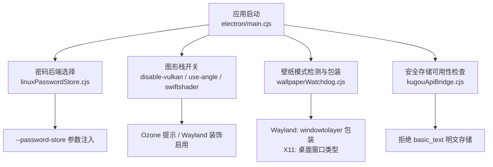
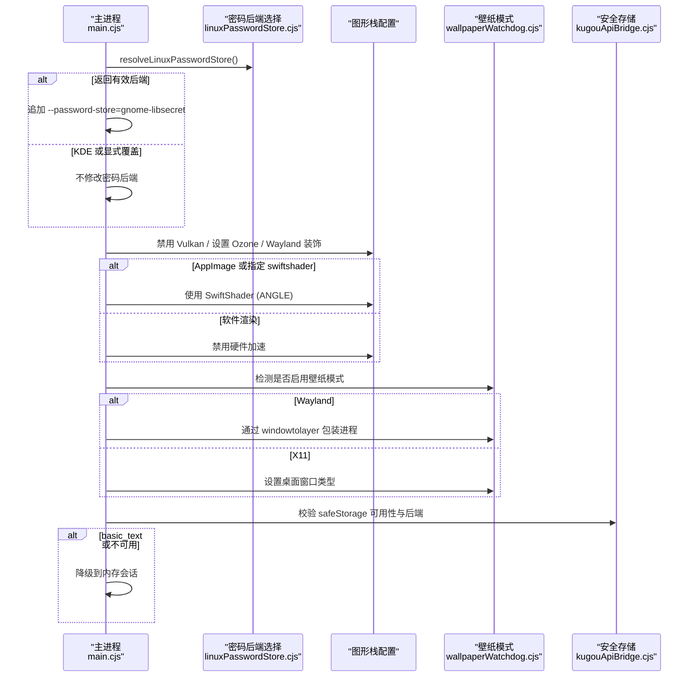
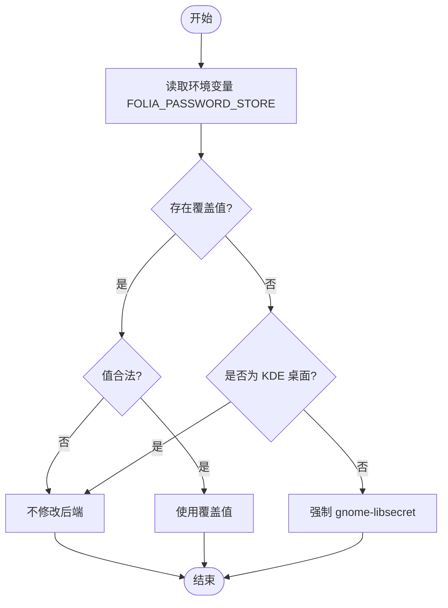
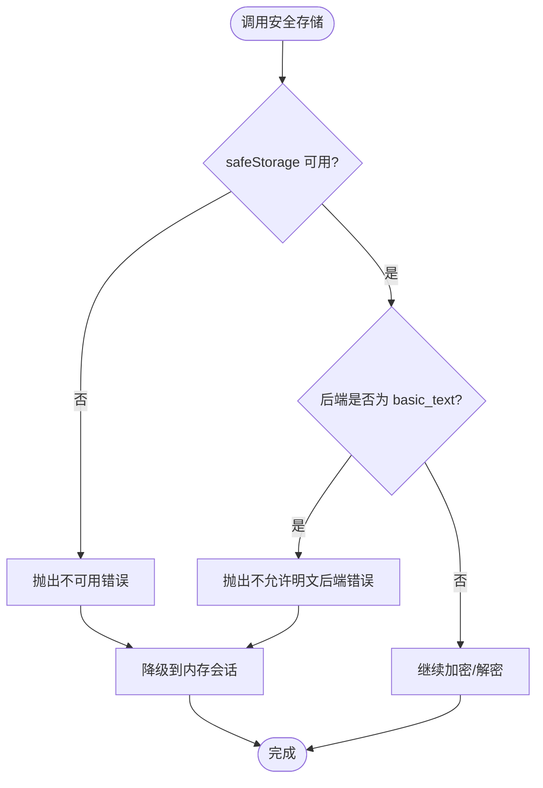
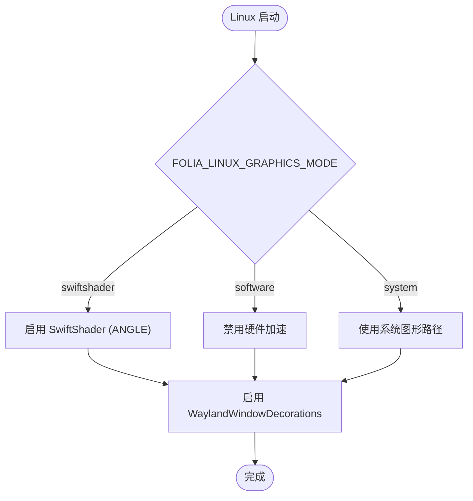
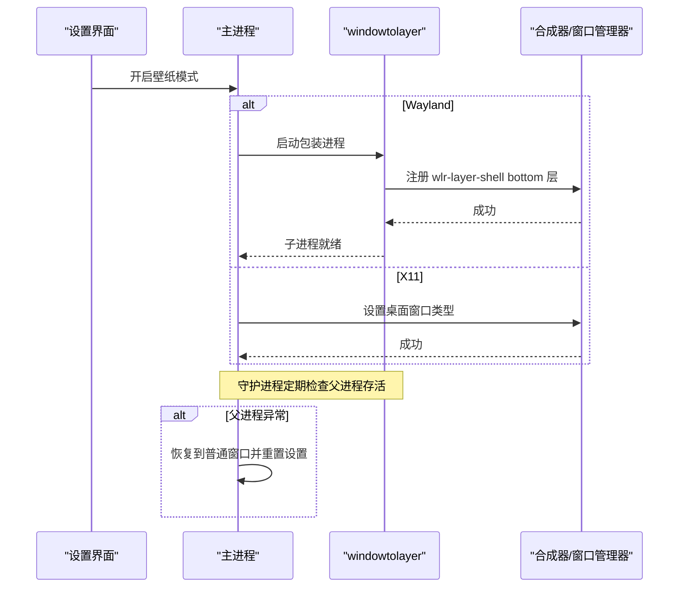
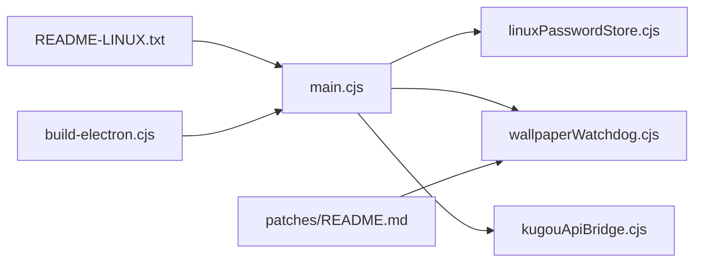

# Linux平台特定实现

<cite>
**本文引用的文件**
- [electron/main.cjs](file://electron/main.cjs)
- [electron/linuxPasswordStore.cjs](file://electron/linuxPasswordStore.cjs)
- [electron/kugouApiBridge.cjs](file://electron/kugouApiBridge.cjs)
- [electron/wallpaperWatchdog.cjs](file://electron/wallpaperWatchdog.cjs)
- [packaging/linux/README-LINUX.txt](file://packaging/linux/README-LINUX.txt)
- [packaging/linux/patches/README.md](file://packaging/linux/patches/README.md)
- [build-electron.cjs](file://build-electron.cjs)
</cite>

## 目录
1. [简介](#简介)
2. [项目结构](#项目结构)
3. [核心组件](#核心组件)
4. [架构总览](#架构总览)
5. [详细组件分析](#详细组件分析)
6. [依赖关系分析](#依赖关系分析)
7. [性能考量](#性能考量)
8. [故障排除指南](#故障排除指南)
9. [结论](#结论)
10. [附录](#附录)

## 简介
本文件聚焦 Folia Player 在 Linux 平台的特定实现，覆盖以下关键主题：
- 桌面环境兼容性：X11 与 Wayland 的差异化处理、壁纸模式（wlr-layer-shell / 桌面窗口）与窗口行为。
- 密码存储后端选择：在 GNOME Keyring、KWallet、Secret Service 等之间自动或受控切换，避免明文存储。
- 图形渲染配置：Vulkan 禁用、SwiftShader 软件渲染、OpenGL 回退策略及 AppImage 运行时的特殊处理。
- 部署考虑：AppImage 打包、权限与文件系统访问、桌面启动项与资源路径。
- 故障排除：针对 Arch Linux、Ubuntu、Fedora 等发行版的常见问题定位与解决建议。

## 项目结构
Linux 相关能力主要分布在 Electron 主进程与打包脚本中：
- 启动期参数注入与图形栈控制：electron/main.cjs
- 密码存储后端选择：electron/linuxPasswordStore.cjs
- 安全存储校验与降级：electron/kugouApiBridge.cjs
- 壁纸模式守护与恢复：electron/wallpaperWatchdog.cjs
- Linux 打包说明与补丁：packaging/linux/*
- 构建入口（绕过证书验证等）：build-electron.cjs

**图表来源**
- [electron/main.cjs:78-105](file://electron/main.cjs#L78-L105)
- [electron/linuxPasswordStore.cjs:34-47](file://electron/linuxPasswordStore.cjs#L34-L47)
- [electron/kugouApiBridge.cjs:51-68](file://electron/kugouApiBridge.cjs#L51-L68)
- [electron/wallpaperWatchdog.cjs:15-25](file://electron/wallpaperWatchdog.cjs#L15-L25)

**章节来源**
- [electron/main.cjs:78-105](file://electron/main.cjs#L78-L105)
- [electron/linuxPasswordStore.cjs:34-47](file://electron/linuxPasswordStore.cjs#L34-L47)
- [electron/kugouApiBridge.cjs:51-68](file://electron/kugouApiBridge.cjs#L51-L68)
- [electron/wallpaperWatchdog.cjs:15-25](file://electron/wallpaperWatchdog.cjs#L15-L25)
- [packaging/linux/README-LINUX.txt:25-33](file://packaging/linux/README-LINUX.txt#L25-L33)

## 核心组件
- 启动期 Linux 适配
  - 在 Chromium 初始化前设置密码存储后端、禁用 Vulkan、配置 Ozone 与 Wayland 特性。
  - 根据环境变量与运行时形态（AppImage）选择 SwiftShader 或系统图形路径。
- 密码存储后端选择
  - 非 KDE 桌面默认强制 gnome-libsecret；KDE 保持 Chromium 自身检测以避免钱包隔离。
  - 支持通过环境变量显式覆盖，或在命令行参数中保留用户自定义。
- 安全存储校验与降级
  - 若 safeStorage 不可用或被选为 basic_text，则拒绝持久化并降级到内存会话。
- 壁纸模式（桌面歌词/背景）
  - Wayland：通过 windowtolayer 将进程包装为 wlr-layer-shell bottom 层表面。
  - X11：主窗口设置为桌面窗口类型，实现“沉底”效果。
  - 提供守护逻辑以检测父进程存活并在异常时恢复到普通窗口。

**章节来源**
- [electron/main.cjs:78-105](file://electron/main.cjs#L78-L105)
- [electron/linuxPasswordStore.cjs:34-47](file://electron/linuxPasswordStore.cjs#L34-L47)
- [electron/kugouApiBridge.cjs:51-68](file://electron/kugouApiBridge.cjs#L51-L68)
- [electron/wallpaperWatchdog.cjs:15-25](file://electron/wallpaperWatchdog.cjs#L15-L25)
- [packaging/linux/README-LINUX.txt:25-41](file://packaging/linux/README-LINUX.txt#L25-L41)

## 架构总览
下图展示了 Linux 启动期的关键决策点与子系统交互：

**图表来源**
- [electron/main.cjs:78-105](file://electron/main.cjs#L78-L105)
- [electron/linuxPasswordStore.cjs:34-47](file://electron/linuxPasswordStore.cjs#L34-L47)
- [electron/kugouApiBridge.cjs:51-68](file://electron/kugouApiBridge.cjs#L51-L68)
- [electron/wallpaperWatchdog.cjs:15-25](file://electron/wallpaperWatchdog.cjs#L15-L25)

## 详细组件分析

### 密码存储后端选择机制
- 目标：在非 KDE 桌面环境下强制使用 libsecret（GNOME Keyring/Secret Service），避免 Chromium 对未知桌面回退到 basic_text 明文存储。
- 规则：
  - 若检测到 KDE 桌面，保持 Chromium 自身检测，避免与 KWallet 隔离。
  - 允许通过环境变量覆盖；当值为 auto 或不合法时，退回默认策略。
  - 若命令行已包含 --password-store，尊重用户显式传入，不自动干预。
- 结果：在大多数 Linux 桌面获得加密持久化；若无 Secret Service 响应，Chromium 报告不可用，上层按既定逻辑降级。

**图表来源**
- [electron/linuxPasswordStore.cjs:34-47](file://electron/linuxPasswordStore.cjs#L34-L47)

**章节来源**
- [electron/linuxPasswordStore.cjs:34-47](file://electron/linuxPasswordStore.cjs#L34-L47)
- [electron/main.cjs:78-85](file://electron/main.cjs#L78-L85)

### 安全存储校验与降级（Kugou/QQ 凭证）
- 目标：确保账户凭据不被写入明文存储；若无法加密则降级到内存会话。
- 行为：
  - 若 safeStorage 不可用或被选为 basic_text，直接抛出错误并阻止持久化。
  - 加载失败或解密失败时记录日志并回退到内存状态，保证当前运行可用。
- 影响：登录流程仍可进行，但重启后不再保留敏感信息，符合最小权限原则。

**图表来源**
- [electron/kugouApiBridge.cjs:51-68](file://electron/kugouApiBridge.cjs#L51-L68)

**章节来源**
- [electron/kugouApiBridge.cjs:51-68](file://electron/kugouApiBridge.cjs#L51-L68)

### 图形渲染配置与回退策略
- 默认策略：
  - 禁用 Vulkan 与相关特性，避免部分发行版/驱动下的兼容性问题。
  - 设置 Ozone 平台提示为 auto，使 Chromium 能正确选择 Wayland/X11 后端。
  - 在 Wayland 下启用原生窗口装饰特性。
- 运行时模式：
  - AppImage 运行时默认使用 SwiftShader（ANGLE），以规避宿主 Vulkan/GPU 栈问题。
  - 可通过环境变量切换到 software（完全软件渲染）或 system（系统图形路径）。
- 影响：提升黑屏、模糊/透明度异常、GPU 崩溃等问题的鲁棒性。

**图表来源**
- [electron/main.cjs:78-105](file://electron/main.cjs#L78-L105)
- [packaging/linux/README-LINUX.txt:25-33](file://packaging/linux/README-LINUX.txt#L25-L33)

**章节来源**
- [electron/main.cjs:78-105](file://electron/main.cjs#L78-L105)
- [packaging/linux/README-LINUX.txt:25-33](file://packaging/linux/README-LINUX.txt#L25-L33)

### 壁纸模式（Wayland/X11）与窗口层级
- Wayland：
  - 通过外部工具 windowtolayer 将进程包装为 wlr-layer-shell bottom 层表面，实现“壁纸级”显示。
  - 对上游进行补丁以增强弹窗/菜单的健壮性，并确保仅主窗口成为壁纸层。
- X11：
  - 将主窗口设置为桌面窗口类型，达到沉底效果。
- 守护与恢复：
  - 监控父进程存活，异常时自动恢复到普通窗口，避免死循环。
  - 记录连续崩溃次数，超过阈值时自动禁用壁纸模式以保护用户体验。

**图表来源**
- [electron/main.cjs:196-226](file://electron/main.cjs#L196-L226)
- [electron/wallpaperWatchdog.cjs:15-25](file://electron/wallpaperWatchdog.cjs#L15-L25)
- [packaging/linux/patches/README.md:1-28](file://packaging/linux/patches/README.md#L1-L28)

**章节来源**
- [electron/main.cjs:196-226](file://electron/main.cjs#L196-L226)
- [electron/wallpaperWatchdog.cjs:15-25](file://electron/wallpaperWatchdog.cjs#L15-L25)
- [packaging/linux/patches/README.md:1-28](file://packaging/linux/patches/README.md#L1-L28)

## 依赖关系分析
- 主进程依赖：
  - linuxPasswordStore.cjs：决定 --password-store 参数。
  - wallpaperWatchdog.cjs：管理壁纸模式的包装与恢复。
  - kugouApiBridge.cjs：校验 safeStorage 并拒绝明文后端。
- 打包与文档：
  - packaging/linux/README-LINUX.txt：说明图形模式与环境变量。
  - packaging/linux/patches/README.md：说明 windowtolayer 补丁来源与目的。
  - build-electron.cjs：构建脚本，用于 electron-builder 集成。

**图表来源**
- [electron/main.cjs:78-105](file://electron/main.cjs#L78-L105)
- [electron/linuxPasswordStore.cjs:34-47](file://electron/linuxPasswordStore.cjs#L34-L47)
- [electron/wallpaperWatchdog.cjs:15-25](file://electron/wallpaperWatchdog.cjs#L15-L25)
- [electron/kugouApiBridge.cjs:51-68](file://electron/kugouApiBridge.cjs#L51-L68)
- [packaging/linux/README-LINUX.txt:25-41](file://packaging/linux/README-LINUX.txt#L25-L41)
- [packaging/linux/patches/README.md:1-28](file://packaging/linux/patches/README.md#L1-L28)
- [build-electron.cjs:1-27](file://build-electron.cjs#L1-L27)

**章节来源**
- [electron/main.cjs:78-105](file://electron/main.cjs#L78-L105)
- [electron/linuxPasswordStore.cjs:34-47](file://electron/linuxPasswordStore.cjs#L34-L47)
- [electron/wallpaperWatchdog.cjs:15-25](file://electron/wallpaperWatchdog.cjs#L15-L25)
- [electron/kugouApiBridge.cjs:51-68](file://electron/kugouApiBridge.cjs#L51-L68)
- [packaging/linux/README-LINUX.txt:25-41](file://packaging/linux/README-LINUX.txt#L25-L41)
- [packaging/linux/patches/README.md:1-28](file://packaging/linux/patches/README.md#L1-L28)
- [build-electron.cjs:1-27](file://build-electron.cjs#L1-L27)

## 性能考量
- 图形栈：
  - 禁用 Vulkan 可减少驱动/合成器差异带来的不稳定开销。
  - SwiftShader 在 AppImage 场景下更稳定，但可能带来 CPU 占用上升；建议在必要时启用。
  - 完全软件渲染适用于最保守场景，但会显著降低渲染性能。
- 壁纸模式：
  - Wayland 下 wlr-layer-shell 通常高效；但若合成器不支持或受限，应回退到普通窗口。
- 安全存储：
  - 拒绝 basic_text 可避免明文读写带来的安全风险；若加密不可用，降级到内存会话减少磁盘 IO。

[本节为通用指导，无需具体文件引用]

## 故障排除指南
- 启动黑屏/模糊/透明度异常/GPU 崩溃
  - 尝试设置 FOLIA_LINUX_GRAPHICS_MODE=swiftshader，优先使用 SwiftShader 渲染。
  - 若仍不稳定，尝试 FOLIA_LINUX_GRAPHICS_MODE=software 进入完全软件渲染。
  - 恢复系统路径：FOLIA_LINUX_GRAPHICS_MODE=system。
  - 调试非标准 AppImage 运行时：ELECTRON_LINUX_PACKAGED_GRAPHICS=true。
- 登录后凭据丢失
  - 确认未处于 KDE 桌面且未被显式覆盖；否则 Chromium 可能选择了 basic_text。
  - 若 safeStorage 不可用或被选为 basic_text，应用会降级到内存会话；请检查系统密钥环服务是否正常运行。
- 壁纸模式无效或崩溃
  - Wayland：确保合成器支持 wlr-layer-shell；检查 windowtolayer 二进制是否存在并可执行。
  - X11：确认桌面窗口类型生效；若失效，应用会自动恢复到普通窗口。
  - 多次崩溃后壁纸模式会被自动禁用，可在设置中重新开启。
- 常见发行版注意
  - Arch Linux：Wayland + Vulkan 组合易出问题，优先使用 SwiftShader。
  - Ubuntu/Fedora：确保系统安装了必要的图形库与密钥环服务；若使用 AppImage，注意资源路径与图标路径的正确性。

**章节来源**
- [packaging/linux/README-LINUX.txt:25-41](file://packaging/linux/README-LINUX.txt#L25-L41)
- [electron/kugouApiBridge.cjs:51-68](file://electron/kugouApiBridge.cjs#L51-L68)
- [electron/wallpaperWatchdog.cjs:15-25](file://electron/wallpaperWatchdog.cjs#L15-L25)

## 结论
Folia Player 在 Linux 平台上通过启动期参数注入、密码后端选择、图形栈回退与壁纸模式包装，提供了跨桌面环境的稳健体验。其设计强调：
- 安全性：拒绝明文存储，优先使用系统密钥环。
- 稳定性：禁用 Vulkan，提供 SwiftShader/软件渲染回退。
- 可维护性：壁纸模式具备守护与自动恢复机制，并对上游工具进行必要补丁。
在实际部署中，结合环境变量与打包说明，可快速定位并解决多数兼容性问题。

[本节为总结，无需具体文件引用]

## 附录
- 环境变量参考
  - FOLIA_LINUX_GRAPHICS_MODE：控制图形渲染模式（swiftshader/software/system）。
  - ELECTRON_LINUX_PACKAGED_GRAPHICS：调试非标准 AppImage 运行时。
  - FOLIA_PASSWORD_STORE：覆盖密码后端（auto/支持的名称/空）。
- 桌面启动项
  - 复制模板到 ~/.local/share/applications/folia-major.desktop，替换占位符路径。
  - 确保图标与可执行文件在同一便携包目录。

**章节来源**
- [packaging/linux/README-LINUX.txt:10-33](file://packaging/linux/README-LINUX.txt#L10-L33)