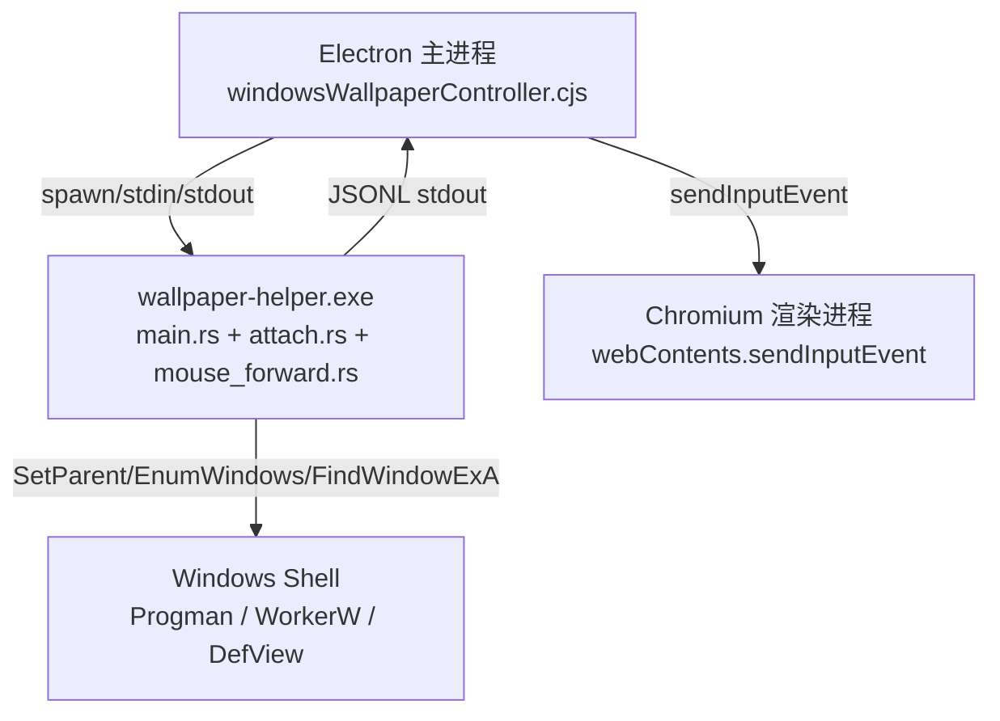
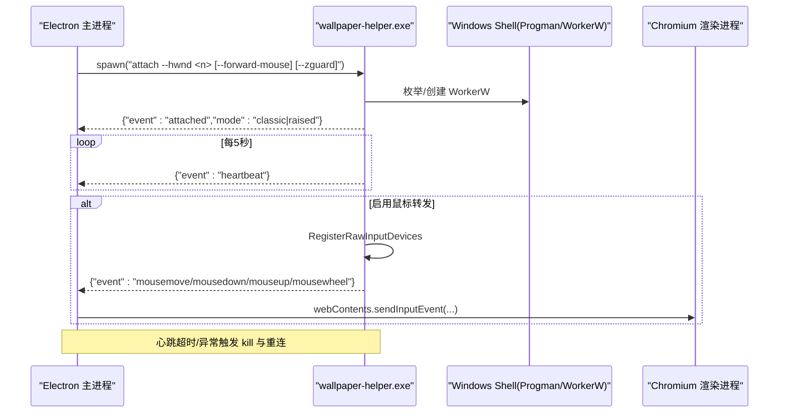
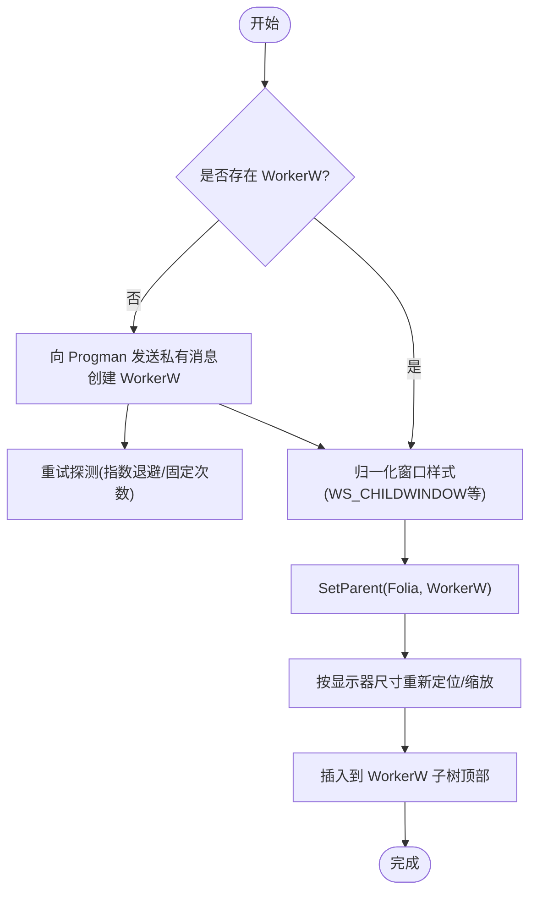
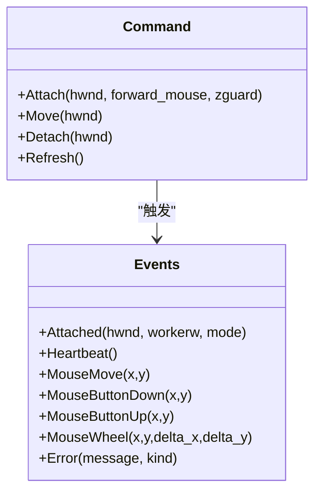
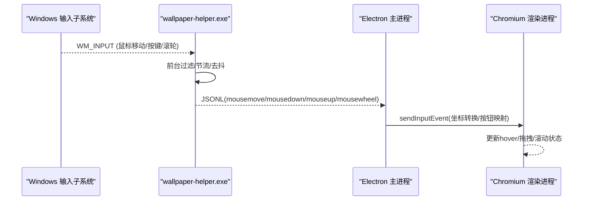
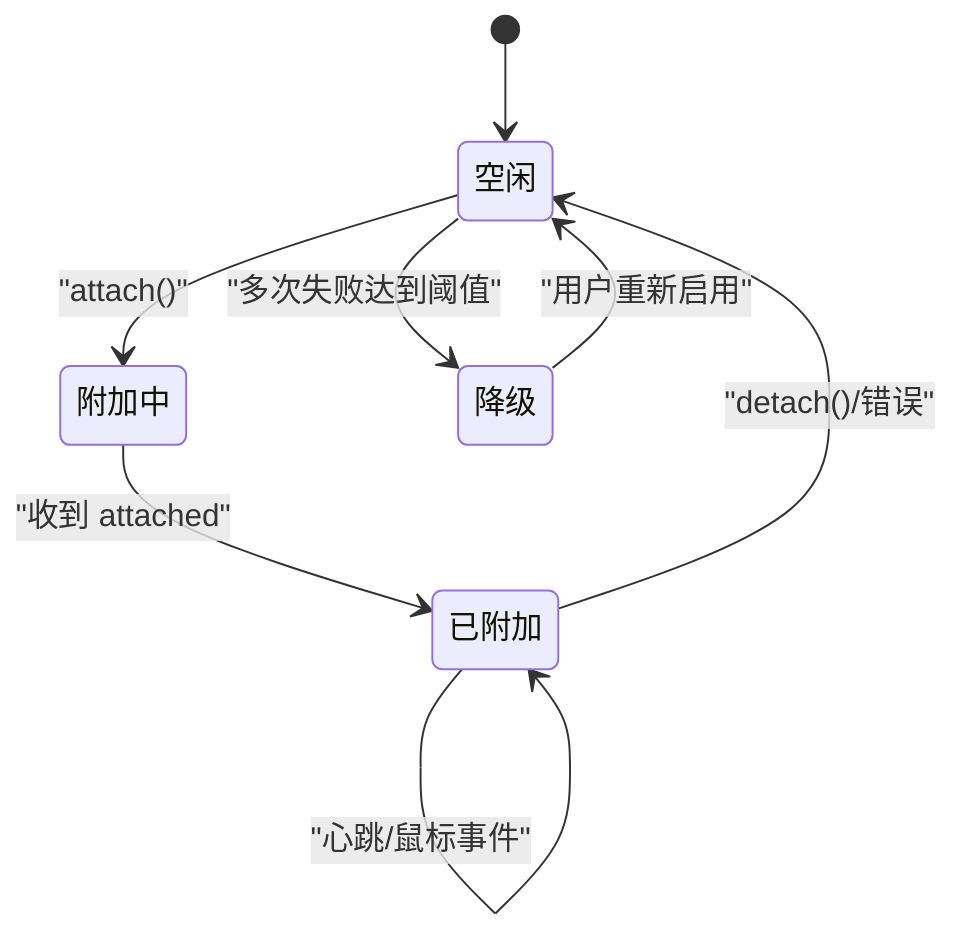
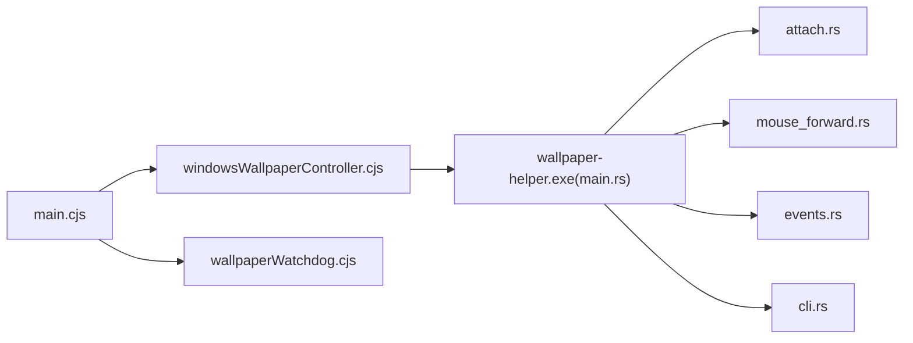

# Windows平台特定实现

<cite>
**本文引用的文件**
- [electron/windowsWallpaperController.cjs](file://electron/windowsWallpaperController.cjs)
- [packaging/windows/wallpaper-helper/src/main.rs](file://packaging/windows/wallpaper-helper/src/main.rs)
- [packaging/windows/wallpaper-helper/src/attach.rs](file://packaging/windows/wallpaper-helper/src/attach.rs)
- [packaging/windows/wallpaper-helper/src/mouse_forward.rs](file://packaging/windows/wallpaper-helper/src/mouse_forward.rs)
- [packaging/windows/wallpaper-helper/src/cli.rs](file://packaging/windows/wallpaper-helper/src/cli.rs)
- [packaging/windows/wallpaper-helper/src/events.rs](file://packaging/windows/wallpaper-helper/src/events.rs)
- [packaging/windows/wallpaper-helper/Cargo.toml](file://packaging/windows/wallpaper-helper/Cargo.toml)
- [electron/wallpaperWatchdog.cjs](file://electron/wallpaperWatchdog.cjs)
- [electron/main.cjs](file://electron/main.cjs)
</cite>

## 目录
1. [简介](#简介)
2. [项目结构](#项目结构)
3. [核心组件](#核心组件)
4. [架构总览](#架构总览)
5. [详细组件分析](#详细组件分析)
6. [依赖关系分析](#依赖关系分析)
7. [性能考量](#性能考量)
8. [故障排除指南](#故障排除指南)
9. [结论](#结论)
10. [附录](#附录)

## 简介
本文件聚焦 Folia Player 在 Windows 平台的壁纸模式实现，系统性解析以下关键技术：
- WorkerW 窗口层级管理与 SetParent API 调用、窗口句柄操作
- Rust 编写的 wallpaper-helper.exe 的编译、部署与进程间通信协议
- 鼠标事件注入系统（Raw Input → JSONL → Electron sendInputEvent）
- Windows 特定的性能优化策略（GPU 加速、内存管理、DPI 处理）
- 常见兼容性问题排查（Win10/Win11差异、透明窗口、任务栏集成等）

## 项目结构
Windows 壁纸模式由两部分组成：
- Electron 主进程侧控制器：负责启动/监控 helper 子进程、解析 JSONL 事件、驱动重连与降级
- Rust 原生 helper：负责探测并挂载到 WorkerW、维护 Z 序、转发桌面鼠标输入、保持会话存活

图表来源
- [electron/windowsWallpaperController.cjs:41-456](file://electron/windowsWallpaperController.cjs#L41-L456)
- [packaging/windows/wallpaper-helper/src/main.rs:24-175](file://packaging/windows/wallpaper-helper/src/main.rs#L24-L175)
- [packaging/windows/wallpaper-helper/src/attach.rs:151-190](file://packaging/windows/wallpaper-helper/src/attach.rs#L151-L190)
- [packaging/windows/wallpaper-helper/src/mouse_forward.rs:103-132](file://packaging/windows/wallpaper-helper/src/mouse_forward.rs#L103-L132)

章节来源
- [electron/windowsWallpaperController.cjs:1-465](file://electron/windowsWallpaperController.cjs#L1-L465)
- [packaging/windows/wallpaper-helper/src/main.rs:1-212](file://packaging/windows/wallpaper-helper/src/main.rs#L1-L212)
- [packaging/windows/wallpaper-helper/src/attach.rs:1-312](file://packaging/windows/wallpaper-helper/src/attach.rs#L1-L312)
- [packaging/windows/wallpaper-helper/src/mouse_forward.rs:1-261](file://packaging/windows/wallpaper-helper/src/mouse_forward.rs#L1-L261)

## 核心组件
- Windows 壁纸控制器（Electron 主进程）
  - 负责启动/终止 helper 子进程、心跳监控、崩溃循环保护、重连调度、设置持久化、鼠标事件透传
- Rust 壁纸助手（wallpaper-helper.exe）
  - 解析命令行参数、探测 WorkerW、将 Folia 窗口父化到 WorkerW、维护几何与 Z 序、可选注册 Raw Input 转发桌面鼠标事件、通过 JSONL 与主进程通信
- 事件协议（events.rs）
  - 定义 attached/heartbeat/mousemove/mousedown/mouseup/mousewheel/error 等事件，作为跨进程契约
- 构建配置（Cargo.toml）
  - 仅目标为 Windows 时启用 Win32 相关特性，Release 开启 strip/LTO/codegen-units=1

章节来源
- [electron/windowsWallpaperController.cjs:41-456](file://electron/windowsWallpaperController.cjs#L41-L456)
- [packaging/windows/wallpaper-helper/src/cli.rs:6-98](file://packaging/windows/wallpaper-helper/src/cli.rs#L6-L98)
- [packaging/windows/wallpaper-helper/src/events.rs:6-44](file://packaging/windows/wallpaper-helper/src/events.rs#L6-L44)
- [packaging/windows/wallpaper-helper/Cargo.toml:1-26](file://packaging/windows/wallpaper-helper/Cargo.toml#L1-L26)

## 架构总览
整体交互时序如下：主进程启动 helper，helper 探测并挂载到 WorkerW，随后持续发送心跳；若启用鼠标转发，则通过 Raw Input 捕获桌面鼠标事件并以 JSONL 上报，主进程将其注入 Chromium 渲染层。

图表来源
- [electron/windowsWallpaperController.cjs:259-354](file://electron/windowsWallpaperController.cjs#L259-L354)
- [packaging/windows/wallpaper-helper/src/main.rs:79-175](file://packaging/windows/wallpaper-helper/src/main.rs#L79-L175)
- [packaging/windows/wallpaper-helper/src/attach.rs:111-190](file://packaging/windows/wallpaper-helper/src/attach.rs#L111-L190)
- [packaging/windows/wallpaper-helper/src/mouse_forward.rs:103-132](file://packaging/windows/wallpaper-helper/src/mouse_forward.rs#L103-L132)

## 详细组件分析

### 组件一：WorkerW 层级管理与窗口挂载
- 探测策略
  - 经典模式（Win10/早期 Win11）：枚举顶层窗口，找到拥有 SHELLDLL_DefView 的子窗口，取其下一个 WorkerW 兄弟
  - 提升桌面模式（Win11 24H2+）：直接查找 Progman 下的 WorkerW，异步等待并重试
- 样式归一化与恢复
  - 挂载前：强制 WS_CHILDWINDOW，去除会干扰壁纸窗口的扩展样式
  - 卸载后：恢复 WS_POPUP 及必要扩展样式，确保窗口回到正常顶层行为
- 几何与 Z 序
  - 使用物理 DPI 上下文计算 monitor 矩形，转换为父窗口客户区坐标后 SetWindowPos
  - 将窗口插入到 WorkerW 子树顶部，保证与其他壁纸软件共存时的可见性
- 关键 API
  - EnumWindows/FindWindowExA/SetParent/SetWindowPos/SystemParametersInfoW 等

图表来源
- [packaging/windows/wallpaper-helper/src/attach.rs:50-119](file://packaging/windows/wallpaper-helper/src/attach.rs#L50-L119)
- [packaging/windows/wallpaper-helper/src/attach.rs:121-190](file://packaging/windows/wallpaper-helper/src/attach.rs#L121-L190)
- [packaging/windows/wallpaper-helper/src/attach.rs:248-298](file://packaging/windows/wallpaper-helper/src/attach.rs#L248-L298)

章节来源
- [packaging/windows/wallpaper-helper/src/attach.rs:50-312](file://packaging/windows/wallpaper-helper/src/attach.rs#L50-L312)

### 组件二：Rust 助手进程生命周期与命令协议
- 命令解析
  - attach/move/detach/refresh，支持 --hwnd、--forward-mouse、--zguard 等参数
- 常驻模式
  - attach 进入常驻：创建消息窗口、挂载到 WorkerW、启动监控（可选 Z 序守护）、可选注册 Raw Input
  - stdin 接收 detach 指令或 EOF，触发安全卸载并刷新桌面壁纸
- 一次性命令
  - move：重新应用几何
  - detach：解父子关系并恢复样式
  - refresh：刷新桌面壁纸
- 事件输出
  - 所有状态变更以 JSONL 形式写入 stdout，供主进程解析

图表来源
- [packaging/windows/wallpaper-helper/src/cli.rs:6-98](file://packaging/windows/wallpaper-helper/src/cli.rs#L6-L98)
- [packaging/windows/wallpaper-helper/src/events.rs:6-44](file://packaging/windows/wallpaper-helper/src/events.rs#L6-L44)
- [packaging/windows/wallpaper-helper/src/main.rs:24-175](file://packaging/windows/wallpaper-helper/src/main.rs#L24-L175)

章节来源
- [packaging/windows/wallpaper-helper/src/cli.rs:1-173](file://packaging/windows/wallpaper-helper/src/cli.rs#L1-L173)
- [packaging/windows/wallpaper-helper/src/main.rs:1-212](file://packaging/windows/wallpaper-helper/src/main.rs#L1-L212)
- [packaging/windows/wallpaper-helper/src/events.rs:1-216](file://packaging/windows/wallpaper-helper/src/events.rs#L1-L216)

### 组件三：鼠标事件注入系统
- 采集路径
  - 通过 RegisterRawInputDevices 在后台接收 WM_INPUT，过滤前台窗口为桌面/图标层/Progman
  - 移动事件节流至约 60Hz，去抖并仅在位置变化时上报
  - 滚轮事件立即上报，区分垂直/水平滚动
- 坐标体系
  - 助手进程 DPI 不感知，GetCursorPos 返回 96-DPI 虚拟像素，与 Electron DIP 空间一致
- 注入方式
  - 主进程收到 JSONL 后，通过 webContents.sendInputEvent 注入到 Chromium，避免直接投递 WM_MOUSEMOVE 导致 TrackMouseEvent 频繁退出 hover
- 双击检测
  - 当前实现未提供双击事件；如需双击，可在主进程基于 mousedown/mouseup 时间差与坐标阈值自行合成

图表来源
- [packaging/windows/wallpaper-helper/src/mouse_forward.rs:40-79](file://packaging/windows/wallpaper-helper/src/mouse_forward.rs#L40-L79)
- [packaging/windows/wallpaper-helper/src/mouse_forward.rs:103-132](file://packaging/windows/wallpaper-helper/src/mouse_forward.rs#L103-L132)
- [packaging/windows/wallpaper-helper/src/mouse_forward.rs:134-261](file://packaging/windows/wallpaper-helper/src/mouse_forward.rs#L134-L261)
- [electron/windowsWallpaperController.cjs:60-70](file://electron/windowsWallpaperController.cjs#L60-L70)

章节来源
- [packaging/windows/wallpaper-helper/src/mouse_forward.rs:1-261](file://packaging/windows/wallpaper-helper/src/mouse_forward.rs#L1-L261)
- [electron/windowsWallpaperController.cjs:60-70](file://electron/windowsWallpaperController.cjs#L60-L70)

### 组件四：主进程控制器与健壮性机制
- 心跳与超时
  - 每 5s 期望收到 heartbeat，超过 15s 视为挂起，kill 并尝试重连
- 崩溃循环保护
  - 记录失败次数，达到阈值后禁用壁纸模式并回调 onDegrade，防止反复重启
- 健康计时器
  - 成功附着并保持一定时长后重置失败计数
- 重连策略
  - 延迟重连，避免频繁重建；必要时触发窗口重建（onReattachNeeded）
- 设置项
  - wallpaper_mode、wallpaper_forward_mouse、wallpaper_zguard 等开关

图表来源
- [electron/windowsWallpaperController.cjs:106-205](file://electron/windowsWallpaperController.cjs#L106-L205)
- [electron/windowsWallpaperController.cjs:207-257](file://electron/windowsWallpaperController.cjs#L207-L257)
- [electron/windowsWallpaperController.cjs:356-445](file://electron/windowsWallpaperController.cjs#L356-L445)

章节来源
- [electron/windowsWallpaperController.cjs:1-465](file://electron/windowsWallpaperController.cjs#L1-L465)

### 组件五：构建与部署
- 构建
  - Cargo.toml 指定 windows-rs 特性，Release 开启 strip/LTO/codegen-units=1 以减小体积并提升性能
- 部署
  - 打包时将二进制置于 resources 或可执行路径下，主进程通过 options.helperPath 解析实际路径
- 调用约定
  - 主进程以 child_process.spawn 启动，stdio 管道传递 JSONL 与 detach 指令

章节来源
- [packaging/windows/wallpaper-helper/Cargo.toml:1-26](file://packaging/windows/wallpaper-helper/Cargo.toml#L1-L26)
- [electron/windowsWallpaperController.cjs:259-354](file://electron/windowsWallpaperController.cjs#L259-L354)

## 依赖关系分析
- 模块耦合
  - main.cjs 引入 wallpaperWatchdog 与 windowsWallpaperController，统一入口控制壁纸模式开关与平台支持
  - windowsWallpaperController 依赖 store、child_process、定时器与回调接口，解耦了具体副作用以便测试
  - Rust 助手内部模块职责清晰：cli 解析、attach 窗口操作、mouse_forward 输入、events 协议、main 编排
- 外部依赖
  - Windows Shell（Progman/WorkerW/DefView）
  - Win32 API（SetParent/EnumWindows/FindWindowExA/SystemParametersInfoW 等）
  - Chromium 渲染层（sendInputEvent）

图表来源
- [electron/main.cjs:12-13](file://electron/main.cjs#L12-L13)
- [electron/windowsWallpaperController.cjs:41-70](file://electron/windowsWallpaperController.cjs#L41-L70)
- [packaging/windows/wallpaper-helper/src/main.rs:9-19](file://packaging/windows/wallpaper-helper/src/main.rs#L9-L19)

章节来源
- [electron/main.cjs:12-13](file://electron/main.cjs#L12-L13)
- [electron/windowsWallpaperController.cjs:41-70](file://electron/windowsWallpaperController.cjs#L41-L70)
- [packaging/windows/wallpaper-helper/src/main.rs:9-19](file://packaging/windows/wallpaper-helper/src/main.rs#L9-L19)

## 性能考量
- GPU 加速
  - macOS 路径有明确的 GPU 加速开关；Windows 路径未在此处显式设置，建议结合 Electron 启动参数按需启用硬件加速与 Rasterization
- 内存管理
  - 助手进程独立运行，JSONL 流式解析避免大缓冲；定时器 unref 降低对进程退出的阻塞
- DPI 处理
  - 助手进程 DPI 不感知，保证 GetCursorPos 与 Electron DIP 一致；窗口几何计算切换到 per-monitor DPI 上下文以避免偏移
- 输入节流
  - 鼠标移动节流至约 60Hz，减少 IPC 与渲染压力；滚轮事件即时上报
- 构建优化
  - Release 开启 strip/LTO/codegen-units=1，减小体积并提升启动速度

[本节为通用指导，不直接分析具体文件]

## 故障排除指南
- Win10/Win11 差异
  - 经典 vs 提升桌面：助手自动探测两种 WorkerW 拓扑；若无法附着，检查 Progman/DefView 是否存在以及是否被第三方 shell 修改
- 透明窗口问题
  - 样式归一化移除了可能影响壁纸显示的边框/接受文件等扩展样式；若出现异常，确认 detach 时已恢复 WS_POPUP 与必要扩展样式
- 任务栏集成
  - 移除 WS_EX_APPWINDOW 等样式可避免出现在任务栏；若需要任务栏条目，需在 detach 后正确恢复
- 鼠标无响应
  - 确认已启用 --forward-mouse，且前台窗口为桌面/图标层/Progman；检查 Raw Input 注册是否成功
- 心跳超时/频繁重连
  - 检查 stderr 日志与 JSONL 事件；若连续失败达到阈值，壁纸模式将被禁用，需手动重新启用
- 窗口重建需求
  - 当收到 window-destroyed 错误时，主进程应重建窗口再重新 attach

章节来源
- [packaging/windows/wallpaper-helper/src/attach.rs:121-200](file://packaging/windows/wallpaper-helper/src/attach.rs#L121-L200)
- [packaging/windows/wallpaper-helper/src/mouse_forward.rs:40-79](file://packaging/windows/wallpaper-helper/src/mouse_forward.rs#L40-L79)
- [electron/windowsWallpaperController.cjs:147-172](file://electron/windowsWallpaperController.cjs#L147-L172)
- [electron/windowsWallpaperController.cjs:237-253](file://electron/windowsWallpaperController.cjs#L237-L253)

## 结论
Folia 的 Windows 壁纸模式通过独立的 Rust 助手进程与 Electron 主进程协作，实现了稳定的 WorkerW 挂载、健壮的会话管理与高效的桌面鼠标事件注入。借助双拓扑探测、心跳与崩溃循环保护、DPI 精确几何计算以及节流化的输入转发，系统在 Win10/Win11 环境下具备良好兼容性与性能。对于复杂场景（如第三方 shell、多显示器、高 DPI），建议结合上述指南进行调优与排障。

## 附录
- 关键设置键
  - wallpaper_mode：启用/禁用壁纸模式
  - wallpaper_forward_mouse：是否转发鼠标事件
  - wallpaper_zguard：是否启用 Z 序守护
- 常用命令
  - attach --hwnd <n> [--forward-mouse] [--zguard]
  - move --hwnd <n>
  - detach --hwnd <n>
  - refresh

章节来源
- [electron/main.cjs:148-151](file://electron/main.cjs#L148-L151)
- [packaging/windows/wallpaper-helper/src/cli.rs:6-98](file://packaging/windows/wallpaper-helper/src/cli.rs#L6-L98)