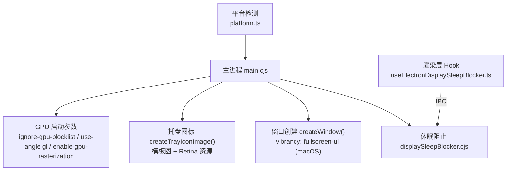
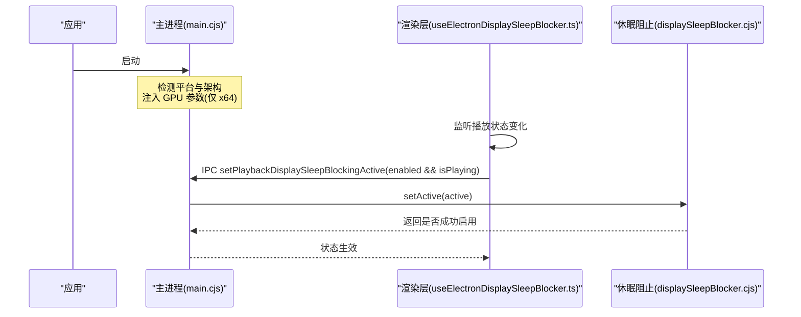
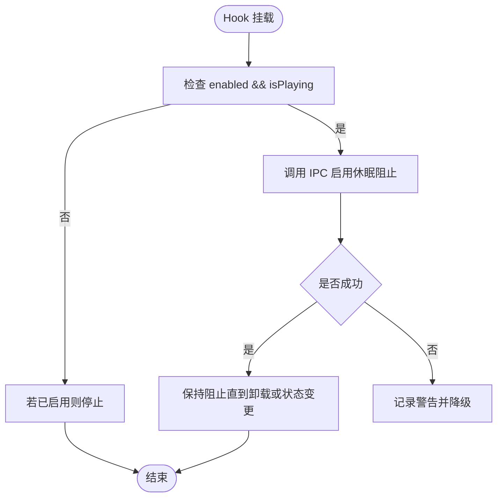
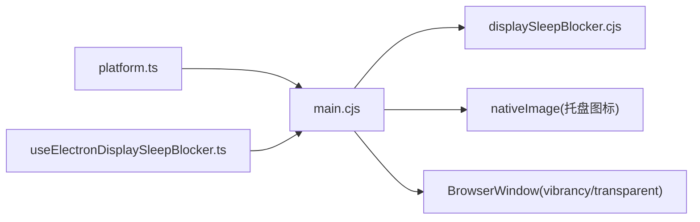

# macOS平台特定实现

<cite>
**本文引用的文件**
- [electron/main.cjs](file://electron/main.cjs)
- [electron/displaySleepBlocker.cjs](file://electron/displaySleepBlocker.cjs)
- [src/hooks/useElectronDisplaySleepBlocker.ts](file://src/hooks/useElectronDisplaySleepBlocker.ts)
- [src/utils/platform.ts](file://src/utils/platform.ts)
</cite>

## 目录
1. [简介](#简介)
2. [项目结构](#项目结构)
3. [核心组件](#核心组件)
4. [架构总览](#架构总览)
5. [详细组件分析](#详细组件分析)
6. [依赖关系分析](#依赖关系分析)
7. [性能考量](#性能考量)
8. [故障排除指南](#故障排除指南)
9. [结论](#结论)

## 简介
本文聚焦 Folia Player 在 macOS 平台的特定实现，重点覆盖以下方面：
- Intel Mac + AMD 独立显卡在 Retina 屏幕下的渲染优化策略与 Chromium 启动参数。
- GPU 加速相关参数的作用与适用场景（如 ignore-gpu-blocklist、use-angle gl、enable-gpu-rasterization）。
- 播放期间阻止系统进入睡眠/息屏的机制与生命周期管理。
- macOS 原生体验增强：菜单栏托盘图标、Dock 行为、窗口毛玻璃效果等。
- 常见问题排查：M 系列芯片支持、沙盒限制、权限管理等。

## 项目结构
macOS 相关的实现主要分布在 Electron 主进程与渲染层桥接处：
- 主进程负责应用启动参数注入、GPU 加速开关、托盘图标构建、窗口创建与显示设置、播放时阻止休眠等。
- 渲染层通过 Hook 将“是否正在播放”的状态同步到主进程，以驱动休眠阻止开关。
- 平台检测统一在工具模块中，保证快捷键提示与交互逻辑在 macOS 上正确映射。

图表来源
- [electron/main.cjs:132-137](file://electron/main.cjs#L132-L137)
- [electron/main.cjs:831-868](file://electron/main.cjs#L831-L868)
- [electron/main.cjs:3872-3874](file://electron/main.cjs#L3872-L3874)
- [electron/displaySleepBlocker.cjs:1-25](file://electron/displaySleepBlocker.cjs#L1-L25)
- [src/hooks/useElectronDisplaySleepBlocker.ts:1-15](file://src/hooks/useElectronDisplaySleepBlocker.ts#L1-L15)
- [src/utils/platform.ts:1-24](file://src/utils/platform.ts#L1-L24)

章节来源
- [electron/main.cjs:132-137](file://electron/main.cjs#L132-L137)
- [electron/main.cjs:831-868](file://electron/main.cjs#L831-L868)
- [electron/main.cjs:3872-3874](file://electron/main.cjs#L3872-L3874)
- [electron/displaySleepBlocker.cjs:1-25](file://electron/displaySleepBlocker.cjs#L1-L25)
- [src/hooks/useElectronDisplaySleepBlocker.ts:1-15](file://src/hooks/useElectronDisplaySleepBlocker.ts#L1-L15)
- [src/utils/platform.ts:1-24](file://src/utils/platform.ts#L1-L24)

## 核心组件
- GPU 加速参数注入：针对 Intel Mac + AMD 独显在 Retina 下出现的渲染卡顿，启用忽略 GPU 黑名单、使用 ANGLE GL 后端以及开启 GPU 光栅化。
- 休眠阻止器：基于 powerSaveBlocker 的防息屏能力，按播放状态启停，避免重复创建或遗漏释放。
- 托盘图标：macOS 使用模板图并叠加 @2x 资源，确保高分屏清晰；同时标记为模板图像以适配系统主题。
- 窗口毛玻璃：在 macOS 上启用 vibrancy fullscreen-ui 以获得原生模糊背景效果（需配合透明/毛玻璃设置）。
- 平台检测：统一通过 userAgent 判断是否为 macOS，用于快捷键修饰键与 UI 提示一致性。

章节来源
- [electron/main.cjs:132-137](file://electron/main.cjs#L132-L137)
- [electron/displaySleepBlocker.cjs:1-25](file://electron/displaySleepBlocker.cjs#L1-L25)
- [electron/main.cjs:831-868](file://electron/main.cjs#L831-L868)
- [electron/main.cjs:3872-3874](file://electron/main.cjs#L3872-L3874)
- [src/utils/platform.ts:1-24](file://src/utils/platform.ts#L1-L24)

## 架构总览
下图展示了 macOS 平台关键流程：主进程在启动时为 Intel+AMD 环境注入 GPU 参数；渲染层根据播放状态通过 IPC 通知主进程启用/停止休眠阻止；托盘图标与窗口外观在 macOS 上采用原生风格。

图表来源
- [electron/main.cjs:132-137](file://electron/main.cjs#L132-L137)
- [src/hooks/useElectronDisplaySleepBlocker.ts:1-15](file://src/hooks/useElectronDisplaySleepBlocker.ts#L1-L15)
- [electron/displaySleepBlocker.cjs:1-25](file://electron/displaySleepBlocker.cjs#L1-L25)

## 详细组件分析

### GPU 加速与 Retina 渲染优化（Intel Mac + AMD）
- 触发条件：仅在 macOS 且架构为 x64 时启用，避免对 Apple Silicon 产生不必要影响。
- 关键参数：
  - ignore-gpu-blocklist：允许被 Chromium 默认屏蔽的 GPU/驱动组合继续走 GPU 路径。
  - use-angle gl：强制使用 ANGLE 的 GL 后端，改善某些 AMD 驱动在 macOS 上的兼容性与稳定性。
  - enable-gpu-rasterization：启用 GPU 光栅化，提升复杂页面与高分屏渲染效率。
- 目的：缓解 Intel Mac + AMD 独显在 Retina 屏幕下的渲染卡顿与掉帧问题。

章节来源
- [electron/main.cjs:132-137](file://electron/main.cjs#L132-L137)

### 显示睡眠阻止机制
- 设计要点：
  - 幂等性：同一生命周期内多次启用不会重复创建 blockerId；停用会安全释放。
  - 状态同步：渲染层根据“功能开关 + 播放状态”决定是否请求启用；卸载时主动关闭，防止残留。
- 调用链：
  - 渲染层 Hook 在 useEffect 中调用 window.electron.setPlaybackDisplaySleepBlockingActive。
  - 主进程通过 powerSaveBlocker.start('prevent-display-sleep') 启用，isStarted 校验后 stop 释放。

图表来源
- [src/hooks/useElectronDisplaySleepBlocker.ts:1-15](file://src/hooks/useElectronDisplaySleepBlocker.ts#L1-L15)
- [electron/displaySleepBlocker.cjs:1-25](file://electron/displaySleepBlocker.cjs#L1-L25)

章节来源
- [src/hooks/useElectronDisplaySleepBlocker.ts:1-15](file://src/hooks/useElectronDisplaySleepBlocker.ts#L1-L15)
- [electron/displaySleepBlocker.cjs:1-25](file://electron/displaySleepBlocker.cjs#L1-L25)

### 菜单栏集成与 Dock 图标处理
- 托盘图标：
  - macOS 使用模板图（单色），并附加 @2x 资源以适配 Retina。
  - 通过 nativeImage.addRepresentation 添加高分辨率表示，并调用 setTemplateImage(true) 使图标跟随系统主题。
- Dock 行为：
  - 通过 skipTaskbar 控制是否在 Dock 显示（macOS 下等效行为由系统决定，代码中仍保留该选项以便跨平台一致）。
  - 点击托盘图标可切换主窗口可见性，便于隐藏主窗口但保留后台播放。

章节来源
- [electron/main.cjs:831-868](file://electron/main.cjs#L831-L868)
- [electron/main.cjs:1426-1500](file://electron/main.cjs#L1426-L1500)

### 原生体验增强：窗口毛玻璃与透明背景
- 在 macOS 上，当启用“原生模糊”时，窗口创建会使用 vibrancy: 'fullscreen-ui'，获得系统级毛玻璃效果。
- 透明背景与毛玻璃互斥：透明背景优先，毛玻璃在满足条件时启用。
- 注意：壁纸模式（非 macOS）与透明/毛玻璃存在平台差异，macOS 下遵循系统合成器规则。

章节来源
- [electron/main.cjs:3872-3874](file://electron/main.cjs#L3872-L3874)

### 平台检测与快捷键适配
- 通过 userAgent 判断 macOS，确保快捷键提示与修饰键行为一致（Cmd/Ctrl 映射）。
- PRIMARY_MODIFIER_LABEL 在 macOS 显示为 Cmd，提升用户可读性。

章节来源
- [src/utils/platform.ts:1-24](file://src/utils/platform.ts#L1-L24)

## 依赖关系分析
- 主进程依赖：
  - electron/powerSaveBlocker：提供系统级防息屏能力。
  - electron/nativeImage：构建 macOS 托盘模板图与高分辨率资源。
  - electron/BrowserWindow：创建窗口并配置 vibrancy、transparent、skipTaskbar 等。
- 渲染层依赖：
  - React Hook：useEffect 管理生命周期，确保启用/禁用休眠阻止的时机正确。
  - IPC 通道：window.electron.setPlaybackDisplaySleepBlockingActive 与主进程通信。

图表来源
- [src/utils/platform.ts:1-24](file://src/utils/platform.ts#L1-L24)
- [src/hooks/useElectronDisplaySleepBlocker.ts:1-15](file://src/hooks/useElectronDisplaySleepBlocker.ts#L1-L15)
- [electron/main.cjs:831-868](file://electron/main.cjs#L831-L868)
- [electron/main.cjs:3872-3874](file://electron/main.cjs#L3872-L3874)
- [electron/displaySleepBlocker.cjs:1-25](file://electron/displaySleepBlocker.cjs#L1-L25)

章节来源
- [src/utils/platform.ts:1-24](file://src/utils/platform.ts#L1-L24)
- [src/hooks/useElectronDisplaySleepBlocker.ts:1-15](file://src/hooks/useElectronDisplaySleepBlocker.ts#L1-L15)
- [electron/main.cjs:831-868](file://electron/main.cjs#L831-L868)
- [electron/main.cjs:3872-3874](file://electron/main.cjs#L3872-L3874)
- [electron/displaySleepBlocker.cjs:1-25](file://electron/displaySleepBlocker.cjs#L1-L25)

## 性能考量
- GPU 光栅化与 ANGLE GL 后端可降低复杂动画与高分屏渲染压力，减少 CPU 占用与掉帧。
- 休眠阻止仅在播放期间启用，避免长时间占用系统电源策略。
- 托盘图标模板图与 @2x 资源兼顾清晰度与内存占用。
- 窗口毛玻璃在 macOS 上由系统合成器处理，通常比自定义模糊更省电。

[本节为通用指导，不直接分析具体文件]

## 故障排除指南
- Intel Mac + AMD 独显在 Retina 下仍卡顿：
  - 确认运行架构为 x64（Apple Silicon 未启用该分支）。
  - 检查是否启用了 ignore-gpu-blocklist、use-angle gl、enable-gpu-rasterization。
  - 尝试更新 AMD 驱动或调整系统图形设置。
- 播放时系统仍进入休眠：
  - 确认“播放期间阻止休眠”设置已开启。
  - 检查渲染层 Hook 是否正确调用 IPC，并在卸载时关闭。
  - 查看主进程 powerSaveBlocker 是否成功 start/isStarted。
- 托盘图标模糊或不清晰：
  - 确认模板图与 @2x 资源存在且未被覆盖。
  - 检查 setTemplateImage 是否调用成功。
- 窗口毛玻璃无效：
  - 确认“原生模糊”设置已启用且未与透明背景冲突。
  - 检查 vibrancy 值在 macOS 上是否为 fullscreen-ui。
- M 系列芯片（Apple Silicon）相关问题：
  - 当前 GPU 优化分支仅针对 x64；如需在 ARM 上进一步优化，建议评估 WebGPU/Metal 后端或后续 Electron 版本特性。
- 沙盒与权限：
  - 若应用受沙盒限制，部分系统 API（如 powerSaveBlocker、托盘）可能受限；请检查打包配置与权限声明。
  - 文件系统访问、字体访问、剪贴板写入等权限需在主进程中正确处理。

章节来源
- [electron/main.cjs:132-137](file://electron/main.cjs#L132-L137)
- [electron/displaySleepBlocker.cjs:1-25](file://electron/displaySleepBlocker.cjs#L1-L25)
- [electron/main.cjs:831-868](file://electron/main.cjs#L831-L868)
- [electron/main.cjs:3872-3874](file://electron/main.cjs#L3872-L3874)
- [src/hooks/useElectronDisplaySleepBlocker.ts:1-15](file://src/hooks/useElectronDisplaySleepBlocker.ts#L1-L15)

## 结论
Folia Player 在 macOS 平台上通过精准的 GPU 启动参数注入、播放期休眠阻止、原生托盘图标与窗口毛玻璃等特性，显著提升了 Intel Mac + AMD 独显在 Retina 环境下的渲染体验与系统融合度。对于 Apple Silicon 用户，当前 GPU 优化分支未启用，建议在后续版本中结合 Metal/WebGPU 进一步探索。遇到兼容性问题时，可依据本文的故障排除指南逐步定位与解决。