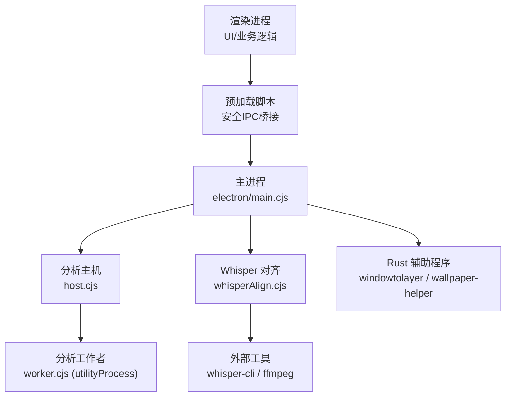
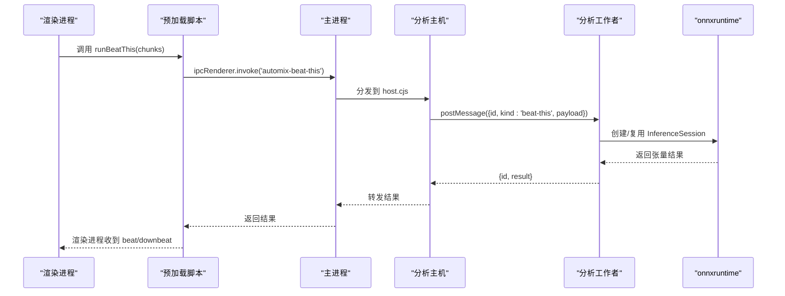
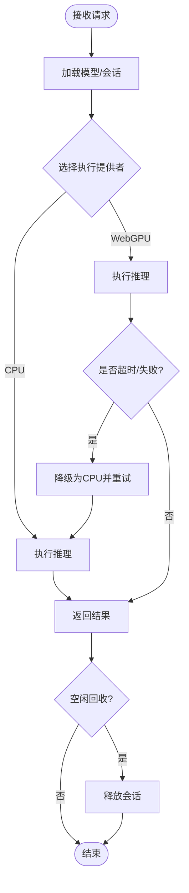
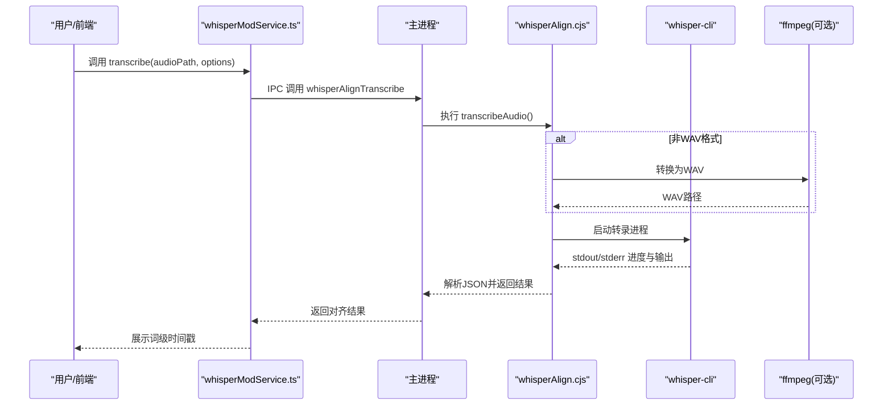
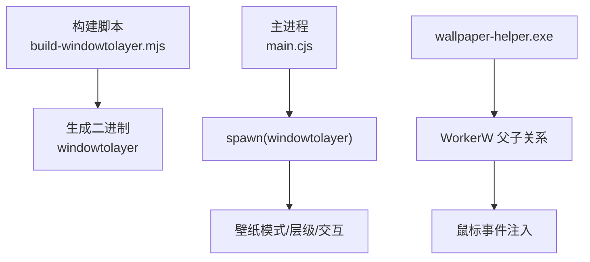
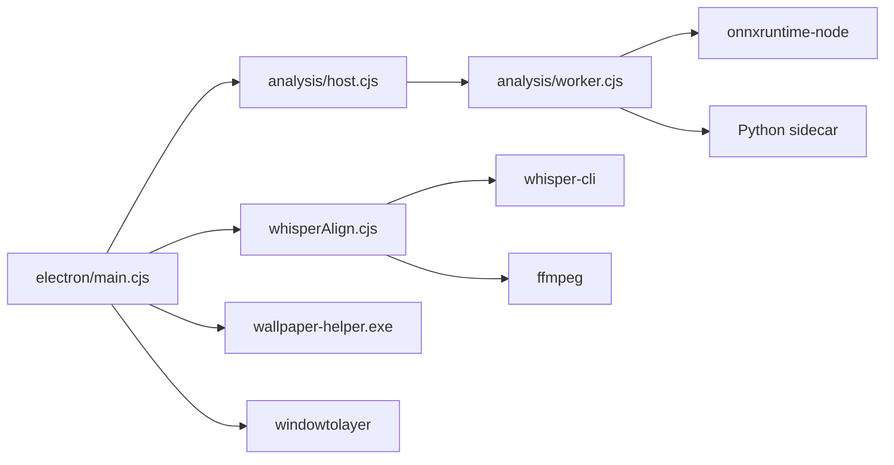

# 原生模块集成

<cite>
**本文引用的文件**
- [package.json](file://package.json)
- [electron/main.cjs](file://electron/main.cjs)
- [electron/preload.cjs](file://electron/preload.cjs)
- [electron/analysis/host.cjs](file://electron/analysis/host.cjs)
- [electron/analysis/worker.cjs](file://electron/analysis/worker.cjs)
- [electron/analysis/modelPaths.cjs](file://electron/analysis/modelPaths.cjs)
- [electron/whisperAlign.cjs](file://electron/whisperAlign.cjs)
- [packaging/linux/build-windowtolayer.mjs](file://packaging/linux/build-windowtolayer.mjs)
- [packaging/windows/wallpaper-helper/Cargo.toml](file://packaging/windows/wallpaper-helper/Cargo.toml)
- [mods/whisper-align/index.cjs](file://mods/whisper-align/index.cjs)
- [src/services/whisperModService.ts](file://src/services/whisperModService.ts)
</cite>

## 目录
1. [简介](#简介)
2. [项目结构](#项目结构)
3. [核心组件](#核心组件)
4. [架构总览](#架构总览)
5. [详细组件分析](#详细组件分析)
6. [依赖关系分析](#依赖关系分析)
7. [性能考量](#性能考量)
8. [故障排除指南](#故障排除指南)
9. [结论](#结论)
10. [附录](#附录)

## 简介
本文件面向 Folia Player 的原生模块集成，聚焦以下目标：
- Node.js 原生模块加载机制（动态库、进程隔离、生命周期管理、错误处理）
- 多语言扩展的编译与部署（Rust、C++、Python 等）
- 进程间通信（IPC 通道、消息传递、数据序列化）
- 性能优化策略（内存管理、线程池、异步处理）
- 故障排除（依赖缺失、版本不兼容、内存泄漏等）

Folia 采用 Electron 作为宿主，通过主进程、预加载脚本、渲染进程以及独立的 utilityProcess/子进程协同工作，将重型计算与系统级能力下沉到原生或外部进程中，保证 UI 流畅与资源可控。

## 项目结构
围绕“原生模块”的关键位置与职责如下：
- electron/main.cjs：Electron 主进程入口，负责窗口、协议、平台特性、壁纸模式、更新、本地化、IPC 注册等；同时启动分析子系统与 Whisper 对齐服务。
- electron/preload.cjs：向渲染进程暴露安全的 IPC API，屏蔽底层实现细节。
- electron/analysis/*：分析子系统的 host/worker 分离，使用 utilityProcess 运行 ONNX 推理，避免阻塞主进程事件循环。
- electron/whisperAlign.cjs：Whisper 词级歌词对齐，调用外部 whisper-cli 与 ffmpeg，进行音频下载、转码、转录与结果解析。
- packaging/*：Linux 下 windowtolayer（Rust）构建脚本；Windows 下 wallpaper-helper（Rust）工程配置。
- mods/whisper-align/index.cjs：以 Mod 方式封装 Whisper 能力，提供统一命令接口。
- src/services/whisperModService.ts：前端侧调用 Mod 或直接走 IPC 的统一服务层。

图表来源
- [electron/main.cjs:1-120](file://electron/main.cjs#L1-L120)
- [electron/analysis/host.cjs:50-126](file://electron/analysis/host.cjs#L50-L126)
- [electron/analysis/worker.cjs:240-284](file://electron/analysis/worker.cjs#L240-L284)
- [electron/whisperAlign.cjs:282-390](file://electron/whisperAlign.cjs#L282-L390)
- [packaging/linux/build-windowtolayer.mjs:53-68](file://packaging/linux/build-windowtolayer.mjs#L53-L68)
- [packaging/windows/wallpaper-helper/Cargo.toml:1-26](file://packaging/windows/wallpaper-helper/Cargo.toml#L1-L26)

章节来源
- [package.json:13-47](file://package.json#L13-L47)
- [electron/main.cjs:1-120](file://electron/main.cjs#L1-L120)
- [electron/preload.cjs:1-120](file://electron/preload.cjs#L1-L120)

## 核心组件
- 分析子系统（beat_this/htdemucs）
  - host.cjs：创建并维护 worker 进程，设置空闲回收、超时保护、重试与日志转发。
  - worker.cjs：加载 onnxruntime-node，选择执行提供者（CPU/WebGPU），队列串行化请求，释放会话控制内存。
  - modelPaths.cjs：模型与 Python 运行时路径解析，用于“是否可用”的快速判断。
- Whisper 对齐
  - whisperAlign.cjs：管理模型下载、ffmpeg 检测、音频转码、whisper-cli 调用、输出解析、任务取消与状态查询。
  - mods/whisper-align/index.cjs：以 Mod 形式暴露 prepare/fetch/transcribe 等命令，便于前端统一调用。
  - src/services/whisperModService.ts：前端侧统一调用链，支持 base64 二进制序列化与回退策略。
- 平台原生辅助
  - Linux windowtolayer：Rust 构建脚本，生成可执行程序，配合主进程在 Wayland/X11 下启用壁纸模式。
  - Windows wallpaper-helper：Rust 程序，负责 WorkerW 父子关系与鼠标输入注入，主进程通过 spawn 调用。

章节来源
- [electron/analysis/host.cjs:50-205](file://electron/analysis/host.cjs#L50-L205)
- [electron/analysis/worker.cjs:1-120](file://electron/analysis/worker.cjs#L1-L120)
- [electron/analysis/modelPaths.cjs:49-79](file://electron/analysis/modelPaths.cjs#L49-L79)
- [electron/whisperAlign.cjs:45-177](file://electron/whisperAlign.cjs#L45-L177)
- [mods/whisper-align/index.cjs:208-241](file://mods/whisper-align/index.cjs#L208-L241)
- [src/services/whisperModService.ts:210-237](file://src/services/whisperModService.ts#L210-L237)
- [packaging/linux/build-windowtolayer.mjs:53-68](file://packaging/linux/build-windowtolayer.mjs#L53-L68)
- [packaging/windows/wallpaper-helper/Cargo.toml:1-26](file://packaging/windows/wallpaper-helper/Cargo.toml#L1-L26)

## 架构总览
整体采用“主进程 + 预加载桥 + 渲染进程 + 独立计算进程/外部工具”的分层架构：
- 渲染进程通过 preload 暴露的 API 发起请求（如自动混音、Whisper 对齐）。
- 主进程根据能力路由到不同子系统：
  - 分析子系统：通过 utilityProcess 隔离 onnxruntime 的同步阻塞风险，保障 UI 响应。
  - Whisper 对齐：通过 child_process 调用 whisper-cli/ffmpeg，完成音频处理与转录。
  - 平台功能：通过 spawn 调用 Rust 辅助程序，实现壁纸模式与输入转发。
- 所有跨进程数据通过 IPC 或命令行参数传递，必要时进行二进制序列化（base64）。

图表来源
- [electron/preload.cjs:9-16](file://electron/preload.cjs#L9-L16)
- [electron/analysis/host.cjs:113-153](file://electron/analysis/host.cjs#L113-L153)
- [electron/analysis/worker.cjs:310-337](file://electron/analysis/worker.cjs#L310-L337)

章节来源
- [electron/preload.cjs:1-120](file://electron/preload.cjs#L1-L120)
- [electron/analysis/host.cjs:50-205](file://electron/analysis/host.cjs#L50-L205)
- [electron/analysis/worker.cjs:240-457](file://electron/analysis/worker.cjs#L240-L457)

## 详细组件分析

### 分析子系统（ONNX 推理）
- 设计要点
  - 隔离：通过 utilityProcess 运行 worker.cjs，避免 onnxruntime 的同步 N-API 调用阻塞主进程事件循环。
  - 线程与提供者：按模型选择执行提供者（WebGPU/CPU），限制线程数以避免争用。
  - 内存管理：显式 release 会话，空闲回收，避免长期驻留占用大量内存。
  - 容错：GPU 提供者异常或超时降级为 CPU，并在进程内标记 pinnedToCpu。
- 关键流程
  - host.cjs 负责 fork worker、消息路由、空闲回收、超时保护与重启。
  - worker.cjs 负责模型加载、会话缓存、请求队列、结果返回。

图表来源
- [electron/analysis/worker.cjs:147-238](file://electron/analysis/worker.cjs#L147-L238)
- [electron/analysis/worker.cjs:240-337](file://electron/analysis/worker.cjs#L240-L337)
- [electron/analysis/host.cjs:113-171](file://electron/analysis/host.cjs#L113-L171)

章节来源
- [electron/analysis/host.cjs:50-205](file://electron/analysis/host.cjs#L50-L205)
- [electron/analysis/worker.cjs:1-120](file://electron/analysis/worker.cjs#L1-L120)
- [electron/analysis/modelPaths.cjs:49-79](file://electron/analysis/modelPaths.cjs#L49-L79)

### Whisper 对齐（外部工具集成）
- 设计要点
  - 外部工具：whisper-cli（可选安装）、ffmpeg（可选，用于格式转换）。
  - 模型管理：从用户目录或应用资源目录查找 ggml-*.bin，支持下载与镜像回退。
  - 任务管理：activeJobs 记录进程句柄，支持取消与清理临时文件。
  - 输出解析：兼容多种 JSON 结构，提取片段与词级时间戳。
- 关键流程
  - 初始化：定位 whisper-cli 与 ffmpeg，准备模型目录。
  - 转录：校验音频、可选转码、构造参数、spawn 子进程、读取进度与输出。
  - 取消：发送信号终止进程，清理临时文件。

图表来源
- [electron/whisperAlign.cjs:282-537](file://electron/whisperAlign.cjs#L282-L537)
- [mods/whisper-align/index.cjs:208-241](file://mods/whisper-align/index.cjs#L208-L241)
- [src/services/whisperModService.ts:210-237](file://src/services/whisperModService.ts#L210-L237)

章节来源
- [electron/whisperAlign.cjs:45-177](file://electron/whisperAlign.cjs#L45-L177)
- [electron/whisperAlign.cjs:282-537](file://electron/whisperAlign.cjs#L282-L537)
- [mods/whisper-align/index.cjs:208-241](file://mods/whisper-align/index.cjs#L208-L241)
- [src/services/whisperModService.ts:210-237](file://src/services/whisperModService.ts#L210-L237)

### 平台原生辅助（Rust 程序）
- Linux windowtolayer
  - 构建脚本检查 git/cargo，拉取源码并打补丁，生成二进制供主进程 spawn。
  - 主进程在 Wayland/X11 下通过环境变量与参数控制层级与交互性。
- Windows wallpaper-helper
  - Rust 工程配置包含 Windows 特定依赖与发布优化（strip/LTO）。
  - 主进程通过 spawn 调用，负责 WorkerW 父子关系与鼠标事件注入。

图表来源
- [packaging/linux/build-windowtolayer.mjs:53-68](file://packaging/linux/build-windowtolayer.mjs#L53-L68)
- [packaging/windows/wallpaper-helper/Cargo.toml:1-26](file://packaging/windows/wallpaper-helper/Cargo.toml#L1-L26)
- [electron/main.cjs:183-226](file://electron/main.cjs#L183-L226)

章节来源
- [packaging/linux/build-windowtolayer.mjs:23-68](file://packaging/linux/build-windowtolayer.mjs#L23-L68)
- [packaging/windows/wallpaper-helper/Cargo.toml:1-26](file://packaging/windows/wallpaper-helper/Cargo.toml#L1-L26)
- [electron/main.cjs:183-226](file://electron/main.cjs#L183-L226)

## 依赖关系分析
- 主进程依赖
  - Electron 内置模块：app、BrowserWindow、ipcMain、protocol、net 等。
  - 内部模块：stageApi、modSystem、wallpaperWatchdog、windowsWallpaperController、kugouApiBridge、qqAuthSessionRepository、discordPresence、voiceInputPause、displaySleepBlocker、lyricApi、localCoverAssets、updateChannels、audioCachePrune、analysis、debug、modelStore、linuxPasswordStore、themeSanitizer、whisperAlign。
- 分析子系统依赖
  - onnxruntime-node（N-API 绑定），Python sidecar（htdemucs 分离）。
  - 模型与运行时路径由 modelPaths.cjs 解析。
- Whisper 对齐依赖
  - child_process 调用 whisper-cli/ffmpeg。
  - 文件系统、网络模块用于模型与音频下载。
- 平台辅助依赖
  - Rust 程序通过 cargo 构建，主进程通过 spawn 调用。

图表来源
- [electron/main.cjs:1-29](file://electron/main.cjs#L1-L29)
- [electron/analysis/host.cjs:50-126](file://electron/analysis/host.cjs#L50-L126)
- [electron/analysis/worker.cjs:240-393](file://electron/analysis/worker.cjs#L240-L393)
- [electron/whisperAlign.cjs:282-390](file://electron/whisperAlign.cjs#L282-L390)

章节来源
- [electron/main.cjs:1-120](file://electron/main.cjs#L1-L120)
- [electron/analysis/host.cjs:50-205](file://electron/analysis/host.cjs#L50-L205)
- [electron/analysis/worker.cjs:1-120](file://electron/analysis/worker.cjs#L1-L120)
- [electron/whisperAlign.cjs:45-177](file://electron/whisperAlign.cjs#L45-L177)

## 性能考量
- 进程隔离与事件循环保护
  - 分析子系统通过 utilityProcess 隔离 onnxruntime 的同步阻塞，避免主进程卡顿。
  - 对 GPU 提供者设置超时与降级策略，防止长时间占用导致 UI 冻结。
- 线程与并发控制
  - 限制 intraOpNumThreads，避免多线程争用导致性能下降。
  - 分析工作者内部队列串行化请求，确保资源有序使用。
- 内存管理
  - 显式 release 会话，空闲回收，避免长期驻留占用内存。
  - htdemucs 通过 Python sidecar 进程退出释放内存，降低峰值 RSS。
- I/O 与序列化
  - Whisper 对齐中二进制数据通过 base64 序列化传输，注意大对象开销；必要时考虑分块或流式方案。
- 平台优化
  - Linux 图形模式与 Wayland/X11 差异处理，减少渲染问题。
  - Windows 壁纸模式通过原生辅助程序提升稳定性与交互体验。

章节来源
- [electron/analysis/worker.cjs:32-88](file://electron/analysis/worker.cjs#L32-L88)
- [electron/analysis/worker.cjs:147-238](file://electron/analysis/worker.cjs#L147-L238)
- [electron/analysis/host.cjs:16-40](file://electron/analysis/host.cjs#L16-L40)
- [electron/whisperAlign.cjs:210-237](file://electron/whisperAlign.cjs#L210-L237)

## 故障排除指南
- 依赖缺失
  - whisper-cli 未找到：检查 PATH 或安装 whisper.cpp；参考错误提示中的安装指引。
  - ffmpeg 不可用：无法自动转换音频格式，建议安装 ffmpeg 以获得最佳兼容性。
  - 模型未下载：settings 页面应显示可用模型列表，按需下载；若仍报错，检查模型目录权限与路径。
- 版本不兼容
  - onnxruntime 提供者不可用：自动降级至 CPU；若持续失败，检查驱动与环境。
  - Python sidecar 缺失：htdemucs 无法运行，需下载运行时与权重。
- 内存泄漏
  - 观察 worker 进程 RSS 变化；确认会话释放与空闲回收是否生效。
  - 若出现异常高内存，检查是否有长时任务未释放或重复加载模型。
- 崩溃与恢复
  - 分析工作者异常退出：host.cjs 会记录日志并尝试重启；若反复崩溃，禁用壁纸模式或回退到普通窗口。
  - Whisper 转录失败：查看 stderr 输出，常见原因包括音频损坏、格式不支持、模型无效。

章节来源
- [electron/whisperAlign.cjs:428-537](file://electron/whisperAlign.cjs#L428-L537)
- [electron/analysis/host.cjs:118-171](file://electron/analysis/host.cjs#L118-L171)
- [electron/analysis/worker.cjs:240-337](file://electron/analysis/worker.cjs#L240-L337)

## 结论
Folia Player 通过分层架构与进程隔离，将重型计算与系统级能力下沉到原生或外部进程，有效保障了 UI 流畅与资源可控。分析子系统与 Whisper 对齐分别针对 ONNX 推理与音频处理进行了深度优化，结合平台原生辅助程序实现了稳定的壁纸模式与交互体验。建议在后续迭代中继续强化内存监控、错误诊断与跨平台兼容性测试，以提升整体稳定性与用户体验。

## 附录
- 构建与部署
  - Linux：使用 build-windowtolayer.mjs 构建 windowtolayer，确保 git/cargo 可用。
  - Windows：使用 Cargo 构建 wallpaper-helper.exe，发布配置已启用 strip/LTO。
- 调试建议
  - 启用 source map 与日志输出，关注 analysis 与 whisperAlign 的日志。
  - 使用 Electron DevTools 观察渲染进程内存与 IPC 调用。
- 扩展开发
  - 新增原生模块时，优先考虑进程隔离与错误边界，避免阻塞主进程。
  - 对外部工具调用增加健壮的错误处理与回退策略。