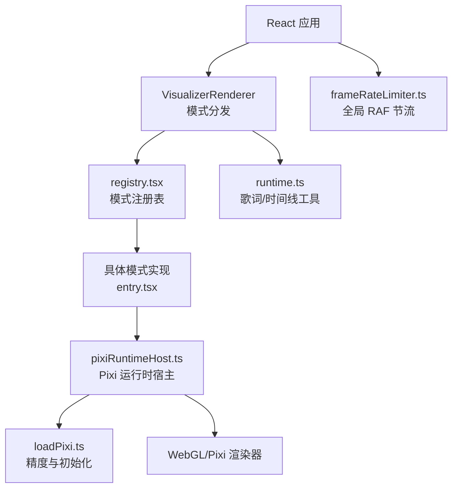
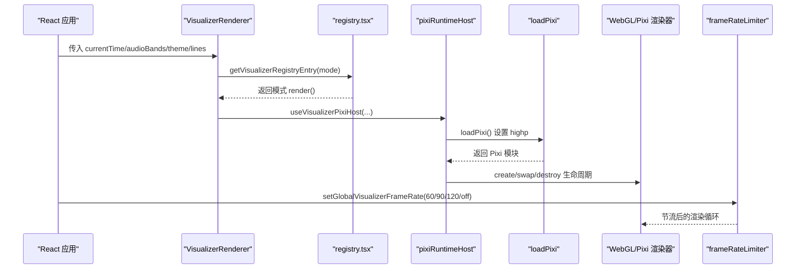
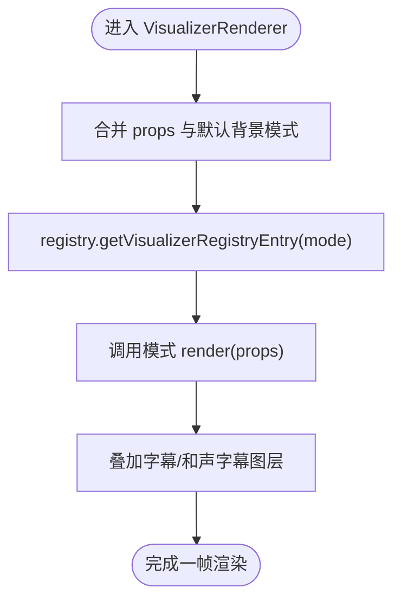
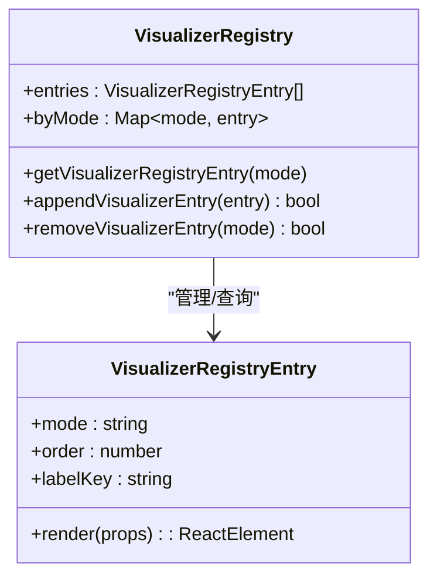
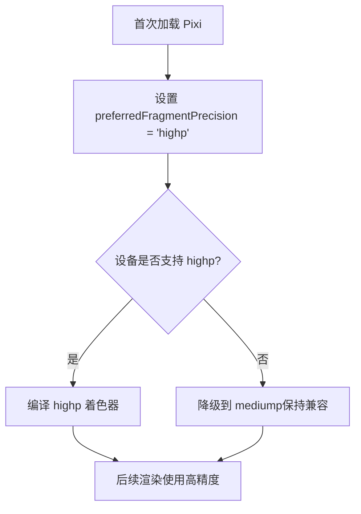
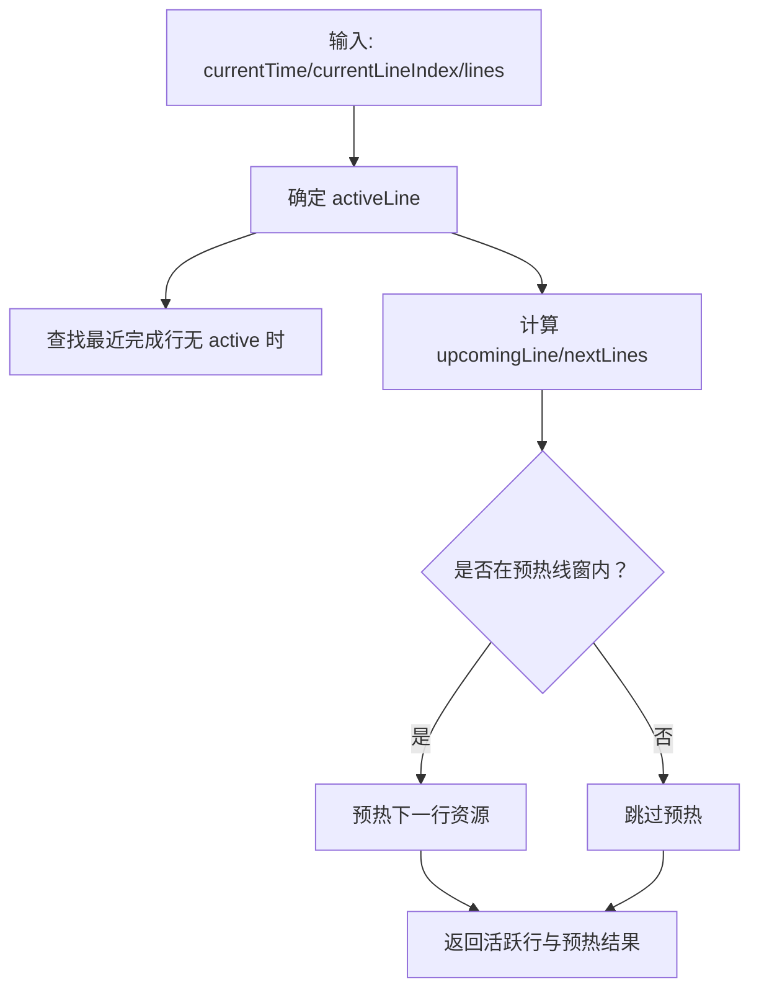
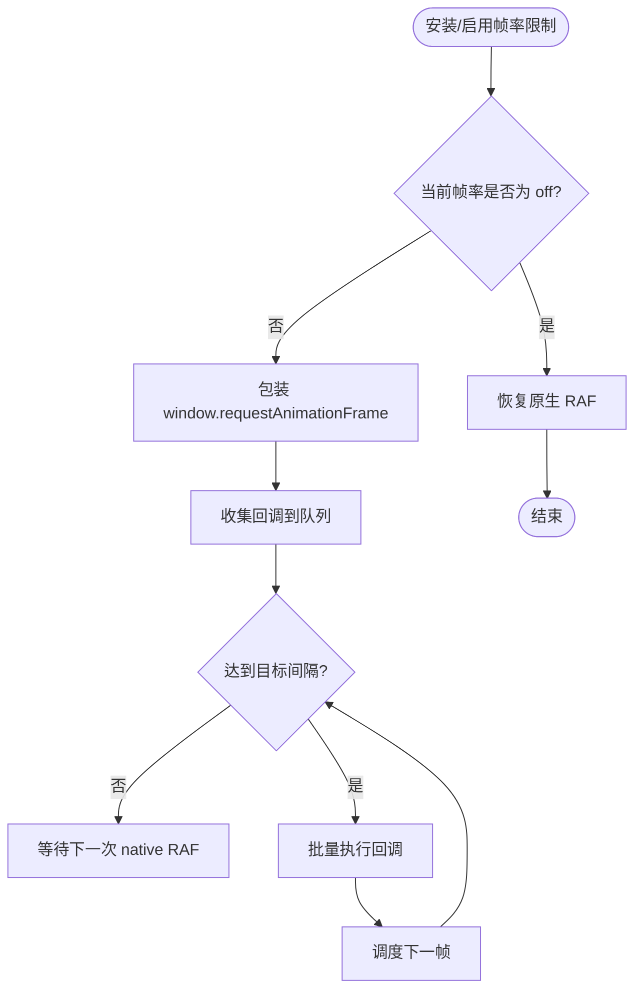
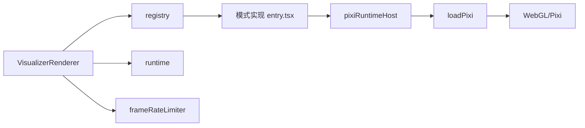

# 图形渲染处理

<cite>
**本文引用的文件**
- [VisualizerRenderer.tsx](file://src/components/visualizer/VisualizerRenderer.tsx)
- [definition.ts](file://src/components/visualizer/definition.ts)
- [registry.tsx](file://src/components/visualizer/registry.tsx)
- [runtime.ts](file://src/components/visualizer/runtime.ts)
- [loadPixi.ts](file://src/components/visualizer/loadPixi.ts)
- [pixiRuntimeHost.ts](file://src/components/visualizer/pixiRuntimeHost.ts)
- [frameRateLimiter.ts](file://src/utils/frameRateLimiter.ts)
</cite>

## 目录
1. [简介](#简介)
2. [项目结构](#项目结构)
3. [核心组件](#核心组件)
4. [架构总览](#架构总览)
5. [详细组件分析](#详细组件分析)
6. [依赖关系分析](#依赖关系分析)
7. [性能考量](#性能考量)
8. [故障排除指南](#故障排除指南)
9. [结论](#结论)
10. [附录](#附录)

## 简介
本技术文档聚焦 Folia Player 的图形渲染处理，围绕可视化（视觉化）渲染子系统展开，覆盖跨平台图形渲染差异、GPU 加速配置与兼容性、DPI 与缩放机制、以及渲染性能监控与调优。文档基于仓库中可视化渲染相关源码进行解析，提供架构图、时序图、流程图等可视化说明，帮助读者理解从 React 层到 WebGL/PixiJS 渲染管线的关键路径与优化策略。

## 项目结构
Folia Player 的可视化渲染位于 src/components/visualizer 目录下，采用“模式注册 + 运行时宿主”的分层设计：
- 渲染入口与模式分发：VisualizerRenderer 负责根据当前模式选择具体渲染器，并注入通用属性。
- 模式定义与注册：definition.ts 定义共享接口；registry.tsx 自动发现并构建模式注册表，支持动态扩展。
- 运行时宿主：pixiRuntimeHost.ts 管理 Pixi 渲染器的生命周期，避免频繁重建上下文，提升切换歌曲时的稳定性与性能。
- 精度与驱动兼容：loadPixi.ts 在首次加载 Pixi 前统一设置片段着色器精度为 highp，规避部分 GPU 驱动的 fp16 溢出问题。
- 歌词与时间线辅助：runtime.ts 提供活跃行、下一行、预热窗口等轻量计算，降低各模式的重复逻辑。
- 帧率限制：frameRateLimiter.ts 提供全局 requestAnimationFrame 节流能力，支持 60/90/120 FPS 或关闭，便于在不同设备上平衡流畅度与功耗。



**图示来源**
- [VisualizerRenderer.tsx:13-43](file://src/components/visualizer/VisualizerRenderer.tsx#L13-L43)
- [registry.tsx:15-53](file://src/components/visualizer/registry.tsx#L15-L53)
- [pixiRuntimeHost.ts:37-143](file://src/components/visualizer/pixiRuntimeHost.ts#L37-L143)
- [loadPixi.ts:28-36](file://src/components/visualizer/loadPixi.ts#L28-L36)
- [runtime.ts:124-157](file://src/components/visualizer/runtime.ts#L124-L157)
- [frameRateLimiter.ts:133-196](file://src/utils/frameRateLimiter.ts#L133-L196)

**章节来源**
- [VisualizerRenderer.tsx:13-43](file://src/components/visualizer/VisualizerRenderer.tsx#L13-L43)
- [definition.ts:32-95](file://src/components/visualizer/definition.ts#L32-L95)
- [registry.tsx:15-53](file://src/components/visualizer/registry.tsx#L15-L53)
- [pixiRuntimeHost.ts:37-143](file://src/components/visualizer/pixiRuntimeHost.ts#L37-L143)
- [loadPixi.ts:28-36](file://src/components/visualizer/loadPixi.ts#L28-L36)
- [runtime.ts:124-157](file://src/components/visualizer/runtime.ts#L124-L157)
- [frameRateLimiter.ts:133-196](file://src/utils/frameRateLimiter.ts#L133-L196)

## 核心组件
- VisualizerRenderer：接收播放状态、主题、歌词等共享属性，按模式调用对应渲染器，并叠加字幕/和声字幕图层。
- registry：集中发现与排序所有可视化模式，提供 byMode 查询、默认模式回退、预览种子生成、动态追加/移除模式的能力。
- pixiRuntimeHost：以 Hook 形式封装 Pixi 渲染器的创建、替换与销毁，保证在歌曲切换时复用上下文，减少重建开销。
- loadPixi：在首次导入 Pixi 时将片段着色器精度设置为 highp，避免 Linux+NVIDIA+ANGLE 环境下因 mediump 导致的数值溢出与黑屏。
- runtime：提供歌词行选择、预热窗口判断、最近完成行查找等轻量工具，供各模式复用。
- frameRateLimiter：全局拦截 requestAnimationFrame，按配置节流渲染循环，支持动态调整帧率。

**章节来源**
- [VisualizerRenderer.tsx:13-43](file://src/components/visualizer/VisualizerRenderer.tsx#L13-L43)
- [registry.tsx:15-53](file://src/components/visualizer/registry.tsx#L15-L53)
- [pixiRuntimeHost.ts:37-143](file://src/components/visualizer/pixiRuntimeHost.ts#L37-L143)
- [loadPixi.ts:28-36](file://src/components/visualizer/loadPixi.ts#L28-L36)
- [runtime.ts:124-157](file://src/components/visualizer/runtime.ts#L124-L157)
- [frameRateLimiter.ts:133-196](file://src/utils/frameRateLimiter.ts#L133-L196)

## 架构总览
下图展示了从 React 到 WebGL 的完整渲染链路，包括模式分发、运行时宿主、精度设置与帧率限制。



**图示来源**
- [VisualizerRenderer.tsx:13-43](file://src/components/visualizer/VisualizerRenderer.tsx#L13-L43)
- [registry.tsx:15-53](file://src/components/visualizer/registry.tsx#L15-L53)
- [pixiRuntimeHost.ts:37-143](file://src/components/visualizer/pixiRuntimeHost.ts#L37-L143)
- [loadPixi.ts:28-36](file://src/components/visualizer/loadPixi.ts#L28-L36)
- [frameRateLimiter.ts:133-196](file://src/utils/frameRateLimiter.ts#L133-L196)

## 详细组件分析

### 模式分发与渲染入口（VisualizerRenderer）
- 职责：将播放状态、主题、歌词等属性合并后交给具体模式渲染器，同时叠加字幕/和声字幕图层。
- 关键点：通过 registry 获取指定模式的 render 函数；背景模式有默认值；可注入字体缩放、透明度等视觉参数。
- 可扩展性：新增模式只需在 entry.tsx 中注册，即可被自动发现与使用。



**图示来源**
- [VisualizerRenderer.tsx:13-43](file://src/components/visualizer/VisualizerRenderer.tsx#L13-L43)
- [registry.tsx:49-53](file://src/components/visualizer/registry.tsx#L49-L53)

**章节来源**
- [VisualizerRenderer.tsx:13-43](file://src/components/visualizer/VisualizerRenderer.tsx#L13-L43)
- [definition.ts:32-95](file://src/components/visualizer/definition.ts#L32-L95)

### 模式注册与动态扩展（registry）
- 自动发现：通过 import.meta.glob 扫描子目录 entry.tsx，构建有序的模式列表与 byMode 映射。
- 安全校验：检测缺失默认导出与重复模式，抛出错误以避免歧义。
- 运行时贡献：支持 append/remove 模式，便于插件系统在不重建的情况下扩展可视化能力。



**图示来源**
- [registry.tsx:15-53](file://src/components/visualizer/registry.tsx#L15-L53)
- [registry.tsx:79-105](file://src/components/visualizer/registry.tsx#L79-L105)

**章节来源**
- [registry.tsx:15-53](file://src/components/visualizer/registry.tsx#L15-L53)
- [registry.tsx:79-105](file://src/components/visualizer/registry.tsx#L79-L105)

### Pixi 运行时宿主（pixiRuntimeHost）
- 生命周期管理：create/swap/destroy 三阶段分离，确保在歌曲切换时不破坏已存在的 WebGL 上下文。
- 防抖与排水：drainSong 将多次快速切换合并为一次最终目标，避免队列堆积导致长时间卡顿。
- 失败恢复：若 swap 失败，保留上一首歌画面，避免闪烁空洞；初始化失败则通知上层降级显示文本。

```mermaid
sequenceDiagram
participant Mode as "模式组件"
participant Host as "useVisualizerPixiHost"
participant Create as "create(host, song, signal)"
participant Swap as "swap(runtime, song, signal)"
participant Destroy as "destroy(runtime)"
Mode->>Host : 传入 hostRef/rebuildKey/song
Host->>Create : 异步创建运行时
Create-->>Host : 返回 runtime
Host->>Swap : 歌曲变化时渐进替换
Note over Host,Swap : 快速切歌会排水至最新目标
Host->>Destroy : 组件卸载时清理
```

**图示来源**
- [pixiRuntimeHost.ts:37-143](file://src/components/visualizer/pixiRuntimeHost.ts#L37-L143)

**章节来源**
- [pixiRuntimeHost.ts:37-143](file://src/components/visualizer/pixiRuntimeHost.ts#L37-L143)

### 精度与驱动兼容（loadPixi）
- 问题背景：部分设备（如 Linux+NVIDIA+ANGLE）将 mediump 视为真实 fp16，导致噪声滤镜计算溢出，出现黑边/黑三角。
- 解决方案：在首次导入 Pixi 前将 GlProgram 的 preferredFragmentPrecision 设为 highp，确保片段着色器使用 fp32。
- 兼容性：若设备不支持 highp，仍会降级到 mediump，保持向后兼容。



**图示来源**
- [loadPixi.ts:28-36](file://src/components/visualizer/loadPixi.ts#L28-L36)

**章节来源**
- [loadPixi.ts:28-36](file://src/components/visualizer/loadPixi.ts#L28-L36)

### 歌词与时间线工具（runtime）
- 功能：获取最近完成的歌词行、下一行、预热线程窗口；提供 prepareActiveAndUpcoming 统一准备流程。
- 性能：仅做轻量计算，避免在 hook 中进行重布局或 Canvas 操作，确保每帧开销可控。



**图示来源**
- [runtime.ts:35-120](file://src/components/visualizer/runtime.ts#L35-L120)
- [runtime.ts:124-157](file://src/components/visualizer/runtime.ts#L124-L157)

**章节来源**
- [runtime.ts:35-120](file://src/components/visualizer/runtime.ts#L35-L120)
- [runtime.ts:124-157](file://src/components/visualizer/runtime.ts#L124-L157)

### 帧率限制（frameRateLimiter）
- 能力：全局拦截 requestAnimationFrame/cancelAnimationFrame，按配置节流渲染循环。
- 选项：支持 off/60/90/120，读取本地存储持久化用户偏好。
- 适用场景：在高 DPI 或复杂模式下降低 CPU/GPU 压力，或在低电量模式下节能。



**图示来源**
- [frameRateLimiter.ts:133-196](file://src/utils/frameRateLimiter.ts#L133-L196)
- [frameRateLimiter.ts:42-54](file://src/utils/frameRateLimiter.ts#L42-L54)

**章节来源**
- [frameRateLimiter.ts:42-54](file://src/utils/frameRateLimiter.ts#L42-L54)
- [frameRateLimiter.ts:133-196](file://src/utils/frameRateLimiter.ts#L133-L196)

## 依赖关系分析
- 耦合点：
  - VisualizerRenderer 依赖 registry 进行模式分发，强耦合于模式约定（render 签名）。
  - pixiRuntimeHost 与 loadPixi 协作，确保 Pixi 初始化顺序正确（先精度设置，再创建渲染器）。
  - runtime 被多个模式复用，需保持轻量与稳定。
- 外部依赖：
  - PixiJS（WebGL/WebGPU），受浏览器与驱动影响较大。
  - framer-motion（MotionValue）用于时间轴动画。
- 潜在风险：
  - 若模式实现过重或频繁重建上下文，会导致卡顿与内存抖动。
  - 不同设备的 WebGL 能力差异可能导致着色器行为不一致，需依赖精度设置与降级策略。



**图示来源**
- [VisualizerRenderer.tsx:13-43](file://src/components/visualizer/VisualizerRenderer.tsx#L13-L43)
- [registry.tsx:15-53](file://src/components/visualizer/registry.tsx#L15-L53)
- [pixiRuntimeHost.ts:37-143](file://src/components/visualizer/pixiRuntimeHost.ts#L37-L143)
- [loadPixi.ts:28-36](file://src/components/visualizer/loadPixi.ts#L28-L36)
- [frameRateLimiter.ts:133-196](file://src/utils/frameRateLimiter.ts#L133-L196)

**章节来源**
- [VisualizerRenderer.tsx:13-43](file://src/components/visualizer/VisualizerRenderer.tsx#L13-L43)
- [registry.tsx:15-53](file://src/components/visualizer/registry.tsx#L15-L53)
- [pixiRuntimeHost.ts:37-143](file://src/components/visualizer/pixiRuntimeHost.ts#L37-L143)
- [loadPixi.ts:28-36](file://src/components/visualizer/loadPixi.ts#L28-L36)
- [frameRateLimiter.ts:133-196](file://src/utils/frameRateLimiter.ts#L133-L196)

## 性能考量
- GPU 加速与精度：
  - 通过 loadPixi 强制 highp 片段精度，避免 fp16 溢出导致的黑屏/黑三角，尤其在 Linux+NVIDIA 环境。
  - 建议在各模式中避免不必要的纹理重建与高开销滤镜链，必要时对后处理分辨率进行合理裁剪。
- 上下文复用：
  - pixiRuntimeHost 确保在歌曲切换时复用 WebGL 上下文，减少重建成本；仅在 rebuildKey 变化时才重建。
- 帧率控制：
  - 使用 frameRateLimiter 在全局层面节流渲染循环，适配不同屏幕刷新率与设备性能。
- 歌词预热：
  - runtime 提供预热线窗，提前准备下一行资源，降低首帧延迟。
- 内存与资源：
  - 避免在高频回调中分配大量临时对象；合理使用纹理池与缓存；及时释放不再使用的资源。

[本节为通用性能指导，不直接分析具体文件]

## 故障排除指南
- 黑屏/黑三角（Linux+NVIDIA+ANGLE）：
  - 现象：后处理噪声滤镜计算溢出，出现直线边界黑区。
  - 原因：mediump 被视为 fp16，dot 乘积超出范围导致 NaN。
  - 解决：确保在首次加载 Pixi 前设置 preferredFragmentPrecision 为 highp（已在 loadPixi 中处理）。
  - 参考：[loadPixi.ts:28-36](file://src/components/visualizer/loadPixi.ts#L28-L36)
- 歌曲切换卡顿：
  - 现象：快速切歌后屏幕长时间空白或闪烁。
  - 原因：每次切换重建上下文或队列堆积。
  - 解决：使用 pixiRuntimeHost 的 drainSong 机制，复用上下文并合并切换目标。
  - 参考：[pixiRuntimeHost.ts:66-96](file://src/components/visualizer/pixiRuntimeHost.ts#L66-L96)
- 渲染过慢/掉帧：
  - 现象：复杂模式下帧率低、CPU/GPU 占用高。
  - 解决：启用 frameRateLimiter 限制到 60/90/120；检查模式中的纹理与滤镜开销；减少高频分配。
  - 参考：[frameRateLimiter.ts:133-196](file://src/utils/frameRateLimiter.ts#L133-L196)
- 初始化失败：
  - 现象：无法创建 Pixi 运行时，UI 应降级显示文本。
  - 解决：捕获异常并通知上层 onFailedChange(true)，展示文本回退。
  - 参考：[pixiRuntimeHost.ts:120-124](file://src/components/visualizer/pixiRuntimeHost.ts#L120-L124)

**章节来源**
- [loadPixi.ts:28-36](file://src/components/visualizer/loadPixi.ts#L28-L36)
- [pixiRuntimeHost.ts:66-96](file://src/components/visualizer/pixiRuntimeHost.ts#L66-L96)
- [pixiRuntimeHost.ts:120-124](file://src/components/visualizer/pixiRuntimeHost.ts#L120-L124)
- [frameRateLimiter.ts:133-196](file://src/utils/frameRateLimiter.ts#L133-L196)

## 结论
Folia Player 的可视化渲染子系统通过清晰的模式注册、稳定的运行时宿主、精确的 GPU 精度设置与全局帧率限制，实现了跨平台的高性能渲染。针对常见驱动差异与性能瓶颈，提供了明确的优化路径与故障排除方案。建议在开发新可视化模式时遵循现有接口约定，充分利用运行时工具与帧率限制，以获得一致的视觉质量与性能表现。

[本节为总结性内容，不直接分析具体文件]

## 附录
- 关键接口与类型：
  - VisualizerSharedProps：定义可视化渲染的共享属性（时间、音频带、主题、歌词等）。
  - VisualizerRegistryEntry：模式条目，包含渲染函数与设置面板等。
  - VisualizerPixiHostOptions：Pixi 运行时宿主的配置项（创建、替换、销毁、失败回调）。
- 建议实践：
  - 在模式中尽量复用纹理与缓冲，避免每帧分配。
  - 使用 runtime 提供的预热窗口减少首帧延迟。
  - 结合 frameRateLimiter 在不同设备上平衡流畅度与功耗。

**章节来源**
- [definition.ts:32-95](file://src/components/visualizer/definition.ts#L32-L95)
- [definition.ts:165-183](file://src/components/visualizer/definition.ts#L165-L183)
- [pixiRuntimeHost.ts:11-28](file://src/components/visualizer/pixiRuntimeHost.ts#L11-L28)
- [runtime.ts:124-157](file://src/components/visualizer/runtime.ts#L124-L157)
- [frameRateLimiter.ts:22-40](file://src/utils/frameRateLimiter.ts#L22-L40)