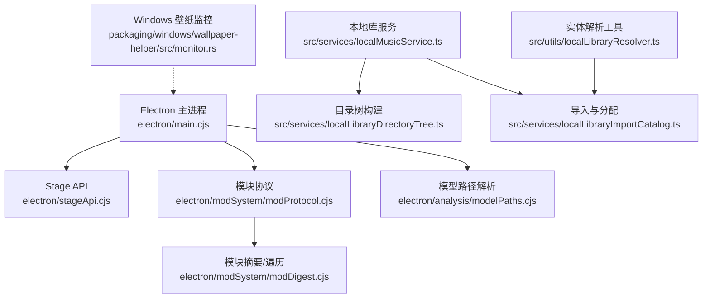
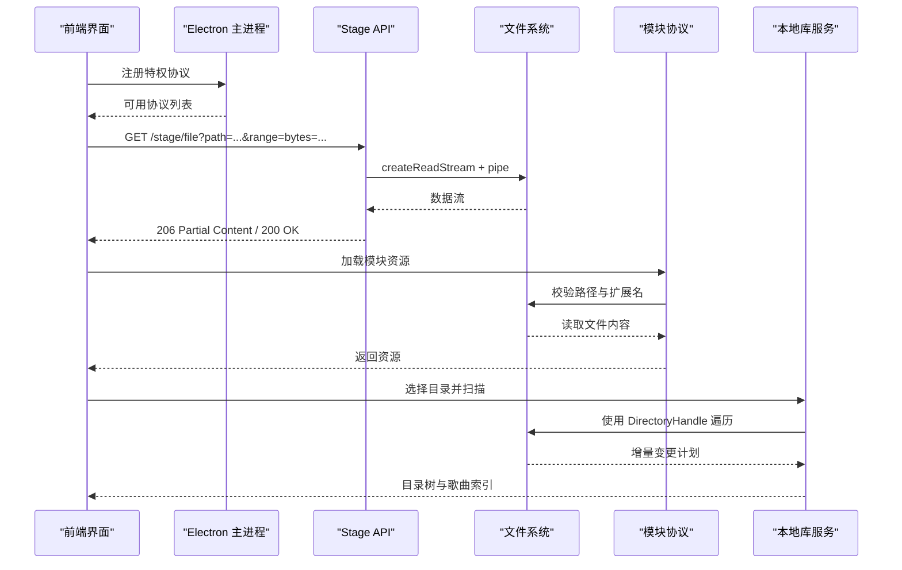
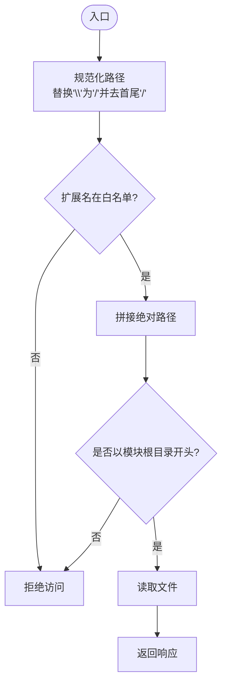
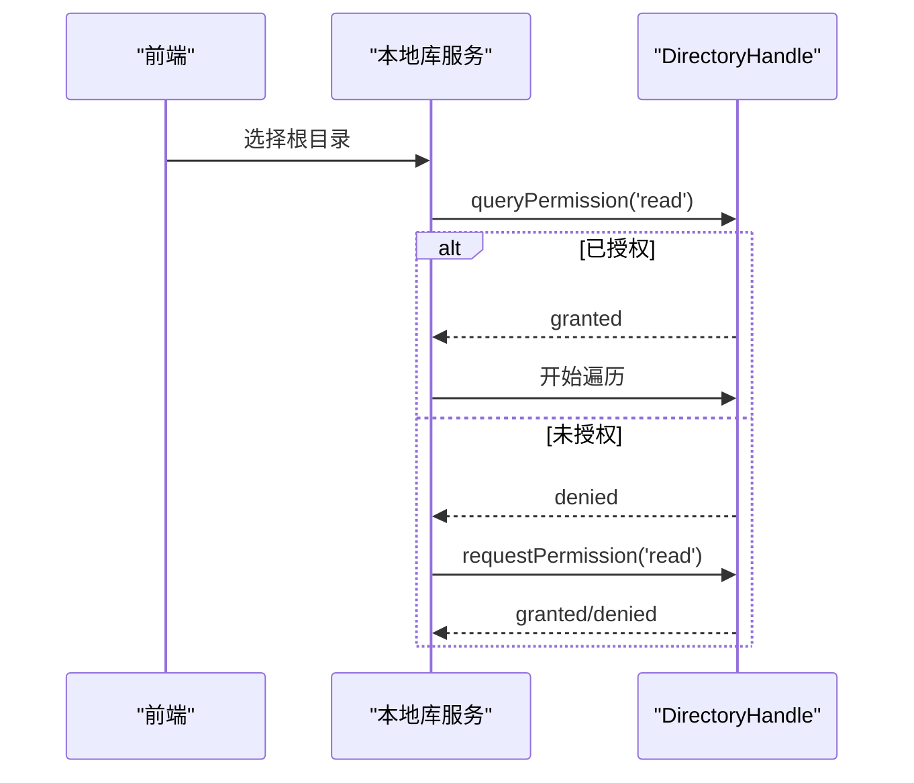
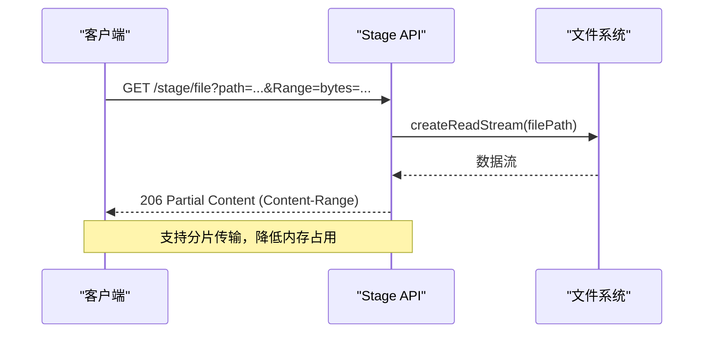
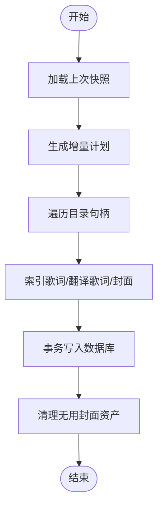
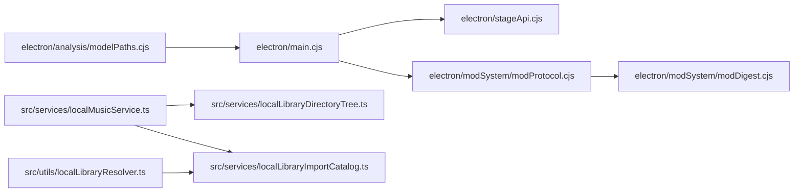

# 文件系统访问

<cite>
**本文引用的文件**
- [electron/main.cjs](file://electron/main.cjs)
- [electron/stageApi.cjs](file://electron/stageApi.cjs)
- [electron/modSystem/modProtocol.cjs](file://electron/modSystem/modProtocol.cjs)
- [electron/modSystem/modDigest.cjs](file://electron/modSystem/modDigest.cjs)
- [electron/analysis/modelPaths.cjs](file://electron/analysis/modelPaths.cjs)
- [src/services/localLibraryDirectoryTree.ts](file://src/services/localLibraryDirectoryTree.ts)
- [src/services/localMusicService.ts](file://src/services/localMusicService.ts)
- [src/services/localLibraryImportCatalog.ts](file://src/services/localLibraryImportCatalog.ts)
- [src/utils/localLibraryResolver.ts](file://src/utils/localLibraryResolver.ts)
- [packaging/windows/wallpaper-helper/src/monitor.rs](file://packaging/windows/wallpaper-helper/src/monitor.rs)
</cite>

## 目录
1. [简介](#简介)
2. [项目结构](#项目结构)
3. [核心组件](#核心组件)
4. [架构总览](#架构总览)
5. [详细组件分析](#详细组件分析)
6. [依赖关系分析](#依赖关系分析)
7. [性能考量](#性能考量)
8. [故障排查指南](#故障排查指南)
9. [结论](#结论)

## 简介
本技术文档聚焦 Folia Player 的文件系统访问能力，覆盖跨平台路径处理、符号链接与 UNC 路径、权限与安全边界、大文件流式读写与进度反馈、以及本地库扫描与缓存同步等关键主题。文档基于仓库中的 Electron 主进程、Stage API、模块协议、本地库服务与工具函数等实现进行系统化梳理，并提供可视化图示与排错建议，帮助开发者在 Windows、macOS、Linux 上稳定地处理本地媒体与资源。

## 项目结构
Folia Player 的文件系统访问主要分布在以下区域：
- Electron 主进程与协议注册：负责自定义协议、安全策略与平台相关初始化。
- Stage API：提供 HTTP 风格的本地文件读取（含 Range 支持）与上传流式写入。
- 模块系统：对模块目录进行受控遍历、摘要计算与协议化访问。
- 本地库服务：基于浏览器 FileSystem API 的目录句柄、增量扫描、目录树构建与持久化。
- 模型路径解析：按优先级定位模型文件，确保多环境一致性。
- Windows 壁纸辅助程序：通过系统事件监控桌面窗口生命周期，保证渲染层稳定性。

**图表来源**
- [electron/main.cjs:42-54](file://electron/main.cjs#L42-L54)
- [electron/stageApi.cjs:833-866](file://electron/stageApi.cjs#L833-L866)
- [electron/modSystem/modProtocol.cjs:67-95](file://electron/modSystem/modProtocol.cjs#L67-L95)
- [electron/modSystem/modDigest.cjs:32-60](file://electron/modSystem/modDigest.cjs#L32-L60)
- [electron/analysis/modelPaths.cjs:1-28](file://electron/analysis/modelPaths.cjs#L1-L28)
- [src/services/localMusicService.ts:143-160](file://src/services/localMusicService.ts#L143-L160)
- [src/services/localLibraryDirectoryTree.ts:1-60](file://src/services/localLibraryDirectoryTree.ts#L1-L60)
- [src/services/localLibraryImportCatalog.ts:21-147](file://src/services/localLibraryImportCatalog.ts#L21-L147)
- [src/utils/localLibraryResolver.ts:1-69](file://src/utils/localLibraryResolver.ts#L1-L69)
- [packaging/windows/wallpaper-helper/src/monitor.rs:1-28](file://packaging/windows/wallpaper-helper/src/monitor.rs#L1-L28)

**章节来源**
- [electron/main.cjs:42-54](file://electron/main.cjs#L42-L54)
- [electron/stageApi.cjs:833-866](file://electron/stageApi.cjs#L833-L866)
- [electron/modSystem/modProtocol.cjs:67-95](file://electron/modSystem/modProtocol.cjs#L67-L95)
- [electron/modSystem/modDigest.cjs:32-60](file://electron/modSystem/modDigest.cjs#L32-L60)
- [electron/analysis/modelPaths.cjs:1-28](file://electron/analysis/modelPaths.cjs#L1-L28)
- [src/services/localMusicService.ts:143-160](file://src/services/localMusicService.ts#L143-L160)
- [src/services/localLibraryDirectoryTree.ts:1-60](file://src/services/localLibraryDirectoryTree.ts#L1-L60)
- [src/services/localLibraryImportCatalog.ts:21-147](file://src/services/localLibraryImportCatalog.ts#L21-L147)
- [src/utils/localLibraryResolver.ts:1-69](file://src/utils/localLibraryResolver.ts#L1-L69)
- [packaging/windows/wallpaper-helper/src/monitor.rs:1-28](file://packaging/windows/wallpaper-helper/src/monitor.rs#L1-L28)

## 核心组件
- 自定义协议与资源访问：主进程注册特权协议，使前端可安全访问本地封面等资源。
- Stage API 文件服务：提供带 Range 的流式读取与大文件上传限制，避免内存峰值过高。
- 模块系统安全边界：严格校验请求路径，仅允许白名单扩展名，防止路径穿越。
- 本地库扫描与目录树：使用 FileSystemDirectoryHandle 保持权限与句柄，增量扫描并构建目录树。
- 模型路径解析：按用户目录、下载目录、安装目录优先级查找模型文件，保证 worker 与 host 一致。
- Windows 壁纸监控：监听桌面窗口事件，保障壁纸模式下的窗口层级与心跳。

**章节来源**
- [electron/main.cjs:42-54](file://electron/main.cjs#L42-L54)
- [electron/stageApi.cjs:833-866](file://electron/stageApi.cjs#L833-L866)
- [electron/modSystem/modProtocol.cjs:67-95](file://electron/modSystem/modProtocol.cjs#L67-L95)
- [src/services/localMusicService.ts:143-160](file://src/services/localMusicService.ts#L143-L160)
- [electron/analysis/modelPaths.cjs:1-28](file://electron/analysis/modelPaths.cjs#L1-L28)
- [packaging/windows/wallpaper-helper/src/monitor.rs:1-28](file://packaging/windows/wallpaper-helper/src/monitor.rs#L1-L28)

## 架构总览
下图展示了从前端到后端（Electron 主进程与 Node 运行时）的文件访问链路，包括协议访问、HTTP 范围读取、模块协议与本地库扫描。

**图表来源**
- [electron/main.cjs:42-54](file://electron/main.cjs#L42-L54)
- [electron/stageApi.cjs:833-866](file://electron/stageApi.cjs#L833-L866)
- [electron/modSystem/modProtocol.cjs:67-95](file://electron/modSystem/modProtocol.cjs#L67-L95)
- [src/services/localMusicService.ts:143-160](file://src/services/localMusicService.ts#L143-L160)

## 详细组件分析

### 跨平台路径处理与符号链接
- 路径分隔符统一：目录树构建时对相对路径进行标准化，将反斜杠替换为正斜杠，并去除首尾斜杠，确保跨平台一致性。
- 符号链接处理：模块摘要遍历中检测符号链接，记录其目标路径而不跟随，避免循环引用与不可验证内容。
- UNC 路径与网络驱动器：通过 path.join 与 startsWith 校验绝对路径前缀，防止路径穿越；对于网络路径，需确保权限与可达性。

**图表来源**
- [src/services/localLibraryDirectoryTree.ts:7-10](file://src/services/localLibraryDirectoryTree.ts#L7-L10)
- [electron/modSystem/modProtocol.cjs:67-95](file://electron/modSystem/modProtocol.cjs#L67-L95)
- [electron/modSystem/modDigest.cjs:32-60](file://electron/modSystem/modDigest.cjs#L32-L60)

**章节来源**
- [src/services/localLibraryDirectoryTree.ts:7-10](file://src/services/localLibraryDirectoryTree.ts#L7-L10)
- [electron/modSystem/modProtocol.cjs:67-95](file://electron/modSystem/modProtocol.cjs#L67-L95)
- [electron/modSystem/modDigest.cjs:32-60](file://electron/modSystem/modDigest.cjs#L32-L60)

### 文件权限管理与安全考虑
- 目录句柄权限：本地库扫描前查询并请求读权限，若未授予则提示用户授权，确保后续遍历合法。
- 模块协议白名单：仅允许特定扩展名被服务，且必须位于模块目录内，防止越权访问。
- 失败关闭策略：权限不足时抛出一致的“权限拒绝”错误，便于上层统一处理。

**图表来源**
- [src/services/localMusicService.ts:143-160](file://src/services/localMusicService.ts#L143-L160)
- [electron/modSystem/modProtocol.cjs:67-95](file://electron/modSystem/modProtocol.cjs#L67-L95)

**章节来源**
- [src/services/localMusicService.ts:143-160](file://src/services/localMusicService.ts#L143-L160)
- [electron/modSystem/modProtocol.cjs:67-95](file://electron/modSystem/modProtocol.cjs#L67-L95)

### 大文件处理策略（流式读取、内存管理、进度反馈）
- 流式读取：Stage API 使用 createReadStream 与 pipe 直接输出，避免整文件载入内存。
- Range 支持：解析 Range 头，返回 206 Partial Content，支持断点续传与按需加载。
- 上传限制：multipart 上传设置大小上限，超限即销毁流并清理临时文件，返回明确错误码。
- 进度反馈：本地库扫描过程中派发进度事件，包含活跃状态、文件夹名、总数与完成数。

**图表来源**
- [electron/stageApi.cjs:833-866](file://electron/stageApi.cjs#L833-L866)
- [src/services/localMusicService.ts:86-141](file://src/services/localMusicService.ts#L86-L141)

**章节来源**
- [electron/stageApi.cjs:833-866](file://electron/stageApi.cjs#L833-L866)
- [src/services/localMusicService.ts:86-141](file://src/services/localMusicService.ts#L86-L141)

### 文件监控机制（变更监听、增量扫描、缓存同步）
- 增量扫描：基于上次快照与当前目录句柄生成差异计划，仅处理相关变更文件，提升效率。
- 目录树构建：将持久化的扫描快照转换为目录节点树，统计子目录与总曲目数，不触碰磁盘。
- 缓存同步：导入后更新数据库事务，批量写入歌曲、实体与分配，并清理不再引用的封面资产。

**图表来源**
- [src/services/localMusicService.ts:1089-1107](file://src/services/localMusicService.ts#L1089-L1107)
- [src/services/localLibraryDirectoryTree.ts:12-60](file://src/services/localLibraryDirectoryTree.ts#L12-L60)
- [src/services/localLibraryImportCatalog.ts:21-147](file://src/services/localLibraryImportCatalog.ts#L21-L147)

**章节来源**
- [src/services/localMusicService.ts:1089-1107](file://src/services/localMusicService.ts#L1089-L1107)
- [src/services/localLibraryDirectoryTree.ts:12-60](file://src/services/localLibraryDirectoryTree.ts#L12-L60)
- [src/services/localLibraryImportCatalog.ts:21-147](file://src/services/localLibraryImportCatalog.ts#L21-L147)

### 模型路径解析与一致性
- 多位置查找：按用户目录、下载目录、安装目录顺序查找模型文件，优先用户放置的资源。
- 平台适配：根据平台与架构筛选可下载项，返回 supported 标志，供设置页展示。
- 一致性保证：worker 与 host 共用同一解析逻辑，避免功能不一致导致的“有选项无权重”问题。

**章节来源**
- [electron/analysis/modelPaths.cjs:1-28](file://electron/analysis/modelPaths.cjs#L1-L28)

### Windows 壁纸监控与文件系统交互
- 事件监听：通过系统事件钩子监听桌面窗口创建/销毁与重排序，维持壁纸窗口层级。
- 心跳机制：主进程 watchdog 消费心跳，确保壁纸助手存活与恢复。
- 与文件系统：壁纸模式涉及二进制资源路径解析与执行权限检查，确保跨平台可用性。

**章节来源**
- [packaging/windows/wallpaper-helper/src/monitor.rs:1-28](file://packaging/windows/wallpaper-helper/src/monitor.rs#L1-L28)

## 依赖关系分析
- 主进程依赖 Stage API 与模块协议，提供统一的本地资源访问接口。
- 本地库服务依赖 FileSystemDirectoryHandle 与数据库事务，实现增量扫描与一致性更新。
- 模块摘要依赖文件系统遍历与符号链接检测，确保内容可验证性与安全性。
- 模型路径解析依赖平台信息，保证在不同环境下的一致行为。

**图表来源**
- [electron/main.cjs:42-54](file://electron/main.cjs#L42-L54)
- [electron/stageApi.cjs:833-866](file://electron/stageApi.cjs#L833-L866)
- [electron/modSystem/modProtocol.cjs:67-95](file://electron/modSystem/modProtocol.cjs#L67-L95)
- [electron/modSystem/modDigest.cjs:32-60](file://electron/modSystem/modDigest.cjs#L32-L60)
- [src/services/localMusicService.ts:143-160](file://src/services/localMusicService.ts#L143-L160)
- [src/services/localLibraryDirectoryTree.ts:1-60](file://src/services/localLibraryDirectoryTree.ts#L1-L60)
- [src/services/localLibraryImportCatalog.ts:21-147](file://src/services/localLibraryImportCatalog.ts#L21-L147)
- [src/utils/localLibraryResolver.ts:1-69](file://src/utils/localLibraryResolver.ts#L1-L69)
- [electron/analysis/modelPaths.cjs:1-28](file://electron/analysis/modelPaths.cjs#L1-L28)

**章节来源**
- [electron/main.cjs:42-54](file://electron/main.cjs#L42-L54)
- [electron/stageApi.cjs:833-866](file://electron/stageApi.cjs#L833-L866)
- [electron/modSystem/modProtocol.cjs:67-95](file://electron/modSystem/modProtocol.cjs#L67-L95)
- [electron/modSystem/modDigest.cjs:32-60](file://electron/modSystem/modDigest.cjs#L32-L60)
- [src/services/localMusicService.ts:143-160](file://src/services/localMusicService.ts#L143-L160)
- [src/services/localLibraryDirectoryTree.ts:1-60](file://src/services/localLibraryDirectoryTree.ts#L1-L60)
- [src/services/localLibraryImportCatalog.ts:21-147](file://src/services/localLibraryImportCatalog.ts#L21-L147)
- [src/utils/localLibraryResolver.ts:1-69](file://src/utils/localLibraryResolver.ts#L1-L69)
- [electron/analysis/modelPaths.cjs:1-28](file://electron/analysis/modelPaths.cjs#L1-L28)

## 性能考量
- 流式 I/O：Stage API 使用流式管道传输，避免大文件导致内存峰值。
- 增量扫描：基于快照与目录句柄的差异计划，减少重复 IO 与解析开销。
- 并发与批处理：数据库事务批量写入，减少锁竞争与提交次数。
- 资源释放：上传超限及时销毁流并清理临时文件，防止资源泄漏。
- 平台优化：Linux 下图形栈与 Wayland/Vulkan 开关调整，减少渲染卡顿对整体性能的影响。

[本节为通用指导，无需具体文件分析]

## 故障排查指南
- 权限不足
  - 现象：无法遍历目录或读取文件。
  - 处理：检查目录句柄权限，必要时调用 requestPermission；确认模块协议白名单与路径前缀校验。
  - 参考：[src/services/localMusicService.ts:143-160](file://src/services/localMusicService.ts#L143-L160)、[electron/modSystem/modProtocol.cjs:67-95](file://electron/modSystem/modProtocol.cjs#L67-L95)

- 路径不存在或无效
  - 现象：读取失败或返回 404/416。
  - 处理：校验路径规范化与绝对路径前缀；检查 Range 范围是否有效。
  - 参考：[src/services/localLibraryDirectoryTree.ts:7-10](file://src/services/localLibraryDirectoryTree.ts#L7-L10)、[electron/stageApi.cjs:833-866](file://electron/stageApi.cjs#L833-L866)

- 网络驱动器访问异常
  - 现象：延迟高或连接中断。
  - 处理：使用流式读取与 Range 支持，避免一次性加载；增加重试与超时策略。
  - 参考：[electron/stageApi.cjs:833-866](file://electron/stageApi.cjs#L833-L866)

- 符号链接与循环引用
  - 现象：摘要计算卡死或不可验证。
  - 处理：检测符号链接并记录目标，不跟随；限制文件数量与总字节数。
  - 参考：[electron/modSystem/modDigest.cjs:32-60](file://electron/modSystem/modDigest.cjs#L32-L60)

- 模型文件缺失或不匹配
  - 现象：设置页显示可用但实际无权重。
  - 处理：按优先级查找模型文件；确认平台支持与下载包完整性。
  - 参考：[electron/analysis/modelPaths.cjs:1-28](file://electron/analysis/modelPaths.cjs#L1-L28)

**章节来源**
- [src/services/localMusicService.ts:143-160](file://src/services/localMusicService.ts#L143-L160)
- [electron/modSystem/modProtocol.cjs:67-95](file://electron/modSystem/modProtocol.cjs#L67-L95)
- [src/services/localLibraryDirectoryTree.ts:7-10](file://src/services/localLibraryDirectoryTree.ts#L7-L10)
- [electron/stageApi.cjs:833-866](file://electron/stageApi.cjs#L833-L866)
- [electron/modSystem/modDigest.cjs:32-60](file://electron/modSystem/modDigest.cjs#L32-L60)
- [electron/analysis/modelPaths.cjs:1-28](file://electron/analysis/modelPaths.cjs#L1-L28)

## 结论
Folia Player 通过 Electron 主进程、Stage API、模块协议与本地库服务等组件，构建了跨平台、安全且高性能的文件系统访问体系。其核心优势在于：
- 统一的路径规范化与安全校验，避免路径穿越与越权访问。
- 流式 I/O 与 Range 支持，有效应对大文件场景。
- 基于目录句柄的增量扫描与目录树构建，提升本地库管理效率。
- 严格的权限控制与失败关闭策略，增强鲁棒性。
- 平台特定的优化与监控，保障用户体验与稳定性。

建议在后续迭代中继续强化网络驱动器的容错与重试机制，完善错误码与日志规范，并持续优化内存占用与扫描性能。

[本节为总结，无需具体文件分析]