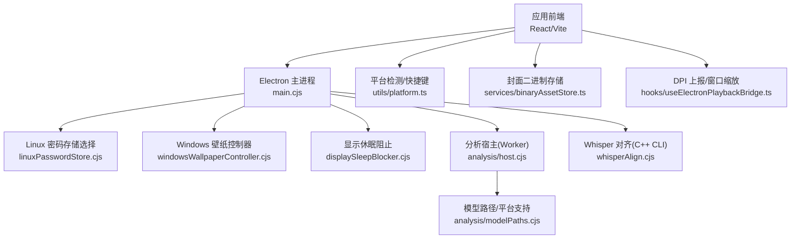
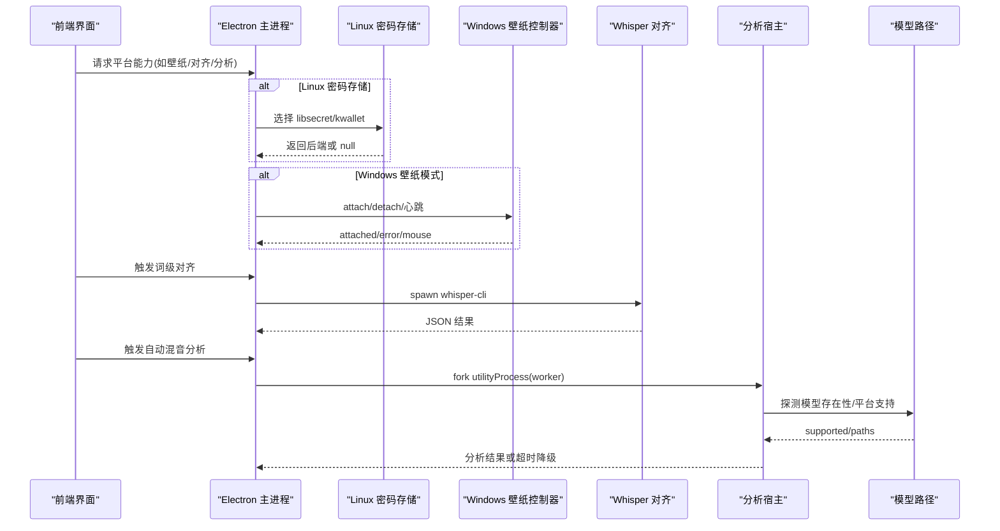
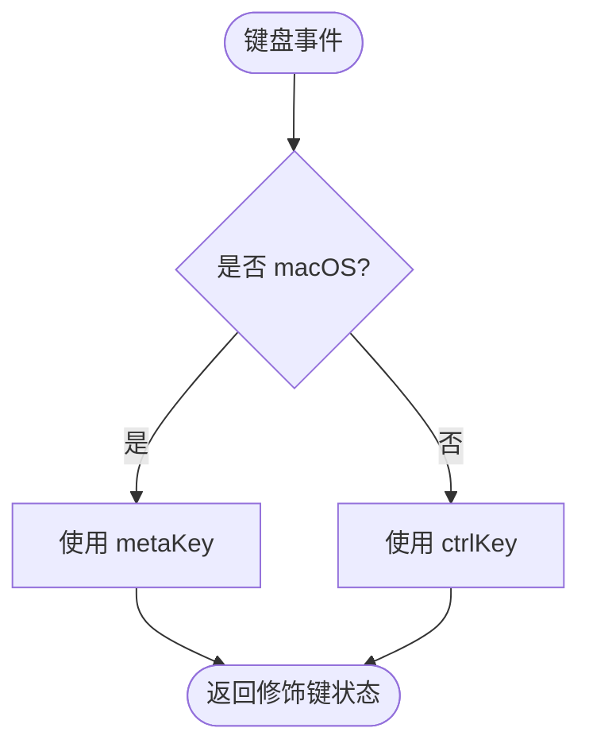
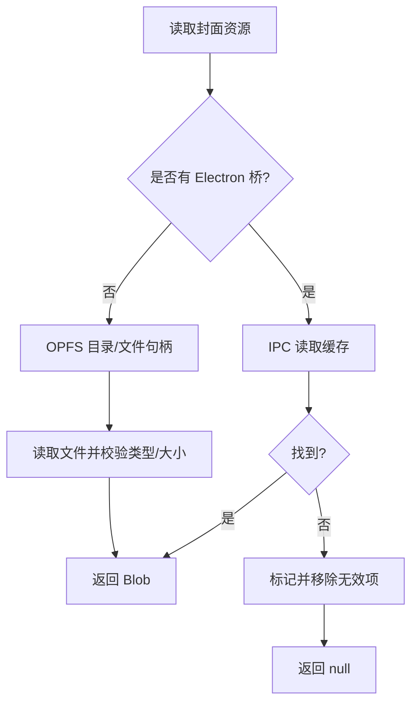
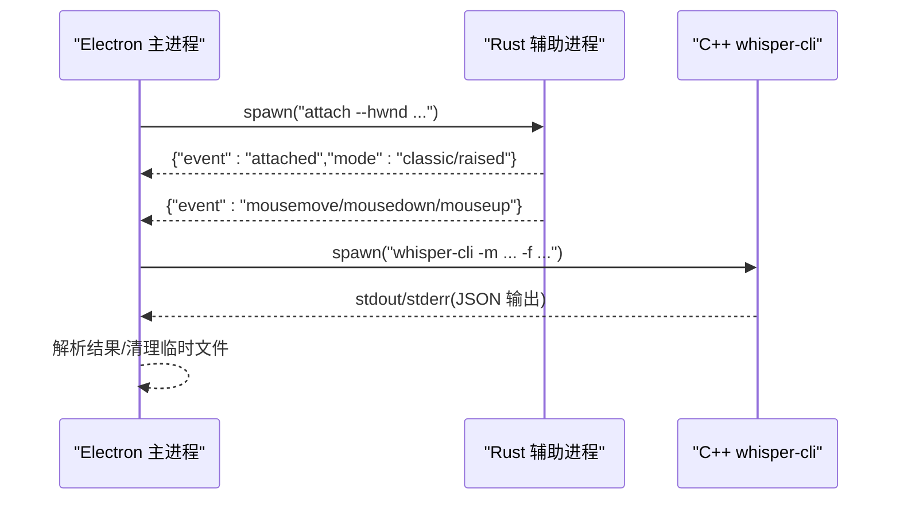
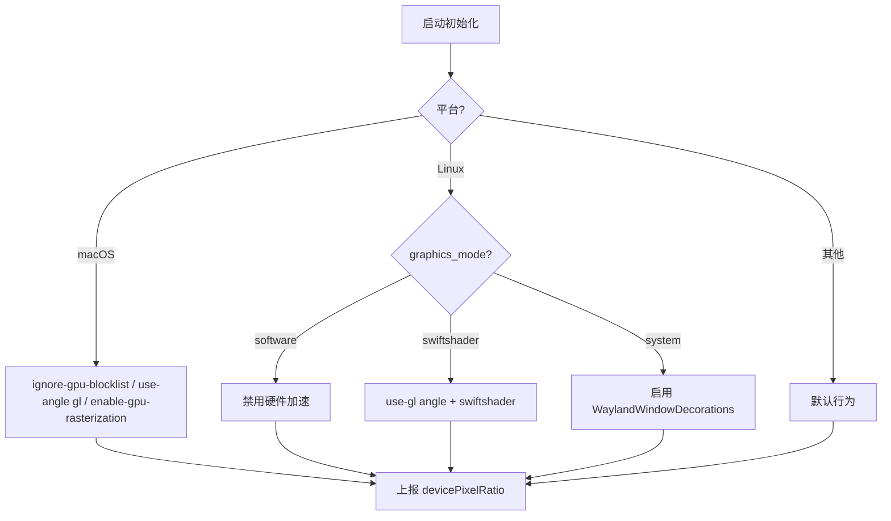
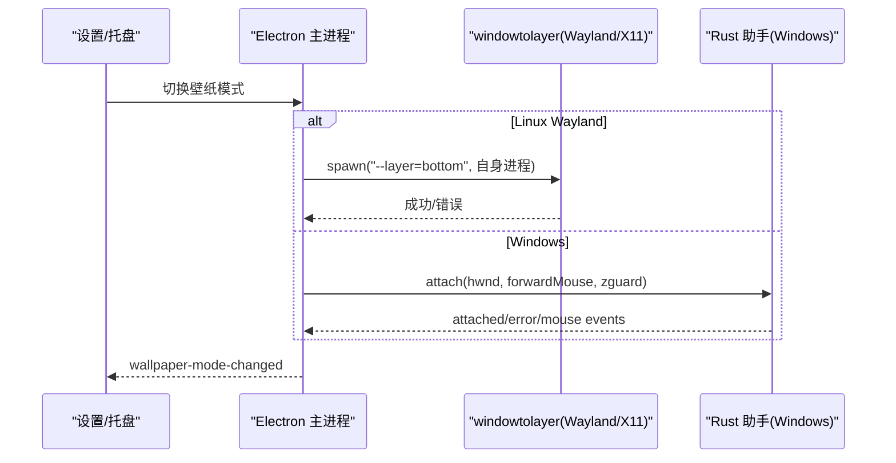
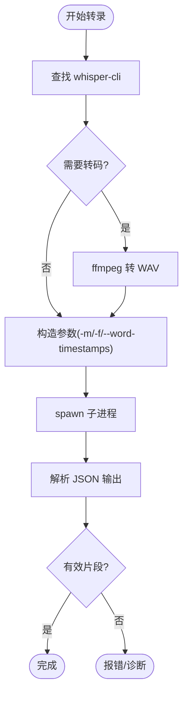
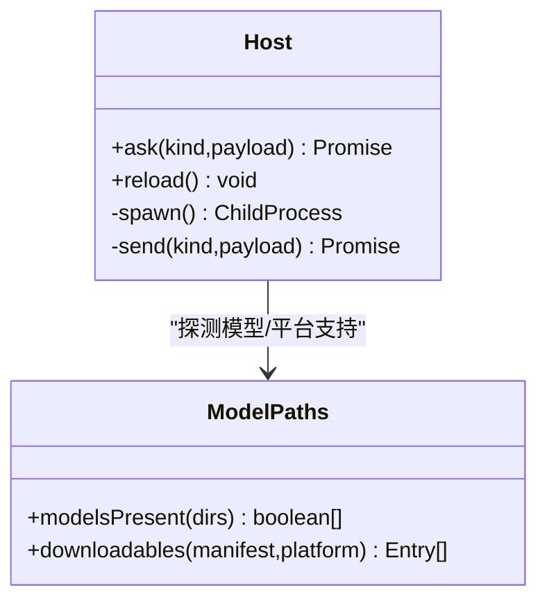
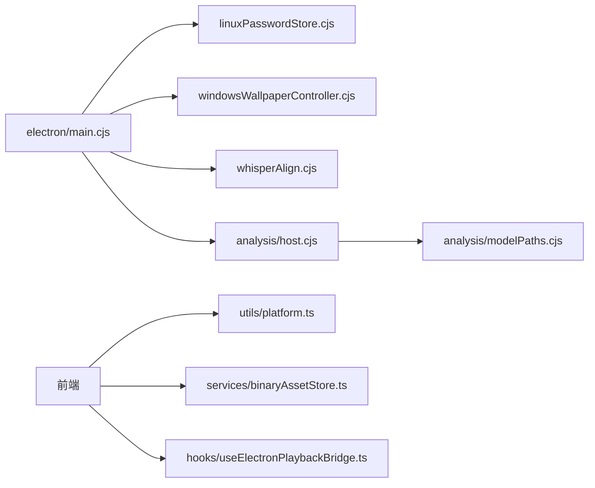

# 跨平台兼容处理

<cite>
**本文引用的文件**
- [electron/main.cjs](file://electron/main.cjs)
- [electron/linuxPasswordStore.cjs](file://electron/linuxPasswordStore.cjs)
- [electron/windowsWallpaperController.cjs](file://electron/windowsWallpaperController.cjs)
- [electron/displaySleepBlocker.cjs](file://electron/displaySleepBlocker.cjs)
- [electron/analysis/host.cjs](file://electron/analysis/host.cjs)
- [electron/analysis/modelPaths.cjs](file://electron/analysis/modelPaths.cjs)
- [electron/whisperAlign.cjs](file://electron/whisperAlign.cjs)
- [src/utils/platform.ts](file://src/utils/platform.ts)
- [src/services/binaryAssetStore.ts](file://src/services/binaryAssetStore.ts)
- [src/hooks/useElectronPlaybackBridge.ts](file://src/hooks/useElectronPlaybackBridge.ts)
- [package.json](file://package.json)
</cite>

## 目录
1. [简介](#简介)
2. [项目结构](#项目结构)
3. [核心组件](#核心组件)
4. [架构总览](#架构总览)
5. [详细组件分析](#详细组件分析)
6. [依赖关系分析](#依赖关系分析)
7. [性能考量](#性能考量)
8. [故障排除指南](#故障排除指南)
9. [结论](#结论)
10. [附录](#附录)

## 简介
本文件聚焦 Folia Player 在 Windows、macOS、Linux 三平台的跨平台兼容实现，覆盖：
- 文件系统访问与路径处理（含 Electron 资源路径、用户数据目录、OPFS 回退）
- 原生模块集成（Rust/C++ 扩展、子进程、动态库加载、平台特定 API）
- 图形渲染差异（GPU 加速、显示适配、DPI 处理、Wayland/X11/Windows 桌面层）
- 平台特定的优化策略（内存管理、资源占用、后台任务）
- 故障排除指南（常见问题与定位方法）

## 项目结构
跨平台相关的关键位置：
- Electron 主进程入口与平台初始化：electron/main.cjs
- Linux 密码存储后端选择：electron/linuxPasswordStore.cjs
- Windows 壁纸模式控制器（Rust 辅助进程）：electron/windowsWallpaperController.cjs
- 显示休眠阻止：electron/displaySleepBlocker.cjs
- 音频分析宿主（Utility Process + 模型发现）：electron/analysis/host.cjs, electron/analysis/modelPaths.cjs
- Whisper 词级对齐（C++ CLI 子进程）：electron/whisperAlign.cjs
- 前端平台检测与快捷键修饰键映射：src/utils/platform.ts
- 封面二进制资产存储（Electron 桥 vs OPFS）：src/services/binaryAssetStore.ts
- DPI 上报与窗口缩放联动：src/hooks/useElectronPlaybackBridge.ts
- 打包配置与平台产物：package.json

**图表来源**
- [electron/main.cjs:1-120](file://electron/main.cjs#L1-L120)
- [electron/linuxPasswordStore.cjs:1-53](file://electron/linuxPasswordStore.cjs#L1-L53)
- [electron/windowsWallpaperController.cjs:1-120](file://electron/windowsWallpaperController.cjs#L1-L120)
- [electron/displaySleepBlocker.cjs:1-25](file://electron/displaySleepBlocker.cjs#L1-L25)
- [electron/analysis/host.cjs:1-120](file://electron/analysis/host.cjs#L1-L120)
- [electron/analysis/modelPaths.cjs:1-104](file://electron/analysis/modelPaths.cjs#L1-L104)
- [electron/whisperAlign.cjs:1-120](file://electron/whisperAlign.cjs#L1-L120)
- [src/utils/platform.ts:1-25](file://src/utils/platform.ts#L1-L25)
- [src/services/binaryAssetStore.ts:72-142](file://src/services/binaryAssetStore.ts#L72-L142)
- [src/hooks/useElectronPlaybackBridge.ts:518-543](file://src/hooks/useElectronPlaybackBridge.ts#L518-L543)

**章节来源**
- [electron/main.cjs:1-120](file://electron/main.cjs#L1-L120)
- [package.json:69-183](file://package.json#L69-L183)

## 核心组件
- 平台初始化与 GPU 开关：根据系统平台设置 Chromium 特性与命令行参数，解决 Wayland/X11/GPU 兼容问题。
- 壁纸模式：Linux 通过 windowtolayer 包装进程进入桌面层；Windows 通过 Rust 辅助进程将窗口父化到 WorkerW。
- Whisper 对齐：调用 C++ 可执行文件 whisper-cli，自动查找/安装并管理模型与 ffmpeg。
- 分析宿主：以 Utility Process 运行分析 worker，按模型目录变化重启，带超时保护与 CPU/GPU 降级。
- 封面二进制存储：Electron 环境下走 IPC 缓存，浏览器环境回退到 OPFS。
- DPI 与显示：上报设备像素比，配合窗口缩放与多显示器场景。

**章节来源**
- [electron/main.cjs:78-137](file://electron/main.cjs#L78-L137)
- [electron/windowsWallpaperController.cjs:1-120](file://electron/windowsWallpaperController.cjs#L1-L120)
- [electron/whisperAlign.cjs:45-120](file://electron/whisperAlign.cjs#L45-L120)
- [electron/analysis/host.cjs:1-120](file://electron/analysis/host.cjs#L1-L120)
- [src/services/binaryAssetStore.ts:72-142](file://src/services/binaryAssetStore.ts#L72-L142)
- [src/hooks/useElectronPlaybackBridge.ts:518-543](file://src/hooks/useElectronPlaybackBridge.ts#L518-L543)

## 架构总览
下图展示了从前端到各平台能力的路径：前端通过 React/Vite 构建，运行时在 Electron 或浏览器中；Electron 主进程负责平台能力封装（GPU、壁纸、密码存储、子进程），并通过 IPC 暴露给前端。

**图表来源**
- [electron/main.cjs:78-137](file://electron/main.cjs#L78-L137)
- [electron/linuxPasswordStore.cjs:30-47](file://electron/linuxPasswordStore.cjs#L30-L47)
- [electron/windowsWallpaperController.cjs:207-257](file://electron/windowsWallpaperController.cjs#L207-L257)
- [electron/whisperAlign.cjs:282-390](file://electron/whisperAlign.cjs#L282-L390)
- [electron/analysis/host.cjs:85-126](file://electron/analysis/host.cjs#L85-L126)
- [electron/analysis/modelPaths.cjs:78-104](file://electron/analysis/modelPaths.cjs#L78-L104)

## 详细组件分析

### 平台检测与快捷键修饰键
- 使用 UA 判断 macOS，统一提供 Cmd/Ctrl 修饰键语义，避免渲染端与 Electron 环境不一致。
- 对快捷键提示与事件处理进行平台归一化。

**图表来源**
- [src/utils/platform.ts:1-25](file://src/utils/platform.ts#L1-L25)

**章节来源**
- [src/utils/platform.ts:1-25](file://src/utils/platform.ts#L1-L25)

### 文件系统访问与路径处理
- Electron 环境：封面等二进制资源优先通过 IPC 读取 Electron 侧缓存；不存在时删除无效条目。
- 浏览器环境：回退到 OPFS（Origin Private File System），按 key 生成文件名并读写。
- 资源路径：Electron 主进程通过 process.resourcesPath 与 app.getPath('userData') 定位资源与用户数据目录。

**图表来源**
- [src/services/binaryAssetStore.ts:72-142](file://src/services/binaryAssetStore.ts#L72-L142)

**章节来源**
- [src/services/binaryAssetStore.ts:72-142](file://src/services/binaryAssetStore.ts#L72-L142)
- [electron/whisperAlign.cjs:45-120](file://electron/whisperAlign.cjs#L45-L120)

### 原生模块集成（Rust/C++ 扩展、动态库加载、平台 API）
- Rust 辅助进程：Windows 壁纸模式通过外部 Rust 程序（folia-wallpaper-helper.exe）将窗口父化到 WorkerW，主进程通过 JSONL 事件通信，包含心跳、鼠标事件、错误恢复。
- C++ CLI：Whisper 对齐通过子进程调用 whisper-cli，自动查找/安装模型与 ffmpeg，解析 JSON 输出为内部格式。
- 平台 API：Electron 主进程使用 powerSaveBlocker、safeStorage、protocol.registerSchemesAsPrivileged、desktopCapturer 等平台能力。

**图表来源**
- [electron/windowsWallpaperController.cjs:259-354](file://electron/windowsWallpaperController.cjs#L259-L354)
- [electron/whisperAlign.cjs:282-390](file://electron/whisperAlign.cjs#L282-L390)

**章节来源**
- [electron/windowsWallpaperController.cjs:1-120](file://electron/windowsWallpaperController.cjs#L1-L120)
- [electron/whisperAlign.cjs:45-120](file://electron/whisperAlign.cjs#L45-L120)
- [electron/main.cjs:1-120](file://electron/main.cjs#L1-L120)

### 图形渲染差异（GPU、显示适配、DPI）
- Linux：根据环境变量与 AppImage 运行时，选择软件渲染、SwiftShader 或启用 Wayland 装饰；必要时禁用 Vulkan 并调整 Ozone 平台提示。
- macOS：针对 Intel Mac + AMD 独显的 Retina 渲染卡顿，启用 ignore-gpu-blocklist、use-angle gl、enable-gpu-rasterization。
- DPI：前端周期性上报设备像素比，确保高分屏下布局与视觉一致。

**图表来源**
- [electron/main.cjs:78-137](file://electron/main.cjs#L78-L137)
- [src/hooks/useElectronPlaybackBridge.ts:518-543](file://src/hooks/useElectronPlaybackBridge.ts#L518-L543)

**章节来源**
- [electron/main.cjs:78-137](file://electron/main.cjs#L78-L137)
- [src/hooks/useElectronPlaybackBridge.ts:518-543](file://src/hooks/useElectronPlaybackBridge.ts#L518-L543)

### 壁纸模式（Windows/Linux）
- Linux：通过 windowtolayer 包装进程进入桌面层（X11/Wayland），支持点击穿透与交互转发；失败时回退普通窗口。
- Windows：通过 Rust 辅助进程将窗口父化到 WorkerW，支持经典/raised 两种桌面架构；鼠标输入经 sendInputEvent 注入，避免 TrackMouseEvent 抖动。

**图表来源**
- [electron/main.cjs:196-226](file://electron/main.cjs#L196-L226)
- [electron/windowsWallpaperController.cjs:259-354](file://electron/windowsWallpaperController.cjs#L259-L354)

**章节来源**
- [electron/main.cjs:145-226](file://electron/main.cjs#L145-L226)
- [electron/windowsWallpaperController.cjs:1-120](file://electron/windowsWallpaperController.cjs#L1-L120)

### Whisper 词级对齐流程
- 初始化：确定模型目录、查找 whisper-cli 与 ffmpeg。
- 转录：可选将非 WAV 转为 WAV，构造参数并 spawn 子进程，解析 JSON 输出。
- 取消：维护 activeJobs，支持 SIGTERM 取消。
- 诊断：对空输出、零时间戳、格式不匹配给出明确错误信息。

**图表来源**
- [electron/whisperAlign.cjs:282-390](file://electron/whisperAlign.cjs#L282-L390)
- [electron/whisperAlign.cjs:543-670](file://electron/whisperAlign.cjs#L543-L670)

**章节来源**
- [electron/whisperAlign.cjs:45-120](file://electron/whisperAlign.cjs#L45-L120)
- [electron/whisperAlign.cjs:282-390](file://electron/whisperAlign.cjs#L282-L390)
- [electron/whisperAlign.cjs:543-670](file://electron/whisperAlign.cjs#L543-L670)

### 自动混音分析宿主（Utility Process + 模型发现）
- 通过 utilityProcess.fork 启动 worker，独立进程隔离大内存占用。
- 空闲回收：无请求超过阈值则停止 worker，释放内存。
- 超时保护：beat_this 有硬截止，超时会杀死 worker 并强制 CPU 重试。
- 模型发现：与 worker 共用同一函数判定模型存在性与平台支持，保证设置页与 worker 行为一致。

**图表来源**
- [electron/analysis/host.cjs:1-120](file://electron/analysis/host.cjs#L1-L120)
- [electron/analysis/modelPaths.cjs:1-104](file://electron/analysis/modelPaths.cjs#L1-L104)

**章节来源**
- [electron/analysis/host.cjs:1-120](file://electron/analysis/host.cjs#L1-L120)
- [electron/analysis/modelPaths.cjs:78-104](file://electron/analysis/modelPaths.cjs#L78-L104)

## 依赖关系分析
- 主进程依赖：
  - Linux 密码存储后端选择（libsecret/kwallet）
  - Windows 壁纸模式（Rust 辅助进程）
  - Whisper 对齐（C++ CLI）
  - 分析宿主（Utility Process + 模型发现）
- 前端依赖：
  - 平台检测（UA）
  - 二进制资产存储（Electron IPC 或 OPFS）
  - DPI 上报（设备像素比）

**图表来源**
- [electron/main.cjs:1-120](file://electron/main.cjs#L1-L120)
- [electron/linuxPasswordStore.cjs:1-53](file://electron/linuxPasswordStore.cjs#L1-L53)
- [electron/windowsWallpaperController.cjs:1-120](file://electron/windowsWallpaperController.cjs#L1-L120)
- [electron/whisperAlign.cjs:1-120](file://electron/whisperAlign.cjs#L1-L120)
- [electron/analysis/host.cjs:1-120](file://electron/analysis/host.cjs#L1-L120)
- [electron/analysis/modelPaths.cjs:1-104](file://electron/analysis/modelPaths.cjs#L1-L104)
- [src/utils/platform.ts:1-25](file://src/utils/platform.ts#L1-L25)
- [src/services/binaryAssetStore.ts:72-142](file://src/services/binaryAssetStore.ts#L72-L142)
- [src/hooks/useElectronPlaybackBridge.ts:518-543](file://src/hooks/useElectronPlaybackBridge.ts#L518-L543)

**章节来源**
- [electron/main.cjs:1-120](file://electron/main.cjs#L1-L120)
- [package.json:69-183](file://package.json#L69-L183)

## 性能考量
- 内存管理：
  - 分析 worker 空闲后停止，避免长时间占用大内存。
  - beat_this 请求设置硬截止，防止 GPU 提供者挂起导致阻塞。
- 资源占用：
  - Whisper 对齐仅在需要时转换音频并清理临时文件。
  - 壁纸模式在失败时自动降级，避免持续尝试造成资源浪费。
- 渲染性能：
  - Linux 可选择 SwiftShader 或软件渲染以规避驱动问题。
  - macOS 启用 GPU 光栅化与忽略 GPU 黑名单，改善 Retina 渲染。
- 后台任务：
  - 显示休眠阻止在播放期间保持屏幕常亮，避免中断体验。

[本节为通用指导，无需具体文件引用]

## 故障排除指南
- Linux Wayland/X11 图形异常：
  - 检查 linuxGraphicsMode 环境变量与 AppImage 运行时，必要时切换到 software/swiftshader。
  - 参考：[electron/main.cjs:78-105](file://electron/main.cjs#L78-L105)
- Linux 密码存储不可用：
  - 确认 XDG_CURRENT_DESKTOP 与 FOLIA_PASSWORD_STORE，避免 basic_text 回退。
  - 参考：[electron/linuxPasswordStore.cjs:30-47](file://electron/linuxPasswordStore.cjs#L30-L47)
- Windows 壁纸模式失效：
  - 检查 folia-wallpaper-helper.exe 是否存在、是否被杀进程；关注 attached/error 事件。
  - 参考：[electron/windowsWallpaperController.cjs:259-354](file://electron/windowsWallpaperController.cjs#L259-L354)
- Whisper 对齐失败：
  - 确认 whisper-cli 与 ffmpeg 可用；检查输出 JSON 结构与片段数量。
  - 参考：[electron/whisperAlign.cjs:282-390](file://electron/whisperAlign.cjs#L282-L390), [electron/whisperAlign.cjs:543-670](file://electron/whisperAlign.cjs#L543-L670)
- 封面资源无法读取：
  - Electron 环境检查 IPC 缓存；浏览器环境检查 OPFS 权限与 MIME 类型。
  - 参考：[src/services/binaryAssetStore.ts:72-142](file://src/services/binaryAssetStore.ts#L72-L142)
- DPI 与缩放问题：
  - 确认前端上报 devicePixelRatio，窗口尺寸变化时重新计算。
  - 参考：[src/hooks/useElectronPlaybackBridge.ts:518-543](file://src/hooks/useElectronPlaybackBridge.ts#L518-L543)

**章节来源**
- [electron/main.cjs:78-105](file://electron/main.cjs#L78-L105)
- [electron/linuxPasswordStore.cjs:30-47](file://electron/linuxPasswordStore.cjs#L30-L47)
- [electron/windowsWallpaperController.cjs:259-354](file://electron/windowsWallpaperController.cjs#L259-L354)
- [electron/whisperAlign.cjs:282-390](file://electron/whisperAlign.cjs#L282-L390)
- [electron/whisperAlign.cjs:543-670](file://electron/whisperAlign.cjs#L543-L670)
- [src/services/binaryAssetStore.ts:72-142](file://src/services/binaryAssetStore.ts#L72-L142)
- [src/hooks/useElectronPlaybackBridge.ts:518-543](file://src/hooks/useElectronPlaybackBridge.ts#L518-L543)

## 结论
Folia Player 通过 Electron 主进程集中管理平台差异，结合 Rust/C++ 子进程与 Utility Process 隔离重型任务，实现了在 Windows、macOS、Linux 上的稳定跨平台体验。关键策略包括：
- 明确的平台分支与降级路径（图形、壁纸、密码存储）
- 子进程与超时保护（分析、Whisper）
- 前端与主进程的清晰边界（IPC、OPFS 回退、DPI 上报）
- 完善的故障恢复与日志诊断

[本节为总结，无需具体文件引用]

## 附录
- 打包与分发：
  - Windows：NSIS/Portable，附带壁纸辅助程序。
  - macOS：dmg/zip，双架构支持。
  - Linux：tar.gz/deb/rpm，附加 desktop 与说明文件。
- 环境变量：
  - FOLIA_LINUX_GRAPHICS_MODE、FOLIA_WINDOWTOLAYER_PATH、FOLIA_WALLPAPER_HELPER_PATH、FOLIA_PASSWORD_STORE 等用于调试与定制。

**章节来源**
- [package.json:69-183](file://package.json#L69-L183)