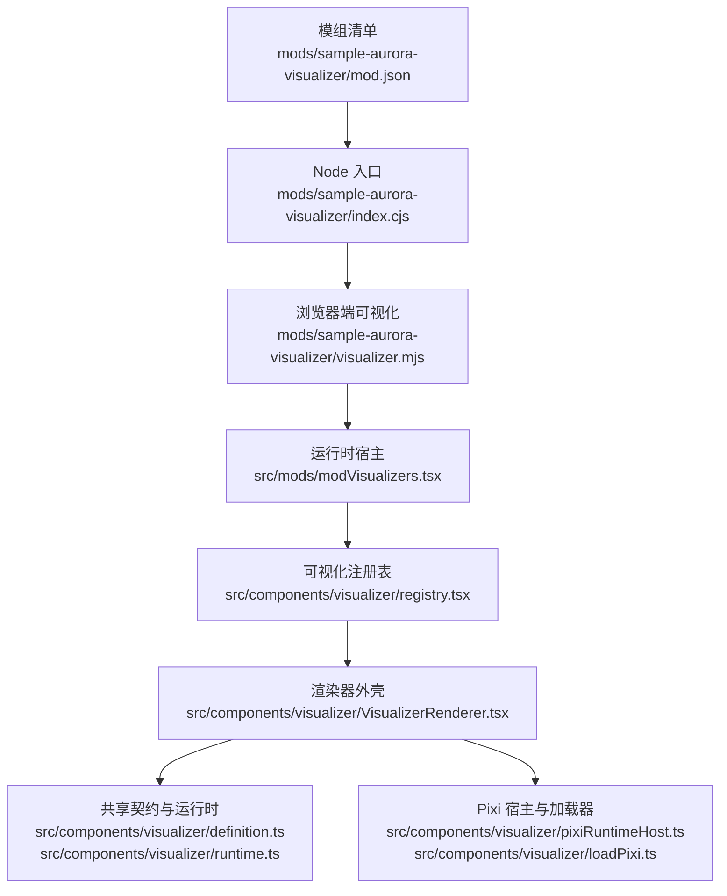
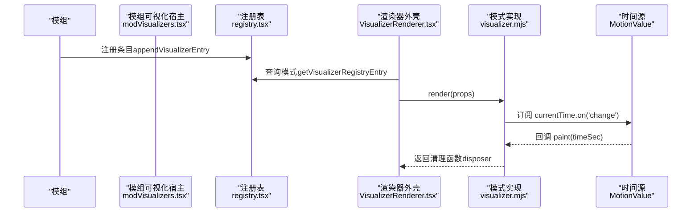
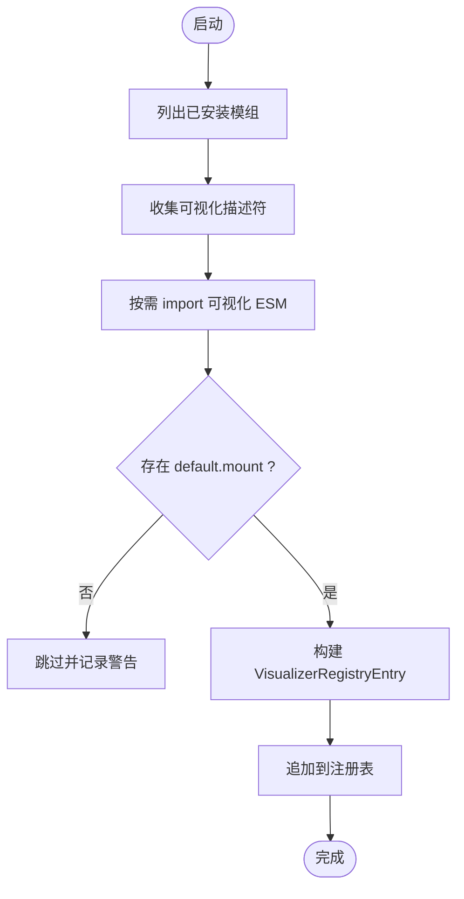
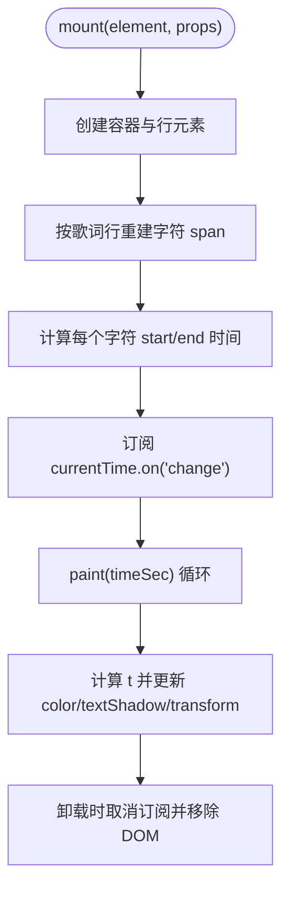
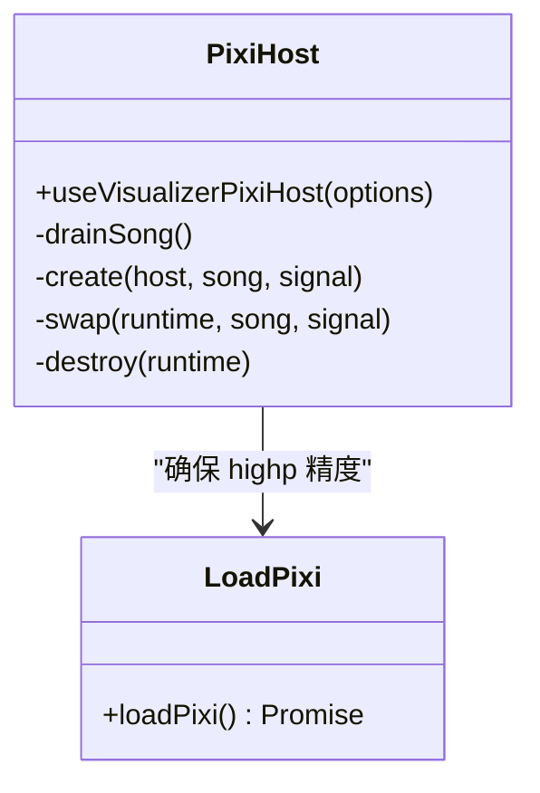
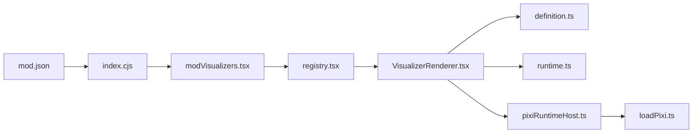

# Aurora极光可视化器

<cite>
**本文引用的文件**
- [mod.json](file://mods/sample-aurora-visualizer/mod.json)
- [index.cjs](file://mods/sample-aurora-visualizer/index.cjs)
- [visualizer.mjs](file://mods/sample-aurora-visualizer/visualizer.mjs)
- [registry.tsx](file://src/components/visualizer/registry.tsx)
- [definition.ts](file://src/components/visualizer/definition.ts)
- [runtime.ts](file://src/components/visualizer/runtime.ts)
- [pixiRuntimeHost.ts](file://src/components/visualizer/pixiRuntimeHost.ts)
- [loadPixi.ts](file://src/components/visualizer/loadPixi.ts)
- [VisualizerRenderer.tsx](file://src/components/visualizer/VisualizerRenderer.tsx)
- [README.md](file://src/components/visualizer/README.md)
- [modVisualizers.tsx](file://src/mods/modVisualizers.tsx)
</cite>

## 目录
1. [简介](#简介)
2. [项目结构](#项目结构)
3. [核心组件](#核心组件)
4. [架构总览](#架构总览)
5. [详细组件分析](#详细组件分析)
6. [依赖关系分析](#依赖关系分析)
7. [性能考量](#性能考量)
8. [故障排查指南](#故障排查指南)
9. [结论](#结论)
10. [附录：自定义可视化开发指南](#附录自定义可视化开发指南)

## 简介
本文件为“虹光歌词动画（样例）”Aurora 极光可视化器的完整开发文档。该示例模组通过 Folia 的可视化系统，在播放时以逐字虹光扫过的方式展示当前歌词行，演示了 v2 可视化贡献能力，并可用于播放器与透明视频导出场景。文档将围绕以下方面展开：
- Pixi.js 集成与精度策略（针对 WebGL 着色器精度问题）
- 音频响应与歌词时序模型（基于 MotionValue 的时间流）
- 粒子系统与渲染管线（示例使用 DOM + CSS 实现，同时提供 Pixi 宿主封装用于复杂模式）
- 数学模型、颜色渐变算法、动画时序控制
- 模组注册机制、生命周期管理、与播放系统的同步方式
- 自定义可视化开发指南（含着色器编写、性能优化、内存管理最佳实践）

## 项目结构
Aurora 示例位于 mods 目录下，包含模组清单、Node 侧入口和浏览器端可视化实现；核心可视化运行时与注册表位于 src/components/visualizer 下，并通过 src/mods/modVisualizers.tsx 桥接模组贡献到运行时。

图表来源
- [mod.json:1-19](file://mods/sample-aurora-visualizer/mod.json#L1-L19)
- [index.cjs:1-10](file://mods/sample-aurora-visualizer/index.cjs#L1-L10)
- [visualizer.mjs:1-81](file://mods/sample-aurora-visualizer/visualizer.mjs#L1-L81)
- [modVisualizers.tsx:1-188](file://src/mods/modVisualizers.tsx#L1-L188)
- [registry.tsx:1-106](file://src/components/visualizer/registry.tsx#L1-L106)
- [VisualizerRenderer.tsx:1-47](file://src/components/visualizer/VisualizerRenderer.tsx#L1-L47)
- [definition.ts:1-183](file://src/components/visualizer/definition.ts#L1-L183)
- [runtime.ts:1-158](file://src/components/visualizer/runtime.ts#L1-L158)
- [pixiRuntimeHost.ts:1-144](file://src/components/visualizer/pixiRuntimeHost.ts#L1-L144)
- [loadPixi.ts:1-37](file://src/components/visualizer/loadPixi.ts#L1-L37)

章节来源
- [mod.json:1-19](file://mods/sample-aurora-visualizer/mod.json#L1-L19)
- [index.cjs:1-10](file://mods/sample-aurora-visualizer/index.cjs#L1-L10)
- [visualizer.mjs:1-81](file://mods/sample-aurora-visualizer/visualizer.mjs#L1-L81)
- [registry.tsx:1-106](file://src/components/visualizer/registry.tsx#L1-L106)
- [definition.ts:1-183](file://src/components/visualizer/definition.ts#L1-L183)
- [runtime.ts:1-158](file://src/components/visualizer/runtime.ts#L1-L158)
- [pixiRuntimeHost.ts:1-144](file://src/components/visualizer/pixiRuntimeHost.ts#L1-L144)
- [loadPixi.ts:1-37](file://src/components/visualizer/loadPixi.ts#L1-L37)
- [VisualizerRenderer.tsx:1-47](file://src/components/visualizer/VisualizerRenderer.tsx#L1-L47)
- [modVisualizers.tsx:1-188](file://src/mods/modVisualizers.tsx#L1-L188)
- [README.md:1-166](file://src/components/visualizer/README.md#L1-L166)

## 核心组件
- 模组清单与入口：定义模组元数据、权限与可视化条目，Node 侧仅做激活日志。
- 浏览器端可视化：纯 ESM，挂载 DOM 子树，订阅时间变化，按字符粒度计算虹光扫过效果。
- 运行时宿主：将模组贡献的可视化适配为 React 可视化合约，注入共享属性（歌词、主题、时间等）。
- 注册表：集中发现与排序内置模式，支持运行时追加/移除模组模式。
- 渲染器外壳：应用调谐参数、背景配置，调用具体模式的 render，并叠加和谐字幕层。
- Pixi 宿主与加载器：为需要 Pixi 的模式提供一次性创建、歌曲切换、销毁的生命周期管理；统一提升片段着色器精度以避免 fp16 溢出导致的黑边问题。
- 共享运行时：提供当前行、上一句、下一句、预热窗口等工具函数，避免各模式重复扫描歌词数据。

章节来源
- [mod.json:1-19](file://mods/sample-aurora-visualizer/mod.json#L1-L19)
- [index.cjs:1-10](file://mods/sample-aurora-visualizer/index.cjs#L1-L10)
- [visualizer.mjs:1-81](file://mods/sample-aurora-visualizer/visualizer.mjs#L1-L81)
- [modVisualizers.tsx:1-188](file://src/mods/modVisualizers.tsx#L1-L188)
- [registry.tsx:1-106](file://src/components/visualizer/registry.tsx#L1-L106)
- [VisualizerRenderer.tsx:1-47](file://src/components/visualizer/VisualizerRenderer.tsx#L1-L47)
- [pixiRuntimeHost.ts:1-144](file://src/components/visualizer/pixiRuntimeHost.ts#L1-L144)
- [loadPixi.ts:1-37](file://src/components/visualizer/loadPixi.ts#L1-L37)
- [runtime.ts:1-158](file://src/components/visualizer/runtime.ts#L1-L158)
- [definition.ts:1-183](file://src/components/visualizer/definition.ts#L1-L183)

## 架构总览
Aurora 示例遵循“模组声明 → 运行时桥接 → 注册表发现 → 渲染器外壳 → 模式实现”的分层架构。时间驱动采用 MotionValue 事件订阅，避免每帧 React state 更新；对于需要 Pixi 的模式，使用统一的宿主封装保证 WebGL 上下文与资源池的稳定复用。

图表来源
- [modVisualizers.tsx:92-158](file://src/mods/modVisualizers.tsx#L92-L158)
- [registry.tsx:79-106](file://src/components/visualizer/registry.tsx#L79-L106)
- [VisualizerRenderer.tsx:13-47](file://src/components/visualizer/VisualizerRenderer.tsx#L13-L47)
- [visualizer.mjs:8-81](file://mods/sample-aurora-visualizer/visualizer.mjs#L8-L81)

## 详细组件分析

### 模组声明与生命周期
- 模组清单声明 id、名称、版本、API 版本、权限与可视化条目；其中可视化条目指定 id、入口、标签与排序。
- Node 侧入口仅在加载时输出日志，实际动画逻辑在浏览器端 ESM 中实现。
- 运行时宿主负责从 IPC 获取模组列表，动态导入 ESM 模块，校验 mount 接口，构建 VisualizerRegistryEntry 并追加到注册表；当模组状态变化时重新对齐注册表。

图表来源
- [modVisualizers.tsx:106-158](file://src/mods/modVisualizers.tsx#L106-L158)
- [registry.tsx:79-106](file://src/components/visualizer/registry.tsx#L79-L106)

章节来源
- [mod.json:1-19](file://mods/sample-aurora-visualizer/mod.json#L1-L19)
- [index.cjs:1-10](file://mods/sample-aurora-visualizer/index.cjs#L1-L10)
- [modVisualizers.tsx:1-188](file://src/mods/modVisualizers.tsx#L1-L188)
- [registry.tsx:1-106](file://src/components/visualizer/registry.tsx#L1-L106)

### 浏览器端可视化实现（Aurora 示例）
- 挂载阶段：创建容器与文本行元素，按当前歌词行重建 span 数组，并为每个字符计算起止时间。
- 时间驱动：通过 props.currentTime.on('change', paint) 订阅连续时间，避免 React state 频繁更新。
- 渲染逻辑：根据字符起止时间与当前时间计算 t，映射到色相旋转与透明度/阴影/位移，形成“虹光扫过”效果。
- 清理阶段：取消订阅、移除 DOM、释放引用。

图表来源
- [visualizer.mjs:8-81](file://mods/sample-aurora-visualizer/visualizer.mjs#L8-L81)

章节来源
- [visualizer.mjs:1-81](file://mods/sample-aurora-visualizer/visualizer.mjs#L1-L81)

### 共享运行时与歌词处理
- 提供获取最近已完成行、即将出现的行、预热线程的工具函数，帮助模式高效定位当前与未来歌词。
- useVisualizerRuntime 钩子聚合当前时间值、活跃行、上一句、下一句与后续两行，供模式复用。
- 建议模式不要自行扫描 lines，而是使用这些工具函数减少重复计算。

章节来源
- [runtime.ts:1-158](file://src/components/visualizer/runtime.ts#L1-L158)
- [README.md:19-27](file://src/components/visualizer/README.md#L19-L27)

### Pixi 宿主与着色器精度
- pixiRuntimeHost：为需要 Pixi 的模式提供一次性创建、歌曲切换、销毁的生命周期管理；支持并发换歌时的“排空”策略，避免屏幕闪烁或长时间空白。
- loadPixi：在首次导入 Pixi 时将片段着色器精度设置为 highp，避免 NVIDIA Linux 上 mediump 导致的高频噪声溢出产生黑边。

图表来源
- [pixiRuntimeHost.ts:11-144](file://src/components/visualizer/pixiRuntimeHost.ts#L11-L144)
- [loadPixi.ts:1-37](file://src/components/visualizer/loadPixi.ts#L1-L37)

章节来源
- [pixiRuntimeHost.ts:1-144](file://src/components/visualizer/pixiRuntimeHost.ts#L1-L144)
- [loadPixi.ts:1-37](file://src/components/visualizer/loadPixi.ts#L1-L37)

### 渲染器外壳与调谐注入
- VisualizerRenderer 负责应用视觉调谐、背景配置，查找对应模式的 render 并渲染，同时叠加和谐字幕层。
- 通过 applyVisualizerTuning 将模式级调谐参数注入到共享 props，保证不同宿主（播放器、预览、OBS 源、导出页）行为一致。

章节来源
- [VisualizerRenderer.tsx:1-47](file://src/components/visualizer/VisualizerRenderer.tsx#L1-L47)
- [definition.ts:165-183](file://src/components/visualizer/definition.ts#L165-L183)

## 依赖关系分析
- 模组清单与 Node 入口：声明权限与可视化条目，Node 侧仅做日志。
- 运行时宿主：依赖 IPC 获取模组信息，动态导入 ESM，构建并追加到注册表。
- 注册表：集中发现内置模式，支持运行时追加/移除模组模式。
- 渲染器外壳：依赖注册表查找模式，注入调谐与背景，调用模式 render。
- 共享运行时：提供歌词与时间工具，被各模式复用。
- Pixi 宿主与加载器：为需要 Pixi 的模式提供稳定生命周期与精度保障。

图表来源
- [mod.json:1-19](file://mods/sample-aurora-visualizer/mod.json#L1-L19)
- [index.cjs:1-10](file://mods/sample-aurora-visualizer/index.cjs#L1-L10)
- [modVisualizers.tsx:1-188](file://src/mods/modVisualizers.tsx#L1-L188)
- [registry.tsx:1-106](file://src/components/visualizer/registry.tsx#L1-L106)
- [VisualizerRenderer.tsx:1-47](file://src/components/visualizer/VisualizerRenderer.tsx#L1-L47)
- [definition.ts:1-183](file://src/components/visualizer/definition.ts#L1-L183)
- [runtime.ts:1-158](file://src/components/visualizer/runtime.ts#L1-L158)
- [pixiRuntimeHost.ts:1-144](file://src/components/visualizer/pixiRuntimeHost.ts#L1-L144)
- [loadPixi.ts:1-37](file://src/components/visualizer/loadPixi.ts#L1-L37)

章节来源
- [mod.json:1-19](file://mods/sample-aurora-visualizer/mod.json#L1-L19)
- [index.cjs:1-10](file://mods/sample-aurora-visualizer/index.cjs#L1-L10)
- [modVisualizers.tsx:1-188](file://src/mods/modVisualizers.tsx#L1-L188)
- [registry.tsx:1-106](file://src/components/visualizer/registry.tsx#L1-L106)
- [VisualizerRenderer.tsx:1-47](file://src/components/visualizer/VisualizerRenderer.tsx#L1-L47)
- [definition.ts:1-183](file://src/components/visualizer/definition.ts#L1-L183)
- [runtime.ts:1-158](file://src/components/visualizer/runtime.ts#L1-L158)
- [pixiRuntimeHost.ts:1-144](file://src/components/visualizer/pixiRuntimeHost.ts#L1-L144)
- [loadPixi.ts:1-37](file://src/components/visualizer/loadPixi.ts#L1-L37)

## 性能考量
- 时间驱动优先使用 MotionValue 事件订阅，避免每帧 React state 更新带来的重渲染开销。
- 歌词数据处理使用共享运行时工具函数，减少重复扫描与计算。
- 对于 Pixi 模式，使用宿主封装保证 WebGL 上下文与纹理池稳定复用，避免歌曲切换时重建导致的卡顿与黑屏。
- 着色器精度统一为 highp，避免 fp16 溢出导致的黑边与性能退化。
- 布局缓存键需包含歌词内容、主题、最终字重、窗口尺寸与模式调谐，确保测量与渲染一致性。

[本节为通用指导，不直接分析具体文件]

## 故障排查指南
- 初始化失败：若 Pixi 初始化失败，宿主会记录错误并允许回退到文本显示；检查 onFailedChange 回调与控制台日志。
- 歌曲切换卡顿：确认 swap 实现是否及时完成，避免长时间排队；宿主会“排空”到最新歌曲，防止用户停止跳歌后仍持续切换。
- 黑边/黑三角：确认已在 Pixi 构造前设置片段着色器精度为 highp；检查噪声滤镜种子与分辨率。
- 模组未生效：检查 mod.json 权限与可视化条目是否正确；确认运行时宿主成功导入 ESM 并追加到注册表。

章节来源
- [pixiRuntimeHost.ts:87-124](file://src/components/visualizer/pixiRuntimeHost.ts#L87-L124)
- [loadPixi.ts:1-37](file://src/components/visualizer/loadPixi.ts#L1-L37)
- [modVisualizers.tsx:142-158](file://src/mods/modVisualizers.tsx#L142-L158)

## 结论
Aurora 示例展示了如何在 Folia 可视化系统中以最小成本实现高质量歌词动画。通过统一的注册表、运行时宿主与共享工具，开发者可以专注于模式本身的视觉效果与交互。对于更复杂的渲染需求，Pixi 宿主提供了稳定的生命周期管理与精度保障。遵循本文档的架构与最佳实践，可快速构建高性能、易维护的可视化模组。

[本节为总结性内容，不直接分析具体文件]

## 附录：自定义可视化开发指南

### 开发步骤
- 创建模组清单：在 mods 下新建目录，编写 mod.json，声明 id、名称、版本、API 版本、权限与可视化条目。
- 编写 Node 入口：index.cjs 仅做激活日志（可选），实际动画逻辑放在浏览器端 ESM。
- 实现浏览器端可视化：
  - 挂载 DOM 子树，按当前歌词行重建字符节点。
  - 订阅 props.currentTime.on('change', paint)，实现逐帧渲染。
  - 在清理函数中取消订阅、移除 DOM、释放引用。
- 集成到运行时：通过模组系统自动发现并追加到注册表，无需手动修改注册表。

章节来源
- [mod.json:1-19](file://mods/sample-aurora-visualizer/mod.json#L1-L19)
- [index.cjs:1-10](file://mods/sample-aurora-visualizer/index.cjs#L1-L10)
- [visualizer.mjs:1-81](file://mods/sample-aurora-visualizer/visualizer.mjs#L1-L81)
- [modVisualizers.tsx:106-158](file://src/mods/modVisualizers.tsx#L106-L158)

### 数学模型与颜色渐变
- 字符时序：按歌词行的 startTime 与 endTime 均匀分配每个字符的起止时间，生产环境可映射 Line.words 的真实时间戳。
- 虹光扫过：t = (timeSec - start) / (end - start)，clamp 到 [0,1]；色相随 start 与 t 变化，透明度与阴影强度随 t 上升，未激活字符保持柔和发光。
- 动画时序：使用 MotionValue 事件驱动，避免 React state 高频更新；必要时结合 CSS transition 与 transform 提升流畅度。

章节来源
- [visualizer.mjs:43-70](file://mods/sample-aurora-visualizer/visualizer.mjs#L43-L70)

### 着色器编写与精度
- 在 Pixi 使用前调用 loadPixi，确保片段着色器精度为 highp，避免 fp16 溢出导致的黑边。
- 自定义滤镜需注意 gl_FragCoord 与种子参数的范围，避免数值溢出；必要时降低后处理分辨率或调整种子。

章节来源
- [loadPixi.ts:1-37](file://src/components/visualizer/loadPixi.ts#L1-L37)

### 性能优化策略
- 使用共享运行时工具函数，避免重复扫描歌词数据。
- 布局缓存键包含歌词内容、主题、最终字重、窗口尺寸与模式调谐，确保测量与渲染一致性。
- 对 Pixi 模式，使用宿主封装保证 WebGL 上下文与纹理池稳定复用，避免歌曲切换时重建导致的卡顿。
- 高频动画优先使用 requestAnimationFrame、CSS/Motion、Canvas 或 Pixi draw loop，避免每帧写 React state/store。

章节来源
- [runtime.ts:1-158](file://src/components/visualizer/runtime.ts#L1-L158)
- [pixiRuntimeHost.ts:1-144](file://src/components/visualizer/pixiRuntimeHost.ts#L1-L144)
- [README.md:149-155](file://src/components/visualizer/README.md#L149-L155)

### 内存管理最佳实践
- 在清理函数中取消所有订阅、移除 DOM、释放引用，避免内存泄漏。
- 对 Pixi 模式，确保 destroy 正确释放 WebGL 上下文与纹理池。
- 避免在模式中持有全局大对象引用；使用局部变量与弱引用管理临时数据。

章节来源
- [visualizer.mjs:72-81](file://mods/sample-aurora-visualizer/visualizer.mjs#L72-L81)
- [pixiRuntimeHost.ts:125-134](file://src/components/visualizer/pixiRuntimeHost.ts#L125-L134)

### 调试工具使用
- 控制台日志：查看模组加载、初始化失败与歌曲切换错误信息。
- 运行时宿主：观察 drainSong 流程，确认歌曲切换是否及时完成。
- 精度检查：确认 Pixi 初始化前已设置 highp；检查噪声滤镜种子与分辨率。
- 模组状态：通过 IPC 列出模组，确认可视化条目是否正确注册。

章节来源
- [modVisualizers.tsx:142-158](file://src/mods/modVisualizers.tsx#L142-L158)
- [pixiRuntimeHost.ts:87-124](file://src/components/visualizer/pixiRuntimeHost.ts#L87-L124)
- [loadPixi.ts:1-37](file://src/components/visualizer/loadPixi.ts#L1-L37)