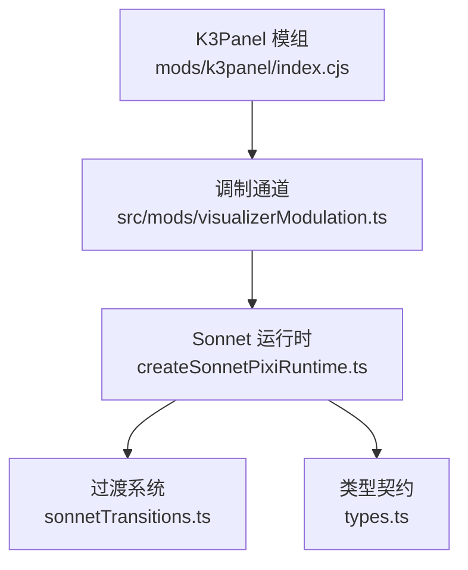
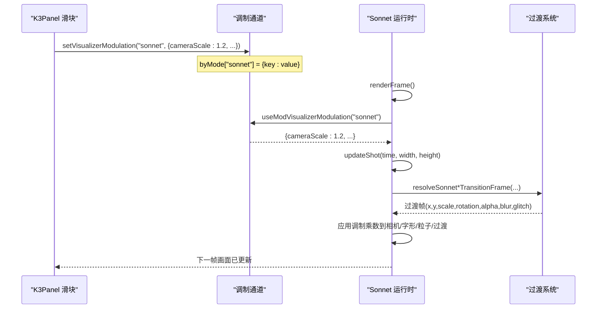
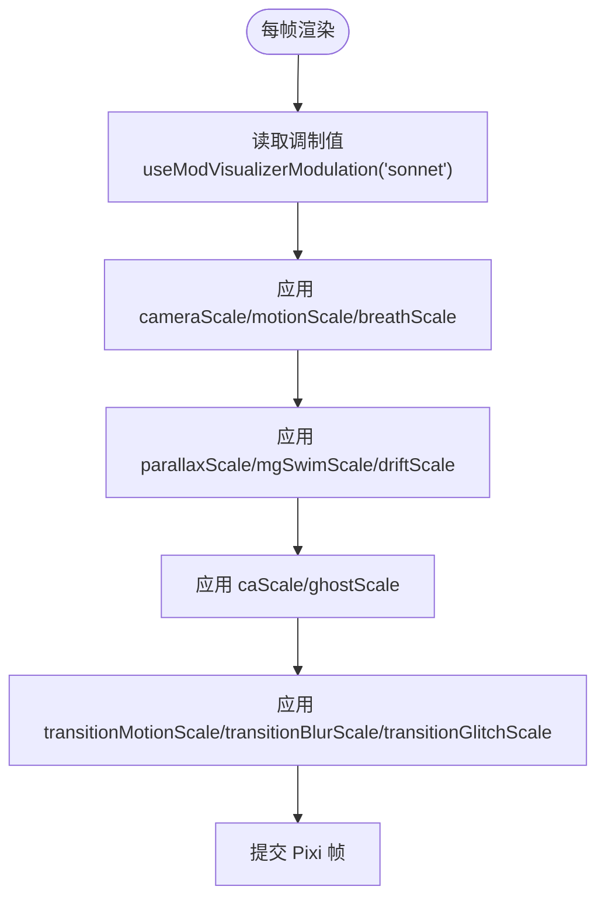
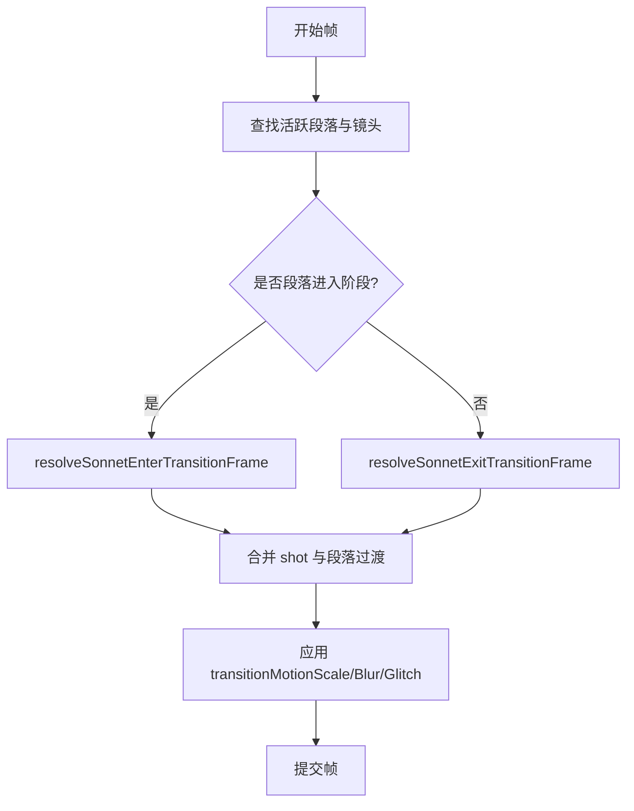
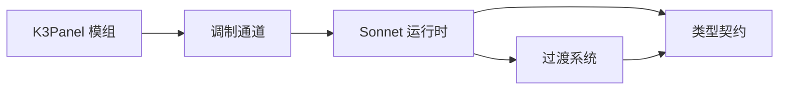

# K3Panel深度调优面板

<cite>
**本文引用的文件**
- [mods/k3panel/index.cjs](file://mods/k3panel/index.cjs)
- [mods/k3panel/mod.json](file://mods/k3panel/mod.json)
- [src/mods/visualizerModulation.ts](file://src/mods/visualizerModulation.ts)
- [src/components/visualizer/sonnet/createSonnetPixiRuntime.ts](file://src/components/visualizer/sonnet/createSonnetPixiRuntime.ts)
- [src/components/visualizer/sonnet/sonnetTransitions.ts](file://src/components/visualizer/sonnet/sonnetTransitions.ts)
- [src/components/visualizer/sonnet/types.ts](file://src/components/visualizer/sonnet/types.ts)
</cite>

## 目录
1. [简介](#简介)
2. [项目结构](#项目结构)
3. [核心组件](#核心组件)
4. [架构总览](#架构总览)
5. [详细组件分析](#详细组件分析)
6. [依赖关系分析](#依赖关系分析)
7. [性能考虑](#性能考虑)
8. [故障排查指南](#故障排查指南)
9. [结论](#结论)
10. [附录](#附录)

## 简介
K3Panel 是一个面向“商籁（Sonnet）”可视化器的声明式深度调优面板。它通过“modulate 模式”将滑块参数直接写入渲染侧的共享调制存储，由 Sonnet 运行时每帧读取并应用，实现无主进程往返的实时调节。该面板暴露了原版设置未提供的相机、逐字入场、呼吸浮动、3D视差、动图漂移、色差、残影与转场等关键参数的细粒度控制，使创作者能在播放过程中即时微调视觉效果。

## 项目结构
- 模组入口：mods/k3panel/index.cjs 注册命令与参数元数据，声明每个旋钮的 modulate 模式为 sonnet。
- 模组清单：mods/k3panel/mod.json 描述模组基本信息与入口。
- 调制通道：src/mods/visualizerModulation.ts 提供渲染侧 zustand 状态，供模组写入、可视化器读取。
- 渲染集成：src/components/visualizer/sonnet/createSonnetPixiRuntime.ts 在每帧更新中读取调制值并应用到相机、运动、视差、转场等效果。
- 过渡系统：src/components/visualizer/sonnet/sonnetTransitions.ts 提供多种场景过渡效果，被运行时按时间计算并应用。
- 类型契约：src/components/visualizer/sonnet/types.ts 定义段落、镜头、过渡等数据结构。

**图表来源**
- [mods/k3panel/index.cjs:11-47](file://mods/k3panel/index.cjs#L11-L47)
- [src/mods/visualizerModulation.ts:12-48](file://src/mods/visualizerModulation.ts#L12-L48)
- [src/components/visualizer/sonnet/createSonnetPixiRuntime.ts:99-100](file://src/components/visualizer/sonnet/createSonnetPixiRuntime.ts#L99-L100)
- [src/components/visualizer/sonnet/sonnetTransitions.ts:18-27](file://src/components/visualizer/sonnet/sonnetTransitions.ts#L18-L27)
- [src/components/visualizer/sonnet/types.ts:55-92](file://src/components/visualizer/sonnet/types.ts#L55-L92)

**章节来源**
- [mods/k3panel/index.cjs:11-47](file://mods/k3panel/index.cjs#L11-L47)
- [mods/k3panel/mod.json:1-11](file://mods/k3panel/mod.json#L1-L11)
- [src/mods/visualizerModulation.ts:12-48](file://src/mods/visualizerModulation.ts#L12-L48)
- [src/components/visualizer/sonnet/createSonnetPixiRuntime.ts:99-100](file://src/components/visualizer/sonnet/createSonnetPixiRuntime.ts#L99-L100)
- [src/components/visualizer/sonnet/sonnetTransitions.ts:18-27](file://src/components/visualizer/sonnet/sonnetTransitions.ts#L18-L27)
- [src/components/visualizer/sonnet/types.ts:55-92](file://src/components/visualizer/sonnet/types.ts#L55-L92)

## 核心组件
- 参数映射机制：K3Panel 将每个旋钮 key（如 cameraScale、motionScale、breathScale 等）映射到数值型参数，并通过 modulate: { mode: 'sonnet' } 标记其目标模式。
- 实时调制系统：渲染侧 zustand 存储 byMode 字典，保存各模式的键值对；模组写入 patch，Sonnet 运行时每帧读取对应模式的调制值。
- 渲染进程直接更新：Sonnet 运行时在 updateShot 和过渡计算中调用 this.mod('key') 获取乘数，直接作用于相机位移、缩放、旋转、粒子层、字形位置与透明度等，无需主进程参与。

**章节来源**
- [mods/k3panel/index.cjs:11-47](file://mods/k3panel/index.cjs#L11-L47)
- [src/mods/visualizerModulation.ts:12-48](file://src/mods/visualizerModulation.ts#L12-L48)
- [src/components/visualizer/sonnet/createSonnetPixiRuntime.ts:443-682](file://src/components/visualizer/sonnet/createSonnetPixiRuntime.ts#L443-L682)

## 架构总览
K3Panel 通过声明式参数注册，将旋钮值写入渲染侧调制存储；Sonnet 运行时每帧从存储中读取当前模式的调制值，并将其作为乘数应用到动画与过渡计算中，从而实现对可视化的实时微调。

**图表来源**
- [src/mods/visualizerModulation.ts:18-48](file://src/mods/visualizerModulation.ts#L18-L48)
- [src/components/visualizer/sonnet/createSonnetPixiRuntime.ts:684-800](file://src/components/visualizer/sonnet/createSonnetPixiRuntime.ts#L684-L800)
- [src/components/visualizer/sonnet/sonnetTransitions.ts:38-187](file://src/components/visualizer/sonnet/sonnetTransitions.ts#L38-L187)

## 详细组件分析

### 参数映射机制与 modulate 模式
- 参数列表与范围：K3Panel 定义了多个旋钮 key，包括 cameraScale、motionScale、breathScale、parallaxScale、mgSwimScale、driftScale、caScale、ghostScale、transitionMotionScale、transitionBlurScale、transitionGlitchScale，均为 number 类型，默认值为 1（恒等），范围 0–3，步长 0.01。
- 声明式注册：每个参数通过 params 数组注册，并携带 modulate: { mode: 'sonnet' }，表示这些值将被 Sonnet 运行时读取。
- 运行处理器：run 处理器为空占位，因为调制值不经过主进程，也不触发业务逻辑，仅影响渲染。

**章节来源**
- [mods/k3panel/index.cjs:11-47](file://mods/k3panel/index.cjs#L11-L47)

### 实时调制系统与渲染侧更新
- 调制存储：byMode 以模式为键，保存键值对；setModulation 合并 patch；resetModulation 可清空某模式或全部。
- 订阅接口：useModVisualizerModulation(mode) 返回稳定空对象当无调制值，避免不必要重渲染。
- 运行时读取：Sonnet 运行时在 updateShot 中多次调用 this.mod('key') 获取乘数，应用于：
  - 相机强度与逐字运动：cameraScale、motionScale
  - 呼吸浮动：breathScale
  - 3D视差：parallaxScale
  - 动图漂移：mgSwimScale
  - 间隙漂移：driftScale
  - 色差强度：caScale
  - 残影扩散：ghostScale
  - 转场位移/缩放/模糊/故障：transitionMotionScale、transitionBlurScale、transitionGlitchScale

**图表来源**
- [src/mods/visualizerModulation.ts:18-48](file://src/mods/visualizerModulation.ts#L18-L48)
- [src/components/visualizer/sonnet/createSonnetPixiRuntime.ts:443-682](file://src/components/visualizer/sonnet/createSonnetPixiRuntime.ts#L443-L682)

**章节来源**
- [src/mods/visualizerModulation.ts:18-48](file://src/mods/visualizerModulation.ts#L18-L48)
- [src/components/visualizer/sonnet/createSonnetPixiRuntime.ts:443-682](file://src/components/visualizer/sonnet/createSonnetPixiRuntime.ts#L443-L682)

### 可调参数详解
- 相机幅度（cameraScale）：放大或缩小内置相机运动的强度，影响镜头位移、缩放与旋转的幅度。
- 逐字入场幅度（motionScale）：控制字形进入动画的偏移、旋转与缩放强度，增强或减弱逐字动效。
- 呼吸浮动（breathScale）：在歌词揭示完成后叠加稳定的呼吸浮动，避免画面静止；增大后浮动感更强。
- 3D视差（parallaxScale）：基于字形 zDepth 的视差位移与缩放，营造前后景深错觉；增大后层次更明显。
- 动图漂移（mgSwimScale）：装饰粒子层的独立旋转速度，产生缓慢游移效果；增大后动态感更强。
- 间隙漂移（driftScale）：在镜头结束后的时间间隙内，继承末段运动方向继续缓慢漂移；增大后漂移更显著。
- 色差强度（caScale）：控制 RGB 通道分离的起始与合并程度，增强或减弱冲击时的色差效果。
- 残影扩散（ghostScale）：半英雄残影沿布局法线扩散并快速衰减；增大后残影扩散更远。
- 转场位移/缩放（transitionMotionScale）：放大或缩小转场的位移与缩放幅度。
- 转场模糊（transitionBlurScale）：放大或缩小转场过程中的模糊强度。
- 转场故障（transitionGlitchScale）：放大或缩小转场中的故障抖动效果。

**章节来源**
- [mods/k3panel/index.cjs:11-25](file://mods/k3panel/index.cjs#L11-L25)
- [src/components/visualizer/sonnet/createSonnetPixiRuntime.ts:443-682](file://src/components/visualizer/sonnet/createSonnetPixiRuntime.ts#L443-L682)

### 过渡系统工作原理
- 过渡种类：fast-blur、mono-glitch、zoom-dip、slide-sweep、shutter-slice、dissolve-fade、camera-pull。
- 计算流程：根据段落与镜头的时间边界，选择 enter/exit 阶段，使用 easeSonnetInOut 平滑进度，生成包含 x/y/scale/rotation/alpha/blur/glitch 的过渡帧。
- 运行时集成：Sonnet 运行时在每帧确定活跃镜头与段落，计算 shot 与段落级过渡帧，并应用调制乘数到 motion/blur/glitch。

**图表来源**
- [src/components/visualizer/sonnet/sonnetTransitions.ts:38-187](file://src/components/visualizer/sonnet/sonnetTransitions.ts#L38-L187)
- [src/components/visualizer/sonnet/createSonnetPixiRuntime.ts:734-800](file://src/components/visualizer/sonnet/createSonnetPixiRuntime.ts#L734-L800)

**章节来源**
- [src/components/visualizer/sonnet/sonnetTransitions.ts:38-187](file://src/components/visualizer/sonnet/sonnetTransitions.ts#L38-L187)
- [src/components/visualizer/sonnet/createSonnetPixiRuntime.ts:734-800](file://src/components/visualizer/sonnet/createSonnetPixiRuntime.ts#L734-L800)

### 无主进程往返的实时调节
- 设计要点：modulate 值仅存在于渲染侧 zustand 存储；Sonnet 运行时每帧订阅并读取，直接应用到 Pixi 场景。
- 优势：拖动滑块即见效果，无 IPC 开销；避免重建渲染上下文；保持 seek 稳定性与确定性。
- 扩展性：新增参数只需在 K3Panel 注册并在使用处添加 this.mod('key') 乘数。

**章节来源**
- [src/mods/visualizerModulation.ts:1-48](file://src/mods/visualizerModulation.ts#L1-L48)
- [src/components/visualizer/sonnet/createSonnetPixiRuntime.ts:99-100](file://src/components/visualizer/sonnet/createSonnetPixiRuntime.ts#L99-L100)

## 依赖关系分析
- K3Panel 模组依赖调制通道进行参数写入。
- Sonnet 运行时依赖调制通道读取参数，并依赖过渡系统与类型契约完成动画与过渡计算。
- 过渡系统依赖类型契约中的段落、镜头与过渡种类定义。

**图表来源**
- [mods/k3panel/index.cjs:11-47](file://mods/k3panel/index.cjs#L11-L47)
- [src/mods/visualizerModulation.ts:12-48](file://src/mods/visualizerModulation.ts#L12-L48)
- [src/components/visualizer/sonnet/createSonnetPixiRuntime.ts:99-100](file://src/components/visualizer/sonnet/createSonnetPixiRuntime.ts#L99-L100)
- [src/components/visualizer/sonnet/sonnetTransitions.ts:18-27](file://src/components/visualizer/sonnet/sonnetTransitions.ts#L18-L27)
- [src/components/visualizer/sonnet/types.ts:55-92](file://src/components/visualizer/sonnet/types.ts#L55-L92)

**章节来源**
- [mods/k3panel/index.cjs:11-47](file://mods/k3panel/index.cjs#L11-L47)
- [src/mods/visualizerModulation.ts:12-48](file://src/mods/visualizerModulation.ts#L12-L48)
- [src/components/visualizer/sonnet/createSonnetPixiRuntime.ts:99-100](file://src/components/visualizer/sonnet/createSonnetPixiRuntime.ts#L99-L100)
- [src/components/visualizer/sonnet/sonnetTransitions.ts:18-27](file://src/components/visualizer/sonnet/sonnetTransitions.ts#L18-L27)
- [src/components/visualizer/sonnet/types.ts:55-92](file://src/components/visualizer/sonnet/types.ts#L55-L92)

## 性能考虑
- 每帧读取调制值：使用稳定空对象避免不必要的重渲染。
- 场景缓存与裁剪：仅构建与显示活跃段落及相邻段落，减少布局与文本创建开销。
- 资源管理：图标纹理池与过滤器复用，避免频繁分配与销毁。
- 过渡优化：使用轻量过渡效果与确定性种子，保证 seek 稳定且计算高效。
- 建议：在高负载设备上降低 textureResolution；谨慎提高 breathScale、parallaxScale、mgSwimScale 等高成本参数。

[本节为通用性能指导，不直接分析具体文件]

## 故障排查指南
- 参数无效：确认参数已正确注册并带有 modulate: { mode: 'sonnet' }；检查运行时是否在该模式下读取对应 key。
- 无实时效果：确认调制通道已写入 byMode['sonnet']；确保运行时每帧订阅并读取。
- 过渡异常：检查段落与镜头时间边界是否正确；确认 enableTransitions 与 staticMode 设置。
- 性能问题：观察高成本参数（breathScale、parallaxScale、mgSwimScale、caScale、ghostScale）是否过高；适当降低或关闭非必要效果。

**章节来源**
- [mods/k3panel/index.cjs:11-47](file://mods/k3panel/index.cjs#L11-L47)
- [src/mods/visualizerModulation.ts:18-48](file://src/mods/visualizerModulation.ts#L18-L48)
- [src/components/visualizer/sonnet/createSonnetPixiRuntime.ts:734-800](file://src/components/visualizer/sonnet/createSonnetPixiRuntime.ts#L734-L800)

## 结论
K3Panel 通过声明式参数与渲染侧调制通道，实现了对 Sonnet 可视化器的深度、实时、无主进程往返调优。其参数覆盖相机、运动、呼吸、视差、动图、色差、残影与转场等关键维度，配合高效的过渡系统与资源管理，既保证了交互流畅性，又提供了丰富的创作空间。

[本节为总结，不直接分析具体文件]

## 附录

### 参数配置示例
- 基础示例：将 cameraScale 设为 1.2，motionScale 设为 1.1，breathScale 设为 0.8，以获得更强的相机运动与柔和的呼吸浮动。
- 视差示例：将 parallaxScale 设为 1.5，增强字形前后景深；将 mgSwimScale 设为 1.3，提升装饰粒子游动感。
- 转场示例：将 transitionMotionScale 设为 1.2，transitionBlurScale 设为 1.1，transitionGlitchScale 设为 1.0，获得更明显的转场效果。

[本节为概念性示例，不直接分析具体文件]

### 自定义扩展方法
- 新增参数：在 K3Panel 的 KNOBS 列表中增加新 key，并在 Sonnet 运行时相应位置添加 this.mod('newKey') 乘数。
- 扩展模式：如需支持其他可视化器模式，可在调制通道中新增 byMode 条目，并在对应运行时中订阅。
- 过渡扩展：在 types.ts 中添加新的过渡种类，并在 sonnetTransitions.ts 中实现对应的过渡帧计算逻辑。

[本节为概念性扩展指导，不直接分析具体文件]