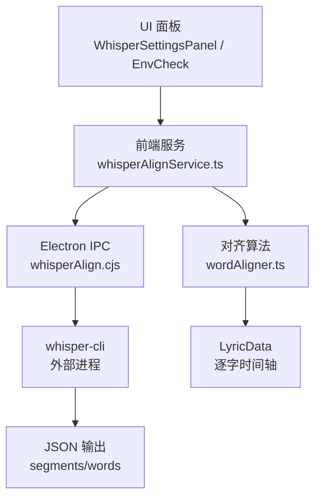
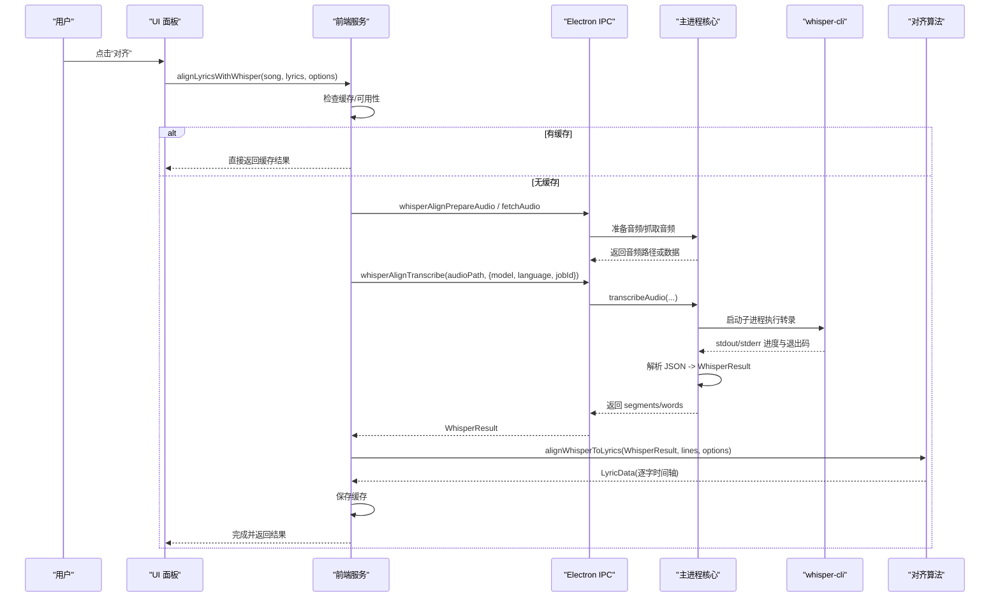
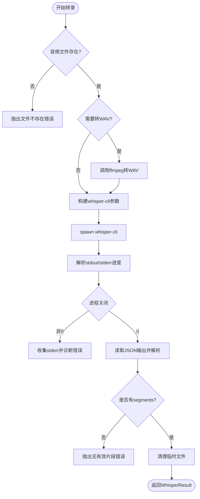
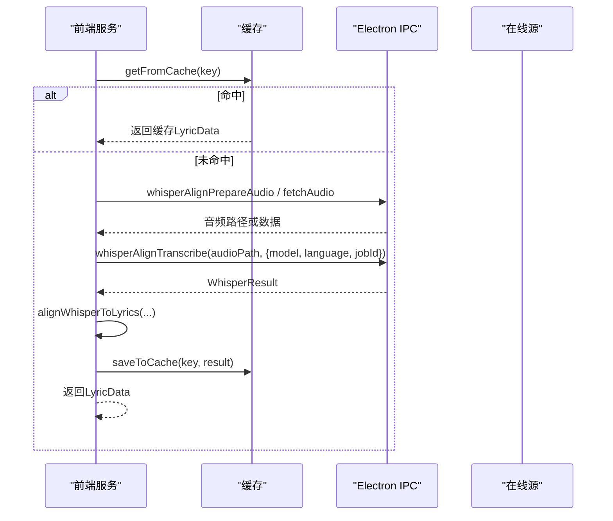
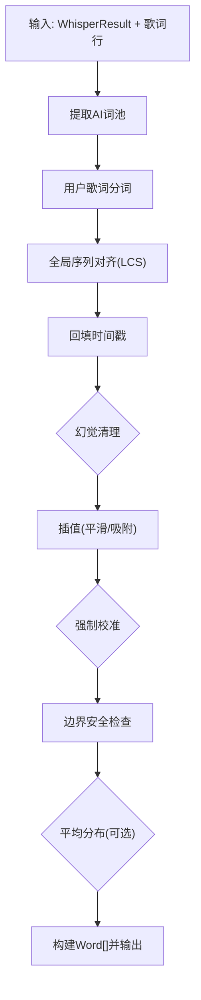
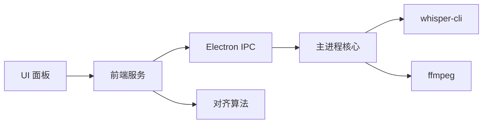

# Whisper歌词对齐工具

<cite>
**本文引用的文件**
- [electron/whisperAlign.cjs](file://electron/whisperAlign.cjs)
- [src/services/whisperAlignService.ts](file://src/services/whisperAlignService.ts)
- [src/utils/lyrics/wordAligner.ts](file://src/utils/lyrics/wordAligner.ts)
- [mods/whisper-align/index.cjs](file://mods/whisper-align/index.cjs)
- [mods/whisper-align/mod.json](file://mods/whisper-align/mod.json)
- [src/components/shared/WhisperSettingsPanel.tsx](file://src/components/shared/WhisperSettingsPanel.tsx)
- [src/components/shared/WhisperEnvCheck.tsx](file://src/components/shared/WhisperEnvCheck.tsx)
- [src/components/shared/WhisperAlignButton.tsx](file://src/components/shared/WhisperAlignButton.tsx)
</cite>

## 目录
1. [简介](#简介)
2. [项目结构](#项目结构)
3. [核心组件](#核心组件)
4. [架构总览](#架构总览)
5. [详细组件分析](#详细组件分析)
6. [依赖关系分析](#依赖关系分析)
7. [性能考量与调优](#性能考量与调优)
8. [故障排查指南](#故障排查指南)
9. [结论](#结论)
10. [附录：API与扩展](#附录api与扩展)

## 简介
本工具基于 OpenAI Whisper（通过 whisper.cpp 的命令行工具）实现“自动歌词时间轴对齐”，将歌曲音频转录为带词级时间戳的结果，并与用户提供的行级歌词进行全局序列对齐，最终输出逐字/逐词时间轴，用于 Folia 播放器的歌词渲染。系统包含以下关键能力：
- 音频处理流程：本地文件直读、在线音频缓存/抓取、格式转换（WAV）。
- 语音识别集成：调用 whisper-cli 执行转录，解析 JSON 输出并标准化为内部结果。
- 时间戳生成算法：基于全局序列对齐、幻觉清理、插值与强制校准，产出稳定且可回退的时间轴。
- 多语言支持：自动检测或指定语言；模型选择 tiny/base/small/medium。
- 错误处理与重试：环境检查、下载失败重试、进程异常诊断、取消与清理。
- 批量处理能力：服务层按歌曲逐个处理，具备缓存命中避免重复计算。
- 配置选项：模型、语言、是否启用强制校准等。
- API 与扩展：Electron IPC 命令、模组命令、前端 Hook 与服务接口。

## 项目结构
围绕 Whisper 对齐的关键代码分布在 Electron 主进程、前端服务、对齐算法与 UI 面板中：
- 主进程核心：负责 whisper-cli 发现、模型管理、音频准备、转录执行、JSON 解析、任务取消。
- 前端服务：编排获取音频、调用 IPC 转录、运行对齐算法、缓存结果、暴露进度与取消。
- 对齐算法：将 Whisper 词级时间戳与用户歌词文本进行全局序列匹配，后处理得到最终时间轴。
- 模组封装：提供命令式入口，便于在 Folia 插件体系内使用。
- UI 面板：环境检查、模型下载、FFmpeg 安装、手动/自动对齐按钮与进度展示。

图表来源
- [src/services/whisperAlignService.ts:370-557](file://src/services/whisperAlignService.ts#L370-L557)
- [electron/whisperAlign.cjs:282-537](file://electron/whisperAlign.cjs#L282-L537)
- [src/utils/lyrics/wordAligner.ts:241-549](file://src/utils/lyrics/wordAligner.ts#L241-L549)

章节来源
- [electron/whisperAlign.cjs:1-1860](file://electron/whisperAlign.cjs#L1-L1860)
- [src/services/whisperAlignService.ts:1-637](file://src/services/whisperAlignService.ts#L1-L637)
- [src/utils/lyrics/wordAligner.ts:1-840](file://src/utils/lyrics/wordAligner.ts#L1-L840)
- [mods/whisper-align/index.cjs:1-409](file://mods/whisper-align/index.cjs#L1-L409)
- [mods/whisper-align/mod.json:1-11](file://mods/whisper-align/mod.json#L1-L11)
- [src/components/shared/WhisperSettingsPanel.tsx:1-265](file://src/components/shared/WhisperSettingsPanel.tsx#L1-L265)
- [src/components/shared/WhisperEnvCheck.tsx:1-613](file://src/components/shared/WhisperEnvCheck.tsx#L1-L613)
- [src/components/shared/WhisperAlignButton.tsx:58-86](file://src/components/shared/WhisperAlignButton.tsx#L58-L86)

## 核心组件
- 主进程模块（electron/whisperAlign.cjs）
  - 初始化与路径发现：查找 whisper-cli、ffmpeg、模型目录。
  - 模型管理：列出可用模型、下载模型（含镜像回退）、校验已下载模型。
  - 转录执行：参数构建、子进程启动、进度解析、错误诊断、临时文件清理。
  - JSON 解析：兼容不同版本输出结构，提取 segments 与 words，统一为内部格式。
  - 任务控制：活跃任务 Map、取消机制（SIGTERM）。
- 前端服务（src/services/whisperAlignService.ts）
  - 可用性检查：CLI、模型、FFmpeg 状态聚合。
  - 音频源获取：本地路径、Electron 缓存、资源缓存、在线抓取（IPC 绕过 CORS）。
  - 对齐编排：缓存键生成、跳过无需对齐、调用 IPC 转录、运行对齐算法、持久化缓存。
  - 进度与取消：订阅 IPC 事件、更新 job 状态、取消当前任务。
- 对齐算法（src/utils/lyrics/wordAligner.ts）
  - 全局序列对齐：LCS 动态规划 + opcodes，匹配用户歌词与 AI 词序列。
  - 后处理：幻觉清理、插值、强制校准、边界安全限制、平均分布可选。
  - 输出构造：按原词边界合并为 Word[]，标记 isWordByWord。
- 模组封装（mods/whisper-align/index.cjs）
  - 命令注册：环境检查、模型下载、CLI/FFmpeg 安装、转录、取消、状态查询、音频准备与抓取。
  - 生命周期：激活时加载核心、停用取消所有任务。
- UI 面板
  - 环境检查：可视化提示缺失项并提供一键安装/下载。
  - 设置面板：触发对齐、显示进度与错误信息。
  - 对齐按钮：最小可见时长保证用户体验。

章节来源
- [electron/whisperAlign.cjs:45-177](file://electron/whisperAlign.cjs#L45-L177)
- [electron/whisperAlign.cjs:282-537](file://electron/whisperAlign.cjs#L282-L537)
- [src/services/whisperAlignService.ts:161-332](file://src/services/whisperAlignService.ts#L161-L332)
- [src/services/whisperAlignService.ts:370-557](file://src/services/whisperAlignService.ts#L370-L557)
- [src/utils/lyrics/wordAligner.ts:241-549](file://src/utils/lyrics/wordAligner.ts#L241-L549)
- [mods/whisper-align/index.cjs:54-244](file://mods/whisper-align/index.cjs#L54-L244)
- [src/components/shared/WhisperEnvCheck.tsx:92-176](file://src/components/shared/WhisperEnvCheck.tsx#L92-L176)
- [src/components/shared/WhisperSettingsPanel.tsx:54-87](file://src/components/shared/WhisperSettingsPanel.tsx#L54-L87)
- [src/components/shared/WhisperAlignButton.tsx:58-86](file://src/components/shared/WhisperAlignButton.tsx#L58-L86)

## 架构总览
整体数据流与控制流如下：
- 用户在 UI 触发对齐 → 前端服务判断是否需要对齐 → 尝试从缓存返回 → 否则获取音频 → IPC 调用主进程转录 → 主进程执行 whisper-cli → 解析 JSON → 前端运行对齐算法 → 持久化缓存并返回结果。

图表来源
- [src/services/whisperAlignService.ts:370-557](file://src/services/whisperAlignService.ts#L370-L557)
- [electron/whisperAlign.cjs:282-537](file://electron/whisperAlign.cjs#L282-L537)
- [src/utils/lyrics/wordAligner.ts:241-549](file://src/utils/lyrics/wordAligner.ts#L241-L549)

## 详细组件分析

### 主进程核心（whisperAlign.cjs）
- 初始化与路径发现
  - 支持 userData 目录、打包资源目录、PATH 三种方式定位 whisper-cli。
  - 同步与异步探测 ffmpeg，提升兼容性。
- 模型管理
  - 列出 tiny/base/small/medium，支持下载与镜像回退（hf-mirror.com），断点续传与超时保护。
- 转录执行
  - 非 WAV 自动转 WAV（需要 ffmpeg），构建参数包括模型、语言、线程数、输出 JSON。
  - 子进程 stdout/stderr 解析进度，close 事件处理退出码与错误诊断。
  - 输出文件清理与临时 WAV 清理。
- JSON 解析
  - 兼容 v1/v2 结构与多种嵌套键，提取 segments 与 words，统一为 start/end（秒）与 text。
  - 零时序片段诊断与警告。
- 任务控制
  - activeJobs Map 记录进程与取消标志，cancelTranscription 发送 SIGTERM。

图表来源
- [electron/whisperAlign.cjs:282-537](file://electron/whisperAlign.cjs#L282-L537)
- [electron/whisperAlign.cjs:543-684](file://electron/whisperAlign.cjs#L543-L684)

章节来源
- [electron/whisperAlign.cjs:45-177](file://electron/whisperAlign.cjs#L45-L177)
- [electron/whisperAlign.cjs:282-537](file://electron/whisperAlign.cjs#L282-L537)
- [electron/whisperAlign.cjs:543-684](file://electron/whisperAlign.cjs#L543-L684)
- [electron/whisperAlign.cjs:690-750](file://electron/whisperAlign.cjs#L690-L750)

### 前端服务（whisperAlignService.ts）
- 可用性检查
  - 聚合 CLI、模型、FFmpeg 状态，返回结构化 reason 供 UI 提示。
- 音频源获取
  - 优先 Electron 缓存 → 资源缓存 → omni.getAudioSource（质量策略）→ IPC 抓取（绕过 CORS）→ 浏览器 fetch 回退。
  - 失败时记录详细 failures 数组，便于 UI 展示具体原因。
- 对齐编排
  - 缓存键由 songId + model + 歌词指纹构成，命中则直接返回。
  - 步骤：准备音频 → 转录 → 对齐 → 缓存 → 返回。
  - 支持语言与模型选项，默认 base。
- 进度与取消
  - 订阅 onWhisperAlignProgress，映射到 job.status（preparing/transcribing/aligning/completed）。
  - cancelAlignment 通过 IPC 取消主进程任务。

图表来源
- [src/services/whisperAlignService.ts:370-557](file://src/services/whisperAlignService.ts#L370-L557)

章节来源
- [src/services/whisperAlignService.ts:161-332](file://src/services/whisperAlignService.ts#L161-L332)
- [src/services/whisperAlignService.ts:370-557](file://src/services/whisperAlignService.ts#L370-L557)

### 对齐算法（wordAligner.ts）
- 输入
  - WhisperResult（segments 与 words），用户歌词行（Line[]，含 startTime/endTime/fullText）。
- 核心步骤
  - 提取 AI 词池（优先 word-level，否则按字符粒度估算）。
  - 对用户歌词进行分词（CJK 单字、英文单词）。
  - 全局序列对齐（LCS DP + opcodes），回填时间戳。
  - 后处理：幻觉清理（大间隔丢弃）、插值（平滑或右吸附）、强制校准（偏移阈值校正）、边界安全限制（不重叠下一行）、平均分布（可选）。
  - 输出：按原词边界合并为 Word[]，标记 isWordByWord。
- 复杂度
  - LCS DP 时间复杂度 O(mn)，m/n 为用户与 AI 词序列长度；空间优化可通过滚动数组降低内存占用（当前实现为二维表）。
- 可调参数
  - MIN_DURATION、HALLUCINATION_GAP、CALIBRATION_THRESHOLD、SMOOTH_INTERP_GAP。
  - 选项 enableForceCalibration、enableAvgDistribution、calibrationThreshold。

图表来源
- [src/utils/lyrics/wordAligner.ts:241-549](file://src/utils/lyrics/wordAligner.ts#L241-L549)
- [src/utils/lyrics/wordAligner.ts:555-800](file://src/utils/lyrics/wordAligner.ts#L555-L800)

章节来源
- [src/utils/lyrics/wordAligner.ts:1-840](file://src/utils/lyrics/wordAligner.ts#L1-L840)

### 模组封装（mods/whisper-align/index.cjs）
- 命令注册
  - check-status、list-models、download-model、install-cli、install-ffmpeg、transcribe、cancel-transcription、get-transcription-status、prepare-audio、fetch-audio。
- 状态跟踪
  - activeJobStatus Map 维护各任务状态与进度；下载/安装进度对象。
- 生命周期
  - 激活时加载 electron/whisperAlign.cjs 并初始化；停用取消所有任务。

章节来源
- [mods/whisper-align/index.cjs:54-244](file://mods/whisper-align/index.cjs#L54-L244)
- [mods/whisper-align/index.cjs:250-409](file://mods/whisper-align/index.cjs#L250-L409)
- [mods/whisper-align/mod.json:1-11](file://mods/whisper-align/mod.json#L1-L11)

### UI 面板与环境检查
- WhisperEnvCheck
  - 检查 CLI、模型、FFmpeg 状态，提供一键安装/下载，支持平台差异与超时保护。
- WhisperSettingsPanel
  - 触发对齐、显示进度与错误，支持最小可见时长保证体验。
- WhisperAlignButton
  - 简化调用，统一进度标签与状态映射。

章节来源
- [src/components/shared/WhisperEnvCheck.tsx:92-176](file://src/components/shared/WhisperEnvCheck.tsx#L92-L176)
- [src/components/shared/WhisperSettingsPanel.tsx:54-87](file://src/components/shared/WhisperSettingsPanel.tsx#L54-L87)
- [src/components/shared/WhisperAlignButton.tsx:58-86](file://src/components/shared/WhisperAlignButton.tsx#L58-L86)

## 依赖关系分析
- 组件耦合
  - 前端服务依赖 Electron IPC 与在线音乐资源缓存；主进程依赖 whisper-cli 与 ffmpeg。
  - 对齐算法独立于运行时环境，仅依赖输入数据结构。
- 外部依赖
  - whisper.cpp 预编译二进制（whisper-cli），通过 GitHub Releases 或 PATH 获取。
  - FFmpeg 用于音频格式转换（WAV）。
  - HuggingFace 模型仓库（含 hf-mirror 镜像）。
- 潜在循环依赖
  - 前端服务与主进程通过 IPC 解耦；模组封装仅作为命令入口，不形成循环。
- 接口契约
  - IPC 方法：whisperAlignGetStatus、whisperAlignDownloadModel、whisperAlignInstallCli、whisperAlignInstallFfmpeg、whisperAlignTranscribe、whisperAlignPrepareAudio、whisperAlignFetchAudio、onWhisperAlignProgress、whisperAlignCancel。
  - 模组命令：check-status、list-models、download-model、install-cli、install-ffmpeg、transcribe、cancel-transcription、get-transcription-status、prepare-audio、fetch-audio。

图表来源
- [src/services/whisperAlignService.ts:370-557](file://src/services/whisperAlignService.ts#L370-L557)
- [electron/whisperAlign.cjs:282-537](file://electron/whisperAlign.cjs#L282-L537)
- [mods/whisper-align/index.cjs:250-409](file://mods/whisper-align/index.cjs#L250-L409)

章节来源
- [src/services/whisperAlignService.ts:161-332](file://src/services/whisperAlignService.ts#L161-L332)
- [electron/whisperAlign.cjs:45-177](file://electron/whisperAlign.cjs#L45-L177)
- [mods/whisper-align/index.cjs:250-409](file://mods/whisper-align/index.cjs#L250-L409)

## 性能考量与调优
- 模型选择
  - tiny/base/small/medium：small 推荐平衡速度与精度；medium 更高精度但耗时更长。
- 线程数
  - 根据 CPU 核心数设置线程（上限 8），提升并行度。
- 音频格式
  - 优先 WAV（16kHz、16-bit、mono）以获得最佳兼容性；非 WAV 需 ffmpeg 转换。
- 缓存策略
  - 基于 songId + model + 歌词指纹的缓存键，避免重复转录与对齐。
- 对齐算法
  - 启用强制校准可减少偏移误差；平均分布可在必要时均匀分配时间。
- 批处理
  - 服务层按歌曲串行处理，建议在前端队列化多个歌曲的对齐请求，避免阻塞 UI。
- 网络与下载
  - 模型下载支持 hf-mirror 回退；设置合理超时与重试。

[本节为通用指导，不直接分析具体文件]

## 故障排查指南
- 常见错误与诊断
  - 音频文件为空或损坏：检查文件大小与格式，确保 ffmpeg 可用以转换。
  - 不支持的音频格式：安装 ffmpeg 或使用 WAV。
  - whisper-cli 未找到：安装 CLI 或加入 PATH。
  - 无有效片段：检查音频内容、模型、语言设置；查看 stderr 诊断信息。
  - 网络下载失败：切换镜像或检查网络连接。
- 取消与清理
  - 使用 cancelAlignment 取消主进程任务；临时文件会在进程关闭时清理。
- 环境检查
  - 使用 WhisperEnvCheck 可视化检查 CLI、模型、FFmpeg 状态，并按提示安装。

章节来源
- [electron/whisperAlign.cjs:444-537](file://electron/whisperAlign.cjs#L444-L537)
- [src/services/whisperAlignService.ts:571-578](file://src/services/whisperAlignService.ts#L571-L578)
- [src/components/shared/WhisperEnvCheck.tsx:320-445](file://src/components/shared/WhisperEnvCheck.tsx#L320-L445)

## 结论
该工具通过主进程与前端服务的协作，结合 whisper-cli 的强大多语言语音识别能力与自研的全局序列对齐算法，实现了稳定、可配置的歌词时间轴对齐。系统具备良好的错误诊断、缓存与可扩展性，适用于 Folia 播放器的歌词增强场景。

[本节为总结，不直接分析具体文件]

## 附录：API与扩展

### 配置选项详解
- 模型：tiny/base/small/medium（small 推荐）。
- 语言：留空自动检测，或传入 ISO 语言代码。
- 对齐选项：
  - enableForceCalibration：启用强制校准（默认 true）。
  - enableAvgDistribution：启用平均分布（默认 false）。
  - calibrationThreshold：校准阈值（秒，默认 1.5）。
- 线程数：根据 CPU 核心数自动设置（上限 8）。

章节来源
- [electron/whisperAlign.cjs:282-369](file://electron/whisperAlign.cjs#L282-L369)
- [src/utils/lyrics/wordAligner.ts:223-249](file://src/utils/lyrics/wordAligner.ts#L223-L249)

### 性能调优建议
- 选择合适的模型与线程数。
- 确保 ffmpeg 可用以提升格式兼容性。
- 利用缓存减少重复计算。
- 对长音频考虑分段处理（需自行扩展）。

[本节为通用指导，不直接分析具体文件]

### 常见问题解决方案
- 无法检测到 whisper-cli：安装 CLI 或加入 PATH。
- 音频格式不支持：安装 ffmpeg 并转换为 WAV。
- 下载模型失败：切换 hf-mirror 或检查网络。
- 无有效片段：检查音频内容与模型设置，查看诊断信息。

章节来源
- [electron/whisperAlign.cjs:444-537](file://electron/whisperAlign.cjs#L444-L537)
- [src/components/shared/WhisperEnvCheck.tsx:355-445](file://src/components/shared/WhisperEnvCheck.tsx#L355-L445)

### API 调用示例
- 前端服务
  - alignLyricsWithWhisper(song, lyrics, { model, language, onProgress })
  - autoAlignIfNeeded(song, lyrics, { enabled, model, language, onProgress })
  - getWhisperAvailabilityDetail()
  - downloadWhisperModel(modelName, onProgress)
  - installWhisperCli(onProgress)
  - installFfmpeg(onProgress)
- 模组命令
  - check-status、list-models、download-model、install-cli、install-ffmpeg、transcribe、cancel-transcription、get-transcription-status、prepare-audio、fetch-audio

章节来源
- [src/services/whisperAlignService.ts:161-332](file://src/services/whisperAlignService.ts#L161-L332)
- [src/services/whisperAlignService.ts:370-557](file://src/services/whisperAlignService.ts#L370-L557)
- [mods/whisper-align/index.cjs:250-409](file://mods/whisper-align/index.cjs#L250-L409)

### 自定义对齐算法的扩展方法
- 替换对齐逻辑：修改 wordAligner.ts 中的 alignWhisperToLyrics 函数，保留输入输出接口。
- 调整参数：通过 WordAlignerOptions 调整校准阈值、是否启用平均分布等。
- 新增后处理：在序列对齐后插入自定义步骤（如语义重排、噪声过滤）。
- 集成到服务：在服务层调用新的对齐函数，并保持缓存键一致以避免失效。

章节来源
- [src/utils/lyrics/wordAligner.ts:241-549](file://src/utils/lyrics/wordAligner.ts#L241-L549)
- [src/services/whisperAlignService.ts:529-543](file://src/services/whisperAlignService.ts#L529-L543)