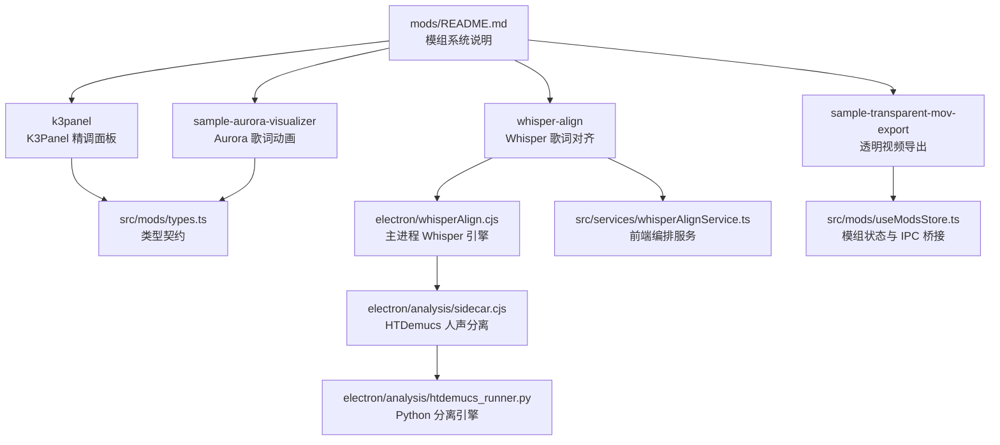
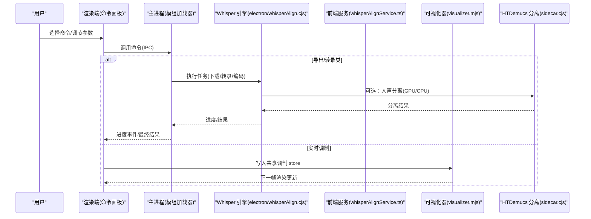
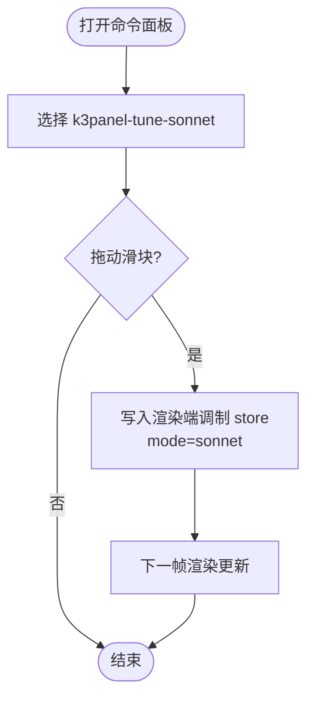
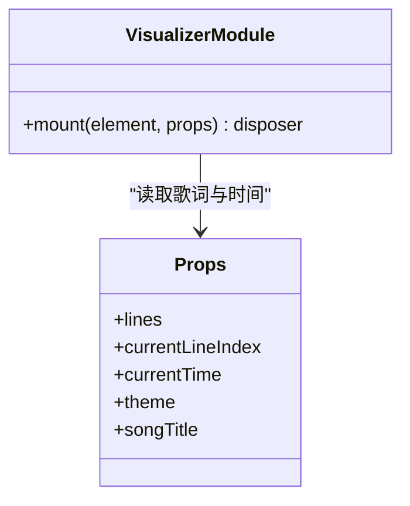
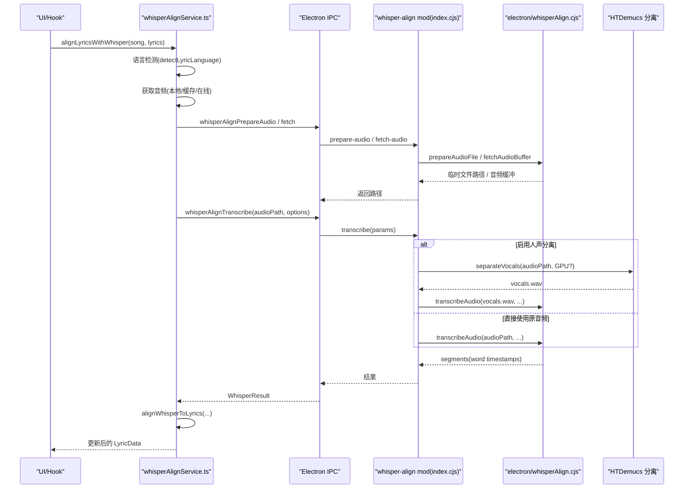
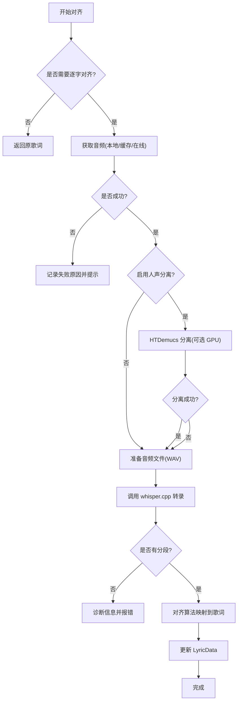
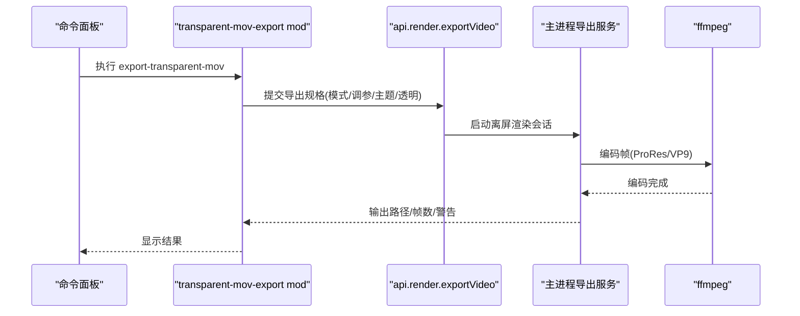
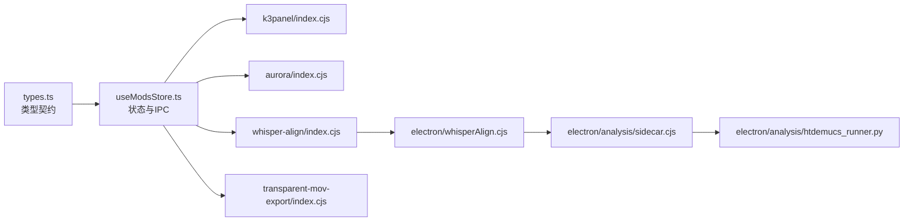

# 内置模组详解

<cite>
**本文引用的文件**
- [mods/README.md](file://mods/README.md)
- [mods/k3panel/index.cjs](file://mods/k3panel/index.cjs)
- [mods/k3panel/mod.json](file://mods/k3panel/mod.json)
- [mods/sample-aurora-visualizer/index.cjs](file://mods/sample-aurora-visualizer/index.cjs)
- [mods/sample-aurora-visualizer/visualizer.mjs](file://mods/sample-aurora-visualizer/visualizer.mjs)
- [mods/sample-aurora-visualizer/mod.json](file://mods/sample-aurora-visualizer/mod.json)
- [mods/whisper-align/index.cjs](file://mods/whisper-align/index.cjs)
- [mods/whisper-align/mod.json](file://mods/whisper-align/mod.json)
- [mods/sample-transparent-mov-export/index.cjs](file://mods/sample-transparent-mov-export/index.cjs)
- [mods/sample-transparent-mov-export/mod.json](file://mods/sample-transparent-mov-export/mod.json)
- [src/mods/types.ts](file://src/mods/types.ts)
- [src/mods/useModsStore.ts](file://src/mods/useModsStore.ts)
- [src/services/whisperAlignService.ts](file://src/services/whisperAlignService.ts)
- [src/hooks/useWhisperAutoAlign.ts](file://src/hooks/useWhisperAutoAlign.ts)
- [electron/whisperAlign.cjs](file://electron/whisperAlign.cjs)
- [src/utils/lyrics/detectLyricLanguage.ts](file://src/utils/lyrics/detectLyricLanguage.ts)
- [electron/analysis/sidecar.cjs](file://electron/analysis/sidecar.cjs)
- [electron/analysis/htdemucs_runner.py](file://electron/analysis/htdemucs_runner.py)
</cite>

## 更新摘要
**变更内容**
- 新增人声分离功能：集成 HTDemucs 模型进行歌曲人声提取，支持 GPU 加速
- 增强语言检测：基于歌词文本自动推断中日韩语言，解决中文歌曲被误识别为英语的问题
- 完善 Whisper 对齐架构：新增服务层、主进程封装和完整的错误处理机制
- 优化性能：GPU 加速的人声分离与 CPU 回退机制，避免内存溢出

## 目录
1. [简介](#简介)
2. [项目结构](#项目结构)
3. [核心组件](#核心组件)
4. [架构总览](#架构总览)
5. [详细组件分析](#详细组件分析)
6. [依赖关系分析](#依赖关系分析)
7. [性能考量](#性能考量)
8. [故障排查指南](#故障排查指南)
9. [结论](#结论)
10. [附录](#附录)

## 简介
本文件对 Folia 的内置模组进行系统化解析，覆盖 K3Panel 面板、Aurora 可视化器、Whisper 对齐与透明视频导出四大核心能力。文档从代码结构、核心算法、技术实现细节出发，梳理模组间的协作关系与数据流，并给出配置选项、使用方法与扩展点说明，辅以实际代码路径示例，帮助读者快速理解并基于现有模式开发自定义模组。

**最新更新**：Whisper 对齐模块现已集成 HTDemucs 人声分离功能，通过 GPU 加速提升中文歌曲转录准确率，并支持基于歌词文本的智能语言检测。

## 项目结构
模组位于 mods 目录，每个子目录为一个独立模组，包含 manifest（mod.json）与入口脚本（默认 index.cjs）。部分模组还贡献渲染端动画（visualizer.mjs）。应用通过加载器扫描启用模组，暴露命令面板、可视化器注册与导出能力。

**图表来源**
- [mods/README.md:1-180](file://mods/README.md#L1-L180)
- [src/mods/types.ts:1-157](file://src/mods/types.ts#L1-L157)

章节来源
- [mods/README.md:1-180](file://mods/README.md#L1-L180)

## 核心组件
- **K3Panel**：面向"商籁"（sonnet）动画的深度精调面板，通过声明式参数将滑块值直接写入渲染端共享调制存储，实时生效。
- **Aurora 可视化器**：纯 DOM 实现的歌词动画，演示如何以 ESM 模块形式贡献新的全屏歌词动画模式。
- **Whisper 对齐**：基于 whisper.cpp 的逐字歌词时间轴生成，现已集成 HTDemucs 人声分离和智能语言检测，提供环境检测、模型下载、音频准备、转录与对齐全流程。
- **透明视频导出**：复用当前歌曲的可视化模式与调参，去除背景后导出带 Alpha 通道的视频（VP9 WebM 或 ProRes MOV）。

**更新**：Whisper 对齐模块现在支持：
- HTDemucs 人声分离（可选，支持 GPU 加速）
- 基于歌词文本的语言检测（中日韩）
- 增强的错误处理和诊断信息
- 改进的缓存机制和性能优化

章节来源
- [mods/k3panel/index.cjs:1-50](file://mods/k3panel/index.cjs#L1-L50)
- [mods/sample-aurora-visualizer/index.cjs:1-10](file://mods/sample-aurora-visualizer/index.cjs#L1-L10)
- [mods/sample-aurora-visualizer/visualizer.mjs:1-81](file://mods/sample-aurora-visualizer/visualizer.mjs#L1-L81)
- [mods/whisper-align/index.cjs:1-413](file://mods/whisper-align/index.cjs#L1-L413)
- [mods/sample-transparent-mov-export/index.cjs:1-118](file://mods/sample-transparent-mov-export/index.cjs#L1-L118)

## 架构总览
模组系统由"主进程加载器 + 渲染端 UI + 可选渲染端 ESM 动画"构成。命令通过 IPC 调用主进程执行；可视化器在渲染端运行；导出流程由渲染端发起，主进程协调离屏窗口与 ffmpeg。

**图表来源**
- [mods/README.md:85-137](file://mods/README.md#L85-L137)
- [src/mods/useModsStore.ts:1-226](file://src/mods/useModsStore.ts#L1-L226)
- [electron/whisperAlign.cjs:1-200](file://electron/whisperAlign.cjs#L1-L200)
- [src/services/whisperAlignService.ts:1-200](file://src/services/whisperAlignService.ts#L1-L200)

## 详细组件分析

### K3Panel 面板（商籁深度精调）
- **功能定位**：为"商籁"模式暴露未内置的参数旋钮（相机幅度、逐字运动、呼吸浮动、视差、动图漂移、间隙漂移、色差强度、残影扩散、转场位移/缩放、转场模糊、转场故障），拖动即实时生效。
- **实现要点**：
  - 命令参数声明中设置 modulate: { mode: 'sonnet' }，使数值变更直接写入渲染端共享调制存储，无需主进程往返。
  - run 处理器为占位，因为参数不进入主进程。
- **使用方式**：在命令面板中打开"商籁深度精调"，拖动滑块即时调整动画效果。
- **扩展点**：可仿照该模组的参数声明方式，为其他可视化模式增加实时调制旋钮。

**图表来源**
- [mods/k3panel/index.cjs:11-49](file://mods/k3panel/index.cjs#L11-L49)

章节来源
- [mods/k3panel/index.cjs:1-50](file://mods/k3panel/index.cjs#L1-L50)
- [mods/k3panel/mod.json:1-11](file://mods/k3panel/mod.json#L1-L11)

### Aurora 可视化器（虹光歌词动画）
- **功能定位**：贡献一个全新的全屏歌词动画模式，当前句居中展示，逐字呈现"虹光扫过"的视觉效果。
- **实现要点**：
  - 通过 manifest 声明 visualizers 条目，entry 指向浏览器 ESM 模块（visualizer.mjs）。
  - 渲染端 ESM 模块遵循 mount(element, props) 契约，订阅 currentTime 变化绘制每一帧。
  - 无 React/bundler 耦合，纯 DOM 操作，便于在透明导出窗口中复用。
- **使用方式**：启用模组后，可在动画选择器中看到"虹光"模式，用于播放预览与透明导出。
- **扩展点**：参考其 ESM 模块结构，实现自定义歌词动画，支持播放与导出。

**图表来源**
- [mods/sample-aurora-visualizer/visualizer.mjs:8-81](file://mods/sample-aurora-visualizer/visualizer.mjs#L8-L81)
- [mods/sample-aurora-visualizer/mod.json:1-19](file://mods/sample-aurora-visualizer/mod.json#L1-L19)

章节来源
- [mods/sample-aurora-visualizer/index.cjs:1-10](file://mods/sample-aurora-visualizer/index.cjs#L1-L10)
- [mods/sample-aurora-visualizer/visualizer.mjs:1-81](file://mods/sample-aurora-visualizer/visualizer.mjs#L1-L81)
- [mods/sample-aurora-visualizer/mod.json:1-19](file://mods/sample-aurora-visualizer/mod.json#L1-L19)

### Whisper 对齐（逐字歌词时间轴）

**更新**：Whisper 对齐模块现已集成 HTDemucs 人声分离和智能语言检测功能，显著提升中文歌曲转录准确率。

- **功能定位**：检测缺少逐字时间轴的歌词，自动获取音频、调用 whisper.cpp 转录、生成逐字时间轴并回填到 LyricData。
- **核心流程**：
  - 前端服务负责音频源获取（本地路径、缓存、在线源）、IPC 调用主进程、进度回调与错误处理。
  - 主进程负责 whisper-cli 与 FFmpeg 管理、模型下载、音频准备、转录与临时文件清理。
  - **新增**：可选的 HTDemucs 人声分离，支持 GPU 加速，提升复杂音乐场景下的转录质量。
  - **新增**：基于歌词文本的智能语言检测，解决中文歌曲被误识别为英语的问题。
  - 对齐算法将 Whisper 输出映射回原歌词行，生成逐字时间戳。
- **关键能力**：
  - 环境检测：检查 whisper-cli、模型、FFmpeg 可用性。
  - 模型管理：列出/下载模型，支持镜像源。
  - 音频准备：将二进制音频转为 WAV 等格式供转录。
  - **新增**：人声分离：使用 HTDemucs 模型分离人声，支持 CUDA GPU 加速。
  - **新增**：语言检测：基于歌词文本推断中日韩语言。
  - 转录与取消：支持多任务并发与取消。
  - 自动对齐 Hook：在歌词加载时自动触发对齐（可配置开关）。
- **使用方式**：在设置中开启自动对齐，或在命令面板中手动执行"检查环境/下载模型/安装 CLI/安装 FFmpeg/转录/对齐"。

**图表来源**
- [src/services/whisperAlignService.ts:341-507](file://src/services/whisperAlignService.ts#L341-L507)
- [mods/whisper-align/index.cjs:166-231](file://mods/whisper-align/index.cjs#L166-L231)
- [electron/whisperAlign.cjs:145-200](file://electron/whisperAlign.cjs#L145-L200)

**图表来源**
- [src/services/whisperAlignService.ts:329-507](file://src/services/whisperAlignService.ts#L329-L507)
- [mods/whisper-align/index.cjs:166-231](file://mods/whisper-align/index.cjs#L166-L231)

章节来源
- [mods/whisper-align/index.cjs:1-413](file://mods/whisper-align/index.cjs#L1-L413)
- [mods/whisper-align/mod.json:1-11](file://mods/whisper-align/mod.json#L1-L11)
- [src/services/whisperAlignService.ts:1-761](file://src/services/whisperAlignService.ts#L1-L761)
- [src/hooks/useWhisperAutoAlign.ts:1-85](file://src/hooks/useWhisperAutoAlign.ts#L1-L85)
- [electron/whisperAlign.cjs:1-800](file://electron/whisperAlign.cjs#L1-L800)

### 透明视频导出（Alpha 通道）
- **功能定位**：按当前歌曲的可视化模式与调参原样渲染，仅去除背景，导出带 Alpha 通道的视频（VP9 WebM 或 ProRes MOV）。
- **实现要点**：
  - 命令参数包括编码器、分辨率、帧率、起止时间等。
  - 通过 api.render.exportVideo 启动导出会话，传入当前可视化模式、调参与主题。
  - 主进程负责离屏渲染、逐帧捕获与 ffmpeg 编码，全局互斥且限制最大尺寸与时长。
- **使用方式**：在命令面板中选择"导出透明视频"，选择编码器与参数，执行后输出至"视频/Folia Exports"。
- **注意事项**：Windows 完整支持 Alpha；Linux/macOS 可能不含 Alpha，返回值会包含警告。

**图表来源**
- [mods/sample-transparent-mov-export/index.cjs:14-118](file://mods/sample-transparent-mov-export/index.cjs#L14-L118)
- [mods/README.md:29-34](file://mods/README.md#L29-L34)

章节来源
- [mods/sample-transparent-mov-export/index.cjs:1-118](file://mods/sample-transparent-mov-export/index.cjs#L1-L118)
- [mods/sample-transparent-mov-export/mod.json:1-11](file://mods/sample-transparent-mov-export/mod.json#L1-L11)
- [mods/README.md:29-34](file://mods/README.md#L29-L34)

## 依赖关系分析
- **模组清单与权限**：
  - K3Panel：无额外权限，仅声明命令参数与实时调制。
  - Aurora 可视化器：需要 visualizer.register 权限，贡献新动画模式。
  - Whisper 对齐：需要 filesystem.data 与 runtime.playback 权限，访问模型/音频与播放快照。
  - 透明导出：需要 render.export 与 runtime.playplayback 权限，启动导出与读取播放快照。
- **运行时状态与 IPC**：
  - useModsStore 维护模组列表、FFmpeg 状态、导出进度与日志，并通过 IPC 与主进程交互。
  - types.ts 定义跨 IPC 的类型契约，确保序列化安全。

**更新**：Whisper 对齐模块现在依赖额外的 Python 运行时和 HTDemucs 模型文件，用于人声分离功能。

**图表来源**
- [src/mods/types.ts:1-157](file://src/mods/types.ts#L1-L157)
- [src/mods/useModsStore.ts:1-226](file://src/mods/useModsStore.ts#L1-L226)
- [mods/whisper-align/index.cjs:1-413](file://mods/whisper-align/index.cjs#L1-L413)
- [electron/whisperAlign.cjs:1-800](file://electron/whisperAlign.cjs#L1-L800)

章节来源
- [src/mods/types.ts:1-157](file://src/mods/types.ts#L1-L157)
- [src/mods/useModsStore.ts:1-226](file://src/mods/useModsStore.ts#L1-L226)

## 性能考量
- **实时调制**：K3Panel 通过渲染端共享存储直接更新，避免 IPC 往返，保证拖动时的低延迟。
- **导出限制**：全局互斥导出，上限 3840×2160、60fps、15 分钟，防止资源耗尽。
- **音频获取**：Whisper 对齐优先使用本地路径与缓存，其次走主进程抓取绕过 CORS，减少网络失败与阻塞。
- **资源清理**：模组 deactivate 时取消转录任务、释放定时器与监听器，避免内存泄漏。
- **新增性能优化**：
  - **GPU 加速**：HTDemucs 人声分离支持 CUDA GPU 加速，大幅提升处理速度。
  - **智能回退**：GPU 不可用时自动回退到 CPU，确保功能可用性。
  - **内存管理**：分离过程使用独立的 Python 子进程，避免主进程内存压力。
  - **缓存机制**：改进的对齐结果缓存，避免重复计算。

章节来源
- [electron/analysis/sidecar.cjs:1-129](file://electron/analysis/sidecar.cjs#L1-L129)
- [electron/analysis/htdemucs_runner.py:1-345](file://electron/analysis/htdemucs_runner.py#L1-L345)
- [src/services/whisperAlignService.ts:470-495](file://src/services/whisperAlignService.ts#L470-L495)

## 故障排查指南
- **无法启用模组**：
  - 确认实验室总开关已开启，单个模组需二次确认启用。
  - 若模组内容摘要变化，需重新确认授权。
- **Whisper 不可用**：
  - 检查 whisper-cli 是否安装、模型是否下载、FFmpeg 是否可用。
  - 查看"检查环境"命令返回的 reason 字段，按提示安装缺失项。
- **音频获取失败**：
  - 本地歌曲：确认 filePath 有效。
  - 在线歌曲：尝试缓存或主进程抓取，关注失败原因数组。
- **导出失败**：
  - 确认 ffmpeg 可用，注意平台差异（Alpha 通道支持）。
  - 查看导出结果中的 warnings 与 error 字段。
- **新增问题排查**：
  - **人声分离失败**：检查 HTDemucs 模型和 Python 运行时是否正确安装，确认 CUDA/cuDNN 环境。
  - **语言检测异常**：确认歌词文本包含足够的中日韩字符，检查 detectLyricLanguage 函数逻辑。
  - **GPU 加速不可用**：验证 onnxruntime-gpu 版本兼容性，检查系统 CUDA 版本。

章节来源
- [mods/README.md:13-27](file://mods/README.md#L13-L27)
- [mods/whisper-align/index.cjs:54-77](file://mods/whisper-align/index.cjs#L54-L77)
- [src/services/whisperAlignService.ts:181-231](file://src/services/whisperAlignService.ts#L181-L231)
- [mods/sample-transparent-mov-export/index.cjs:107-115](file://mods/sample-transparent-mov-export/index.cjs#L107-L115)
- [src/utils/lyrics/detectLyricLanguage.ts:1-62](file://src/utils/lyrics/detectLyricLanguage.ts#L1-L62)

## 结论
Folia 的内置模组体系提供了强大的扩展能力：K3Panel 实现了零延迟的实时调参；Aurora 展示了如何以 ESM 贡献全新动画；Whisper 对齐打通了从音频到逐字时间轴的完整链路，现已集成 HTDemucs 人声分离和智能语言检测，显著提升中文歌曲转录准确率；透明导出则复用了运行时可视化能力，实现高质量的视频输出。通过统一的类型契约与 IPC 机制，各组件协同稳定、可扩展性强。开发者可基于这些样例快速构建自定义模组，丰富播放器生态。

**最新更新亮点**：
- **HTDemucs 人声分离**：通过 GPU 加速的先进音频分离技术，显著提升复杂音乐场景下的转录质量
- **智能语言检测**：基于歌词文本的中日韩语言自动识别，解决中文歌曲被误识别为英语的问题
- **增强的错误处理**：完善的诊断信息和用户友好的错误提示
- **性能优化**：智能的 GPU/CPU 回退机制，确保在各种硬件环境下都能正常工作

## 附录
- **配置选项速览**：
  - K3Panel：11 个数值型参数，范围 0–3，步长 0.01，默认 1。
  - Aurora：无需配置，作为新增动画模式出现。
  - Whisper：模型选择（tiny/base/small/medium/large-v3/large-v3-turbo）、语言（支持自动检测）、CLI/FFmpeg 安装路径与环境检测。
  - **新增**：人声分离开关、GPU 加速开关、语言检测偏好设置。
  - 透明导出：编码器（vp9/prores）、宽高、帧率、起止时间。
- **使用方法**：
  - 在命令面板中搜索对应命令，填写参数后执行。
  - 可视化器在动画选择器中切换。
  - 自动对齐可在设置中开启，或在加载歌词后手动触发。
  - **新增**：在人声分离设置中启用 HTDemucs 分离，可选择 GPU 加速。
- **自定义扩展点**：
  - 贡献可视化器：参照 aurora 的 manifest 与 ESM 模块契约。
  - 添加实时调制：参照 k3panel 的命令参数声明，设置 modulate.mode。
  - 封装复杂任务：参照 whisper-align 的主进程封装与前端编排服务。
  - **新增**：集成 AI 模型：参照 HTDemucs 的实现，通过 sidecar.cjs 调用外部 Python 进程。

章节来源
- [mods/k3panel/index.cjs:11-49](file://mods/k3panel/index.cjs#L11-L49)
- [mods/sample-aurora-visualizer/mod.json:1-19](file://mods/sample-aurora-visualizer/mod.json#L1-L19)
- [mods/whisper-align/index.cjs:254-391](file://mods/whisper-align/index.cjs#L254-L391)
- [mods/sample-transparent-mov-export/index.cjs:22-118](file://mods/sample-transparent-mov-export/index.cjs#L22-L118)
- [src/utils/lyrics/detectLyricLanguage.ts:1-62](file://src/utils/lyrics/detectLyricLanguage.ts#L1-L62)
- [electron/analysis/sidecar.cjs:1-129](file://electron/analysis/sidecar.cjs#L1-L129)
- [electron/analysis/htdemucs_runner.py:1-345](file://electron/analysis/htdemucs_runner.py#L1-L345)