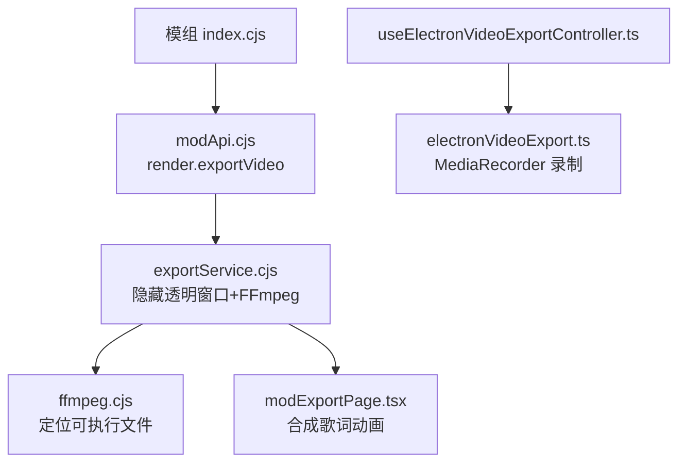
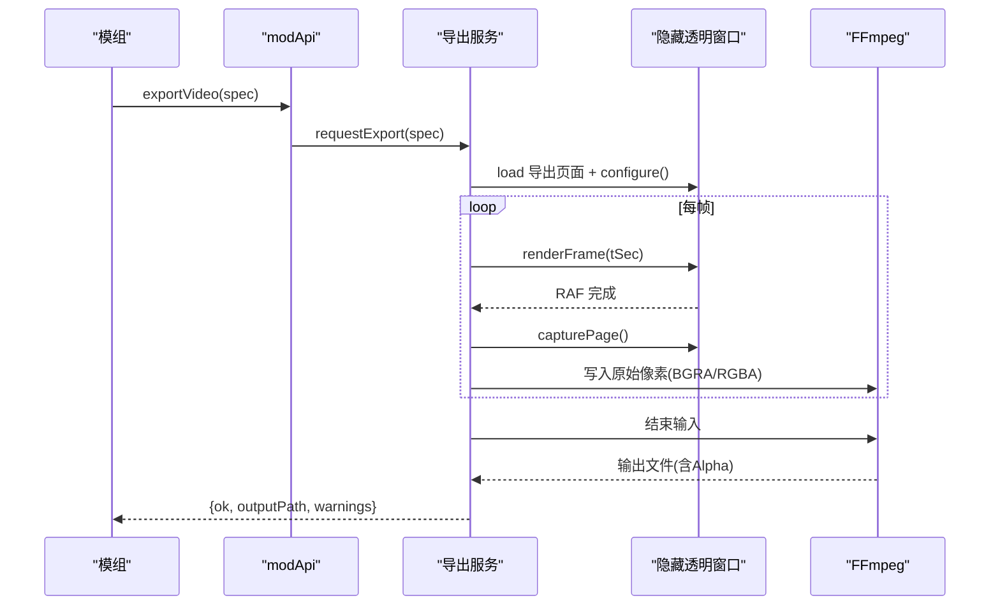
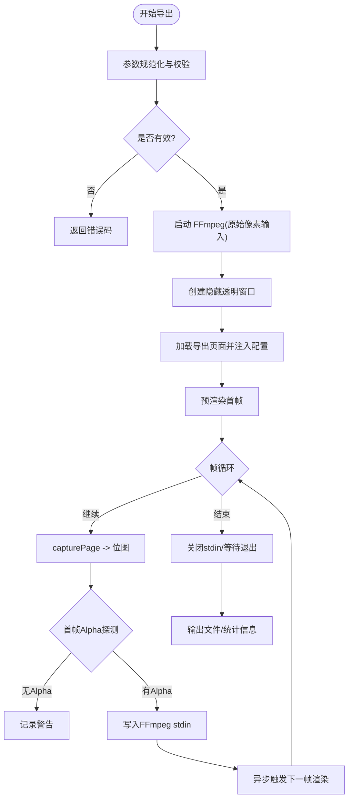
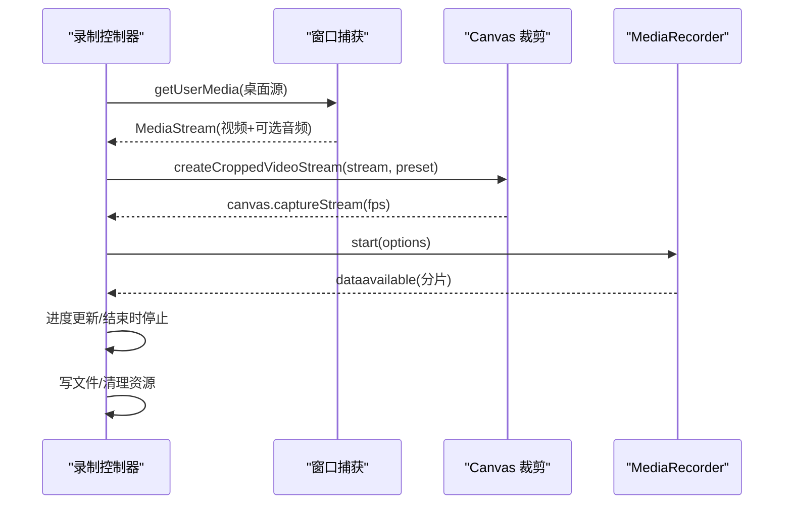
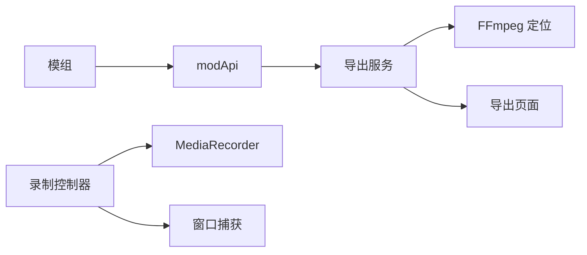

# 透明视频导出模组

<cite>
**本文引用的文件**
- [mods/sample-transparent-mov-export/index.cjs](file://mods/sample-transparent-mov-export/index.cjs)
- [mods/sample-transparent-mov-export/mod.json](file://mods/sample-transparent-mov-export/mod.json)
- [electron/modSystem/exportService.cjs](file://electron/modSystem/exportService.cjs)
- [electron/modSystem/ffmpeg.cjs](file://electron/modSystem/ffmpeg.cjs)
- [src/mods/export/modExportPage.tsx](file://src/mods/export/modExportPage.tsx)
- [src/services/electronVideoExport.ts](file://src/services/electronVideoExport.ts)
- [src/hooks/useElectronVideoExportController.ts](file://src/hooks/useElectronVideoExportController.ts)
- [src/types/videoExport.ts](file://src/types/videoExport.ts)
- [electron/modSystem/modApi.cjs](file://electron/modSystem/modApi.cjs)
</cite>

## 目录
1. [简介](#简介)
2. [项目结构](#项目结构)
3. [核心组件](#核心组件)
4. [架构总览](#架构总览)
5. [详细组件分析](#详细组件分析)
6. [依赖关系分析](#依赖关系分析)
7. [性能与内存管理](#性能与内存管理)
8. [故障排除指南](#故障排除指南)
9. [结论](#结论)
10. [附录：参数与质量调优](#附录参数与质量调优)

## 简介
本技术文档聚焦“透明视频导出模组”，完整解析基于 Electron + FFmpeg 的 MOV/WEBM 透明背景视频导出实现。内容涵盖：
- Canvas 渲染捕获与帧级管线（隐藏透明窗口、逐帧 capturePage）
- 编码参数配置（ProRes 4444、VP9）、帧率控制与时长限制
- 透明通道处理与 Alpha 混合策略（平台差异、Alpha 探测）
- 与 FFmpeg 的集成方式、命令行参数、错误处理机制
- 导出质量调优、性能优化建议、兼容性注意事项
- 实际导出脚本示例与故障排除方法

## 项目结构
透明导出由“模组声明 + 渲染服务 + 前端导出页 + 录制工具”共同组成：
- 模组层：定义命令、参数与调用入口，透传当前播放快照到导出服务
- 渲染服务：创建离屏透明窗口，驱动可视化引擎按时间步进渲染，逐帧捕获并写入 FFmpeg
- 录制工具：在播放器侧通过 MediaRecorder 录制主窗口（用于非透明场景或替代路径）
- 类型与状态：统一导出预设、状态机与默认值

图表来源
- [mods/sample-transparent-mov-export/index.cjs:14-116](file://mods/sample-transparent-mov-export/index.cjs#L14-L116)
- [electron/modSystem/modApi.cjs:150-164](file://electron/modSystem/modApi.cjs#L150-L164)
- [electron/modSystem/exportService.cjs:171-416](file://electron/modSystem/exportService.cjs#L171-L416)
- [electron/modSystem/ffmpeg.cjs:82-112](file://electron/modSystem/ffmpeg.cjs#L82-L112)
- [src/mods/export/modExportPage.tsx:90-166](file://src/mods/export/modExportPage.tsx#L90-L166)
- [src/hooks/useElectronVideoExportController.ts:67-290](file://src/hooks/useElectronVideoExportController.ts#L67-L290)
- [src/services/electronVideoExport.ts:23-157](file://src/services/electronVideoExport.ts#L23-L157)

章节来源
- [mods/sample-transparent-mov-export/index.cjs:14-116](file://mods/sample-transparent-mov-export/index.cjs#L14-L116)
- [electron/modSystem/exportService.cjs:171-416](file://electron/modSystem/exportService.cjs#L171-L416)
- [src/mods/export/modExportPage.tsx:90-166](file://src/mods/export/modExportPage.tsx#L90-L166)
- [src/services/electronVideoExport.ts:23-157](file://src/services/electronVideoExport.ts#L23-L157)
- [src/hooks/useElectronVideoExportController.ts:67-290](file://src/hooks/useElectronVideoExportController.ts#L67-L290)
- [electron/modSystem/ffmpeg.cjs:82-112](file://electron/modSystem/ffmpeg.cjs#L82-L112)

## 核心组件
- 模组命令与参数：提供导出入口，封装分辨率、帧率、起止时间、编解码器选择等
- 导出服务：校验参数、创建隐藏透明窗口、驱动渲染、逐帧捕获、写入 FFmpeg 管道
- FFmpeg 定位：按优先级查找可执行文件，支持环境变量覆盖、资源目录与 PATH 回退
- 导出页面：在无音频的合成时钟下驱动可视化引擎，仅渲染歌词与特效，支持透明背景
- 录制控制器：在主窗口录制路径中，使用 MediaRecorder + Canvas 裁剪输出 MP4/WebM

章节来源
- [mods/sample-transparent-mov-export/index.cjs:22-116](file://mods/sample-transparent-mov-export/index.cjs#L22-L116)
- [electron/modSystem/exportService.cjs:50-115](file://electron/modSystem/exportService.cjs#L50-L115)
- [electron/modSystem/ffmpeg.cjs:36-112](file://electron/modSystem/ffmpeg.cjs#L36-L112)
- [src/mods/export/modExportPage.tsx:18-166](file://src/mods/export/modExportPage.tsx#L18-L166)
- [src/hooks/useElectronVideoExportController.ts:67-290](file://src/hooks/useElectronVideoExportController.ts#L67-L290)

## 架构总览
透明导出采用“隐藏透明窗口 + 逐帧捕获 + 原始像素流式写入 FFmpeg”的架构：
- 渲染阶段：在不可见但处于合成状态的窗口中运行可视化引擎，按时间推进一帧
- 捕获阶段：capturePage 获取位图，根据平台选择 BGRA/RGBA 像素格式
- 编码阶段：将原始像素写入 FFmpeg 标准输入，按指定编码器生成带 Alpha 的视频
- 质量控制：首帧 Alpha 探测、平台能力提示、时长上限保护

图表来源
- [mods/sample-transparent-mov-export/index.cjs:78-116](file://mods/sample-transparent-mov-export/index.cjs#L78-L116)
- [electron/modSystem/modApi.cjs:150-164](file://electron/modSystem/modApi.cjs#L150-L164)
- [electron/modSystem/exportService.cjs:171-416](file://electron/modSystem/exportService.cjs#L171-L416)
- [src/mods/export/modExportPage.tsx:90-166](file://src/mods/export/modExportPage.tsx#L90-L166)

## 详细组件分析

### 模组命令与参数（sample-transparent-mov-export）
- 注册命令：id、标签、权限、参数（编解码器、分辨率、帧率、起止时间）
- 运行时快照：复用当前歌曲的可视化模式与调参，确保导出画面与屏幕一致
- 透明导出：强制 backgroundMode=none、transparent=true，交由底层服务处理 Alpha
- 结果返回：输出路径、帧数、警告信息

章节来源
- [mods/sample-transparent-mov-export/index.cjs:14-116](file://mods/sample-transparent-mov-export/index.cjs#L14-L116)
- [mods/sample-transparent-mov-export/mod.json:1-11](file://mods/sample-transparent-mov-export/mod.json#L1-L11)

### 导出服务（exportService.cjs）
- 参数规范化：宽高、帧率、起止时间、歌词数据过滤、时长上限保护
- 平台与 Alpha：Windows 保证 Alpha；其他平台可能丢失，需提示
- 编码选择：ProRes 4444（MOV，兼容性好）或 VP9（WebM，体积小）
- 帧循环：先预渲染首帧，再并行进行下一帧渲染与 stdin 写入，减少阻塞
- Alpha 探测：首帧采样四角 Alpha，若缺失则记录警告
- 清理机制：成功/失败/取消均释放窗口与进程，删除半成品文件

图表来源
- [electron/modSystem/exportService.cjs:50-115](file://electron/modSystem/exportService.cjs#L50-L115)
- [electron/modSystem/exportService.cjs:171-416](file://electron/modSystem/exportService.cjs#L171-L416)
- [electron/modSystem/exportService.cjs:442-468](file://electron/modSystem/exportService.cjs#L442-L468)

章节来源
- [electron/modSystem/exportService.cjs:50-115](file://electron/modSystem/exportService.cjs#L50-L115)
- [electron/modSystem/exportService.cjs:171-416](file://electron/modSystem/exportService.cjs#L171-L416)
- [electron/modSystem/exportService.cjs:442-468](file://electron/modSystem/exportService.cjs#L442-L468)

### FFmpeg 定位与版本探测（ffmpeg.cjs）
- 候选路径优先级：环境变量 > 应用内资源 > 打包资源 > PATH
- 可执行性检查：POSIX 检查执行位，Windows 检查扩展名与存在性
- 版本探测：执行 -version 解析首行版本号
- 结果缓存：由上层模块缓存避免重复探测

章节来源
- [electron/modSystem/ffmpeg.cjs:36-112](file://electron/modSystem/ffmpeg.cjs#L36-L112)

### 导出页面（modExportPage.tsx）
- 合成时钟：无真实音频，使用虚拟时间驱动可视化引擎
- 歌词同步：二分查找当前活跃歌词行，更新渲染上下文
- 透明背景：backgroundMode=none 时禁用几何背景与暗角，保持透明
- 调参复用：应用当前歌曲的可视化调参，确保导出与屏幕一致
- 单帧渲染：设置时间后等待一次 RAF，随后 capturePage 即可得到稳定帧

章节来源
- [src/mods/export/modExportPage.tsx:18-166](file://src/mods/export/modExportPage.tsx#L18-L166)

### 录制控制器与 Canvas 裁剪（useElectronVideoExportController.ts + electronVideoExport.ts）
- 主窗口录制：通过桌面捕获源获取视频轨道，结合音频轨道合并为 MediaStream
- Canvas 裁剪：以 cover 模式精确裁剪/缩放至目标分辨率，避免黑边
- 录制选项：动态计算比特率，选择浏览器支持的容器与编码
- 生命周期：倒计时、进度更新、停止与清理，恢复播放状态

图表来源
- [src/hooks/useElectronVideoExportController.ts:155-250](file://src/hooks/useElectronVideoExportController.ts#L155-L250)
- [src/services/electronVideoExport.ts:23-157](file://src/services/electronVideoExport.ts#L23-L157)
- [src/services/electronVideoExport.ts:192-233](file://src/services/electronVideoExport.ts#L192-L233)

章节来源
- [src/hooks/useElectronVideoExportController.ts:67-290](file://src/hooks/useElectronVideoExportController.ts#L67-L290)
- [src/services/electronVideoExport.ts:23-157](file://src/services/electronVideoExport.ts#L23-L157)
- [src/services/electronVideoExport.ts:192-233](file://src/services/electronVideoExport.ts#L192-L233)

## 依赖关系分析
- 模组依赖 modApi 提供的 render.exportVideo 接口
- 导出服务依赖 ffmpeg.cjs 定位可执行文件
- 导出页面依赖可视化引擎注册表与调参系统
- 录制控制器依赖 Electron IPC 与浏览器 MediaRecorder API

图表来源
- [mods/sample-transparent-mov-export/index.cjs:78-116](file://mods/sample-transparent-mov-export/index.cjs#L78-L116)
- [electron/modSystem/modApi.cjs:150-164](file://electron/modSystem/modApi.cjs#L150-L164)
- [electron/modSystem/exportService.cjs:171-416](file://electron/modSystem/exportService.cjs#L171-L416)
- [electron/modSystem/ffmpeg.cjs:82-112](file://electron/modSystem/ffmpeg.cjs#L82-L112)
- [src/mods/export/modExportPage.tsx:90-166](file://src/mods/export/modExportPage.tsx#L90-L166)
- [src/hooks/useElectronVideoExportController.ts:155-250](file://src/hooks/useElectronVideoExportController.ts#L155-L250)

章节来源
- [electron/modSystem/exportService.cjs:171-416](file://electron/modSystem/exportService.cjs#L171-L416)
- [electron/modSystem/ffmpeg.cjs:82-112](file://electron/modSystem/ffmpeg.cjs#L82-L112)
- [src/mods/export/modExportPage.tsx:90-166](file://src/mods/export/modExportPage.tsx#L90-L166)
- [src/hooks/useElectronVideoExportController.ts:155-250](file://src/hooks/useElectronVideoExportController.ts#L155-L250)

## 性能与内存管理
- 帧级流水线优化：预渲染下一帧与写入 stdin 并行，减少主线程阻塞
- 原始像素直写：跳过 PNG 编解码，直接写入 BGRA/RGBA 原始像素，降低 CPU 开销
- 帧率控制：导出服务限制最小/最大帧率，录制路径固定 60fps 捕获
- 内存管理：
  - 捕获位图及时释放，避免累积
  - 窗口销毁与进程终止在 finally 块中确保执行
  - 取消导出时立即中断渲染与写入，删除半成品文件
- 比特率自适应：根据分辨率动态调整视频比特率，平衡画质与体积

章节来源
- [electron/modSystem/exportService.cjs:190-214](file://electron/modSystem/exportService.cjs#L190-L214)
- [electron/modSystem/exportService.cjs:324-370](file://electron/modSystem/exportService.cjs#L324-L370)
- [electron/modSystem/exportService.cjs:475-501](file://electron/modSystem/exportService.cjs#L475-L501)
- [src/services/electronVideoExport.ts:167-179](file://src/services/electronVideoExport.ts#L167-L179)
- [src/services/electronVideoExport.ts:229-233](file://src/services/electronVideoExport.ts#L229-L233)

## 故障排除指南
- 未找到 FFmpeg：检查环境变量 FOLIA_FFMPEG_PATH、应用资源目录、PATH 是否包含 ffmpeg
- 平台不支持：仅 Windows/Linux/macOS 支持导出；非桌面环境会报错
- 无歌词数据：导出前需校验 lyricData.lines 非空，否则拒绝导出
- Alpha 通道缺失：非 Windows 平台可能无法保留 Alpha，导出完成后会有警告提示
- 导出被取消：取消后立即终止进程与窗口，不会留下半成品文件
- 录制失败：确认浏览器支持所选容器/编码；检查桌面捕获权限

章节来源
- [electron/modSystem/exportService.cjs:82-115](file://electron/modSystem/exportService.cjs#L82-L115)
- [electron/modSystem/exportService.cjs:182-185](file://electron/modSystem/exportService.cjs#L182-L185)
- [electron/modSystem/exportService.cjs:387-391](file://electron/modSystem/exportService.cjs#L387-L391)
- [electron/modSystem/exportService.cjs:475-501](file://electron/modSystem/exportService.cjs#L475-L501)
- [src/hooks/useElectronVideoExportController.ts:108-120](file://src/hooks/useElectronVideoExportController.ts#L108-L120)

## 结论
透明视频导出模组通过隐藏透明窗口与 FFmpeg 原始像素管道，实现了高质量、跨平台的透明背景视频导出。其设计强调稳定性与可维护性：严格的参数校验、平台能力提示、完善的清理机制与性能优化。对于需要透明背景的后期制作场景，推荐优先使用 ProRes 4444（MOV）以获得最佳兼容性；对体积敏感的场景可选择 VP9（WebM）。

## 附录：参数与质量调优
- 编解码器选择
  - ProRes 4444：MOV 容器，几乎全兼容，体积较大，适合专业剪辑软件
  - VP9：WebM 容器，体积约为 ProRes 的十分之一，部分剪辑软件需较新版本才识别透明
- 分辨率与帧率
  - 分辨率范围：宽度 320–3840，高度 180–2160
  - 帧率范围：10–60 fps，推荐 30 fps 平衡流畅度与体积
- 起止时间与时长限制
  - 结束时间默认为歌词结束 + 2 秒缓冲，且受最大时长保护（15 分钟）
  - 起止时间必须合法，否则导出失败
- 透明通道与背景
  - transparent=true 时，背景模式 none 将禁用几何背景与暗角，保持透明
  - 非 Windows 平台可能无法保留 Alpha，导出后会给出警告
- 质量与体积调优
  - 提高分辨率与帧率会增加体积与编码时间
  - VP9 CRF 30 在体积与画质间取得平衡；ProRes 4444 追求无损编辑链
- 兼容性注意事项
  - 仅桌面端支持导出
  - 不同剪辑软件对 WebM 透明支持不一，必要时切换至 MOV ProRes

章节来源
- [mods/sample-transparent-mov-export/index.cjs:22-77](file://mods/sample-transparent-mov-export/index.cjs#L22-L77)
- [electron/modSystem/exportService.cjs:15-23](file://electron/modSystem/exportService.cjs#L15-L23)
- [electron/modSystem/exportService.cjs:50-115](file://electron/modSystem/exportService.cjs#L50-L115)
- [electron/modSystem/exportService.cjs:196-214](file://electron/modSystem/exportService.cjs#L196-L214)
- [src/mods/export/modExportPage.tsx:132-166](file://src/mods/export/modExportPage.tsx#L132-L166)