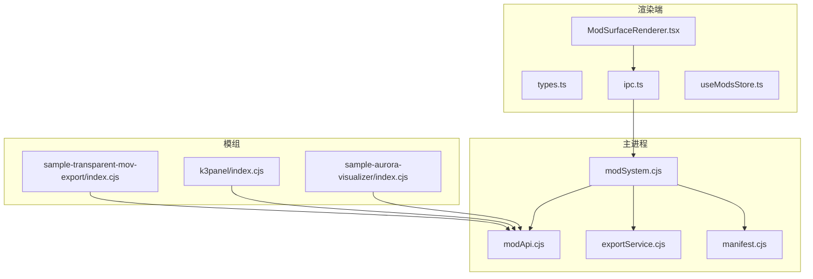
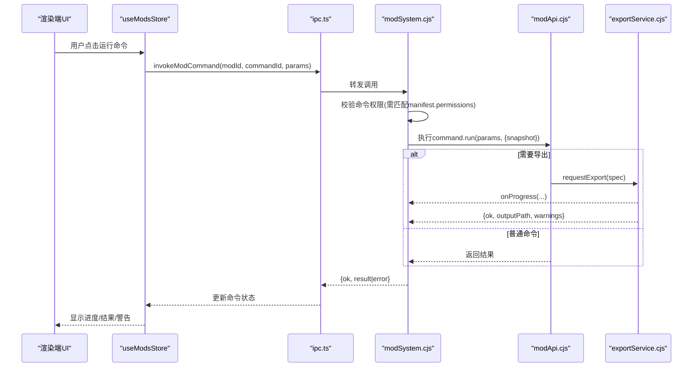
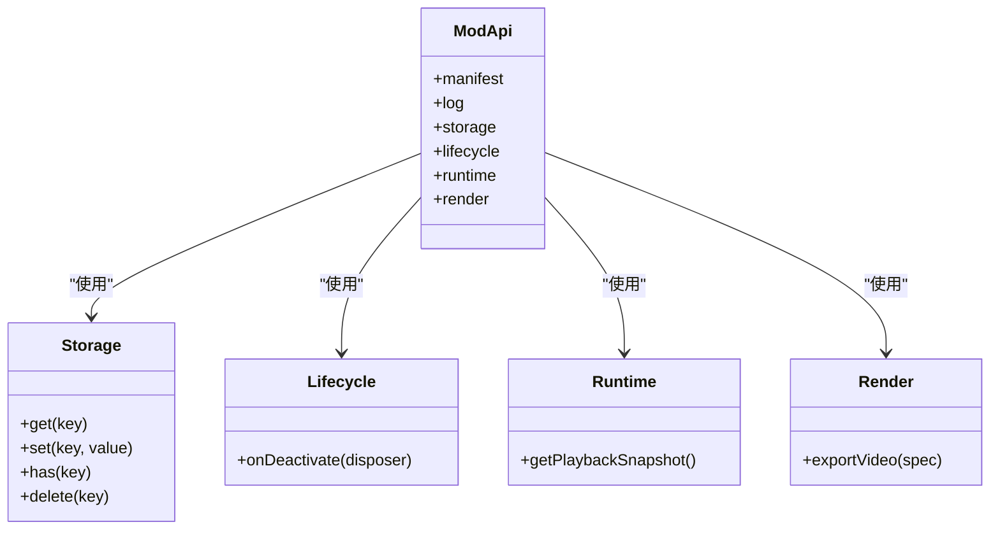
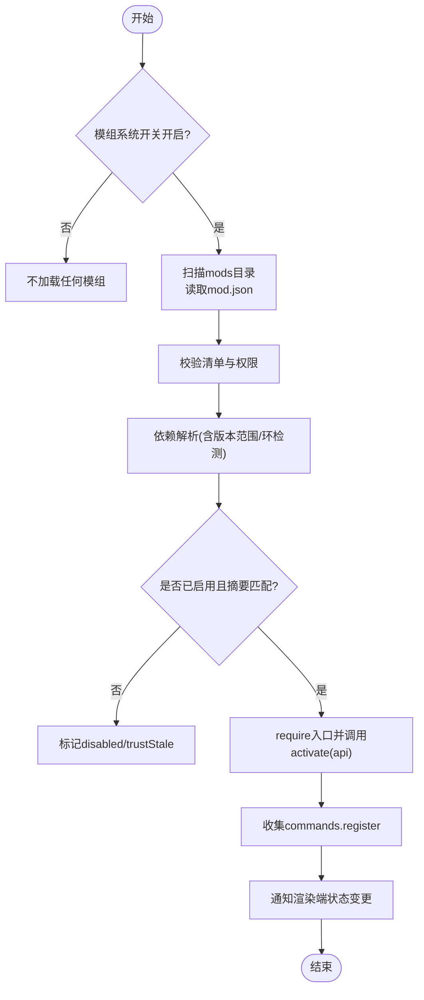
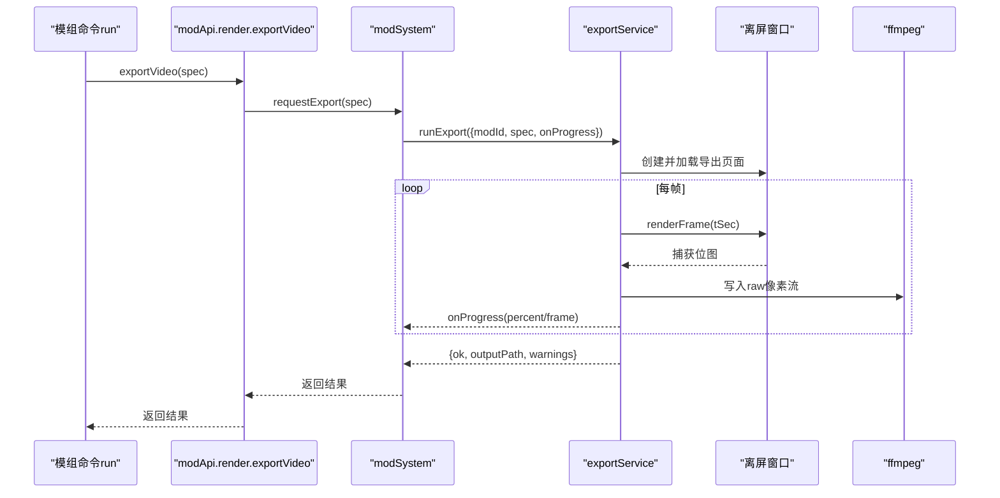
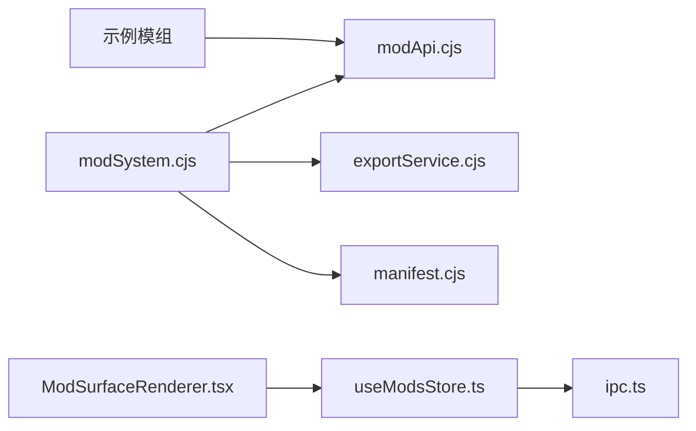

# 模组API参考

<cite>
**本文引用的文件**
- [modApi.cjs](file://electron/modSystem/modApi.cjs)
- [modSystem.cjs](file://electron/modSystem/modSystem.cjs)
- [exportService.cjs](file://electron/modSystem/exportService.cjs)
- [manifest.cjs](file://electron/modSystem/manifest.cjs)
- [types.ts](file://src/mods/types.ts)
- [ipc.ts](file://src/mods/ipc.ts)
- [ModSurfaceRenderer.tsx](file://src/mods/ModSurfaceRenderer.tsx)
- [useModsStore.ts](file://src/mods/useModsStore.ts)
- [sample-transparent-mov-export/index.cjs](file://mods/sample-transparent-mov-export/index.cjs)
- [k3panel/index.cjs](file://mods/k3panel/index.cjs)
- [sample-aurora-visualizer/index.cjs](file://mods/sample-aurora-visualizer/index.cjs)
- [sample-aurora-visualizer/mod.json](file://mods/sample-aurora-visualizer/mod.json)
- [k3panel/mod.json](file://mods/k3panel/mod.json)
</cite>

## 目录
1. [简介](#简介)
2. [项目结构](#项目结构)
3. [核心组件](#核心组件)
4. [架构总览](#架构总览)
5. [详细组件分析](#详细组件分析)
6. [依赖关系分析](#依赖关系分析)
7. [性能与稳定性](#性能与稳定性)
8. [故障排查指南](#故障排查指南)
9. [结论](#结论)
10. [附录：类型契约与最佳实践](#附录类型契约与最佳实践)

## 简介
本参考文档面向模组开发者，系统化说明 Folia 桌面端的模组 API。内容覆盖：
- 模组生命周期钩子（activate/dispose、onDeactivate）
- 命令注册机制（commands.register 及参数表单渲染、权限校验）
- 数据访问（storage.data.*）
- 系统调用（runtime.getPlaybackSnapshot、render.exportVideo）
- UI 扩展点（visualizer 贡献，通过 manifest.visualizers 声明）
- TypeScript 类型定义与 IPC 契约
- 错误处理与权限模型（fail-closed）
- 最佳实践与常见模式（导出透明视频、实时调制旋钮等）

## 项目结构
模组系统由主进程加载器、渲染端面板与示例模组组成：
- 主进程侧：modSystem.cjs（发现、验证、加载、IPC）、modApi.cjs（注入模组的受限 API）、exportService.cjs（离屏渲染+ffmpeg 导出）、manifest.cjs（清单校验与依赖解析）
- 渲染端侧：types.ts（跨进程类型契约）、ipc.ts（桥接 window.electron.mods）、useModsStore.ts（状态管理）、ModSurfaceRenderer.tsx（命令面板 UI）
- 示例模组：sample-transparent-mov-export（导出透明视频）、k3panel（商籁深度精调面板）、sample-aurora-visualizer（自定义歌词动画）

图表来源
- [modSystem.cjs:135-280](file://electron/modSystem/modSystem.cjs#L135-L280)
- [modApi.cjs:31-161](file://electron/modSystem/modApi.cjs#L31-L161)
- [exportService.cjs:40-115](file://electron/modSystem/exportService.cjs#L40-L115)
- [manifest.cjs:136-201](file://electron/modSystem/manifest.cjs#L136-L201)
- [ipc.ts:26-78](file://src/mods/ipc.ts#L26-L78)
- [useModsStore.ts:58-156](file://src/mods/useModsStore.ts#L58-L156)
- [ModSurfaceRenderer.tsx:30-197](file://src/mods/ModSurfaceRenderer.tsx#L30-L197)

章节来源
- [modSystem.cjs:1-1037](file://electron/modSystem/modSystem.cjs#L1-L1037)
- [modApi.cjs:1-164](file://electron/modSystem/modApi.cjs#L1-L164)
- [exportService.cjs:1-516](file://electron/modSystem/exportService.cjs#L1-L516)
- [manifest.cjs:1-327](file://electron/modSystem/manifest.cjs#L1-L327)
- [types.ts:1-157](file://src/mods/types.ts#L1-L157)
- [ipc.ts:1-119](file://src/mods/ipc.ts#L1-L119)
- [useModsStore.ts:1-226](file://src/mods/useModsStore.ts#L1-L226)
- [ModSurfaceRenderer.tsx:1-301](file://src/mods/ModSurfaceRenderer.tsx#L1-L301)

## 核心组件
- 模组 API（modApi.cjs）：向模组暴露受限能力集，包括日志、私有存储、生命周期清理、播放快照读取、命令注册、视频导出入口。所有敏感能力受权限控制。
- 模组系统（modSystem.c从 cjs）：发现模组、校验清单、计算摘要、依赖解析、启用确认、加载/卸载、IPC 桥接、导出服务集成。
- 导出服务（exportService.cjs）：创建离屏透明窗口驱动可视化渲染，逐帧捕获并通过 ffmpeg 编码输出 MOV/WebM；支持取消、进度回调、平台 Alpha 通道探测与警告。
- 清单与依赖（manifest.cjs）：校验 mod.json、权限白名单、visualizer 贡献项、依赖版本范围与环检测。
- 渲染端类型与 IPC（types.ts, ipc.ts）：跨进程类型契约与桥接函数，保证 JSON 可序列化。
- 面板与状态（useModsStore.ts, ModSurfaceRenderer.tsx）：展示模组列表、命令表单、导出进度、日志；将用户操作转为 IPC 调用。

章节来源
- [modApi.cjs:31-161](file://electron/modSystem/modApi.cjs#L31-L161)
- [modSystem.cjs:135-280](file://electron/modSystem/modSystem.cjs#L135-L280)
- [exportService.cjs:40-115](file://electron/modSystem/exportService.cjs#L40-L115)
- [manifest.cjs:136-201](file://electron/modSystem/manifest.cjs#L136-L201)
- [types.ts:9-157](file://src/mods/types.ts#L9-L157)
- [ipc.ts:26-119](file://src/mods/ipc.ts#L26-L119)
- [useModsStore.ts:58-156](file://src/mods/useModsStore.ts#L58-L156)
- [ModSurfaceRenderer.tsx:30-197](file://src/mods/ModSurfaceRenderer.tsx#L30-L197)

## 架构总览
模组运行在 Electron 主进程中，拥有完整 Node 权限；安全边界来自“用户二次确认”和“权限 fail-closed”。渲染端仅通过 IPC 暴露的有限接口与主进程交互。

图表来源
- [modSystem.cjs:664-689](file://electron/modSystem/modSystem.cjs#L664-L689)
- [modApi.cjs:136-160](file://electron/modSystem/modApi.cjs#L136-L160)
- [exportService.cjs:171-416](file://electron/modSystem/exportService.cjs#L171-L416)
- [ipc.ts:69-78](file://src/mods/ipc.ts#L69-L78)
- [useModsStore.ts:108-128](file://src/mods/useModsStore.ts#L108-L128)

## 详细组件分析

### 模组 API（modApi.cjs）
- 暴露对象
  - manifest：只读清单副本
  - log.info/warn/error：统一日志并推送到渲染端
  - storage.data：键值持久化（get/set/has/delete），需要 filesystem.data 权限
  - lifecycle.onDeactivate(fn)：注册清理回调，禁用/重载/退出时按逆序执行
  - runtime.getPlaybackSnapshot()：获取当前歌曲/歌词/主题快照，需要 runtime.playback 权限
  - render.exportVideo(spec)：启动导出会话，需要 render.export 权限
- 权限模型
  - 未声明权限调用抛出 permission-denied:<id>
  - 命令级 permissions 需在 manifest.permissions 子集中，否则执行时报错

图表来源
- [modApi.cjs:31-161](file://electron/modSystem/modApi.cjs#L31-L161)

章节来源
- [modApi.cjs:1-164](file://electron/modSystem/modApi.cjs#L1-L164)

### 模组系统（modSystem.cjs）
- 生命周期
  - loadAll：卸载已激活模组→发现清单→校验→依赖解析→按序加载→通知渲染端
  - unloadAll：对每个已加载模组执行 unload（清理监听器、定时器、命令注册表）
- 信任与启用
  - confirmEnableMod：原生对话框展示风险、权限、安装位置、内容指纹；默认取消
  - setModEnabled：写入信任记录（enabled + digest），失败或拒绝返回错误码
- 命令执行
  - invokeModCommand：查找命令→校验权限→执行 run(params, {snapshot})→返回结果或错误
- 视觉贡献
  - 为已加载模组生成 visualizer 描述符，供导出页面与选择器使用

图表来源
- [modSystem.cjs:490-596](file://electron/modSystem/modSystem.cjs#L490-L596)
- [modSystem.cjs:604-662](file://electron/modSystem/modSystem.cjs#L604-L662)
- [modSystem.cjs:664-689](file://electron/modSystem/modSystem.cjs#L664-L689)

章节来源
- [modSystem.cjs:1-1037](file://electron/modSystem/modSystem.cjs#L1-L1037)

### 导出服务（exportService.cjs）
- 规格校验与归一化
  - 尺寸、帧率、时长限制；歌词行有效性检查；背景模式与透明度设置；Alpha 通道保障提示
- 渲染与编码
  - 创建离屏透明窗口，注入配置（歌词、主题、模式、tunings、modVisualizers）
  - 循环 capturePage → 转换为 BGRA/RGBA → 写入 ffmpeg stdin → 编码为 ProRes 或 VP9
  - 进度回调 with 节流；支持取消；失败清理 ffmpeg 进程与窗口
- 返回值
  - ok、outputPath、frameCount、sizeBytes、durationSec、backgroundMode、transparent、warnings

图表来源
- [exportService.cjs:50-115](file://electron/modSystem/exportService.cjs#L50-L115)
- [exportService.cjs:171-416](file://electron/modSystem/exportService.cjs#L171-L416)
- [modApi.cjs:158-160](file://electron/modSystem/modApi.cjs#L158-L160)

章节来源
- [exportService.cjs:1-516](file://electron/modSystem/exportService.cjs#L1-L516)

### 清单与依赖（manifest.cjs）
- 权限白名单：filesystem.data、render.export、runtime.playback、visualizer.register
- 依赖解析：支持 bare id 与 id@^X.Y.Z；检测缺失、版本不符、环；隔离失败子图
- visualizer 贡献：要求权限 visualizer.register；entry 必须为 .js/.mjs 相对路径

章节来源
- [manifest.cjs:1-327](file://electron/modSystem/manifest.cjs#L1-L327)

### 渲染端类型与 IPC（types.ts, ipc.ts）
- types.ts 定义了跨进程传输的纯数据结构：ModRuntimeInfo、ModCommandInfo、ModExportProgress、ModFfmpegStatus、ModRuntimeSnapshot 等
- ipc.ts 提供 typed 方法：listMods、setModEnabled、reloadMods、invokeModCommand、pushRuntimeSnapshot、getFfmpegStatus、openModsDirectory、installModFromZip、订阅事件

章节来源
- [types.ts:1-157](file://src/mods/types.ts#L1-L157)
- [ipc.ts:1-119](file://src/mods/ipc.ts#L1-L119)

### 面板与状态（useModsStore.ts, ModSurfaceRenderer.tsx）
- useModsStore.ts：维护 mods、ffmpeg、directories、selectedModId、exportProgress、logs、commandState；封装刷新、重载、切换启用、运行命令、取消导出、打开目录、安装 zip、绑定事件
- ModSurfaceRenderer.tsx：根据命令参数类型渲染输入控件；支持 live 滑块与 modulate 实时调制；显示进度条、错误与警告

章节来源
- [useModsStore.ts:1-226](file://src/mods/useModsStore.ts#L1-L226)
- [ModSurfaceRenderer.tsx:1-301](file://src/mods/ModSurfaceRenderer.tsx#L1-L301)

## 依赖关系分析
- 模块耦合
  - modSystem.cjs 依赖 modApi.cjs、exportService.cjs、manifest.cjs
  - 渲染端 useModsStore.ts 依赖 ipc.ts，ipc.ts 依赖 window.electron.mods（preload 桥）
  - 示例模组通过 modApi.cjs 暴露的能力进行交互
- 外部依赖
  - Electron（dialog、ipcMain、protocol、shell、BrowserWindow）
  - fflate（解压 zip）
  - ffmpeg（视频编码）

图表来源
- [modSystem.cjs:135-280](file://electron/modSystem/modSystem.cjs#L135-L280)
- [useModsStore.ts:1-226](file://src/mods/useModsStore.ts#L1-L226)
- [ipc.ts:1-119](file://src/mods/ipc.ts#L1-L119)

章节来源
- [modSystem.cjs:1-1037](file://electron/modSystem/modSystem.cjs#L1-L1037)
- [useModsStore.ts:1-226](file://src/mods/useModsStore.ts#L1-L226)
- [ipc.ts:1-119](file://src/mods/ipc.ts#L1-L119)

## 性能与稳定性
- 导出性能
  - 直接写入 raw 像素流避免 PNG 编解码开销
  - 并行推进下一帧渲染与上一帧写入，减少等待
  - 限制最大分辨率、帧率与时长，防止长时间渲染占用资源
- 稳定性
  - 单模组加载失败不影响宿主与其他模组
  - 每次加载先执行 deactivate，再重新 activate，避免多代定时器/监听器残留
  - 导出会话全局互斥；失败/取消时清理 ffmpeg 进程、离屏窗口与半成品文件
- 内存与缓存
  - 重载时清除整个模组目录的 require.cache，确保热更新生效
  - 视觉贡献 URL 带内容摘要版本号，规避浏览器 ESM 缓存

章节来源
- [modSystem.cjs:117-126](file://electron/modSystem/modSystem.cjs#L117-L126)
- [modSystem.cjs:240-279](file://electron/modSystem/modSystem.cjs#L240-L279)
- [exportService.cjs:190-219](file://electron/modSystem/exportService.cjs#L190-L219)
- [exportService.cjs:324-370](file://electron/modSystem/exportService.cjs#L324-L370)

## 故障排查指南
- 权限相关
  - 调用 storage.data.* 或 runtime.getPlaybackSnapshot 前请确保 manifest.permissions 包含对应权限
  - 命令级 permissions 必须是 manifest.permissions 的子集，否则执行时报 permission-denied
- 导出失败
  - 检查 ffmpeg 是否可用（getFfmpegStatus）
  - 检查平台 Alpha 通道保障（Windows 完全支持；其他平台可能无 Alpha）
  - 查看导出进度回调中的 message 与 warnings
- 启用失败
  - enable-declined：用户取消确认
  - mod-content-unverifiable：无法计算内容摘要
  - mod-not-found / mod-not-loaded：模组未加载或不存在
- 依赖问题
  - dependency-failed：缺失依赖、版本不符、依赖成环或依赖未被启用

章节来源
- [modSystem.cjs:664-689](file://electron/modSystem/modSystem.cjs#L664-L689)
- [exportService.cjs:50-115](file://electron/modSystem/exportService.cjs#L50-L115)
- [exportService.cjs:402-416](file://electron/modSystem/exportService.cjs#L402-L416)

## 结论
Folia 模组系统以“用户确认 + 权限 fail-closed”为核心安全策略，提供稳定的生命周期管理、命令注册、数据访问与导出能力。通过清晰的类型契约与 IPC 抽象，开发者可以专注于业务逻辑，同时享受强大的可视化扩展与导出功能。建议遵循权限最小化、健壮的错误处理与资源清理实践，以获得更好的用户体验与系统稳定性。

## 附录：类型契约与最佳实践

### 类型契约（TypeScript）
- 运行时信息
  - ModRuntimeInfo：模组元数据、状态、权限、命令、视觉贡献
  - ModCommandInfo：命令标识、标签、描述、参数、权限
  - ModExportProgress：导出阶段、帧数、百分比、消息
  - ModFfmpegStatus：ffmpeg 可用性、路径、版本、候选
  - ModRuntimeSnapshot：当前歌曲、歌词、主题、可视化模式与调优
- 关键字段
  - ModCommandParam.type：number | text | boolean | select
  - ModCommandParam.modulate：{ mode: string } 用于渲染端实时调制
  - ModLabelMap：zh-CN/en/in 等多语言标签映射

章节来源
- [types.ts:9-157](file://src/mods/types.ts#L9-L157)

### 常用 API 与方法
- 生命周期
  - api.lifecycle.onDeactivate(fn)：注册清理回调
- 数据访问
  - api.storage.data.get/set/has/delete：需要 filesystem.data
- 系统调用
  - api.runtime.getPlaybackSnapshot()：需要 runtime.playback
  - api.render.exportVideo(spec)：需要 render.export
- 命令注册
  - api.commands.register({ id, label, description, params, permissions, run })

章节来源
- [modApi.cjs:107-161](file://electron/modSystem/modApi.cjs#L107-L161)

### 使用示例与最佳实践
- 导出透明视频
  - 示例：sample-transparent-mov-export/index.cjs
  - 步骤：获取播放快照→构造导出 spec→调用 exportVideo→处理结果与警告
  - 注意：确保 ffmpeg 可用；理解平台 Alpha 差异；合理设置 width/height/fps/startSec/endSec
- 实时调制旋钮
  - 示例：k3panel/index.cjs
  - 步骤：声明参数 type:number 并设置 modulate:{mode:'sonnet'}→拖动即生效
  - 优势：无需 IPC 往返，下一帧即更新
- 自定义歌词动画（visualizer 贡献）
  - 在 manifest 中声明 visualizers 数组，entry 为浏览器 ESM 模块
  - 通过 folia-mod:// 协议由渲染端动态加载，URL 带内容摘要版本
  - 导出页面会注入 modVisualizers 描述符，使 mod: 模式在导出中可用

章节来源
- [sample-transparent-mov-export/index.cjs:1-118](file://mods/sample-transparent-mov-export/index.cjs#L1-L118)
- [k3panel/index.cjs:1-50](file://mods/k3panel/index.cjs#L1-L50)
- [sample-aurora-visualizer/mod.json:1-19](file://mods/sample-aurora-visualizer/mod.json#L1-L19)
- [sample-aurora-visualizer/index.cjs:1-10](file://mods/sample-aurora-visualizer/index.cjs#L1-L10)