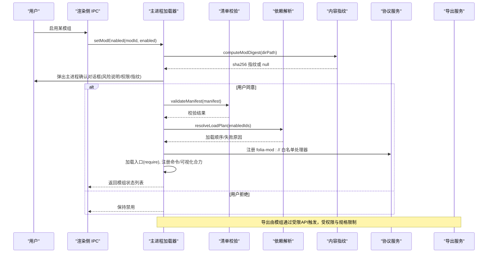
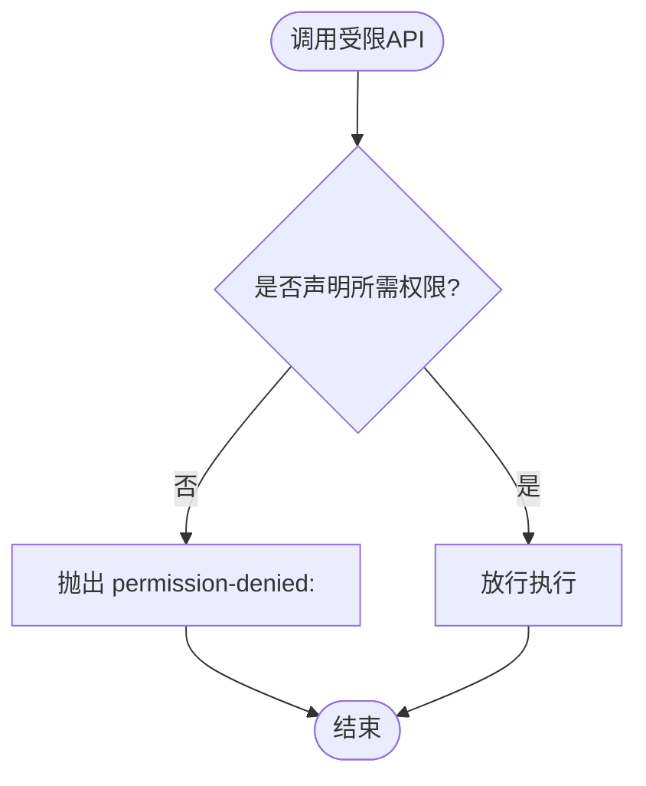
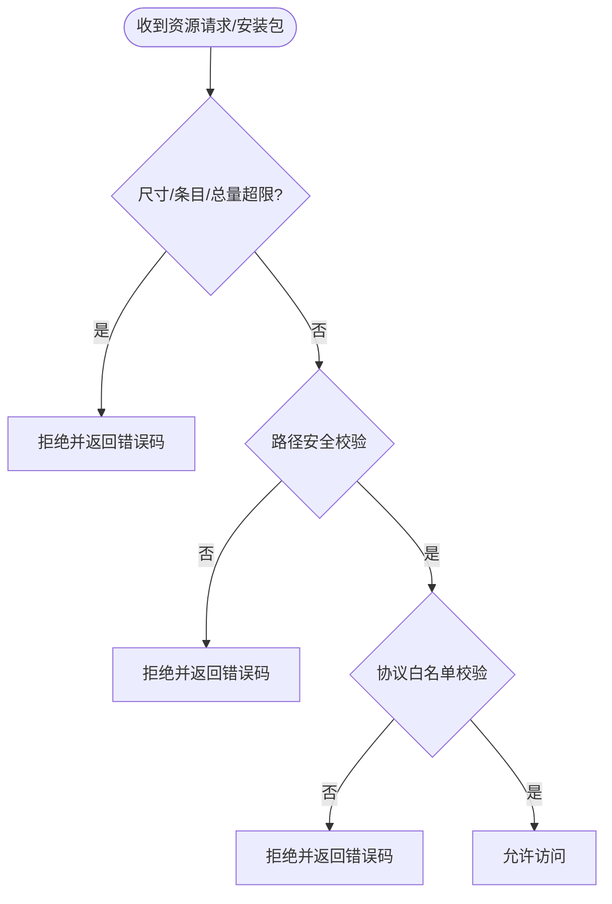
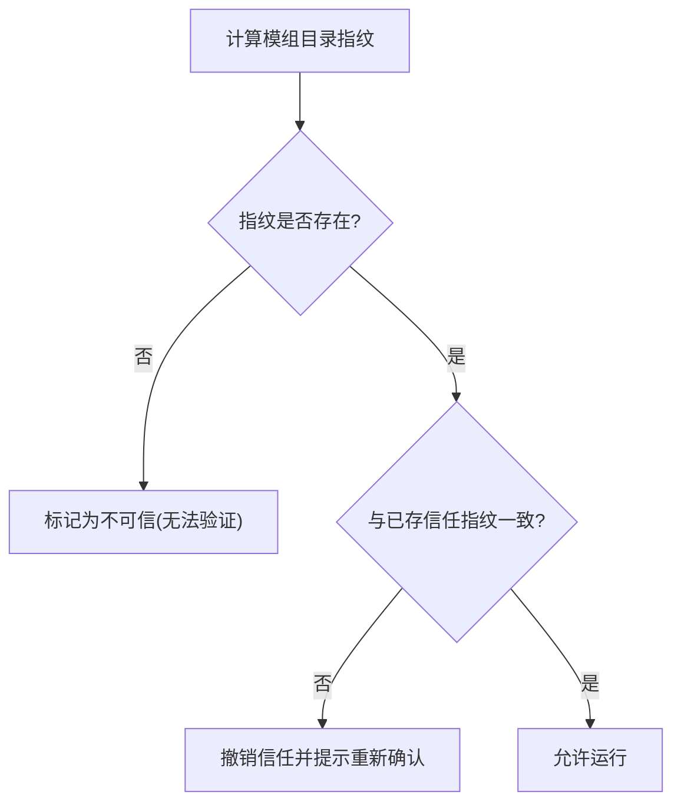
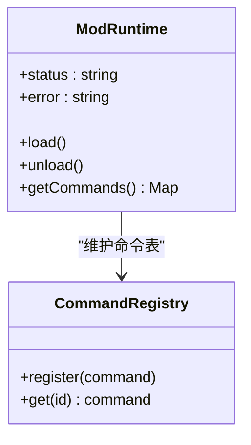
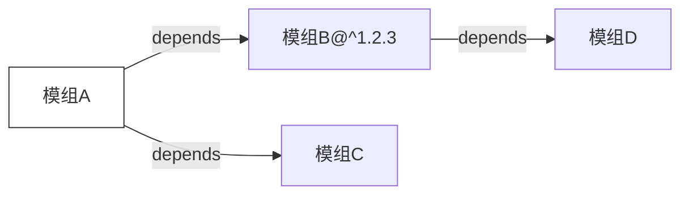

# 模组安全机制

<cite>
**本文引用的文件**
- [electron/modSystem/modSystem.cjs](file://electron/modSystem/modSystem.cjs)
- [electron/modSystem/manifest.cjs](file://electron/modSystem/manifest.cjs)
- [electron/modSystem/modDigest.cjs](file://electron/modSystem/modDigest.cjs)
- [electron/modSystem/modApi.cjs](file://electron/modSystem/modApi.cjs)
- [electron/modSystem/modProtocol.cjs](file://electron/modSystem/modProtocol.cjs)
- [electron/modSystem/exportService.cjs](file://electron/modSystem/exportService.cjs)
- [src/mods/types.ts](file://src/mods/types.ts)
- [src/mods/ipc.ts](file://src/mods/ipc.ts)
- [mods/sample-aurora-visualizer/mod.json](file://mods/sample-aurora-visualizer/mod.json)
- [mods/k3panel/mod.json](file://mods/k3panel/mod.json)
</cite>

## 目录
1. [简介](#简介)
2. [项目结构](#项目结构)
3. [核心组件](#核心组件)
4. [架构总览](#架构总览)
5. [详细组件分析](#详细组件分析)
6. [依赖关系分析](#依赖关系分析)
7. [性能与安全权衡](#性能与安全权衡)
8. [故障排查指南](#故障排查指南)
9. [结论](#结论)
10. [附录：配置与监控告警](#附录配置与监控告警)

## 简介
本文件系统性阐述 Folia 播放器的“模组安全机制”，覆盖权限控制模型、资源访问限制、网络请求过滤、信任验证流程（内容指纹计算、数字签名/来源可信度评估）、异常隔离机制，以及安全最佳实践、风险评估与监控告警。目标是帮助开发者理解并遵循安全规范，确保模组在获得必要能力的同时，不会危及主应用稳定性与安全性。

## 项目结构
模组系统由 Electron 主进程加载器、受限 API 注入层、白名单协议服务、清单校验与依赖解析、内容指纹计算、导出服务等模块组成；前端通过 IPC 与主进程交互，渲染侧仅承载 UI 与可视化贡献代码。

```mermaid
graph TB
A["主进程: modSystem.cjs"] --> B["清单校验: manifest.cjs"]
A --> C["内容指纹: modDigest.cjs"]
A --> D["受限API: modApi.cjs"]
A --> E["协议服务: modProtocol.cjs"]
A --> F["导出服务: exportService.cjs"]
G["渲染侧: src/mods/ipc.ts"] < --> A
H["类型契约: src/mods/types.ts"] --> G
I["示例模组清单: mods/*/mod.json"] --> B
```

图表来源
- [electron/modSystem/modSystem.cjs:1-120](file://electron/modSystem/modSystem.cjs#L1-L120)
- [electron/modSystem/manifest.cjs:1-60](file://electron/modSystem/manifest.cjs#L1-L60)
- [electron/modSystem/modDigest.cjs:1-40](file://electron/modSystem/modDigest.cjs#L1-L40)
- [electron/modSystem/modApi.cjs:1-40](file://electron/modSystem/modApi.cjs#L1-L40)
- [electron/modSystem/modProtocol.cjs:1-40](file://electron/modSystem/modProtocol.cjs#L1-L40)
- [electron/modSystem/exportService.cjs:1-40](file://electron/modSystem/exportService.cjs#L1-L40)
- [src/mods/ipc.ts:1-40](file://src/mods/ipc.ts#L1-L40)
- [src/mods/types.ts:1-40](file://src/mods/types.ts#L1-L40)
- [mods/sample-aurora-visualizer/mod.json:1-19](file://mods/sample-aurora-visualizer/mod.json#L1-L19)
- [mods/k3panel/mod.json:1-11](file://mods/k3panel/mod.json#L1-L11)

章节来源
- [electron/modSystem/modSystem.cjs:1-120](file://electron/modSystem/modSystem.cjs#L1-L120)
- [src/mods/ipc.ts:1-40](file://src/mods/ipc.ts#L1-L40)
- [src/mods/types.ts:1-40](file://src/mods/types.ts#L1-L40)

## 核心组件
- 主进程模组加载器：负责发现、校验、依赖解析、启用确认、运行时生命周期管理、命令路由与日志上报。
- 清单校验与依赖解析：严格白名单权限、版本范围匹配、循环依赖检测、失败隔离。
- 内容指纹计算：对模组目录进行确定性遍历与哈希，绑定用户“启用”决策到具体字节集。
- 受限 API 注入：为模组提供最小能力面（日志、数据持久化、播放快照、导出、命令注册），所有敏感能力需声明权限。
- 白名单协议服务：通过自定义协议仅暴露已发现且已校验的模组静态资源，禁止路径穿越与任意文件读取。
- 导出服务：在离屏窗口中驱动可视化渲染并通过 ffmpeg 输出视频，具备严格的规格校验与资源上限保护。

章节来源
- [electron/modSystem/modSystem.cjs:120-220](file://electron/modSystem/modSystem.cjs#L120-L220)
- [electron/modSystem/manifest.cjs:136-201](file://electron/modSystem/manifest.cjs#L136-L201)
- [electron/modSystem/modDigest.cjs:67-99](file://electron/modSystem/modDigest.cjs#L67-L99)
- [electron/modSystem/modApi.cjs:31-164](file://electron/modSystem/modApi.cjs#L31-L164)
- [electron/modSystem/modProtocol.cjs:51-95](file://electron/modSystem/modProtocol.cjs#L51-L95)
- [electron/modSystem/exportService.cjs:40-115](file://electron/modSystem/exportService.cjs#L40-L115)

## 架构总览
模组从安装到运行经历以下关键阶段：安装校验 → 清单校验 → 依赖解析 → 内容指纹计算 → 用户信任确认 → 加载执行 → 运行时权限检查 → 异常隔离 → 卸载清理。



图表来源
- [electron/modSystem/modSystem.cjs:604-662](file://electron/modSystem/modSystem.cjs#L604-L662)
- [electron/modSystem/manifest.cjs:216-295](file://electron/modSystem/manifest.cjs#L216-L295)
- [electron/modSystem/modDigest.cjs:67-99](file://electron/modSystem/modDigest.cjs#L67-L99)
- [electron/modSystem/modProtocol.cjs:51-95](file://electron/modSystem/modProtocol.cjs#L51-L95)
- [electron/modSystem/exportService.cjs:171-200](file://electron/modSystem/exportService.cjs#L171-L200)

## 详细组件分析

### 权限控制模型
- 白名单权限集合：仅允许声明已知权限，未知权限直接拒绝。
- 调用时二次校验：即使声明了权限，实际调用点仍会再次检查，未声明则抛出统一错误格式。
- 权限分类与作用域：
  - 文件系统数据读写：仅限模组私有数据目录，键名非空字符串校验。
  - 播放快照读取：需要运行时播放权限。
  - 渲染导出：需要渲染导出权限，由加载器统一拦截。
  - 可视化贡献：需要可视化注册权限，并在清单中声明条目。



图表来源
- [electron/modSystem/modApi.cjs:31-43](file://electron/modSystem/modApi.cjs#L31-L43)
- [electron/modSystem/manifest.cjs:11-16](file://electron/modSystem/manifest.cjs#L11-L16)

章节来源
- [electron/modSystem/modApi.cjs:31-164](file://electron/modSystem/modApi.cjs#L31-L164)
- [electron/modSystem/manifest.cjs:11-16](file://electron/modSystem/manifest.cjs#L11-L16)

### 资源访问限制
- 安装限制：压缩包大小、条目数量、单文件大小、解压后总量均有限制，防止 zip bomb。
- 路径安全：解压路径规范化，拒绝包含“..”、反斜杠、绝对路径等不安全路径。
- 协议访问：自定义协议仅允许 GET 方法，限定扩展名为 .js/.mjs，路径必须位于已发现模组目录内，禁止穿越。
- 导出规格：分辨率、帧率、时长上限被钳制，避免滥用导致资源耗尽。



图表来源
- [electron/modSystem/modSystem.cjs:43-48](file://electron/modSystem/modSystem.cjs#L43-L48)
- [electron/modSystem/modSystem.cjs:734-800](file://electron/modSystem/modSystem.cjs#L734-L800)
- [electron/modSystem/modProtocol.cjs:51-95](file://electron/modSystem/modProtocol.cjs#L51-L95)
- [electron/modSystem/exportService.cjs:15-23](file://electron/modSystem/exportService.cjs#L15-L23)

章节来源
- [electron/modSystem/modSystem.cjs:734-800](file://electron/modSystem/modSystem.cjs#L734-L800)
- [electron/modSystem/modProtocol.cjs:51-95](file://electron/modSystem/modProtocol.cjs#L51-L95)
- [electron/modSystem/exportService.cjs:15-23](file://electron/modSystem/exportService.cjs#L15-L23)

### 网络请求过滤
- 模组侧不直接持有网络能力：受限 API 未暴露网络接口，模组如需网络能力需通过主进程桥接或外部代理（本项目未内置通用网络代理）。
- 可视化贡献通过白名单协议加载：仅允许加载已发现模组的静态 JS/ESM 资源，避免跨域与任意脚本执行。
- 导出过程使用离屏窗口与 ffmpeg：渲染在独立窗口中进行，通过管道将像素流交给 ffmpeg 编码，避免在主线程阻塞。

章节来源
- [electron/modSystem/modApi.cjs:107-164](file://electron/modSystem/modApi.cjs#L107-L164)
- [electron/modSystem/modProtocol.cjs:1-95](file://electron/modSystem/modProtocol.cjs#L1-L95)
- [electron/modSystem/exportService.cjs:1-40](file://electron/modSystem/exportService.cjs#L1-L40)

### 信任验证流程（内容指纹与来源可信度）
- 内容指纹：对模组目录进行确定性遍历（排序、记录符号链接目标），对所有文件路径与内容进行 SHA-256 汇总，得到唯一指纹。
- 信任绑定：用户启用确认绑定到当前指纹；若文件变化导致指纹不同，则自动撤销信任并要求重新确认。
- 来源可信度：通过主进程原生对话框展示风险说明、权限、安装位置与指纹，确保用户在知情情况下授权。



图表来源
- [electron/modSystem/modDigest.cjs:28-99](file://electron/modSystem/modDigest.cjs#L28-L99)
- [electron/modSystem/modSystem.cjs:287-331](file://electron/modSystem/modSystem.cjs#L287-L331)
- [electron/modSystem/modSystem.cjs:604-662](file://electron/modSystem/modSystem.cjs#L604-L662)

章节来源
- [electron/modSystem/modDigest.cjs:28-99](file://electron/modSystem/modDigest.cjs#L28-L99)
- [electron/modSystem/modSystem.cjs:287-331](file://electron/modSystem/modSystem.cjs#L287-L331)

### 异常隔离机制
- 每模组错误边界：单个模组加载或运行异常不会影响其他模组与主应用。
- 生命周期清理：通过 dispose 函数与注册清理钩子，确保定时器、监听器等资源在禁用/重载/退出时被释放。
- 依赖失败隔离：依赖缺失或版本不满足仅影响相关子图，不影响无关模组。
- 缓存清理：重载时清除模组子树模块缓存，避免旧代码残留。



图表来源
- [electron/modSystem/modSystem.cjs:200-280](file://electron/modSystem/modSystem.cjs#L200-L280)
- [electron/modSystem/modSystem.cjs:476-596](file://electron/modSystem/modSystem.cjs#L476-L596)

章节来源
- [electron/modSystem/modSystem.cjs:200-280](file://electron/modSystem/modSystem.cjs#L200-L280)
- [electron/modSystem/modSystem.cjs:476-596](file://electron/modSystem/modSystem.cjs#L476-L596)

### 可视化贡献与渲染安全
- 清单声明：可视化条目需在清单中声明 id、entry、label、order，并需对应权限。
- 协议加载：通过自定义协议以带版本查询参数的 URL 加载，确保浏览器 ES 模块缓存按指纹失效。
- 渲染隔离：可视化贡献在渲染侧作为 ESM 动态导入，不在 Node 环境执行。

章节来源
- [electron/modSystem/manifest.cjs:87-134](file://electron/modSystem/manifest.cjs#L87-L134)
- [electron/modSystem/modSystem.cjs:333-338](file://electron/modSystem/modSystem.cjs#L333-L338)
- [electron/modSystem/modProtocol.cjs:51-95](file://electron/modSystem/modProtocol.cjs#L51-L95)

### 导出服务安全
- 规格校验：分辨率、帧率、时长上限被钳制，非法参数直接拒绝。
- 资源保护：限制最大时长，避免意外长时渲染占用磁盘与 CPU。
- 平台差异：透明通道仅在特定平台保证，其他平台回退为非透明输出。
- 进程管理：ffmpeg 子进程启动与销毁受控，失败或取消时确保资源回收。

章节来源
- [electron/modSystem/exportService.cjs:15-23](file://electron/modSystem/exportService.cjs#L15-L23)
- [electron/modSystem/exportService.cjs:40-115](file://electron/modSystem/exportService.cjs#L40-L115)
- [electron/modSystem/exportService.cjs:171-200](file://electron/modSystem/exportService.cjs#L171-L200)

## 依赖关系分析
模组依赖通过清单中的 depends 字段声明，支持精确 ID 与 ^x.y.z 范围匹配；解析器检测循环依赖、缺失依赖、版本不兼容，并将失败限制在相关子图。



图表来源
- [electron/modSystem/manifest.cjs:28-85](file://electron/modSystem/manifest.cjs#L28-L85)
- [electron/modSystem/manifest.cjs:216-295](file://electron/modSystem/manifest.cjs#L216-L295)

章节来源
- [electron/modSystem/manifest.cjs:28-85](file://electron/modSystem/manifest.cjs#L28-L85)
- [electron/modSystem/manifest.cjs:216-295](file://electron/modSystem/manifest.cjs#L216-L295)

## 性能与安全权衡
- 同步哈希与限制：模组目录哈希采用同步遍历，但设置文件数与总大小上限，避免启动卡顿与内存爆炸。
- 模块缓存清理：重载时清理模组子树缓存，确保热更新生效，代价是短暂 CPU 开销。
- 导出管道优化：使用原始像素流直连 ffmpeg，跳过逐帧 PNG 编解码，降低主线程阻塞与延迟。
- 协议无缓存：自定义协议响应头禁用缓存，避免旧版本代码被复用。

章节来源
- [electron/modSystem/modDigest.cjs:14-20](file://electron/modSystem/modDigest.cjs#L14-L20)
- [electron/modSystem/modSystem.cjs:117-126](file://electron/modSystem/modSystem.cjs#L117-L126)
- [electron/modSystem/exportService.cjs:191-200](file://electron/modSystem/exportService.cjs#L191-L200)
- [electron/modSystem/modProtocol.cjs:84-87](file://electron/modSystem/modProtocol.cjs#L84-L87)

## 故障排查指南
- 常见错误码与含义：
  - install-too-large / install-too-many-files / install-corrupt-zip：安装包过大、条目过多或损坏。
  - install-unsafe-path：路径包含穿越或不安全字符。
  - mod-content-unverifiable：无法计算指纹（目录过大或读取失败）。
  - dependency-failed：依赖缺失、版本不匹配或循环依赖。
  - permission-denied:*：调用未声明权限的 API。
  - export-invalid-spec / export-unsupported-platform：导出规格非法或平台不支持。
- 定位步骤：
  - 查看模组面板状态与错误信息。
  - 检查模组清单是否符合约束（ID、版本、权限、入口）。
  - 确认用户启用确认是否针对当前指纹。
  - 检查导出规格是否在限制范围内。
  - 查看主进程日志与 IPC 错误返回。

章节来源
- [electron/modSystem/modSystem.cjs:634-689](file://electron/modSystem/modSystem.cjs#L634-L689)
- [electron/modSystem/modSystem.cjs:734-800](file://electron/modSystem/modSystem.cjs#L734-L800)
- [electron/modSystem/exportService.cjs:40-115](file://electron/modSystem/exportService.cjs#L40-L115)

## 结论
该模组安全机制通过“白名单权限 + 内容指纹绑定 + 主进程确认 + 协议白名单 + 异常隔离 + 资源上限”的组合策略，在保证模组扩展性的同时，有效降低了恶意或错误代码对主应用的威胁面。建议开发者严格遵循权限最小化原则，谨慎声明能力，并在测试环境中充分验证模组行为与资源消耗。

## 附录：配置与监控告警
- 安全配置选项
  - 模组系统开关：可通过主进程特性开关关闭整个模组系统，默认“失败关闭”。
  - 安装限制：压缩包大小、条目数、单文件大小、解压总量上限。
  - 导出限制：分辨率、帧率、最大时长、平台兼容性。
  - 协议白名单：仅允许 .js/.mjs，GET 方法，路径限制在模组目录内。
- 监控与告警
  - 日志上报：模组可通过受限 API 的日志接口输出 info/warn/error，主进程转发至渲染侧订阅。
  - 状态变更：IPC 推送模组状态变化事件，便于 UI 实时反映。
  - 导出进度：导出过程中推送进度事件，支持取消操作。
  - 调试建议：结合主进程控制台输出与渲染侧日志面板，快速定位问题。

章节来源
- [electron/modSystem/modSystem.cjs:164-198](file://electron/modSystem/modSystem.cjs#L164-L198)
- [electron/modSystem/modSystem.cjs:691-724](file://electron/modSystem/modSystem.cjs#L691-L724)
- [src/mods/ipc.ts:110-119](file://src/mods/ipc.ts#L110-L119)
- [electron/modSystem/exportService.cjs:171-200](file://electron/modSystem/exportService.cjs#L171-L200)