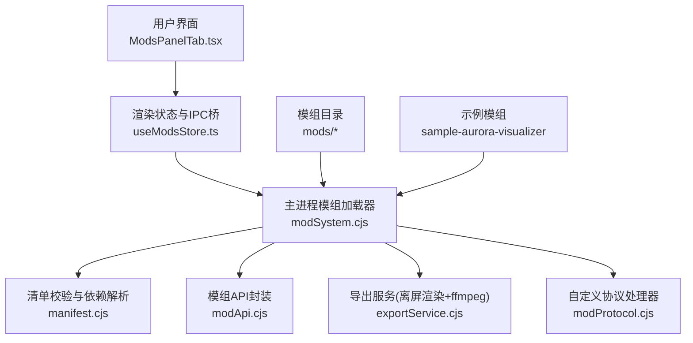
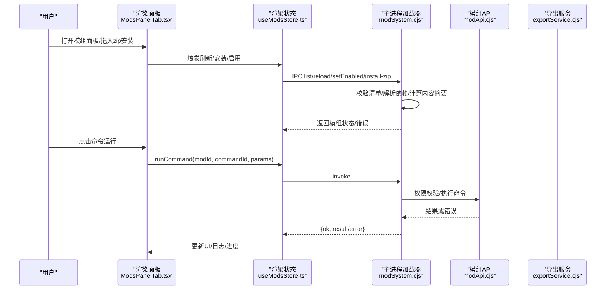
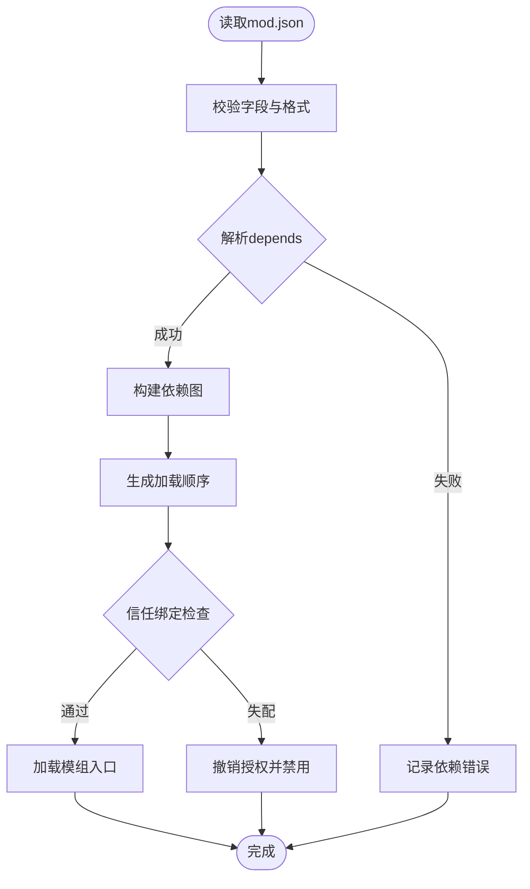
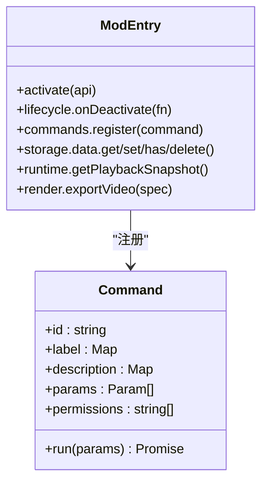
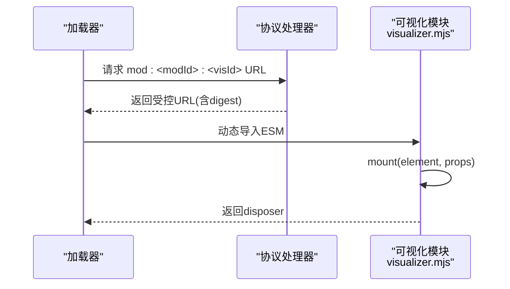
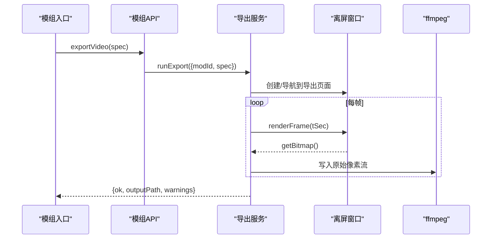
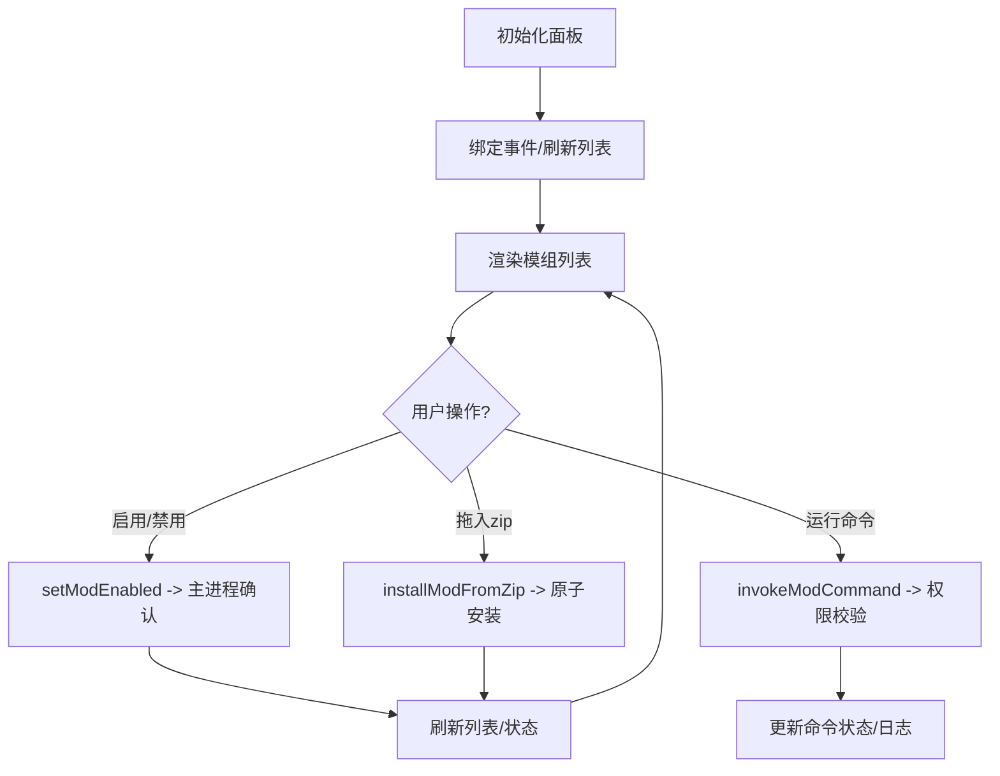
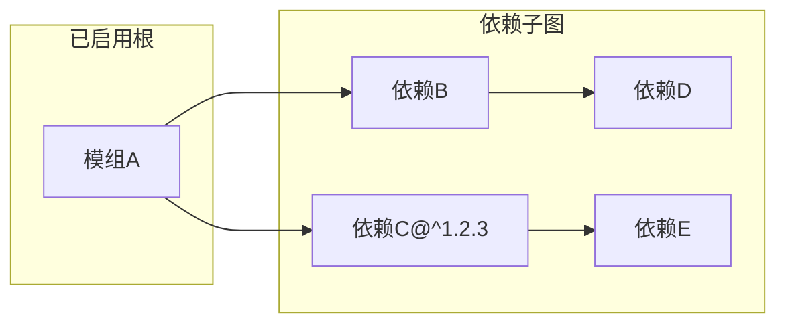

# 模组开发指南

<cite>
**本文引用的文件**
- [mods/README.md](file://mods/README.md)
- [electron/modSystem/modSystem.cjs](file://electron/modSystem/modSystem.cjs)
- [electron/modSystem/manifest.cjs](file://electron/modSystem/manifest.cjs)
- [electron/modSystem/modApi.cjs](file://electron/modSystem/modApi.cjs)
- [electron/modSystem/exportService.cjs](file://electron/modSystem/exportService.cjs)
- [src/mods/ModsPanelTab.tsx](file://src/mods/ModsPanelTab.tsx)
- [src/mods/useModsStore.ts](file://src/mods/useModsStore.ts)
- [src/mods/types.ts](file://src/mods/types.ts)
- [package.json](file://package.json)
- [mods/k3panel/mod.json](file://mods/k3panel/mod.json)
- [mods/sample-aurora-visualizer/mod.json](file://mods/sample-aurora-visualizer/mod.json)
- [mods/sample-transparent-mov-export/mod.json](file://mods/sample-transparent-mov-export/mod.json)
- [mods/whisper-align/mod.json](file://mods/whisper-align/mod.json)
- [mods/k3panel/index.cjs](file://mods/k3panel/index.cjs)
- [mods/sample-aurora-visualizer/index.cjs](file://mods/sample-aurora-visualizer/index.cjs)
- [mods/sample-transparent-mov-export/index.cjs](file://mods/sample-transparent-mov-export/index.cjs)
- [mods/sample-aurora-visualizer/visualizer.mjs](file://mods/sample-aurora-visualizer/visualizer.mjs)
</cite>

## 目录
1. [简介](#简介)
2. [项目结构](#项目结构)
3. [核心组件](#核心组件)
4. [架构总览](#架构总览)
5. [详细组件分析](#详细组件分析)
6. [依赖关系分析](#依赖关系分析)
7. [性能考量](#性能考量)
8. [故障排查指南](#故障排查指南)
9. [结论](#结论)
10. [附录](#附录)

## 简介
本指南面向希望在 Folia 桌面端扩展功能的开发者，提供从零开始的模组（Mod）开发全流程：环境准备、项目初始化、依赖安装、开发工具配置；从创建第一个模组到调试、测试、打包发布的完整步骤；并系统讲解模组清单文件格式、目录结构规范与资源组织方式。同时包含调试技巧、常见问题解决方案以及性能优化建议与最佳实践，帮助开发者快速定位问题并写出稳定高效的模组代码。

## 项目结构
Folia 的模组系统由“主进程加载器 + 渲染进程面板 + 模组入口 + 可选可视化贡献”构成。关键位置如下：
- 模组仓库与示例位于 mods 目录，每个模组一个子目录，内含 mod.json 与入口 index.cjs，可选 visualizer.mjs 等渲染侧贡献。
- 主进程加载器位于 electron/modSystem，负责发现、校验、依赖解析、启用确认、命令执行、导出服务与协议处理。
- 渲染侧管理面板位于 src/mods，负责展示模组列表、参数表单、日志与进度，并通过 IPC 与主进程交互。
- 类型定义位于 src/mods/types.ts，统一前后端跨 IPC 的数据契约。
- 构建与脚本在 package.json，提供开发、测试、打包等命令。

图表来源
- [src/mods/ModsPanelTab.tsx:185-596](file://src/mods/ModsPanelTab.tsx#L185-L596)
- [src/mods/useModsStore.ts:58-156](file://src/mods/useModsStore.ts#L58-L156)
- [electron/modSystem/modSystem.cjs:135-596](file://electron/modSystem/modSystem.cjs#L135-L596)
- [electron/modSystem/manifest.cjs:136-327](file://electron/modSystem/manifest.cjs#L136-L327)
- [electron/modSystem/modApi.cjs:31-164](file://electron/modSystem/modApi.cjs#L31-L164)
- [electron/modSystem/exportService.cjs:40-200](file://electron/modSystem/exportService.cjs#L40-L200)

章节来源
- [mods/README.md:10-180](file://mods/README.md#L10-L180)
- [package.json:17-50](file://package.json#L17-L50)

## 核心组件
- 模组清单（mod.json）：声明模组身份、版本、入口、依赖、权限与可视化贡献。
- 模组入口（index.cjs）：导出 activate(api) 函数，注册命令、生命周期清理、导出调用等。
- 渲染侧可视化贡献（visualizer.mjs）：浏览器 ESM 模块，实现 mount(element, props) 契约，用于全屏歌词动画模式。
- 主进程加载器（modSystem.cjs）：扫描模组、校验清单、解析依赖、启用确认、命令执行、导出会话管理。
- 模组 API（modApi.cjs）：向模组暴露受限能力（日志、存储、播放快照、导出、命令注册）。
- 导出服务（exportService.cjs）：离屏窗口驱动渲染、逐帧捕获、调用 ffmpeg 编码输出视频。
- 渲染面板（ModsPanelTab.tsx / useModsStore.ts）：展示模组列表、参数表单、日志、进度，维护本地状态并与主进程同步。

章节来源
- [electron/modSystem/modSystem.cjs:135-596](file://electron/modSystem/modSystem.cjs#L135-L596)
- [electron/modSystem/modApi.cjs:31-164](file://electron/modSystem/modApi.cjs#L31-L164)
- [electron/modSystem/exportService.cjs:40-200](file://electron/modSystem/exportService.cjs#L40-L200)
- [src/mods/ModsPanelTab.tsx:185-596](file://src/mods/ModsPanelTab.tsx#L185-L596)
- [src/mods/useModsStore.ts:58-156](file://src/mods/useModsStore.ts#L58-L156)

## 架构总览
模组系统采用“主进程安全边界 + 渲染进程贡献”的双端协作模式：
- 主进程负责可信操作：清单校验、依赖图解析、启用确认、命令执行、导出控制、文件系统访问。
- 渲染进程负责 UI 与视觉：面板交互、实时调制旋钮、可视化贡献渲染。
- 通过 IPC 传递结构化数据，使用严格类型定义避免歧义。

图表来源
- [src/mods/ModsPanelTab.tsx:185-596](file://src/mods/ModsPanelTab.tsx#L185-L596)
- [src/mods/useModsStore.ts:58-156](file://src/mods/useModsStore.ts#L58-L156)
- [electron/modSystem/modSystem.cjs:634-689](file://electron/modSystem/modSystem.cjs#L634-L689)
- [electron/modSystem/modApi.cjs:107-164](file://electron/modSystem/modApi.cjs#L107-L164)
- [electron/modSystem/exportService.cjs:171-200](file://electron/modSystem/exportService.cjs#L171-L200)

## 详细组件分析

### 模组清单与依赖解析
- 清单字段包括 id、name、version、apiVersion、entry、depends、permissions、visualizers。
- 依赖支持 bare id 或 id@^version，仅允许 ^ 与 * 范围；不满足时标记 dependency-failed。
- 权限白名单：filesystem.data、render.export、runtime.playback、visualizer.register。
- 可视化贡献需声明 visualizer.register 权限，entry 为 .js/.mjs 相对路径。

图表来源
- [electron/modSystem/manifest.cjs:136-327](file://electron/modSystem/manifest.cjs#L136-L327)
- [mods/README.md:57-84](file://mods/README.md#L57-L84)

章节来源
- [electron/modSystem/manifest.cjs:136-327](file://electron/modSystem/manifest.cjs#L136-L327)
- [mods/README.md:57-84](file://mods/README.md#L57-L84)

### 模组入口与命令注册
- 入口必须导出 activate(api) 函数，可返回清理函数或带 dispose 的对象。
- 通过 api.commands.register 声明命令，支持 label/description/params/permissions/run。
- 参数支持 number/text/boolean/select，可声明 live 与 modulate 以支持渲染端实时调制。
- 命令执行经主进程权限校验，未声明权限会拒绝。

图表来源
- [electron/modSystem/modApi.cjs:107-164](file://electron/modSystem/modApi.cjs#L107-L164)
- [mods/k3panel/index.cjs:27-50](file://mods/k3panel/index.cjs#L27-L50)
- [mods/sample-transparent-mov-export/index.cjs:11-118](file://mods/sample-transparent-mov-export/index.cjs#L11-L118)

章节来源
- [mods/README.md:85-121](file://mods/README.md#L85-L121)
- [mods/k3panel/index.cjs:27-50](file://mods/k3panel/index.cjs#L27-L50)
- [mods/sample-transparent-mov-export/index.cjs:11-118](file://mods/sample-transparent-mov-export/index.cjs#L11-L118)

### 渲染侧可视化贡献（Visualizer）
- 通过 manifest.visualizers 声明贡献，entry 为浏览器 ESM 模块。
- 契约：默认导出对象，mount(element, props) 返回 disposer。
- props 包含 lines、currentLineIndex、currentTime(MotionValue)、theme、songTitle 等。
- 通过 folia-mod:// 协议加载，附带内容摘要版本号规避缓存。

图表来源
- [mods/sample-aurora-visualizer/mod.json:1-19](file://mods/sample-aurora-visualizer/mod.json#L1-L19)
- [mods/sample-aurora-visualizer/visualizer.mjs:1-81](file://mods/sample-aurora-visualizer/visualizer.mjs#L1-L81)
- [electron/modSystem/modSystem.cjs:333-393](file://electron/modSystem/modSystem.cjs#L333-L393)

章节来源
- [mods/README.md:139-179](file://mods/README.md#L139-L179)
- [mods/sample-aurora-visualizer/visualizer.mjs:1-81](file://mods/sample-aurora-visualizer/visualizer.mjs#L1-L81)

### 导出流程（透明视频）
- 通过 api.render.exportVideo 发起导出，需要 render.export 权限。
- 导出服务创建离屏窗口，按合成时钟驱动渲染，逐帧捕获并管道至 ffmpeg。
- 支持 VP9(WebM) 与 ProRes 4444(MOV)，限制最大分辨率、帧率与时长。
- 进度通过 IPC 推送，取消/失败均清理进程与临时文件。

图表来源
- [mods/sample-transparent-mov-export/index.cjs:78-118](file://mods/sample-transparent-mov-export/index.cjs#L78-L118)
- [electron/modSystem/exportService.cjs:171-200](file://electron/modSystem/exportService.cjs#L171-L200)

章节来源
- [electron/modSystem/exportService.cjs:40-200](file://electron/modSystem/exportService.cjs#L40-L200)
- [mods/sample-transparent-mov-export/index.cjs:78-118](file://mods/sample-transparent-mov-export/index.cjs#L78-L118)

### 面板与状态管理
- ModsPanelTab 负责展示模组列表、展开详情、执行命令、显示日志与进度。
- useModsStore 维护 bridgeAvailable、mods、ffmpeg、directories、logs、commandState 等，并提供 refresh/toggleMod/runCommand 等方法。
- 面板将当前歌曲、主题、歌词、可视化模式与调优参数推送到主进程，供模组运行时快照使用。

图表来源
- [src/mods/ModsPanelTab.tsx:185-596](file://src/mods/ModsPanelTab.tsx#L185-L596)
- [src/mods/useModsStore.ts:58-156](file://src/mods/useModsStore.ts#L58-L156)

章节来源
- [src/mods/ModsPanelTab.tsx:185-596](file://src/mods/ModsPanelTab.tsx#L185-L596)
- [src/mods/useModsStore.ts:58-156](file://src/mods/useModsStore.ts#L58-L156)

## 依赖关系分析
模组依赖解析遵循“仅对已启用模组进行根节点解析”的原则，失败影响隔离到相关子图。依赖字符串支持 bare id 或 id@^version，不支持的运算符直接报错。

图表来源
- [electron/modSystem/manifest.cjs:216-295](file://electron/modSystem/manifest.cjs#L216-L295)

章节来源
- [electron/modSystem/manifest.cjs:216-295](file://electron/modSystem/manifest.cjs#L216-L295)

## 性能考量
- 导出性能：使用原始像素流直写 ffmpeg，避免 PNG 编解码开销；限制最大分辨率、帧率与时长，防止长时间渲染占用资源。
- 实时调制：命令参数声明 modulate 可直接写入渲染端共享 store，无需 IPC 往返，下一帧即生效。
- 模块缓存：重载时清除整个模组目录的 require 缓存，避免辅助模块陈旧导致行为不一致。
- 依赖解析：仅对已启用模组进行依赖图构建，减少不必要的解析成本。
- 资源体积：安装包限制压缩包大小、条目数与单文件大小，防止解压炸弹。

章节来源
- [electron/modSystem/exportService.cjs:171-200](file://electron/modSystem/exportService.cjs#L171-L200)
- [mods/README.md:128-137](file://mods/README.md#L128-L137)
- [electron/modSystem/modSystem.cjs:117-126](file://electron/modSystem/modSystem.cjs#L117-L126)
- [electron/modSystem/modSystem.cjs:726-800](file://electron/modSystem/modSystem.cjs#L726-L800)

## 故障排查指南
- 清单校验失败：检查 id/name/version/entry/permissions/visualizers 是否符合规则；错误信息会在面板中显示。
- 依赖缺失或版本不符：查看依赖图 failures，确保目标模组已安装且版本满足 ^ 范围。
- 权限不足：命令或 API 调用未声明所需权限，会抛出 permission-denied 错误。
- 启用被拒绝：主进程确认对话框取消或未通过内容摘要校验（文件变化后需重新确认）。
- 导出失败：检查 ffmpeg 是否可用、平台是否支持、歌词数据是否为空、分辨率/帧率是否在限制内。
- 面板无响应：确认 bridgeAvailable 为真，刷新列表并查看最近日志。

章节来源
- [electron/modSystem/manifest.cjs:136-201](file://electron/modSystem/manifest.cjs#L136-L201)
- [electron/modSystem/modSystem.cjs:634-689](file://electron/modSystem/modSystem.cjs#L634-L689)
- [electron/modSystem/exportService.cjs:171-200](file://electron/modSystem/exportService.cjs#L171-L200)
- [src/mods/ModsPanelTab.tsx:404-485](file://src/mods/ModsPanelTab.tsx#L404-L485)

## 结论
Folia 模组系统通过严格的安全边界与清晰的接口契约，使开发者能够在主进程与渲染进程之间安全地扩展功能。借助清单校验、依赖解析、权限控制与导出服务，开发者可以构建命令型工具、实时调节面板与自定义歌词动画。遵循本指南的流程与最佳实践，能够快速完成从开发到发布的全链路工作，并获得稳定可靠的运行体验。

## 附录

### 开发环境搭建与项目初始化
- 安装 Node.js（要求 >= 24），进入项目根目录安装依赖。
- 使用提供的脚本启动 Electron 开发模式，便于联调模组系统与前端面板。
- 如需构建产物，使用构建脚本生成 dist 与可分发包。

章节来源
- [package.json:14-50](file://package.json#L14-L50)

### 创建第一个模组
- 在 mods 目录下新建模组文件夹，添加 mod.json 与 index.cjs。
- 在 mod.json 中声明 id、name、version、apiVersion、entry、permissions。
- 在 index.cjs 中导出 activate(api)，注册命令或调用导出 API。
- 在面板中启用模组，并在主进程确认对话框中确认。

章节来源
- [mods/README.md:35-84](file://mods/README.md#L35-L84)
- [mods/k3panel/mod.json:1-11](file://mods/k3panel/mod.json#L1-L11)
- [mods/k3panel/index.cjs:27-50](file://mods/k3panel/index.cjs#L27-L50)

### 调试与测试
- 使用面板“最近日志”查看模组日志输出。
- 通过命令参数 live 与 modulate 实现实时调试。
- 使用单元测试与 UI 测试套件验证逻辑与界面。

章节来源
- [src/mods/ModsPanelTab.tsx:579-588](file://src/mods/ModsPanelTab.tsx#L579-L588)
- [package.json:24-28](file://package.json#L24-L28)

### 打包与发布
- 使用构建脚本生成应用包，模组随 userData 目录独立管理。
- 安装包为 zip，支持拖拽安装与自动覆盖升级。
- 发布前确保清单与依赖正确，权限最小化。

章节来源
- [package.json:44-47](file://package.json#L44-L47)
- [mods/README.md:44-55](file://mods/README.md#L44-L55)

### 最佳实践
- 最小权限原则：仅在需要的地方声明权限。
- 清理资源：在 onDeactivate 中释放定时器、监听器与子进程。
- 健壮性：对输入参数做校验与容错，避免崩溃宿主。
- 可观测性：使用 log 输出关键路径与异常信息。
- 性能：避免阻塞主线程，合理使用离屏渲染与原始像素流。

章节来源
- [electron/modSystem/modApi.cjs:114-123](file://electron/modSystem/modApi.cjs#L114-L123)
- [mods/README.md:132-137](file://mods/README.md#L132-L137)