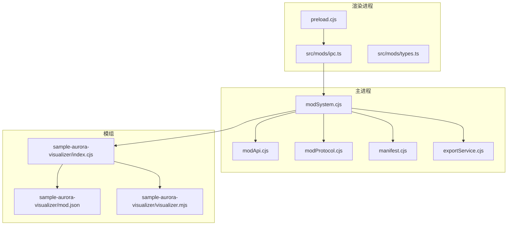
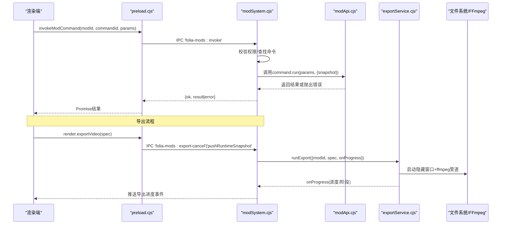
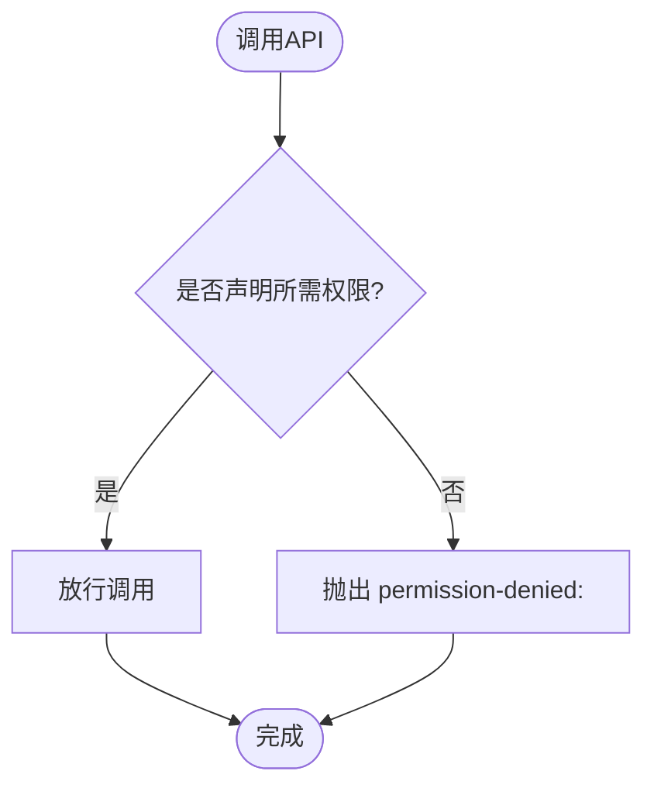
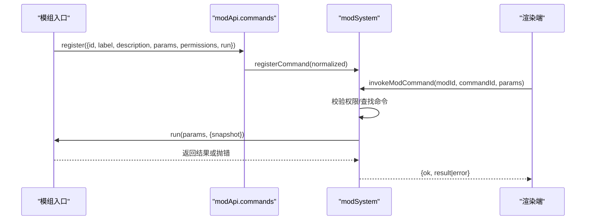
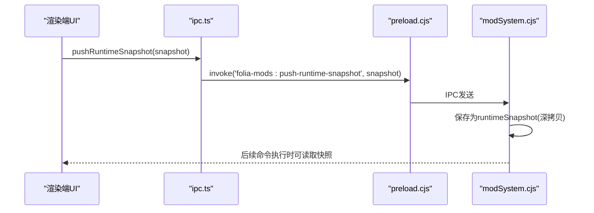
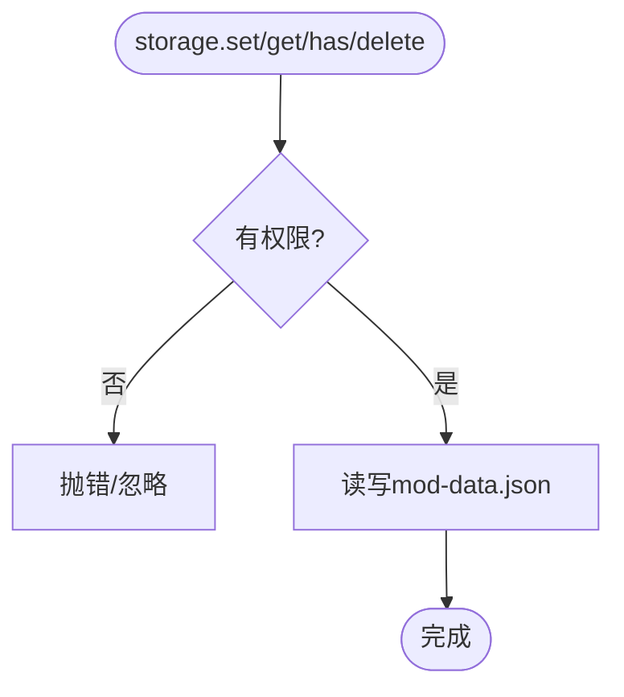
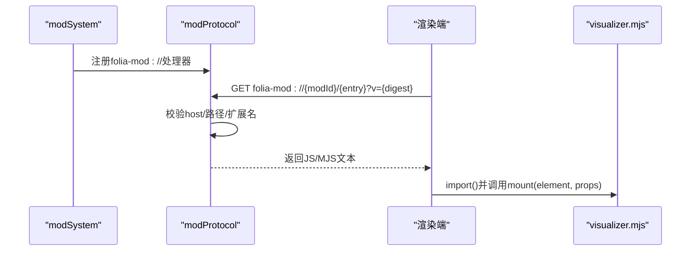
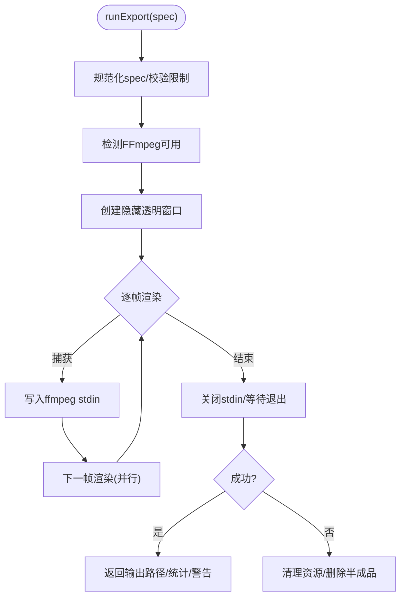
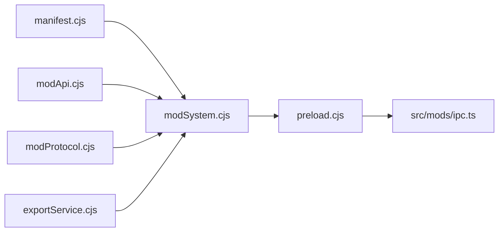

# API接口设计

<cite>
**本文引用的文件**
- [electron/modSystem/modApi.cjs](file://electron/modSystem/modApi.cjs)
- [electron/modSystem/modProtocol.cjs](file://electron/modSystem/modProtocol.cjs)
- [electron/modSystem/modSystem.cjs](file://electron/modSystem/modSystem.cjs)
- [electron/modSystem/manifest.cjs](file://electron/modSystem/manifest.cjs)
- [electron/modSystem/exportService.cjs](file://electron/modSystem/exportService.cjs)
- [electron/preload.cjs](file://electron/preload.cjs)
- [src/mods/ipc.ts](file://src/mods/ipc.ts)
- [src/mods/types.ts](file://src/mods/types.ts)
- [mods/sample-aurora-visualizer/index.cjs](file://mods/sample-aurora-visualizer/index.cjs)
- [mods/sample-aurora-visualizer/mod.json](file://mods/sample-aurora-visualizer/mod.json)
- [mods/sample-aurora-visualizer/visualizer.mjs](file://mods/sample-aurora-visualizer/visualizer.mjs)
</cite>

## 目录
1. [简介](#简介)
2. [项目结构](#项目结构)
3. [核心组件](#核心组件)
4. [架构总览](#架构总览)
5. [详细组件分析](#详细组件分析)
6. [依赖关系分析](#依赖关系分析)
7. [性能与稳定性](#性能与稳定性)
8. [故障排查指南](#故障排查指南)
9. [结论](#结论)
10. [附录：API参考与示例](#附录api参考与示例)

## 简介
本文件面向Folia Player的模组（Mod）系统，系统化阐述其API设计原则、权限模型、命令注册、事件处理、数据交换、异步模型、与宿主应用的集成方式，以及内置能力（文件系统访问、网络代理、UI贡献、音视频导出等）。文档同时提供完整的API参考与使用示例路径，帮助开发者快速构建安全、可维护且高性能的模组。

## 项目结构
Folia的模组系统由主进程加载器、渲染侧IPC桥、类型契约和示例模组组成：
- 主进程加载器负责发现、校验、信任确认、依赖解析、激活与卸载模组，并通过IPC暴露能力给渲染端。
- 渲染端通过预加载脚本暴露安全的IPC方法，供面板调用。
- 类型契约保证跨IPC边界的序列化数据结构一致。
- 示例模组演示了命令注册、可视化贡献、日志输出等能力。

图表来源
- [electron/modSystem/modSystem.cjs:1-120](file://electron/modSystem/modSystem.cjs#L1-L120)
- [electron/modSystem/modApi.cjs:1-164](file://electron/modSystem/modApi.cjs#L1-L164)
- [electron/modSystem/modProtocol.cjs:1-95](file://electron/modSystem/modProtocol.cjs#L1-L95)
- [electron/modSystem/manifest.cjs:1-200](file://electron/modSystem/manifest.cjs#L1-L200)
- [electron/modSystem/exportService.cjs:1-120](file://electron/modSystem/exportService.cjs#L1-L120)
- [electron/preload.cjs:293-319](file://electron/preload.cjs#L293-L319)
- [src/mods/ipc.ts:1-119](file://src/mods/ipc.ts#L1-L119)
- [src/mods/types.ts:1-157](file://src/mods/types.ts#L1-L157)
- [mods/sample-aurora-visualizer/index.cjs:1-10](file://mods/sample-aurora-visualizer/index.cjs#L1-L10)
- [mods/sample-aurora-visualizer/mod.json:1-19](file://mods/sample-aurora-visualizer/mod.json#L1-L19)
- [mods/sample-aurora-visualizer/visualizer.mjs:1-81](file://mods/sample-aurora-visualizer/visualizer.mjs#L1-L81)

章节来源
- [electron/modSystem/modSystem.cjs:1-120](file://electron/modSystem/modSystem.cjs#L1-L120)
- [electron/preload.cjs:293-319](file://electron/preload.cjs#L293-L319)
- [src/mods/ipc.ts:1-119](file://src/mods/ipc.ts#L1-L119)
- [src/mods/types.ts:1-157](file://src/mods/types.ts#L1-L157)

## 核心组件
- 模组API（modApi.cjs）：注入到模组入口的最小能力集，包含日志、私有存储、生命周期钩子、运行时快照读取、命令注册、渲染导出等。所有敏感能力均受权限门控。
- 协议服务（modProtocol.cjs）：提供只读的自定义协议folia-mod://，用于在渲染端动态导入浏览器侧的可视化贡献模块，严格限制路径与扩展名。
- 模组系统（modSystem.cjs）：发现模组、校验清单、计算内容指纹、用户信任确认、依赖图解析、激活/卸载、IPC桥接、状态推送、FFmpeg状态查询等。
- 清单与依赖（manifest.cjs）：声明式校验mod.json，支持依赖版本范围、权限白名单、可视化贡献项规范化。
- 导出服务（exportService.cjs）：基于离屏透明窗口驱动可视化渲染，按帧捕获并管道化至ffmpeg生成带透明通道的视频，支持取消与进度回调。
- 渲染IPC桥（preload.cjs + ipc.ts）：将主进程能力以类型安全的方式暴露给渲染端，并提供订阅事件（状态变更、导出进度、日志）。

章节来源
- [electron/modSystem/modApi.cjs:1-164](file://electron/modSystem/modApi.cjs#L1-L164)
- [electron/modSystem/modProtocol.cjs:1-95](file://electron/modSystem/modProtocol.cjs#L1-L95)
- [electron/modSystem/modSystem.cjs:1-200](file://electron/modSystem/modSystem.cjs#L1-L200)
- [electron/modSystem/manifest.cjs:1-200](file://electron/modSystem/manifest.cjs#L1-L200)
- [electron/modSystem/exportService.cjs:1-200](file://electron/modSystem/exportService.cjs#L1-L200)
- [electron/preload.cjs:293-319](file://electron/preload.cjs#L293-L319)
- [src/mods/ipc.ts:1-119](file://src/mods/ipc.ts#L1-L119)

## 架构总览
下图展示了从渲染端发起操作到主进程执行、再回推事件/状态的完整链路，包括命令执行、导出流程与可视化贡献加载。

图表来源
- [electron/preload.cjs:293-319](file://electron/preload.cjs#L293-L319)
- [src/mods/ipc.ts:69-78](file://src/mods/ipc.ts#L69-L78)
- [electron/modSystem/modSystem.cjs:664-689](file://electron/modSystem/modSystem.cjs#L664-L689)
- [electron/modSystem/modApi.cjs:136-160](file://electron/modSystem/modApi.cjs#L136-L160)
- [electron/modSystem/exportService.cjs:171-416](file://electron/modSystem/exportService.cjs#L171-L416)

## 详细组件分析

### 权限系统与访问控制
- 权限白名单：仅允许已声明的权限，未知权限在清单校验阶段即被拒绝。
- 最小权限原则：每个API族需要显式权限，未声明则调用时抛出“permission-denied”错误。
- 运行时检查：命令执行前会再次校验命令级权限是否包含于清单；导出能力需额外render.export权限。
- 信任绑定：启用模组需用户确认，并将确认与内容指纹绑定；文件变化后自动失效，需重新确认。

图表来源
- [electron/modSystem/manifest.cjs:9-16](file://electron/modSystem/manifest.cjs#L9-L16)
- [electron/modSystem/modApi.cjs:39-43](file://electron/modSystem/modApi.cjs#L39-L43)
- [electron/modSystem/modSystem.cjs:676-681](file://electron/modSystem/modSystem.cjs#L676-L681)

章节来源
- [electron/modSystem/manifest.cjs:9-16](file://electron/modSystem/manifest.cjs#L9-L16)
- [electron/modSystem/modApi.cjs:39-43](file://electron/modSystem/modApi.cjs#L39-L43)
- [electron/modSystem/modSystem.cjs:676-681](file://electron/modSystem/modSystem.cjs#L676-L681)

### 命令注册与执行
- 注册：模组通过api.commands.register声明命令ID、标签、描述、参数Schema与命令级权限。
- 执行：渲染端通过IPC调用主进程，主进程校验命令存在性与权限后执行run函数，并传入运行时快照。
- 错误：命令执行异常会被记录并返回统一错误格式。

图表来源
- [electron/modSystem/modApi.cjs:136-151](file://electron/modSystem/modApi.cjs#L136-L151)
- [electron/modSystem/modSystem.cjs:218-223](file://electron/modSystem/modSystem.cjs#L218-L223)
- [electron/modSystem/modSystem.cjs:664-689](file://electron/modSystem/modSystem.cjs#L664-L689)
- [src/mods/ipc.ts:69-78](file://src/mods/ipc.ts#L69-L78)

章节来源
- [electron/modSystem/modApi.cjs:136-151](file://electron/modSystem/modApi.cjs#L136-L151)
- [electron/modSystem/modSystem.cjs:218-223](file://electron/modSystem/modSystem.cjs#L218-L223)
- [electron/modSystem/modSystem.cjs:664-689](file://electron/modSystem/modSystem.cjs#L664-L689)
- [src/mods/ipc.ts:69-78](file://src/mods/ipc.ts#L69-L78)

### 数据交换与运行时快照
- 运行时快照：渲染端定期推送当前播放上下文（歌曲、歌词、主题、可视化模式等），主进程将其克隆后提供给命令执行时的只读快照。
- 类型契约：跨IPC的数据均为纯JSON兼容结构，避免引用传递与副作用。

图表来源
- [src/mods/types.ts:142-157](file://src/mods/types.ts#L142-L157)
- [electron/preload.cjs:299-299](file://electron/preload.cjs#L299-L299)
- [electron/modSystem/modSystem.cjs:206-212](file://electron/modSystem/modSystem.cjs#L206-L212)
- [electron/modSystem/modSystem.cjs:683-683](file://electron/modSystem/modSystem.cjs#L683-L683)

章节来源
- [src/mods/types.ts:142-157](file://src/mods/types.ts#L142-L157)
- [electron/modSystem/modSystem.cjs:206-212](file://electron/modSystem/modSystem.cjs#L206-L212)
- [electron/modSystem/modSystem.cjs:683-683](file://electron/modSystem/modSystem.cjs#L683-L683)

### 文件系统访问与持久化
- 每模组私有存储：位于userData下的mods-data/{modId}/mod-data.json，读写失败降级为null/抛错，不污染加载器状态。
- 权限：需要filesystem.data权限，键必须为非空字符串，值进行深拷贝隔离。

图表来源
- [electron/modSystem/modApi.cjs:56-105](file://electron/modSystem/modApi.cjs#L56-L105)
- [electron/modSystem/modApi.cjs:74-103](file://electron/modSystem/modApi.cjs#L74-L103)

章节来源
- [electron/modSystem/modApi.cjs:56-105](file://electron/modSystem/modApi.cjs#L56-L105)

### 网络请求与代理
- 渲染端可通过预加载暴露的网络代理能力（如歌词代理）发起受限的网络请求，具体能力由preload中暴露的方法决定。
- 模组本身不直接持有Node网络栈，应通过宿主提供的IPC能力或渲染侧工具进行网络交互。

章节来源
- [electron/preload.cjs:117-118](file://electron/preload.cjs#L117-L118)

### UI集成与可视化贡献
- 可视化贡献：通过mod.json声明visualizers，渲染端通过folia-mod://协议按需加载浏览器端ESM模块，实现全屏歌词动画等效果。
- 协议安全：仅允许GET、限定扩展名、禁止路径穿越与绝对路径，确保只读与白名单访问。

图表来源
- [electron/modSystem/modProtocol.cjs:51-91](file://electron/modSystem/modProtocol.cjs#L51-L91)
- [mods/sample-aurora-visualizer/visualizer.mjs:8-81](file://mods/sample-aurora-visualizer/visualizer.mjs#L8-L81)
- [electron/modSystem/modSystem.cjs:333-337](file://electron/modSystem/modSystem.cjs#L333-L337)

章节来源
- [electron/modSystem/modProtocol.cjs:51-91](file://electron/modSystem/modProtocol.cjs#L51-L91)
- [mods/sample-aurora-visualizer/visualizer.mjs:8-81](file://mods/sample-aurora-visualizer/visualizer.mjs#L8-L81)
- [electron/modSystem/modSystem.cjs:333-337](file://electron/modSystem/modSystem.cjs#L333-L337)

### 音频处理与视频导出
- 导出服务：创建离屏透明窗口驱动可视化渲染，逐帧捕获像素流并写入ffmpeg进程，生成MOV(VP9或ProRes)视频。
- 安全与限制：尺寸、帧率、时长上限校验；平台差异提示（Alpha通道保障仅在Windows稳定）；支持取消与进度回调。
- 资源清理：成功/失败/取消均确保销毁窗口与进程，删除未完成输出。

图表来源
- [electron/modSystem/exportService.cjs:50-115](file://electron/modSystem/exportService.cjs#L50-L115)
- [electron/modSystem/exportService.cjs:171-416](file://electron/modSystem/exportService.cjs#L171-L416)
- [electron/modSystem/exportService.cjs:475-501](file://electron/modSystem/exportService.cjs#L475-L501)

章节来源
- [electron/modSystem/exportService.cjs:50-115](file://electron/modSystem/exportService.cjs#L50-L115)
- [electron/modSystem/exportService.cjs:171-416](file://electron/modSystem/exportService.cjs#L171-L416)
- [electron/modSystem/exportService.cjs:475-501](file://electron/modSystem/exportService.cjs#L475-L501)

### 异步编程模型
- 命令执行：run可为同步或异步，主进程await执行结果，错误统一序列化返回。
- 导出流程：基于Promise链路与事件回调（onProgress）组合，支持取消信号与超时保护（页面就绪等待）。
- 错误处理：所有关键路径均有try/catch与兜底清理，保证崩溃隔离与资源释放。

章节来源
- [electron/modSystem/modSystem.cjs:682-689](file://electron/modSystem/modSystem.cjs#L682-L689)
- [electron/modSystem/exportService.cjs:126-140](file://electron/modSystem/exportService.cjs#L126-L140)
- [electron/modSystem/exportService.cjs:402-416](file://electron/modSystem/exportService.cjs#L402-L416)

### 与宿主应用的集成
- IPC通信：通过preload暴露的window.electron.mods对象，封装list/setEnabled/reload/invoke/pushRuntimeSnapshot等。
- 状态同步：主进程主动推送状态变更、导出进度、日志事件，渲染端订阅并更新UI。
- 事件监听：提供统一的onXxx订阅接口，返回取消订阅函数，避免内存泄漏。

章节来源
- [electron/preload.cjs:293-319](file://electron/preload.cjs#L293-L319)
- [src/mods/ipc.ts:110-117](file://src/mods/ipc.ts#L110-L117)
- [electron/modSystem/modSystem.cjs:187-198](file://electron/modSystem/modSystem.cjs#L187-L198)

## 依赖关系分析
- 清单校验与依赖解析：manifest.cjs定义已知权限集合、依赖解析规则（id@^x.y.z）、可视化贡献规范化。
- 加载计划：modSystem.cjs根据enabled mods构建依赖图，失败隔离，避免单点故障影响全局。
- 协议与导出：modProtocol.cjs与exportService.cjs分别承担可视化贡献加载与离线渲染导出，二者均对输入做严格校验。

图表来源
- [electron/modSystem/manifest.cjs:216-295](file://electron/modSystem/manifest.cjs#L216-L295)
- [electron/modSystem/modSystem.cjs:490-596](file://electron/modSystem/modSystem.cjs#L490-L596)
- [electron/modSystem/modProtocol.cjs:51-91](file://electron/modSystem/modProtocol.cjs#L51-L91)
- [electron/modSystem/exportService.cjs:171-416](file://electron/modSystem/exportService.cjs#L171-L416)

章节来源
- [electron/modSystem/manifest.cjs:216-295](file://electron/modSystem/manifest.cjs#L216-L295)
- [electron/modSystem/modSystem.cjs:490-596](file://electron/modSystem/modSystem.cjs#L490-L596)

## 性能与稳定性
- 模块化隔离：每个模组在独立错误边界内运行，失败不影响其他模组与宿主。
- 缓存清理：重载时清除模组相关require.cache，避免旧代码残留。
- 导出优化：采用原始像素流直写ffmpeg，避免PNG编解码开销；并发渲染与写入重叠，提升吞吐。
- 资源回收：导出会话结束时确保销毁窗口、终止进程、清理半成品文件。

章节来源
- [electron/modSystem/modSystem.cjs:117-126](file://electron/modSystem/modSystem.cjs#L117-L126)
- [electron/modSystem/exportService.cjs:191-214](file://electron/modSystem/exportService.cjs#L191-L214)
- [electron/modSystem/exportService.cjs:475-501](file://electron/modSystem/exportService.cjs#L475-L501)

## 故障排查指南
- 权限不足：检查mod.json的permissions是否包含所需权限；命令执行失败时会返回permission-denied:xxx。
- 清单无效：查看discovery阶段的validationErrors，修正id/name/version/entry/depends/permissions等字段。
- 信任过期：当模组文件变更后trustStale为true，需重新启用确认。
- 导出失败：检查FFmpeg可用性、平台Alpha通道支持、spec尺寸/帧率/时长是否在限制范围内；关注导出进度中的错误消息。
- 可视化贡献无法加载：确认visualizers.entry为相对路径且扩展名为.js/.mjs，且拥有visualizer.register权限。

章节来源
- [electron/modSystem/modSystem.cjs:604-662](file://electron/modSystem/modSystem.cjs#L604-L662)
- [electron/modSystem/modSystem.cjs:411-456](file://electron/modSystem/modSystem.cjs#L411-L456)
- [electron/modSystem/exportService.cjs:50-115](file://electron/modSystem/exportService.cjs#L50-L115)
- [electron/modSystem/modProtocol.cjs:64-77](file://electron/modSystem/modProtocol.cjs#L64-L77)

## 结论
Folia的模组API以“最小权限、强校验、可观测、可恢复”为核心设计原则，通过清单声明、运行时权限门控、信任绑定与错误隔离，确保第三方代码在可控范围内扩展宿主能力。命令注册、事件总线、数据快照与导出管线提供了丰富的扩展点，配合类型契约与IPC桥，使开发体验与安全边界得到平衡。

## 附录：API参考与示例

### 模组清单（mod.json）关键字段
- id/name/version/apiVersion/author/description/entry/depends/permissions/visualizers
- 权限集合：filesystem.data、render.export、runtime.playback、visualizer.register

章节来源
- [electron/modSystem/manifest.cjs:9-16](file://electron/modSystem/manifest.cjs#L9-L16)
- [mods/sample-aurora-visualizer/mod.json:1-19](file://mods/sample-aurora-visualizer/mod.json#L1-L19)

### 模组入口（index.cjs）
- 接收api对象，可调用log、storage、lifecycle、commands、render等能力
- 示例：打印日志、注册命令、声明可视化贡献

章节来源
- [mods/sample-aurora-visualizer/index.cjs:1-10](file://mods/sample-aurora-visualizer/index.cjs#L1-L10)
- [electron/modSystem/modApi.cjs:107-160](file://electron/modSystem/modApi.cjs#L107-L160)

### 命令注册与调用
- 注册：api.commands.register({id, label, description, params, permissions, run})
- 调用：渲染端通过ipc.invokeModCommand(modId, commandId, params)

章节来源
- [electron/modSystem/modApi.cjs:136-151](file://electron/modSystem/modApi.cjs#L136-L151)
- [src/mods/ipc.ts:69-78](file://src/mods/ipc.ts#L69-L78)

### 运行时快照推送
- 渲染端周期性推送当前播放上下文，供命令读取只读快照

章节来源
- [src/mods/types.ts:142-157](file://src/mods/types.ts#L142-L157)
- [electron/preload.cjs:299-299](file://electron/preload.cjs#L299-L299)

### 可视化贡献（visualizer.mjs）
- 导出默认对象，实现mount(element, props)，返回清理函数
- 通过currentTime.on('change')响应时间推进

章节来源
- [mods/sample-aurora-visualizer/visualizer.mjs:8-81](file://mods/sample-aurora-visualizer/visualizer.mjs#L8-L81)

### 导出API（render.exportVideo）
- 入参：width/height/fps/startSec/endSec/lyricData/theme/visualizerMode/visualizerTunings/outputPath等
- 行为：校验限制、启动隐藏窗口与ffmpeg、逐帧渲染与写入、进度回调、取消与清理

章节来源
- [electron/modSystem/modApi.cjs:158-160](file://electron/modSystem/modApi.cjs#L158-L160)
- [electron/modSystem/exportService.cjs:50-115](file://electron/modSystem/exportService.cjs#L50-L115)
- [electron/modSystem/exportService.cjs:171-416](file://electron/modSystem/exportService.cjs#L171-L416)

### 事件订阅
- 状态变更：subscribeModsState(callback)
- 导出进度：subscribeExportProgress(callback)
- 日志：subscribeModLogs(callback)

章节来源
- [src/mods/ipc.ts:110-117](file://src/mods/ipc.ts#L110-L117)
- [electron/preload.cjs:303-317](file://electron/preload.cjs#L303-L317)