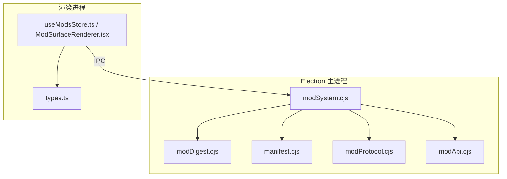
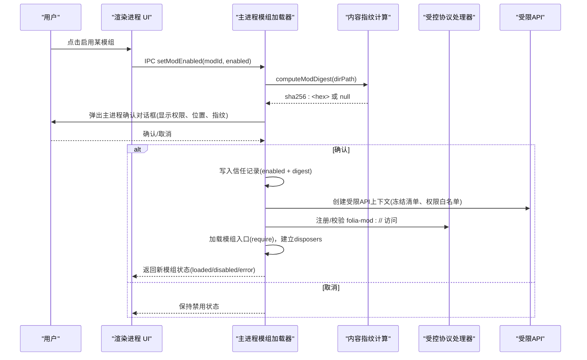
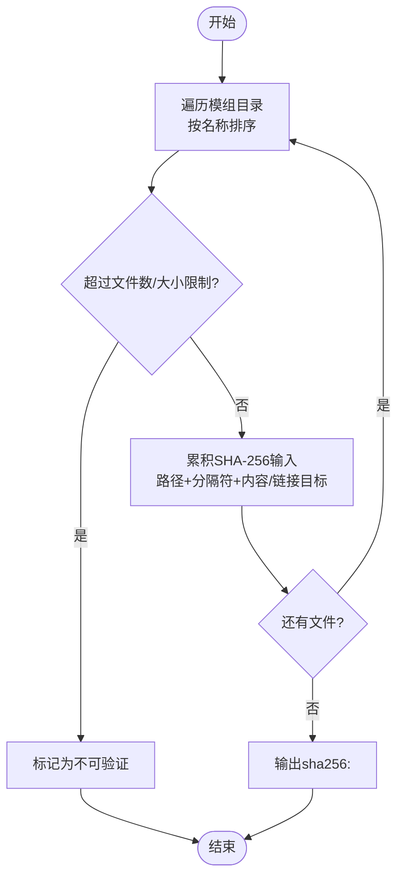
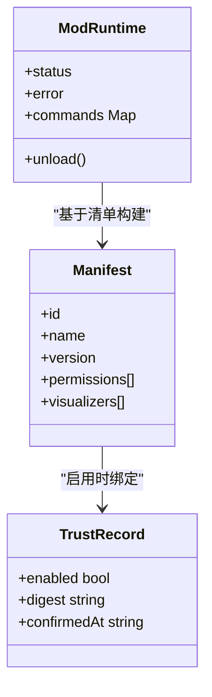
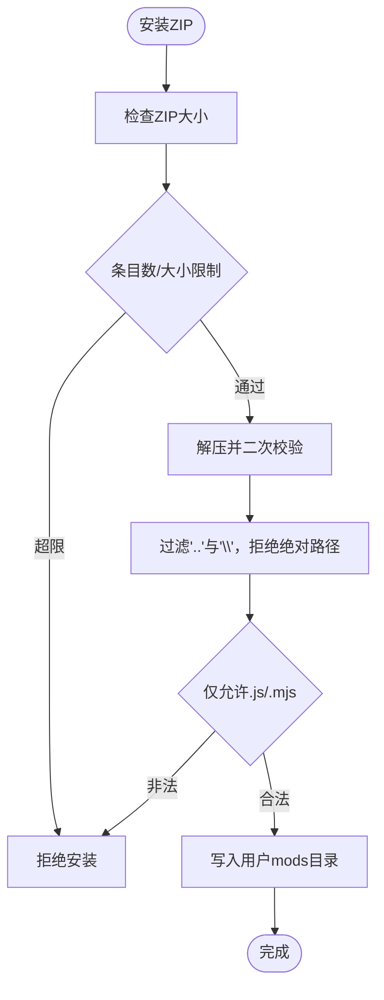
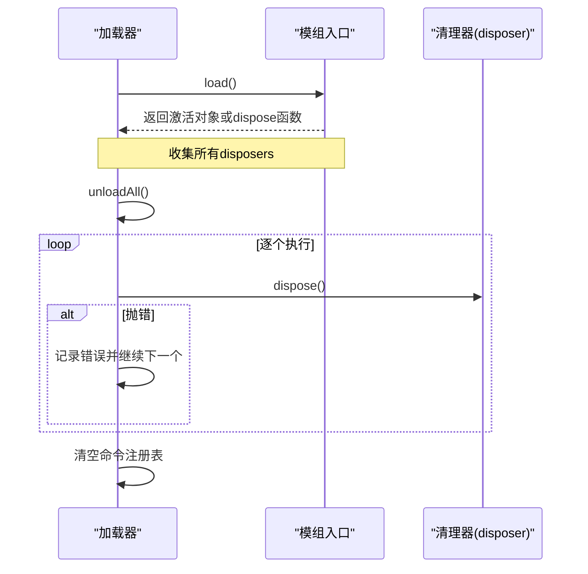
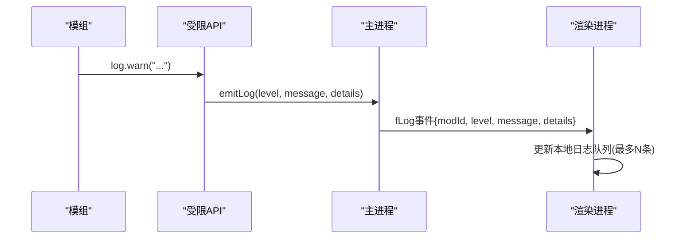
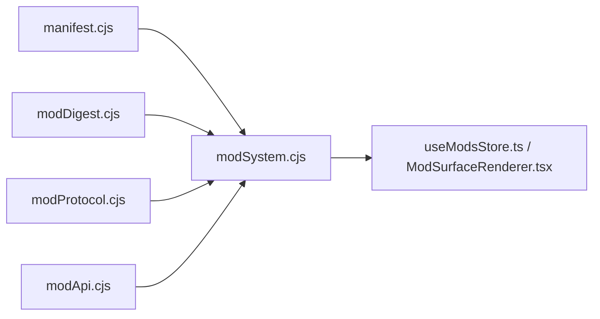

# 安全机制设计

<cite>
**本文引用的文件**
- [electron/modSystem/modSystem.cjs](file://electron/modSystem/modSystem.cjs)
- [electron/modSystem/modDigest.cjs](file://electron/modSystem/modDigest.cjs)
- [electron/modSystem/manifest.cjs](file://electron/modSystem/manifest.cjs)
- [electron/modSystem/modProtocol.cjs](file://electron/modSystem/modProtocol.cjs)
- [electron/modSystem/modApi.cjs](file://electron/modSystem/modApi.cjs)
- [src/mods/types.ts](file://src/mods/types.ts)
- [src/mods/useModsStore.ts](file://src/mods/useModsStore.ts)
- [src/mods/ModSurfaceRenderer.tsx](file://src/mods/ModSurfaceRenderer.tsx)
- [src/components/shared/ErrorBoundary.tsx](file://src/components/shared/ErrorBoundary.tsx)
</cite>

## 目录
1. [简介](#简介)
2. [项目结构](#项目结构)
3. [核心组件](#核心组件)
4. [架构总览](#架构总览)
5. [详细组件分析](#详细组件分析)
6. [依赖关系分析](#依赖关系分析)
7. [性能考量](#性能考量)
8. [故障排查指南](#故障排查指南)
9. [结论](#结论)
10. [附录：安全配置与最佳实践](#附录：安全配置与最佳实践)

## 简介
本文件系统性阐述 Folia Player 模组系统的安全机制，覆盖内容指纹验证、信任模型与安全边界、防攻击设计（ZIP 炸弹、路径遍历、文件大小限制）、错误隔离策略（异常捕获、资源清理、内存泄漏防护），以及安全审计与日志记录。文档同时提供可操作的安全配置示例与最佳实践建议，帮助开发者与用户安全地安装、启用和运行第三方模组。

## 项目结构
模组安全相关代码主要分布在 Electron 主进程模块与渲染进程 UI 层：
- 主进程侧负责模组发现、清单校验、依赖解析、内容哈希计算、权限检查、安装保护、协议访问控制、运行时加载与卸载、日志上报等。
- 渲染进程侧负责展示模组状态、命令面板、导出进度、日志流，并通过 IPC 与主进程交互，所有敏感操作均回落到主进程执行。

**图表来源**
- [electron/modSystem/modSystem.cjs:1-120](file://electron/modSystem/modSystem.cjs#L1-L120)
- [electron/modSystem/modDigest.cjs:1-99](file://electron/modSystem/modDigest.cjs#L1-L99)
- [electron/modSystem/manifest.cjs:1-60](file://electron/modSystem/manifest.cjs#L1-L60)
- [electron/modSystem/modProtocol.cjs:1-36](file://electron/modSystem/modProtocol.cjs#L1-L36)
- [electron/modSystem/modApi.cjs:1-44](file://electron/modSystem/modApi.cjs#L1-L44)
- [src/mods/useModsStore.ts:1-55](file://src/mods/useModsStore.ts#L1-L55)
- [src/mods/ModSurfaceRenderer.tsx:1-30](file://src/mods/ModSurfaceRenderer.tsx#L1-L30)
- [src/mods/types.ts:1-20](file://src/mods/types.ts#L1-L20)

**章节来源**
- [electron/modSystem/modSystem.cjs:1-120](file://electron/modSystem/modSystem.cjs#L1-L120)
- [electron/modSystem/modDigest.cjs:1-99](file://electron/modSystem/modDigest.cjs#L1-L99)
- [electron/modSystem/manifest.cjs:1-60](file://electron/modSystem/manifest.cjs#L1-L60)
- [electron/modSystem/modProtocol.cjs:1-36](file://electron/modSystem/modProtocol.cjs#L1-L36)
- [electron/modSystem/modApi.cjs:1-44](file://electron/modSystem/modApi.cjs#L1-L44)
- [src/mods/useModsStore.ts:1-55](file://src/mods/useModsStore.ts#L1-L55)
- [src/mods/ModSurfaceRenderer.tsx:1-30](file://src/mods/ModSurfaceRenderer.tsx#L1-L30)
- [src/mods/types.ts:1-20](file://src/mods/types.ts#L1-L20)

## 核心组件
- 模组加载器与生命周期管理：负责发现模组、校验清单、计算内容指纹、依赖解析、启用确认、加载/卸载、命令路由、导出服务桥接、日志上报。
- 内容指纹计算：对模组目录进行确定性遍历与哈希，绑定“启用”决策到具体字节集，变更即失效。
- 清单与依赖解析：严格校验 mod.json 字段、权限白名单、依赖版本范围、可视化贡献项合法性。
- 受控协议访问：通过自定义协议仅允许读取已验证模组的 JS/ESM 贡献文件，并做路径白名单与类型限制。
- 受限 API 注入：向模组暴露最小能力集合，按声明权限逐项放行，越权调用直接拒绝。
- 渲染进程状态与交互：维护模组列表、命令面板、导出进度、日志流，所有写操作经 IPC 交由主进程处理。

**章节来源**
- [electron/modSystem/modSystem.cjs:135-280](file://electron/modSystem/modSystem.cjs#L135-L280)
- [electron/modSystem/modDigest.cjs:28-99](file://electron/modSystem/modDigest.cjs#L28-L99)
- [electron/modSystem/manifest.cjs:136-201](file://electron/modSystem/manifest.cjs#L136-L201)
- [electron/modSystem/modProtocol.cjs:51-95](file://electron/modSystem/modProtocol.cjs#L51-L95)
- [electron/modSystem/modApi.cjs:31-164](file://electron/modSystem/modApi.cjs#L31-L164)
- [src/mods/useModsStore.ts:58-156](file://src/mods/useModsStore.ts#L58-L156)

## 架构总览
下图展示了从用户启用模组到其代码在受限环境中运行的完整流程，包括信任确认、内容指纹校验、权限检查与错误隔离。

**图表来源**
- [electron/modSystem/modSystem.cjs:604-662](file://electron/modSystem/modSystem.cjs#L604-L662)
- [electron/modSystem/modDigest.cjs:67-99](file://electron/modSystem/modDigest.cjs#L67-L99)
- [electron/modSystem/modProtocol.cjs:51-95](file://electron/modSystem/modProtocol.cjs#L51-L95)
- [electron/modSystem/modApi.cjs:31-164](file://electron/modSystem/modApi.cjs#L31-L164)

## 详细组件分析

### 内容指纹验证算法
- 遍历策略：深度优先、按名称排序，确保确定性；符号链接不跟随，仅记录目标字符串，避免循环与越界。
- 大小与数量限制：文件数与总字节上限，超限则判定为不可验证，阻止潜在 DoS。
- 哈希构造：将相对路径与文件内容（或链接目标）交替输入 SHA-256，生成稳定指纹；短指纹用于 URL 版本化，防止浏览器缓存旧代码。
- 信任绑定：启用决策绑定到该指纹；任何文件变更导致指纹变化，自动撤销信任并要求重新确认。

**图表来源**
- [electron/modSystem/modDigest.cjs:28-99](file://electron/modSystem/modDigest.cjs#L28-L99)

**章节来源**
- [electron/modSystem/modDigest.cjs:14-99](file://electron/modSystem/modDigest.cjs#L14-L99)
- [electron/modSystem/modSystem.cjs:321-331](file://electron/modSystem/modSystem.cjs#L321-L331)

### 信任模型与安全边界
- 信任锚点：用户在主进程对话框中确认启用，且确认绑定到当前内容的指纹；若后续文件变更，信任自动失效。
- 安全边界：仅在主进程进行启用确认与持久化；渲染进程无法伪造或绕过此流程。
- 权限声明：清单中的 permissions 白名单决定可用能力；未声明的权限一律拒绝。
- 运行时权限检查：每个 API 调用前校验声明权限，越权抛出统一错误格式，便于前端呈现。

**图表来源**
- [electron/modSystem/manifest.cjs:136-201](file://electron/modSystem/manifest.cjs#L136-L201)
- [electron/modSystem/modSystem.cjs:287-331](file://electron/modSystem/modSystem.cjs#L287-L331)
- [electron/modSystem/modSystem.cjs:200-280](file://electron/modSystem/modSystem.cjs#L200-L280)

**章节来源**
- [electron/modSystem/modSystem.cjs:287-331](file://electron/modSystem/modSystem.cjs#L287-L331)
- [electron/modSystem/modApi.cjs:31-44](file://electron/modSystem/modApi.cjs#L31-L44)
- [src/mods/types.ts:68-86](file://src/mods/types.ts#L68-L86)

### 防攻击设计
- ZIP 炸弹防护：安装时对压缩包大小、条目数、单文件大小、解压后总大小进行多重限制；使用过滤器在解压前拒绝可疑条目，并在解压后再次校验实际字节。
- 路径遍历防护：安装阶段过滤包含“..”或反斜杠的路径，拒绝绝对路径；协议访问阶段同样校验路径段，确保只读取模组目录内文件。
- 文件类型限制：协议仅允许 .js/.mjs，其他类型返回禁止；清单中可视化入口也必须匹配相对路径与扩展名。
- 资源限制：清单名称长度限制、依赖版本范围限制、未知权限拒绝，减少滥用面。

**图表来源**
- [electron/modSystem/modSystem.cjs:43-48](file://electron/modSystem/modSystem.cjs#L43-L48)
- [electron/modSystem/modSystem.cjs:734-800](file://electron/modSystem/modSystem.cjs#L734-L800)
- [electron/modSystem/modProtocol.cjs:64-77](file://electron/modSystem/modProtocol.cjs#L64-L77)
- [electron/modSystem/manifest.cjs:118-134](file://electron/modSystem/manifest.cjs#L118-L134)

**章节来源**
- [electron/modSystem/modSystem.cjs:43-48](file://electron/modSystem/modSystem.cjs#L43-L48)
- [electron/modSystem/modSystem.cjs:734-800](file://electron/modSystem/modSystem.cjs#L734-L800)
- [electron/modSystem/modProtocol.cjs:64-77](file://electron/modSystem/modProtocol.cjs#L64-L77)
- [electron/modSystem/manifest.cjs:118-134](file://electron/modSystem/manifest.cjs#L118-L134)

### 错误隔离策略
- 每模组错误边界：加载失败仅标记该模组为 error，不影响其他模组；依赖失败仅影响相关子图。
- 资源清理：卸载时顺序执行所有 disposer（最后注册的先执行），即使某个清理函数抛错也不阻断其余清理；命令注册表清空，避免残留引用。
- 模块缓存清理：重载前清除模组目录下的 Node require.cache，确保重新执行最新代码，避免 Windows 大小写差异导致的缓存不一致。
- 前端错误边界：React ErrorBoundary 捕获渲染错误，防止整个界面崩溃，并可上报诊断信息。

**图表来源**
- [electron/modSystem/modSystem.cjs:240-280](file://electron/modSystem/modSystem.cjs#L240-L280)
- [electron/modSystem/modSystem.cjs:476-482](file://electron/modSystem/modSystem.cjs#L476-L482)
- [src/components/shared/ErrorBoundary.tsx:20-38](file://src/components/shared/ErrorBoundary.tsx#L20-L38)

**章节来源**
- [electron/modSystem/modSystem.cjs:117-126](file://electron/modSystem/modSystem.cjs#L117-L126)
- [electron/modSystem/modSystem.cjs:240-280](file://electron/modSystem/modSystem.cjs#L240-L280)
- [electron/modSystem/modSystem.cjs:476-482](file://electron/modSystem/modSystem.cjs#L476-L482)
- [src/components/shared/ErrorBoundary.tsx:20-38](file://src/components/shared/ErrorBoundary.tsx#L20-L38)

### 安全审计与日志记录
- 主进程日志：每个模组可通过 emitLog 输出 info/warn/error，统一格式化并转发到渲染进程；错误详情序列化，避免泄露敏感堆栈。
- 渲染进程日志：订阅日志事件，保留最近 N 条，便于调试与问题定位。
- 导出进度：通过 IPC 推送进度事件，支持取消与错误提示。
- 运行时快照：渲染进程定期推送当前播放态快照，供模组命令使用，但仅传递纯数据，不包含对象引用。

**图表来源**
- [electron/modSystem/modSystem.cjs:194-198](file://electron/modSystem/modSystem.cjs#L194-L198)
- [src/mods/useModsStore.ts:145-155](file://src/mods/useModsStore.ts#L145-L155)
- [electron/modSystem/modApi.cjs:45-49](file://electron/modSystem/modApi.cjs#L45-L49)

**章节来源**
- [electron/modSystem/modSystem.cjs:194-198](file://electron/modSystem/modSystem.cjs#L194-L198)
- [src/mods/useModsStore.ts:145-155](file://src/mods/useModsStore.ts#L145-L155)
- [electron/modSystem/modApi.cjs:45-49](file://electron/modSystem/modApi.cjs#L45-L49)

## 依赖关系分析
- 清单校验与依赖解析：严格模式，未知权限与不支持的版本范围直接报错；依赖缺失或循环会隔离到对应子图，不影响全局。
- 协议访问：仅服务于已发现且已验证的模组，路径与类型双重白名单。
- 权限体系：以白名单为核心，调用点强制校验，越权即拒绝。

**图表来源**
- [electron/modSystem/modSystem.cjs:23-28](file://electron/modSystem/modSystem.cjs#L23-L28)
- [electron/modSystem/manifest.cjs:216-295](file://electron/modSystem/manifest.cjs#L216-L295)
- [electron/modSystem/modProtocol.cjs:51-95](file://electron/modSystem/modProtocol.cjs#L51-L95)
- [electron/modSystem/modApi.cjs:31-164](file://electron/modSystem/modApi.cjs#L31-L164)
- [src/mods/useModsStore.ts:1-55](file://src/mods/useModsStore.ts#L1-L55)

**章节来源**
- [electron/modSystem/manifest.cjs:216-295](file://electron/modSystem/manifest.cjs#L216-L295)
- [electron/modSystem/modProtocol.cjs:51-95](file://electron/modSystem/modProtocol.cjs#L51-L95)
- [electron/modSystem/modApi.cjs:31-164](file://electron/modSystem/modApi.cjs#L31-L164)
- [src/mods/useModsStore.ts:1-55](file://src/mods/useModsStore.ts#L1-L55)

## 性能考量
- 内容哈希限制：文件数与总大小上限避免启动时长时间阻塞；超大模组将被标记为不可验证而非静默信任。
- 协议无缓存：为开发本地模组设置 no-store，避免浏览器缓存导致旧代码被复用。
- 命令面板节流：live 参数通过短时延迟提交，降低频繁 IPC 开销。
- 日志队列限制：渲染端仅保留最近若干条日志，避免内存增长。

[本节为通用指导，不直接分析具体文件]

## 故障排查指南
- 启用失败
  - 可能原因：内容不可验证（哈希失败）、用户取消确认、依赖未启用或版本不满足。
  - 排查要点：查看模组状态与错误信息；确认清单权限与依赖；检查是否修改了模组文件导致指纹变化。
- 命令执行失败
  - 可能原因：权限不足、命令不存在、模组未加载。
  - 排查要点：检查命令声明的 permissions 是否在清单中；确认模组状态为 loaded。
- 导出中断
  - 可能原因：用户取消、渲染错误、后端失败。
  - 排查要点：关注导出进度事件与错误消息；必要时取消并重启导出。
- 日志与错误边界
  - 使用渲染端日志面板查看最近日志；若界面崩溃，检查 React ErrorBoundary 是否捕获并上报。

**章节来源**
- [electron/modSystem/modSystem.cjs:634-689](file://electron/modSystem/modSystem.cjs#L634-L689)
- [electron/modSystem/modApi.cjs:39-43](file://electron/modSystem/modApi.cjs#L39-L43)
- [src/mods/useModsStore.ts:108-128](file://src/mods/useModsStore.ts#L108-L128)
- [src/components/shared/ErrorBoundary.tsx:20-38](file://src/components/shared/ErrorBoundary.tsx#L20-L38)

## 结论
Folia Player 模组系统通过“内容指纹绑定信任”、“白名单权限”、“严格清单校验”、“受控协议访问”、“多层安装限制”、“细粒度错误隔离”与“完善日志审计”，构建了纵深防御体系。用户在启用模组时获得充分知情权，系统在运行时持续校验权限与输入，确保即使第三方代码存在恶意意图，也能被限制在最小影响范围内。

[本节为总结性内容，不直接分析具体文件]

## 附录：安全配置与最佳实践
- 清单配置
  - 仅声明必要权限；避免请求 filesystem.data、render.export、runtime.playback、visualizer.register 之外的权限。
  - 版本号遵循语义化版本；依赖范围使用 ^X.Y.Z 或 *，避免不支持的操作符。
  - 可视化入口必须为相对路径且扩展名为 .js/.mjs。
- 安装与启用
  - 安装包体积与条目数应控制在限制以内；避免包含大量小文件或超大文件。
  - 启用前务必核对弹窗显示的权限、安装位置与内容指纹；任何变更需重新确认。
- 开发与调试
  - 使用 live 参数实现实时调节时注意节流频率；合理设置 min/max/step。
  - 利用 emitLog 输出关键步骤与异常；在渲染端查看日志面板。
- 运维与监控
  - 定期检查模组状态与错误；对 dependency-failed 与 error 状态的模组进行修复或移除。
  - 关注导出进度与错误；必要时取消并重试。
- 安全加固
  - 保持模组目录整洁，避免放置非模组文件；发现异常文件立即清理。
  - 谨慎启用来自不可信来源的模组；优先选择社区认可与开源可审计的项目。

[本节为通用指导，不直接分析具体文件]