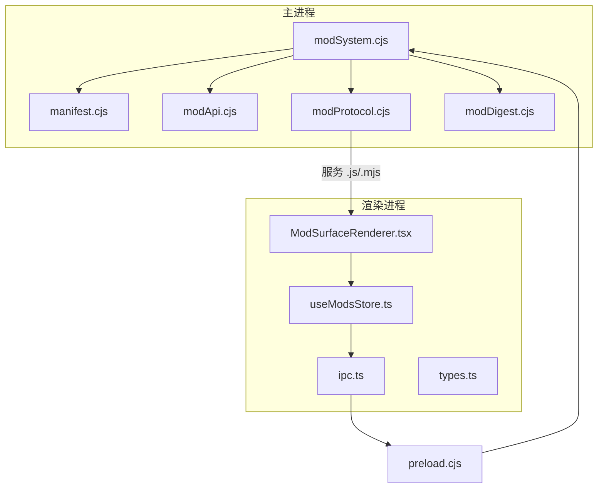
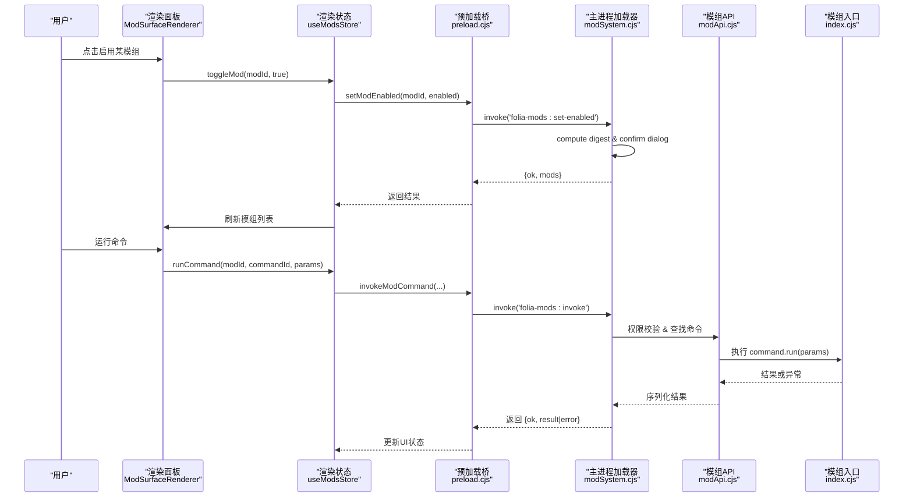
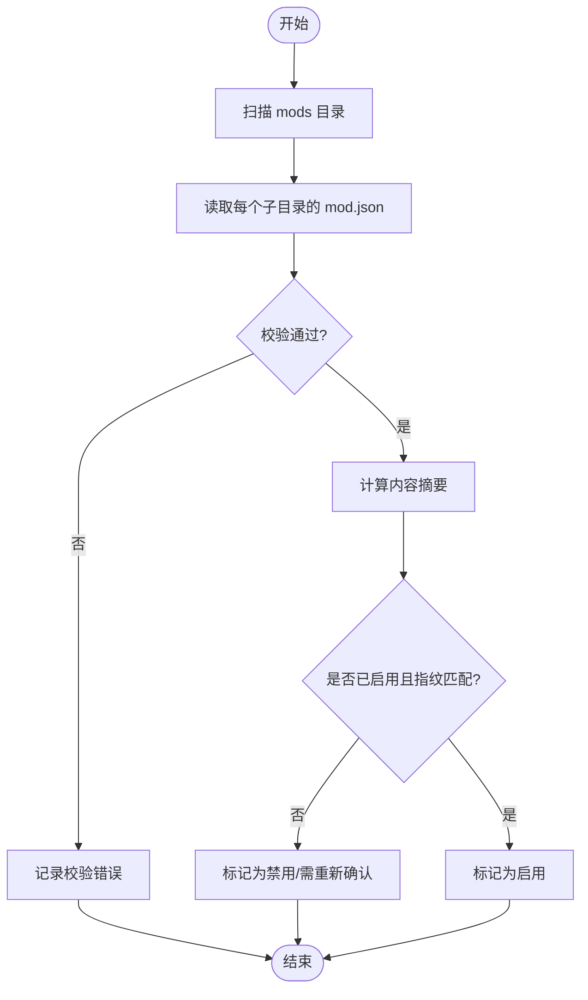
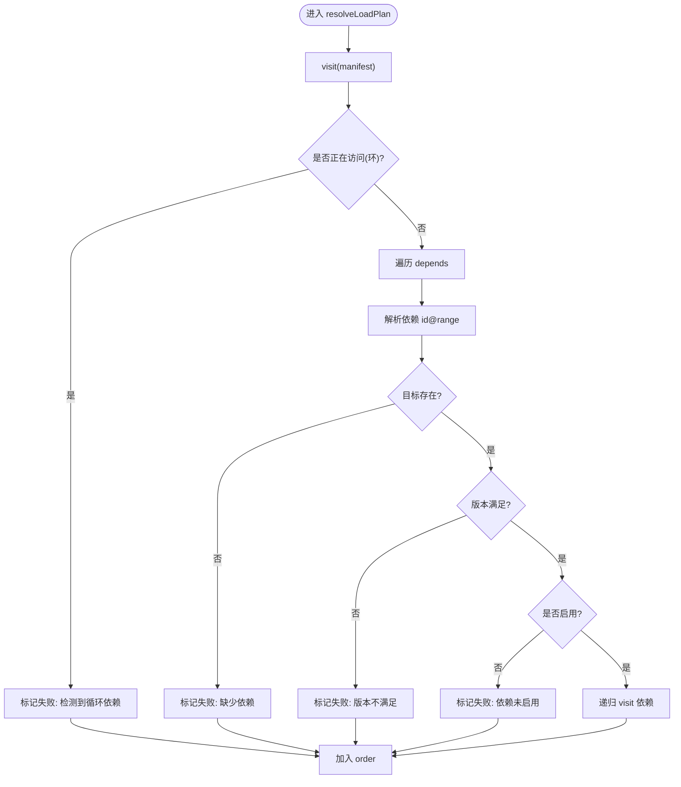
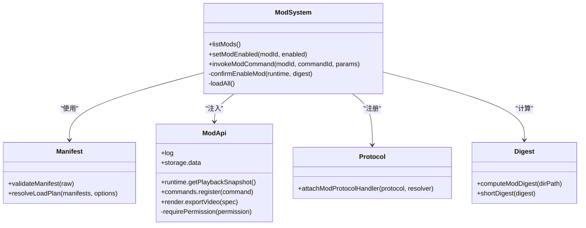
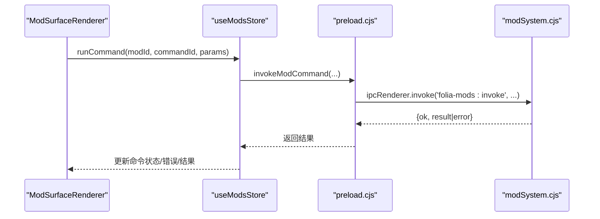
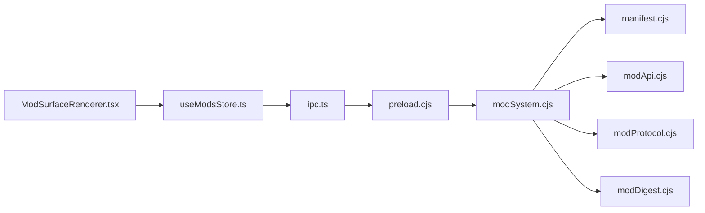

# 核心架构原理

<cite>
**本文引用的文件**
- [electron/modSystem/modSystem.cjs](file://electron/modSystem/modSystem.cjs)
- [electron/modSystem/manifest.cjs](file://electron/modSystem/manifest.cjs)
- [electron/modSystem/modApi.cjs](file://electron/modSystem/modApi.cjs)
- [electron/modSystem/modProtocol.cjs](file://electron/modSystem/modProtocol.cjs)
- [electron/modSystem/modDigest.cjs](file://electron/modSystem/modDigest.cjs)
- [src/mods/ipc.ts](file://src/mods/ipc.ts)
- [src/mods/types.ts](file://src/mods/types.ts)
- [src/mods/useModsStore.ts](file://src/mods/useModsStore.ts)
- [src/mods/ModSurfaceRenderer.tsx](file://src/mods/ModSurfaceRenderer.tsx)
- [electron/preload.cjs](file://electron/preload.cjs)
- [mods/k3panel/mod.json](file://mods/k3panel/mod.json)
- [mods/sample-aurora-visualizer/mod.json](file://mods/sample-aurora-visualizer/mod.json)
- [mods/whisper-align/mod.json](file://mods/whisper-align/mod.json)
- [mods/k3panel/index.cjs](file://mods/k3panel/index.cjs)
- [mods/sample-aurora-visualizer/index.cjs](file://mods/sample-aurora-visualizer/index.cjs)
- [mods/whisper-align/index.cjs](file://mods/whisper-align/index.cjs)
</cite>

## 目录
1. [简介](#简介)
2. [项目结构](#项目结构)
3. [核心组件](#核心组件)
4. [架构总览](#架构总览)
5. [详细组件分析](#详细组件分析)
6. [依赖关系分析](#依赖关系分析)
7. [性能考量](#性能考量)
8. [故障排查指南](#故障排查指南)
9. [结论](#结论)
10. [附录：模组开发示例](#附录模组开发示例)

## 简介
本文件系统性阐述 Folia Player 的模组系统核心架构，覆盖插件化设计、动态加载、模块发现与依赖解析、IPC 通信、状态同步、错误隔离与安全边界等关键实现。文档同时提供架构图与交互时序图，并给出基于仓库内现有模组的开发示例路径，帮助开发者快速理解并扩展模组能力。

## 项目结构
Folia 的模组系统由“主进程加载器 + 渲染进程面板 + 自定义协议”三部分构成：
- 主进程侧：modSystem 负责发现、校验、依赖解析、信任确认、生命周期管理与 IPC 桥接。
- 渲染进程侧：src/mods 提供类型定义、IPC 封装、状态管理（Zustand）与命令面板 UI。
- 协议层：folia-mod:// 安全地暴露已验证模组的浏览器端贡献（如可视化器）。

**图表来源**
- [electron/modSystem/modSystem.cjs:1-120](file://electron/modSystem/modSystem.cjs#L1-L120)
- [electron/modSystem/manifest.cjs:1-60](file://electron/modSystem/manifest.cjs#L1-L60)
- [electron/modSystem/modApi.cjs:1-40](file://electron/modSystem/modApi.cjs#L1-L40)
- [electron/modSystem/modProtocol.cjs:1-36](file://electron/modSystem/modProtocol.cjs#L1-L36)
- [electron/modSystem/modDigest.cjs:1-20](file://electron/modSystem/modDigest.cjs#L1-L20)
- [src/mods/ipc.ts:1-30](file://src/mods/ipc.ts#L1-L30)
- [src/mods/types.ts:1-20](file://src/mods/types.ts#L1-L20)
- [src/mods/useModsStore.ts:1-30](file://src/mods/useModsStore.ts#L1-L30)
- [src/mods/ModSurfaceRenderer.tsx:1-20](file://src/mods/ModSurfaceRenderer.tsx#L1-L20)
- [electron/preload.cjs:293-318](file://electron/preload.cjs#L293-L318)

**章节来源**
- [electron/modSystem/modSystem.cjs:1-120](file://electron/modSystem/modSystem.cjs#L1-L120)
- [electron/preload.cjs:293-318](file://electron/preload.cjs#L293-L318)

## 核心组件
- 模组加载器（modSystem.cjs）：扫描 mods 目录、读取并校验 mod.json、计算内容摘要、解析依赖、执行激活/卸载、维护启用信任记录、通过 IPC 暴露能力。
- 清单与依赖（manifest.cjs）：校验 mod.json 字段与权限、解析 depends 版本范围、生成可加载顺序与失败原因。
- 模组 API（modApi.cjs）：向模组暴露受限能力（日志、存储、运行时快照、导出、命令注册），按声明权限进行访问控制。
- 自定义协议（modProtocol.cjs）：以 folia-mod:// 提供只读、白名单的文件服务，仅允许已发现且已验证的模组资源。
- 内容摘要（modDigest.cjs）：对模组目录进行确定性哈希，用于绑定用户“启用”决策到具体字节集。
- 渲染侧桥接（ipc.ts / preload.cjs / useModsStore.ts / ModSurfaceRenderer.tsx）：将主进程能力以类型安全的方式暴露给 React 面板，驱动命令执行与状态同步。

**章节来源**
- [electron/modSystem/modSystem.cjs:135-280](file://electron/modSystem/modSystem.cjs#L135-L280)
- [electron/modSystem/manifest.cjs:136-201](file://electron/modSystem/manifest.cjs#L136-L201)
- [electron/modSystem/modApi.cjs:31-161](file://electron/modSystem/modApi.cjs#L31-L161)
- [electron/modSystem/modProtocol.cjs:51-93](file://electron/modSystem/modProtocol.cjs#L51-L93)
- [electron/modSystem/modDigest.cjs:67-96](file://electron/modSystem/modDigest.cjs#L67-L96)
- [src/mods/ipc.ts:26-117](file://src/mods/ipc.ts#L26-L117)
- [src/mods/useModsStore.ts:58-110](file://src/mods/useModsStore.ts#L58-L110)
- [src/mods/ModSurfaceRenderer.tsx:289-301](file://src/mods/ModSurfaceRenderer.tsx#L289-L301)

## 架构总览
下图展示从“安装/启用模组”到“渲染面板调用命令”的端到端流程，包括信任确认、依赖解析、命令执行与结果回传。

**图表来源**
- [electron/modSystem/modSystem.cjs:634-689](file://electron/modSystem/modSystem.cjs#L634-L689)
- [electron/modSystem/modApi.cjs:136-151](file://electron/modSystem/modApi.cjs#L136-L151)
- [src/mods/ipc.ts:69-74](file://src/mods/ipc.ts#L69-L74)
- [src/mods/useModsStore.ts:108-110](file://src/mods/useModsStore.ts#L108-L110)
- [electron/preload.cjs:293-318](file://electron/preload.cjs#L293-L318)

## 详细组件分析

### 模组发现与清单校验
- 目录扫描：优先使用用户数据目录下的 mods，其次包含打包资源中的 mods；跳过点号前缀目录（如 .staging）。
- 清单校验：强制 id/name/version/apiVersion/entry 等必填项；限制 name 长度；校验 depends 格式与重复；校验 permissions 白名单；规范化 visualizers 贡献。
- 重复 ID 处理：同一 ID 重复时保留所有发现项以便在面板中显示错误信息。

**图表来源**
- [electron/modSystem/modSystem.cjs:395-456](file://electron/modSystem/modSystem.cjs#L395-L456)
- [electron/modSystem/manifest.cjs:136-201](file://electron/modSystem/manifest.cjs#L136-L201)
- [electron/modSystem/modDigest.cjs:67-96](file://electron/modSystem/modDigest.cjs#L67-L96)

**章节来源**
- [electron/modSystem/modSystem.cjs:395-456](file://electron/modSystem/modSystem.cjs#L395-L456)
- [electron/modSystem/manifest.cjs:136-201](file://electron/modSystem/manifest.cjs#L136-L201)

### 依赖解析策略
- 支持 bare id 与 id@^semver 两种依赖形式；仅支持 caret 范围与通配符。
- 解析过程采用深度优先遍历，检测缺失依赖、版本不满足、循环依赖，并将失败限定在相关子图，不影响其他模组。
- 当传入 isEnabled 过滤时，仅解析被启用的模组作为根节点，避免未确认代码参与依赖链。

**图表来源**
- [electron/modSystem/manifest.cjs:216-295](file://electron/modSystem/manifest.cjs#L216-L295)

**章节来源**
- [electron/modSystem/manifest.cjs:216-295](file://electron/modSystem/manifest.cjs#L216-L295)

### 运行时环境与安全边界
- 信任模型：启用决策绑定到内容摘要；任何文件变更都会撤销信任并要求重新确认。
- 权限控制：modApi 对 storage、playback snapshot、export 等能力进行显式权限检查；命令执行前再次校验命令级权限。
- 沙箱机制：模组运行于 Node 环境但仅暴露有限 API；浏览器端可视化器通过 folia-mod:// 协议受控加载，禁止路径穿越与绝对路径。
- 资源限制：安装 zip 时限制压缩包大小、条目数、单文件大小与解压总量；内容摘要也限制最大文件数与总大小。

**图表来源**
- [electron/modSystem/modSystem.cjs:135-280](file://electron/modSystem/modSystem.cjs#L135-L280)
- [electron/modSystem/manifest.cjs:136-201](file://electron/modSystem/manifest.cjs#L136-L201)
- [electron/modSystem/modApi.cjs:31-161](file://electron/modSystem/modApi.cjs#L31-L161)
- [electron/modSystem/modProtocol.cjs:51-93](file://electron/modSystem/modProtocol.cjs#L51-L93)
- [electron/modSystem/modDigest.cjs:67-96](file://electron/modSystem/modDigest.cjs#L67-L96)

**章节来源**
- [electron/modSystem/modSystem.cjs:135-280](file://electron/modSystem/modSystem.cjs#L135-L280)
- [electron/modSystem/modApi.cjs:31-161](file://electron/modSystem/modApi.cjs#L31-L161)
- [electron/modSystem/modProtocol.cjs:51-93](file://electron/modSystem/modProtocol.cjs#L51-L93)
- [electron/modSystem/modDigest.cjs:67-96](file://electron/modSystem/modDigest.cjs#L67-L96)

### 主进程与渲染进程的通信机制
- IPC 通道：preload.cjs 将 mods 相关方法暴露到 window.electron.mods，包括 list/set/reload/invoke/export/ffmpeg/open-directory/install-zip 以及事件订阅。
- 类型契约：src/mods/types.ts 定义了跨进程传输的数据结构，确保 JSON 可序列化。
- 状态同步：useModsStore 统一拉取与监听状态变化，ModSurfaceRenderer 根据命令参数渲染表单并触发执行。
- 实时反馈：导出进度、日志、状态变更通过事件推送至渲染侧，保持 UI 一致。

**图表来源**
- [src/mods/ipc.ts:69-74](file://src/mods/ipc.ts#L69-L74)
- [electron/preload.cjs:293-318](file://electron/preload.cjs#L293-L318)
- [electron/modSystem/modSystem.cjs:664-689](file://electron/modSystem/modSystem.cjs#L664-L689)
- [src/mods/ModSurfaceRenderer.tsx:96-102](file://src/mods/ModSurfaceRenderer.tsx#L96-L102)

**章节来源**
- [src/mods/ipc.ts:26-117](file://src/mods/ipc.ts#L26-L117)
- [src/mods/types.ts:1-157](file://src/mods/types.ts#L1-L157)
- [src/mods/useModsStore.ts:58-110](file://src/mods/useModsStore.ts#L58-L110)
- [electron/preload.cjs:293-318](file://electron/preload.cjs#L293-L318)

### 模组目录结构与配置文件约定
- 目录规范：每个模组一个独立目录，包含 mod.json 与入口文件（默认 index.cjs），可选浏览器端贡献文件（如 .js/.mjs）。
- mod.json 关键字段：id、name、version、apiVersion、author、description、entry、depends、permissions、visualizers（可选）。
- 入口约定：入口必须导出一个函数 activate(api)，由加载器调用完成初始化与命令注册。

参考示例：
- [mods/k3panel/mod.json:1-11](file://mods/k3panel/mod.json#L1-L11)
- [mods/sample-aurora-visualizer/mod.json:1-19](file://mods/sample-aurora-visualizer/mod.json#L1-L19)
- [mods/whisper-align/mod.json:1-11](file://mods/whisper-align/mod.json#L1-L11)
- [mods/k3panel/index.cjs:27-50](file://mods/k3panel/index.cjs#L27-L50)
- [mods/sample-aurora-visualizer/index.cjs:8-10](file://mods/sample-aurora-visualizer/index.cjs#L8-L10)
- [mods/whisper-align/index.cjs:250-409](file://mods/whisper-align/index.cjs#L250-L409)

**章节来源**
- [mods/k3panel/mod.json:1-11](file://mods/k3panel/mod.json#L1-L11)
- [mods/sample-aurora-visualizer/mod.json:1-19](file://mods/sample-aurora-visualizer/mod.json#L1-L19)
- [mods/whisper-align/mod.json:1-11](file://mods/whisper-align/mod.json#L1-L11)
- [mods/k3panel/index.cjs:27-50](file://mods/k3panel/index.cjs#L27-L50)
- [mods/sample-aurora-visualizer/index.cjs:8-10](file://mods/sample-aurora-visualizer/index.cjs#L8-L10)
- [mods/whisper-align/index.cjs:250-409](file://mods/whisper-align/index.cjs#L250-L409)

## 依赖关系分析
- 耦合度：modSystem 强依赖 manifest、modApi、modProtocol、modDigest；渲染侧通过 preload 与 IPC 解耦。
- 直接依赖：
  - modSystem -> manifest（校验与解析）
  - modSystem -> modApi（注入能力）
  - modSystem -> modProtocol（注册协议）
  - modSystem -> modDigest（内容摘要）
  - 渲染侧 -> ipc.ts -> preload.cjs -> modSystem
- 外部依赖：Electron（dialog、protocol、ipcMain）、fflate（zip 解压）、electron-store（持久化）。

**图表来源**
- [electron/modSystem/modSystem.cjs:16-28](file://electron/modSystem/modSystem.cjs#L16-L28)
- [src/mods/ipc.ts:1-30](file://src/mods/ipc.ts#L1-L30)
- [electron/preload.cjs:293-318](file://electron/preload.cjs#L293-L318)

**章节来源**
- [electron/modSystem/modSystem.cjs:16-28](file://electron/modSystem/modSystem.cjs#L16-L28)
- [src/mods/ipc.ts:1-30](file://src/mods/ipc.ts#L1-L30)
- [electron/preload.cjs:293-318](file://electron/preload.cjs#L293-L318)

## 性能考量
- 按需加载与缓存清理：reload 时会清空模组目录下的 require.cache，确保热重载生效。
- 限制与保护：zip 安装限制条目数与总大小；内容摘要限制文件数量与总大小，防止恶意包拖垮启动。
- 渲染优化：命令参数支持 live 模式与 modulate 直写共享存储，减少主进程往返，提升交互流畅性。
- 协议无缓存：folia-mod:// 响应设置 no-store，避免浏览器缓存导致旧代码复用。

[本节为通用指导，无需特定文件引用]

## 故障排查指南
- 常见错误码与定位：
  - permission-denied:*：命令或 API 调用未声明所需权限，检查 mod.json permissions 与命令 permissions。
  - mod-content-unverifiable：无法计算内容摘要（过大或不可读），检查模组目录大小与可读性。
  - dependency-failed：依赖缺失、版本不满足或未启用，查看依赖解析失败原因。
  - install-too-large / install-too-many-files：安装包超限，调整 zip 体积或条目数。
- 日志与调试：
  - 通过 api.log.* 输出日志，并在渲染侧订阅 onModLog 查看。
  - 使用 openDirectory 打开用户模组目录，便于检查文件与清单。
- 启用确认：
  - 若启用被拒绝，检查对话框结果与 trustStale 标志；文件变更后需重新确认。

**章节来源**
- [electron/modSystem/modSystem.cjs:634-689](file://electron/modSystem/modSystem.cjs#L634-L689)
- [electron/modSystem/modSystem.cjs:734-800](file://electron/modSystem/modSystem.cjs#L734-L800)
- [src/mods/ipc.ts:110-117](file://src/mods/ipc.ts#L110-L117)

## 结论
Folia 的模组系统通过“清单校验 + 依赖解析 + 内容摘要信任 + 权限门控 + 协议白名单”的组合，实现了安全、可扩展且易用的插件生态。主进程承担可信边界与资源管控，渲染进程专注交互与状态同步，二者通过类型安全的 IPC 协作。该设计既保证了第三方代码的安全运行，又提供了丰富的扩展点供开发者构建功能与可视化器。

[本节为总结性内容，无需特定文件引用]

## 附录：模组开发示例
以下示例基于仓库内已有模组，展示如何创建一个基本模组：
- 创建目录与清单：在 mods 下新建目录，编写 mod.json，声明 id、name、version、entry、permissions 等。
  - 参考：[mods/k3panel/mod.json:1-11](file://mods/k3panel/mod.json#L1-L11)
- 编写入口：在 index.cjs 导出 activate(api)，注册命令或贡献可视化器。
  - 参考：[mods/k3panel/index.cjs:27-50](file://mods/k3panel/index.cjs#L27-L50)
- 声明权限与依赖：如需访问文件系统或播放态，添加相应权限；如需依赖其他模组，填写 depends。
  - 参考：[mods/whisper-align/mod.json:1-11](file://mods/whisper-align/mod.json#L1-L11)
- 贡献可视化器：在 mod.json 中添加 visualizers，entry 指向浏览器端 .js/.mjs 文件。
  - 参考：[mods/sample-aurora-visualizer/mod.json:1-19](file://mods/sample-aurora-visualizer/mod.json#L1-L19)
- 运行与调试：在面板中启用模组，查看日志与命令执行结果；必要时打开模组目录进行检查。
  - 参考：[src/mods/ipc.ts:110-117](file://src/mods/ipc.ts#L110-L117)

**章节来源**
- [mods/k3panel/mod.json:1-11](file://mods/k3panel/mod.json#L1-L11)
- [mods/k3panel/index.cjs:27-50](file://mods/k3panel/index.cjs#L27-L50)
- [mods/whisper-align/mod.json:1-11](file://mods/whisper-align/mod.json#L1-L11)
- [mods/sample-aurora-visualizer/mod.json:1-19](file://mods/sample-aurora-visualizer/mod.json#L1-L19)
- [src/mods/ipc.ts:110-117](file://src/mods/ipc.ts#L110-L117)