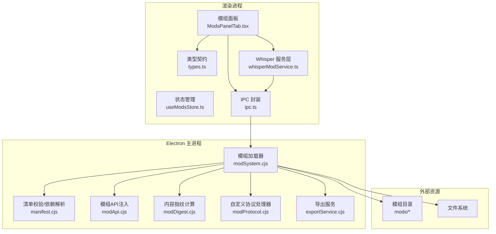
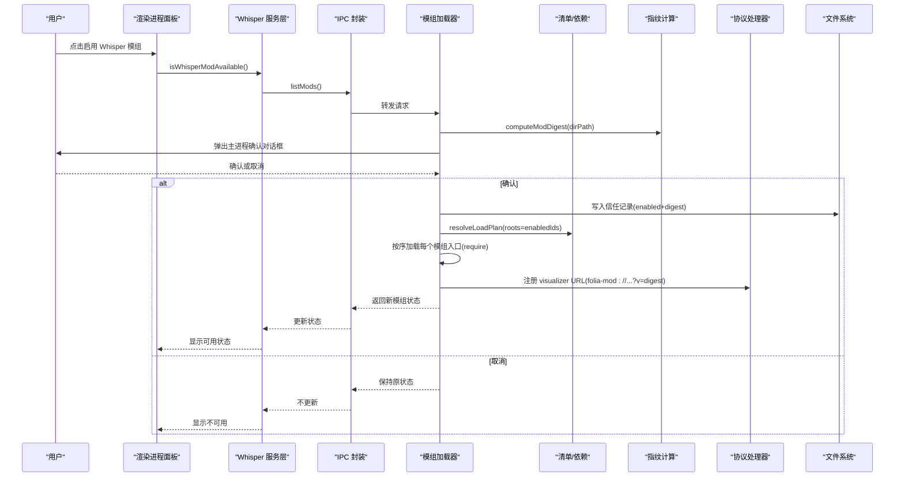
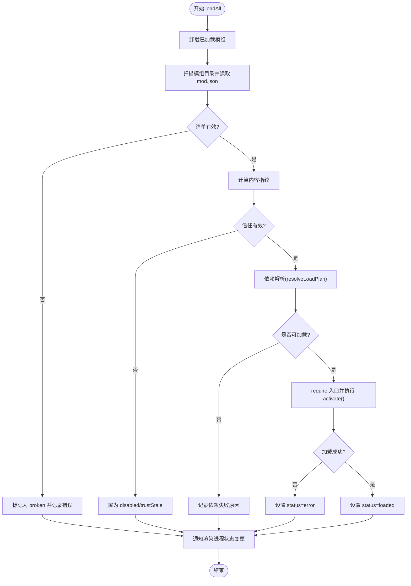
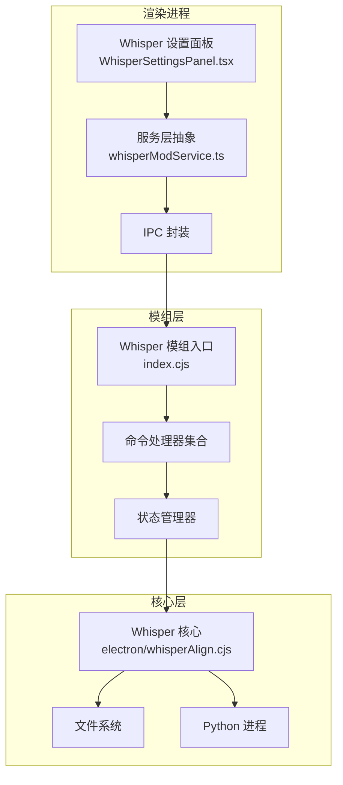
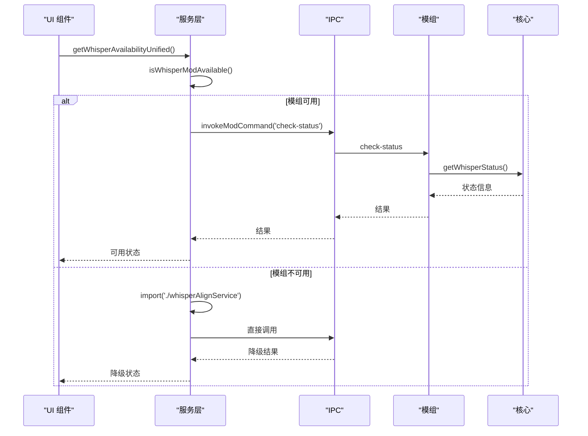
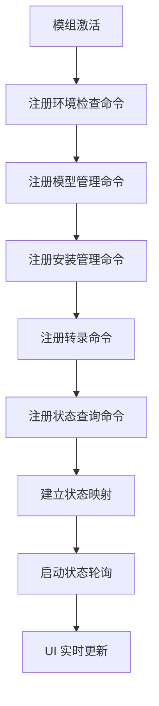
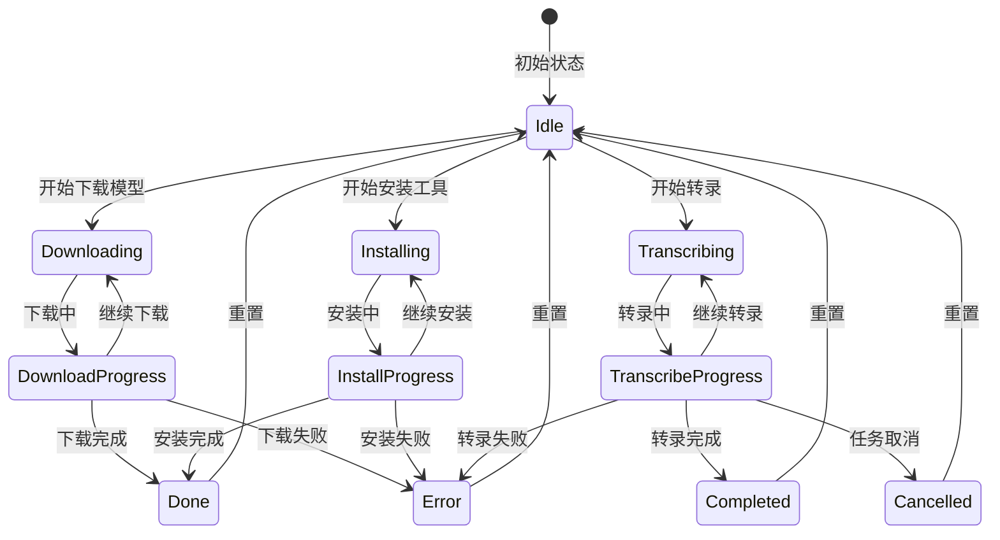
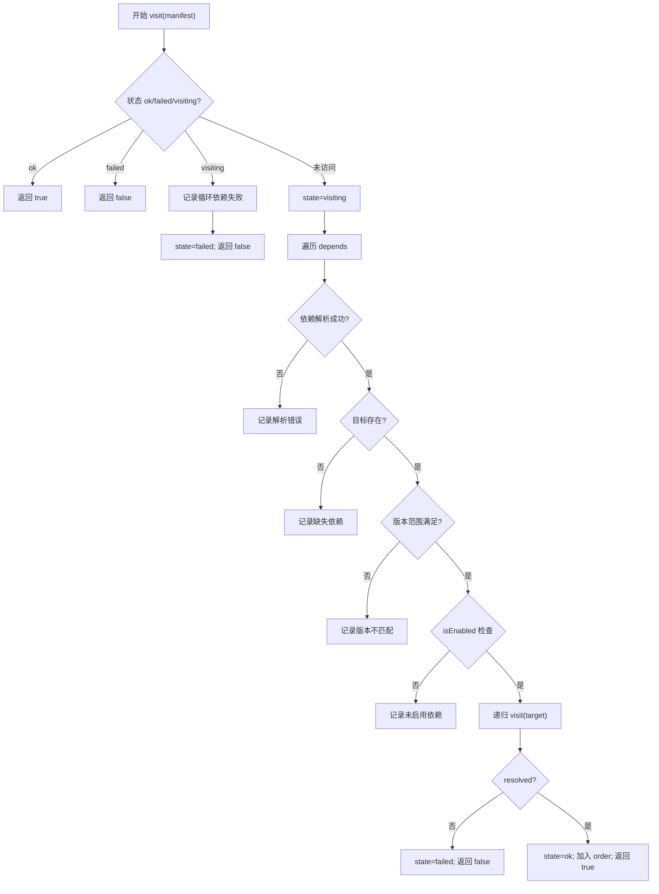

# 模组架构设计

<cite>
**本文引用的文件**
- [electron/modSystem/modSystem.cjs](file://electron/modSystem/modSystem.cjs)
- [electron/modSystem/manifest.cjs](file://electron/modSystem/manifest.cjs)
- [electron/modSystem/modApi.cjs](file://electron/modSystem/modApi.cjs)
- [electron/modSystem/modProtocol.cjs](file://electron/modSystem/modProtocol.cjs)
- [electron/modSystem/modDigest.cjs](file://electron/modSystem/modDigest.cjs)
- [src/mods/ModsPanelTab.tsx](file://src/mods/ModsPanelTab.tsx)
- [src/mods/useModsStore.ts](file://src/mods/useModsStore.ts)
- [src/mods/ipc.ts](file://src/mods/ipc.ts)
- [src/mods/types.ts](file://src/mods/types.ts)
- [mods/k3panel/index.cjs](file://mods/k3panel/index.cjs)
- [mods/sample-aurora-visualizer/index.cjs](file://mods/sample-aurora-visualizer/index.cjs)
- [mods/whisper-align/index.cjs](file://mods/whisper-align/index.cjs)
- [mods/whisper-align/mod.json](file://mods/whisper-align/mod.json)
- [src/services/whisperModService.ts](file://src/services/whisperModService.ts)
- [src/components/shared/WhisperSettingsPanel.tsx](file://src/components/shared/WhisperSettingsPanel.tsx)
- [electron/main.cjs](file://electron/main.cjs)
</cite>

## 更新摘要
**变更内容**
- 新增 whisper-align 模组作为高级模组模式示例的详细分析
- 增强 IPC 通信和服务层抽象的设计说明
- 更新复杂命令注册模式的实现细节
- 扩展模组生命周期管理和状态同步机制
- 添加服务层统一 API 和降级兼容策略

## 目录
1. [简介](#简介)
2. [项目结构](#项目结构)
3. [核心组件](#核心组件)
4. [架构总览](#架构总览)
5. [详细组件分析](#详细组件分析)
6. [高级模组模式：Whisper 对齐](#高级模组模式whisper-对齐)
7. [依赖关系分析](#依赖关系分析)
8. [性能与资源限制](#性能与资源限制)
9. [故障排查指南](#故障排查指南)
10. [结论](#结论)
11. [附录：规范与约定](#附录：规范与约定)

## 简介
本文件系统性阐述 Folia Player 的模组系统架构，重点覆盖插件化架构的核心原理、动态加载机制、安全沙箱设计、依赖管理策略，以及模组的发现、验证、激活与卸载生命周期。文档同时解释信任模型与安全边界（内容指纹校验、权限控制、错误隔离），并给出模组目录结构规范、配置文件格式与 API 接口设计原则。文末提供架构图表与组件交互图，帮助开发者理解整体设计与技术决策。

**更新** 本次更新重点分析了 whisper-align 模组作为高级模组模式的实现，展示了复杂的 IPC 通信、服务层抽象和命令注册模式。

## 项目结构
模组系统由 Electron 主进程中的"模组加载器"与渲染进程的"模组面板/状态管理"共同构成，并通过 IPC 通信。关键路径如下：
- 主进程模组加载器：位于 electron/modSystem 下，负责发现、校验、依赖解析、信任确认、动态加载、命令路由、导出服务、协议处理等。
- 渲染进程 UI：位于 src/mods 下，提供模组管理界面、状态同步、IPC 封装、运行时快照推送等。
- 示例模组：位于 mods 目录下，包含 mod.json 声明与入口模块，演示命令注册与可视化贡献。

**图表来源**
- [electron/modSystem/modSystem.cjs:1-120](file://electron/modSystem/modSystem.cjs#L1-L120)
- [electron/modSystem/manifest.cjs:1-60](file://electron/modSystem/manifest.cjs#L1-L60)
- [electron/modSystem/modApi.cjs:1-40](file://electron/modSystem/modApi.cjs#L1-L40)
- [electron/modSystem/modDigest.cjs:1-30](file://electron/modSystem/modDigest.cjs#L1-L30)
- [electron/modSystem/modProtocol.cjs:1-36](file://electron/modSystem/modProtocol.cjs#L1-L36)
- [src/mods/ModsPanelTab.tsx:1-40](file://src/mods/ModsPanelTab.tsx#L1-L40)
- [src/mods/useModsStore.ts:1-30](file://src/mods/useModsStore.ts#L1-L30)
- [src/mods/ipc.ts:1-30](file://src/mods/ipc.ts#L1-L30)
- [src/services/whisperModService.ts:1-50](file://src/services/whisperModService.ts#L1-L50)

**章节来源**
- [electron/modSystem/modSystem.cjs:1-120](file://electron/modSystem/modSystem.cjs#L1-L120)
- [src/mods/ModsPanelTab.tsx:1-40](file://src/mods/ModsPanelTab.tsx#L1-L40)
- [src/mods/useModsStore.ts:1-30](file://src/mods/useModsStore.ts#L1-L30)
- [src/mods/ipc.ts:1-30](file://src/mods/ipc.ts#L1-L30)

## 核心组件
- 模组加载器（modSystem.cjs）：实现模组发现、清单校验、依赖解析、信任确认、动态加载、命令执行、导出流程、协议处理、日志与状态广播。
- 清单与依赖（manifest.cjs）：定义权限白名单、版本范围解析、依赖图构建与失败隔离。
- 模组 API（modApi.cjs）：向模组暴露受限能力（日志、存储、生命周期、播放快照、命令注册、视频导出）。
- 内容指纹（modDigest.cjs）：对模组目录进行确定性哈希，绑定用户信任到具体字节集。
- 协议处理器（modProtocol.cjs）：提供只读、白名单化的 folia-mod:// 协议，仅允许已发现且校验通过的模组 JS/MJS 被渲染进程动态导入。
- 渲染侧面板与状态（ModsPanelTab.tsx / useModsStore.ts / ipc.ts / types.ts）：提供启用/禁用、批量操作、拖拽安装、命令表单、运行快照推送、事件订阅等。

**章节来源**
- [electron/modSystem/modSystem.cjs:135-280](file://electron/modSystem/modSystem.cjs#L135-L280)
- [electron/modSystem/manifest.cjs:136-201](file://electron/modSystem/manifest.cjs#L136-L201)
- [electron/modSystem/modApi.cjs:31-161](file://electron/modSystem/modApi.cjs#L31-L161)
- [electron/modSystem/modDigest.cjs:67-96](file://electron/modSystem/modDigest.cjs#L67-L96)
- [electron/modSystem/modProtocol.cjs:51-93](file://electron/modSystem/modProtocol.cjs#L51-L93)
- [src/mods/ModsPanelTab.tsx:185-363](file://src/mods/ModsPanelTab.tsx#L185-L363)
- [src/mods/useModsStore.ts:58-156](file://src/mods/useModsStore.ts#L58-L156)
- [src/mods/ipc.ts:26-117](file://src/mods/ipc.ts#L26-L117)
- [src/mods/types.ts:9-157](file://src/mods/types.ts#L9-L157)

## 架构总览
模组系统采用"主进程安全边界 + 渲染进程扩展点"的分层架构：
- 主进程承担所有高风险操作：文件读取、ZIP 解压、清单校验、依赖解析、信任确认、命令执行、导出服务、协议处理。
- 渲染进程仅提供受控的 UI 与数据桥接：通过 IPC 调用主进程能力，展示模组列表、命令表单、进度与日志。
- 自定义协议 folia-mod:// 将可视化贡献限定为只读、白名单的文件访问，避免 Node 执行环境泄露。

**图表来源**
- [electron/modSystem/modSystem.cjs:604-662](file://electron/modSystem/modSystem.cjs#L604-L662)
- [electron/modSystem/modDigest.cjs:67-96](file://electron/modSystem/modDigest.cjs#L67-L96)
- [electron/modSystem/manifest.cjs:216-295](file://electron/modSystem/manifest.cjs#L216-L295)
- [electron/modSystem/modProtocol.cjs:51-93](file://electron/modSystem/modProtocol.cjs#L51-L93)
- [src/services/whisperModService.ts:60-70](file://src/services/whisperModService.ts#L60-L70)

## 详细组件分析

### 模组加载器（modSystem.cjs）
- 发现与扫描：从多个目录（开发包内、用户 userData、资源目录）扫描模组文件夹，跳过隐藏目录，读取 mod.json 并校验。
- 信任模型：以内容指纹（sha256）绑定用户授权；若文件变化导致 digest 不同，则撤销信任并要求重新确认。
- 依赖解析：基于清单 depends 字段解析版本范围（^X.Y.Z 与 *），检测缺失依赖、版本不匹配、循环依赖，并将失败隔离在子图中。
- 动态加载：按依赖顺序 require 模组入口函数，捕获异常并标记 error；支持 unload 清理定时器/监听器等资源。
- 命令路由：通过 registerCommand 注册命令，执行时校验命令级权限，失败时返回 permission-denied 或错误信息。
- 导出服务：通过 exportService.runExport 发起视频导出，需 render.export 权限，支持进度回调。
- 协议处理：生成带版本查询参数的 folia-mod:// URL，配合 modProtocol.cjs 提供只读访问。

**图表来源**
- [electron/modSystem/modSystem.cjs:490-596](file://electron/modSystem/modSystem.cjs#L490-L596)
- [electron/modSystem/manifest.cjs:216-295](file://electron/modSystem/manifest.cjs#L216-L295)

**章节来源**
- [electron/modSystem/modSystem.cjs:395-596](file://electron/modSystem/modSystem.cjs#L395-L596)
- [electron/modSystem/modSystem.cjs:604-689](file://electron/modSystem/modSystem.cjs#L604-L689)

### 清单与依赖（manifest.cjs）
- 权限白名单：仅允许 filesystem.data、render.export、runtime.playback、visualizer.register。未知权限直接拒绝。
- 版本范围：支持 ^X.Y.Z 与 *，严格校验格式；不满足范围视为依赖失败。
- 依赖图：深度优先遍历，检测循环依赖、缺失依赖、版本不匹配、未启用依赖；失败仅影响相关子图。
- 可视化贡献：校验 id、entry 路径、label、order，并要求对应权限。

**章节来源**
- [electron/modSystem/manifest.cjs:9-16](file://electron/modSystem/manifest.cjs#L9-L16)
- [electron/modSystem/manifest.cjs:32-85](file://electron/modSystem/manifest.cjs#L32-L85)
- [electron/modSystem/manifest.cjs:92-134](file://electron/modSystem/manifest.cjs#L92-L134)
- [electron/modSystem/manifest.cjs:136-201](file://electron/modSystem/manifest.cjs#L136-L201)
- [electron/modSystem/manifest.cjs:216-295](file://electron/modSystem/manifest.cjs#L216-L295)

### 模组 API（modApi.cjs）
- 受限能力：日志、私有存储（JSON）、生命周期钩子、播放快照读取、命令注册、视频导出。
- 权限控制：storage 与 playback 能力需声明权限；未声明则抛出 permission-denied:<id>。
- 数据持久化：每模组独立 dataDir，读写使用临时文件+重命名保证原子性。
- 命令注册：规范化 label/description/params/permissions，禁止重复 id。

**章节来源**
- [electron/modSystem/modApi.cjs:31-161](file://electron/modSystem/modApi.cjs#L31-L161)

### 内容指纹（modDigest.cjs）
- 确定性哈希：按文件名排序，逐文件读取内容或符号链接目标，累计 sha256。
- 资源限制：限制最大文件数与总大小，超限视为不可信，阻止信任授予。
- 短指纹：用于 URL 版本参数，确保浏览器 ES Module 缓存失效。

**章节来源**
- [electron/modSystem/modDigest.cjs:28-89](file://electron/modSystem/modDigest.cjs#L28-L89)
- [electron/modSystem/modDigest.cjs:91-96](file://electron/modSystem/modDigest.cjs#L91-L96)

### 协议处理器（modProtocol.cjs）
- 只读白名单：仅允许 GET 请求，限定 .js/.mjs 扩展名，拒绝路径穿越与绝对路径。
- 安全边界：仅服务于已发现且校验通过的模组目录；无 Node 执行上下文。
- 缓存控制：no-store 防止代理/浏览器缓存旧版本代码。

**章节来源**
- [electron/modSystem/modProtocol.cjs:51-93](file://electron/modSystem/modProtocol.cjs#L51-L93)

### 渲染进程面板与状态（ModsPanelTab.tsx / useModsStore.ts / ipc.ts / types.ts）
- 面板功能：显示模组元信息、权限、错误提示；支持启用/禁用、批量操作、打开目录、拖拽安装 ZIP、刷新、查看日志。
- 状态管理：维护模组列表、FFmpeg 状态、选中项、导出进度、日志；订阅主进程事件实时更新。
- IPC 封装：统一 list/setEnabled/reload/invoke/pushSnapshot/openDirectory/installZip 等调用，并提供降级兼容（非 Electron 环境）。
- 类型契约：跨进程传输均为 JSON 兼容类型，避免序列化风险。

**章节来源**
- [src/mods/ModsPanelTab.tsx:185-363](file://src/mods/ModsPanelTab.tsx#L185-L363)
- [src/mods/useModsStore.ts:58-156](file://src/mods/useModsStore.ts#L58-L156)
- [src/mods/ipc.ts:26-117](file://src/mods/ipc.ts#L26-L117)
- [src/mods/types.ts:9-157](file://src/mods/types.ts#L9-L157)

## 高级模组模式：Whisper 对齐

whisper-align 模组展示了高级模组开发的完整模式，包括复杂的 IPC 通信、服务层抽象、异步任务管理和状态同步机制。

### 模组架构概览

**图表来源**
- [mods/whisper-align/index.cjs:250-413](file://mods/whisper-align/index.cjs#L250-L413)
- [src/services/whisperModService.ts:1-100](file://src/services/whisperModService.ts#L1-L100)
- [src/components/shared/WhisperSettingsPanel.tsx:1-50](file://src/components/shared/WhisperSettingsPanel.tsx#L1-L50)

### 服务层抽象设计

whisperModService.ts 提供了统一的服务层抽象，实现了以下关键特性：

1. **模组可用性检查**：动态检测 whisper-align 模组是否可用
2. **命令调用封装**：统一的命令调用接口，支持错误处理和降级
3. **状态同步**：实时跟踪下载、安装、转录等异步任务的进度
4. **降级兼容**：当模组不可用时自动回退到直接 IPC 调用

**图表来源**
- [src/services/whisperModService.ts:246-266](file://src/services/whisperModService.ts#L246-L266)

### 复杂命令注册模式

whisper-align 模组展示了复杂的命令注册模式，包括：

1. **环境检查命令**：`check-status` - 检测 whisper-cli、模型和 FFmpeg 的安装状态
2. **模型管理命令**：`download-model`、`list-models` - 模型下载和管理
3. **安装管理命令**：`install-cli`、`install-ffmpeg` - 依赖工具安装
4. **转录命令**：`transcribe`、`cancel-transcription` - 音频转录和任务管理
5. **状态查询命令**：`get-transcription-status`、`get-download-progress` - 异步任务状态监控

**图表来源**
- [mods/whisper-align/index.cjs:254-395](file://mods/whisper-align/index.cjs#L254-L395)

### 异步任务管理机制

模组实现了完整的异步任务管理，包括：

1. **任务状态跟踪**：使用 Map 存储活跃任务的详细状态
2. **进度回调**：支持实时进度更新和步骤反馈
3. **任务取消**：支持中断正在进行的转录任务
4. **内存管理**：任务完成后自动清理状态和资源

**图表来源**
- [mods/whisper-align/index.cjs:13-27](file://mods/whisper-align/index.cjs#L13-L27)
- [mods/whisper-align/index.cjs:166-217](file://mods/whisper-align/index.cjs#L166-L217)

### 状态同步和 UI 集成

模组通过以下方式实现与 UI 的紧密集成：

1. **实时状态更新**：通过轮询机制获取任务进度
2. **错误处理**：统一的错误捕获和用户友好的错误消息
3. **资源清理**：模组停用时的自动资源清理
4. **多语言支持**：命令标签和描述的多语言支持

**章节来源**
- [mods/whisper-align/index.cjs:1-413](file://mods/whisper-align/index.cjs#L1-L413)
- [src/services/whisperModService.ts:1-281](file://src/services/whisperModService.ts#L1-L281)
- [src/components/shared/WhisperSettingsPanel.tsx:1-200](file://src/components/shared/WhisperSettingsPanel.tsx#L1-L200)

## 依赖关系分析
模组依赖通过清单 depends 字段声明，支持 bare id 或 id@^version。解析过程：
- 解析依赖字符串，校验 id 与版本范围格式。
- 查找目标模组是否存在于 manifests 集合。
- 检查版本范围是否满足（同主版本且不低于最低版本）。
- 若传入 isEnabled 过滤，则仅允许通过已启用模组作为依赖根。
- 深度优先遍历，检测循环依赖并记录失败原因，最终输出 order 与 failures。

**图表来源**
- [electron/modSystem/manifest.cjs:216-295](file://electron/modSystem/manifest.cjs#L216-L295)

**章节来源**
- [electron/modSystem/manifest.cjs:216-295](file://electron/modSystem/manifest.cjs#L216-L295)

## 性能与资源限制
- 安装限制：ZIP 体积、条目数量、单文件大小、解压后总大小均有上限，防止 zip bomb 攻击。
- 指纹计算：限制文件数与总大小，避免启动时长时间阻塞。
- 模块缓存清理：reload 时会清除模组目录下的 require.cache，确保热重载生效。
- 协议缓存：folia-mod:// 响应头 no-store，避免浏览器/代理缓存旧版代码。
- 资源路径：userData 目录为用户可写，打包应用目录只读，降低误改风险。

**章节来源**
- [electron/modSystem/modSystem.cjs:33-48](file://electron/modSystem/modSystem.cjs#L33-L48)
- [electron/modSystem/modSystem.cjs:117-126](file://electron/modSystem/modSystem.cjs#L117-L126)
- [electron/modSystem/modDigest.cjs:17-20](file://electron/modSystem/modDigest.cjs#L17-L20)
- [electron/modSystem/modProtocol.cjs:79-88](file://electron/modSystem/modProtocol.cjs#L79-L88)

## 故障排查指南
- 清单无效：检查 mod.json 必填字段（id/name/version/entry），权限是否在白名单，depends 格式是否正确。
- 依赖失败：确认依赖模组已安装且版本范围满足；若依赖未启用，需先启用依赖模组。
- 信任失效：模组文件变更后 digest 改变，需在主进程弹窗中重新确认启用。
- 命令权限不足：命令声明的 permissions 必须包含在模组 manifest.permissions 中。
- 可视化贡献不可用：需声明 visualizer.register 权限，entry 必须是相对 .js/.mjs 路径。
- 导出失败：需声明 render.export 权限；检查 FFmpeg 可用性与路径。
- Whisper 模组问题：检查模组是否已启用，核心模块是否能正确加载，环境变量配置是否正确。

**章节来源**
- [electron/modSystem/manifest.cjs:136-201](file://electron/modSystem/manifest.cjs#L136-L201)
- [electron/modSystem/modSystem.cjs:664-689](file://electron/modSystem/modSystem.cjs#L664-L689)
- [electron/modSystem/modApi.cjs:39-43](file://electron/modSystem/modApi.cjs#L39-L43)
- [electron/modSystem/modSystem.cjs:604-662](file://electron/modSystem/modSystem.cjs#L604-L662)

## 结论
Folia Player 的模组系统通过主进程安全边界与渲染进程扩展点的清晰分离，实现了安全的插件化架构。其核心在于：
- 以内容指纹绑定的信任模型，确保每次启用都针对具体字节集。
- 严格的权限白名单与调用点校验，最小化攻击面。
- 健壮的依赖解析与失败隔离，单个模组问题不影响整体稳定性。
- 可控的动态加载与卸载，结合模块缓存清理与协议白名单，保障运行时安全。
- 丰富的渲染侧能力（命令表单、可视化贡献、导出进度、日志），提升开发者体验。

**更新** 本次更新特别强调了 whisper-align 模组作为高级模组模式的示范作用，展示了复杂的 IPC 通信、服务层抽象、异步任务管理和状态同步机制，为开发者提供了完整的模组开发参考。

## 附录：规范与约定
- 模组目录结构：
  - 每个模组一个文件夹，包含 mod.json 与入口文件（默认 index.cjs）。
  - 可选 visualizers 贡献，entry 为相对 .js/.mjs 路径。
- 配置文件格式（mod.json）：
  - 必填：id、name、version、apiVersion、entry。
  - 可选：author、description、depends、permissions、visualizers。
  - depends 支持 bare id 或 id@^X.Y.Z。
  - permissions 必须在白名单内。
- API 接口设计原则：
  - 所有跨进程数据为 JSON 兼容类型。
  - 权限控制贯穿声明与调用点，未声明能力不可达。
  - 命令参数支持多语言标签与实时调节（modulate）。
  - 可视化贡献通过 folia-mod:// 协议安全加载，带版本参数防缓存。

**章节来源**
- [mods/k3panel/mod.json:1-11](file://mods/k3panel/mod.json#L1-L11)
- [mods/sample-aurora-visualizer/mod.json:1-19](file://mods/sample-aurora-visualizer/mod.json#L1-L19)
- [mods/whisper-align/mod.json:1-11](file://mods/whisper-align/mod.json#L1-L11)
- [electron/modSystem/manifest.cjs:136-201](file://electron/modSystem/manifest.cjs#L136-L201)
- [electron/modSystem/modProtocol.cjs:51-93](file://electron/modSystem/modProtocol.cjs#L51-L93)
- [src/mods/types.ts:23-66](file://src/mods/types.ts#L23-L66)