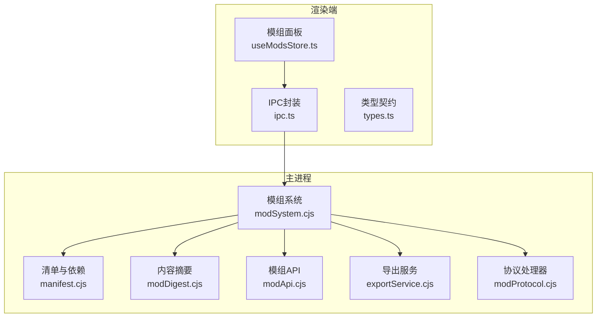
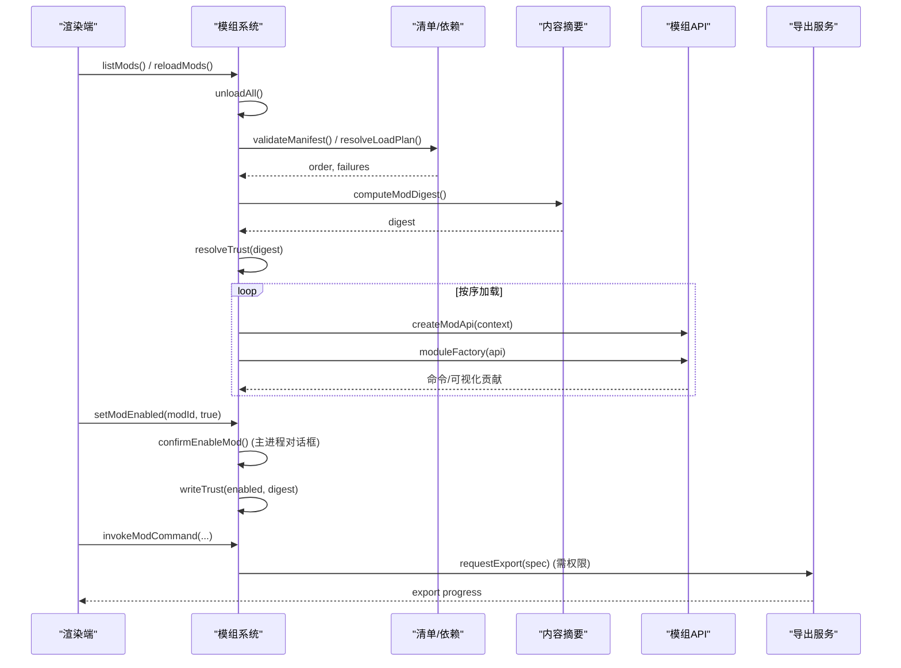
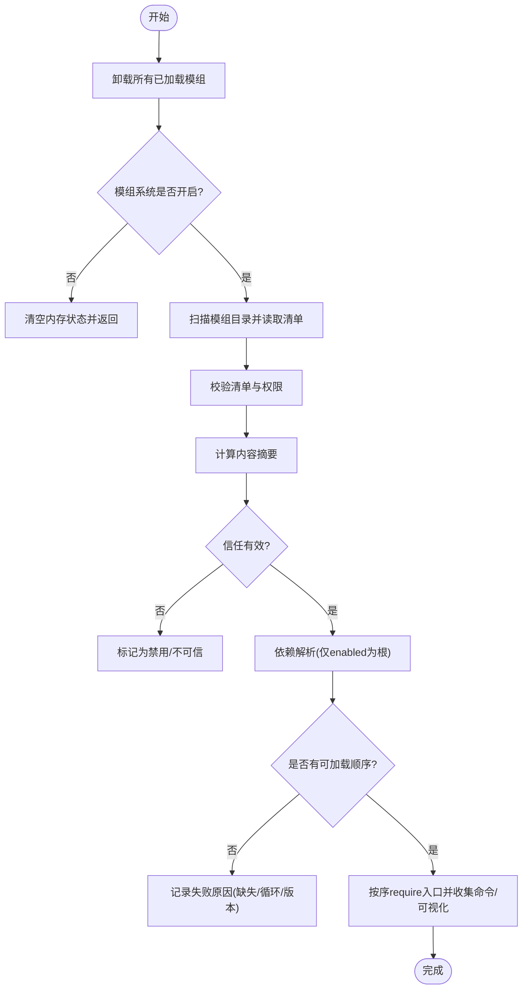
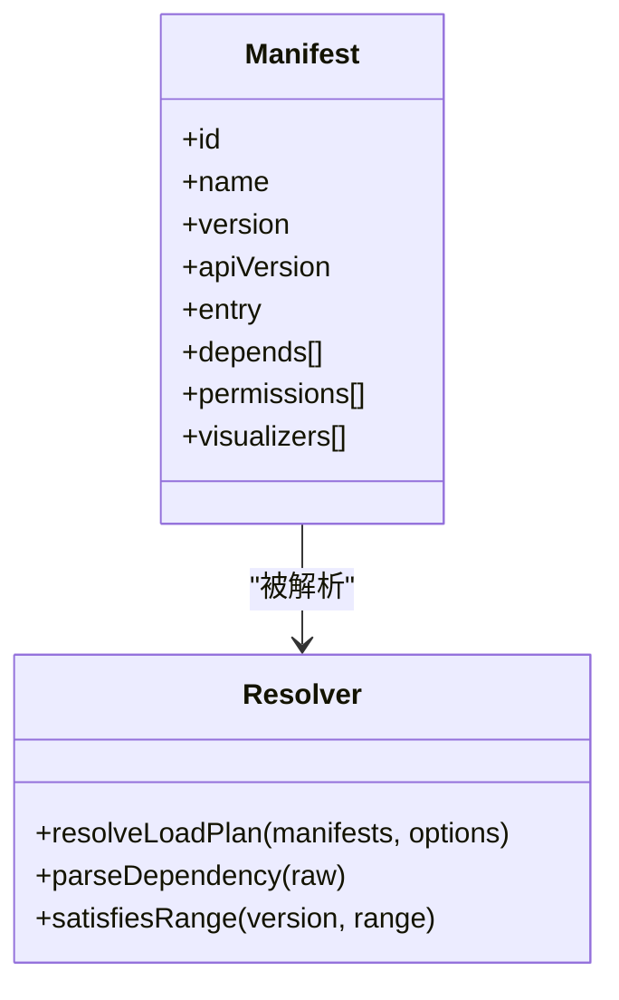
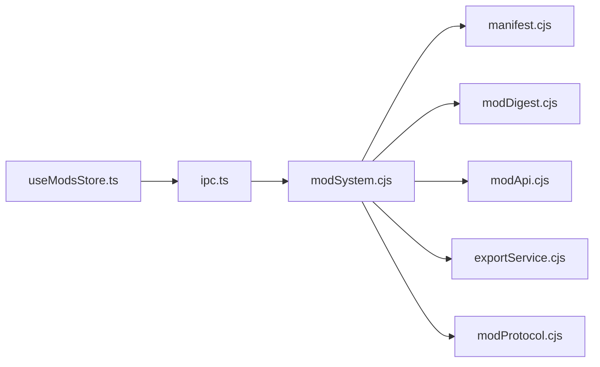

# 生命周期管理

<cite>
**本文引用的文件**
- [modSystem.cjs](file://electron/modSystem/modSystem.cjs)
- [manifest.cjs](file://electron/modSystem/manifest.cjs)
- [modApi.cjs](file://electron/modSystem/modApi.cjs)
- [modDigest.cjs](file://electron/modSystem/modDigest.cjs)
- [useModsStore.ts](file://src/mods/useModsStore.ts)
- [ipc.ts](file://src/mods/ipc.ts)
- [types.ts](file://src/mods/types.ts)
- [index.cjs（whisper-align）](file://mods/whisper-align/index.cjs)
- [index.cjs（k3panel）](file://mods/k3panel/index.cjs)
- [index.cjs（sample-aurora-visualizer）](file://mods/sample-aurora-visualizer/index.cjs)
</cite>

## 目录
1. [简介](#简介)
2. [项目结构](#项目结构)
3. [核心组件](#核心组件)
4. [架构总览](#架构总览)
5. [详细组件分析](#详细组件分析)
6. [依赖关系分析](#依赖关系分析)
7. [性能考量](#性能考量)
8. [故障排查指南](#故障排查指南)
9. [结论](#结论)
10. [附录：钩子与最佳实践](#附录：钩子与最佳实践)

## 简介
本文件系统性梳理 Folia Player 的模组（Mod）生命周期管理，覆盖从发现、验证、依赖解析、激活、运行到卸载的全流程；深入说明依赖管理机制（含循环依赖检测与版本兼容性）、状态管理与持久化策略（启用状态存储、配置同步、数据迁移）、错误处理与恢复机制（异常捕获、回滚策略、故障隔离），以及热重载与更新机制（增量更新、缓存管理、性能优化）。文末提供生命周期钩子的使用示例与最佳实践。

## 项目结构
模组系统由 Electron 主进程加载器与渲染端面板共同组成：
- 主进程侧：负责模组发现、清单校验、依赖图解析、信任绑定、运行时沙箱、IPC 桥接、导出服务、FFmpeg 探测等。
- 渲染端侧：维护模组列表、命令执行、日志与导出进度订阅、可视化贡献者注册与刷新。

图表来源
- [modSystem.cjs:135-198](file://electron/modSystem/modSystem.cjs#L135-L198)
- [manifest.cjs:216-295](file://electron/modSystem/manifest.cjs#L216-L295)
- [modDigest.cjs:67-96](file://electron/modSystem/modDigest.cjs#L67-L96)
- [modApi.cjs:31-161](file://electron/modSystem/modApi.cjs#L31-L161)
- [useModsStore.ts:58-156](file://src/mods/useModsStore.ts#L58-L156)
- [ipc.ts:26-117](file://src/mods/ipc.ts#L26-L117)

章节来源
- [modSystem.cjs:1-1037](file://electron/modSystem/modSystem.cjs#L1-L1037)
- [manifest.cjs:1-327](file://electron/modSystem/manifest.cjs#L1-L327)
- [modApi.cjs:1-164](file://electron/modSystem/modApi.cjs#L1-L164)
- [modDigest.cjs:1-99](file://electron/modSystem/modDigest.cjs#L1-L99)
- [useModsStore.ts:1-226](file://src/mods/useModsStore.ts#L1-L226)
- [ipc.ts:1-119](file://src/mods/ipc.ts#L1-L119)
- [types.ts:1-157](file://src/mods/types.ts#L1-L157)

## 核心组件
- 模组系统（modSystem.cjs）：入口与编排，负责发现、校验、依赖解析、信任绑定、加载/卸载、IPC 暴露、导出与 FFmpeg 探测。
- 清单与依赖（manifest.cjs）：清单校验、权限白名单、依赖解析、循环依赖检测、版本范围兼容检查。
- 内容摘要（modDigest.cjs）：对模组目录进行确定性哈希，用于“按字节确认”的信任绑定与模块缓存失效。
- 模组 API（modApi.cjs）：注入给模组的受限能力集（日志、存储、生命周期钩子、命令注册、导出、播放快照访问）。
- 渲染端状态（useModsStore.ts + ipc.ts + types.ts）：统一镜像主进程状态、事件订阅、命令调用、导出进度与日志流。

章节来源
- [modSystem.cjs:135-198](file://electron/modSystem/modSystem.cjs#L135-L198)
- [manifest.cjs:136-201](file://electron/modSystem/manifest.cjs#L136-L201)
- [modDigest.cjs:67-96](file://electron/modSystem/modDigest.cjs#L67-L96)
- [modApi.cjs:31-161](file://electron/modSystem/modApi.cjs#L31-L161)
- [useModsStore.ts:58-156](file://src/mods/useModsStore.ts#L58-L156)
- [ipc.ts:26-117](file://src/mods/ipc.ts#L26-L117)
- [types.ts:68-157](file://src/mods/types.ts#L68-L157)

## 架构总览
模组生命周期分为以下阶段：
- 发现：扫描多个模组目录，读取 mod.json，去重并记录校验错误。
- 验证：校验清单字段、权限白名单、视觉贡献者声明。
- 依赖解析：基于 enabled 集合构建有向图，检测缺失依赖、循环依赖、版本不兼容。
- 信任绑定：计算内容摘要，比对已存信任记录，若不一致则撤销授权。
- 激活：按解析顺序 require 模组入口，收集命令与可视化贡献，进入 loaded 或 error 状态。
- 运行：通过 IPC 暴露命令执行、导出、日志、状态推送等能力。
- 卸载：清理所有 dispose 回调、命令注册表，释放资源。

图表来源
- [modSystem.cjs:490-596](file://electron/modSystem/modSystem.cjs#L490-L596)
- [modSystem.cjs:604-662](file://electron/modSystem/modSystem.cjs#L604-L662)
- [manifest.cjs:216-295](file://electron/modSystem/manifest.cjs#L216-L295)
- [modDigest.cjs:67-96](file://electron/modSystem/modDigest.cjs#L67-L96)
- [modApi.cjs:31-161](file://electron/modSystem/modApi.cjs#L31-L161)

## 详细组件分析

### 模组系统（modSystem.cjs）
- 发现与校验：遍历应用包内、用户目录与资源目录下的 mods，读取 mod.json 并调用清单校验；重复 id 会保留为独立条目以便展示错误。
- 依赖解析：仅以 enabled 模组为根构建依赖图，失败被限制在子图内，不影响其他模组。
- 信任机制：每次启用前重新计算摘要，强制用户确认新代码；内容不可哈希时标记为不可信。
- 激活与卸载：每个模组拥有独立的命令注册表与 dispose 队列；卸载时按逆序执行清理，单个异常不会阻断其余清理。
- IPC 暴露：list/setEnabled/reload/invoke/export/ffmpeg/openDirectory/installZip/state-changed/log 等通道。
- 安装保护：zip 解压前做大小、条目数、单文件大小、总量限制；路径规范化拒绝穿越与绝对路径；二次校验实际膨胀后大小。

图表来源
- [modSystem.cjs:490-596](file://electron/modSystem/modSystem.cjs#L490-L596)
- [modSystem.cjs:704-800](file://electron/modSystem/modSystem.cjs#L704-L800)

章节来源
- [modSystem.cjs:135-198](file://electron/modSystem/modSystem.cjs#L135-L198)
- [modSystem.cjs:395-456](file://electron/modSystem/modSystem.cjs#L395-L456)
- [modSystem.cjs:490-596](file://electron/modSystem/modSystem.cjs#L490-L596)
- [modSystem.cjs:604-662](file://electron/modSystem/modSystem.cjs#L604-L662)
- [modSystem.cjs:704-800](file://electron/modSystem/modSystem.cjs#L704-L800)

### 清单与依赖（manifest.cjs）
- 权限白名单：仅允许已知权限，未知权限直接拒绝。
- 依赖解析：支持 bare id 与 caret 版本范围；不支持的运算符报错。
- 循环依赖检测：DFS 状态机（visiting/ok/failed）检测环并记录失败。
- 版本兼容：比较语义版本，caret 范围要求主版本一致且不低于下限。
- 可视化贡献：校验 entry 后缀、路径安全、权限要求与排序。

图表来源
- [manifest.cjs:136-201](file://electron/modSystem/manifest.cjs#L136-L201)
- [manifest.cjs:216-295](file://electron/modSystem/manifest.cjs#L216-L295)

章节来源
- [manifest.cjs:1-327](file://electron/modSystem/manifest.cjs#L1-L327)

### 内容摘要（modDigest.cjs）
- 确定性遍历：深度优先、文件名排序、符号链接只记录目标字符串，避免环与越界。
- 容量限制：文件数与总大小上限，超限即视为不可信。
- 摘要用途：绑定用户确认到具体字节；同时作为可视化 URL 的版本参数，使浏览器 ES 模块缓存失效。

章节来源
- [modDigest.cjs:1-99](file://electron/modSystem/modDigest.cjs#L1-L99)

### 模组 API（modApi.cjs）
- 受限能力：日志、私有存储（JSON）、生命周期钩子、命令注册、导出视频、播放快照（需权限）。
- 权限门控：未声明权限将抛出一致的 permission-denied 错误。
- 存储实现：原子写入（临时文件+rename），读失败降级为空对象。

章节来源
- [modApi.cjs:1-164](file://electron/modSystem/modApi.cjs#L1-L164)

### 渲染端状态（useModsStore.ts + ipc.ts + types.ts）
- 状态镜像：listMods/reloadMods/toggleMod/runCommand 等调用均通过 ipc 转发至主进程。
- 事件订阅：模组状态变更、导出进度、日志流实时推送到 store。
- 可视化同步：模组列表变化时自动重新注册/刷新可视化贡献。

章节来源
- [useModsStore.ts:58-156](file://src/mods/useModsStore.ts#L58-L156)
- [ipc.ts:26-117](file://src/mods/ipc.ts#L26-L117)
- [types.ts:68-157](file://src/mods/types.ts#L68-L157)

## 依赖关系分析
- 耦合与内聚：
  - modSystem.cjs 高内聚地组织生命周期各阶段，低耦合地依赖 manifest/modDigest/modApi/exportService/modProtocol。
  - 渲染端通过 ipc.ts 抽象主进程接口，屏蔽 Electron 差异与 web 环境降级。
- 外部依赖：
  - electron-store 用于持久化启用状态与信任记录。
  - fflate 用于安全解压 zip。
  - Node fs/crypto/path 用于文件系统与摘要计算。
- 潜在循环：
  - 依赖解析层显式检测循环依赖并短路失败，避免死锁。
- 集成点：
  - IPC 通道定义集中，便于扩展与维护。
  - 可视化贡献通过 folia-mod:// 协议与渲染端 ES 模块加载解耦。

图表来源
- [modSystem.cjs:135-198](file://electron/modSystem/modSystem.cjs#L135-L198)
- [ipc.ts:26-117](file://src/mods/ipc.ts#L26-L117)

章节来源
- [modSystem.cjs:135-198](file://electron/modSystem/modSystem.cjs#L135-L198)
- [ipc.ts:26-117](file://src/mods/ipc.ts#L26-L117)

## 性能考量
- 启动开销控制：
  - 内容摘要与 zip 解压均有严格的上限（文件数、总大小、单文件大小），防止恶意或超大模组拖垮启动。
- 缓存与热重载：
  - 卸载时清除 Node 模块缓存中属于该模组的所有子模块，确保 reload 能重新执行最新代码。
  - 可视化 URL 携带短摘要作为查询参数，利用浏览器 ES 模块缓存键区分不同版本。
- 资源清理：
  - 卸载按逆序执行 dispose，单个异常不影响其余清理，避免资源泄漏。
- I/O 安全：
  - 存储写入采用临时文件+rename 的原子操作，降低损坏风险。

[本节为通用性能建议，无需特定文件引用]

## 故障排查指南
- 常见错误与定位：
  - 清单无效：查看 discovery 阶段的 validationErrors，修正 mod.json 字段与权限。
  - 依赖失败：检查 missing dependency、cycle detected、version not satisfied 等失败原因。
  - 信任失效：digest 变化导致 trustStale=true，需重新启用确认。
  - 命令权限不足：permission-denied:<id>，需在清单中声明相应权限。
  - 导出失败：检查 render.export 权限与 FFmpeg 可用性。
- 日志与调试：
  - 通过 IPC 日志通道订阅模组日志，结合 emitLog 输出定位问题。
  - 打开模组目录便于人工检查文件结构与清单。
- 恢复策略：
  - 卸载并重新启用模组以重建信任。
  - 删除 .staging 残留（启动时自动清理）。
  - 修复依赖或版本范围后再次加载。

章节来源
- [modSystem.cjs:411-456](file://electron/modSystem/modSystem.cjs#L411-L456)
- [modSystem.cjs:533-596](file://electron/modSystem/modSystem.cjs#L533-L596)
- [modSystem.cjs:604-662](file://electron/modSystem/modSystem.cjs#L604-L662)
- [modSystem.cjs:704-800](file://electron/modSystem/modSystem.cjs#L704-L800)

## 结论
Folia 的模组系统以“按字节确认”的安全模型为核心，配合严格的清单校验、依赖图解析与资源清理，实现了高内聚、低耦合的生命周期管理。渲染端通过统一的 IPC 抽象与状态镜像，提供了良好的可扩展性与用户体验。整体设计在安全性、稳定性与可维护性之间取得平衡，适合复杂生态下的第三方扩展。

[本节为总结性内容，无需特定文件引用]

## 附录：钩子与最佳实践
- 生命周期钩子
  - activate：模组入口函数，接收受限 API。用于初始化、注册命令、注册可视化贡献。
  - lifecycle.onDeactivate：返回或注册清理函数，用于释放定时器、监听器、子进程等。
- 最佳实践
  - 仅在清单中声明必要权限，最小权限原则。
  - 在 onDeactivate 中确保所有异步任务可取消、资源可释放。
  - 使用 storage.data 进行本地持久化，注意读写异常降级。
  - 命令参数尽量声明 schema，便于渲染端自动生成表单与校验。
  - 对耗时操作提供进度与取消能力，提升用户体验。
- 示例参考
  - 纯可视化模组：仅注册可视化贡献，无命令。
  - 工具型模组：注册多组命令，包含下载、安装、转录等长耗时任务，并在卸载时取消进行中任务。
  - 调参面板：通过 live 参数与渲染端调制联动，减少主进程往返。

章节来源
- [index.cjs（sample-aurora-visualizer）:8-10](file://mods/sample-aurora-visualizer/index.cjs#L8-L10)
- [index.cjs（k3panel）:27-50](file://mods/k3panel/index.cjs#L27-L50)
- [index.cjs（whisper-align）:250-409](file://mods/whisper-align/index.cjs#L250-L409)