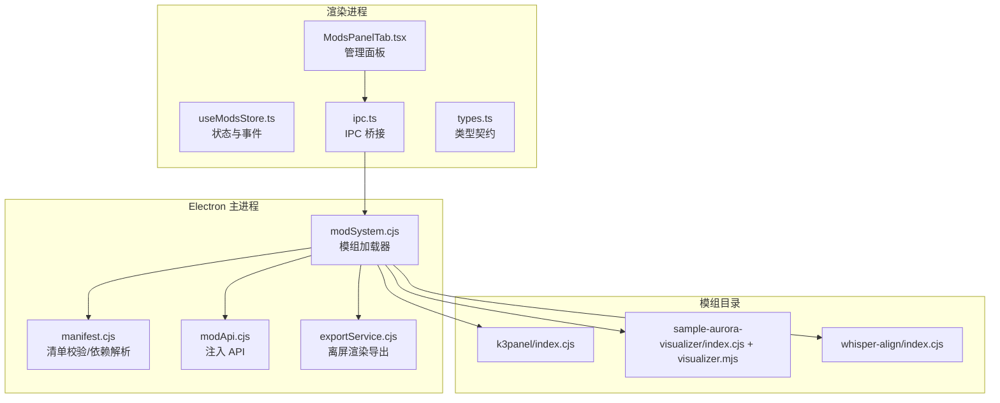
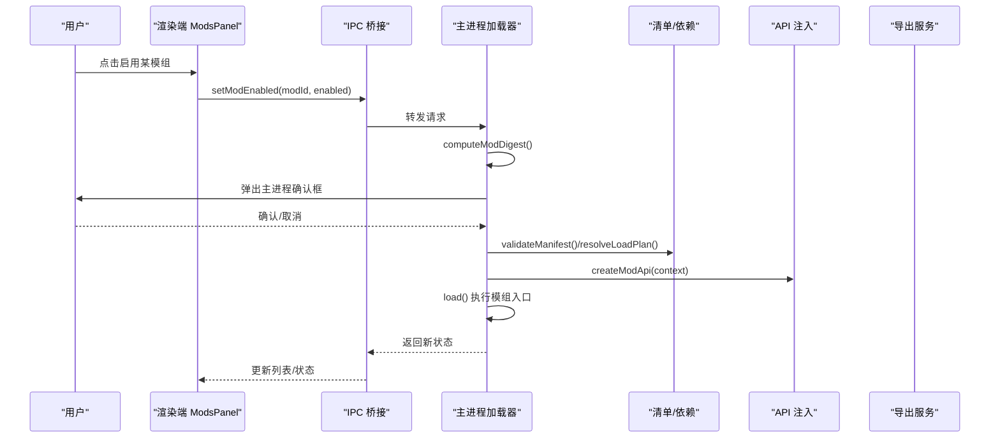
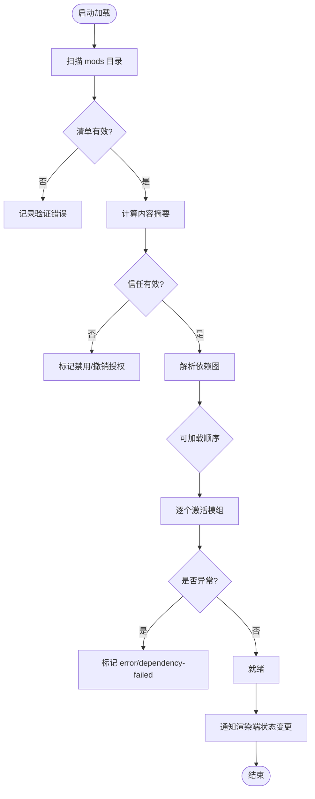
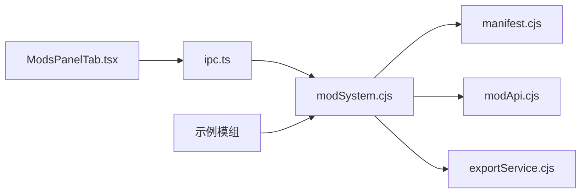

# 模组系统

<cite>
**本文引用的文件**
- [electron/modSystem/modSystem.cjs](file://electron/modSystem/modSystem.cjs)
- [electron/modSystem/manifest.cjs](file://electron/modSystem/manifest.cjs)
- [electron/modSystem/modApi.cjs](file://electron/modSystem/modApi.cjs)
- [electron/modSystem/exportService.cjs](file://electron/modSystem/exportService.cjs)
- [src/mods/ModsPanelTab.tsx](file://src/mods/ModsPanelTab.tsx)
- [src/mods/useModsStore.ts](file://src/mods/useModsStore.ts)
- [src/mods/ipc.ts](file://src/mods/ipc.ts)
- [src/mods/types.ts](file://src/mods/types.ts)
- [mods/README.md](file://mods/README.md)
- [mods/k3panel/index.cjs](file://mods/k3panel/index.cjs)
- [mods/sample-aurora-visualizer/index.cjs](file://mods/sample-aurora-visualizer/index.cjs)
- [mods/sample-aurora-visualizer/visualizer.mjs](file://mods/sample-aurora-visualizer/visualizer.mjs)
- [mods/whisper-align/index.cjs](file://mods/whisper-align/index.cjs)
</cite>

## 目录
1. [简介](#简介)
2. [项目结构](#项目结构)
3. [核心组件](#核心组件)
4. [架构总览](#架构总览)
5. [详细组件分析](#详细组件分析)
6. [依赖关系分析](#依赖关系分析)
7. [性能考量](#性能考量)
8. [故障排查指南](#故障排查指南)
9. [结论](#结论)
10. [附录](#附录)

## 简介
本文件为 Folia Player 的“模组系统”完整开发文档。内容覆盖：
- 插件化架构与动态加载机制（发现、校验、依赖解析、激活/卸载）
- 安全沙箱与权限模型（主进程确认、内容摘要绑定、fail-closed 权限控制）
- 模组 API 接口（命令注册、UI 扩展点、事件与数据访问、系统调用）
- 开发工具链（环境搭建、调试、打包发布流程）
- 内置示例模组实现（K3Panel、Aurora 可视化、Whisper 对齐）
- 模组市场与管理界面（安装、启用、批量管理、日志与导出）

## 项目结构
模组系统由 Electron 主进程加载器、渲染端管理面板、类型契约与示例模组组成：
- 主进程侧：modSystem.cjs（加载器）、manifest.cjs（清单校验与依赖解析）、modApi.cjs（注入 API）、exportService.cjs（离屏渲染导出）
- 渲染端侧：ModsPanelTab.tsx（管理面板）、useModsStore.ts（状态与 IPC 封装）、ipc.ts（IPC 桥接）、types.ts（跨进程类型契约）
- 示例模组：k3panel、sample-aurora-visualizer、whisper-align

图表来源
- [electron/modSystem/modSystem.cjs:1-120](file://electron/modSystem/modSystem.cjs#L1-L120)
- [electron/modSystem/manifest.cjs:1-60](file://electron/modSystem/manifest.cjs#L1-L60)
- [electron/modSystem/modApi.cjs:1-40](file://electron/modSystem/modApi.cjs#L1-L40)
- [electron/modSystem/exportService.cjs:1-40](file://electron/modSystem/exportService.cjs#L1-L40)
- [src/mods/ModsPanelTab.tsx:1-40](file://src/mods/ModsPanelTab.tsx#L1-L40)
- [src/mods/useModsStore.ts:1-30](file://src/mods/useModsStore.ts#L1-L30)
- [src/mods/ipc.ts:1-30](file://src/mods/ipc.ts#L1-L30)
- [src/mods/types.ts:1-30](file://src/mods/types.ts#L1-L30)

章节来源
- [mods/README.md:1-60](file://mods/README.md#L1-L60)
- [electron/modSystem/modSystem.cjs:1-120](file://electron/modSystem/modSystem.cjs#L1-L120)

## 核心组件
- 模组加载器（modSystem.cjs）
  - 扫描 mods 目录，读取并校验 mod.json，计算内容摘要，解析依赖图，按顺序激活模组，维护运行时快照与命令注册表，提供 IPC 通道供渲染端管理。
- 清单与依赖解析（manifest.cjs）
  - 校验 manifest 字段、权限白名单、视觉贡献项；支持 id@^version 依赖范围；检测循环依赖与缺失依赖，隔离失败子图。
- 注入 API（modApi.cjs）
  - 向模组暴露受限 API：日志、私有存储、生命周期清理、播放快照读取、命令注册、视频导出入口；所有敏感能力需声明权限。
- 导出服务（exportService.cjs）
  - 创建离屏窗口驱动可视化渲染，按帧捕获像素流并通过 ffmpeg 编码输出 MOV/WebM；限制分辨率、帧率、时长，保证资源释放。
- 渲染端管理（ModsPanelTab.tsx + useModsStore.ts + ipc.ts）
  - 展示模组列表、启用/禁用、批量操作、打开目录、拖拽 zip 安装、执行命令、查看日志、导出进度等；通过 IPC 与主进程交互。
- 类型契约（types.ts）
  - 定义跨进程传输的数据结构，确保序列化安全与一致性。

章节来源
- [electron/modSystem/modSystem.cjs:120-220](file://electron/modSystem/modSystem.cjs#L120-L220)
- [electron/modSystem/manifest.cjs:136-201](file://electron/modSystem/manifest.cjs#L136-L201)
- [electron/modSystem/modApi.cjs:31-164](file://electron/modSystem/modApi.cjs#L31-L164)
- [electron/modSystem/exportService.cjs:40-120](file://electron/modSystem/exportService.cjs#L40-L120)
- [src/mods/ModsPanelTab.tsx:185-364](file://src/mods/ModsPanelTab.tsx#L185-L364)
- [src/mods/useModsStore.ts:58-156](file://src/mods/useModsStore.ts#L58-L156)
- [src/mods/ipc.ts:26-119](file://src/mods/ipc.ts#L26-L119)
- [src/mods/types.ts:1-157](file://src/mods/types.ts#L1-L157)

## 架构总览
模组系统采用“主进程加载 + 渲染端管理 + 受控 API 注入”的分层架构：
- 发现与校验：主进程扫描 mods 目录，读取 mod.json，校验字段与权限，计算内容摘要。
- 依赖解析：基于已启用模组构建依赖图，仅对可加载子图执行激活，失败隔离。
- 安全边界：启用需主进程原生对话框确认；信任绑定到内容摘要，任何代码变更撤销授权。
- 运行期隔离：每个模组在错误边界内加载；命令执行前校验权限；导出会话互斥且限时限尺寸。
- 渲染扩展：通过 folia-mod:// 协议动态加载 ESM 可视化模块，URL 携带版本查询避免缓存。

图表来源
- [electron/modSystem/modSystem.cjs:604-662](file://electron/modSystem/modSystem.cjs#L604-L662)
- [electron/modSystem/manifest.cjs:216-295](file://electron/modSystem/manifest.cjs#L216-L295)
- [electron/modSystem/modApi.cjs:31-164](file://electron/modSystem/modApi.cjs#L31-L164)
- [src/mods/ipc.ts:43-54](file://src/mods/ipc.ts#L43-L54)

## 详细组件分析

### 模组加载器（modSystem.cjs）
- 目录发现与清单校验：遍历 mods 目录，读取 mod.json，使用 manifest.cjs 校验并去重。
- 内容摘要与信任绑定：计算目录哈希，持久化 {enabled, digest}；文件变化后自动撤销授权。
- 依赖解析与激活：仅以已启用模组为根构建依赖图，按拓扑序加载；单模组异常不影响宿主与其他模组。
- 生命周期管理：unloadAll() 先清理再重新加载；disposer 逆序执行，单个抛错不阻断其余。
- 命令与可视化贡献：注册命令并暴露给渲染端；可视化通过 folia-mod:// URL 动态加载。
- 安装保护：zip 解压前检查大小、条目数、单文件大小；路径穿越与绝对路径拒绝；原子写入 .staging 后替换。

图表来源
- [electron/modSystem/modSystem.cjs:490-596](file://electron/modSystem/modSystem.cjs#L490-L596)
- [electron/modSystem/modSystem.cjs:726-800](file://electron/modSystem/modSystem.cjs#L726-L800)

章节来源
- [electron/modSystem/modSystem.cjs:1-120](file://electron/modSystem/modSystem.cjs#L1-L120)
- [electron/modSystem/modSystem.cjs:490-596](file://electron/modSystem/modSystem.cjs#L490-L596)
- [electron/modSystem/modSystem.cjs:604-662](file://electron/modSystem/modSystem.cjs#L604-L662)
- [electron/modSystem/modSystem.cjs:726-800](file://electron/modSystem/modSystem.cjs#L726-L800)

### 清单与依赖解析（manifest.cjs）
- 权限白名单：仅允许 filesystem.data、render.export、runtime.playback、visualizer.register。
- 依赖语法：支持 bare id 或 id@^version；不支持的运算符直接报错。
- 可视化贡献：entry 必须为相对 .js/.mjs，且需声明 visualizer.register 权限。
- 依赖图解析：visit 递归检测循环依赖、缺失依赖、版本不符、未启用依赖；失败仅影响相关子图。

章节来源
- [electron/modSystem/manifest.cjs:1-60](file://electron/modSystem/manifest.cjs#L1-L60)
- [electron/modSystem/manifest.cjs:136-201](file://electron/modSystem/manifest.cjs#L136-L201)
- [electron/modSystem/manifest.cjs:216-295](file://electron/modSystem/manifest.cjs#L216-L295)

### 注入 API（modApi.cjs）
- 日志：info/warn/error 统一经主进程 emitLog，便于集中查看。
- 存储：storage.data.get/set/has/delete，键名校验，JSON 序列化读写，临时文件原子替换。
- 生命周期：onDeactivate 注册清理函数，禁用/重载/退出时逆序执行。
- 运行时：getPlaybackSnapshot 需 runtime.playback 权限。
- 命令：commands.register 规范化参数与权限，禁止重复 id。
- 渲染：exportVideo 需 render.export 权限，实际由 exportService 处理。

章节来源
- [electron/modSystem/modApi.cjs:31-164](file://electron/modSystem/modApi.cjs#L31-L164)

### 导出服务（exportService.cjs）
- 规格校验：宽高、帧率、时长限制；歌词有效性；平台兼容性；透明通道保障（Windows）。
- 渲染管线：创建离屏窗口，按时间推进合成画面，逐帧捕获像素流（BGRA/RGBA），直写管道至 ffmpeg。
- 编码器选择：ProRes 4444（MOV，通用编辑兼容）或 VP9（WebM，体积更小但部分编辑器不支持 alpha）。
- 资源管理：全局互斥导出会话；失败/取消时清理 ffmpeg 进程、窗口与半成品文件。

章节来源
- [electron/modSystem/exportService.cjs:15-120](file://electron/modSystem/exportService.cjs#L15-L120)
- [electron/modSystem/exportService.cjs:171-200](file://electron/modSystem/exportService.cjs#L171-L200)

### 渲染端管理（ModsPanelTab.tsx + useModsStore.ts + ipc.ts）
- 面板交互：展开/折叠、启用/禁用、批量操作、打开目录、拖拽 zip 安装、刷新、日志查看。
- 状态同步：订阅主进程状态变更、导出进度、日志；本地 store 镜像主进程状态。
- IPC 封装：listMods、setModEnabled、reloadMods、invokeModCommand、pushRuntimeSnapshot、installModFromZip 等。
- 运行时快照：将当前歌曲、歌词、主题、可视化模式与调音参数推送给主进程，供模组消费。

章节来源
- [src/mods/ModsPanelTab.tsx:185-364](file://src/mods/ModsPanelTab.tsx#L185-L364)
- [src/mods/useModsStore.ts:58-156](file://src/mods/useModsStore.ts#L58-L156)
- [src/mods/ipc.ts:26-119](file://src/mods/ipc.ts#L26-L119)

### 类型契约（types.ts）
- 跨进程数据结构：ModRuntimeInfo、ModCommandParam、ModExportProgress、ModFfmpegStatus、ModRuntimeSnapshot 等。
- 约束与回退：label 多语言映射、参数默认值、模态化参数（modulate）等。

章节来源
- [src/mods/types.ts:1-157](file://src/mods/types.ts#L1-L157)

## 依赖关系分析
- 耦合度：
  - 加载器与清单解析强耦合（依赖解析逻辑独立，便于测试）。
  - 渲染端与主进程通过 IPC 松耦合，类型契约保证一致性。
  - 示例模组通过标准 API 接入，低耦合。
- 外部依赖：
  - Electron（dialog、protocol、shell、BrowserWindow）
  - fflate（zip 解压）
  - ffmpeg（导出编码）
- 潜在循环：
  - 依赖解析中显式检测循环依赖，防止死锁。
- 集成点：
  - 导出服务与 ffmpeg 进程通信。
  - 可视化贡献通过 folia-mod:// 协议由渲染端动态加载。

图表来源
- [electron/modSystem/modSystem.cjs:1-30](file://electron/modSystem/modSystem.cjs#L1-L30)
- [src/mods/ipc.ts:1-30](file://src/mods/ipc.ts#L1-L30)

章节来源
- [electron/modSystem/modSystem.cjs:1-30](file://electron/modSystem/modSystem.cjs#L1-L30)
- [src/mods/ipc.ts:1-30](file://src/mods/ipc.ts#L1-L30)

## 性能考量
- 依赖解析隔离：失败子图不影响其他模组加载，提升整体稳定性。
- 导出优化：跳过 PNG 编解码，直接传递原始像素流至 ffmpeg，减少主进程 CPU 开销。
- 模块缓存清理：重载时清除整个模组目录 require.cache，避免旧代码残留。
- 资源限制：导出会话互斥、最大分辨率/帧率/时长限制，防止资源耗尽。
- 内存与 I/O：zip 安装前严格限制条目数与总大小，避免压缩炸弹攻击。

[本节为通用指导，无需特定文件引用]

## 故障排查指南
- 常见错误码与含义：
  - dependency-failed：依赖缺失、版本不符、循环依赖或未启用依赖。
  - permission-denied:<id>：未声明权限调用敏感 API。
  - install-too-large/install-too-many-files/install-unsafe-path：安装包超限或路径不安全。
  - export-invalid-spec/export-ffmpeg-not-found：导出规格无效或 ffmpeg 不可用。
- 定位步骤：
  - 查看模组面板“最近日志”，过滤 level 与 modId。
  - 检查 mod.json 字段与 permissions 声明。
  - 确认启用确认对话框是否成功，内容摘要是否匹配。
  - 导出失败时检查 ffmpeg 路径与平台支持。
- 恢复措施：
  - 修正依赖版本或启用依赖模组。
  - 重新安装模组 zip 并再次确认启用。
  - 安装或配置 ffmpeg，或使用非透明背景导出。

章节来源
- [electron/modSystem/modSystem.cjs:664-689](file://electron/modSystem/modSystem.cjs#L664-L689)
- [electron/modSystem/modSystem.cjs:726-800](file://electron/modSystem/modSystem.cjs#L726-L800)
- [electron/modSystem/exportService.cjs:50-120](file://electron/modSystem/exportService.cjs#L50-L120)
- [src/mods/ModsPanelTab.tsx:579-588](file://src/mods/ModsPanelTab.tsx#L579-L588)

## 结论
Folia 模组系统通过主进程加载器、严格的安全策略与受限 API 注入，实现了可扩展、可审计、可管理的第三方功能生态。其设计强调：
- 安全优先：主进程确认、内容摘要绑定、fail-closed 权限控制。
- 稳定可靠：错误边界、依赖隔离、资源限制与清理。
- 易于扩展：标准化清单、命令注册、可视化贡献、实时调制。
- 开发者友好：清晰 API、丰富示例、完善的管理界面与日志。

[本节为总结性内容，无需特定文件引用]

## 附录

### 内置示例模组分析
- K3Panel（k3panel/index.cjs）
  - 目的：为商籁（sonnet）可视化提供深度精调面板，暴露相机、逐字运动、视差、转场等参数。
  - 实现：注册命令，参数声明 modulate.mode='sonnet'，渲染端实时写入共享调制 store，无需 IPC 往返。
  - 效果：拖动滑块即时生效，下一帧即更新 Pixi 场景。
- Aurora 可视化（sample-aurora-visualizer/index.cjs + visualizer.mjs）
  - 目的：贡献新的全屏歌词动画模式，纯 DOM 无依赖。
  - 实现：Node 入口仅记录加载；可视化逻辑在浏览器 ESM 模块中，通过 folia-mod:// 动态加载。
  - 契约：mount(element, props) 接收歌词行与时间轴，返回 disposer 清理资源。
- Whisper 对齐（whisper-align/index.cjs）
  - 目的：基于 Whisper 的词级歌词对齐，提供模型下载、CLI/FFmpeg 安装、转录任务管理。
  - 实现：注册多个命令，封装核心 whisperAlign 模块，支持进度轮询与取消。
  - 清理：deactivate 时取消所有活跃转录任务，释放资源。

章节来源
- [mods/k3panel/index.cjs:1-50](file://mods/k3panel/index.cjs#L1-L50)
- [mods/sample-aurora-visualizer/index.cjs:1-10](file://mods/sample-aurora-visualizer/index.cjs#L1-L10)
- [mods/sample-aurora-visualizer/visualizer.mjs:1-81](file://mods/sample-aurora-visualizer/visualizer.mjs#L1-L81)
- [mods/whisper-align/index.cjs:1-409](file://mods/whisper-align/index.cjs#L1-L409)

### 开发工具链与流程
- 环境搭建：
  - 启用实验室开关“模组系统”，使加载器工作。
  - 准备 ffmpeg（环境变量、应用目录或 PATH）。
- 调试：
  - 使用模组面板“最近日志”查看 info/warn/error。
  - 修改 index.cjs 或辅助模块后点击“重新加载”，加载器会清除 require.cache。
- 打包发布：
  - 将模组目录打包为 .zip，拖入模组面板自动安装。
  - 安装包经过安全校验与原子写入，升级后需重新确认启用。
- 最佳实践：
  - 明确声明权限，最小化暴露面。
  - 在 onDeactivate 中释放定时器、监听器、子进程等资源。
  - 使用 modulate 参数实现渲染端实时调节，避免频繁 IPC。

章节来源
- [mods/README.md:13-55](file://mods/README.md#L13-L55)
- [mods/README.md:85-120](file://mods/README.md#L85-L120)
- [electron/modSystem/modSystem.cjs:117-126](file://electron/modSystem/modSystem.cjs#L117-L126)