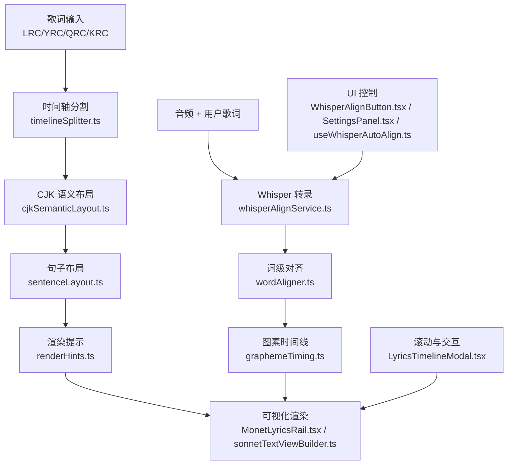
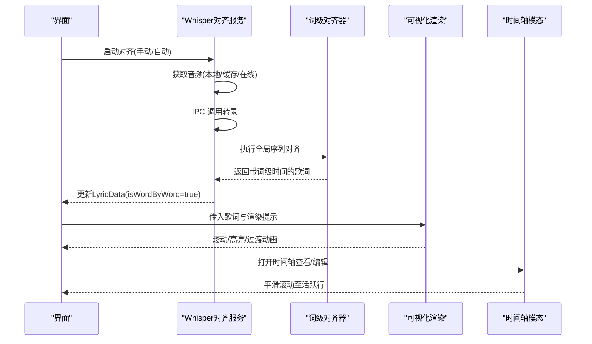
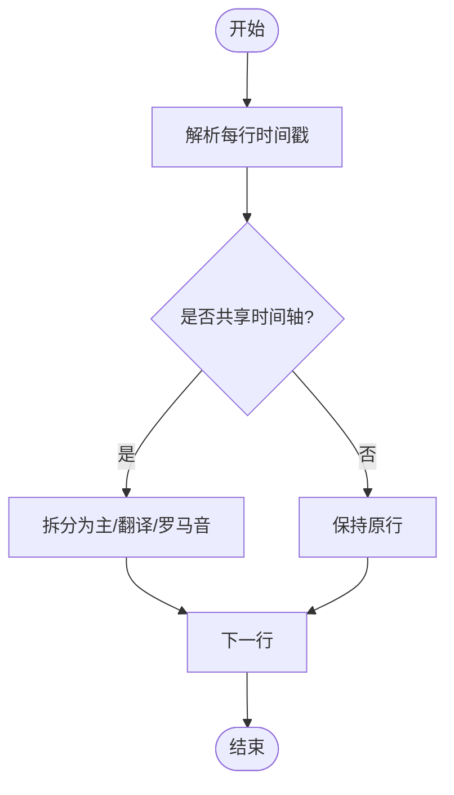
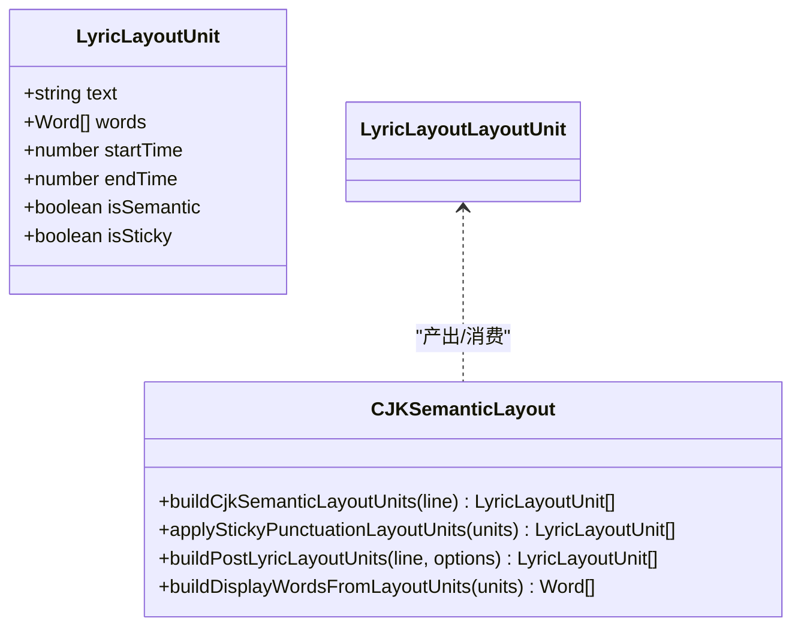
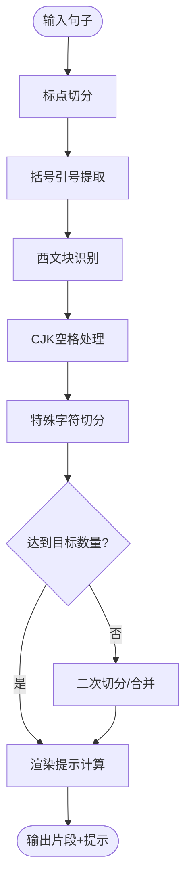
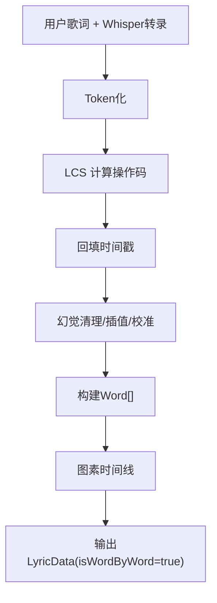
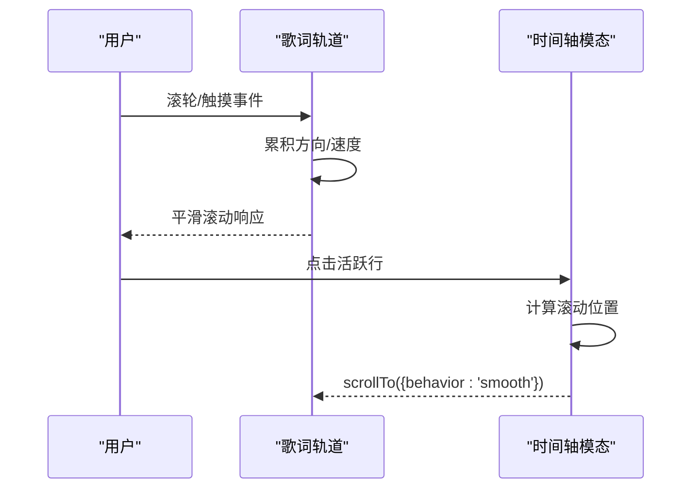
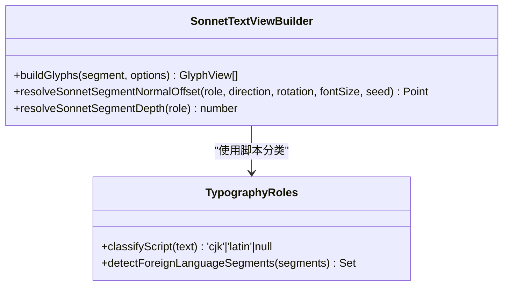
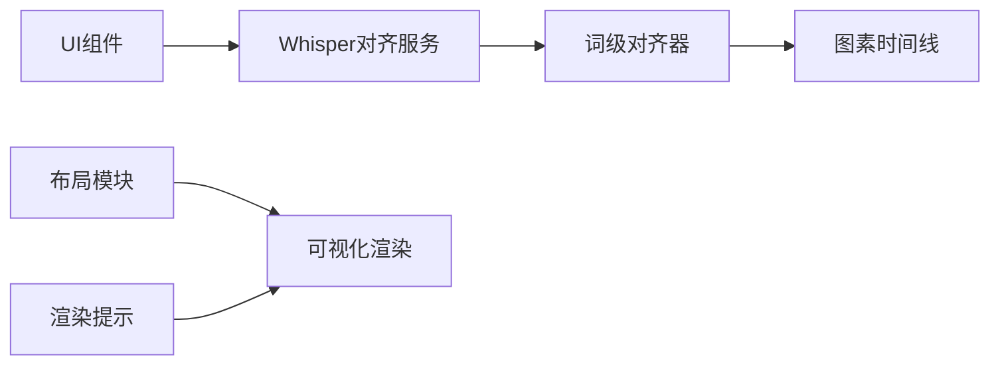

# 时间轴同步

<cite>
**本文引用的文件**
- [timelineSplitter.ts](file://src/utils/lyrics/timelineSplitter.ts)
- [cjkSemanticLayout.ts](file://src/utils/lyrics/cjkSemanticLayout.ts)
- [sentenceLayout.ts](file://src/utils/lyrics/sentenceLayout.ts)
- [renderHints.ts](file://src/utils/lyrics/renderHints.ts)
- [wordAligner.ts](file://src/utils/lyrics/wordAligner.ts)
- [graphemeTiming.ts](file://src/utils/lyrics/graphemeTiming.ts)
- [whisperAlignService.ts](file://src/services/whisperAlignService.ts)
- [WhisperAlignButton.tsx](file://src/components/shared/WhisperAlignButton.tsx)
- [WhisperSettingsPanel.tsx](file://src/components/shared/WhisperSettingsPanel.tsx)
- [useWhisperAutoAlign.ts](file://src/hooks/useWhisperAutoAlign.ts)
- [MonetLyricsRail.tsx](file://src/components/visualizer/monet/MonetLyricsRail.tsx)
- [sonnetTextViewBuilder.ts](file://src/components/visualizer/sonnet/sonnetTextViewBuilder.ts)
- [sonnetTypographyRoles.ts](file://src/components/visualizer/sonnet/sonnetTypographyRoles.ts)
- [LyricsTimelineModal.tsx](file://src/components/modal/LyricsTimelineModal.tsx)
</cite>

## 目录
1. [简介](#简介)
2. [项目结构](#项目结构)
3. [核心组件](#核心组件)
4. [架构总览](#架构总览)
5. [详细组件分析](#详细组件分析)
6. [依赖关系分析](#依赖关系分析)
7. [性能考量](#性能考量)
8. [故障排查指南](#故障排查指南)
9. [结论](#结论)
10. [附录](#附录)

## 简介
本技术文档聚焦 Folia Player 的歌词时间轴同步系统，围绕“逐词级时间戳”与“滚动动画控制”两大主线展开：
- 时间轴分割与对齐：支持 LRC/YRC/QRC/KRC 等多源歌词的时间戳识别、多轨合并、以及 Whisper 驱动的逐词对齐。
- CJK 语义布局：基于 Intl.Segmenter 的语义分词与标点粘连，保证中文/日文/韩文的视觉连贯性与可渲染性。
- 句子布局与渲染提示：按句切分、换行策略、过渡时长与字级揭示模式，确保不同节奏歌词的流畅呈现。
- 滚动动画控制：平滑滚动、可视区域裁剪、边缘渐变与性能优化，保障大量歌词下的播放体验。
- 词级对齐工具：全局序列对齐、幻觉清理、插值与强制校准，输出精确到单字的歌词时间轴。

## 项目结构
歌词时间轴同步涉及“解析—对齐—布局—渲染—交互”五层模块，关键文件分布如下：
- 解析与时间轴分割：timelineSplitter.ts
- CJK 语义布局：cjkSemanticLayout.ts
- 句子布局：sentenceLayout.ts
- 渲染提示：renderHints.ts
- 词级对齐：wordAligner.ts、graphemeTiming.ts
- 自动对齐服务：whisperAlignService.ts
- UI 入口与交互：WhisperAlignButton.tsx、WhisperSettingsPanel.tsx、useWhisperAutoAlign.ts、LyricsTimelineModal.tsx
- 可视化渲染：MonetLyricsRail.tsx、sonnetTextViewBuilder.ts、sonnetTypographyRoles.ts

**图表来源**
- [timelineSplitter.ts:10-115](file://src/utils/lyrics/timelineSplitter.ts#L10-L115)
- [cjkSemanticLayout.ts:271-295](file://src/utils/lyrics/cjkSemanticLayout.ts#L271-L295)
- [sentenceLayout.ts:49-85](file://src/utils/lyrics/sentenceLayout.ts#L49-L85)
- [renderHints.ts:137-155](file://src/utils/lyrics/renderHints.ts#L137-L155)
- [whisperAlignService.ts:341-492](file://src/services/whisperAlignService.ts#L341-L492)
- [wordAligner.ts:241-549](file://src/utils/lyrics/wordAligner.ts#L241-L549)
- [graphemeTiming.ts:85-154](file://src/utils/lyrics/graphemeTiming.ts#L85-L154)
- [MonetLyricsRail.tsx:775-805](file://src/components/visualizer/monet/MonetLyricsRail.tsx#L775-L805)
- [sonnetTextViewBuilder.ts:111-375](file://src/components/visualizer/sonnet/sonnetTextViewBuilder.ts#L111-L375)
- [LyricsTimelineModal.tsx:97-167](file://src/components/modal/LyricsTimelineModal.tsx#L97-L167)

**章节来源**
- [timelineSplitter.ts:10-115](file://src/utils/lyrics/timelineSplitter.ts#L10-L115)
- [cjkSemanticLayout.ts:271-295](file://src/utils/lyrics/cjkSemanticLayout.ts#L271-L295)
- [sentenceLayout.ts:49-85](file://src/utils/lyrics/sentenceLayout.ts#L49-L85)
- [renderHints.ts:137-155](file://src/utils/lyrics/renderHints.ts#L137-L155)
- [whisperAlignService.ts:341-492](file://src/services/whisperAlignService.ts#L341-L492)
- [wordAligner.ts:241-549](file://src/utils/lyrics/wordAligner.ts#L241-L549)
- [graphemeTiming.ts:85-154](file://src/utils/lyrics/graphemeTiming.ts#L85-L154)
- [MonetLyricsRail.tsx:775-805](file://src/components/visualizer/monet/MonetLyricsRail.tsx#L775-L805)
- [sonnetTextViewBuilder.ts:111-375](file://src/components/visualizer/sonnet/sonnetTextViewBuilder.ts#L111-L375)
- [LyricsTimelineModal.tsx:97-167](file://src/components/modal/LyricsTimelineModal.tsx#L97-L167)

## 核心组件
- 时间轴分割器（timelineSplitter.ts）
  - 功能：从原始文本中识别标准 LRC 与增强型时间戳，拆分主歌词、翻译、罗马音三轨；对共享同一时间签名的行进行分组。
  - 关键点：支持角度标签增强时间戳、多括号时间戳检测、罗马音候选筛选（非 CJK 且字母占比阈值）。
- CJK 语义布局（cjkSemanticLayout.ts）
  - 功能：在解析后的 words 之上构建“布局单元”，优先使用 Intl.Segmenter 进行语义分组，再应用标点粘连规则，保证视觉稳定。
  - 关键点：isSemantic/isSticky 标记、保留原始 Word 时序、生成最终渲染用 displayWords。
- 句子布局（sentenceLayout.ts）
  - 功能：将长句按多级策略切分为更小的片段，适配不同显示宽度与节奏。
  - 关键点：标点切分、括号引号提取、西文块识别、CJK 空格处理、特殊字符切分、二次切分与合并。
- 渲染提示（renderHints.ts）
  - 功能：根据行时长计算过渡模式（normal/fast/none）、字级揭示模式（normal/fast/instant）、渲染结束时间等。
  - 关键点：微短行降级为 none/instant，短行 fast/fast，正常行 normal/normal；统一 renderEndTime 用于退出动画窗口。
- 词级对齐（wordAligner.ts）
  - 功能：将 Whisper 转录结果与用户歌词进行全局序列对齐，输出逐词时间戳。
  - 关键点：LCS 匹配、替换区域子对齐、幻觉清理、插值（平滑/右吸附）、强制校准与边界安全。
- 图素时间线（graphemeTiming.ts）
  - 功能：将词级时间映射到图素（grapheme）级别，支持无词级数据时的均匀分配与回退。
  - 关键点：Intl.Segmenter grapheme 粒度、词内音节时间复用、整行图素时间线构建。
- Whisper 对齐服务（whisperAlignService.ts）
  - 功能：编排音频获取、模型下载/安装、IPC 调用转录、运行对齐算法并更新 LyricData。
  - 关键点：多源音频获取（本地/缓存/在线）、进度回调、错误诊断、取消任务。
- UI 控制（WhisperAlignButton.tsx、WhisperSettingsPanel.tsx、useWhisperAutoAlign.ts）
  - 功能：提供手动/自动对齐入口，展示进度与状态，监听设置开关触发自动对齐。
  - 关键点：最小可见反馈、状态机切换、错误消息国际化。
- 可视化渲染（MonetLyricsRail.tsx、sonnetTextViewBuilder.ts、sonnetTypographyRoles.ts）
  - 功能：歌词滚动、行高亮、边缘渐变、CJK 脚本分类与关键词着色、文本几何装饰。
  - 关键点：滚动过渡、裁剪遮罩、字体栈与权重、角色权重与深度、随机背景形状。

**章节来源**
- [timelineSplitter.ts:10-115](file://src/utils/lyrics/timelineSplitter.ts#L10-L115)
- [cjkSemanticLayout.ts:271-295](file://src/utils/lyrics/cjkSemanticLayout.ts#L271-L295)
- [sentenceLayout.ts:49-85](file://src/utils/lyrics/sentenceLayout.ts#L49-L85)
- [renderHints.ts:137-155](file://src/utils/lyrics/renderHints.ts#L137-L155)
- [wordAligner.ts:241-549](file://src/utils/lyrics/wordAligner.ts#L241-L549)
- [graphemeTiming.ts:85-154](file://src/utils/lyrics/graphemeTiming.ts#L85-L154)
- [whisperAlignService.ts:341-492](file://src/services/whisperAlignService.ts#L341-L492)
- [WhisperAlignButton.tsx:32-87](file://src/components/shared/WhisperAlignButton.tsx#L32-L87)
- [WhisperSettingsPanel.tsx:63-91](file://src/components/shared/WhisperSettingsPanel.tsx#L63-L91)
- [useWhisperAutoAlign.ts:30-85](file://src/hooks/useWhisperAutoAlign.ts#L30-L85)
- [MonetLyricsRail.tsx:775-805](file://src/components/visualizer/monet/MonetLyricsRail.tsx#L775-L805)
- [sonnetTextViewBuilder.ts:111-375](file://src/components/visualizer/sonnet/sonnetTextViewBuilder.ts#L111-L375)
- [sonnetTypographyRoles.ts:29-64](file://src/components/visualizer/sonnet/sonnetTypographyRoles.ts#L29-L64)

## 架构总览
下图展示了从歌词输入到最终渲染的完整流程，包括 Whisper 自动对齐路径与 UI 控制点。

**图表来源**
- [whisperAlignService.ts:341-492](file://src/services/whisperAlignService.ts#L341-L492)
- [wordAligner.ts:241-549](file://src/utils/lyrics/wordAligner.ts#L241-L549)
- [renderHints.ts:137-155](file://src/utils/lyrics/renderHints.ts#L137-L155)
- [MonetLyricsRail.tsx:775-805](file://src/components/visualizer/monet/MonetLyricsRail.tsx#L775-L805)
- [LyricsTimelineModal.tsx:97-167](file://src/components/modal/LyricsTimelineModal.tsx#L97-L167)

## 详细组件分析

### 时间轴分割算法（timelineSplitter.ts）
- 目标：从混合文本中提取主歌词、翻译、罗马音三轨，并识别增强时间戳。
- 机制：
  - 正则匹配标准 LRC 与角度标签增强时间戳。
  - 通过时间签名或起始时间判断是否共享时间轴，进行分组。
  - 罗马音候选筛选：非 CJK 且字母占比≥阈值。
- 复杂度：线性扫描 O(n)，n 为行数；正则匹配开销与行数成正比。
- 优化建议：预编译正则、批量处理大文件时考虑分片。

**图表来源**
- [timelineSplitter.ts:10-115](file://src/utils/lyrics/timelineSplitter.ts#L10-L115)

**章节来源**
- [timelineSplitter.ts:10-115](file://src/utils/lyrics/timelineSplitter.ts#L10-L115)

### CJK 语义布局算法（cjkSemanticLayout.ts）
- 目标：在 parser 输出的 words 基础上构建“布局单元”，兼顾可读性与时序准确性。
- 机制：
  - 使用 Intl.Segmenter 进行语义分词，若失败则回退到单字单元。
  - 标点粘连：缩写后缀、尾随标点、直接缩合等规则合并为粘性单元。
  - 生成 displayWords：粘性非语义单元合并为一个渲染词，语义 CJK 单元保留原词以维持字级时序。
- 复杂度：O(n) 遍历 words；Segmenter 调用成本与文本长度相关。
- 优化建议：缓存 Segmenter 实例、避免重复构建 units。

**图表来源**
- [cjkSemanticLayout.ts:271-295](file://src/utils/lyrics/cjkSemanticLayout.ts#L271-L295)
- [cjkSemanticLayout.ts:200-218](file://src/utils/lyrics/cjkSemanticLayout.ts#L200-L218)
- [cjkSemanticLayout.ts:220-269](file://src/utils/lyrics/cjkSemanticLayout.ts#L220-L269)
- [cjkSemanticLayout.ts:297-311](file://src/utils/lyrics/cjkSemanticLayout.ts#L297-L311)

**章节来源**
- [cjkSemanticLayout.ts:200-218](file://src/utils/lyrics/cjkSemanticLayout.ts#L200-L218)
- [cjkSemanticLayout.ts:220-269](file://src/utils/lyrics/cjkSemanticLayout.ts#L220-L269)
- [cjkSemanticLayout.ts:271-295](file://src/utils/lyrics/cjkSemanticLayout.ts#L271-L295)
- [cjkSemanticLayout.ts:297-311](file://src/utils/lyrics/cjkSemanticLayout.ts#L297-L311)

### 句子布局与渲染提示（sentenceLayout.ts、renderHints.ts）
- 句子布局：
  - 多级切分：标点→括号引号→西文块→CJK空格→特殊字符。
  - 二次切分：当片段数不足目标时，基于语义断点或伪随机选择中点切分。
  - 合并策略：片段过多时按相邻最短组合并。
- 渲染提示：
  - 根据 rawDuration 划分 timingClass（micro/short/normal），决定 lineTransitionMode 与 wordRevealMode。
  - 计算 renderEndTime 以控制退出动画窗口，避免过早截断。
- 复杂度：句子切分 O(n)；提示计算 O(1)。

**图表来源**
- [sentenceLayout.ts:49-85](file://src/utils/lyrics/sentenceLayout.ts#L49-L85)
- [sentenceLayout.ts:87-102](file://src/utils/lyrics/sentenceLayout.ts#L87-L102)
- [renderHints.ts:137-155](file://src/utils/lyrics/renderHints.ts#L137-L155)

**章节来源**
- [sentenceLayout.ts:49-85](file://src/utils/lyrics/sentenceLayout.ts#L49-L85)
- [sentenceLayout.ts:87-102](file://src/utils/lyrics/sentenceLayout.ts#L87-L102)
- [renderHints.ts:137-155](file://src/utils/lyrics/renderHints.ts#L137-L155)

### 词级对齐工具（wordAligner.ts、graphemeTiming.ts）
- 全局序列对齐：
  - 将用户歌词与 Whisper 转录分别 token 化，使用 LCS 计算操作码（equal/replace/delete/insert）。
  - 替换区域子对齐，提升局部匹配率。
- 后处理：
  - 幻觉清理：剔除异常长时间间隔。
  - 插值：平滑插值或右吸附策略，避免时间倒流。
  - 强制校准：当起始时间与原始行偏差超过阈值时整体平移；必要时平均分布。
  - 边界安全：防止与下一行重叠。
- 图素时间线：
  - 将词级时间映射到图素，若无词级数据则均匀分配；支持音节时间复用。
- 复杂度：LCS O(mn)，m/n 为用户/AI token 数；后续处理 O(n)。

**图表来源**
- [wordAligner.ts:241-549](file://src/utils/lyrics/wordAligner.ts#L241-L549)
- [graphemeTiming.ts:85-154](file://src/utils/lyrics/graphemeTiming.ts#L85-L154)

**章节来源**
- [wordAligner.ts:241-549](file://src/utils/lyrics/wordAligner.ts#L241-L549)
- [graphemeTiming.ts:85-154](file://src/utils/lyrics/graphemeTiming.ts#L85-L154)

### 滚动动画控制系统（MonetLyricsRail.tsx、LyricsTimelineModal.tsx）
- 平滑滚动：
  - 使用 CSS transition 与 motion 库实现滚动过渡，避免跳变。
  - 计算活跃项位置，居中滚动，防抖用户滚动冲突。
- 可视区域裁剪与边缘渐变：
  - 垂直裁剪结合 fadePx，避免行被硬切；水平边缘渐变防止宽词被截断。
- 性能优化：
  - 布局缓存（layout cache）减少重复测量。
  - 仅渲染可见行，降低 DOM/Pixi 节点数量。
  - 使用 transformOrigin 与 z-index 控制层级，减少重排。

**图表来源**
- [MonetLyricsRail.tsx:775-805](file://src/components/visualizer/monet/MonetLyricsRail.tsx#L775-L805)
- [LyricsTimelineModal.tsx:97-167](file://src/components/modal/LyricsTimelineModal.tsx#L97-L167)

**章节来源**
- [MonetLyricsRail.tsx:775-805](file://src/components/visualizer/monet/MonetLyricsRail.tsx#L775-L805)
- [LyricsTimelineModal.tsx:97-167](file://src/components/modal/LyricsTimelineModal.tsx#L97-L167)

### CJK 语义布局与渲染提示集成（sonnetTextViewBuilder.ts、sonnetTypographyRoles.ts）
- 文本角色与深度：
  - 根据 placement.role 确定字体权重、颜色、模糊与 zDepth，实现视差效果。
- 关键词着色与装饰：
  - 匹配主题中的 keyword 列表，赋予高亮色；随机背景形状增加视觉层次。
- 脚本分类：
  - 统计 CJK 与拉丁字符比例，判定主导脚本，识别外语片段。

**图表来源**
- [sonnetTextViewBuilder.ts:111-375](file://src/components/visualizer/sonnet/sonnetTextViewBuilder.ts#L111-L375)
- [sonnetTypographyRoles.ts:29-64](file://src/components/visualizer/sonnet/sonnetTypographyRoles.ts#L29-L64)

**章节来源**
- [sonnetTextViewBuilder.ts:111-375](file://src/components/visualizer/sonnet/sonnetTextViewBuilder.ts#L111-L375)
- [sonnetTypographyRoles.ts:29-64](file://src/components/visualizer/sonnet/sonnetTypographyRoles.ts#L29-L64)

## 依赖关系分析
- 模块耦合：
  - whisperAlignService.ts 依赖 wordAligner.ts 与外部 IPC；UI 组件依赖服务暴露的 API。
  - cjkSemanticLayout.ts 与 sentenceLayout.ts 解耦于渲染层，仅输出布局单元与片段。
  - renderHints.ts 独立计算提示，供各可视化器消费。
- 外部依赖：
  - Intl.Segmenter 用于词/图素分割，需环境支持。
  - Electron IPC 用于 Whisper CLI 调用与音频处理。
- 循环依赖：未发现明显循环；服务与 UI 单向依赖。

**图表来源**
- [whisperAlignService.ts:341-492](file://src/services/whisperAlignService.ts#L341-L492)
- [wordAligner.ts:241-549](file://src/utils/lyrics/wordAligner.ts#L241-L549)
- [graphemeTiming.ts:85-154](file://src/utils/lyrics/graphemeTiming.ts#L85-L154)
- [cjkSemanticLayout.ts:271-295](file://src/utils/lyrics/cjkSemanticLayout.ts#L271-L295)
- [sentenceLayout.ts:49-85](file://src/utils/lyrics/sentenceLayout.ts#L49-L85)
- [renderHints.ts:137-155](file://src/utils/lyrics/renderHints.ts#L137-L155)

**章节来源**
- [whisperAlignService.ts:341-492](file://src/services/whisperAlignService.ts#L341-L492)
- [wordAligner.ts:241-549](file://src/utils/lyrics/wordAligner.ts#L241-L549)
- [graphemeTiming.ts:85-154](file://src/utils/lyrics/graphemeTiming.ts#L85-L154)
- [cjkSemanticLayout.ts:271-295](file://src/utils/lyrics/cjkSemanticLayout.ts#L271-L295)
- [sentenceLayout.ts:49-85](file://src/utils/lyrics/sentenceLayout.ts#L49-L85)
- [renderHints.ts:137-155](file://src/utils/lyrics/renderHints.ts#L137-L155)

## 性能考量
- 时间轴分割：正则预编译、批量处理大文件时考虑分片。
- CJK 语义布局：缓存 Segmenter 实例，避免重复创建；粘性单元合并减少渲染节点。
- 句子布局：二级切分仅在必要时触发；合并策略减少片段数量。
- 渲染提示：O(1) 计算，适合高频刷新。
- 词级对齐：LCS 复杂度较高，建议在后台线程或 Web Worker 执行；限制最大 token 数。
- 滚动动画：布局缓存、仅渲染可见行、使用 transform 与 will-change 优化合成层。
- Whisper 服务：音频缓存复用、IPC 批量传输、错误快速失败。

[本节为通用指导，不直接分析具体文件]

## 故障排查指南
- Whisper 不可用：
  - 检查 Electron IPC 是否可用、CLI 是否安装、模型是否下载、FFmpeg 是否可用。
  - 参考可用性详情与人类可读原因。
- 音频获取失败：
  - 本地文件路径无效；在线资源缓存缺失；CORS 限制；IPC fetch 失败。
  - 查看 failures 数组定位具体失败点。
- 对齐结果为空：
  - 转录无片段；用户歌词为空；token 化失败。
  - 检查 lyricLines 是否为空、whisperResult.segments 是否存在。
- 时间轴错乱：
  - 幻觉清理未生效；插值策略不当；强制校准阈值过低。
  - 调整 calibrationThreshold 与 SMOOTH_INTERP_GAP。
- 滚动卡顿：
  - 布局缓存未命中；DOM 节点过多；频繁重排。
  - 启用 layout cache、减少可见行、使用 transform。

**章节来源**
- [whisperAlignService.ts:181-231](file://src/services/whisperAlignService.ts#L181-L231)
- [whisperAlignService.ts:52-154](file://src/services/whisperAlignService.ts#L52-L154)
- [whisperAlignService.ts:461-472](file://src/services/whisperAlignService.ts#L461-L472)
- [wordAligner.ts:583-644](file://src/utils/lyrics/wordAligner.ts#L583-L644)
- [MonetLyricsRail.tsx:775-805](file://src/components/visualizer/monet/MonetLyricsRail.tsx#L775-L805)

## 结论
Folia Player 的歌词时间轴同步系统通过“解析—对齐—布局—渲染—交互”的分层设计，实现了从多源歌词到逐词级时间轴的精准同步，并在 CJK 语义布局、句子切分、渲染提示与滚动动画方面提供了高性能与高可用的实现。Whisper 驱动的对齐流程与 UI 控制紧密集成，确保在大量歌词数据下仍能保持流畅播放体验。未来可进一步优化对齐算法复杂度与渲染性能，扩展更多语言与格式支持。

[本节为总结，不直接分析具体文件]

## 附录
- 术语表：
  - 时间轴分割：从原始文本中提取并分组时间戳的过程。
  - 语义布局：基于语言特性的词/字分组，保证视觉连贯。
  - 渲染提示：根据时长与模式计算的动画参数。
  - 词级对齐：将转录结果与用户歌词对齐，输出逐词时间戳。
  - 图素时间线：将词级时间映射到图素级别的时序。
- 最佳实践：
  - 使用 Intl.Segmenter 进行语言无关的分词。
  - 在后台线程执行耗时对齐任务。
  - 启用布局缓存与可见性裁剪优化渲染。
  - 合理设置对齐阈值与插值策略。

[本节为补充信息，不直接分析具体文件]