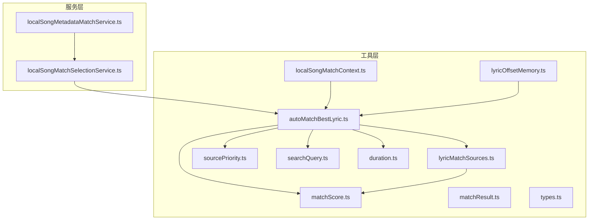
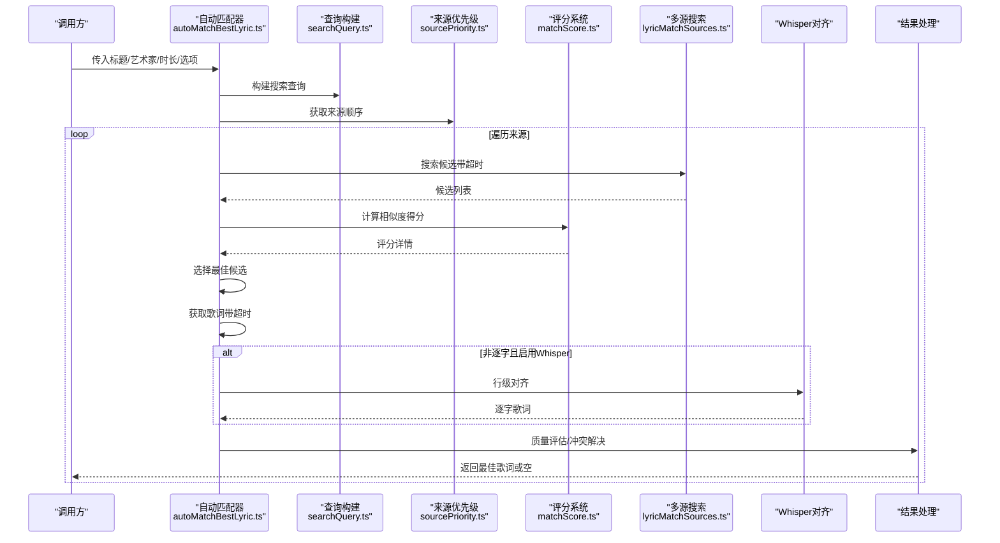
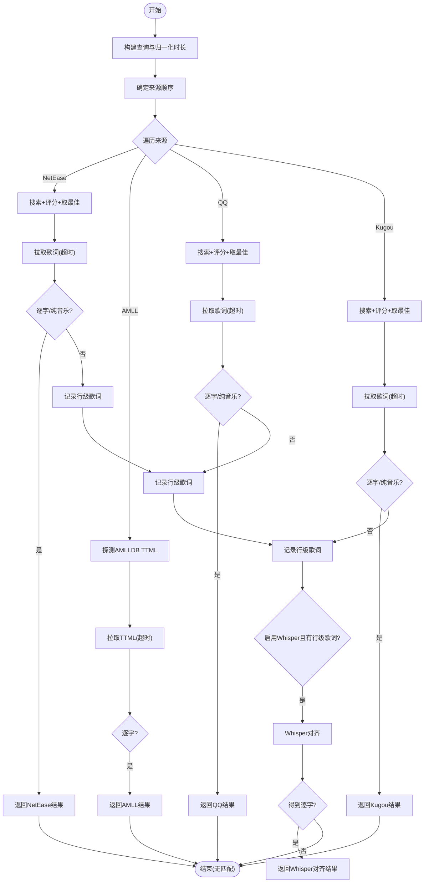
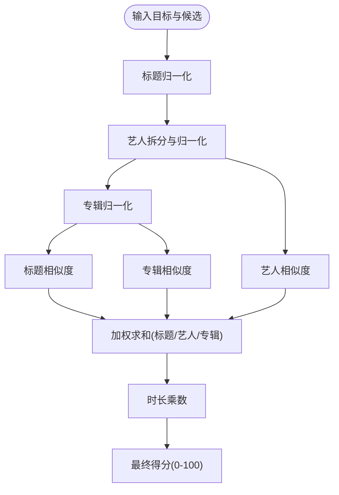
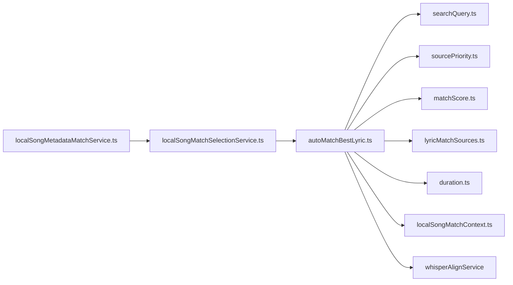

# 智能歌词匹配

<cite>
**本文引用的文件**
- [autoMatchBestLyric.ts](file://src/utils/lyrics/autoMatchBestLyric.ts)
- [matchScore.ts](file://src/utils/lyrics/matchScore.ts)
- [lyricMatchSources.ts](file://src/utils/lyrics/lyricMatchSources.ts)
- [sourcePriority.ts](file://src/utils/lyrics/sourcePriority.ts)
- [searchQuery.ts](file://src/utils/lyrics/searchQuery.ts)
- [duration.ts](file://src/utils/lyrics/duration.ts)
- [matchResult.ts](file://src/utils/lyrics/matchResult.ts)
- [types.ts](file://src/utils/lyrics/types.ts)
- [localSongMatchContext.ts](file://src/utils/lyrics/localSongMatchContext.ts)
- [lyricOffsetMemory.ts](file://src/utils/lyrics/lyricOffsetMemory.ts)
- [localSongMatchSelectionService.ts](file://src/services/localSongMatchSelectionService.ts)
- [localSongMetadataMatchService.ts](file://src/services/localSongMetadataMatchService.ts)
</cite>

## 目录
1. [简介](#简介)
2. [项目结构](#项目结构)
3. [核心组件](#核心组件)
4. [架构总览](#架构总览)
5. [详细组件分析](#详细组件分析)
6. [依赖关系分析](#依赖关系分析)
7. [性能与缓存](#性能与缓存)
8. [故障排查指南](#故障排查指南)
9. [结论](#结论)
10. [附录](#附录)

## 简介
本技术文档围绕 Folia Player 的智能歌词匹配系统，系统性阐述基于歌曲元数据的自动匹配算法、多源歌词搜索策略、评分与排序机制、结果处理流程、上下文管理与批量/增量更新能力，以及性能优化与缓存策略。目标是帮助开发者快速理解并扩展该子系统，确保在大规模音乐库场景下的高效、稳定匹配体验。

## 项目结构
歌词匹配相关代码集中在 utils/lyrics 与服务层 services 中，采用“工具函数 + 服务编排”的分层组织：
- 工具层（utils/lyrics）：负责查询构建、相似度计算、来源优先级、结果标准化、时长归一化等。
- 服务层（services）：负责本地歌曲的元数据/封面/歌词选择与应用、批量匹配编排、状态回写。
- 类型与中间态（types、matchResult）：统一数据结构与标签映射，便于跨模块协作。

图表来源
- [autoMatchBestLyric.ts:1-582](file://src/utils/lyrics/autoMatchBestLyric.ts#L1-L582)
- [matchScore.ts:1-219](file://src/utils/lyrics/matchScore.ts#L1-L219)
- [lyricMatchSources.ts:1-176](file://src/utils/lyrics/lyricMatchSources.ts#L1-L176)
- [sourcePriority.ts:1-31](file://src/utils/lyrics/sourcePriority.ts#L1-L31)
- [searchQuery.ts:1-72](file://src/utils/lyrics/searchQuery.ts#L1-L72)
- [duration.ts:1-17](file://src/utils/lyrics/duration.ts#L1-L17)
- [matchResult.ts:1-42](file://src/utils/lyrics/matchResult.ts#L1-L42)
- [types.ts:1-103](file://src/utils/lyrics/types.ts#L1-L103)
- [localSongMatchContext.ts:1-73](file://src/utils/lyrics/localSongMatchContext.ts#L1-L73)
- [lyricOffsetMemory.ts:1-96](file://src/utils/lyrics/lyricOffsetMemory.ts#L1-L96)
- [localSongMatchSelectionService.ts:1-118](file://src/services/localSongMatchSelectionService.ts#L1-L118)
- [localSongMetadataMatchService.ts:1-116](file://src/services/localSongMetadataMatchService.ts#L1-L116)

章节来源
- [autoMatchBestLyric.ts:1-582](file://src/utils/lyrics/autoMatchBestLyric.ts#L1-L582)
- [lyricMatchSources.ts:1-176](file://src/utils/lyrics/lyricMatchSources.ts#L1-L176)
- [sourcePriority.ts:1-31](file://src/utils/lyrics/sourcePriority.ts#L1-L31)
- [searchQuery.ts:1-72](file://src/utils/lyrics/searchQuery.ts#L1-L72)
- [duration.ts:1-17](file://src/utils/lyrics/duration.ts#L1-L17)
- [matchResult.ts:1-42](file://src/utils/lyrics/matchResult.ts#L1-L42)
- [types.ts:1-103](file://src/utils/lyrics/types.ts#L1-L103)
- [localSongMatchContext.ts:1-73](file://src/utils/lyrics/localSongMatchContext.ts#L1-L73)
- [lyricOffsetMemory.ts:1-96](file://src/utils/lyrics/lyricOffsetMemory.ts#L1-L96)
- [localSongMatchSelectionService.ts:1-118](file://src/services/localSongMatchSelectionService.ts#L1-L118)
- [localSongMetadataMatchService.ts:1-116](file://src/services/localSongMetadataMatchService.ts#L1-L116)

## 核心组件
- 自动匹配主流程：按来源优先级依次尝试 NetEase、AMLLDB、QQ、Kugou，并在必要时使用 Whisper 进行行级对齐以生成逐字时间轴。
- 评分系统：对标题、艺术家、专辑、时长进行加权相似度计算，支持繁简转换、罗马音归一、版本标记过滤、模糊包含匹配等。
- 多源搜索策略：可配置首选来源；支持精确候选加速（metadataCandidate）；为各来源设置超时保护。
- 结果处理：候选排序、质量评估（纯音乐识别、逐字判定）、冲突解决（优先返回高质量逐字歌词）。
- 上下文管理：从本地歌曲元数据构建匹配上下文，支持增量刷新与批量处理。
- 性能优化：并发控制、超时降级、最小候选集、缓存偏移记忆、覆盖图缓存等。

章节来源
- [autoMatchBestLyric.ts:1-582](file://src/utils/lyrics/autoMatchBestLyric.ts#L1-L582)
- [matchScore.ts:1-219](file://src/utils/lyrics/matchScore.ts#L1-L219)
- [lyricMatchSources.ts:1-176](file://src/utils/lyrics/lyricMatchSources.ts#L1-L176)
- [sourcePriority.ts:1-31](file://src/utils/lyrics/sourcePriority.ts#L1-L31)
- [searchQuery.ts:1-72](file://src/utils/lyrics/searchQuery.ts#L1-L72)
- [duration.ts:1-17](file://src/utils/lyrics/duration.ts#L1-L17)
- [localSongMatchContext.ts:1-73](file://src/utils/lyrics/localSongMatchContext.ts#L1-L73)
- [lyricOffsetMemory.ts:1-96](file://src/utils/lyrics/lyricOffsetMemory.ts#L1-L96)

## 架构总览
下图展示自动匹配的主控流程与各子系统的交互关系。

图表来源
- [autoMatchBestLyric.ts:1-582](file://src/utils/lyrics/autoMatchBestLyric.ts#L1-L582)
- [searchQuery.ts:1-72](file://src/utils/lyrics/searchQuery.ts#L1-L72)
- [sourcePriority.ts:1-31](file://src/utils/lyrics/sourcePriority.ts#L1-L31)
- [matchScore.ts:1-219](file://src/utils/lyrics/matchScore.ts#L1-L219)
- [lyricMatchSources.ts:1-176](file://src/utils/lyrics/lyricMatchSources.ts#L1-L176)

## 详细组件分析

### 自动匹配主流程（autoMatchBestLyric）
- 输入：标题、艺术家、时长、可选专辑、首选来源、精确候选、是否仅精确匹配、预置候选、Whisper开关等。
- 关键步骤：
  - 构建搜索查询与归一化时长。
  - 根据偏好与基础顺序确定来源遍历顺序。
  - 对每个来源执行“搜索候选 → 评分排序 → 取最佳 → 拉取歌词 → 质量判断”的闭环。
  - 若未获得逐字歌词且满足条件，则尝试 Whisper 将行级歌词对齐为逐字。
  - 对 NetEase/QQ/Kugou 分别做超时保护，避免慢源阻塞整体流程。
  - 对合唱段落进行后处理增强（如 Netease 合唱区间注入）。
- 输出：最佳逐字歌词或纯音乐标记，或无匹配。

图表来源
- [autoMatchBestLyric.ts:1-582](file://src/utils/lyrics/autoMatchBestLyric.ts#L1-L582)

章节来源
- [autoMatchBestLyric.ts:1-582](file://src/utils/lyrics/autoMatchBestLyric.ts#L1-L582)

### 评分系统（matchScore）
- 文本归一化：繁转简、罗马音转换、去标点符号、去除多余空格。
- 标题匹配：去除 feat/ft、伴奏/混音等版本标记，再进行相似度比较。
- 艺术家匹配：拆分多艺人，主艺人命中加分，结合 token 相似度与字符串包含关系。
- 专辑匹配：仅在双方均存在时计算相似度。
- 时长匹配：按差值分段给予乘数，并标记是否“时长匹配”。
- 综合得分：标题/艺人/专辑权重相加，再乘以时长乘数，最终截断到 0-100。
- 复杂度：主要受字符串集合操作影响，近似 O(n+m)，n/m 为字符集大小。

图表来源
- [matchScore.ts:1-219](file://src/utils/lyrics/matchScore.ts#L1-L219)

章节来源
- [matchScore.ts:1-219](file://src/utils/lyrics/matchScore.ts#L1-L219)

### 多源搜索策略（lyricMatchSources）
- 支持来源：netease、amll、qq、kugou、whisper。
- 手动搜索：除 amll、whisper 外均可作为手动搜索入口。
- AMLLDB 探测：并行检索 NetEase/QQ 候选，筛选高置信度（标题命中、身份字段命中、时长不冲突），最多探测若干候选，限制结果数量。
- 统一排序：所有来源搜索结果均通过评分系统进行排序，保证一致性。

章节来源
- [lyricMatchSources.ts:1-176](file://src/utils/lyrics/lyricMatchSources.ts#L1-L176)

### 来源优先级（sourcePriority）
- 默认首选来源为 qq。
- 基础顺序：netease → amll → qq → kugou → whisper。
- 用户偏好会被置于首位，同时保留其余来源各一次，避免重复。

章节来源
- [sourcePriority.ts:1-31](file://src/utils/lyrics/sourcePriority.ts#L1-L31)

### 查询构建（searchQuery）
- 标题规范化：当提供者已提供艺人信息时，移除“艺人-标题”前缀中的重复艺人部分。
- 专辑规范化：裁剪过长专辑名，去除目录备注与演职人员信息片段，提升搜索命中率。
- 组合查询：将标题、艺人、专辑三段用分隔符拼接，形成结构化查询串。

章节来源
- [searchQuery.ts:1-72](file://src/utils/lyrics/searchQuery.ts#L1-L72)

### 时长归一化（duration）
- 防御性处理：将异常大数值视为秒单位并转换为毫秒；无效值归零。
- 目的：确保评分与阈值判断的一致性。

章节来源
- [duration.ts:1-17](file://src/utils/lyrics/duration.ts#L1-L17)

### 结果标准化与标签（matchResult）
- 来源标签：根据来源与平台（如 AMLLDB 平台）生成友好显示名称。
- 元数据提取：艺人、专辑、封面 URL 等统一提取与 HTTPS 强制。
- 封面支持：判断某来源是否可提供封面。

章节来源
- [matchResult.ts:1-42](file://src/utils/lyrics/matchResult.ts#L1-L42)

### 本地歌曲匹配上下文（localSongMatchContext）
- 构建上下文：从本地歌曲文件名、在线元数据、导入元数据推导标题、艺人、专辑、时长。
- 精确候选加速：若已有选定的在线元数据标识，可作为精确候选用于跳过部分搜索。
- 自动匹配触发：依据 noAutoMatch 标志与是否存在精确候选决定是否需要自动匹配。
- 增量刷新：针对旧版自动匹配记录，若存在精确候选则触发刷新。

章节来源
- [localSongMatchContext.ts:1-73](file://src/utils/lyrics/localSongMatchContext.ts#L1-L73)

### 歌词时间轴偏移记忆（lyricOffsetMemory）
- 功能：按歌曲键持久化用户手动调整的时间轴偏移，下次播放时恢复。
- 存储：localStorage 单 JSON Map，内存 Map 维护 LRU 顺序，超限丢弃最旧项。
- 健壮性：读写失败静默降级，不影响播放路径。

章节来源
- [lyricOffsetMemory.ts:1-96](file://src/utils/lyrics/lyricOffsetMemory.ts#L1-L96)

### 服务层：选择与应用（localSongMatchSelectionService）
- 选择契约：支持在线/本地/内嵌/自动/保持等多种歌词与封面选择策略。
- 应用逻辑：根据选择写入本地歌曲对象，标记来源、平台、纯音乐等，并决定是否禁用后续自动匹配。
- 封面缓存：在线封面尝试缓存，内嵌封面时清除缓存。

章节来源
- [localSongMatchSelectionService.ts:1-118](file://src/services/localSongMatchSelectionService.ts#L1-L118)

### 服务层：批量与增量（localSongMetadataMatchService）
- 单条应用：封装选择服务，支持自动/手动模式与来源保护。
- 批量处理：并发度可控（默认2），实时回调进度，支持中断信号。
- 状态上报：matched/no-match/skipped/failed 等状态即时反馈。

章节来源
- [localSongMetadataMatchService.ts:1-116](file://src/services/localSongMetadataMatchService.ts#L1-L116)

## 依赖关系分析
- autoMatchBestLyric 依赖：
  - searchQuery 构建查询
  - sourcePriority 确定来源顺序
  - matchScore 评分与排序
  - lyricMatchSources 多源搜索与 AMLLDB 探测
  - duration 时长归一化
  - localSongMatchContext 上下文构建
  - whisperAlignService 行级对齐（外部服务）
- 服务层依赖：
  - localSongMatchSelectionService 应用选择结果
  - localSongMetadataMatchService 批量编排与状态上报

图表来源
- [autoMatchBestLyric.ts:1-582](file://src/utils/lyrics/autoMatchBestLyric.ts#L1-L582)
- [searchQuery.ts:1-72](file://src/utils/lyrics/searchQuery.ts#L1-L72)
- [sourcePriority.ts:1-31](file://src/utils/lyrics/sourcePriority.ts#L1-L31)
- [matchScore.ts:1-219](file://src/utils/lyrics/matchScore.ts#L1-L219)
- [lyricMatchSources.ts:1-176](file://src/utils/lyrics/lyricMatchSources.ts#L1-L176)
- [duration.ts:1-17](file://src/utils/lyrics/duration.ts#L1-L17)
- [localSongMatchContext.ts:1-73](file://src/utils/lyrics/localSongMatchContext.ts#L1-L73)
- [localSongMatchSelectionService.ts:1-118](file://src/services/localSongMatchSelectionService.ts#L1-L118)
- [localSongMetadataMatchService.ts:1-116](file://src/services/localSongMetadataMatchService.ts#L1-L116)

章节来源
- [autoMatchBestLyric.ts:1-582](file://src/utils/lyrics/autoMatchBestLyric.ts#L1-L582)
- [lyricMatchSources.ts:1-176](file://src/utils/lyrics/lyricMatchSources.ts#L1-L176)
- [localSongMatchSelectionService.ts:1-118](file://src/services/localSongMatchSelectionService.ts#L1-L118)
- [localSongMetadataMatchService.ts:1-116](file://src/services/localSongMetadataMatchService.ts#L1-L116)

## 性能与缓存
- 并发与超时：
  - 各来源搜索与拉取均设置超时，防止慢源阻塞整体匹配。
  - 最大候选集限制，减少不必要的网络请求与计算。
- 评分与排序：
  - 使用轻量字符串集合相似度与分词包含匹配，降低计算开销。
  - 时长乘数快速衰减低质量候选。
- 上下文与精确候选：
  - 通过 metadataCandidate 直接定位候选，减少搜索范围。
  - 本地歌曲上下文复用，避免重复解析。
- 偏移记忆：
  - 每首歌的歌词时间轴偏移持久化，避免重复校准。
- 建议：
  - 在大规模库场景下，优先启用精确候选与来源优先级优化。
  - 合理设置超时与并发度，平衡响应速度与成功率。
  - 对频繁访问的来源增加缓存层（如最近匹配结果缓存）以降低重复请求。

[本节为通用性能指导，不直接分析具体文件]

## 故障排查指南
- 无匹配结果：
  - 检查标题/艺人/专辑是否有效，确认查询构建是否正确。
  - 查看来源优先级与超时设置，确认各来源是否被正确访问。
  - 检查评分阈值与时长匹配，必要时放宽约束。
- 纯音乐误判：
  - 确认来源返回的纯音乐标记是否准确，必要时切换来源或关闭自动匹配。
- Whisper 对齐失败：
  - 确认已启用且存在行级歌词，检查音频资源与对齐服务可用性。
- 批量任务卡顿：
  - 降低并发度，检查上游服务响应与错误重试策略。
- 偏移记忆丢失：
  - 检查 localStorage 权限与存储空间，确认写入路径未被拦截。

章节来源
- [autoMatchBestLyric.ts:1-582](file://src/utils/lyrics/autoMatchBestLyric.ts#L1-L582)
- [lyricOffsetMemory.ts:1-96](file://src/utils/lyrics/lyricOffsetMemory.ts#L1-L96)

## 结论
Folia Player 的智能歌词匹配系统通过严谨的评分模型、灵活的多源搜索策略、健壮的超时与并发控制，以及完善的上下文与批量处理能力，实现了在高并发、大规模音乐库场景下的高可用匹配体验。结合 Whisper 对齐与合唱段落增强，进一步提升了逐字歌词的质量与可用性。建议在部署与使用中结合业务需求调优来源优先级、超时阈值与并发度，以获得最佳性能与稳定性。

[本节为总结性内容，不直接分析具体文件]

## 附录
- 类型定义参考：
  - 歌词处理选项、原始歌词来源、歌词工作人员策略等见 types.ts。
- 结果标签与元数据：
  - 来源标签、艺人/专辑/封面提取见 matchResult.ts。

章节来源
- [types.ts:1-103](file://src/utils/lyrics/types.ts#L1-L103)
- [matchResult.ts:1-42](file://src/utils/lyrics/matchResult.ts#L1-L42)