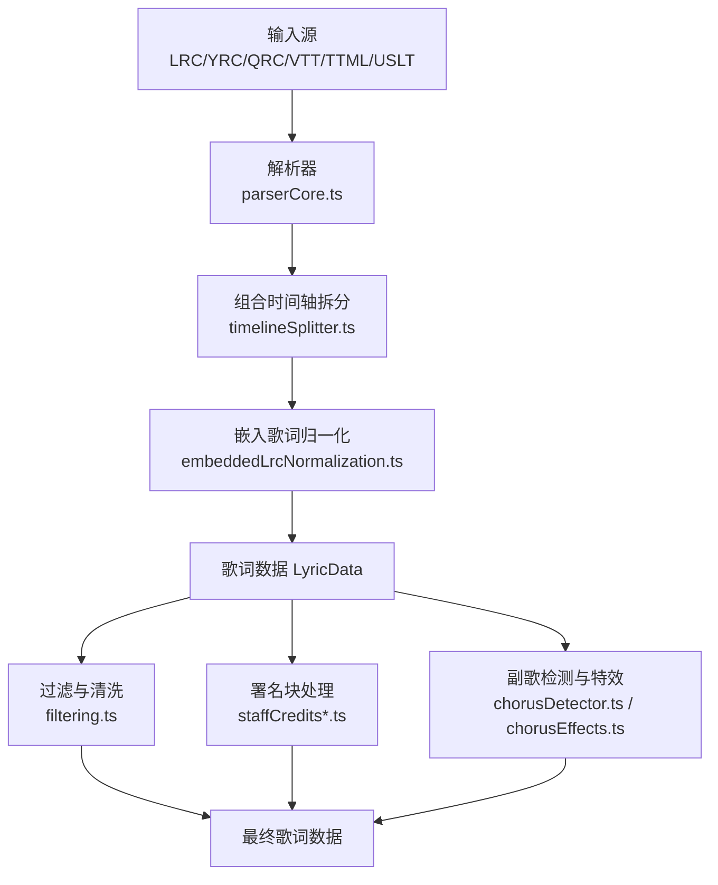
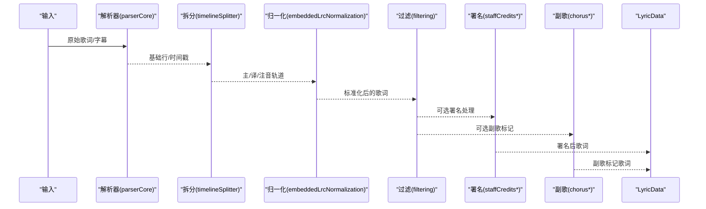
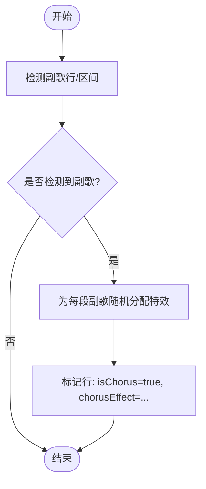
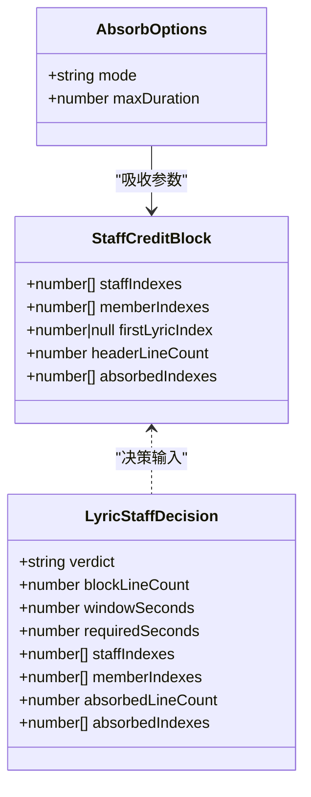
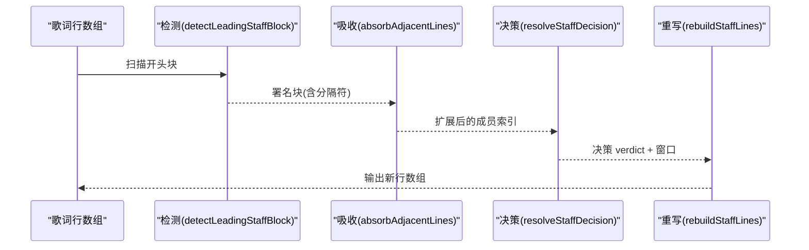
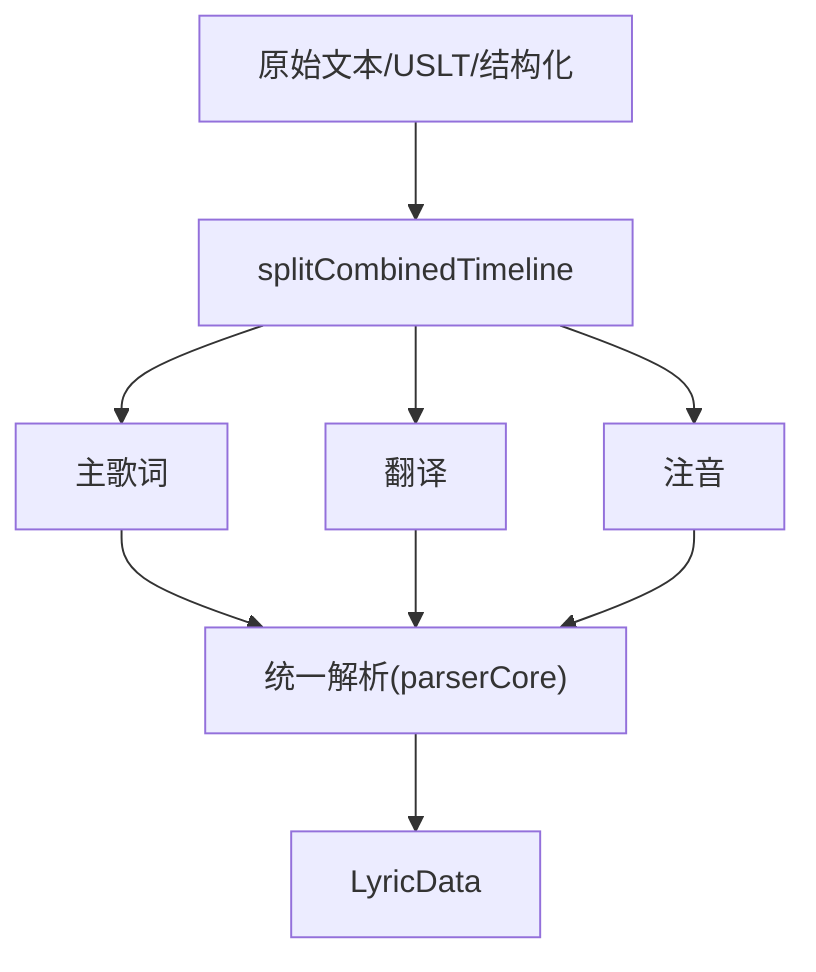
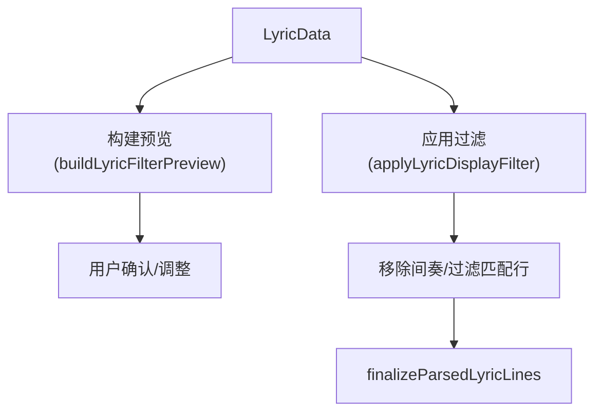
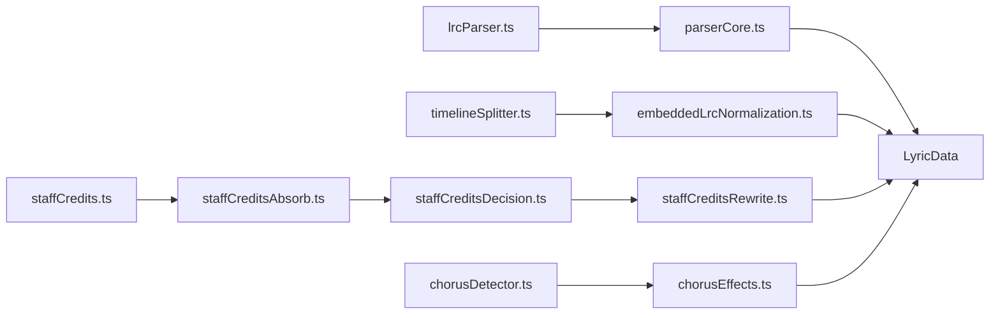

# 歌词处理与增强

<cite>
**本文引用的文件**
- [src/utils/lyrics/types.ts](file://src/utils/lyrics/types.ts)
- [src/utils/lyrics/parserCore.ts](file://src/utils/lyrics/parserCore.ts)
- [src/utils/lyrics/timelineSplitter.ts](file://src/utils/lyrics/timelineSplitter.ts)
- [src/utils/lyrics/embeddedLrcNormalization.ts](file://src/utils/lyrics/embeddedLrcNormalization.ts)
- [src/utils/lyrics/filtering.ts](file://src/utils/lyrics/filtering.ts)
- [src/utils/lyrics/staffCredits.ts](file://src/utils/lyrics/staffCredits.ts)
- [src/utils/lyrics/staffCreditsAbsorb.ts](file://src/utils/lyrics/staffCreditsAbsorb.ts)
- [src/utils/lyrics/staffCreditsDecision.ts](file://src/utils/lyrics/staffCreditsDecision.ts)
- [src/utils/lyrics/staffCreditsRewrite.ts](file://src/utils/lyrics/staffCreditsRewrite.ts)
- [src/utils/chorusDetector.ts](file://src/utils/chorusDetector.ts)
- [src/utils/lyrics/chorusEffects.ts](file://src/utils/lyrics/chorusEffects.ts)
- [src/utils/lrcParser.ts](file://src/utils/lrcParser.ts)
</cite>

## 目录
1. [简介](#简介)
2. [项目结构](#项目结构)
3. [核心组件](#核心组件)
4. [架构总览](#架构总览)
5. [详细组件分析](#详细组件分析)
6. [依赖关系分析](#依赖关系分析)
7. [性能考量](#性能考量)
8. [故障排查指南](#故障排查指南)
9. [结论](#结论)
10. [附录](#附录)

## 简介
本技术文档聚焦 Folia Player 的“歌词处理与增强系统”，围绕以下目标展开：
- 合唱效果处理系统：副歌识别、高亮显示、视觉特效（条状/圆形/光束）等。
- 人员信息管理系统：歌手、作词、作曲等署名信息的识别、合并与标准化，以及前奏时间预算下的展示/隐藏/重排策略。
- 歌词规范化流程：嵌入式 LRC 解析、多格式转换、元数据提取、翻译/注音分离。
- 歌词过滤与清洗：去除无效内容、修复格式错误、统一编码与时间轴。
- 歌词增强工具：自动补全、错别字修正、标点优化（以现有能力为边界说明可落地点）。
- 性能优化策略：在大量歌词场景下的高效与稳定。

## 项目结构
歌词子系统位于 src/utils/lyrics 及相关工具模块中，采用“解析-归一-增强-渲染”的分层组织方式：
- 解析层：parserCore.ts 提供 LRC/YRC/QRC/VTT/TTML 等多格式解析；timelineSplitter.ts 负责组合时间轴拆分主词/译词/注音。
- 归一层：embeddedLrcNormalization.ts 将 USLT/结构化歌词转为标准主译双轨 LRC。
- 增强层：staffCredits* 系列实现署名块识别与时间预算决策；chorusDetector.ts + chorusEffects.ts 实现副歌检测与视觉标记。
- 过滤层：filtering.ts 提供正则过滤预览与应用。
- 入口封装：lrcParser.ts 暴露简洁 API。

**图表来源**
- [src/utils/lyrics/parserCore.ts:406-465](file://src/utils/lyrics/parserCore.ts#L406-L465)
- [src/utils/lyrics/timelineSplitter.ts:10-115](file://src/utils/lyrics/timelineSplitter.ts#L10-L115)
- [src/utils/lyrics/embeddedLrcNormalization.ts:40-85](file://src/utils/lyrics/embeddedLrcNormalization.ts#L40-L85)
- [src/utils/lyrics/filtering.ts:86-105](file://src/utils/lyrics/filtering.ts#L86-L105)
- [src/utils/lyrics/staffCredits.ts:162-260](file://src/utils/lyrics/staffCredits.ts#L162-L260)
- [src/utils/lyrics/chorusEffects.ts:7-38](file://src/utils/lyrics/chorusEffects.ts#L7-L38)

**章节来源**
- [src/utils/lyrics/parserCore.ts:406-465](file://src/utils/lyrics/parserCore.ts#L406-L465)
- [src/utils/lyrics/timelineSplitter.ts:10-115](file://src/utils/lyrics/timelineSplitter.ts#L10-L115)
- [src/utils/lyrics/embeddedLrcNormalization.ts:40-85](file://src/utils/lyrics/embeddedLrcNormalization.ts#L40-L85)
- [src/utils/lyrics/filtering.ts:86-105](file://src/utils/lyrics/filtering.ts#L86-L105)
- [src/utils/lyrics/staffCredits.ts:162-260](file://src/utils/lyrics/staffCredits.ts#L162-L260)
- [src/utils/lyrics/chorusEffects.ts:7-38](file://src/utils/lyrics/chorusEffects.ts#L7-L38)

## 核心组件
- 多格式解析器：支持 LRC/YRC/QRC/VTT/TTML，并输出统一的 Line/LyricData 结构，附带 words、translation、romanization 等富信息。
- 组合时间轴拆分：从同一时间戳的多行文本中分离主歌词、翻译、注音。
- 嵌入歌词归一化：将 USLT/结构化歌词转换为标准主译双轨 LRC。
- 署名块管理：识别开头制作人员块，结合前奏时间预算决定 keep/retime/hide，并可吸收相邻短时长行。
- 副歌检测与特效：基于重复频率识别副歌行，或按时间范围匹配，并为每段副歌随机分配视觉特效。
- 过滤与清洗：通过正则过滤无效行，移除间奏占位，确保渲染一致性。

**章节来源**
- [src/utils/lyrics/parserCore.ts:406-465](file://src/utils/lyrics/parserCore.ts#L406-L465)
- [src/utils/lyrics/timelineSplitter.ts:10-115](file://src/utils/lyrics/timelineSplitter.ts#L10-L115)
- [src/utils/lyrics/embeddedLrcNormalization.ts:40-85](file://src/utils/lyrics/embeddedLrcNormalization.ts#L40-L85)
- [src/utils/lyrics/staffCredits.ts:162-260](file://src/utils/lyrics/staffCredits.ts#L162-L260)
- [src/utils/lyrics/chorusEffects.ts:7-38](file://src/utils/lyrics/chorusEffects.ts#L7-L38)
- [src/utils/lyrics/filtering.ts:86-105](file://src/utils/lyrics/filtering.ts#L86-L105)

## 架构总览
下图展示了歌词从原始输入到最终渲染的关键路径，包括解析、归一、增强、过滤与可视化标记。

**图表来源**
- [src/utils/lyrics/parserCore.ts:406-465](file://src/utils/lyrics/parserCore.ts#L406-L465)
- [src/utils/lyrics/timelineSplitter.ts:10-115](file://src/utils/lyrics/timelineSplitter.ts#L10-L115)
- [src/utils/lyrics/embeddedLrcNormalization.ts:40-85](file://src/utils/lyrics/embeddedLrcNormalization.ts#L40-L85)
- [src/utils/lyrics/filtering.ts:86-105](file://src/utils/lyrics/filtering.ts#L86-L105)
- [src/utils/lyrics/staffCredits.ts:162-260](file://src/utils/lyrics/staffCredits.ts#L162-L260)
- [src/utils/lyrics/chorusEffects.ts:7-38](file://src/utils/lyrics/chorusEffects.ts#L7-L38)

## 详细组件分析

### 合唱效果处理系统
- 副歌识别
  - 文本频率法：对 LRC 文本去时间戳后统计行频，取最高频作为副歌候选。
  - 时间区间法：使用外部提供的起止时间范围，与歌词行时间重叠即判定为副歌。
- 视觉特效
  - 为每个副歌段落随机分配三种特效之一：bars/circles/beams，用于前端可视化高亮。
- 集成点
  - 与 LyricData.lines 中的 isChorus、chorusEffect 字段联动，供可视化层消费。

**图表来源**
- [src/utils/chorusDetector.ts:5-51](file://src/utils/chorusDetector.ts#L5-L51)
- [src/utils/lyrics/chorusEffects.ts:7-38](file://src/utils/lyrics/chorusEffects.ts#L7-L38)
- [src/utils/lyrics/chorusEffects.ts:46-93](file://src/utils/lyrics/chorusEffects.ts#L46-L93)

**章节来源**
- [src/utils/chorusDetector.ts:5-51](file://src/utils/chorusDetector.ts#L5-L51)
- [src/utils/lyrics/chorusEffects.ts:7-38](file://src/utils/lyrics/chorusEffects.ts#L7-L38)
- [src/utils/lyrics/chorusEffects.ts:46-93](file://src/utils/lyrics/chorusEffects.ts#L46-L93)

### 人员信息管理系统（署名块）
- 识别策略
  - 内置角色词表 + 英文别名，配合“冒号+短前缀”的结构约束，仅作用于开头块。
  - 允许跳过标题行等头部干扰，保证鲁棒性。
- 吸收相邻短行
  - 根据“每行最少停留”阈值，把紧邻署名块的短时长行并入块，避免碎片化显示。
- 时间预算决策
  - 计算前奏可用秒数与所需秒数（含尾部缓冲），决定 keep（保留）、retime（摊开重排）、hide（整块隐藏）。
- 重写输出
  - retime 模式下，将署名行均匀摊开到前奏窗口，并对 words/syllables/ruby/背景人声等子结构同步重映射时间。

**图表来源**
- [src/utils/lyrics/staffCredits.ts:87-101](file://src/utils/lyrics/staffCredits.ts#L87-L101)
- [src/utils/lyrics/types.ts:31-47](file://src/utils/lyrics/types.ts#L31-L47)
- [src/utils/lyrics/staffCreditsAbsorb.ts:9-13](file://src/utils/lyrics/staffCreditsAbsorb.ts#L9-L13)

**图表来源**
- [src/utils/lyrics/staffCredits.ts:162-260](file://src/utils/lyrics/staffCredits.ts#L162-L260)
- [src/utils/lyrics/staffCreditsAbsorb.ts:45-100](file://src/utils/lyrics/staffCreditsAbsorb.ts#L45-L100)
- [src/utils/lyrics/staffCreditsDecision.ts:23-66](file://src/utils/lyrics/staffCreditsDecision.ts#L23-L66)
- [src/utils/lyrics/staffCreditsRewrite.ts:67-102](file://src/utils/lyrics/staffCreditsRewrite.ts#L67-L102)

**章节来源**
- [src/utils/lyrics/staffCredits.ts:162-260](file://src/utils/lyrics/staffCredits.ts#L162-L260)
- [src/utils/lyrics/staffCreditsAbsorb.ts:45-100](file://src/utils/lyrics/staffCreditsAbsorb.ts#L45-L100)
- [src/utils/lyrics/staffCreditsDecision.ts:23-66](file://src/utils/lyrics/staffCreditsDecision.ts#L23-L66)
- [src/utils/lyrics/staffCreditsRewrite.ts:67-102](file://src/utils/lyrics/staffCreditsRewrite.ts#L67-L102)

### 歌词规范化流程
- 组合时间轴拆分
  - 识别共享时间戳的行组，区分主歌词、翻译、注音（拉丁字符占比高且无中日韩脚本时视为注音）。
- 嵌入歌词归一化
  - 从 USLT 标签或结构化歌词中提取主/译，生成标准 LRC 文本，便于后续统一解析。
- 元数据提取
  - 解析 ti/ar 等元数据，并在增强 LRC 中保留精确字级时间戳。

**图表来源**
- [src/utils/lyrics/timelineSplitter.ts:10-115](file://src/utils/lyrics/timelineSplitter.ts#L10-L115)
- [src/utils/lyrics/embeddedLrcNormalization.ts:40-85](file://src/utils/lyrics/embeddedLrcNormalization.ts#L40-L85)
- [src/utils/lyrics/parserCore.ts:406-465](file://src/utils/lyrics/parserCore.ts#L406-L465)

**章节来源**
- [src/utils/lyrics/timelineSplitter.ts:10-115](file://src/utils/lyrics/timelineSplitter.ts#L10-L115)
- [src/utils/lyrics/embeddedLrcNormalization.ts:40-85](file://src/utils/lyrics/embeddedLrcNormalization.ts#L40-L85)
- [src/utils/lyrics/parserCore.ts:406-465](file://src/utils/lyrics/parserCore.ts#L406-L465)

### 歌词过滤与清洗机制
- 正则过滤
  - 提供预览与实际应用两种模式，支持错误校验与编译缓存。
- 间奏处理
  - 自动插入“......”占位行表示间奏，可在过滤阶段剔除。
- 渲染提示
  - 最终行附加渲染提示，确保可视化一致。

**图表来源**
- [src/utils/lyrics/filtering.ts:64-105](file://src/utils/lyrics/filtering.ts#L64-L105)
- [src/utils/lyrics/parserCore.ts:121-174](file://src/utils/lyrics/parserCore.ts#L121-L174)

**章节来源**
- [src/utils/lyrics/filtering.ts:64-105](file://src/utils/lyrics/filtering.ts#L64-L105)
- [src/utils/lyrics/parserCore.ts:121-174](file://src/utils/lyrics/parserCore.ts#L121-L174)

### 歌词增强工具（能力边界与建议）
- 已实现
  - 自动对齐与时间轴修复：通过精确时间戳与排序保障时间顺序。
  - 翻译/注音分离：组合时间轴拆分与按时间匹配。
  - 署名块智能处理：keep/retime/hide 与相邻短行吸收。
  - 副歌检测与视觉标记：频率/时间区间驱动。
- 建议扩展（当前未直接实现）
  - 自动补全：可在过滤/归一阶段引入词典或在线服务，对缺失行进行补全。
  - 错别字修正：可在归一后增加拼写检查与替换管线。
  - 标点符号优化：可在词级切分前后做标点规范化（如统一中英文标点）。
  - 以上扩展可与现有 finalizeParsedLyricLines、buildTimedWords 等节点衔接。

[本节为概念性说明，不直接分析具体文件]

## 依赖关系分析
- 低耦合分层：解析、拆分、归一、增强、过滤各自独立，通过 LyricData 接口通信。
- 关键依赖链
  - parserCore.ts 被 lrcParser.ts 封装调用。
  - timelineSplitter.ts 为 embeddedLrcNormalization.ts 提供组合时间轴拆分能力。
  - staffCredits* 系列相互协作完成署名块生命周期。
  - chorusDetector.ts 与 chorusEffects.ts 共同完成副歌检测与标记。

**图表来源**
- [src/utils/lrcParser.ts:1-7](file://src/utils/lrcParser.ts#L1-L7)
- [src/utils/lyrics/parserCore.ts:406-465](file://src/utils/lyrics/parserCore.ts#L406-L465)
- [src/utils/lyrics/timelineSplitter.ts:10-115](file://src/utils/lyrics/timelineSplitter.ts#L10-L115)
- [src/utils/lyrics/embeddedLrcNormalization.ts:40-85](file://src/utils/lyrics/embeddedLrcNormalization.ts#L40-L85)
- [src/utils/lyrics/staffCredits.ts:162-260](file://src/utils/lyrics/staffCredits.ts#L162-L260)
- [src/utils/lyrics/staffCreditsAbsorb.ts:45-100](file://src/utils/lyrics/staffCreditsAbsorb.ts#L45-L100)
- [src/utils/lyrics/staffCreditsDecision.ts:23-66](file://src/utils/lyrics/staffCreditsDecision.ts#L23-L66)
- [src/utils/lyrics/staffCreditsRewrite.ts:67-102](file://src/utils/lyrics/staffCreditsRewrite.ts#L67-L102)
- [src/utils/chorusDetector.ts:5-51](file://src/utils/chorusDetector.ts#L5-L51)
- [src/utils/lyrics/chorusEffects.ts:7-38](file://src/utils/lyrics/chorusEffects.ts#L7-L38)

**章节来源**
- [src/utils/lrcParser.ts:1-7](file://src/utils/lrcParser.ts#L1-L7)
- [src/utils/lyrics/parserCore.ts:406-465](file://src/utils/lyrics/parserCore.ts#L406-L465)
- [src/utils/lyrics/timelineSplitter.ts:10-115](file://src/utils/lyrics/timelineSplitter.ts#L10-L115)
- [src/utils/lyrics/embeddedLrcNormalization.ts:40-85](file://src/utils/lyrics/embeddedLrcNormalization.ts#L40-L85)
- [src/utils/lyrics/staffCredits.ts:162-260](file://src/utils/lyrics/staffCredits.ts#L162-L260)
- [src/utils/lyrics/staffCreditsAbsorb.ts:45-100](file://src/utils/lyrics/staffCreditsAbsorb.ts#L45-L100)
- [src/utils/lyrics/staffCreditsDecision.ts:23-66](file://src/utils/lyrics/staffCreditsDecision.ts#L23-L66)
- [src/utils/lyrics/staffCreditsRewrite.ts:67-102](file://src/utils/lyrics/staffCreditsRewrite.ts#L67-L102)
- [src/utils/chorusDetector.ts:5-51](file://src/utils/chorusDetector.ts#L5-L51)
- [src/utils/lyrics/chorusEffects.ts:7-38](file://src/utils/lyrics/chorusEffects.ts#L7-L38)

## 性能考量
- 解析效率
  - 优先使用单次扫描与正则匹配，避免多次重复解析；对已排序条目减少排序开销。
  - 对复杂格式（如 TTML）借助专用解析器，降低手工解析成本。
- 内存占用
  - 行级处理与惰性拼接，避免一次性加载超大文件导致峰值内存过高。
- 渲染稳定性
  - 通过 finalizeParsedLyricLines 统一附加渲染提示，减少 UI 抖动。
  - 署名块 retime 时对 words/syllables/ruby 等子结构同步缩放，避免错位。
- 可扩展性
  - 模块化设计便于并行化（如批量歌曲的解析/增强流水线）。

[本节提供通用指导，不直接分析具体文件]

## 故障排查指南
- 正则表达式错误
  - filtering.ts 提供 getLyricFilterError 与 compileLyricFilterPattern，用于捕获并返回无效正则的错误信息。
- 署名块误判
  - staffCredits.ts 内置严格约束（冒号+短前缀+位置限制），若需放宽请谨慎调整内置规则或自定义 pattern。
- 副歌识别偏差
  - chorusDetector.ts 基于文本频率，若存在大量重复短句可能影响结果；可改用 applyNeteaseChorusByTime 基于时间区间的方式。
- 时间轴错乱
  - 检查 parserCore.ts 的时间戳解析与排序逻辑；确保输入不含非法时间标记。

**章节来源**
- [src/utils/lyrics/filtering.ts:10-37](file://src/utils/lyrics/filtering.ts#L10-L37)
- [src/utils/lyrics/staffCredits.ts:46-84](file://src/utils/lyrics/staffCredits.ts#L46-L84)
- [src/utils/chorusDetector.ts:5-51](file://src/utils/chorusDetector.ts#L5-L51)
- [src/utils/lyrics/chorusEffects.ts:46-93](file://src/utils/lyrics/chorusEffects.ts#L46-L93)
- [src/utils/lyrics/parserCore.ts:347-404](file://src/utils/lyrics/parserCore.ts#L347-L404)

## 结论
Folia Player 的歌词处理与增强系统以模块化、可配置为核心，覆盖从多格式解析、组合时间轴拆分、嵌入歌词归一，到署名块智能管理与副歌视觉增强全流程。其设计在保证高质量输出的同时，兼顾了性能与稳定性，适合大规模歌词处理与实时播放场景。未来可在自动补全、错别字修正、标点优化等方面进一步扩展，形成更完整的歌词质量提升闭环。

[本节总结性内容，不直接分析具体文件]

## 附录
- 关键类型参考
  - LyricProcessingOptions、LyricStaffPolicy、RawLyricSource 等定义于 types.ts。
- 入口函数
  - lrcParser.ts 暴露 parseLRC，便于上层快速接入。

**章节来源**
- [src/utils/lyrics/types.ts:7-103](file://src/utils/lyrics/types.ts#L7-L103)
- [src/utils/lrcParser.ts:1-7](file://src/utils/lrcParser.ts#L1-L7)