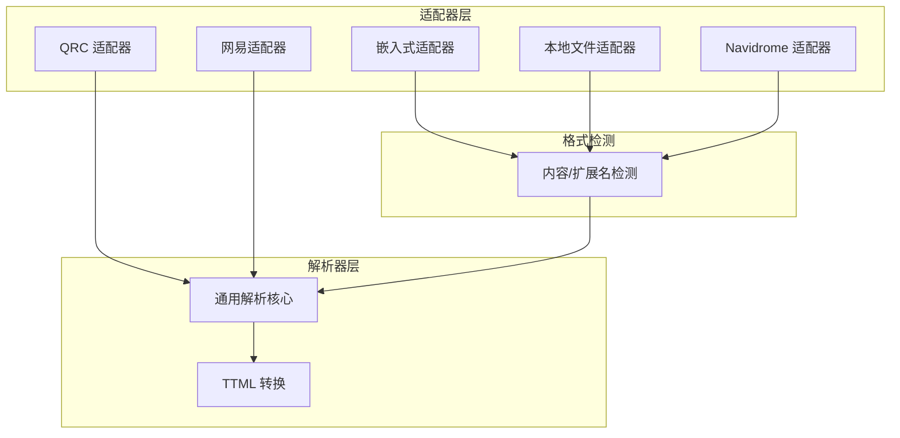
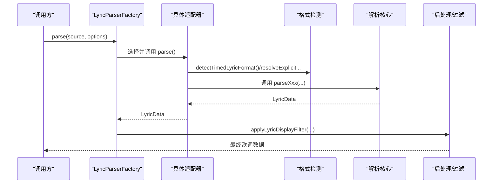
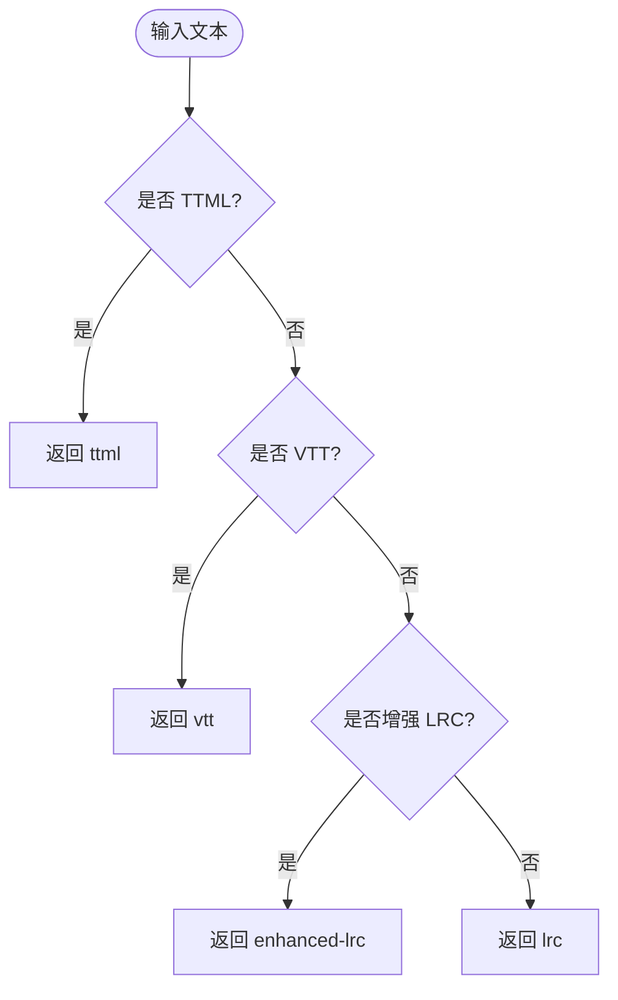
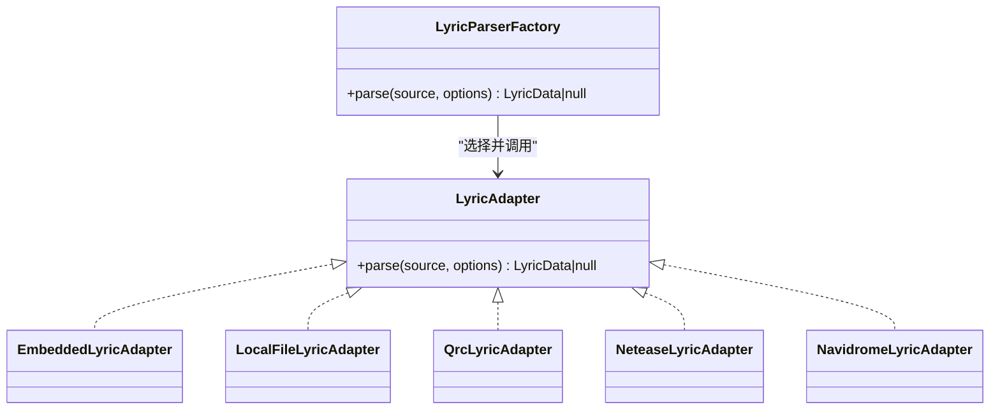
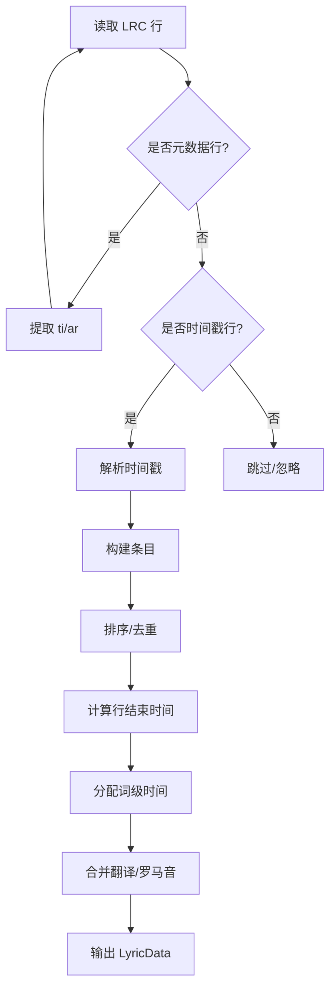
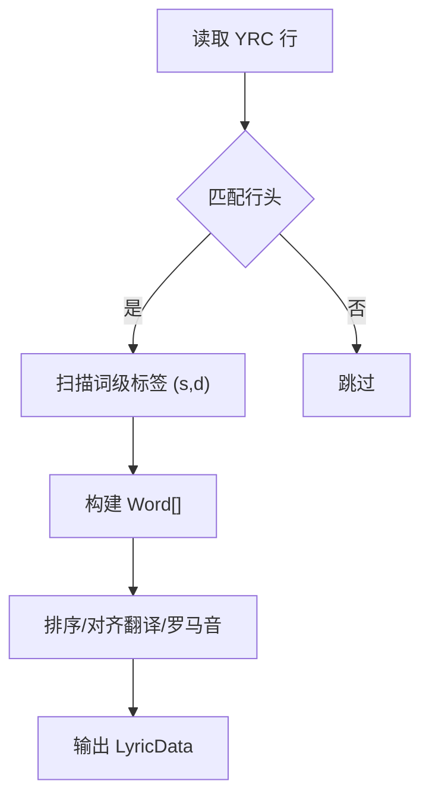
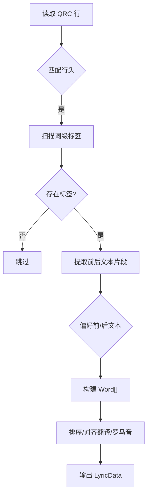
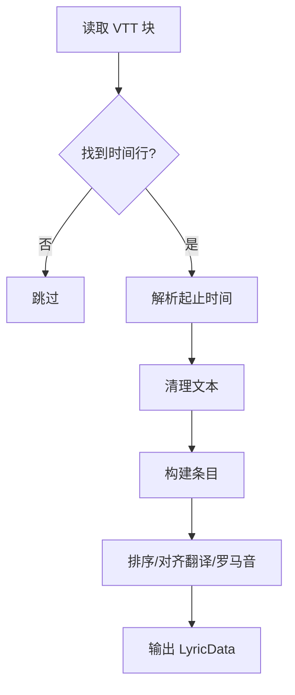
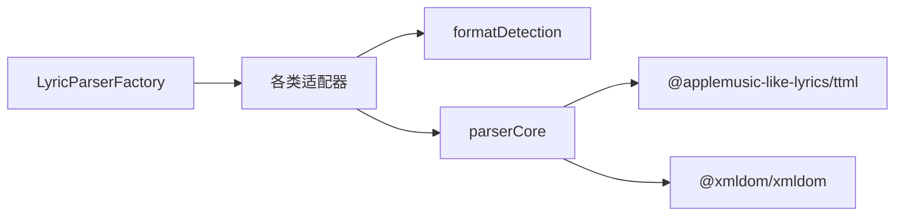

# 歌词格式支持

<cite>
**本文引用的文件**
- [LyricAdapter.ts](file://src/utils/lyrics/LyricAdapter.ts)
- [LyricParserFactory.ts](file://src/utils/lyrics/LyricParserFactory.ts)
- [formatDetection.ts](file://src/utils/lyrics/formatDetection.ts)
- [EmbeddedLyricAdapter.ts](file://src/utils/lyrics/adapters/EmbeddedLyricAdapter.ts)
- [LocalFileLyricAdapter.ts](file://src/utils/lyrics/adapters/LocalFileLyricAdapter.ts)
- [QrcLyricAdapter.ts](file://src/utils/lyrics/adapters/QrcLyricAdapter.ts)
- [NeteaseLyricAdapter.ts](file://src/utils/lyrics/adapters/NeteaseLyricAdapter.ts)
- [NavidromeLyricAdapter.ts](file://src/utils/lyrics/adapters/NavidromeLyricAdapter.ts)
- [types.ts](file://src/utils/lyrics/types.ts)
- [parserCore.ts](file://src/utils/lyrics/parserCore.ts)
- [lrcParser.ts](file://src/utils/lrcParser.ts)
- [yrcParser.ts](file://src/utils/yrcParser.ts)
- [kugouLyricProvider.ts](file://src/utils/lyrics/providers/kugouLyricProvider.ts)
</cite>

## 目录
1. [简介](#简介)
2. [项目结构](#项目结构)
3. [核心组件](#核心组件)
4. [架构总览](#架构总览)
5. [详细组件分析](#详细组件分析)
6. [依赖关系分析](#依赖关系分析)
7. [性能考量](#性能考量)
8. [故障排查指南](#故障排查指南)
9. [结论](#结论)
10. [附录](#附录)

## 简介
本技术文档聚焦 Folia Player 的歌词格式支持能力，系统阐述对 LRC、增强型 LRC、VTT、TTML、YRC、QRC、KRC 等格式的解析与适配机制。文档覆盖：
- 格式检测与自动识别策略
- 统一适配器架构与工厂分发
- 各格式解析器的语法分析、时间戳处理、元数据提取
- 多轨（主歌词、翻译、罗马音）对齐与合并
- 存储组织、格式转换与兼容性处理方案

## 项目结构
歌词子系统位于 src/utils/lyrics 及其子目录，采用“适配器 + 解析器 + 格式检测”的分层设计：
- 适配器层：针对不同来源（嵌入、本地文件、在线服务、加密格式）进行预处理与派发
- 解析器层：按具体格式实现文本到统一歌词结构的转换
- 格式检测：基于内容特征与扩展名推断目标格式
- 工具与类型：统一的歌词数据结构、处理选项、辅助函数

**图示来源**
- [LyricParserFactory.ts:11-38](file://src/utils/lyrics/LyricParserFactory.ts#L11-L38)
- [formatDetection.ts:17-58](file://src/utils/lyrics/formatDetection.ts#L17-L58)
- [parserCore.ts:406-794](file://src/utils/lyrics/parserCore.ts#L406-L794)

**章节来源**
- [LyricParserFactory.ts:11-38](file://src/utils/lyrics/LyricParserFactory.ts#L11-L38)
- [formatDetection.ts:1-58](file://src/utils/lyrics/formatDetection.ts#L1-L58)

## 核心组件
- 统一接口 LyricAdapter：定义 parse(source, options) => Promise<LyricData | null>，屏蔽不同来源差异
- 工厂 LyricParserFactory：根据 RawLyricSource.type 选择对应适配器并应用显示过滤
- 格式检测 formatDetection：基于内容正则与扩展名识别 lrc/enhanced-lrc/vtt/ttml，以及显式扩展名映射 vtt/ttml/qrc/yrc/krc
- 解析核心 parserCore：提供 parseLRC/parseYRC/parseQRC/parseVTT/parseTTML 等，输出统一 Line[] 结构，含 words、translation、romanization
- 专用适配器：
  - EmbeddedLyricAdapter：处理 USLT/内嵌文本，归一化后交由 workerClient 解析
  - LocalFileLyricAdapter：优先提取 awlrc 容器；否则拆分组合时间轴并探测格式
  - QrcLyricAdapter：直接调用 qrc 解析
  - NeteaseLyricAdapter：走网易专用处理流程
  - NavidromeLyricAdapter：结构化歌词与纯文本双路径，均归一到标准时间轴解析

**章节来源**
- [LyricAdapter.ts:4-6](file://src/utils/lyrics/LyricAdapter.ts#L4-L6)
- [LyricParserFactory.ts:11-38](file://src/utils/lyrics/LyricParserFactory.ts#L11-L38)
- [formatDetection.ts:1-58](file://src/utils/lyrics/formatDetection.ts#L1-L58)
- [parserCore.ts:406-794](file://src/utils/lyrics/parserCore.ts#L406-L794)
- [EmbeddedLyricAdapter.ts:8-26](file://src/utils/lyrics/adapters/EmbeddedLyricAdapter.ts#L8-L26)
- [LocalFileLyricAdapter.ts:9-37](file://src/utils/lyrics/adapters/LocalFileLyricAdapter.ts#L9-L37)
- [QrcLyricAdapter.ts:6-11](file://src/utils/lyrics/adapters/QrcLyricAdapter.ts#L6-L11)
- [NeteaseLyricAdapter.ts:6-9](file://src/utils/lyrics/adapters/NeteaseLyricAdapter.ts#L6-L9)
- [NavidromeLyricAdapter.ts:15-72](file://src/utils/lyrics/adapters/NavidromeLyricAdapter.ts#L15-L72)

## 架构总览
歌词处理流水线：
1. 入口：LyricParserFactory.parse(RawLyricSource, options)
2. 选择适配器：embedded/netease/navidrome/local/qrc
3. 适配器预处理：格式探测、内容归一化、容器提取、多轨分离
4. 解析核心：按格式执行解析，生成统一 LyricData（lines[]），包含 word-level 时间戳、翻译、罗马音
5. 后处理：可选插入间奏行、标注渲染提示、应用显示过滤

**图示来源**
- [LyricParserFactory.ts:11-38](file://src/utils/lyrics/LyricParserFactory.ts#L11-L38)
- [formatDetection.ts:17-58](file://src/utils/lyrics/formatDetection.ts#L17-L58)
- [parserCore.ts:406-794](file://src/utils/lyrics/parserCore.ts#L406-L794)

## 详细组件分析

### 格式检测机制
- 内容检测 detectTimedLyricFormat：
  - TTML：匹配根节点与命名空间/属性标记
  - VTT：WEBVTT 头或时间区间行
  - 增强 LRC：尖括号时间戳或带内联时间戳的行
  - 回退为 LRC
- 非 TTML 检测：将 TTML 降级为 LRC 分支
- 显式扩展名映射：vtt/ttml/qrc/yrc/krc

**图示来源**
- [formatDetection.ts:17-58](file://src/utils/lyrics/formatDetection.ts#L17-L58)

**章节来源**
- [formatDetection.ts:1-58](file://src/utils/lyrics/formatDetection.ts#L1-L58)

### 适配器与工厂
- 嵌入式歌词：USLT 标签或文本内容归一化后，通过 workerClient 解析
- 本地文件：优先提取 awlrc 容器（权威数据），否则拆分组合时间轴并探测格式
- QRC：直接解析
- 网易：专用处理管线
- Navidrome：结构化歌词集合/单条/数组/纯文本多种形态，统一归一到标准时间轴

**图示来源**
- [LyricAdapter.ts:4-6](file://src/utils/lyrics/LyricAdapter.ts#L4-L6)
- [LyricParserFactory.ts:11-38](file://src/utils/lyrics/LyricParserFactory.ts#L11-L38)
- [EmbeddedLyricAdapter.ts:8-26](file://src/utils/lyrics/adapters/EmbeddedLyricAdapter.ts#L8-L26)
- [LocalFileLyricAdapter.ts:9-37](file://src/utils/lyrics/adapters/LocalFileLyricAdapter.ts#L9-L37)
- [QrcLyricAdapter.ts:6-11](file://src/utils/lyrics/adapters/QrcLyricAdapter.ts#L6-L11)
- [NeteaseLyricAdapter.ts:6-9](file://src/utils/lyrics/adapters/NeteaseLyricAdapter.ts#L6-L9)
- [NavidromeLyricAdapter.ts:15-72](file://src/utils/lyrics/adapters/NavidromeLyricAdapter.ts#L15-L72)

**章节来源**
- [LyricParserFactory.ts:11-38](file://src/utils/lyrics/LyricParserFactory.ts#L11-L38)
- [EmbeddedLyricAdapter.ts:8-26](file://src/utils/lyrics/adapters/EmbeddedLyricAdapter.ts#L8-L26)
- [LocalFileLyricAdapter.ts:9-37](file://src/utils/lyrics/adapters/LocalFileLyricAdapter.ts#L9-L37)
- [QrcLyricAdapter.ts:6-11](file://src/utils/lyrics/adapters/QrcLyricAdapter.ts#L6-L11)
- [NeteaseLyricAdapter.ts:6-9](file://src/utils/lyrics/adapters/NeteaseLyricAdapter.ts#L6-L9)
- [NavidromeLyricAdapter.ts:15-72](file://src/utils/lyrics/adapters/NavidromeLyricAdapter.ts#L15-L72)

### 解析器实现原理

#### LRC 与增强 LRC
- 元数据提取：ti/ar 等标签
- 时间戳解析：[mm:ss.ms] 与 <mm:ss.ms> 两种形式
- 行级时间推导：下一行起始作为当前行结束，或估算阅读时长
- 词级时间分配：按字符/单词权重在行时长内均匀分布
- 多轨对齐：翻译与罗马音按起始时间近似匹配

**图示来源**
- [parserCore.ts:406-465](file://src/utils/lyrics/parserCore.ts#L406-L465)

**章节来源**
- [parserCore.ts:406-465](file://src/utils/lyrics/parserCore.ts#L406-L465)
- [lrcParser.ts:4-6](file://src/utils/lrcParser.ts#L4-L6)

#### YRC（逐字时间轴）
- 行级时间：[startMs,durationMs]
- 词级时间：(wordStartMs,wordDurationMs)
- 多轨对齐：翻译与罗马音独立解析并按起始时间匹配

**图示来源**
- [parserCore.ts:467-546](file://src/utils/lyrics/parserCore.ts#L467-L546)

**章节来源**
- [parserCore.ts:467-546](file://src/utils/lyrics/parserCore.ts#L467-L546)
- [yrcParser.ts:4-6](file://src/utils/yrcParser.ts#L4-L6)

#### QRC（酷狗加密/时间轴）
- 行级时间：[startMs,durationMs]
- 词级时间：(startMs,durationMs[,extra])
- 文本抽取：在时间标签前后选择更合适的文本片段
- 多轨对齐：翻译与罗马音独立解析并按起始时间匹配

**图示来源**
- [parserCore.ts:548-678](file://src/utils/lyrics/parserCore.ts#L548-L678)

**章节来源**
- [parserCore.ts:548-678](file://src/utils/lyrics/parserCore.ts#L548-L678)
- [QrcLyricAdapter.ts:6-11](file://src/utils/lyrics/adapters/QrcLyricAdapter.ts#L6-L11)

#### VTT（WebVTT 字幕）
- 块分割：空行分隔
- 时间行：HH:MM:SS.mmm --> HH:MM:SS.mmm
- 文本清洗：去除 HTML 标签与实体
- 多轨对齐：翻译与罗马音独立解析并按起始时间匹配

**图示来源**
- [parserCore.ts:680-794](file://src/utils/lyrics/parserCore.ts#L680-L794)

**章节来源**
- [parserCore.ts:680-794](file://src/utils/lyrics/parserCore.ts#L680-L794)

#### TTML（时间轴标记语言）
- 使用专业库解析 XML，构建结构化结果
- 支持角色/和声/翻译等多轨道语义
- 不提升歌曲级元数据到顶层，保持歌词领域纯净

**章节来源**
- [parserCore.ts:796-800](file://src/utils/lyrics/parserCore.ts#L796-L800)

#### KRC（酷狗加密）
- 下载响应解码：若为明文则按非 TTML 时间轴检测；否则尝试解密
- 解密失败回退：以明文内容再检测格式
- 解密成功后统一以 krc 格式进入后续处理

**章节来源**
- [kugouLyricProvider.ts:31-65](file://src/utils/lyrics/providers/kugouLyricProvider.ts#L31-L65)

### 多轨对齐与后处理
- 翻译与罗马音：分别解析为 TimedTextEntry[]，按主轨起始时间就近匹配
- 间奏行：可配置插入省略号占位行，用于无歌词段落
- 渲染标注：为每行附加渲染提示，便于 UI 差异化展示

**章节来源**
- [parserCore.ts:184-225](file://src/utils/lyrics/parserCore.ts#L184-L225)
- [parserCore.ts:121-174](file://src/utils/lyrics/parserCore.ts#L121-L174)

## 依赖关系分析
- 适配器依赖格式检测与解析核心
- 工厂集中调度，降低上层耦合
- 解析核心依赖 DOM/XML 库处理 TTML
- 网易/Navidrome 等特定来源有专用处理模块

**图示来源**
- [LyricParserFactory.ts:11-38](file://src/utils/lyrics/LyricParserFactory.ts#L11-L38)
- [formatDetection.ts:17-58](file://src/utils/lyrics/formatDetection.ts#L17-L58)
- [parserCore.ts:1-8](file://src/utils/lyrics/parserCore.ts#L1-L8)

**章节来源**
- [LyricParserFactory.ts:11-38](file://src/utils/lyrics/LyricParserFactory.ts#L11-L38)
- [parserCore.ts:1-8](file://src/utils/lyrics/parserCore.ts#L1-L8)

## 性能考量
- 正则扫描与分块：尽量复用全局正则，减少重复编译
- 排序优化：记录 isSorted 标志，避免不必要的排序
- 词级时间分配：按权重线性分配，复杂度与字数线性相关
- TTML 解析：XML 解析开销较大，建议仅在检测到 TTML 时启用
- 大文件处理：结合 workerClient 异步解析，避免阻塞主线程

[本节为通用指导，无需源码引用]

## 故障排查指南
- 格式误判：检查内容是否包含 WEBVTT、TTML 命名空间或增强 LRC 时间戳；必要时使用 resolveExplicitFileTimedLyricFormat 强制指定
- 时间错乱：确认源数据是否已按时间排序；解析器会尝试排序但可能影响性能
- 翻译/罗马音错位：确保翻译与罗马音也按时间顺序提供；解析器按起始时间就近匹配
- KRC 解密失败：回退到明文检测；如仍失败，检查网络响应与编码
- 间奏行干扰：可通过 includeInterludes=false 关闭插入

**章节来源**
- [formatDetection.ts:17-58](file://src/utils/lyrics/formatDetection.ts#L17-L58)
- [parserCore.ts:176-182](file://src/utils/lyrics/parserCore.ts#L176-L182)
- [parserCore.ts:184-225](file://src/utils/lyrics/parserCore.ts#L184-L225)
- [kugouLyricProvider.ts:31-65](file://src/utils/lyrics/providers/kugouLyricProvider.ts#L31-L65)

## 结论
Folia Player 的歌词子系统通过“适配器 + 解析核心 + 格式检测”的分层架构，实现了对 LRC、增强 LRC、VTT、TTML、YRC、QRC、KRC 的统一处理。其优势包括：
- 高内聚低耦合：适配器屏蔽来源差异，解析核心专注格式转换
- 多轨对齐：翻译与罗马音独立解析并按时间匹配
- 可扩展性：新增格式只需实现适配器与解析函数
- 健壮性：TTML/VTT/LRC 等主流格式均有完善处理与回退策略

[本节为总结性内容，无需源码引用]

## 附录
- 统一数据结构：Line[]，包含 startTime、endTime、fullText、words[]、translation、romanization
- 处理选项：includeInterludes、filterPattern、songId、fetchChorusRanges
- 存储策略：本地文件优先提取 awlrc 容器；嵌入歌词经 USLT 归一化；在线来源经各自适配器标准化

**章节来源**
- [types.ts:7-12](file://src/utils/lyrics/types.ts#L7-L12)
- [LocalFileLyricAdapter.ts:13-21](file://src/utils/lyrics/adapters/LocalFileLyricAdapter.ts#L13-L21)
- [EmbeddedLyricAdapter.ts:13-21](file://src/utils/lyrics/adapters/EmbeddedLyricAdapter.ts#L13-L21)