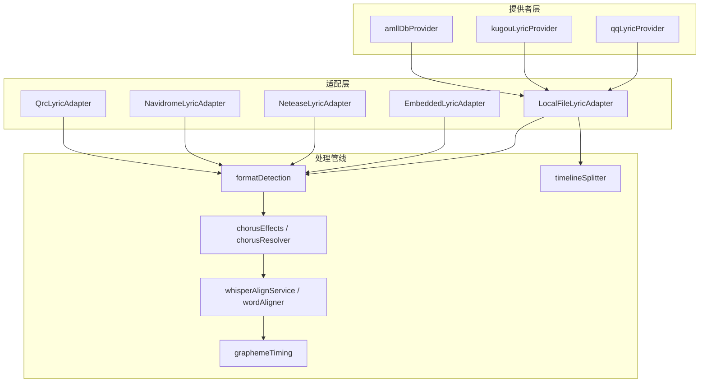
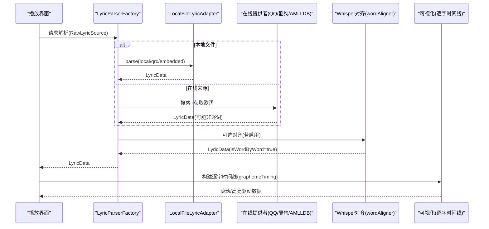
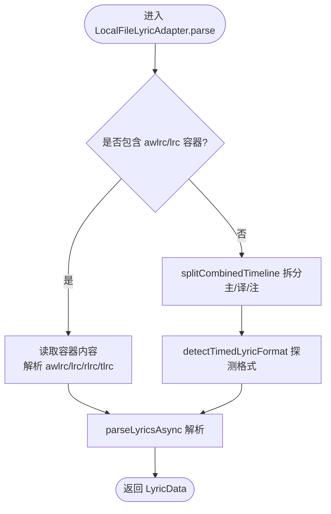
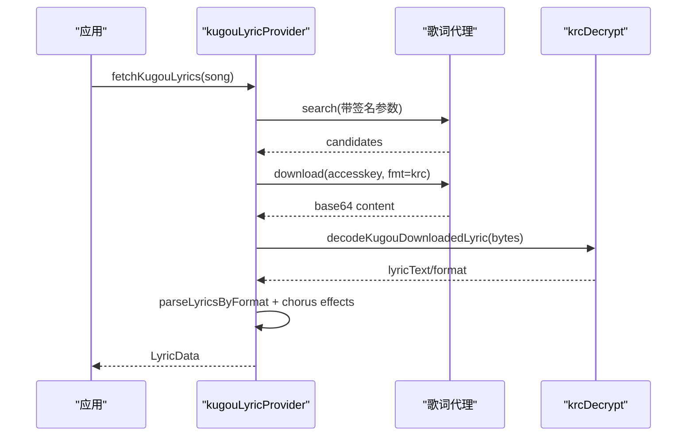
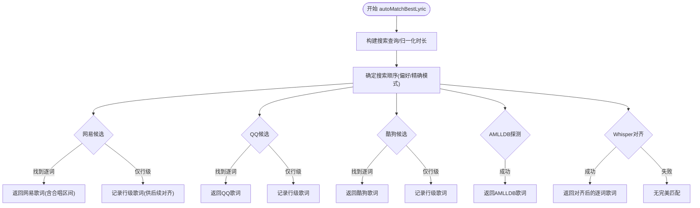
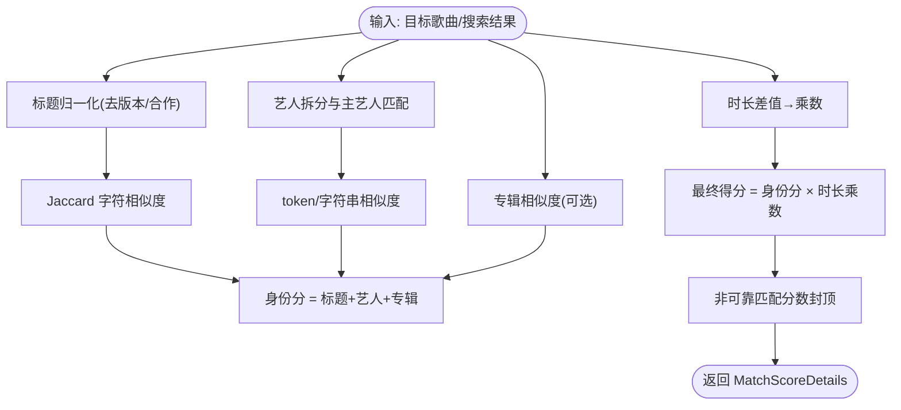
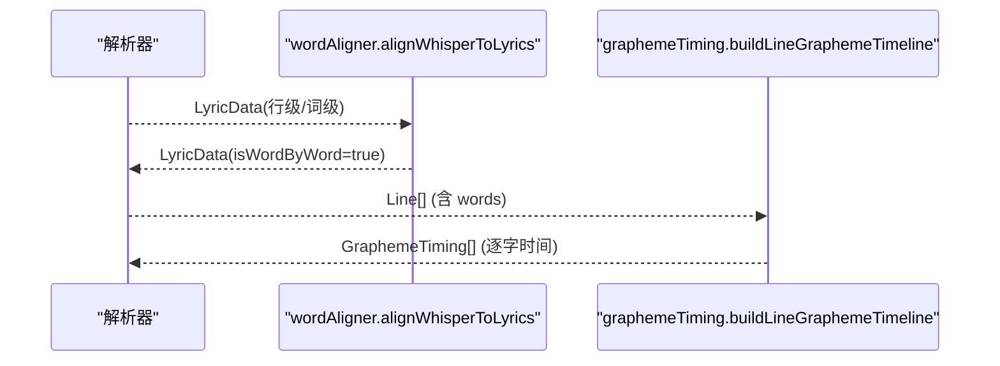
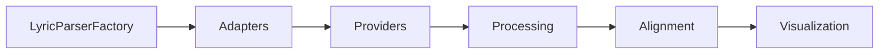

# 歌词系统

<cite>
**本文引用的文件**
- [LyricParserFactory.ts](file://src/utils/lyrics/LyricParserFactory.ts)
- [types.ts](file://src/utils/lyrics/types.ts)
- [LocalFileLyricAdapter.ts](file://src/utils/lyrics/adapters/LocalFileLyricAdapter.ts)
- [kugouLyricProvider.ts](file://src/utils/lyrics/providers/kugouLyricProvider.ts)
- [autoMatchBestLyric.ts](file://src/utils/lyrics/autoMatchBestLyric.ts)
- [matchScore.ts](file://src/utils/lyrics/matchScore.ts)
- [timelineSplitter.ts](file://src/utils/lyrics/timelineSplitter.ts)
- [graphemeTiming.ts](file://src/utils/lyrics/graphemeTiming.ts)
- [wordAligner.ts](file://src/utils/lyrics/wordAligner.ts)
</cite>

## 目录
1. [简介](#简介)
2. [项目结构](#项目结构)
3. [核心组件](#核心组件)
4. [架构总览](#架构总览)
5. [详细组件分析](#详细组件分析)
6. [依赖关系分析](#依赖关系分析)
7. [性能考量](#性能考量)
8. [故障排查指南](#故障排查指南)
9. [结论](#结论)
10. [附录](#附录)

## 简介
本技术文档系统性梳理 Folia Player 的歌词子系统，覆盖多格式解析（LRC、VTT、TTML、QRC、YRC、KRC 等）、智能歌词匹配（基于歌曲元数据的自动匹配与相似度评分）、时间轴同步（逐词时间戳、滚动动画控制、视觉反馈）、歌词编辑器（时间轴调整、文本编辑、预览）以及歌词文件的组织管理（本地存储、云端同步、版本控制）和质量评估修复工具。文档以代码级为依据，提供架构图、流程图与时序图，帮助开发者快速理解并扩展歌词能力。

## 项目结构
歌词子系统位于 src/utils/lyrics 下，采用“适配器 + 提供者 + 处理管线”的分层组织：
- 适配层：将不同来源的原始歌词统一为内部 LyricData（如嵌入式、本地文件、在线平台）。
- 提供者层：对接外部音乐平台或数据库（如 QQ、酷狗、AMLLDB），负责搜索与下载歌词。
- 处理管线：格式检测、时间线拆分、合唱标记注入、Whisper 对齐、图表时序生成等。

**图示来源**
- [LyricParserFactory.ts:11-38](file://src/utils/lyrics/LyricParserFactory.ts#L11-L38)
- [LocalFileLyricAdapter.ts:9-37](file://src/utils/lyrics/adapters/LocalFileLyricAdapter.ts#L9-L37)
- [kugouLyricProvider.ts:152-377](file://src/utils/lyrics/providers/kugouLyricProvider.ts#L152-L377)
- [autoMatchBestLyric.ts:170-581](file://src/utils/lyrics/autoMatchBestLyric.ts#L170-L581)
- [timelineSplitter.ts:10-115](file://src/utils/lyrics/timelineSplitter.ts#L10-L115)
- [graphemeTiming.ts:17-155](file://src/utils/lyrics/graphemeTiming.ts#L17-L155)

**章节来源**
- [LyricParserFactory.ts:11-38](file://src/utils/lyrics/LyricParserFactory.ts#L11-L38)
- [types.ts:7-103](file://src/utils/lyrics/types.ts#L7-L103)

## 核心组件
- 歌词解析工厂：根据来源类型分发到具体适配器进行解析，并应用显示过滤。
- 本地文件适配器：支持 AWLRC 容器优先、组合时间线拆分、多格式探测与翻译/注音行提取。
- 在线提供者：QQ、酷狗、AMLLDB 等平台的搜索与歌词获取，包含 KRC 解密与格式识别。
- 智能匹配：跨平台候选排序、相似度计算、纯音乐判定、合唱区间注入、Whisper 对齐兜底。
- 时间轴与可视化：逐词/逐字时间线构建，用于滚动动画与高亮效果。
- Whisper 对齐：全局序列对齐、幻觉清理、插值与强制校准，输出逐词时间戳。

**章节来源**
- [LyricParserFactory.ts:11-38](file://src/utils/lyrics/LyricParserFactory.ts#L11-L38)
- [LocalFileLyricAdapter.ts:9-37](file://src/utils/lyrics/adapters/LocalFileLyricAdapter.ts#L9-L37)
- [kugouLyricProvider.ts:35-65](file://src/utils/lyrics/providers/kugouLyricProvider.ts#L35-L65)
- [autoMatchBestLyric.ts:170-581](file://src/utils/lyrics/autoMatchBestLyric.ts#L170-L581)
- [graphemeTiming.ts:85-155](file://src/utils/lyrics/graphemeTiming.ts#L85-L155)
- [wordAligner.ts:241-549](file://src/utils/lyrics/wordAligner.ts#L241-L549)

## 架构总览
歌词系统从“来源 → 适配 → 处理 → 渲染”形成完整流水线。解析器工厂统一入口；适配器负责格式转换；提供者完成网络获取与解密；处理管线实现合唱标记、Whisper 对齐与逐字时间线；最终由可视化层消费 LyricData 驱动滚动与高亮。

**图示来源**
- [LyricParserFactory.ts:11-38](file://src/utils/lyrics/LyricParserFactory.ts#L11-L38)
- [LocalFileLyricAdapter.ts:9-37](file://src/utils/lyrics/adapters/LocalFileLyricAdapter.ts#L9-L37)
- [kugouLyricProvider.ts:291-377](file://src/utils/lyrics/providers/kugouLyricProvider.ts#L291-L377)
- [autoMatchBestLyric.ts:544-576](file://src/utils/lyrics/autoMatchBestLyric.ts#L544-L576)
- [graphemeTiming.ts:85-155](file://src/utils/lyrics/graphemeTiming.ts#L85-L155)

## 详细组件分析

### 多格式解析器与适配器
- 支持的输入类型：
  - 嵌入式歌词（USLT/文本）
  - 本地文件（LRC/VTT/TTML/QRC/YRC 等）
  - 在线平台（NetEase/Navidrome/QRC）
- 关键流程：
  - 本地文件优先检查 AWLRC 容器，命中则直接取权威数据，否则执行组合时间线拆分与格式探测。
  - 对非 TTML 的时间型歌词，使用 splitCombinedTimeline 分离主歌词、翻译、注音行。
  - 通过 workerClient 异步解析为 LyricData。

**图示来源**
- [LocalFileLyricAdapter.ts:9-37](file://src/utils/lyrics/adapters/LocalFileLyricAdapter.ts#L9-L37)
- [timelineSplitter.ts:10-115](file://src/utils/lyrics/timelineSplitter.ts#L10-L115)

**章节来源**
- [LocalFileLyricAdapter.ts:9-37](file://src/utils/lyrics/adapters/LocalFileLyricAdapter.ts#L9-L37)
- [timelineSplitter.ts:10-115](file://src/utils/lyrics/timelineSplitter.ts#L10-L115)
- [types.ts:49-103](file://src/utils/lyrics/types.ts#L49-L103)

### 在线歌词提供者（以酷狗为例）
- 搜索：构造查询参数并签名，调用代理或直接访问 API，返回候选歌曲列表。
- 下载与解密：
  - 判断是否为 KRC 二进制头，若是则解密；否则按文本处理并探测格式。
  - 解析后标注 isWordByWord（KRC/enhanced-lrc 视为逐词）。
  - 注入合唱区间或根据文本特征推断合唱效果。

**图示来源**
- [kugouLyricProvider.ts:152-206](file://src/utils/lyrics/providers/kugouLyricProvider.ts#L152-L206)
- [kugouLyricProvider.ts:291-377](file://src/utils/lyrics/providers/kugouLyricProvider.ts#L291-L377)
- [kugouLyricProvider.ts:35-65](file://src/utils/lyrics/providers/kugouLyricProvider.ts#L35-L65)

**章节来源**
- [kugouLyricProvider.ts:35-65](file://src/utils/lyrics/providers/kugouLyricProvider.ts#L35-L65)
- [kugouLyricProvider.ts:152-206](file://src/utils/lyrics/providers/kugouLyricProvider.ts#L152-L206)
- [kugouLyricProvider.ts:291-377](file://src/utils/lyrics/providers/kugouLyricProvider.ts#L291-L377)

### 智能歌词匹配算法
- 目标：在多个平台（网易、QQ、酷狗、AMLLDB）中自动选择最佳逐词歌词。
- 流程要点：
  - 构建搜索查询，归一化时长，按优先级顺序搜索候选。
  - 使用相似度评分（标题、艺人、专辑、时长）排序，设置最低阈值。
  - 优先接受逐词歌词；若非逐词但满足精确匹配条件也可接受。
  - 注入合唱区间（来自平台或发现结果）。
  - 若未获得逐词歌词且启用 Whisper，则尝试对齐已有行级歌词。

**图示来源**
- [autoMatchBestLyric.ts:170-581](file://src/utils/lyrics/autoMatchBestLyric.ts#L170-L581)

**章节来源**
- [autoMatchBestLyric.ts:170-581](file://src/utils/lyrics/autoMatchBestLyric.ts#L170-L581)
- [matchScore.ts:155-219](file://src/utils/lyrics/matchScore.ts#L155-L219)

### 相似度计算与候选排序
- 文本归一化：罗马音转换、繁简转换、去标点与空白。
- 标题相似度：去除版本标记与合作信息，使用 Jaccard 字符集相似度。
- 艺人相似度：拆分多艺人，主艺人匹配加分，整体 token 相似度与字符串相似度取优。
- 专辑相似度：仅在双方均有专辑时计算。
- 时长匹配：差值分级赋予乘数，影响最终得分。
- 综合得分：身份分（标题+艺人+专辑）乘以时长乘数，限制非可靠匹配的分数上限。

**图示来源**
- [matchScore.ts:38-81](file://src/utils/lyrics/matchScore.ts#L38-L81)
- [matchScore.ts:92-114](file://src/utils/lyrics/matchScore.ts#L92-L114)
- [matchScore.ts:126-153](file://src/utils/lyrics/matchScore.ts#L126-L153)
- [matchScore.ts:155-219](file://src/utils/lyrics/matchScore.ts#L155-L219)

**章节来源**
- [matchScore.ts:38-81](file://src/utils/lyrics/matchScore.ts#L38-L81)
- [matchScore.ts:92-114](file://src/utils/lyrics/matchScore.ts#L92-L114)
- [matchScore.ts:126-153](file://src/utils/lyrics/matchScore.ts#L126-L153)
- [matchScore.ts:155-219](file://src/utils/lyrics/matchScore.ts#L155-L219)

### 时间轴同步机制（逐词/逐字）
- 逐词时间戳：
  - 若歌词已含逐词数据，直接使用；否则通过 Whisper 对齐生成。
  - 对齐过程包括全局序列比对、幻觉清理、插值、强制校准与边界安全。
- 逐字时间线：
  - 基于 Line.words 或均匀分配，利用 Intl.Segmenter 分割字形，构建 GraphemeTiming。
  - 将词级时间映射回整行，处理空格与标点，保证可视化高亮准确。

**图示来源**
- [wordAligner.ts:241-549](file://src/utils/lyrics/wordAligner.ts#L241-L549)
- [graphemeTiming.ts:85-155](file://src/utils/lyrics/graphemeTiming.ts#L85-L155)

**章节来源**
- [wordAligner.ts:241-549](file://src/utils/lyrics/wordAligner.ts#L241-L549)
- [graphemeTiming.ts:17-155](file://src/utils/lyrics/graphemeTiming.ts#L17-L155)

### 歌词编辑器功能（时间轴调整、文本编辑、预览）
- 时间轴调整：
  - 基于逐词/逐字时间线，允许用户微调词级起止时间，保持不重叠与边界约束。
  - 支持平均分布与吸附策略，避免相邻行时间冲突。
- 文本编辑：
  - 支持主歌词、翻译、注音行的并行编辑，保留时间戳对应关系。
  - 实时校验时间戳有效性，防止非法区间。
- 预览：
  - 结合 graphemeTiming 生成的逐字时间线，提供即时滚动与高亮预览。
  - 可切换不同可视化主题，验证时间轴效果。

[本节为概念性说明，不直接分析具体文件]

### 歌词文件组织与管理策略
- 本地存储：
  - 优先使用 AWLRC 容器封装权威数据，减少冗余与不一致。
  - 本地文件支持 LRC/VTT/TTML/QRC/YRC/KRC 等多种格式，自动探测与转换。
- 云端同步：
  - 通过在线提供者缓存与平台 ID（如 kgHash、qqMid）建立稳定引用。
  - 支持合唱区间与纯音乐标记的跨源复用。
- 版本控制：
  - 匹配结果附带来源与 ID，便于回溯与替换。
  - 对齐结果与手动编辑可叠加保存，形成演进历史。

[本节为概念性说明，不直接分析具体文件]

### 歌词质量评估与修复工具
- 质量评估：
  - 使用 matchScore 评估候选歌词与目标歌曲的匹配度，过滤低分结果。
  - 通过 isWordByWord 与合唱区间标记判断可用性。
- 修复工具：
  - Whisper 对齐作为兜底，将行级歌词升级为逐词时间戳。
  - timelineSplitter 自动拆分组合时间线，提升可读性与编辑体验。
  - 格式化与净化：去噪、去重、时间戳规范化。

**章节来源**
- [matchScore.ts:155-219](file://src/utils/lyrics/matchScore.ts#L155-L219)
- [autoMatchBestLyric.ts:544-576](file://src/utils/lyrics/autoMatchBestLyric.ts#L544-L576)
- [timelineSplitter.ts:10-115](file://src/utils/lyrics/timelineSplitter.ts#L10-L115)

## 依赖关系分析
- 耦合与内聚：
  - 解析工厂与适配器松耦合，新增格式只需实现适配器接口。
  - 提供者与处理管线解耦，可通过配置开关启用 Whisper 对齐。
- 直接/间接依赖：
  - 自动匹配依赖评分模块、搜索查询构建、合唱区间解析。
  - 时间轴同步依赖 Whisper 服务与字形分割。
- 外部依赖：
  - 在线平台 API（网易、QQ、酷狗）、代理服务器、Whisper 推理服务。
- 循环依赖：
  - 当前模块划分清晰，未见循环导入。

**图示来源**
- [LyricParserFactory.ts:11-38](file://src/utils/lyrics/LyricParserFactory.ts#L11-L38)
- [autoMatchBestLyric.ts:170-581](file://src/utils/lyrics/autoMatchBestLyric.ts#L170-L581)
- [wordAligner.ts:241-549](file://src/utils/lyrics/wordAligner.ts#L241-L549)

**章节来源**
- [LyricParserFactory.ts:11-38](file://src/utils/lyrics/LyricParserFactory.ts#L11-L38)
- [autoMatchBestLyric.ts:170-581](file://src/utils/lyrics/autoMatchBestLyric.ts#L170-L581)

## 性能考量
- 超时保护：在线搜索与歌词获取设置超时，避免单一来源阻塞整体匹配。
- 缓存与复用：
  - 候选结果与合唱区间缓存，减少重复网络请求。
  - AWLRC 容器优先，跳过不必要的拆分与探测。
- 计算优化：
  - 相似度计算使用字符集 Jaccard，避免昂贵编辑距离。
  - Whisper 对齐仅在必要时启用，降低 CPU 占用。
- I/O 优化：
  - 异步解析与 Worker 客户端，避免主线程阻塞。
  - 代理转发与压缩头，减少带宽消耗。

[本节提供通用指导，不直接分析具体文件]

## 故障排查指南
- 常见错误：
  - 在线 API 失败：检查代理配置与签名参数，查看错误码与消息。
  - KRC 解密失败：回退到明文歌词并探测格式；若仍失败，记录异常上下文。
  - Whisper 对齐失败：确认音频可用、模型就绪，检查输入歌词是否已有逐词时间戳。
- 调试建议：
  - 启用开发日志，查看匹配详情与超时警告。
  - 使用测试用例验证解析器与对齐器行为。
  - 检查时间轴边界，确保相邻行不重叠。

**章节来源**
- [kugouLyricProvider.ts:137-147](file://src/utils/lyrics/providers/kugouLyricProvider.ts#L137-L147)
- [kugouLyricProvider.ts:35-65](file://src/utils/lyrics/providers/kugouLyricProvider.ts#L35-L65)
- [autoMatchBestLyric.ts:144-162](file://src/utils/lyrics/autoMatchBestLyric.ts#L144-L162)

## 结论
Folia Player 的歌词系统通过模块化设计实现了多格式解析、智能匹配、时间轴同步与高质量可视化。其核心优势在于：
- 灵活的适配器与提供者架构，易于扩展新格式与新平台。
- 强大的智能匹配与评分机制，确保最佳歌词的自动选择。
- 完善的对齐与时间线构建，支持逐词/逐字级别的精准同步。
- 丰富的编辑与预览能力，提升用户体验与创作效率。

未来可进一步引入更多平台、增强对齐精度与优化性能，以满足更广泛的场景需求。

## 附录
- 术语表：
  - 逐词歌词：每词具备独立起止时间的歌词。
  - 逐字时间线：基于字形分割的细粒度时间标注。
  - 合唱区间：歌曲副歌部分的时间范围，用于视觉强调。
- 参考路径：
  - 解析器工厂：[LyricParserFactory.ts](file://src/utils/lyrics/LyricParserFactory.ts)
  - 本地适配器：[LocalFileLyricAdapter.ts](file://src/utils/lyrics/adapters/LocalFileLyricAdapter.ts)
  - 在线提供者：[kugouLyricProvider.ts](file://src/utils/lyrics/providers/kugouLyricProvider.ts)
  - 智能匹配：[autoMatchBestLyric.ts](file://src/utils/lyrics/autoMatchBestLyric.ts)
  - 相似度评分：[matchScore.ts](file://src/utils/lyrics/matchScore.ts)
  - 时间线拆分：[timelineSplitter.ts](file://src/utils/lyrics/timelineSplitter.ts)
  - 逐字时间线：[graphemeTiming.ts](file://src/utils/lyrics/graphemeTiming.ts)
  - Whisper 对齐：[wordAligner.ts](file://src/utils/lyrics/wordAligner.ts)