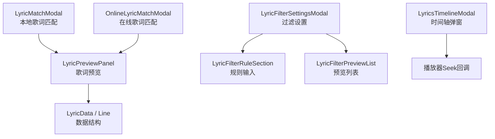
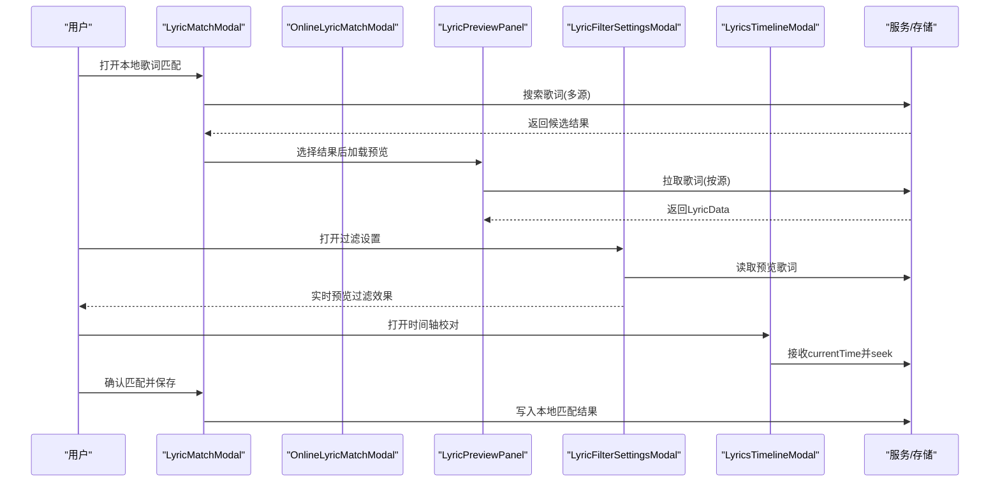
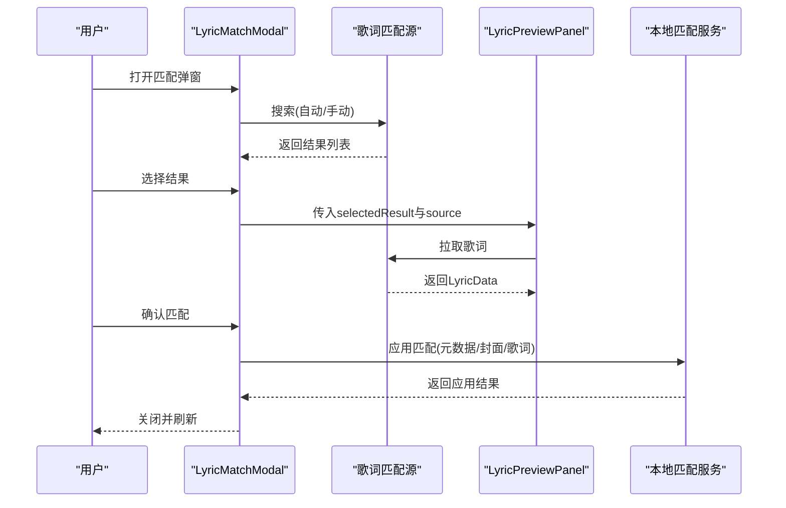
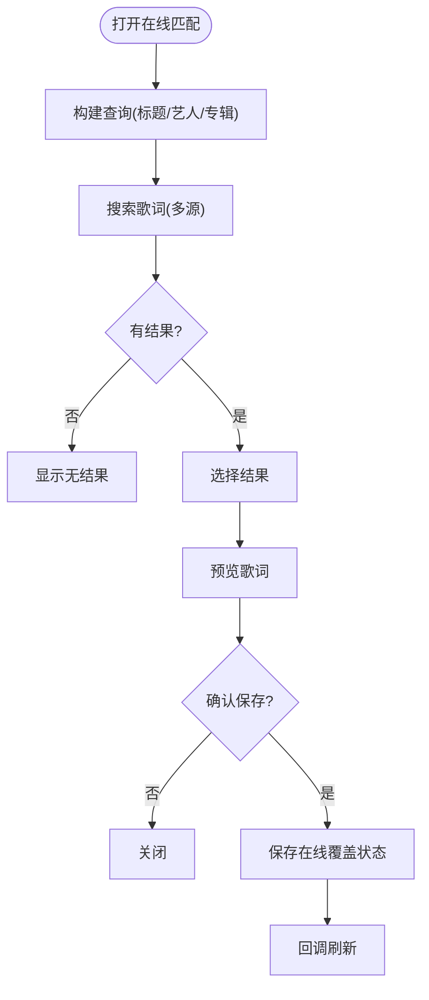
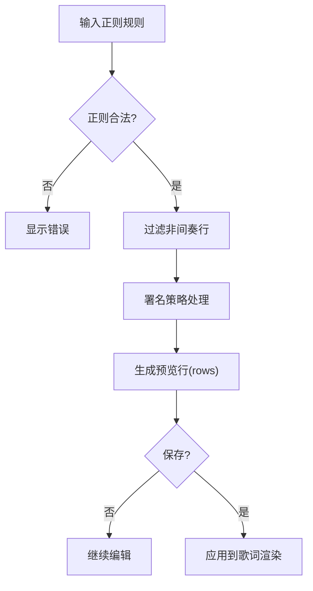
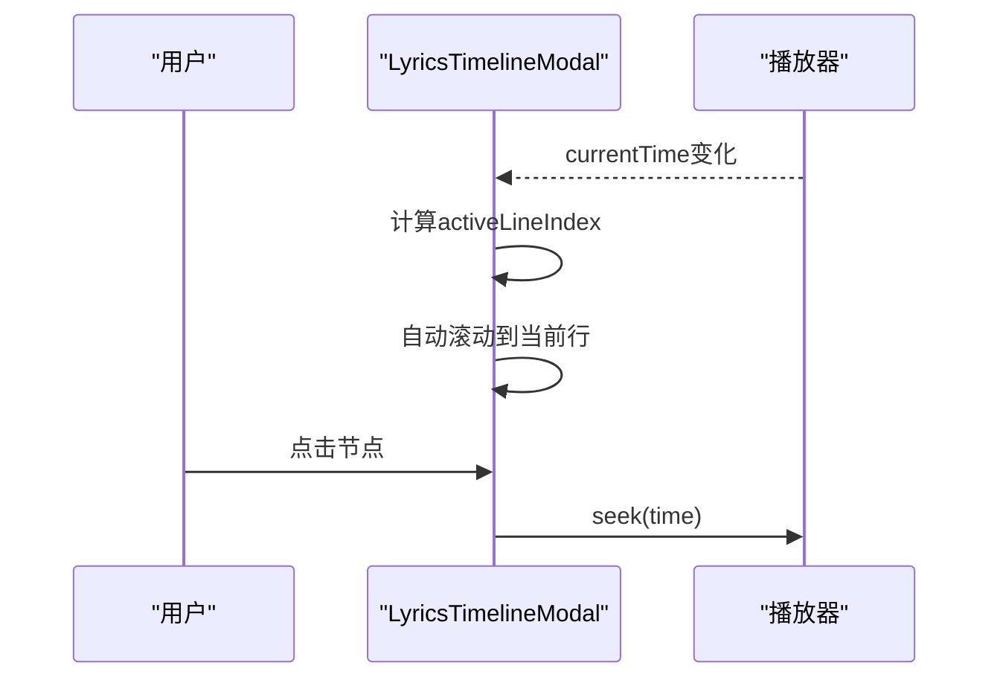
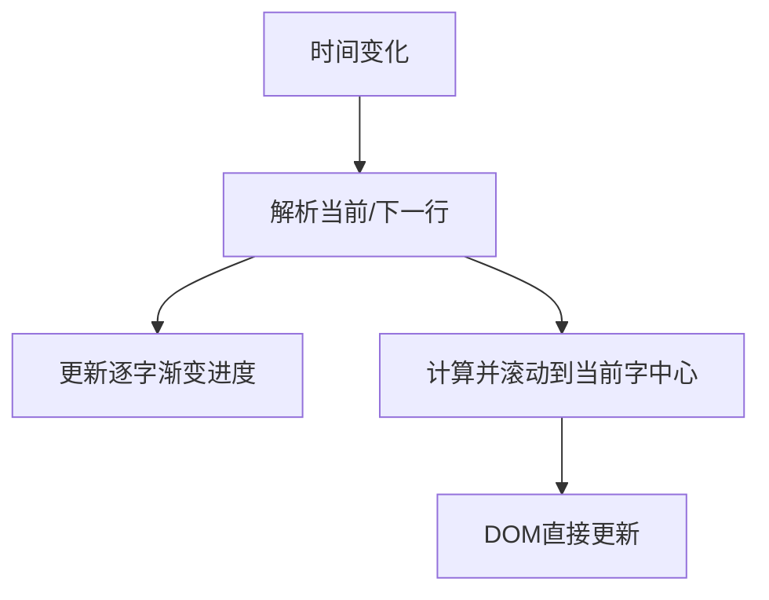
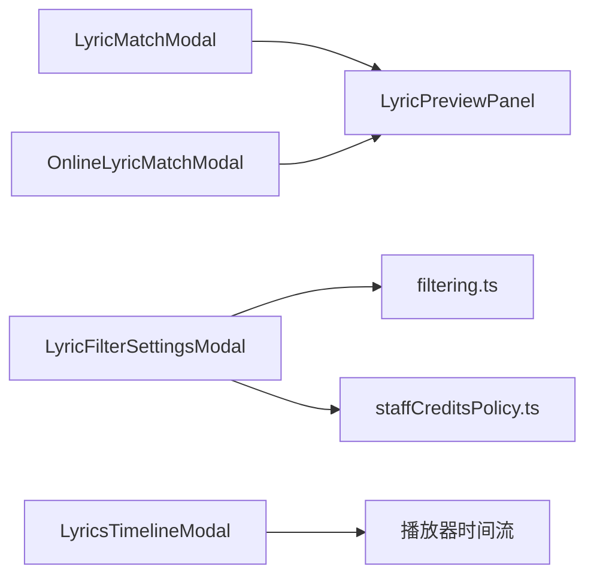

# 歌词编辑器

<cite>
**本文引用的文件**
- [LyricFilterSettingsModal.tsx](file://src/components/modal/LyricFilterSettingsModal.tsx)
- [LyricsTimelineModal.tsx](file://src/components/modal/LyricsTimelineModal.tsx)
- [LyricMatchModal.tsx](file://src/components/modal/LyricMatchModal.tsx)
- [OnlineLyricMatchModal.tsx](file://src/components/modal/OnlineLyricMatchModal.tsx)
- [LyricPreviewPanel.tsx](file://src/components/modal/LyricPreviewPanel.tsx)
- [LyricFilterRuleSection.tsx](file://src/components/modal/lyric-filter/LyricFilterRuleSection.tsx)
- [LyricFilterPreviewList.tsx](file://src/components/modal/lyric-filter/LyricFilterPreviewList.tsx)
- [buildLyricFilterPreviewModel.ts](file://src/components/modal/lyric-filter/buildLyricFilterPreviewModel.ts)
- [filtering.ts](file://src/utils/lyrics/filtering.ts)
- [staffCreditsPolicy.ts](file://src/utils/lyrics/staffCreditsPolicy.ts)
</cite>

## 目录
1. [简介](#简介)
2. [项目结构](#项目结构)
3. [核心组件](#核心组件)
4. [架构总览](#架构总览)
5. [详细组件分析](#详细组件分析)
6. [依赖关系分析](#依赖关系分析)
7. [性能考量](#性能考量)
8. [故障排查指南](#故障排查指南)
9. [结论](#结论)
10. [附录](#附录)

## 简介
本文件为 Folia Player 歌词编辑器的全面使用与技术文档。内容覆盖界面与交互、歌词过滤系统（规则编写、实时预览、批量处理）、时间轴调整工具（拖拽、精确输入、批量修改）、歌词匹配辅助（在线搜索、智能推荐、手动选择）、格式与质量检查，以及从导入到导出的完整工作流设计。读者可据此快速上手并深入理解实现细节。

## 项目结构
歌词编辑器以“模态窗口 + 面板”的方式组织功能：
- 歌词匹配：本地歌曲匹配与在线歌词匹配两个入口，统一提供搜索结果、封面、元数据与歌词预览。
- 歌词过滤：正则规则与署名策略组合，提供实时预览与保存。
- 时间轴：可视化时间轴弹窗，支持点击跳转与自动滚动跟随播放。
- 预览：逐字高亮、翻译/下一句展示、自动水平滚动对齐当前字词。

图表来源
- [LyricMatchModal.tsx:1-120](file://src/components/modal/LyricMatchModal.tsx#L1-L120)
- [OnlineLyricMatchModal.tsx:1-120](file://src/components/modal/OnlineLyricMatchModal.tsx#L1-L120)
- [LyricFilterSettingsModal.tsx:1-120](file://src/components/modal/LyricFilterSettingsModal.tsx#L1-L120)
- [LyricsTimelineModal.tsx:1-120](file://src/components/modal/LyricsTimelineModal.tsx#L1-L120)
- [LyricPreviewPanel.tsx:1-120](file://src/components/modal/LyricPreviewPanel.tsx#L1-L120)

章节来源
- [LyricMatchModal.tsx:1-120](file://src/components/modal/LyricMatchModal.tsx#L1-L120)
- [OnlineLyricMatchModal.tsx:1-120](file://src/components/modal/OnlineLyricMatchModal.tsx#L1-L120)
- [LyricFilterSettingsModal.tsx:1-120](file://src/components/modal/LyricFilterSettingsModal.tsx#L1-L120)
- [LyricsTimelineModal.tsx:1-120](file://src/components/modal/LyricsTimelineModal.tsx#L1-L120)
- [LyricPreviewPanel.tsx:1-120](file://src/components/modal/LyricPreviewPanel.tsx#L1-L120)

## 核心组件
- 歌词匹配（本地）：支持多源搜索、结果评分、封面/元数据切换、歌词预览与确认应用。
- 歌词匹配（在线）：针对在线曲库的匹配流程，保存在线覆盖状态。
- 歌词过滤设置：正则规则开关与输入、署名策略配置、实时预览与保存。
- 时间轴弹窗：垂直时间轴，自动滚动跟随播放，点击定位时间点。
- 歌词预览面板：逐字高亮、翻译/下一句显示、自适应水平滚动与行切换动画。

章节来源
- [LyricMatchModal.tsx:120-260](file://src/components/modal/LyricMatchModal.tsx#L120-L260)
- [OnlineLyricMatchModal.tsx:60-160](file://src/components/modal/OnlineLyricMatchModal.tsx#L60-L160)
- [LyricFilterSettingsModal.tsx:110-260](file://src/components/modal/LyricFilterSettingsModal.tsx#L110-L260)
- [LyricsTimelineModal.tsx:160-387](file://src/components/modal/LyricsTimelineModal.tsx#L160-L387)
- [LyricPreviewPanel.tsx:160-330](file://src/components/modal/LyricPreviewPanel.tsx#L160-L330)

## 架构总览
歌词编辑器的数据流围绕“匹配 → 预览 → 过滤 → 时间轴 → 导出/应用”展开。匹配模块负责获取歌词与元数据；预览模块负责高亮与滚动；过滤模块在渲染前对歌词进行筛选与署名策略处理；时间轴用于精确定位与校对。

图表来源
- [LyricMatchModal.tsx:120-232](file://src/components/modal/LyricMatchModal.tsx#L120-L232)
- [OnlineLyricMatchModal.tsx:60-159](file://src/components/modal/OnlineLyricMatchModal.tsx#L60-L159)
- [LyricPreviewPanel.tsx:109-162](file://src/components/modal/LyricPreviewPanel.tsx#L109-L162)
- [LyricFilterSettingsModal.tsx:73-125](file://src/components/modal/LyricFilterSettingsModal.tsx#L73-L125)
- [LyricsTimelineModal.tsx:60-191](file://src/components/modal/LyricsTimelineModal.tsx#L60-L191)

## 详细组件分析

### 歌词匹配（本地）
- 功能要点
  - 多源搜索：网易、QQ、Whisper等，支持手动搜索或基于标题/艺人/专辑构建查询。
  - 结果评分：显示匹配度百分比与时长匹配徽章。
  - 元数据与封面：可切换使用在线元数据与封面，或保留本地导入信息。
  - 歌词预览：底部固定区域展示当前选中结果的歌词片段。
  - 确认应用：将选中的歌词与元数据应用到本地歌曲，支持部分失败提示。
- 交互流程
  - 初始化时根据歌曲信息构建查询并自动搜索。
  - 切换源时复用当前查询。
  - 选择结果后右侧预览区更新封面与信息，底部预览歌词。
  - 确认后调用服务写入本地匹配结果并刷新。

图表来源
- [LyricMatchModal.tsx:120-232](file://src/components/modal/LyricMatchModal.tsx#L120-L232)
- [LyricPreviewPanel.tsx:109-162](file://src/components/modal/LyricPreviewPanel.tsx#L109-L162)

章节来源
- [LyricMatchModal.tsx:120-232](file://src/components/modal/LyricMatchModal.tsx#L120-L232)
- [LyricPreviewPanel.tsx:109-162](file://src/components/modal/LyricPreviewPanel.tsx#L109-L162)

### 歌词匹配（在线）
- 功能要点
  - 针对在线曲库条目进行歌词匹配，支持多源搜索与结果选择。
  - 保存在线覆盖状态，便于后续优先使用在线歌词。
- 交互流程
  - 打开弹窗即根据歌曲信息构建查询并搜索。
  - 选择结果后预览歌词。
  - 确认后保存在线歌词覆盖状态并回调刷新。

图表来源
- [OnlineLyricMatchModal.tsx:60-159](file://src/components/modal/OnlineLyricMatchModal.tsx#L60-L159)

章节来源
- [OnlineLyricMatchModal.tsx:60-159](file://src/components/modal/OnlineLyricMatchModal.tsx#L60-L159)

### 歌词过滤系统
- 能力概览
  - 正则规则：支持启用/禁用、实时校验、示例提示。
  - 署名策略：三种模式（保留/智能/隐藏），可配置最小停留时间与相邻行吸收策略。
  - 实时预览：先执行通用过滤，再对幸存者应用署名策略，保持顺序一致。
  - 批量处理：保存后应用于实际歌词渲染管线。
- 关键流程
  - 规则输入变更触发预览模型重建。
  - 预览列表标注被过滤/署名处理的行。
  - 保存时校验规则合法性，提交草稿。

图表来源
- [LyricFilterSettingsModal.tsx:112-150](file://src/components/modal/LyricFilterSettingsModal.tsx#L112-L150)
- [buildLyricFilterPreviewModel.ts:27-69](file://src/components/modal/lyric-filter/buildLyricFilterPreviewModel.ts#L27-L69)
- [filtering.ts:64-106](file://src/utils/lyrics/filtering.ts#L64-L106)
- [staffCreditsPolicy.ts:63-131](file://src/utils/lyrics/staffCreditsPolicy.ts#L63-L131)

章节来源
- [LyricFilterSettingsModal.tsx:112-150](file://src/components/modal/LyricFilterSettingsModal.tsx#L112-L150)
- [LyricFilterRuleSection.tsx:32-71](file://src/components/modal/lyric-filter/LyricFilterRuleSection.tsx#L32-L71)
- [LyricFilterPreviewList.tsx:34-69](file://src/components/modal/lyric-filter/LyricFilterPreviewList.tsx#L34-L69)
- [buildLyricFilterPreviewModel.ts:27-69](file://src/components/modal/lyric-filter/buildLyricFilterPreviewModel.ts#L27-L69)
- [filtering.ts:64-106](file://src/utils/lyrics/filtering.ts#L64-L106)
- [staffCreditsPolicy.ts:63-131](file://src/utils/lyrics/staffCreditsPolicy.ts#L63-L131)

### 时间轴调整工具
- 能力概览
  - 垂直时间轴：每行歌词对应一个节点，左右交替布局，移动端左对齐。
  - 自动滚动：播放时自动滚动至当前行，用户手动滚动3秒后恢复自动。
  - 点击跳转：点击任意节点跳转到对应时间点。
  - 禁用态：可全局禁用交互。
- 交互流程
  - 监听播放时间变化，计算当前行索引并高亮。
  - 首次打开时定位到当前行。
  - 用户滚动时暂停自动滚动，超时恢复。

图表来源
- [LyricsTimelineModal.tsx:60-191](file://src/components/modal/LyricsTimelineModal.tsx#L60-L191)

章节来源
- [LyricsTimelineModal.tsx:60-191](file://src/components/modal/LyricsTimelineModal.tsx#L60-L191)

### 歌词预览面板
- 能力概览
  - 逐字高亮：根据当前时间对每个字/词应用渐变背景，实现进度高亮。
  - 翻译/下一句：第二行显示翻译或下一句，带淡入淡出切换。
  - 自适应滚动：当文本溢出时靠左对齐并滚动至当前字中心；短文本居中不滚动。
  - 性能优化：通过DOM直接更新样式与滚动位置，避免频繁重渲染。
- 交互流程
  - 订阅全局时间事件，计算当前/下一行并更新显示。
  - 测量容器与字符中点，确保滚动准确。
  - 窗口尺寸变化时重新测量。

图表来源
- [LyricPreviewPanel.tsx:164-292](file://src/components/modal/LyricPreviewPanel.tsx#L164-L292)

章节来源
- [LyricPreviewPanel.tsx:164-292](file://src/components/modal/LyricPreviewPanel.tsx#L164-L292)

## 依赖关系分析
- 组件耦合
  - LyricMatchModal 与 OnlineLyricMatchModal 均依赖 LyricPreviewPanel 进行歌词预览。
  - LyricFilterSettingsModal 依赖 filtering 与 staffCreditsPolicy 构建预览模型。
  - LyricsTimelineModal 依赖播放器时间流进行自动滚动与跳转。
- 外部依赖
  - 歌词匹配源：多平台API与Whisper模块。
  - 本地服务：本地匹配服务与在线歌词状态存储。
- 循环依赖
  - 未发现明显循环依赖；预览与匹配通过接口解耦。

图表来源
- [LyricMatchModal.tsx:120-232](file://src/components/modal/LyricMatchModal.tsx#L120-L232)
- [OnlineLyricMatchModal.tsx:60-159](file://src/components/modal/OnlineLyricMatchModal.tsx#L60-L159)
- [LyricFilterSettingsModal.tsx:112-150](file://src/components/modal/LyricFilterSettingsModal.tsx#L112-L150)
- [LyricsTimelineModal.tsx:60-191](file://src/components/modal/LyricsTimelineModal.tsx#L60-L191)

章节来源
- [LyricMatchModal.tsx:120-232](file://src/components/modal/LyricMatchModal.tsx#L120-L232)
- [OnlineLyricMatchModal.tsx:60-159](file://src/components/modal/OnlineLyricMatchModal.tsx#L60-L159)
- [LyricFilterSettingsModal.tsx:112-150](file://src/components/modal/LyricFilterSettingsModal.tsx#L112-L150)
- [LyricsTimelineModal.tsx:60-191](file://src/components/modal/LyricsTimelineModal.tsx#L60-L191)

## 性能考量
- 预览面板采用DOM直接操作与全局时间事件订阅，减少React重渲染开销。
- 时间轴自动滚动使用防抖与用户滚动检测，避免频繁滚动冲突。
- 过滤预览在内存中构建模型，避免重复解析。
- 匹配搜索使用请求ID去重，防止竞态导致的结果错乱。

[本节为通用指导，无需具体文件引用]

## 故障排查指南
- 正则规则无效
  - 现象：保存按钮禁用或显示错误提示。
  - 处理：检查正则语法，参考示例；清空后重试。
- 歌词预览加载失败
  - 现象：显示错误信息与重试按钮。
  - 处理：点击重试；检查网络与源可用性。
- 时间轴无法跳转
  - 现象：点击节点无响应。
  - 处理：检查是否处于禁用态；确认播放器回调正常。
- 匹配结果不更新
  - 现象：选择结果后预览未变化。
  - 处理：切换源或重新搜索；检查请求是否被取消。

章节来源
- [LyricFilterSettingsModal.tsx:132-150](file://src/components/modal/LyricFilterSettingsModal.tsx#L132-L150)
- [LyricPreviewPanel.tsx:145-162](file://src/components/modal/LyricPreviewPanel.tsx#L145-L162)
- [LyricsTimelineModal.tsx:185-191](file://src/components/modal/LyricsTimelineModal.tsx#L185-L191)
- [LyricMatchModal.tsx:123-146](file://src/components/modal/LyricMatchModal.tsx#L123-L146)

## 结论
Folia Player 歌词编辑器提供了从匹配、预览、过滤到时间轴校对的完整工作流。其模块化设计与高性能实现确保了良好的用户体验与可扩展性。建议在实际使用中结合过滤规则与署名策略，配合时间轴进行精细化校对，以获得高质量的歌词呈现。

[本节为总结，无需具体文件引用]

## 附录
- 常用术语
  - 间奏行：用于占位的无意义歌词行，通常会被过滤。
  - 署名块：歌曲开头的制作人员信息块，可按策略隐藏或压缩。
  - 在线覆盖：优先使用在线歌词而非本地嵌入或导入歌词。
- 最佳实践
  - 使用正则规则精准过滤无用行。
  - 合理设置署名策略与最小停留时间，保证前奏可读性。
  - 利用时间轴进行逐句校对，必要时微调时间戳。
  - 匹配完成后检查预览与时间轴一致性。

[本节为补充说明，无需具体文件引用]