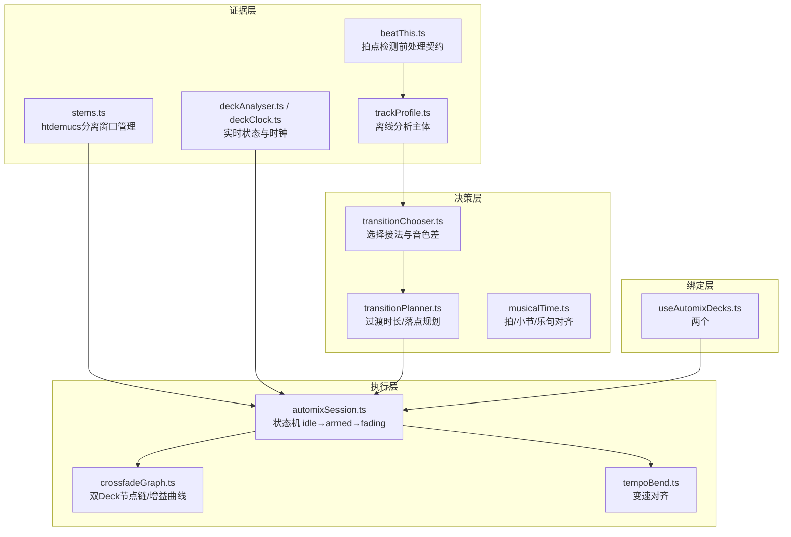
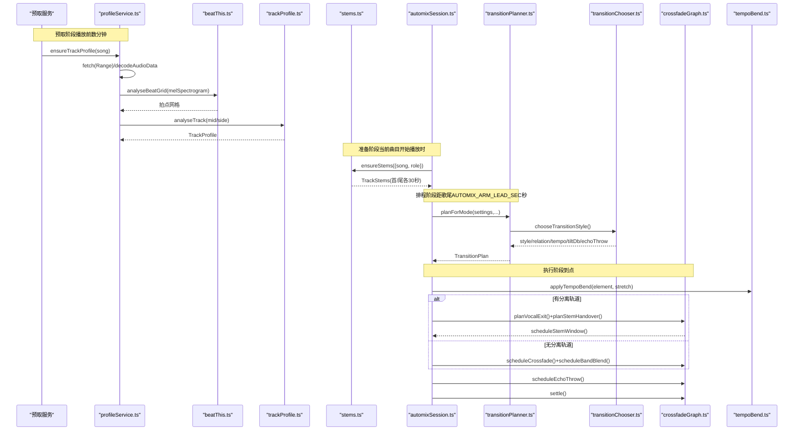
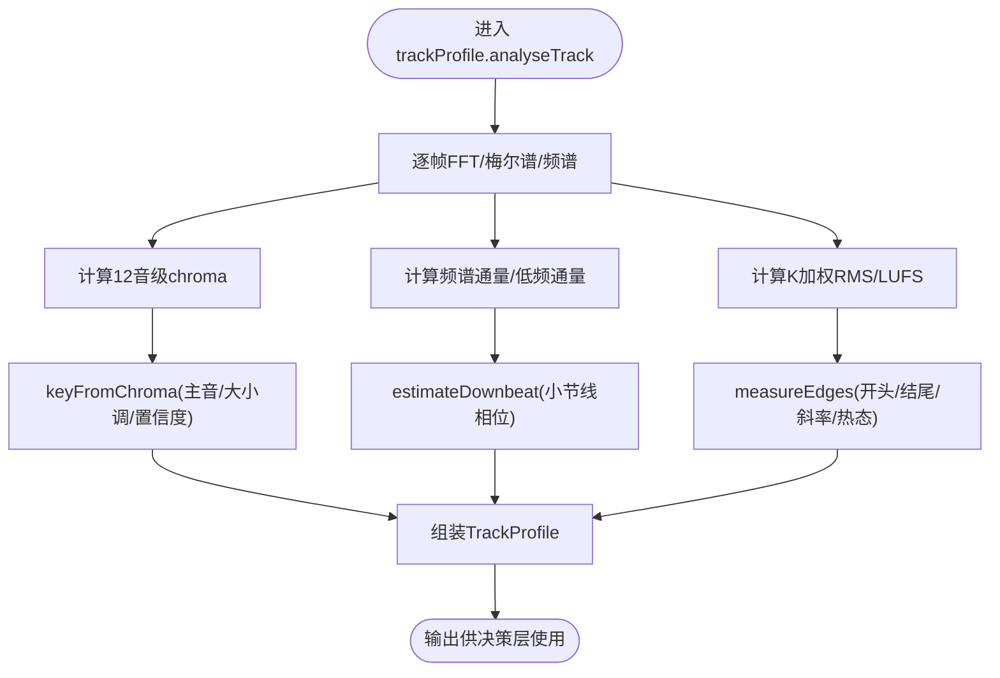
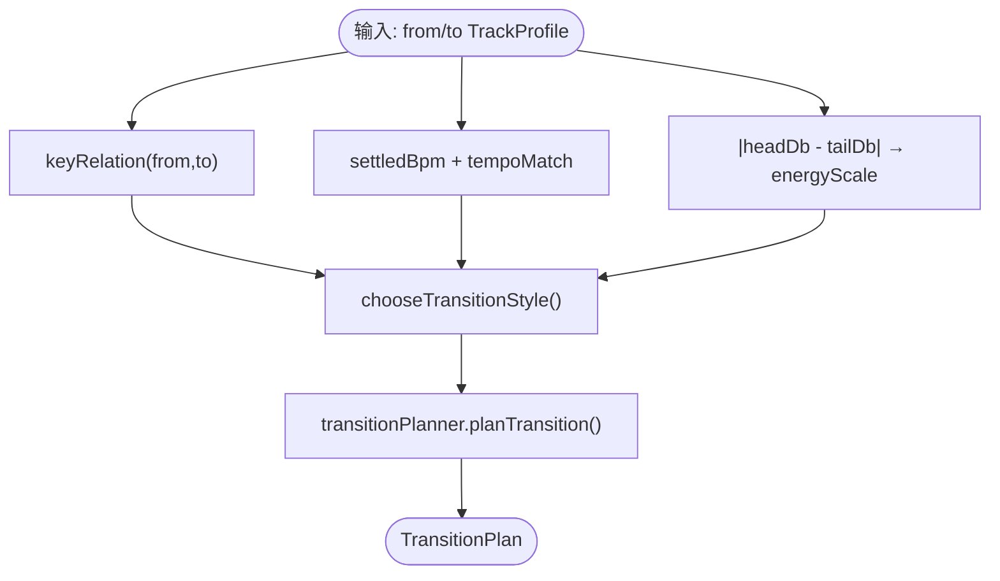
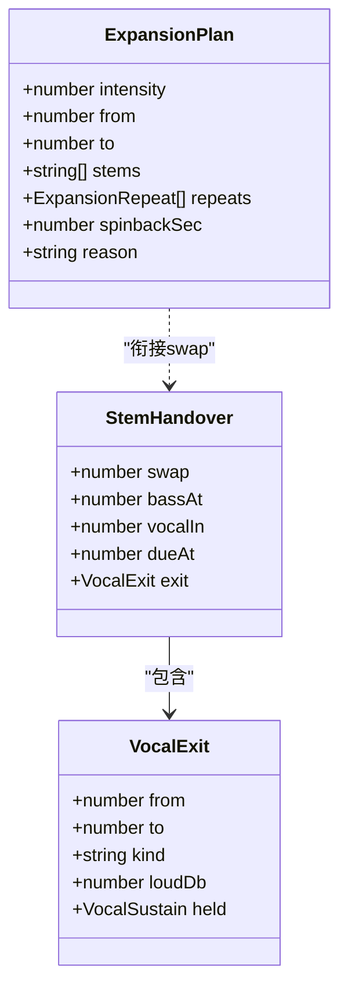
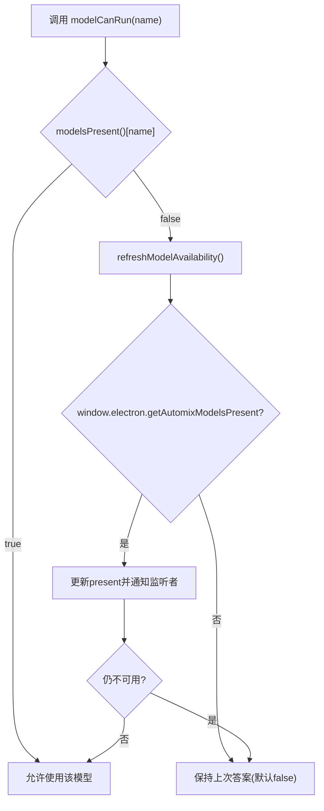
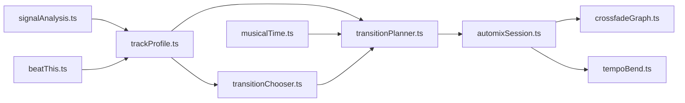

# AI决策系统

<cite>
**本文引用的文件**
- [README.md](file://src/services/automix/README.md)
- [MODELS.md](file://src/services/automix/MODELS.md)
- [transitionChooser.ts](file://src/services/automix/transitionChooser.ts)
- [transitionPlanner.ts](file://src/services/automix/transitionPlanner.ts)
- [modelAvailability.ts](file://src/services/automix/modelAvailability.ts)
- [profileService.ts](file://src/services/automix/profileService.ts)
- [trackProfile.ts](file://src/services/automix/trackProfile.ts)
- [stemGesture.ts](file://src/services/automix/stemGesture.ts)
- [expansionGesture.ts](file://src/services/automix/expansionGesture.ts)
</cite>

## 目录
1. [简介](#简介)
2. [项目结构](#项目结构)
3. [核心组件](#核心组件)
4. [架构总览](#架构总览)
5. [详细组件分析](#详细组件分析)
6. [依赖关系分析](#依赖关系分析)
7. [性能考量](#性能考量)
8. [故障排查指南](#故障排查指南)
9. [结论](#结论)
10. [附录](#附录)

## 简介
本技术文档聚焦 Folia Player 的“自动混音过渡（Automix）”AI 决策系统，系统性说明音乐风格识别、情感与节奏特征提取、用户偏好学习、过渡选择器、模型可用性检测与降级策略，以及可解释性与调试工具。该系统以四层架构组织：证据层（离线音频分析）、决策层（乐理规则与规划）、执行层（Web Audio 事件调度）、绑定层（React/DOM 外壳）。其目标是让上一首在结束前自然接入下一首，避免突兀切换与人声重叠，同时兼顾听感与资源占用。

## 项目结构
Automix 子系统位于 src/services/automix，围绕“证据—决策—执行—绑定”分层组织，关键文件职责如下：
- 证据层：trackProfile.ts、signalAnalysis.ts、beatThis.ts、stems.ts、deckAnalyser.ts、deckClock.ts
- 决策层：musicalTime.ts、transitionChooser.ts、transitionPlanner.ts、crossfadePlanner.ts、transitionStrategy.ts
- 执行层：automixSession.ts、crossfadeGraph.ts、tempoBend.ts
- 绑定层：useAutomixDecks.ts

图表来源
- [README.md:15-67](file://src/services/automix/README.md#L15-L67)

章节来源
- [README.md:15-67](file://src/services/automix/README.md#L15-L67)

## 核心组件
- 曲目档案（TrackProfile）：包含 BPM、小节线位置、响度（LUFS）、首尾调性、三频段占比、段落边界、前奏终点、结尾形态等，是决策层的输入基础。
- 过渡选择器（TransitionChooser）：基于调性关系、速度关系、能量阶跃、是否“热进/热出”，选择 beatCut/bassSwap/tailRide/plainBlend 四种接法之一，并计算音色修正与回声抛掷。
- 过渡规划器（TransitionPlanner）：根据证据与约束（人声不重叠、段落边界、节拍网格、最大重叠上限），输出 TransitionPlan（含 outStart/inStart/overlap/stretch/tiltDb/echoThrow/reason 等）。
- 分轨手势（StemGesture）：在 htdemucs 分离出的 drums/bass/other/vocals 上编排交接顺序（鼓先换、贝斯随后、人声入场），并生成各 stem 的增益曲线。
- 表现模式（ExpansionGesture）：在交接点前构建 build-up（鼓重复加速、甩盘、降调等），渲染为样本缓冲，再注入 stem 总线。
- 模型可用性（ModelAvailability）：同步查询本地是否存在 ONNX 权重，提供刷新与失败回退能力，支撑 UI 能力徽章与功能开关。
- 预取与分析服务（ProfileService）：按带宽与缓存策略读取音频片段，触发离线分析与结果缓存，并在播放过程中回填尾部测量。

章节来源
- [trackProfile.ts:132-284](file://src/services/automix/trackProfile.ts#L132-L284)
- [transitionChooser.ts:20-28,175-258:20-28](file://src/services/automix/transitionChooser.ts#L20-L28)
- [transitionPlanner.ts:57-102,320-737:57-102](file://src/services/automix/transitionPlanner.ts#L57-L102)
- [stemGesture.ts:111-162,521-676:111-162](file://src/services/automix/stemGesture.ts#L111-L162)
- [expansionGesture.ts:77-103,139-163:77-103](file://src/services/automix/expansionGesture.ts#L77-L103)
- [modelAvailability.ts:18-65](file://src/services/automix/modelAvailability.ts#L18-L65)
- [profileService.ts:254-384](file://src/services/automix/profileService.ts#L254-L384)

## 架构总览
一次换歌的完整流程涵盖预取、准备、排程与执行四个阶段，涉及多模块协作与进程隔离推理。

图表来源
- [README.md:70-109](file://src/services/automix/README.md#L70-L109)
- [profileService.ts:254-384](file://src/services/automix/profileService.ts#L254-L384)
- [transitionPlanner.ts:320-737](file://src/services/automix/transitionPlanner.ts#L320-L737)
- [transitionChooser.ts:175-258](file://src/services/automix/transitionChooser.ts#L175-L258)

章节来源
- [README.md:70-109](file://src/services/automix/README.md#L70-L109)

## 详细组件分析

### 音乐风格识别与特征提取
- 节拍与网格：通过 Beat This! 模型（ONNX）进行拍点检测，结合自相关测速与 downbeat 估计，产出拍点网格与小节线相位，用于乐句/小节对齐与切点定位。
- 调性与和声：使用 chroma 向量匹配 Krumhansl-Schmuckler 模板，评估主音与大小调，得到 key/major/confidence；端点（intro/outro）分别估计，提升过渡时的调性判断准确性。
- 响度与频段：K 加权 RMS/LUFS 测量，三段频带（低/中/高）能量占比，用于音色倾斜校正与能量阶跃感知。
- 结构与段落：Foote novelty 自相似矩阵扫描段落边界，辅助将过渡落在结构边缘而非任意时间点。
- 人声与结尾：侧声道抵消提取中心人声，结合阈值与持续时间判定 vocalStart；结尾形态（endsHot/outroSlope/bodyOut/leadOut）决定是否能“骑尾”或硬切。

图表来源
- [trackProfile.ts:654-800](file://src/services/automix/trackProfile.ts#L654-L800)
- [trackProfile.ts:320-347](file://src/services/automix/trackProfile.ts#L320-L347)
- [trackProfile.ts:566-643](file://src/services/automix/trackProfile.ts#L566-L643)

章节来源
- [trackProfile.ts:132-284](file://src/services/automix/trackProfile.ts#L132-L284)
- [trackProfile.ts:320-347](file://src/services/automix/trackProfile.ts#L320-L347)
- [trackProfile.ts:566-643](file://src/services/automix/trackProfile.ts#L566-L643)

### 过渡选择器（场景理解与多目标优化）
- 场景理解：依据两曲的调性关系（compatible/adjacent/neutral/clashing/unknown）、速度关系（locked/near/stretchable/drifting/far/unknown）、能量阶跃（headDb/tailDb）、是否热进/热出，选择最合适的接法。
- 多目标优化：长度系数由调性、速度、能量阶跃、风格偏好共同相乘得出，并受最小/最大重叠限制；同时考虑人声不重叠、段落边界对齐、节拍网格对齐。
- 输出：TransitionPlan 包含 kind/style/relation/tempo/stretch/tiltDb/echoThrow/outStart/inStart/overlap/minOverlap/reason 等，供执行层直接消费。

图表来源
- [transitionChooser.ts:122-147,175-258:122-147](file://src/services/automix/transitionChooser.ts#L122-L147)
- [transitionPlanner.ts:320-737](file://src/services/automix/transitionPlanner.ts#L320-L737)

章节来源
- [transitionChooser.ts:20-28,175-258:20-28](file://src/services/automix/transitionChooser.ts#L20-L28)
- [transitionPlanner.ts:57-102,320-737:57-102](file://src/services/automix/transitionPlanner.ts#L57-L102)

### 分轨交接与表现模式（上下文感知）
- 分轨交接：drums 先换（瞬时切换），bass 延后一拍，vocal 在一拍后入场；若存在长持音，则“骑释放”（release）避免在音符中间淡出。
- 上下文感知：根据 incoming 是否在窗口内唱歌、两曲是否冲突调性、可用分离窗口范围，动态调整 vocalIn/hardEnd/recedeFrom。
- 表现模式：在交接点前插入 build-up（鼓重复加速、其他层参与、甩盘），渲染为样本缓冲，再通过 expansionMask 屏蔽原 stem，避免双重声音。

图表来源
- [stemGesture.ts:111-162,521-676:111-162](file://src/services/automix/stemGesture.ts#L111-L162)
- [expansionGesture.ts:77-103,176-269:77-103](file://src/services/automix/expansionGesture.ts#L77-L103)

章节来源
- [stemGesture.ts:111-162,521-676:111-162](file://src/services/automix/stemGesture.ts#L111-L162)
- [expansionGesture.ts:77-103,176-269:77-103](file://src/services/automix/expansionGesture.ts#L77-L103)

### 模型可用性检测与降级策略（工程实现）
- 可用性检测：modelsPresent()/modelCanRun() 同步返回 beat_this/htdemucs 是否就绪；refreshModelAvailability() 通过 IPC 查询主进程磁盘状态；noteModelFailed() 在推理失败后刷新并告警。
- 降级策略：浏览器构建无 Electron 桥，无法运行 ONNX/CPU Python 旁挂进程，自动退回 crossfade + 三频段接缝；无模型权重时退回 estimateTempo/estimateDownbeat；UI 能力徽章与功能开关据此显示。
- 资源预加载：profileService 仅在媒体缓存或本地文件路径下允许全曲下载分析；跨域/网络受限场景仅读头部 Range，保证带宽可控。

图表来源
- [modelAvailability.ts:18-114](file://src/services/automix/modelAvailability.ts#L18-L114)
- [README.md:405-426](file://src/services/automix/README.md#L405-L426)

章节来源
- [modelAvailability.ts:18-114](file://src/services/automix/modelAvailability.ts#L18-L114)
- [README.md:405-426](file://src/services/automix/README.md#L405-L426)

### 用户偏好学习与自适应调整
- 历史行为分析：profileService 维护内存中的 profiles Map 与持久化缓存，记录每首歌的 TrackProfile，支持会话内快速复用与跨会话恢复。
- 个性化推荐：通过“最近播放/队列”设置分析范围 setAnalysisScope，确保只分析当前关注曲目，避免无关任务阻塞。
- 自适应调整：recordPlayedTail 在播放结束后回填尾部测量（loudness/endHot/outroSlope/tailDb），使未缓存歌曲也能逐步完善档案；needsGrid 根据模型能力与历史结果决定是否重跑拍点模型。

章节来源
- [profileService.ts:27-83,110-116,254-384,409-454:27-83](file://src/services/automix/profileService.ts#L27-L83)
- [profileService.ts:110-116](file://src/services/automix/profileService.ts#L110-L116)
- [profileService.ts:254-384](file://src/services/automix/profileService.ts#L254-L384)
- [profileService.ts:409-454](file://src/services/automix/profileService.ts#L409-L454)

### 可解释性与调试工具
- 决策原因：TransitionPlan.reason 字段记录长度如何被约束与量化、为何选择某风格、是否弯曲速度、入点偏移等，便于控制台审计。
- 置信度评估：keyRelation/keyConfidence、gridless/grid 来源（Beat This! 或估计器）、vocalEnd vs lyric 时间线差异，帮助判断证据可靠性。
- 人工干预：UI 能力徽章与功能开关由 modelAvailability 驱动；日志区分“未分析/分析失败/模型缺失/带宽受限”等场景，便于定位问题。

章节来源
- [transitionPlanner.ts:720-737](file://src/services/automix/transitionPlanner.ts#L720-L737)
- [trackProfile.ts:132-284](file://src/services/automix/trackProfile.ts#L132-L284)
- [modelAvailability.ts:18-114](file://src/services/automix/modelAvailability.ts#L18-L114)

### 自定义 AI 模型集成指南
- 扩展点：证据层（trackProfile/signalAnalysis）与决策层（transitionChooser/transitionPlanner）均为纯函数，新增测量只需在证据层产出新字段，并在决策层加入规则即可。
- 模型替换：beatThis 前处理常数为契约，不得改动；htdemucs 段长可通过脚本裁剪并更新 manifest 哈希校验。
- 运行时隔离：ONNX 推理走 utilityProcess 或 Python 旁挂进程，避免阻塞主线程；需遵循 intraOpNumThreads、enable_mem_reuse 等参数配置。
- 验证流程：对参考实现逐轨比对、四轨相加还原 mix、盲听测试；任何改动必须通过一致性检查与听感验收。

章节来源
- [MODELS.md:1-192](file://src/services/automix/MODELS.md#L1-L192)
- [README.md:180-223](file://src/services/automix/README.md#L180-L223)
- [README.md:254-287](file://src/services/automix/README.md#L254-L287)

## 依赖关系分析
- 证据层依赖 signalAnalysis（FFT/K加权/通量/峰值）、beatThis（拍点网格）、trackProfile（端到端分析）。
- 决策层依赖 musicalTime（拍/小节/乐句对齐）、transitionChooser（风格选择）、transitionPlanner（计划生成）。
- 执行层依赖 automixSession（状态机）、crossfadeGraph（节点链/增益曲线）、tempoBend（变速对齐）。
- 外部依赖：Electron IPC（utilityProcess/worker）、ONNX Runtime（CPU/GPU）、Python 旁挂进程（htdemucs）。

图表来源
- [README.md:15-67](file://src/services/automix/README.md#L15-L67)

章节来源
- [README.md:15-67](file://src/services/automix/README.md#L15-L67)

## 性能考量
- 离线分析预算：按毫秒让出主线程（~8ms/帧），避免界面卡顿；解码至 22.05kHz 降低内存与计算压力。
- 模型推理隔离：ONNX 推理在 utilityProcess/Python 旁挂进程中进行，避免主进程阻塞；intraOpNumThreads 设置为核数的四分之一，平衡渲染与播放线程。
- 内存优化：htdemucs 关闭 enable_mem_reuse/arena，单会话跑完整窗，进程退出即还内存；分离结果 Int16 存储+峰值除数，最多缓存 4 个窗口。
- 带宽控制：仅当媒体缓存开启或本地文件时才允许全曲下载；否则仅读头部 Range，保证过渡质量与带宽的平衡。

章节来源
- [README.md:180-223](file://src/services/automix/README.md#L180-L223)
- [README.md:254-287](file://src/services/automix/README.md#L254-L287)
- [MODELS.md:132-168](file://src/services/automix/MODELS.md#L132-L168)
- [profileService.ts:202-245](file://src/services/automix/profileService.ts#L202-L245)

## 故障排查指南
- 模型缺失：调用 refreshModelAvailability() 检查磁盘；若仍不可用，确认安装清单与哈希校验；UI 能力徽章应置灰。
- 分析失败：查看 profileService 日志，区分“未缓存且无URL/服务器不支持Range/解码失败”；必要时启用媒体缓存或切换到本地库。
- 过渡异常：检查 TransitionPlan.reason 与日志（如“no room to fade”“both tracks sing inside this blend”），定位是证据不足还是约束过紧。
- 人声重叠：确认 vocalEnd/lyric 时间线差异与 separation 窗口覆盖；必要时缩短 overlap 或退回 crossfade。
- 性能瓶颈：监控 utilityProcess 占用与主进程 RSS；调整 intraOpNumThreads；确认 WebGPU/CPU 分配合理。

章节来源
- [modelAvailability.ts:71-114](file://src/services/automix/modelAvailability.ts#L71-L114)
- [profileService.ts:254-384](file://src/services/automix/profileService.ts#L254-L384)
- [transitionPlanner.ts:573-589](file://src/services/automix/transitionPlanner.ts#L573-L589)

## 结论
Folia Player 的 Automix 系统以严谨的证据—决策—执行分层设计，结合神经网络（拍点检测、音轨分离）与乐理规则，实现了高质量、可解释、可配置的自动过渡。通过模型可用性检测与降级策略，系统在桌面与浏览器环境均能稳定工作；通过丰富的日志与可解释字段，便于调试与优化。未来可扩展更多 AI 模型与个性化偏好学习机制，进一步提升智能决策能力。

## 附录
- 术语表
  - TrackProfile：曲目档案，包含节奏、调性、响度、结构等信息。
  - TransitionPlan：过渡计划，描述何时、如何从出场曲过渡到进场曲。
  - Stem：分轨（drums/bass/other/vocals），用于精细交接。
  - Build-up：表现模式，在交接点前制造紧张感与推进。
  - UtilityProcess：独立进程，承载重型推理任务，避免阻塞主线程。