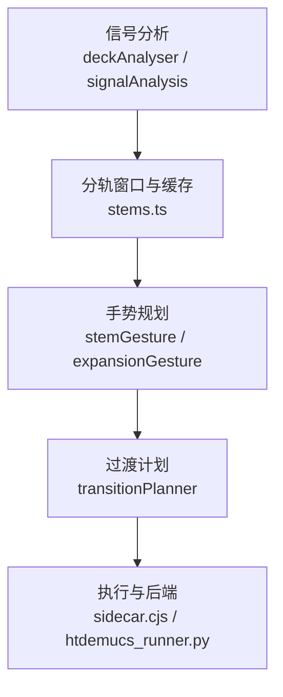
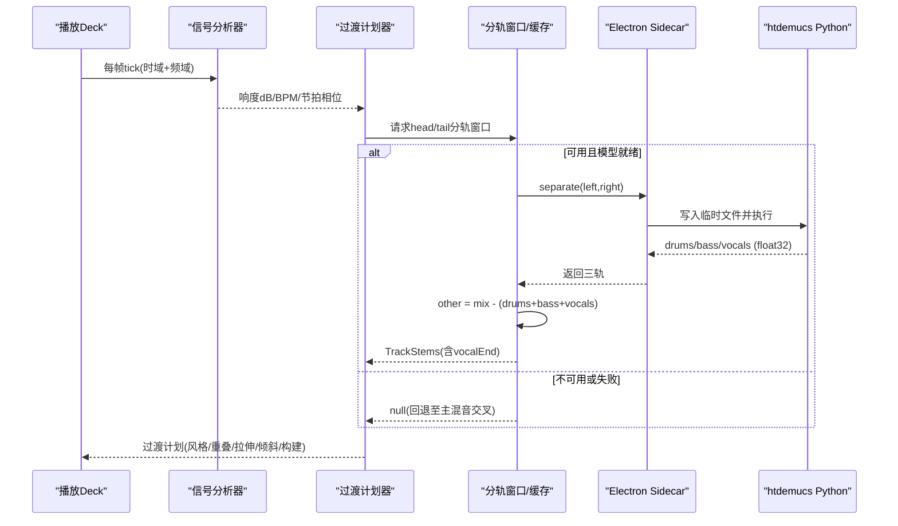
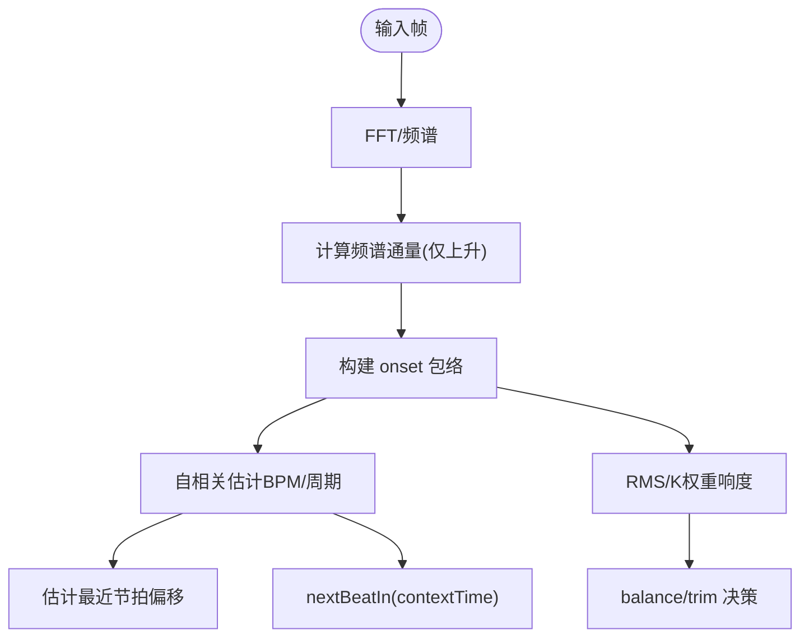
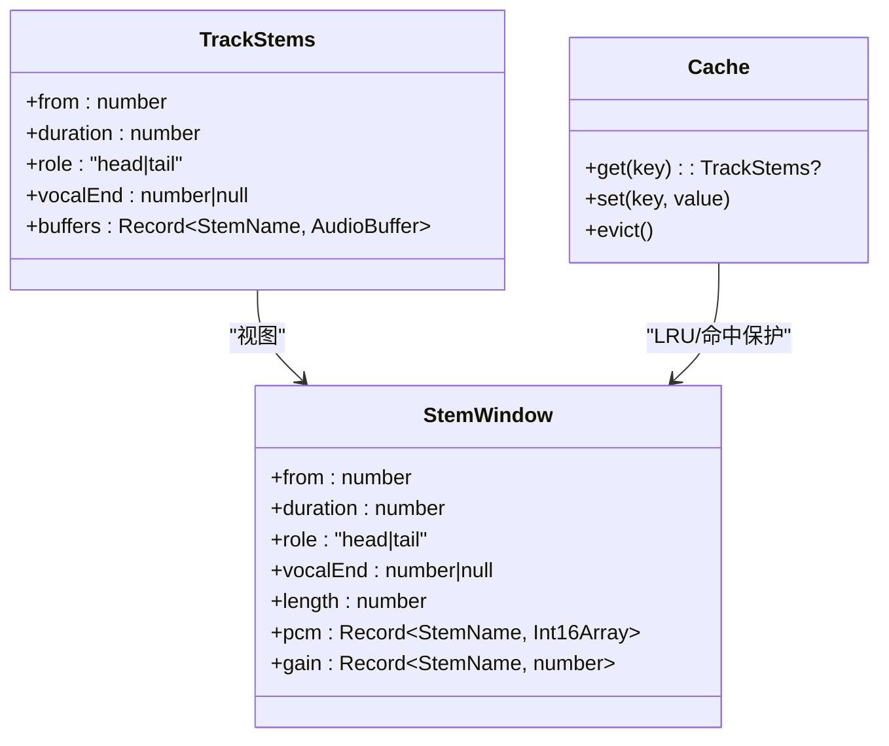
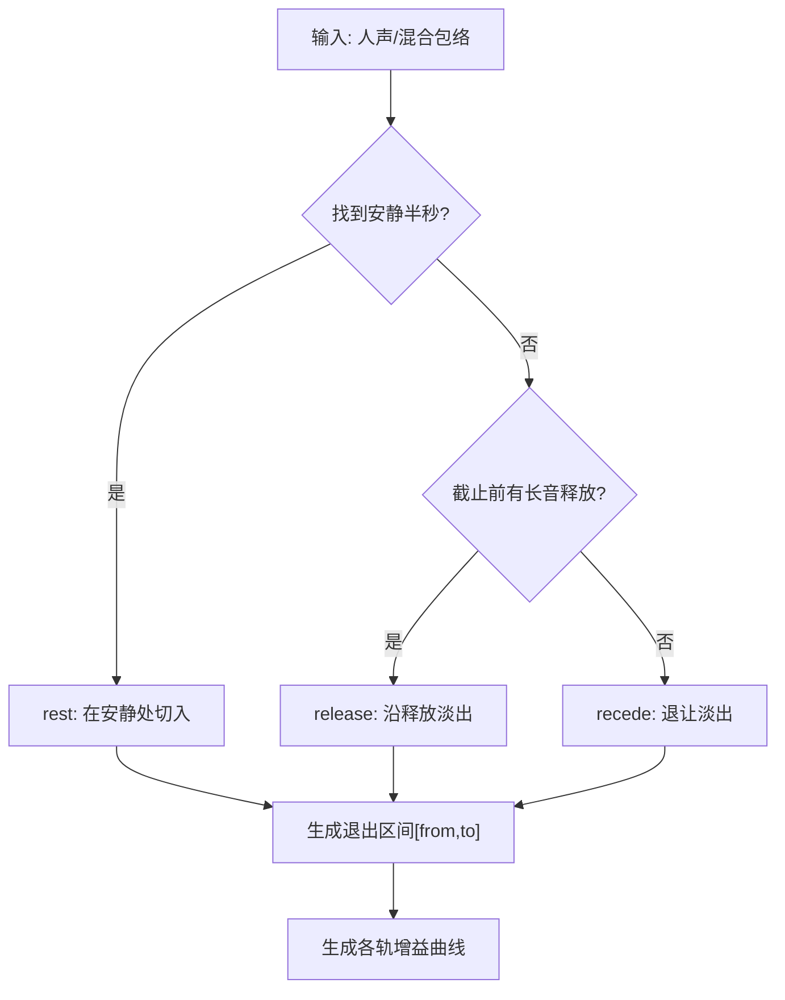
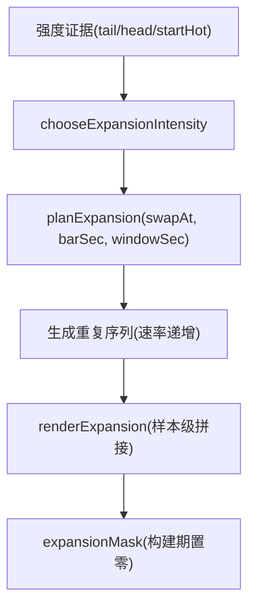
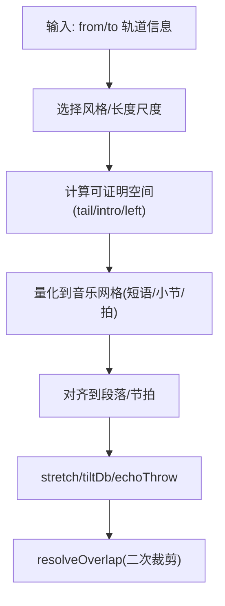
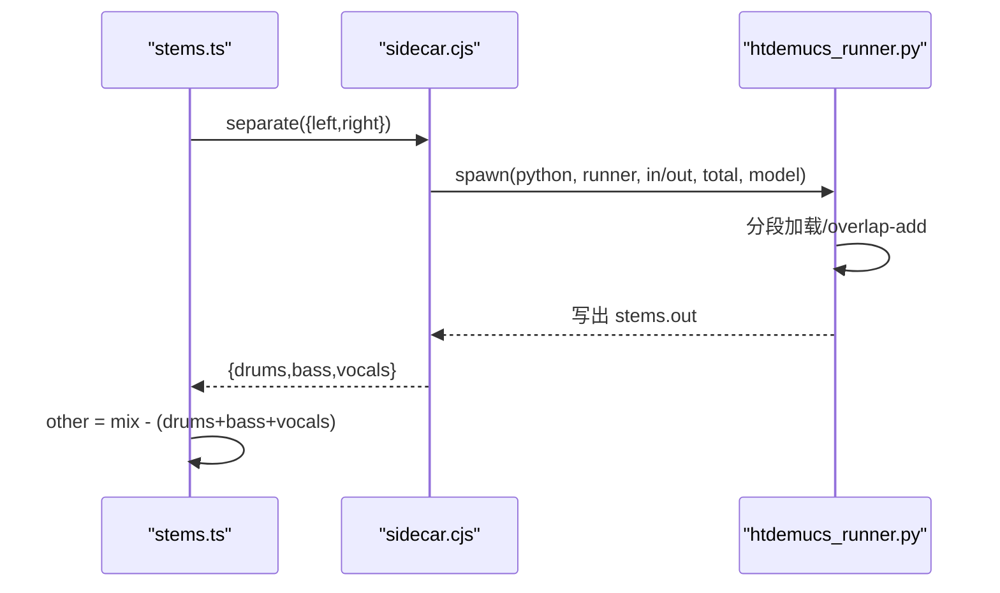
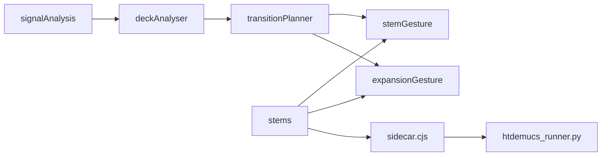

# 分轨处理

<cite>
**本文引用的文件**
- [src/services/automix/stems.ts](file://src/services/automix/stems.ts)
- [src/services/automix/stemGesture.ts](file://src/services/automix/stemGesture.ts)
- [src/services/automix/expansionGesture.ts](file://src/services/automix/expansionGesture.ts)
- [src/services/automix/signalAnalysis.ts](file://src/services/automix/signalAnalysis.ts)
- [src/services/automix/deckAnalyser.ts](file://src/services/automix/deckAnalyser.ts)
- [src/services/automix/transitionPlanner.ts](file://src/services/automix/transitionPlanner.ts)
- [electron/analysis/sidecar.cjs](file://electron/analysis/sidecar.cjs)
- [electron/analysis/htdemucs_runner.py](file://electron/analysis/htdemucs_runner.py)
- [test/unit/automix/expansionGesture.test.ts](file://test/unit/automix/expansionGesture.test.ts)
</cite>

## 目录
1. [简介](#简介)
2. [项目结构](#项目结构)
3. [核心组件](#核心组件)
4. [架构总览](#架构总览)
5. [详细组件分析](#详细组件分析)
6. [依赖关系分析](#依赖关系分析)
7. [性能与工程考量](#性能与工程考量)
8. [故障排查指南](#故障排查指南)
9. [结论](#结论)
10. [附录：自定义分轨效果开发指南](#附录自定义分轨效果开发指南)

## 简介
本技术文档围绕 Folia Player 的分轨处理系统，系统性说明音频分离、智能手势（人声淡出检测、鼓点同步、乐器切换）、扩展手势（能量构建、高潮增强、动态调整）、缓冲与内存管理、实时处理延迟控制，以及质量监控与调试工具。文档同时提供自定义分轨效果的扩展指南，帮助开发者在现有能力基础上拓展更多音乐表现手法。

## 项目结构
Folia 的分轨处理由“信号分析—分轨窗口—手势规划—渲染调度”四层构成，并在桌面端通过 Electron sidecar 调用 Python 侧的 htdemucs 模型完成高质量分离。关键路径如下：
- 信号分析与节拍估计：deckAnalyser + signalAnalysis
- 分轨窗口与缓存：stems（窗口切分、PCM 存储、缓存淘汰）
- 手势与过渡：stemGesture（人声淡出/释放/退让）、expansionGesture（构建/高潮增强）、transitionPlanner（整体过渡计划）
- 执行与后端：sidecar.cjs + htdemucs_runner.py（Python 进程内 ONNX 推理）

**图表来源**
- [src/services/automix/deckAnalyser.ts:63-176](file://src/services/automix/deckAnalyser.ts#L63-L176)
- [src/services/automix/signalAnalysis.ts:165-309](file://src/services/automix/signalAnalysis.ts#L165-L309)
- [src/services/automix/stems.ts:494-664](file://src/services/automix/stems.ts#L494-L664)
- [src/services/automix/stemGesture.ts:260-429](file://src/services/automix/stemGesture.ts#L260-L429)
- [src/services/automix/expansionGesture.ts:176-269](file://src/services/automix/expansionGesture.ts#L176-L269)
- [src/services/automix/transitionPlanner.ts:320-738](file://src/services/automix/transitionPlanner.ts#L320-L738)
- [electron/analysis/sidecar.cjs:85-117](file://electron/analysis/sidecar.cjs#L85-L117)
- [electron/analysis/htdemucs_runner.py:75-103](file://electron/analysis/htdemucs_runner.py#L75-L103)

**章节来源**
- [src/services/automix/deckAnalyser.ts:63-176](file://src/services/automix/deckAnalyser.ts#L63-L176)
- [src/services/automix/signalAnalysis.ts:165-309](file://src/services/automix/signalAnalysis.ts#L165-L309)
- [src/services/automix/stems.ts:494-664](file://src/services/automix/stems.ts#L494-L664)
- [src/services/automix/stemGesture.ts:260-429](file://src/services/automix/stemGesture.ts#L260-L429)
- [src/services/automix/expansionGesture.ts:176-269](file://src/services/automix/expansionGesture.ts#L176-L269)
- [src/services/automix/transitionPlanner.ts:320-738](file://src/services/automix/transitionPlanner.ts#L320-L738)
- [electron/analysis/sidecar.cjs:85-117](file://electron/analysis/sidecar.cjs#L85-L117)
- [electron/analysis/htdemucs_runner.py:75-103](file://electron/analysis/htdemucs_runner.py#L75-L103)

## 核心组件
- 信号分析器：基于频谱通量与自相关估计 BPM、节拍相位，并输出 K-weighted 响度历史，用于平衡与交叉点决策。
- 分轨窗口：将曲目尾/头切分为固定时长窗口，按四轨（鼓、贝斯、人声、其他）分离后以 16bit PCM 存储，按需生成可播放 AudioBuffer。
- 手势引擎：
  - stemGesture：人声淡出检测（rest/recede/release），鼓/贝斯/其他乐器的交接曲线。
  - expansionGesture：构建/高潮增强（加速重复、倒带尾音、强度分级）。
- 过渡计划器：综合歌词、离线分析、节拍网格、单声道/双声道资源，决定重叠长度、风格、拉伸、音色倾斜等。
- 后端执行：Electron sidecar 启动 Python 进程运行 htdemucs，返回三轨（drums/bass/vocals），other 由差值计算得到。

**章节来源**
- [src/services/automix/deckAnalyser.ts:63-176](file://src/services/automix/deckAnalyser.ts#L63-L176)
- [src/services/automix/stems.ts:63-181](file://src/services/automix/stems.ts#L63-L181)
- [src/services/automix/stemGesture.ts:111-162](file://src/services/automix/stemGesture.ts#L111-L162)
- [src/services/automix/expansionGesture.ts:77-103](file://src/services/automix/expansionGesture.ts#L77-L103)
- [src/services/automix/transitionPlanner.ts:29-102](file://src/services/automix/transitionPlanner.ts#L29-L102)
- [electron/analysis/sidecar.cjs:18-117](file://electron/analysis/sidecar.cjs#L18-L117)
- [electron/analysis/htdemucs_runner.py:29-103](file://electron/analysis/htdemucs_runner.py#L29-L103)

## 架构总览
下图展示从信号采样到最终分轨输出的端到端流程，包括离线/在线分支与错误回退策略。

**图表来源**
- [src/services/automix/deckAnalyser.ts:118-176](file://src/services/automix/deckAnalyser.ts#L118-L176)
- [src/services/automix/transitionPlanner.ts:320-738](file://src/services/automix/transitionPlanner.ts#L320-L738)
- [src/services/automix/stems.ts:494-664](file://src/services/automix/stems.ts#L494-L664)
- [electron/analysis/sidecar.cjs:85-117](file://electron/analysis/sidecar.cjs#L85-L117)
- [electron/analysis/htdemucs_runner.py:207-247](file://electron/analysis/htdemucs_runner.py#L207-L247)

## 详细组件分析

### 信号分析与节拍估计
- 频谱通量：仅统计上升段，避免衰减拖尾造成节拍模糊。
- 自相关估计：在合理BPM范围内搜索周期，结合谐波加权与抛物线拟合提高精度；输出置信度与最近节拍偏移。
- 响度与K权重：采用广播标准K-weighting，使离线与在线响度可比对，支撑平衡修正与交叉点选择。

**图表来源**
- [src/services/automix/signalAnalysis.ts:95-111](file://src/services/automix/signalAnalysis.ts#L95-L111)
- [src/services/automix/signalAnalysis.ts:165-309](file://src/services/automix/signalAnalysis.ts#L165-L309)
- [src/services/automix/deckAnalyser.ts:118-176](file://src/services/automix/deckAnalyser.ts#L118-L176)

**章节来源**
- [src/services/automix/signalAnalysis.ts:95-111](file://src/services/automix/signalAnalysis.ts#L95-L111)
- [src/services/automix/signalAnalysis.ts:165-309](file://src/services/automix/signalAnalysis.ts#L165-L309)
- [src/services/automix/deckAnalyser.ts:118-176](file://src/services/automix/deckAnalyser.ts#L118-L176)

### 分轨窗口与缓存（stems.ts）
- 窗口大小：固定 30s，兼顾 CPU 与内存；每个窗口最多占用约 21MB（16bit 四轨）。
- 存储格式：Int16Array 双声道交错，按轨峰值归一化，回放时再还原为浮点 AudioBuffer。
- 缓存策略：保留当前与上一对窗口（MAX_WINDOWS=4），按“是否仍被需要”与“到达时间”淘汰。
- 本地读取：优先媒体缓存或本地 URL；不主动下载网络音频。
- vocalEnd 测量：仅在 tail 窗口测量，供过渡计划器避免人声叠加。

**图表来源**
- [src/services/automix/stems.ts:63-181](file://src/services/automix/stems.ts#L63-L181)
- [src/services/automix/stems.ts:196-358](file://src/services/automix/stems.ts#L196-L358)

**章节来源**
- [src/services/automix/stems.ts:37-58](file://src/services/automix/stems.ts#L37-L58)
- [src/services/automix/stems.ts:63-181](file://src/services/automix/stems.ts#L63-L181)
- [src/services/automix/stems.ts:196-358](file://src/services/automix/stems.ts#L196-L358)
- [src/services/automix/stems.ts:494-664](file://src/services/automix/stems.ts#L494-L664)

### 人声淡出检测与交接（stemGesture.ts）
- 三种退出方式：
  - rest：在安静半秒处切入，速度随深度自适应（更安静则更快）。
  - recede：无安静处则退让，起始于鼓组交接附近，保证最小时长。
  - release：若结尾有长音且在截止前释放，则沿歌手释放自然淡出。
- 交接时序：鼓先换（极短边），贝斯延一拍，人声在一拍后进入；其他乐器提前淡出。
- 关键阈值：REST_DB=-30dB、CUT_SEC≈0.5s、MIN_RECEDE_SEC=1s、SUSTAIN_MIN_SEC=1.2s 等，均经盲听测试收敛。

**图表来源**
- [src/services/automix/stemGesture.ts:260-429](file://src/services/automix/stemGesture.ts#L260-L429)
- [src/services/automix/stemGesture.ts:521-676](file://src/services/automix/stemGesture.ts#L521-L676)
- [src/services/automix/stemGesture.ts:717-742](file://src/services/automix/stemGesture.ts#L717-L742)

**章节来源**
- [src/services/automix/stemGesture.ts:111-162](file://src/services/automix/stemGesture.ts#L111-L162)
- [src/services/automix/stemGesture.ts:260-429](file://src/services/automix/stemGesture.ts#L260-L429)
- [src/services/automix/stemGesture.ts:521-676](file://src/services/automix/stemGesture.ts#L521-L676)
- [src/services/automix/stemGesture.ts:717-742](file://src/services/automix/stemGesture.ts#L717-L742)

### 构建与高潮增强（expansionGesture.ts）
- 强度分级：0.25/0.5/0.75/1.0，分别对应不同重复次数、速率提升与倒带尾音。
- 节奏划分：以半拍为最浅划分，逐级加倍，形成加速感。
- 素材选取：每层取一段对齐到鼓瞬态的片段循环，避免静音循环。
- 渲染：样本级拼接，支持负向步进实现倒带尾音，两端加极短 fade 消除包裹伪影。
- 掩码：构建期间将原轨对应轨置零，避免双重发声。

**图表来源**
- [src/services/automix/expansionGesture.ts:139-163](file://src/services/automix/expansionGesture.ts#L139-L163)
- [src/services/automix/expansionGesture.ts:176-269](file://src/services/automix/expansionGesture.ts#L176-L269)
- [src/services/automix/expansionGesture.ts:281-357](file://src/services/automix/expansionGesture.ts#L281-L357)

**章节来源**
- [src/services/automix/expansionGesture.ts:28-75](file://src/services/automix/expansionGesture.ts#L28-L75)
- [src/services/automix/expansionGesture.ts:139-163](file://src/services/automix/expansionGesture.ts#L139-L163)
- [src/services/automix/expansionGesture.ts:176-269](file://src/services/automix/expansionGesture.ts#L176-L269)
- [src/services/automix/expansionGesture.ts:281-357](file://src/services/automix/expansionGesture.ts#L281-L357)
- [test/unit/automix/expansionGesture.test.ts:17-61](file://test/unit/automix/expansionGesture.test.ts#L17-L61)

### 过渡计划（transitionPlanner.ts）
- 重叠长度：默认以乐句为单位，受键位关系、节拍关系、尾部/首部可证明空间限制。
- 网格对齐：优先段落边界，其次节拍网格；允许小幅移动以对齐。
- 人声保护：利用 vocalEnd 与歌词末尾，避免两轨人声叠加。
- 风格选择：beatCut/plainBlend 等，配合 echoThrow、tiltDb、stretch 等参数。
- 二次校验：实际入点时再次裁剪重叠，确保不超出剩余时长。

**图表来源**
- [src/services/automix/transitionPlanner.ts:320-738](file://src/services/automix/transitionPlanner.ts#L320-L738)

**章节来源**
- [src/services/automix/transitionPlanner.ts:104-174](file://src/services/automix/transitionPlanner.ts#L104-L174)
- [src/services/automix/transitionPlanner.ts:320-738](file://src/services/automix/transitionPlanner.ts#L320-L738)

### 后端执行（sidecar.cjs + htdemucs_runner.py）
- 数据流：JS 将左右声道写为临时 float32 文件 → Python 进程分段推理 → 写出三轨 → JS 读取并重组。
- 内存优化：关闭 ORT 内存复用与 arena，降低峰值；Windows 上尝试偏好高性能核心。
- 安全：使用 mkdtemp 与原子替换，避免竞态与注入风险。
- 容错：超时、非零退出码、输出尺寸校验失败均回退至主混音交叉。

**图表来源**
- [electron/analysis/sidecar.cjs:85-117](file://electron/analysis/sidecar.cjs#L85-L117)
- [electron/analysis/htdemucs_runner.py:75-103](file://electron/analysis/htdemucs_runner.py#L75-L103)
- [electron/analysis/htdemucs_runner.py:207-247](file://electron/analysis/htdemucs_runner.py#L207-L247)

**章节来源**
- [electron/analysis/sidecar.cjs:18-117](file://electron/analysis/sidecar.cjs#L18-L117)
- [electron/analysis/htdemucs_runner.py:29-103](file://electron/analysis/htdemucs_runner.py#L29-L103)
- [electron/analysis/htdemucs_runner.py:207-247](file://electron/analysis/htdemucs_runner.py#L207-L247)

## 依赖关系分析
- 低耦合：手势与计划模块均为纯函数（数组→数组/数字），便于单元测试与离线验证。
- 明确边界：stems.ts 负责“材料”，gesture 系列负责“编排”，transitionPlanner 负责“策略”。
- 外部依赖：Electron 桥接 Python 进程；ONNXRuntime 在 Python 侧运行；浏览器端回退至主混音。

**图表来源**
- [src/services/automix/signalAnalysis.ts:165-309](file://src/services/automix/signalAnalysis.ts#L165-L309)
- [src/services/automix/deckAnalyser.ts:63-176](file://src/services/automix/deckAnalyser.ts#L63-L176)
- [src/services/automix/stems.ts:494-664](file://src/services/automix/stems.ts#L494-L664)
- [src/services/automix/stemGesture.ts:260-429](file://src/services/automix/stemGesture.ts#L260-L429)
- [src/services/automix/expansionGesture.ts:176-269](file://src/services/automix/expansionGesture.ts#L176-L269)
- [src/services/automix/transitionPlanner.ts:320-738](file://src/services/automix/transitionPlanner.ts#L320-L738)
- [electron/analysis/sidecar.cjs:85-117](file://electron/analysis/sidecar.cjs#L85-L117)
- [electron/analysis/htdemucs_runner.py:75-103](file://electron/analysis/htdemucs_runner.py#L75-L103)

**章节来源**
- [src/services/automix/stems.ts:494-664](file://src/services/automix/stems.ts#L494-L664)
- [src/services/automix/stemGesture.ts:260-429](file://src/services/automix/stemGesture.ts#L260-L429)
- [src/services/automix/expansionGesture.ts:176-269](file://src/services/automix/expansionGesture.ts#L176-L269)
- [src/services/automix/transitionPlanner.ts:320-738](file://src/services/automix/transitionPlanner.ts#L320-L738)
- [electron/analysis/sidecar.cjs:85-117](file://electron/analysis/sidecar.cjs#L85-L117)
- [electron/analysis/htdemucs_runner.py:75-103](file://electron/analysis/htdemucs_runner.py#L75-L103)

## 性能与工程考量
- 内存优化
  - 分轨窗口使用 16bit PCM 存储，峰值归一化，显著降低驻留内存。
  - 缓存上限 MAX_WINDOWS=4，按“仍被需要”与“到达时间”淘汰，避免冷结果挤占热数据。
  - Python 侧关闭内存复用与 arena，降低峰值 RSS。
- 延迟控制
  - 窗口长度 30s，分离耗时约数倍实时；通过提前排队与 profilesSettled 等待，减少阻塞。
  - 队列串行化，避免多窗口并行导致测量失真与资源争用。
- 实时处理
  - 手势与计划为纯函数，渲染阶段才涉及样本操作，利于主线程稳定。
  - 构建/高潮增强在样本级合成，避免运行时重采样带来的相位/音高不一致。
- 回退策略
  - 模型不可用/失败/未就绪时，自动回退到主混音交叉，保证体验连续性。

[本节为通用指导，无需特定文件引用]

## 故障排查指南
- 分离失败或无结果
  - 检查 Electron 桥是否可用、模型是否就绪；查看日志中“waiting to separate”“separation failed”等提示。
  - 确认媒体缓存已就绪；本地文件需可访问。
- 构建/高潮增强无效
  - 检查强度选择逻辑的证据（tail/head 电平、startsHot）；确认 swapAt 位置与 barSec 合理。
  - 验证 expansionMask 是否正确覆盖构建区间。
- 人声淡出不自然
  - 检查 vocalEnd 测量是否有效；确认 REST_DB、CUT_SEC、MIN_RECEDE_SEC 等阈值未被误改。
  - 核对 incoming.sings 判断，避免在无人在场时过早退让。
- 性能瓶颈
  - 关注 Python 进程 peak_ws_mb/infer_s；必要时降低并发或缩短窗口。
  - 观察缓存命中率与淘汰策略，避免频繁重建。

**章节来源**
- [src/services/automix/stems.ts:494-664](file://src/services/automix/stems.ts#L494-L664)
- [src/services/automix/expansionGesture.ts:139-163](file://src/services/automix/expansionGesture.ts#L139-L163)
- [src/services/automix/stemGesture.ts:260-429](file://src/services/automix/stemGesture.ts#L260-L429)
- [electron/analysis/htdemucs_runner.py:207-247](file://electron/analysis/htdemucs_runner.py#L207-L247)

## 结论
Folia 的分轨处理系统以“高质量分离 + 智能手势 + 稳健计划”为核心，既能在桌面端发挥 htdemucs 的优势，也能在浏览器端优雅回退。通过严格的阈值与盲听调优，系统在“人声淡出检测、鼓点同步、乐器切换、构建/高潮增强”等方面实现了可感知的高质量过渡。同时，内存与延迟的工程化设计保障了实时可用性。建议在生产环境中持续采集日志指标，结合用户反馈微调阈值与策略。

[本节为总结性内容，无需特定文件引用]

## 附录：自定义分轨效果开发指南
- 扩展点定位
  - 在 stems.ts 的 ensureStems 完成后，已有四轨（drums/bass/vocals/other）与 vocalEnd 可用，适合在此插入自定义效果。
  - 在 stemGesture 与 expansionGesture 的曲线生成处，可叠加新的调制曲线（如动态压缩、瞬态增强、频段塑形）。
- 开发步骤
  - 定义新效果接口：输入为 Float32Array[]（多轨），输出同样为多轨；保持采样率一致。
  - 集成到渲染管线：在 outgoingCurves/incomingCurves 之后应用，或在 expansionMask 覆盖区间内生效。
  - 参数化与UI：暴露可调参数（强度、阈值、范围），并通过设置面板持久化。
  - 测试与评估：使用 unit test 验证稳定性与边界条件；进行盲听对比，确保不引入可闻伪影。
- 最佳实践
  - 保持线性相位或可控非线性，避免引入额外瞬态。
  - 对低频与高频分别处理，避免相互干扰。
  - 与现有手势解耦：以曲线乘性或旁链方式接入，不影响原有交接时序。
- 参考路径
  - 效果节点与分支：effectBranchRelease、effectNodes、effectParams
  - 噪声分支示例：noiseBranch（可作为参考实现旁链/噪声门限）
  - 均衡器与预设：audioEqualizer（频段管理与预设映射）

[本节为概念性指导，无需特定文件引用]