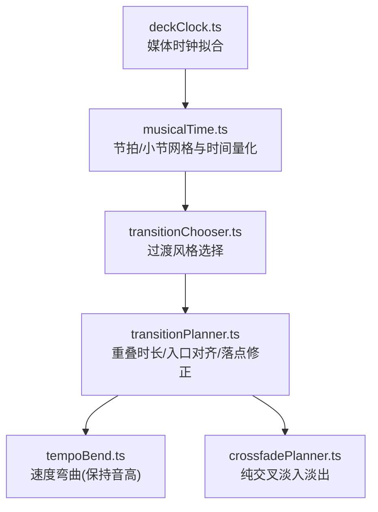
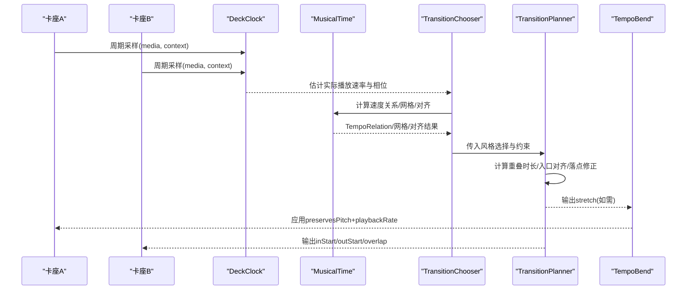
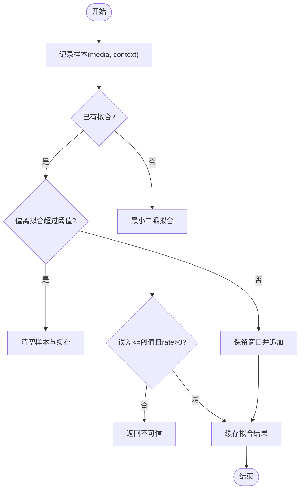
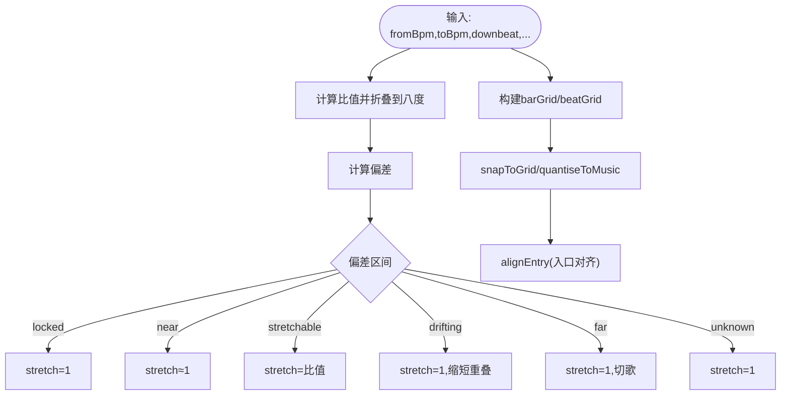
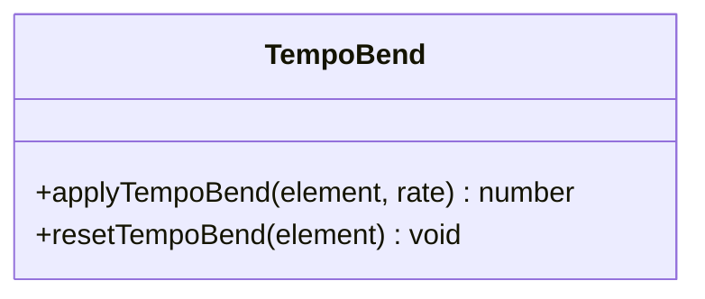
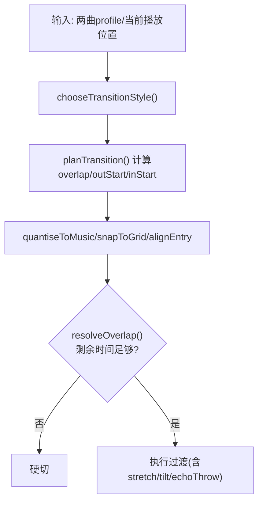
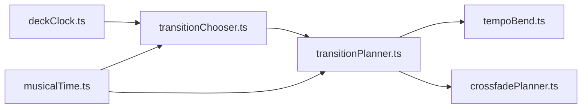

# 实时处理

<cite>
**本文引用的文件**
- [deckClock.ts](file://src/services/automix/deckClock.ts)
- [musicalTime.ts](file://src/services/automix/musicalTime.ts)
- [tempoBend.ts](file://src/services/automix/tempoBend.ts)
- [transitionPlanner.ts](file://src/services/automix/transitionPlanner.ts)
- [transitionChooser.ts](file://src/services/automix/transitionChooser.ts)
- [crossfadePlanner.ts](file://src/services/automix/crossfadePlanner.ts)
- [deckClock.test.ts](file://test/unit/automix/deckClock.test.ts)
</cite>

## 目录
1. [简介](#简介)
2. [项目结构](#项目结构)
3. [核心组件](#核心组件)
4. [架构总览](#架构总览)
5. [详细组件分析](#详细组件分析)
6. [依赖关系分析](#依赖关系分析)
7. [性能考量](#性能考量)
8. [故障排查指南](#故障排查指南)
9. [结论](#结论)
10. [附录](#附录)

## 简介
本文件面向 Folia Player 的“自动混音/双卡座”实时音频处理子系统，聚焦以下目标：
- 双卡座时钟同步：以媒体元素位置采样与最小二乘拟合恢复亚毫秒级相位，实现跨卡座的精确对齐。
- 音乐时间系统：节拍网格、小节计算、时间量化到乐句/小节/拍，保证过渡落在音乐性边界上。
- 速度弯曲算法：基于 tempo matching、pitch correction（保持音高）、平滑过渡策略，避免可闻失真。
- 实时调度机制：任务队列、优先级管理、资源竞争控制（在规划层体现为“窗口/预算/门限”）。
- 性能监控与调试：提供定位延迟、CPU/内存压力与卡顿的方法论与指标建议。

## 项目结构
自动混音相关代码集中在 services/automix 目录，按职责分层：
- 时钟与测量：deckClock.ts（媒体位置采样、线性拟合、可信度判定）
- 音乐时间：musicalTime.ts（节拍/小节网格、时间量化、速度关系分类）
- 速度弯曲：tempoBend.ts（设置播放速率并保持音高）
- 过渡选择与规划：transitionChooser.ts（风格选择、长度缩放）、transitionPlanner.ts（重叠时长、入口对齐、落点修正）、crossfadePlanner.ts（纯交叉淡入淡出模式）
- 测试：deckClock.test.ts（验证拟合精度与稳定性）

**图表来源**
- [deckClock.ts:1-152](file://src/services/automix/deckClock.ts#L1-L152)
- [musicalTime.ts:1-275](file://src/services/automix/musicalTime.ts#L1-L275)
- [transitionChooser.ts:1-356](file://src/services/automix/transitionChooser.ts#L1-L356)
- [transitionPlanner.ts:1-753](file://src/services/automix/transitionPlanner.ts#L1-L753)
- [tempoBend.ts:1-34](file://src/services/automix/tempoBend.ts#L1-L34)
- [crossfadePlanner.ts:1-100](file://src/services/automix/crossfadePlanner.ts#L1-L100)

**章节来源**
- [deckClock.ts:1-152](file://src/services/automix/deckClock.ts#L1-L152)
- [musicalTime.ts:1-275](file://src/services/automix/musicalTime.ts#L1-L275)
- [transitionChooser.ts:1-356](file://src/services/automix/transitionChooser.ts#L1-L356)
- [transitionPlanner.ts:1-753](file://src/services/automix/transitionPlanner.ts#L1-L753)
- [tempoBend.ts:1-34](file://src/services/automix/tempoBend.ts#L1-L34)
- [crossfadePlanner.ts:1-100](file://src/services/automix/crossfadePlanner.ts#L1-L100)

## 核心组件
- 双卡座时钟（Deck Clock）
  - 通过周期性采样媒体元素的 media 位置与 AudioContext 上下文时间 context，使用最小二乘法拟合直线，得到 offset 与 rate，从而在任意上下文时间下推断媒体位置，误差远小于媒体更新步长。
  - 提供 positionAt/reaches/rate 等接口，用于在共享音频时钟上对齐两个卡座。
- 音乐时间（Musical Time）
  - 将两曲的速度关系分为 locked/near/stretchable/drifting/far/unknown，并据此决定是否需要速度弯曲以及最大允许的重叠时长。
  - 提供 barGrid/snapToGrid/quantiseToMusic/alignEntry 等工具，确保过渡落在小节/拍/乐句等音乐性边界上。
- 速度弯曲（Tempo Bend）
  - 通过设置 HTMLAudioElement.preservesPitch=true 并调整 playbackRate，实现不改变音高的变速；当无需变速时重置回原速。
- 过渡选择与规划（Transition Chooser & Planner）
  - 根据调性关系、能量阶跃、尾段衰减、下一曲开头是否“热起”等因素选择过渡风格（beatCut/bassSwap/tailRide/plainBlend），并计算重叠时长、入口对齐、落点修正。
  - 纯交叉淡入淡出模式遵循固定形状与用户设定时长，不受智能规则影响。

**章节来源**
- [deckClock.ts:18-152](file://src/services/automix/deckClock.ts#L18-L152)
- [musicalTime.ts:10-275](file://src/services/automix/musicalTime.ts#L10-L275)
- [tempoBend.ts:10-34](file://src/services/automix/tempoBend.ts#L10-L34)
- [transitionChooser.ts:20-356](file://src/services/automix/transitionChooser.ts#L20-L356)
- [transitionPlanner.ts:29-753](file://src/services/automix/transitionPlanner.ts#L29-L753)
- [crossfadePlanner.ts:26-100](file://src/services/automix/crossfadePlanner.ts#L26-L100)

## 架构总览
下图展示从“时钟测量→音乐时间→过渡选择→过渡规划→执行参数”的完整数据流与控制流。

**图表来源**
- [deckClock.ts:18-152](file://src/services/automix/deckClock.ts#L18-L152)
- [musicalTime.ts:10-275](file://src/services/automix/musicalTime.ts#L10-L275)
- [transitionChooser.ts:175-356](file://src/services/automix/transitionChooser.ts#L175-L356)
- [transitionPlanner.ts:320-753](file://src/services/automix/transitionPlanner.ts#L320-L753)
- [tempoBend.ts:10-34](file://src/services/automix/tempoBend.ts#L10-L34)

## 详细组件分析

### 双卡座时钟同步（Deck Clock）
- 设计要点
  - 媒体 currentTime 是阶梯式更新（例如每20ms一次），直接比较会产生抖动。通过对一段时间内的 (context, media) 样本做最小二乘拟合，恢复真实线性关系，从而在任意上下文时间下推断媒体位置，误差远小于单步量子。
  - 引入“可信度”判定：残差 RMS 必须低于阈值，且测得速率需为正，否则丢弃历史重新拟合。
  - 提供 reaches(mediaPosition, notBefore) 用于反向查询“何时到达某媒体位置”，便于在共享音频时钟上安排事件。
- 复杂度与性能
  - 每次新增样本后重算滑动窗口内的拟合，窗口长度固定（约1.5秒），均摊 O(1)。
  - 仅使用基本算术运算，CPU 开销极低。
- 错误处理
  - 样本不足或全部在同一时刻则返回空；超出容差（如 seek/stall）则清空窗口重建拟合。

**图表来源**
- [deckClock.ts:50-152](file://src/services/automix/deckClock.ts#L50-L152)

**章节来源**
- [deckClock.ts:18-152](file://src/services/automix/deckClock.ts#L18-L152)
- [deckClock.test.ts:18-49](file://test/unit/automix/deckClock.test.ts#L18-L49)

### 音乐时间系统（Musical Time）
- 速度关系分类
  - 将两曲 BPM 比值折叠到八度内，按偏差划分 locked/near/stretchable/drifting/far/unknown，分别对应“无需处理/微小拉伸/可听但可修复/漂移/切歌/未知”。
- 网格与对齐
  - 基于 BPM 与 downbeatOffset 构建 barGrid；提供 snapToGrid 将时间点吸附到最近网格线（带容差）；quantiseToMusic 将重叠时长量化到乐句/小节/拍。
  - alignEntry 将下一曲的起始点移动到与其小节/拍对齐的位置，避免“增益曲线无法解决的相位差”。
- 复杂度
  - 均为常数时间操作，适合高频调用。

**图表来源**
- [musicalTime.ts:10-275](file://src/services/automix/musicalTime.ts#L10-L275)

**章节来源**
- [musicalTime.ts:10-275](file://src/services/automix/musicalTime.ts#L10-L275)

### 速度弯曲算法（Tempo Bend）
- 原理
  - 通过设置 preservesPitch=true 并调整 playbackRate，使卡座以不同速度播放而不改变音高；当不需要变速时重置为原速。
- 限制与动机
  - 由于 Web Audio 默认已保持音高，此处显式声明以避免被复用元素的状态污染；同时移除不必要的 AudioWorklet，降低延迟与体积。
- 适用场景
  - 仅在 transitionChooser/transitionPlanner 判定需要 stretch 时调用，且通常作用于即将离场的曲目，以减少对正在进入曲目的扰动。

**图表来源**
- [tempoBend.ts:10-34](file://src/services/automix/tempoBend.ts#L10-L34)

**章节来源**
- [tempoBend.ts:10-34](file://src/services/automix/tempoBend.ts#L10-L34)

### 过渡选择与规划（Transition Chooser & Planner）
- 过渡风格选择
  - 依据调性关系、能量阶跃、尾段衰减、下一曲是否“热起”等条件，选择 beatCut/bassSwap/tailRide/plainBlend，并给出长度缩放系数与音色倾斜校正。
- 重叠时长与落点
  - 优先寻找“无歌词/无主唱”的安全窗口；若不可用，仍保证一定长度的过渡；最终将 outStart/inStart/overlap 量化到拍/小节/乐句。
  - 对“切歌”风格，预留等待预算以落在拍线上；对“尾骑”风格，利用下一曲的 intro 承接尾段衰减。
- 二次门限
  - 在真正启动下一曲前再次检查剩余时间，若不足以完成最小重叠则退化为硬切。

**图表来源**
- [transitionChooser.ts:175-356](file://src/services/automix/transitionChooser.ts#L175-L356)
- [transitionPlanner.ts:320-753](file://src/services/automix/transitionPlanner.ts#L320-L753)

**章节来源**
- [transitionChooser.ts:175-356](file://src/services/automix/transitionChooser.ts#L175-L356)
- [transitionPlanner.ts:320-753](file://src/services/automix/transitionPlanner.ts#L320-L753)
- [crossfadePlanner.ts:56-100](file://src/services/automix/crossfadePlanner.ts#L56-L100)

## 依赖关系分析
- 模块耦合
  - deckClock 独立于上层逻辑，仅负责高精度时钟估计。
  - musicalTime 为纯函数库，被 chooser/planner 共同依赖。
  - transitionChooser 依赖 musicalTime 与信号分析（调性/音色/能量），产出风格与长度缩放。
  - transitionPlanner 综合 chooser 的输出与 profile 信息，生成可执行的计划。
  - tempoBend 作为执行端，由 planner 驱动。
- 外部依赖
  - 依赖浏览器媒体元素与 AudioContext 提供的时钟与播放能力。
- 循环依赖
  - 未见循环引用；各层单向依赖，利于测试与维护。

**图表来源**
- [deckClock.ts:1-152](file://src/services/automix/deckClock.ts#L1-L152)
- [musicalTime.ts:1-275](file://src/services/automix/musicalTime.ts#L1-L275)
- [transitionChooser.ts:1-356](file://src/services/automix/transitionChooser.ts#L1-L356)
- [transitionPlanner.ts:1-753](file://src/services/automix/transitionPlanner.ts#L1-L753)
- [tempoBend.ts:1-34](file://src/services/automix/tempoBend.ts#L1-L34)
- [crossfadePlanner.ts:1-100](file://src/services/automix/crossfadePlanner.ts#L1-L100)

**章节来源**
- [deckClock.ts:1-152](file://src/services/automix/deckClock.ts#L1-L152)
- [musicalTime.ts:1-275](file://src/services/automix/musicalTime.ts#L1-L275)
- [transitionChooser.ts:1-356](file://src/services/automix/transitionChooser.ts#L1-L356)
- [transitionPlanner.ts:1-753](file://src/services/automix/transitionPlanner.ts#L1-L753)
- [tempoBend.ts:1-34](file://src/services/automix/tempoBend.ts#L1-L34)
- [crossfadePlanner.ts:1-100](file://src/services/automix/crossfadePlanner.ts#L1-L100)

## 性能考量
- 时钟拟合
  - 滑动窗口最小二乘，O(1) 均摊；窗口长度与断点阈值平衡了响应速度与鲁棒性。
- 音乐时间计算
  - 全为常数时间算术，适合高频调用。
- 过渡规划
  - 主要开销来自 profile 读取与少量分支判断；整体轻量。
- 执行端
  - 通过 preservesPitch + playbackRate 实现速度弯曲，避免额外 DSP 开销；必要时再考虑更复杂的变调/变速方案。
- 建议监控指标
  - CPU 使用率：关注 fitClock 与 planTransition 调用频率与耗时。
  - 内存占用：观察样本窗口增长与对象分配（应极小）。
  - 延迟统计：记录从“决策”到“实际播放”的时间差，评估网络/解码/缓冲带来的抖动。
  - 丢帧/卡顿：结合 UI 渲染与音频回调，定位瓶颈。

[本节为通用指导，不直接分析具体文件]

## 故障排查指南
- 时钟不稳定/跳变
  - 现象：reaches/positionAt 返回 null 或频繁重置。
  - 排查：检查样本间隔是否过短、是否存在 seek/stall；增大窗口或放宽断点阈值需谨慎，优先确认业务侧行为。
- 过渡未发生或过短
  - 现象：出现硬切或 overlap 过小。
  - 排查：查看 reason 字段（planner 会输出原因），确认是否受限于 left/singleVoiceRoom/gestureRoom；检查 profile 是否缺失导致无法判断安全窗口。
- 速度弯曲无效
  - 现象：两曲节奏不同步。
  - 排查：确认 stretch 是否非 1；检查 preservesPitch 是否被其他逻辑覆盖；核对 tempoMatch 的结果与阈值。
- 落点不准
  - 现象：过渡不在拍/小节上。
  - 排查：检查 grid 是否可用、snapToGrid 容差是否合理；确认 alignEntry 的 outgoingBarPhase 计算是否正确。

**章节来源**
- [deckClock.ts:82-152](file://src/services/automix/deckClock.ts#L82-L152)
- [transitionPlanner.ts:320-753](file://src/services/automix/transitionPlanner.ts#L320-L753)
- [musicalTime.ts:180-275](file://src/services/automix/musicalTime.ts#L180-L275)
- [tempoBend.ts:10-34](file://src/services/automix/tempoBend.ts#L10-L34)

## 结论
Folia Player 的自动混音子系统通过“高精度时钟拟合 + 音乐性时间建模 + 多风格过渡规划 + 轻量速度弯曲”的组合，实现了稳定、可预测且音乐性友好的双卡座实时切换。其关键优势在于：
- 时钟层面：以最小二乘拟合克服媒体更新的阶梯效应，达到亚毫秒级对齐。
- 音乐性层面：将过渡严格锚定在拍/小节/乐句等边界，避免“听起来不对”的错位。
- 策略层面：根据调性、能量、尾段与下一曲特性自适应选择过渡风格与时长，兼顾无缝与稳健。
- 执行层面：以最小改动（preservesPitch + playbackRate）达成速度匹配，降低延迟与复杂度。

[本节为总结性内容，不直接分析具体文件]

## 附录
- 术语对照
  - 卡座：Deck，指一个播放源（轨道/曲目）。
  - 重叠：Overlap，两曲同时发声的时间段。
  - 速度弯曲：Stretch/Bend，在不改变音高的前提下调整播放速率。
  - 网格：Grid，拍/小节/乐句的周期性时间轴。
- 参考路径
  - 时钟拟合与测试：[deckClock.ts](file://src/services/automix/deckClock.ts)、[deckClock.test.ts](file://test/unit/automix/deckClock.test.ts)
  - 音乐时间与对齐：[musicalTime.ts](file://src/services/automix/musicalTime.ts)
  - 速度弯曲：[tempoBend.ts](file://src/services/automix/tempoBend.ts)
  - 过渡选择与规划：[transitionChooser.ts](file://src/services/automix/transitionChooser.ts)、[transitionPlanner.ts](file://src/services/automix/transitionPlanner.ts)、[crossfadePlanner.ts](file://src/services/automix/crossfadePlanner.ts)

[本节为补充说明，不直接分析具体文件]