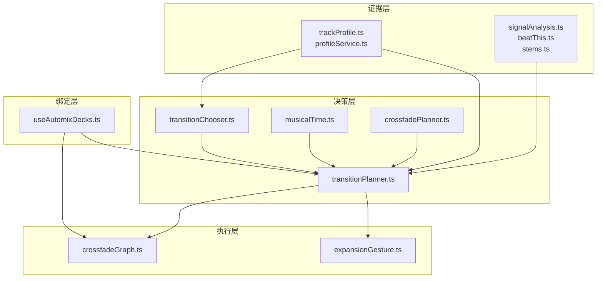
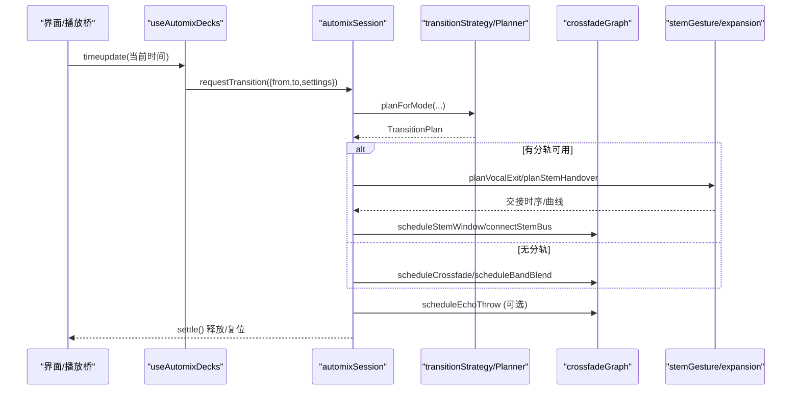
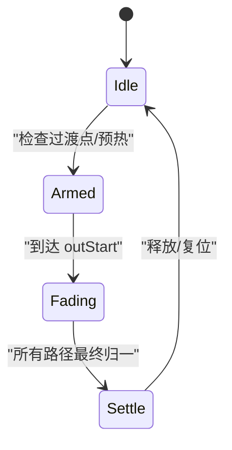
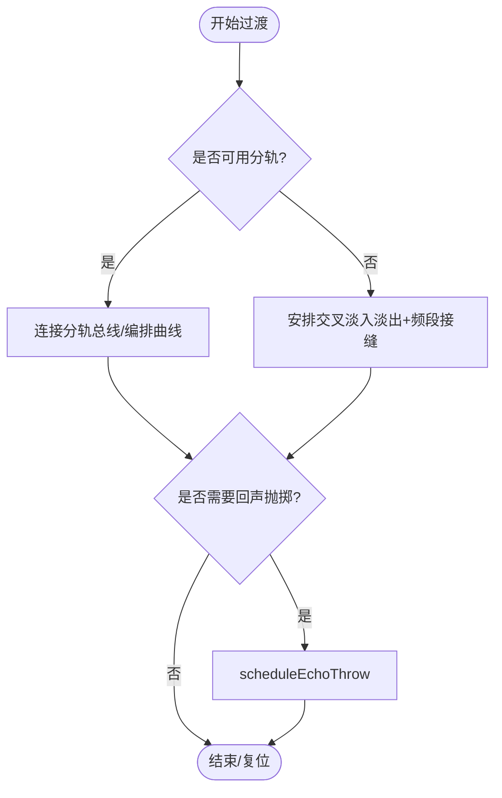
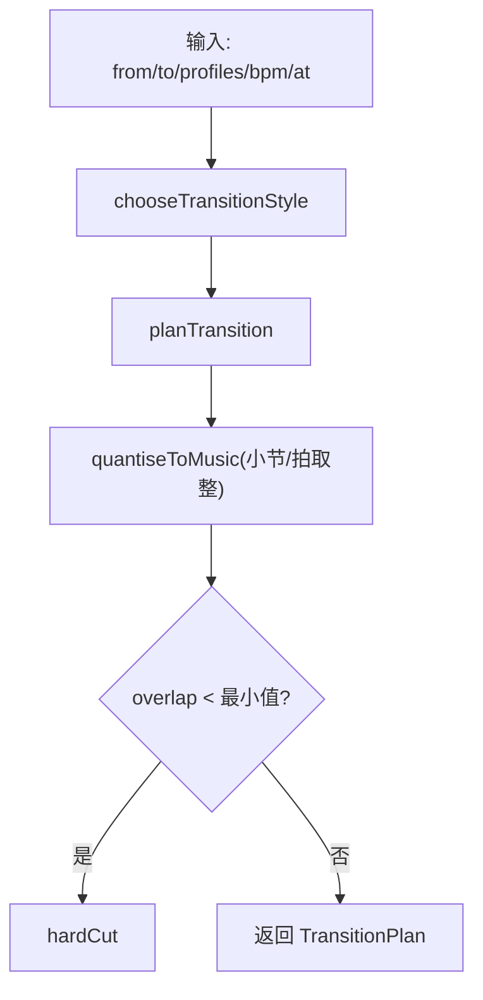
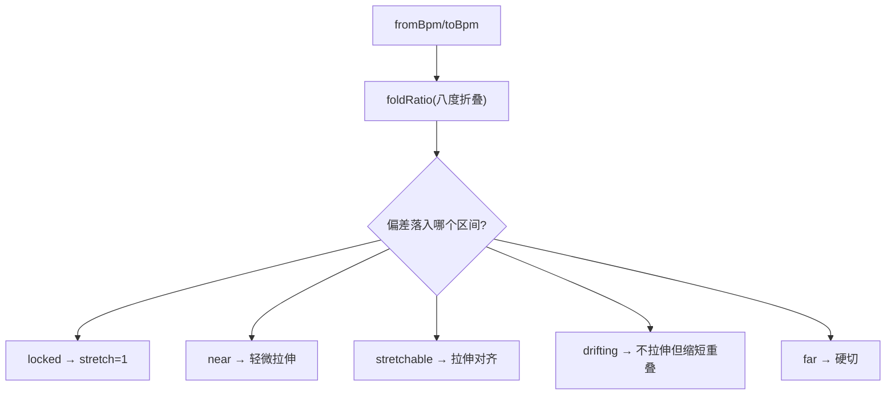
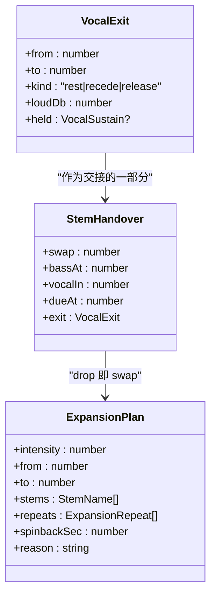
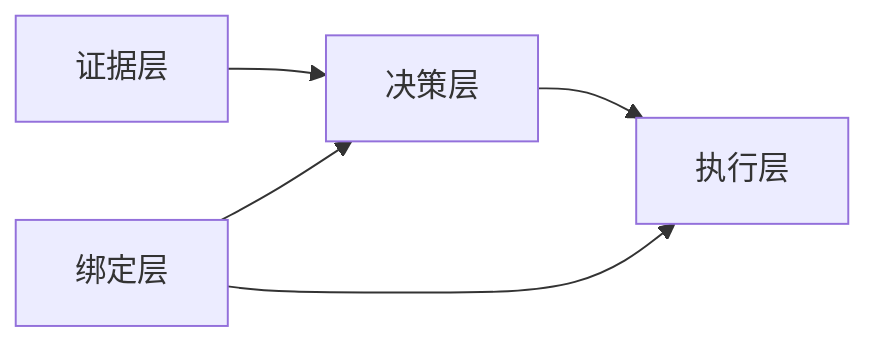

# 混音算法

<cite>
**本文引用的文件**
- [src/services/automix/README.md](file://src/services/automix/README.md)
- [src/services/automix/MODELS.md](file://src/services/automix/MODELS.md)
- [src/services/automix/transitionPlanner.ts](file://src/services/automix/transitionPlanner.ts)
- [src/services/automix/crossfadeGraph.ts](file://src/services/automix/crossfadeGraph.ts)
- [src/services/automix/transitionStrategy.ts](file://src/services/automix/transitionStrategy.ts)
- [src/services/automix/musicalTime.ts](file://src/services/automix/musicalTime.ts)
- [src/services/automix/stemGesture.ts](file://src/services/automix/stemGesture.ts)
- [src/services/automix/transitionChooser.ts](file://src/services/automix/transitionChooser.ts)
- [src/services/automix/crossfadePlanner.ts](file://src/services/automix/crossfadePlanner.ts)
- [src/services/automix/expansionGesture.ts](file://src/services/automix/expansionGesture.ts)
- [src/services/automix/useAutomixDecks.ts](file://src/services/automix/useAutomixDecks.ts)
</cite>

## 目录
1. [简介](#简介)
2. [项目结构](#项目结构)
3. [核心组件](#核心组件)
4. [架构总览](#架构总览)
5. [详细组件分析](#详细组件分析)
6. [依赖关系分析](#依赖关系分析)
7. [性能考量](#性能考量)
8. [故障排查指南](#故障排查指南)
9. [结论](#结论)
10. [附录](#附录)

## 简介
本文件系统化梳理 Folia Player 的“自动混音过渡”（Automix）能力，聚焦双卡座（Deck A/B）混音架构、交叉淡入淡出与分轨交接、过渡规划与音乐时间同步，以及表现模式（build-up）等关键技术。文档面向开发者与高级用户，既提供高层架构图，也深入到关键模块的数据结构与执行流程，帮助理解并扩展自定义过渡策略与质量评估方法。

## 项目结构
Automix 将实现分为四层：证据层（离线音频分析）、决策层（乐理规则生成计划）、执行层（Web Audio 节点调度）、绑定层（React 外壳）。两条主线贯穿始终：
- 双卡座资源管理：两个 `<audio>` 元素与两套 Web Audio 链，角色在过渡期间动态切换，保证无缝衔接。
- 过渡生命周期：从预取、排程到执行与收尾，状态机驱动，确保可撤销与可恢复。

图表来源
- [src/services/automix/README.md:15-67](file://src/services/automix/README.md#L15-L67)
- [src/services/automix/transitionPlanner.ts:21-28](file://src/services/automix/transitionPlanner.ts#L21-L28)
- [src/services/automix/crossfadeGraph.ts:13-15](file://src/services/automix/crossfadeGraph.ts#L13-L15)
- [src/services/automix/useAutomixDecks.ts:21-30](file://src/services/automix/useAutomixDecks.ts#L21-L30)

章节来源
- [src/services/automix/README.md:15-67](file://src/services/automix/README.md#L15-L67)

## 核心组件
- 双卡座与状态机：useAutomixDecks 维护 Deck A/B 的两个媒体元素与播放桥；automixSession 驱动 idle → armed → fading → settle 的状态机，负责提前备料、回退与清理。
- 过渡规划器：transitionPlanner 与 crossfadePlanner 输出统一的 TransitionPlan；transitionStrategy 根据设置选择策略。
- 风格选择与时长：transitionChooser 决定 beatCut / bassSwap / tailRide / plainBlend，并计算长度系数、音色倾斜与回声抛掷。
- 音乐时间：musicalTime 提供 BPM 对齐、小节/拍取整、速度关系分类与入场点对齐。
- 分轨交接：stemGesture 基于分离窗口（drums/bass/other/vocals）编排交接时序与曲线。
- 执行图：crossfadeGraph 构建三频段接缝、软限幅总线、回声延迟、分轨源与变化过门。
- 表现模式：expansionGesture 在交接前插入 build-up 手势，渲染为样本后接入共享总线。

章节来源
- [src/services/automix/useAutomixDecks.ts:21-30](file://src/services/automix/useAutomixDecks.ts#L21-L30)
- [src/services/automix/transitionStrategy.ts:16-44](file://src/services/automix/transitionStrategy.ts#L16-L44)
- [src/services/automix/transitionPlanner.ts:29-102](file://src/services/automix/transitionPlanner.ts#L29-L102)
- [src/services/automix/transitionChooser.ts:20-28](file://src/services/automix/transitionChooser.ts#L20-L28)
- [src/services/automix/musicalTime.ts:10-28](file://src/services/automix/musicalTime.ts#L10-L28)
- [src/services/automix/stemGesture.ts:14-162](file://src/services/automix/stemGesture.ts#L14-L162)
- [src/services/automix/crossfadeGraph.ts:17-50](file://src/services/automix/crossfadeGraph.ts#L17-L50)
- [src/services/automix/expansionGesture.ts:4-12](file://src/services/automix/expansionGesture.ts#L4-L12)

## 架构总览
Automix 以“纯函数规划 + 实时调度”的方式解耦决策与执行。规划阶段不触碰音频节点与 DOM，仅产出 TransitionPlan；执行阶段由 Web Audio 在音频线程精确调度增益曲线、滤波器与缓冲源。

图表来源
- [src/services/automix/useAutomixDecks.ts:508-575](file://src/services/automix/useAutomixDecks.ts#L508-L575)
- [src/services/automix/transitionStrategy.ts:116-147](file://src/services/automix/transitionStrategy.ts#L116-L147)
- [src/services/automix/transitionPlanner.ts:320-737](file://src/services/automix/transitionPlanner.ts#L320-L737)
- [src/services/automix/crossfadeGraph.ts:538-651](file://src/services/automix/crossfadeGraph.ts#L538-L651)
- [src/services/automix/stemGesture.ts:521-676](file://src/services/automix/stemGesture.ts#L521-L676)

## 详细组件分析

### 双卡座混音架构与状态管理
- 双卡座设计：A/B 两路对等，避免主/副 deck 切换时的采样级抖动；通过 resolveDeckSrc 保证活跃 deck 与尾 deck 的 src 不变量，防止 React 重设导致的中断。
- 状态机：idle → armed → fading → settle，armed 阶段压住自动播放并预热下一首；fading 阶段调度曲线与分轨；settle 统一回收参数与节点。
- 资源分配：提前准备 stems 窗口（首/尾各 30s），缓存最多 4 个窗口；按 wanted 集合淘汰旧窗口，避免内存膨胀。

图表来源
- [src/services/automix/useAutomixDecks.ts:207-235](file://src/services/automix/useAutomixDecks.ts#L207-L235)
- [src/services/automix/useAutomixDecks.ts:371-419](file://src/services/automix/useAutomixDecks.ts#L371-L419)
- [src/services/automix/stems.ts](file://src/services/automix/stems.ts)

章节来源
- [src/services/automix/useAutomixDecks.ts:119-134](file://src/services/automix/useAutomixDecks.ts#L119-L134)
- [src/services/automix/useAutomixDecks.ts:648-722](file://src/services/automix/useAutomixDecks.ts#L648-L722)

### 交叉淡入淡出与分轨交接
- 交叉淡入淡出：scheduleCrossfade 使用等功率余弦曲线，支持 together 平台段，使低频在同一时刻只属于一方，避免糊底。
- 三频段接缝：scheduleBandBlend 分别对低/中/高频绘制独立曲线，实现音色匹配与低频换手。
- 分轨交接：connectStemDeck 将四轨同时以绝对时间起播，保证样本级对齐；scheduleStemWindow 编排 vocals/drums/bass/other 的进出曲线与高通扫频。
- 软限幅：connectStemBus 在分轨求和处加入记忆非线性压缩，避免双母带叠加削波。

图表来源
- [src/services/automix/crossfadeGraph.ts:213-263](file://src/services/automix/crossfadeGraph.ts#L213-L263)
- [src/services/automix/crossfadeGraph.ts:427-487](file://src/services/automix/crossfadeGraph.ts#L427-L487)
- [src/services/automix/crossfadeGraph.ts:538-604](file://src/services/automix/crossfadeGraph.ts#L538-L604)
- [src/services/automix/crossfadeGraph.ts:381-402](file://src/services/automix/crossfadeGraph.ts#L381-L402)

章节来源
- [src/services/automix/crossfadeGraph.ts:622-651](file://src/services/automix/crossfadeGraph.ts#L622-L651)
- [src/services/automix/stemGesture.ts:717-742](file://src/services/automix/stemGesture.ts#L717-L742)

### 过渡规划系统（类型、时机、长度控制）
- 风格选择：chooseTransitionStyle 依据能量阶跃、结尾形态、速度关系与调性关系，选择四种接法之一，并给出长度系数、音色修正与回声抛掷。
- 时长计算：planTransition 综合“无声尾部/人声停止点/进场前奏/剩余时间”等约束，量化到小节/拍，避免过长或过短导致的听感缺陷。
- Crossfade 模式：crossfadePlanner 固定等功率形状，仅受用户设定秒数与两端事实限制，行为可预测。
- 策略路由：transitionStrategy.planForMode 根据设置与证据可用性选择 automix 或 crossfade，并在 automix 下附加表现强度。

图表来源
- [src/services/automix/transitionChooser.ts:175-258](file://src/services/automix/transitionChooser.ts#L175-L258)
- [src/services/automix/transitionPlanner.ts:320-737](file://src/services/automix/transitionPlanner.ts#L320-L737)
- [src/services/automix/musicalTime.ts:188-210](file://src/services/automix/musicalTime.ts#L188-L210)
- [src/services/automix/crossfadePlanner.ts:56-99](file://src/services/automix/crossfadePlanner.ts#L56-L99)
- [src/services/automix/transitionStrategy.ts:116-147](file://src/services/automix/transitionStrategy.ts#L116-L147)

章节来源
- [src/services/automix/transitionPlanner.ts:117-146](file://src/services/automix/transitionPlanner.ts#L117-L146)
- [src/services/automix/transitionPlanner.ts:548-589](file://src/services/automix/transitionPlanner.ts#L548-L589)

### 音乐时间同步（BPM 对齐、小节同步、节拍匹配）
- 速度关系：tempoMatch 将 BPM 折半/倍频等价，划分 locked/near/stretchable/drift/far，决定拉伸与重叠上限。
- 网格对齐：barGrid/snapToGrid/alignEntry 将出场曲的下一个小节相位与进场曲的 bar 线对齐，避免“永远差半拍”。
- 结算 BPM：settledBpm 比较全曲与尾段测速，不一致时回退到实时探针，避免错误弯速。

图表来源
- [src/services/automix/musicalTime.ts:101-117](file://src/services/automix/musicalTime.ts#L101-L117)
- [src/services/automix/musicalTime.ts:137-160](file://src/services/automix/musicalTime.ts#L137-L160)
- [src/services/automix/musicalTime.ts:220-275](file://src/services/automix/musicalTime.ts#L220-L275)

章节来源
- [src/services/automix/musicalTime.ts:169-178](file://src/services/automix/musicalTime.ts#L169-L178)

### 分轨交接与表现模式（build-up）
- 人声退出：planVocalExit 在安静处硬切或在长音释放点优雅退出，避免吞词或突兀消失。
- 交接编排：planStemHandover 先换鼓（瞬时切换），一拍后换贝斯，再一拍进场人声；必要时推迟进场以避免两轨人声重叠。
- 表现模式：expansionGesture 在交接前插入 build-up，按强度分层（半拍/四分之一拍/八分之一拍），末尾甩盘，渲染为样本后接入共享总线，不影响既有交接时序。

图表来源
- [src/services/automix/stemGesture.ts:111-162](file://src/services/automix/stemGesture.ts#L111-L162)
- [src/services/automix/stemGesture.ts:521-676](file://src/services/automix/stemGesture.ts#L521-L676)
- [src/services/automix/expansionGesture.ts:90-103](file://src/services/automix/expansionGesture.ts#L90-L103)

章节来源
- [src/services/automix/stemGesture.ts:260-429](file://src/services/automix/stemGesture.ts#L260-L429)
- [src/services/automix/expansionGesture.ts:176-269](file://src/services/automix/expansionGesture.ts#L176-L269)

### 音量曲线设计与相位/频率补偿
- 淡入淡出曲线：buildCrossfadeCurves 采用等功率余弦，中间平台段让两曲保持同等强度，低频换手更干净。
- 相位对齐：分轨源以同一绝对时间 start(offset)，保证样本级对齐；跨流（有损）时使用 8ms 交叉淡化规避帧对齐误差。
- 频率补偿：toneTilt 计算中/高频倾斜，使进场曲以出场曲的音色到达；三频段滤波器在过渡期间相对整体包络工作，避免改变整体响度。

章节来源
- [src/services/automix/crossfadeGraph.ts:213-263](file://src/services/automix/crossfadeGraph.ts#L213-L263)
- [src/services/automix/crossfadeGraph.ts:427-487](file://src/services/automix/crossfadeGraph.ts#L427-L487)
- [src/services/automix/transitionChooser.ts:186-212](file://src/services/automix/transitionChooser.ts#L186-L212)

### 自定义过渡策略开发指南
- 策略接口：实现一个返回 TransitionPlan 的纯函数，遵循现有字段约定（style/relation/tempo/stretch/tiltDb/echoThrow/outStart/inStart/overlap/minOverlap/reason/expansion）。
- 参数配置：通过 transitionStrategy 的 settings 注入（mode/crossfadeMaxSec/performance），新策略可作为第三个分支接入，下游无需改动。
- 测试方法：
  - 单元测试：覆盖边界条件（如 overlap < minOverlap、未知 tempo/key）、合成信号验证测量精度。
  - 盲听评估：对比不同策略在真实曲目上的听感，记录失败案例与回归。
  - 回放校验：利用 fakeAudioGraph 断言引擎规则（曲线不可重叠、取消事件正确等）。

章节来源
- [src/services/automix/transitionStrategy.ts:16-44](file://src/services/automix/transitionStrategy.ts#L16-L44)
- [src/services/automix/transitionPlanner.ts:29-102](file://src/services/automix/transitionPlanner.ts#L29-L102)
- [src/services/automix/README.md:534-552](file://src/services/automix/README.md#L534-L552)

### 混音质量评估工具与实践
- 客观指标：
  - 峰值/响度：LUFS 与峰值除数用于存储与还原，避免过冲削波。
  - 相关系数：分离结果与参考实现的逐轨相关性，验证模型改动未破坏重建。
  - 频谱/相位：三频段曲线与 8ms 交叉淡化，评估梳状滤波与相位误差。
- 主观评估：
  - 盲听对照：每条策略与 baseline（plainBlend）成对对比，统计胜率与偏好。
  - 场景覆盖：包含 hot start、long outro、instrumental intro、key clash 等典型场景。
- 调试手段：
  - 日志追踪：reason 字段与 console 输出，定位“为什么短/为什么切”。
  - 可视化：进度条与歌词滚动与过渡 cue 对齐，辅助定位视觉/听觉错位。

章节来源
- [src/services/automix/MODELS.md:114-128](file://src/services/automix/MODELS.md#L114-L128)
- [src/services/automix/README.md:419-422](file://src/services/automix/README.md#L419-L422)
- [src/services/automix/useAutomixDecks.ts:487-498](file://src/services/automix/useAutomixDecks.ts#L487-L498)

## 依赖关系分析
- 证据层 → 决策层：trackProfile/signalAnalysis/stems 提供 BPM、段落、人声窗口、分离结果，供 chooseTransitionStyle 与 planTransition 使用。
- 决策层 → 执行层：TransitionPlan 被 automixSession 消费，调用 crossfadeGraph 与 stemGesture 进行调度。
- 绑定层 → 全局：useAutomixDecks 聚合状态、管理双 deck 与 session 生命周期，并将 UI 事件映射到播放桥。

图表来源
- [src/services/automix/README.md:15-67](file://src/services/automix/README.md#L15-L67)
- [src/services/automix/useAutomixDecks.ts:21-30](file://src/services/automix/useAutomixDecks.ts#L21-L30)

章节来源
- [src/services/automix/README.md:15-67](file://src/services/automix/README.md#L15-L67)

## 性能考量
- 推理进程隔离：Beat This! 与 htdemucs 运行于 utilityProcess，避免阻塞主进程消息循环与渲染帧。
- 线程与核数：intraOpNumThreads 设置为机器核数的四分之一，平衡后台推理与前台播放/渲染。
- 内存优化：htdemucs 启用内存复用与关闭竞技场，单会话跑完整窗；分轨窗口 Int16 存储与峰值除数，减少缓存体积。
- 曲线调度：所有自动化事件在音频线程执行，主线程忙碌不会扰动过渡包络；曲线起点采用 Math.max(startAt, currentTime) 避免引擎拒绝。

章节来源
- [src/services/automix/README.md:254-286](file://src/services/automix/README.md#L254-L286)
- [src/services/automix/MODELS.md:132-150](file://src/services/automix/MODELS.md#L132-L150)
- [src/services/automix/crossfadeGraph.ts:223-239](file://src/services/automix/crossfadeGraph.ts#L223-L239)

## 故障排查指南
- 常见问题
  - 过渡被拒绝：当引擎拒绝曲线时，会降级为硬切或平直交叉淡入，并打印警告；检查起点是否已过去、是否存在重叠事件。
  - 无分轨可用：浏览器构建或缺少权重时退回主轨交叉淡入；确认模型下载与可用性。
  - 卡顿/静音：检查 stall 检测逻辑，确保空闲 deck 在超时后尝试 play；确认 autoplay hold 是否正确释放。
- 诊断步骤
  - 查看 reason 日志：定位“为什么短/为什么切”，核对 singleVoiceRoom、gestureRoom、left 等约束。
  - 复现实验：使用合成信号验证测量精度（拍点、段落边界、前奏终点）。
  - 单元与替身：用 fakeAudioGraph 断言引擎规则，确保 cancelAndHoldAtTime 与 setValueCurveAtTime 的使用正确。

章节来源
- [src/services/automix/crossfadeGraph.ts:255-262](file://src/services/automix/crossfadeGraph.ts#L255-L262)
- [src/services/automix/crossfadeGraph.ts:598-604](file://src/services/automix/crossfadeGraph.ts#L598-L604)
- [src/services/automix/useAutomixDecks.ts:321-352](file://src/services/automix/useAutomixDecks.ts#L321-L352)
- [src/services/automix/README.md:534-552](file://src/services/automix/README.md#L534-L552)

## 结论
Folia Player 的 Automix 通过“证据→决策→执行→绑定”的分层架构，实现了可解释、可回退、可扩展的双卡座混音系统。其核心优势在于：
- 以音乐单位为单位的时长与对齐，避免机械秒数带来的节奏错位。
- 分轨交接与三频段接缝，兼顾低频清晰度与人声避让。
- 表现模式增强过渡戏剧性，且与既有交接无缝衔接。
- 严格的工程纪律（进程隔离、曲线安全、测试与盲听），保障稳定与可维护性。

## 附录
- 术语
  - 过渡计划（TransitionPlan）：规划层与执行层的契约，描述风格、速度关系、时长与执行参数。
  - 分轨（Stems）：drums/bass/other/vocals 四轨，用于精细交接与音色控制。
  - 表现模式（Performance/Build-up）：在交接前插入节奏推进效果，增强听感。
- 参考
  - 模型说明与内存优化见 MODELS.md。
  - 完整流程与不变量见 README.md。