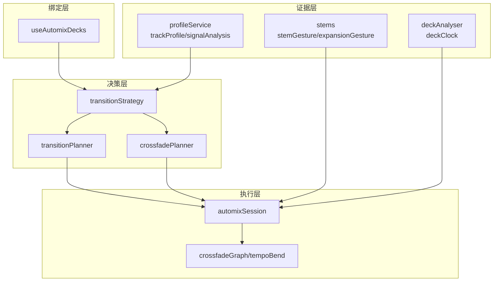
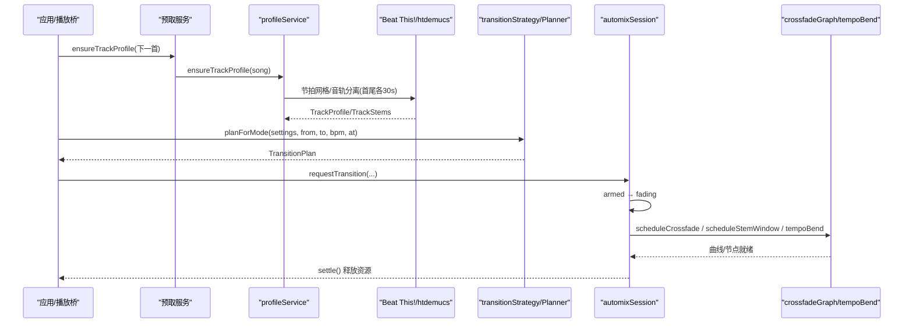
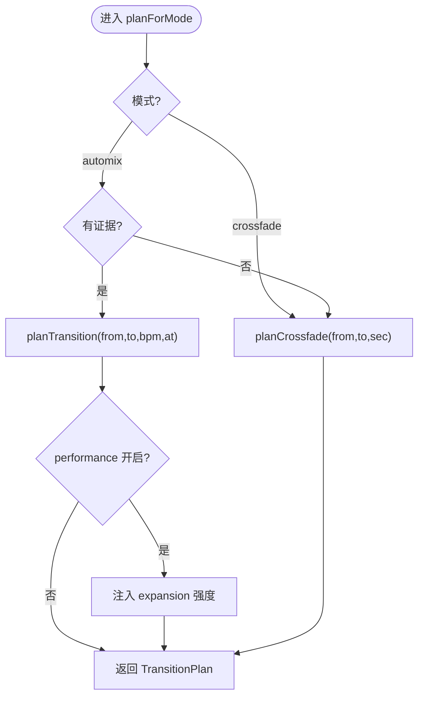
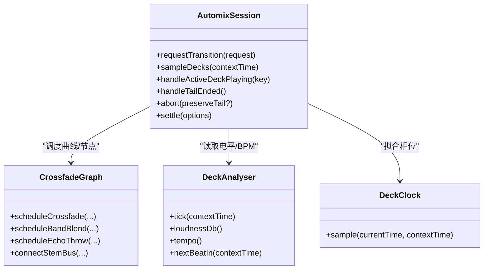
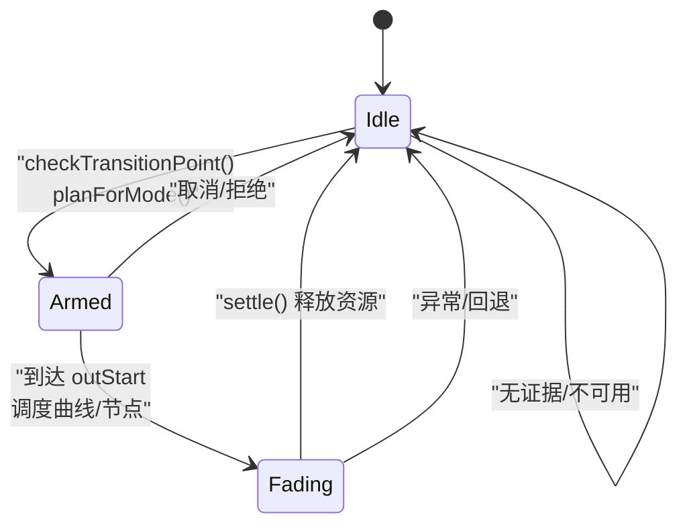
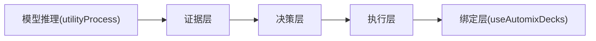

# 自动化混音

<cite>
**本文引用的文件**
- [README.md](file://src/services/automix/README.md)
- [MODELS.md](file://src/services/automix/MODELS.md)
- [automixSession.ts](file://src/services/automix/automixSession.ts)
- [deckAnalyser.ts](file://src/services/automix/deckAnalyser.ts)
- [crossfadePlanner.ts](file://src/services/automix/crossfadePlanner.ts)
- [transitionPlanner.ts](file://src/services/automix/transitionPlanner.ts)
- [transitionStrategy.ts](file://src/services/automix/transitionStrategy.ts)
- [useAutomixDecks.ts](file://src/services/automix/useAutomixDecks.ts)
- [profileService.ts](file://src/services/automix/profileService.ts)
- [stemGesture.ts](file://src/services/automix/stemGesture.ts)
</cite>

## 目录
1. [简介](#简介)
2. [项目结构](#项目结构)
3. [核心组件](#核心组件)
4. [架构总览](#架构总览)
5. [详细组件分析](#详细组件分析)
6. [依赖关系分析](#依赖关系分析)
7. [性能考量](#性能考量)
8. [故障排查指南](#故障排查指南)
9. [结论](#结论)
10. [附录](#附录)

## 简介
本技术文档系统性解析 Folia Player 的“自动化混音”子系统，覆盖离线音频分析（节拍检测、BPM/调性/段落识别）、双卡座状态机与交叉淡入淡出、过渡规划策略、实时音频处理管道（缓冲、延迟控制、音质保证），以及 AI 驱动的模型推理与能力分级。文档同时给出配置系统要点、性能监控与调试建议，帮助优化混音质量与响应速度。

## 项目结构
自动化混音位于 src/services/automix，按“证据—决策—执行—绑定”四层组织：
- 证据层：trackProfile/signalAnalysis/profileService/beatThis/stems/stemGesture/expansionGesture/deckAnalyser/deckClock
- 决策层：musicalTime/transitionChooser/transitionPlanner/crossfadePlanner/transitionStrategy
- 执行层：automixSession/crossfadeGraph/tempoBend
- 绑定层：useAutomixDecks（React 外壳）

图表来源
- [README.md:15-67](file://src/services/automix/README.md#L15-L67)
- [transitionStrategy.ts:16-44](file://src/services/automix/transitionStrategy.ts#L16-L44)
- [automixSession.ts:171-186](file://src/services/automix/automixSession.ts#L171-L186)

章节来源
- [README.md:15-67](file://src/services/automix/README.md#L15-L67)

## 核心组件
- 离线分析流水线：profileService 负责字节获取、解码、分块与存储；trackProfile/signalAnalysis 完成 BPM、小节线、响度、首尾调性、三频段占比、段落边界等测量；beatThis 提供拍点网格；stems 管理 htdemucs 分离窗口。
- 决策规划器：transitionPlanner 基于乐理规则生成 TransitionPlan；crossfadePlanner 提供固定形状交叉淡化；transitionStrategy 根据模式选择规划器并注入表现模式强度。
- 执行会话：automixSession 维护 idle→armed→fading 状态机，调度 stem 交接、回声抛掷、软限幅、平衡修正与变速对齐。
- 实时分析：deckAnalyser 提供 K 计权电平、频谱通量与实时 BPM；deckClock 拟合 currentTime 阶梯为直线，实现毫秒级相位对齐。
- React 绑定：useAutomixDecks 管理双 deck 元素、warmSrc/tailSrc 渲染、预取与分离、卡顿恢复与过渡动画同步。

章节来源
- [README.md:30-67](file://src/services/automix/README.md#L30-L67)
- [profileService.ts:16-26](file://src/services/automix/profileService.ts#L16-L26)
- [transitionStrategy.ts:16-44](file://src/services/automix/transitionStrategy.ts#L16-L44)
- [automixSession.ts:47-63](file://src/services/automix/automixSession.ts#L47-L63)
- [deckAnalyser.ts:10-29](file://src/services/automix/deckAnalyser.ts#L10-L29)
- [useAutomixDecks.ts:21-30](file://src/services/automix/useAutomixDecks.ts#L21-L30)

## 架构总览
一次换歌从预取到执行的完整流程如下：

图表来源
- [README.md:70-109](file://src/services/automix/README.md#L70-L109)
- [transitionStrategy.ts:116-147](file://src/services/automix/transitionStrategy.ts#L116-L147)
- [automixSession.ts:751-800](file://src/services/automix/automixSession.ts#L751-L800)

## 详细组件分析

### 离线分析与证据层
- profileService：以 Range 请求或媒体缓存获取字节，使用 OfflineAudioContext 在分析采样率解码，串行队列避免峰值内存；支持 head-only 与 partial 结果，并在播放结束后用实时电平补全尾部特征。
- trackProfile/signalAnalysis：计算 BPM（全曲+尾段）、小节线位置、LUFS、首尾调性、三频段占比、段落边界、前奏终点、结尾形态；提供 K 计权、自相关测速、估计 downbeat、重拍相位、FFT 等数学工具。
- beatThis：梅尔谱前处理、分块、峰值挑选、网格拟合；契约常量严格固定以保证模型一致性。
- stems：htdemucs 分离首/尾各 30 秒，缓存最多 4 个窗口；other 由四轨相减得到，确保精确重建原曲；Int16 + 峰值除数压缩存储。
- stemGesture：纯算术的交接手势，决定人声退场、鼓/贝斯/其余何时交接，输出每轨增益曲线。
- expansionGesture：表现模式的 build-up 渲染，将抽拉/升调/甩盘写入样本，接入 stem 总线。

章节来源
- [profileService.ts:16-26](file://src/services/automix/profileService.ts#L16-L26)
- [profileService.ts:143-160](file://src/services/automix/profileService.ts#L143-L160)
- [profileService.ts:254-384](file://src/services/automix/profileService.ts#L254-L384)
- [profileService.ts:396-454](file://src/services/automix/profileService.ts#L396-L454)
- [README.md:180-253](file://src/services/automix/README.md#L180-L253)
- [README.md:331-403](file://src/services/automix/README.md#L331-L403)
- [MODELS.md:36-108](file://src/services/automix/MODELS.md#L36-L108)
- [MODELS.md:154-168](file://src/services/automix/MODELS.md#L154-L168)
- [stemGesture.ts:521-676](file://src/services/automix/stemGesture.ts#L521-L676)

### 决策层：过渡规划与风格选择
- transitionPlanner：依据两首歌的证据（BPM、调性、段落、歌词时间轴、分离窗口）选择四种接法之一（beatCut/bassSwap/tailRide/plainBlend），计算 stretch、tiltDb、echoThrow、outStart/inStart/overlap 等，并以音乐单位（拍/小节/乐句）量化长度。
- crossfadePlanner：固定等功率交叉淡化，仅受用户设定秒数与两端静音事实约束。
- transitionStrategy：根据模式选择 planner，并在 automix 模式下注入表现模式强度（build-up）。

图表来源
- [transitionStrategy.ts:116-147](file://src/services/automix/transitionStrategy.ts#L116-L147)
- [crossfadePlanner.ts:56-99](file://src/services/automix/crossfadePlanner.ts#L56-L99)
- [transitionPlanner.ts:320-737](file://src/services/automix/transitionPlanner.ts#L320-L737)

章节来源
- [transitionPlanner.ts:29-102](file://src/services/automix/transitionPlanner.ts#L29-L102)
- [transitionPlanner.ts:320-737](file://src/services/automix/transitionPlanner.ts#L320-L737)
- [crossfadePlanner.ts:56-99](file://src/services/automix/crossfadePlanner.ts#L56-L99)
- [transitionStrategy.ts:16-44](file://src/services/automix/transitionStrategy.ts#L16-L44)

### 执行层：状态机与音频图
- automixSession：维护 idle→armed→fading 状态机，提前 ARM 加载进场 deck，到达 outStart 时调度交叉淡入/淡出或 stem 交接，必要时抛出回声、进行平衡修正与变速对齐，最终 settle 释放所有参数与节点。
- crossfadeGraph/tempoBend：Web Audio 侧双 deck 节点链、增益曲线、三频段接缝、回声抛掷、软限幅、stem 总线；出场曲变速对齐并保持音高。
- deckAnalyser：K 计权电平、频谱通量、实时 BPM 估计与下一拍时刻；用于平衡修正与网格对齐。
- deckClock：拟合 currentTime 阶梯为直线，实现毫秒级相位对齐。

图表来源
- [automixSession.ts:171-186](file://src/services/automix/automixSession.ts#L171-L186)
- [automixSession.ts:279-328](file://src/services/automix/automixSession.ts#L279-L328)
- [automixSession.ts:686-743](file://src/services/automix/automixSession.ts#L686-L743)
- [deckAnalyser.ts:46-61](file://src/services/automix/deckAnalyser.ts#L46-L61)

章节来源
- [automixSession.ts:47-63](file://src/services/automix/automixSession.ts#L47-L63)
- [automixSession.ts:279-328](file://src/services/automix/automixSession.ts#L279-L328)
- [automixSession.ts:686-743](file://src/services/automix/automixSession.ts#L686-L743)
- [deckAnalyser.ts:10-29](file://src/services/automix/deckAnalyser.ts#L10-L29)

### 双卡座混音架构与状态管理
- useAutomixDecks：管理两个 <audio> 元素（Deck A/B），通过 tailSrc/warmSrc/audioSrc 决定渲染源，保证切换时无中断；在接近交接点时 warm 下一首，ARM 阶段压住自动播放，到达计划点再释放。
- 状态机：idle 等待检查点；armed 已计划并预热；fading 正在执行过渡；settled 清理并回到 idle。
- 防卡顿： stalled 检查在过渡后重试启动，避免资源未就绪导致的静默。

图表来源
- [useAutomixDecks.ts:207-235](file://src/services/automix/useAutomixDecks.ts#L207-L235)
- [useAutomixDecks.ts:321-352](file://src/services/automix/useAutomixDecks.ts#L321-L352)
- [automixSession.ts:47-63](file://src/services/automix/automixSession.ts#L47-L63)

章节来源
- [useAutomixDecks.ts:21-30](file://src/services/automix/useAutomixDecks.ts#L21-L30)
- [useAutomixDecks.ts:207-235](file://src/services/automix/useAutomixDecks.ts#L207-L235)
- [useAutomixDecks.ts:321-352](file://src/services/automix/useAutomixDecks.ts#L321-L352)
- [automixSession.ts:47-63](file://src/services/automix/automixSession.ts#L47-L63)

### 实时音频处理管道
- 音频缓冲管理：warmSrc 提前预热，tailSrc 保持出场曲稳定渲染；避免重复加载与错误事件。
- 延迟控制：ARM_LEAD_SEC 提前准备；RELEASE_MARGIN_SEC 提前释放 autoplay；MAX_ALIGN_HOLD_SEC 限制对齐等待；FADE_CLEANUP_MARGIN_MS 保障曲线消费完毕。
- 音质保证：K 计权电平比较；ReplayGain 上游补偿；软限幅防止过冲；三频段接缝与音色匹配；变速只弯出场曲且保音高。

章节来源
- [useAutomixDecks.ts:119-134](file://src/services/automix/useAutomixDecks.ts#L119-L134)
- [automixSession.ts:69-117](file://src/services/automix/automixSession.ts#L69-L117)
- [README.md:287-329](file://src/services/automix/README.md#L287-L329)

### AI 驱动的混音决策与能力分级
- Beat This! 拍点模型：ONNX 权重按需下载与校验，utilityProcess 隔离推理，WebGPU/CPU 分流；前处理常数为契约，不得改动。
- htdemucs 音轨分离：Python sidecar 进程运行，启用内存复用开关，段长减半降低峰值内存；缓存首尾 30 秒窗口，最多 4 个。
- 能力分级：桌面构建具备分离与表现模式；浏览器构建降级至主轨交叉淡化与内置估算器。

章节来源
- [MODELS.md:1-18](file://src/services/automix/MODELS.md#L1-L18)
- [MODELS.md:21-33](file://src/services/automix/MODELS.md#L21-L33)
- [MODELS.md:36-108](file://src/services/automix/MODELS.md#L36-L108)
- [MODELS.md:132-151](file://src/services/automix/MODELS.md#L132-L151)
- [README.md:405-427](file://src/services/automix/README.md#L405-L427)

### 配置文件与个性化设置
- 模式选择：crossfade（固定秒数）与 automix（证据驱动）；默认 automix。
- 交叉淡化最大秒数：CROSSFADE_MAX_SEC 与 AUTOMIX_MAX_OVERLAP_SEC 共享物理上限。
- 表现模式：performance 布尔开关，仅在 automix 生效，注入 build-up 强度。
- 设置项来源：useSettingsUiStore 暴露 automixEnabled、transitionMode、crossfadeMaxSec、transitionPerformance。

章节来源
- [transitionStrategy.ts:16-44](file://src/services/automix/transitionStrategy.ts#L16-L44)
- [crossfadePlanner.ts:26-43](file://src/services/automix/crossfadePlanner.ts#L26-L43)
- [transitionPlanner.ts:104-146](file://src/services/automix/transitionPlanner.ts#L104-L146)
- [README.md:429-441](file://src/services/automix/README.md#L429-L441)

## 依赖关系分析
- 证据层不依赖 React/DOM，便于单元测试与无设备测试。
- 决策层纯函数化，输入为证据与设置，输出为 TransitionPlan。
- 执行层依赖 Web Audio API，通过 ports 解耦 DOM/播放器。
- 模型推理通过 utilityProcess 隔离，避免阻塞主线程。

图表来源
- [README.md:15-24](file://src/services/automix/README.md#L15-L24)
- [README.md:429-441](file://src/services/automix/README.md#L429-L441)

章节来源
- [README.md:15-24](file://src/services/automix/README.md#L15-L24)

## 性能考量
- 离线分析让出主线程：按毫秒预算（~8ms）扫描，避免可见卡顿。
- 模型推理隔离：utilityProcess 承载 ONNX 推理，主进程最长停顿降至 ~25ms，RSS 显著下降。
- 内存优化：htdemucs 启用 enable_mem_reuse=False、禁用 CPU arena、持久会话、段长减半；分离结果 Int16 压缩与窗口淘汰。
- 实时路径轻量：deckAnalyser 每 25ms tick，缓存 tempo；deckClock 拟合直线减少误差。
- 曲线调度安全：cancelAndHoldAtTime 避免重叠事件；起点夹取与尾部保护防止引擎拒绝。

章节来源
- [README.md:180-198](file://src/services/automix/README.md#L180-L198)
- [README.md:254-286](file://src/services/automix/README.md#L254-L286)
- [MODELS.md:132-151](file://src/services/automix/MODELS.md#L132-L151)
- [deckAnalyser.ts:115-145](file://src/services/automix/deckAnalyser.ts#L115-L145)
- [README.md:518-531](file://src/services/automix/README.md#L518-L531)

## 故障排查指南
- 无小节线/网格失败：检查 Beat This! 前处理常量与 onnxruntime 线程数；确认模型下载与 sha256 校验。
- 分离窗口不足：确认 stems 缓存命中与 wanted 集合；若窗口不够则回退主轨交叉淡化。
- 过渡被拒绝：查看 reason 日志（如“no room to fade - ...”），核对剩余时长与单声道人声门限。
- 卡顿/静默：检查 stall 检查是否触发；确认 autoplay hold 正确释放；验证 deck 元素 src 与 readyState。
- 曲线调度错误：确保使用 cancelAndHoldAtTime；起点不小于 currentTime；复位事件延后 CURVE_TAIL_GUARD_SEC。

章节来源
- [transitionPlanner.ts:573-589](file://src/services/automix/transitionPlanner.ts#L573-L589)
- [automixSession.ts:686-743](file://src/services/automix/automixSession.ts#L686-L743)
- [useAutomixDecks.ts:321-352](file://src/services/automix/useAutomixDecks.ts#L321-L352)
- [README.md:518-531](file://src/services/automix/README.md#L518-L531)

## 结论
Folia 自动化混音以“证据—决策—执行—绑定”分层架构实现高质量、可解释的过渡。离线分析提供节拍/调性/段落等客观事实，决策层基于乐理规则生成可执行的 TransitionPlan，执行层通过 Web Audio 节点链与状态机精准调度，React 绑定层保证双 deck 无缝切换与用户体验。AI 模型推理隔离与内存优化确保实时性与稳定性。通过配置系统与调试工具，可在不同平台与场景下取得一致的高质量混音效果。

## 附录
- 关键数据结构：TransitionPlan、TransitionStyle、TransitionCapabilities
- 算法流程图：过渡长度量化、人声退场策略、stem 交接时序
- 性能基准：模型推理耗时、内存峰值、主进程停顿对比