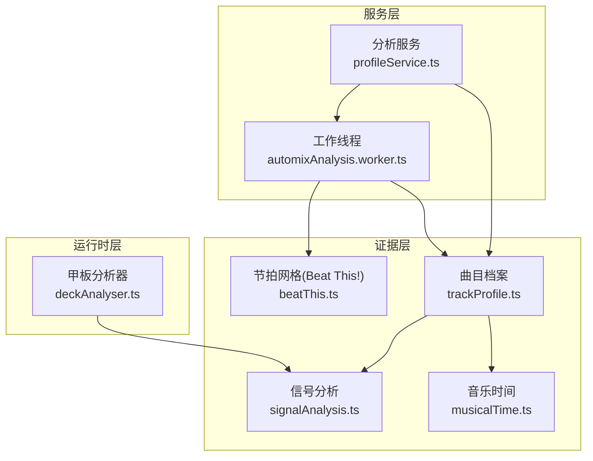
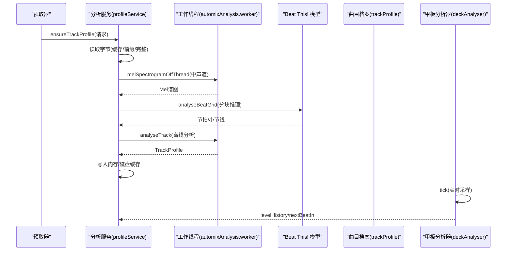
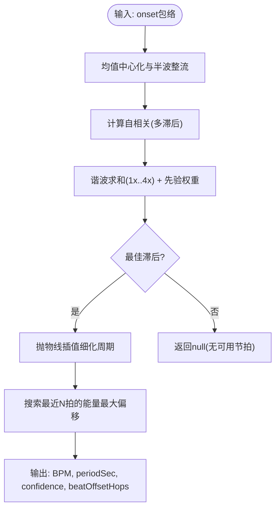
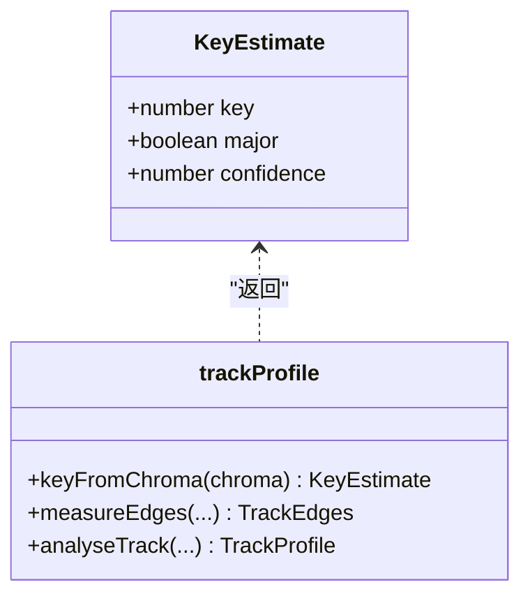
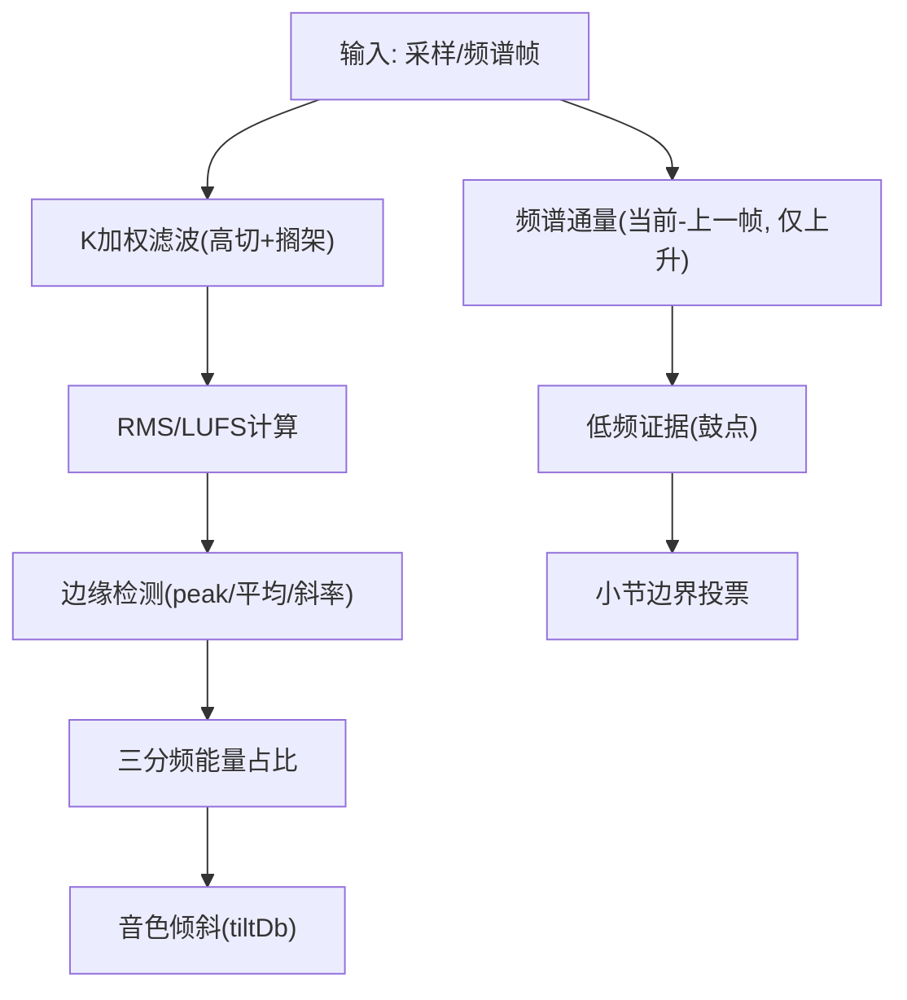
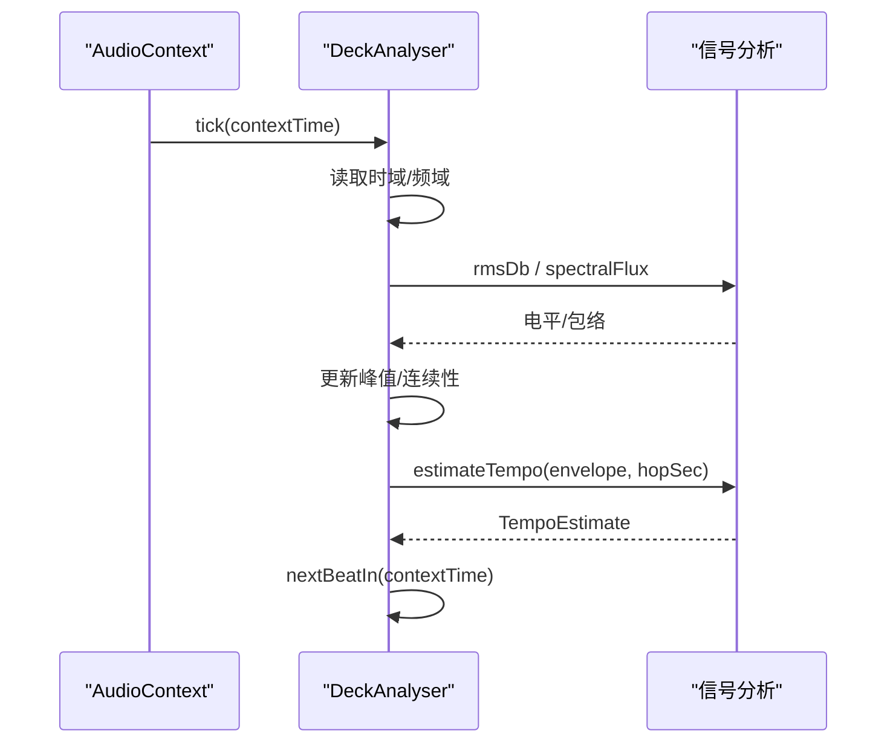
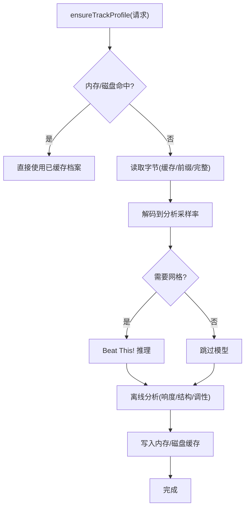
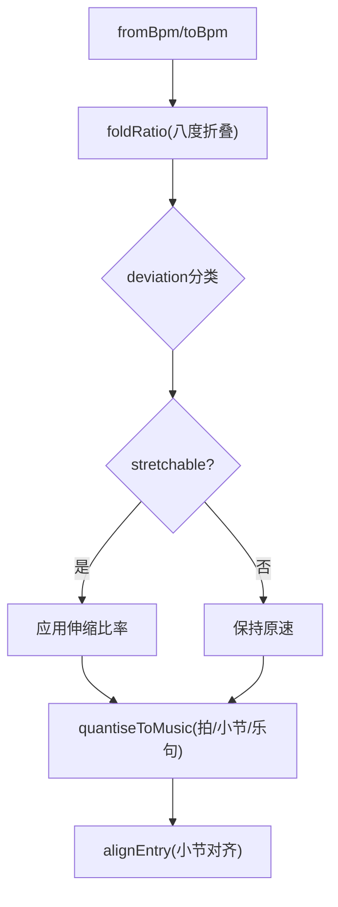
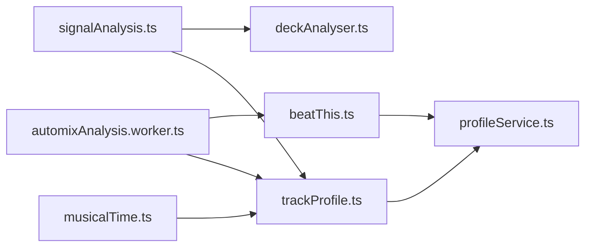

# 音频信号分析

<cite>
**本文引用的文件**
- [signalAnalysis.ts](file://src/services/automix/signalAnalysis.ts)
- [beatThis.ts](file://src/services/automix/beatThis.ts)
- [deckAnalyser.ts](file://src/services/automix/deckAnalyser.ts)
- [trackProfile.ts](file://src/services/automix/trackProfile.ts)
- [profileService.ts](file://src/services/automix/profileService.ts)
- [musicalTime.ts](file://src/services/automix/musicalTime.ts)
- [automixAnalysis.worker.ts](file://src/workers/automixAnalysis.worker.ts)
</cite>

## 目录
1. [简介](#简介)
2. [项目结构](#项目结构)
3. [核心组件](#核心组件)
4. [架构总览](#架构总览)
5. [详细组件分析](#详细组件分析)
6. [依赖关系分析](#依赖关系分析)
7. [性能考量](#性能考量)
8. [故障排查指南](#故障排查指南)
9. [结论](#结论)
10. [附录](#附录)

## 简介
本技术文档聚焦 Folia Player 的自动混音（Automix）音频信号分析系统，围绕节拍检测、调性分析、音频特征提取、实时分析管道与分析结果缓存机制展开。系统通过离线分析与在线测量相结合的方式，为跨曲过渡提供稳定的节拍网格、小节边界、响度与音色匹配等关键信息，确保混音在听感上自然、无缝。

## 项目结构
自动混音分析由“证据层”（纯数学计算）、“服务层”（资源获取、缓存、调度）和“运行时层”（实时采样、延迟控制）组成：
- 证据层：节拍估计、频谱通量、K加权响度、调性估计、小节投票等算法实现
- 服务层：曲目档案生成、模型调用、内存与磁盘缓存、并发与队列管理
- 运行时层：对播放中的轨道进行帧级采样，维护电平历史、节拍相位与下一拍时间

图表来源
- [signalAnalysis.ts:1-847](file://src/services/automix/signalAnalysis.ts#L1-L847)
- [beatThis.ts:1-469](file://src/services/automix/beatThis.ts#L1-L469)
- [trackProfile.ts:1-1019](file://src/services/automix/trackProfile.ts#L1-L1019)
- [musicalTime.ts:1-275](file://src/services/automix/musicalTime.ts#L1-L275)
- [profileService.ts:1-464](file://src/services/automix/profileService.ts#L1-L464)
- [automixAnalysis.worker.ts:1-47](file://src/workers/automixAnalysis.worker.ts#L1-L47)

章节来源
- [signalAnalysis.ts:1-847](file://src/services/automix/signalAnalysis.ts#L1-L847)
- [beatThis.ts:1-469](file://src/services/automix/beatThis.ts#L1-L469)
- [deckAnalyser.ts:1-176](file://src/services/automix/deckAnalyser.ts#L1-L176)
- [trackProfile.ts:1-1019](file://src/services/automix/trackProfile.ts#L1-L1019)
- [profileService.ts:1-464](file://src/services/automix/profileService.ts#L1-L464)
- [musicalTime.ts:1-275](file://src/services/automix/musicalTime.ts#L1-L275)
- [automixAnalysis.worker.ts:1-47](file://src/workers/automixAnalysis.worker.ts#L1-L47)

## 核心组件
- 信号分析（signalAnalysis.ts）：提供 RMS、FFT、频谱通量、K加权响度、BPM估计、小节边界投票、交叉淡入淡出曲线与频段曲线等基础能力
- 节拍网格（beatThis.ts）：Mel谱图构建、Beat This! 模型分块推理、峰值合并、网格拟合与BPM/小节线输出
- 甲板分析器（deckAnalyser.ts）：实时采样、电平历史、频谱通量包络、BPM估计与下一拍预测
- 曲目档案（trackProfile.ts）：离线单遍扫描，产出响度、边缘（lead-in/out）、结构边界、音色分布、BPM/小节线、调性与置信度
- 音乐时间（musicalTime.ts）：BPM关系分类、伸缩限制、量化到乐句/小节/拍、对齐入口点
- 分析服务（profileService.ts）：字节读取策略（前缀/完整）、解码至分析采样率、模型调用、离线分析、增量补全（尾部记录）、内存与磁盘缓存
- 工作线程（automixAnalysis.worker.ts）：将 Mel 谱图与曲目档案计算移出主线程，避免 UI 卡顿

章节来源
- [signalAnalysis.ts:1-847](file://src/services/automix/signalAnalysis.ts#L1-L847)
- [beatThis.ts:1-469](file://src/services/automix/beatThis.ts#L1-L469)
- [deckAnalyser.ts:1-176](file://src/services/automix/deckAnalyser.ts#L1-L176)
- [trackProfile.ts:1-1019](file://src/services/automix/trackProfile.ts#L1-L1019)
- [musicalTime.ts:1-275](file://src/services/automix/musicalTime.ts#L1-L275)
- [profileService.ts:1-464](file://src/services/automix/profileService.ts#L1-L464)
- [automixAnalysis.worker.ts:1-47](file://src/workers/automixAnalysis.worker.ts#L1-L47)

## 架构总览
自动混音分析采用“离线+在线”双通道：
- 离线通道：从媒体缓存或网络读取音频，解码到固定采样率，计算 Mel 谱图并调用 Beat This! 模型得到节拍/小节线；同时执行一次完整的曲目档案分析（响度、结构、调性等）
- 在线通道：播放过程中通过 AudioNode 采样，维护电平历史与实时 BPM/下一拍，用于过渡时的平衡校正与相位对齐

图表来源
- [profileService.ts:254-384](file://src/services/automix/profileService.ts#L254-L384)
- [automixAnalysis.worker.ts:29-46](file://src/workers/automixAnalysis.worker.ts#L29-L46)
- [beatThis.ts:444-468](file://src/services/automix/beatThis.ts#L444-L468)
- [trackProfile.ts:654-800](file://src/services/automix/trackProfile.ts#L654-L800)
- [deckAnalyser.ts:118-155](file://src/services/automix/deckAnalyser.ts#L118-L155)

## 详细组件分析

### 节拍检测与BPM计算
- 自相关估计：基于 onset 强度包络的自相关，结合谐波求和与先验（以120 BPM为中心的高斯权重），选择最佳周期并二次插值细化
- 节拍相位：在最近若干拍内搜索使能量累积最大的偏移，得到 beatOffsetHops
- 小节边界：低频证据（鼓点）与色度变化证据联合投票，使用窗口中位数与阈值判定，返回 downbeat 偏移
- Beat This! 模型：Mel 谱图（Slaney mel，128维），分块推理（每块最多1500帧，重叠裁剪），峰值选取与去重，拟合均匀网格与 Bpm/小节线

图表来源
- [signalAnalysis.ts:165-309](file://src/services/automix/signalAnalysis.ts#L165-L309)
- [beatThis.ts:202-238](file://src/services/automix/beatThis.ts#L202-L238)
- [beatThis.ts:378-413](file://src/services/automix/beatThis.ts#L378-L413)

章节来源
- [signalAnalysis.ts:165-309](file://src/services/automix/signalAnalysis.ts#L165-L309)
- [beatThis.ts:202-238](file://src/services/automix/beatThis.ts#L202-L238)
- [beatThis.ts:378-413](file://src/services/automix/beatThis.ts#L378-L413)

### 调性分析模块（和弦识别、音阶检测、调式判断）
- 色度直方图：按12个半音类聚合频谱能量，剔除平坦噪声帧，得到稳健的 chroma
- 调性匹配：与 Krumhansl-Schmuckler 大/小调模板在所有旋转下做相关，取最高得分作为 key，major/minor 由模板决定
- 置信度：基于最佳与次佳分数差值归一化，供上层决策是否信任该结果
- 端点调性：分别对开头与结尾窗口计算 key，便于过渡时两端调性对比

图表来源
- [trackProfile.ts:286-347](file://src/services/automix/trackProfile.ts#L286-L347)
- [trackProfile.ts:306-347](file://src/services/automix/trackProfile.ts#L306-L347)

章节来源
- [trackProfile.ts:286-347](file://src/services/automix/trackProfile.ts#L286-L347)

### 音频特征提取（响度、频谱、动态范围）
- 响度：ITU-R BS.1770 K加权滤波后计算 LUFS，保证离线与在线测量一致
- 频谱通量：相邻帧频谱能量上升之和，仅计数增加部分以避免衰减拖尾
- 动态范围：通过峰值衰减跟踪与边缘斜率估计，区分“热起/热止”与渐弱尾
- 音色分布：三分频能量占比（低/中/高），用于过渡时音色倾斜匹配

图表来源
- [signalAnalysis.ts:42-111](file://src/services/automix/signalAnalysis.ts#L42-L111)
- [signalAnalysis.ts:626-664](file://src/services/automix/signalAnalysis.ts#L626-L664)
- [trackProfile.ts:519-643](file://src/services/automix/trackProfile.ts#L519-L643)
- [signalAnalysis.ts:584-596](file://src/services/automix/signalAnalysis.ts#L584-L596)

章节来源
- [signalAnalysis.ts:42-111](file://src/services/automix/signalAnalysis.ts#L42-L111)
- [signalAnalysis.ts:626-664](file://src/services/automix/signalAnalysis.ts#L626-L664)
- [trackProfile.ts:519-643](file://src/services/automix/trackProfile.ts#L519-L643)
- [signalAnalysis.ts:584-596](file://src/services/automix/signalAnalysis.ts#L584-L596)

### 实时分析管道（音频流处理、延迟控制、性能优化）
- 采样路径：AudioContext AnalyserNode 直接拉取时域与频域数据，关闭平滑常数避免抹除变化
- 连续性与容错：记录帧间隔，超过阈值视为不连续；最小帧数后才输出有效电平
- 节拍相位：基于最近若干拍估计周期与相位，推算 nextBeatIn
- 线程卸载：Mel 谱图与曲目档案计算放入 Web Worker，避免阻塞 UI

图表来源
- [deckAnalyser.ts:63-176](file://src/services/automix/deckAnalyser.ts#L63-L176)
- [signalAnalysis.ts:165-309](file://src/services/automix/signalAnalysis.ts#L165-L309)
- [automixAnalysis.worker.ts:29-46](file://src/workers/automixAnalysis.worker.ts#L29-L46)

章节来源
- [deckAnalyser.ts:63-176](file://src/services/automix/deckAnalyser.ts#L63-L176)
- [automixAnalysis.worker.ts:29-46](file://src/workers/automixAnalysis.worker.ts#L29-L46)

### 分析结果缓存机制（离线分析、增量更新、内存管理）
- 内存缓存：会话级 Map，限制条目数量，LRU淘汰最旧条目
- 磁盘缓存：按歌曲键存储 TrackProfile，版本字段保证算法升级后重新测量
- 增量更新：当仅能读取前缀时，后续播放完成后可用甲板电平补全尾部信息（endsHot、outroSlope、tailDb 等）
- 带宽保护：仅在媒体缓存开启或本地资源时下载完整文件；否则仅读取前缀，避免额外带宽

图表来源
- [profileService.ts:27-116](file://src/services/automix/profileService.ts#L27-L116)
- [profileService.ts:187-246](file://src/services/automix/profileService.ts#L187-L246)
- [profileService.ts:254-384](file://src/services/automix/profileService.ts#L254-L384)
- [profileService.ts:409-454](file://src/services/automix/profileService.ts#L409-L454)

章节来源
- [profileService.ts:27-116](file://src/services/automix/profileService.ts#L27-L116)
- [profileService.ts:187-246](file://src/services/automix/profileService.ts#L187-L246)
- [profileService.ts:254-384](file://src/services/automix/profileService.ts#L254-L384)
- [profileService.ts:409-454](file://src/services/automix/profileService.ts#L409-L454)

### 过渡规划与音乐时间（小节对齐、伸缩限制）
- 速度关系：根据两轨 BPM 比值分类（locked/near/stretchable/drifting/far），决定伸缩幅度与是否允许重叠
- 长度量化：将过渡长度量化到拍/小节/乐句，避免非整数拍导致的错位
- 入口对齐：将进入点移动到使两轨小节线对齐的位置，避免整段四分之一音符偏差

图表来源
- [musicalTime.ts:101-117](file://src/services/automix/musicalTime.ts#L101-L117)
- [musicalTime.ts:188-210](file://src/services/automix/musicalTime.ts#L188-L210)
- [musicalTime.ts:261-274](file://src/services/automix/musicalTime.ts#L261-L274)

章节来源
- [musicalTime.ts:101-117](file://src/services/automix/musicalTime.ts#L101-L117)
- [musicalTime.ts:188-210](file://src/services/automix/musicalTime.ts#L188-L210)
- [musicalTime.ts:261-274](file://src/services/automix/musicalTime.ts#L261-L274)

## 依赖关系分析
- signalAnalysis.ts 被 deckAnalyser.ts、trackProfile.ts 复用，提供基础数学与指标
- beatThis.ts 依赖 signalAnalysis.ts 的 FFT，并通过 profileService.ts 在工作线程中调用
- trackProfile.ts 依赖 signalAnalysis.ts 与 musicalTime.ts，产出统一档案格式
- profileService.ts 协调字节读取、解码、模型调用、缓存与增量补全
- automixAnalysis.worker.ts 隔离重型计算，避免主线程阻塞

图表来源
- [signalAnalysis.ts:1-847](file://src/services/automix/signalAnalysis.ts#L1-L847)
- [beatThis.ts:1-469](file://src/services/automix/beatThis.ts#L1-L469)
- [trackProfile.ts:1-1019](file://src/services/automix/trackProfile.ts#L1-L1019)
- [musicalTime.ts:1-275](file://src/services/automix/musicalTime.ts#L1-L275)
- [profileService.ts:1-464](file://src/services/automix/profileService.ts#L1-L464)
- [automixAnalysis.worker.ts:1-47](file://src/workers/automixAnalysis.worker.ts#L1-L47)

章节来源
- [signalAnalysis.ts:1-847](file://src/services/automix/signalAnalysis.ts#L1-L847)
- [beatThis.ts:1-469](file://src/services/automix/beatThis.ts#L1-L469)
- [trackProfile.ts:1-1019](file://src/services/automix/trackProfile.ts#L1-L1019)
- [musicalTime.ts:1-275](file://src/services/automix/musicalTime.ts#L1-L275)
- [profileService.ts:1-464](file://src/services/automix/profileService.ts#L1-L464)
- [automixAnalysis.worker.ts:1-47](file://src/workers/automixAnalysis.worker.ts#L1-L47)

## 性能考量
- 线程卸载：Mel 谱图与曲目档案计算移至 Web Worker，避免主线程长时间占用导致歌词动画卡顿
- 分块推理：Beat This! 模型按固定帧长分块，裁剪边缘不可靠区域，减少无效上下文
- 频率上限：onset 与节拍估计限制在低频范围，避免镲片与高频噪声干扰
- 平滑与阈值：关闭 AnalyserNode 平滑以保持真实变化；设置最小帧数与连续性阈值避免误判
- 内存与带宽：内存缓存限制条目数；按需读取前缀或完整文件，避免不必要下载

[本节为通用指导，无需特定文件引用]

## 故障排查指南
- 无法运行模型：检查环境是否支持 Electron 桥接与模型权重是否存在；若不可用则回退到自相关估计
- 网格缺失：确认 envelope 长度足够、能量非零；检查最小滞后与窗口长度约束
- 小节线不稳定：验证低频证据与色度证据是否达到阈值；必要时放宽窗口或调整阈值
- 实时电平异常：检查采样连续性（gap > 阈值视为不连续）；确认最小帧数要求
- 缓存未命中：核对版本号与 partial 标记；确认是否需要网格且具备模型能力

章节来源
- [beatThis.ts:423-468](file://src/services/automix/beatThis.ts#L423-L468)
- [signalAnalysis.ts:165-309](file://src/services/automix/signalAnalysis.ts#L165-L309)
- [deckAnalyser.ts:118-155](file://src/services/automix/deckAnalyser.ts#L118-L155)
- [profileService.ts:254-384](file://src/services/automix/profileService.ts#L254-L384)

## 结论
Folia Player 的自动混音分析系统通过严谨的信号处理与机器学习相结合，提供了可靠的节拍网格、小节边界、响度与音色匹配能力。离线分析保障质量，在线测量保证实时性；缓存与增量补全兼顾效率与准确性。整体设计在保证听感自然的同时，实现了工程上的可维护性与可扩展性。

[本节为总结性内容，无需特定文件引用]

## 附录
- 关键常量参考：BPM范围、静音阈值、交叉点、头部/尾部窗口、K加权参数等
- 接口说明：TempoEstimate、BeatGrid、TrackProfile、KeyEstimate 等数据结构用途与字段含义

[本节为补充说明，无需特定文件引用]