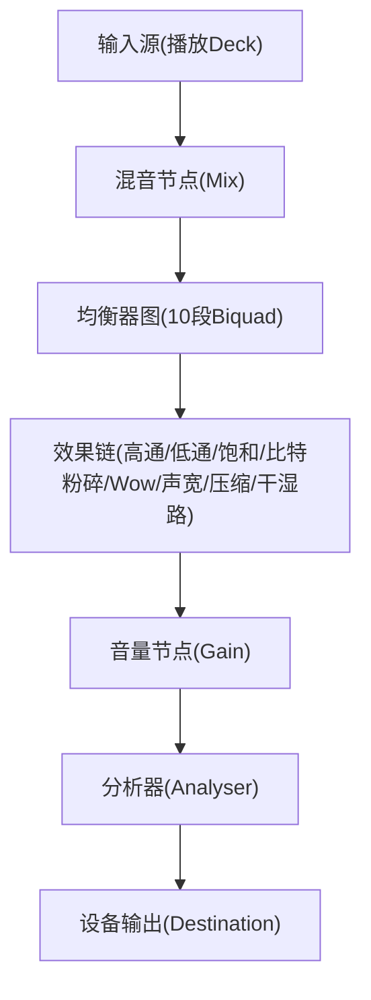
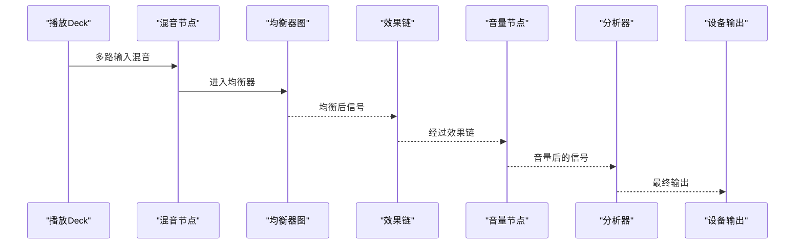
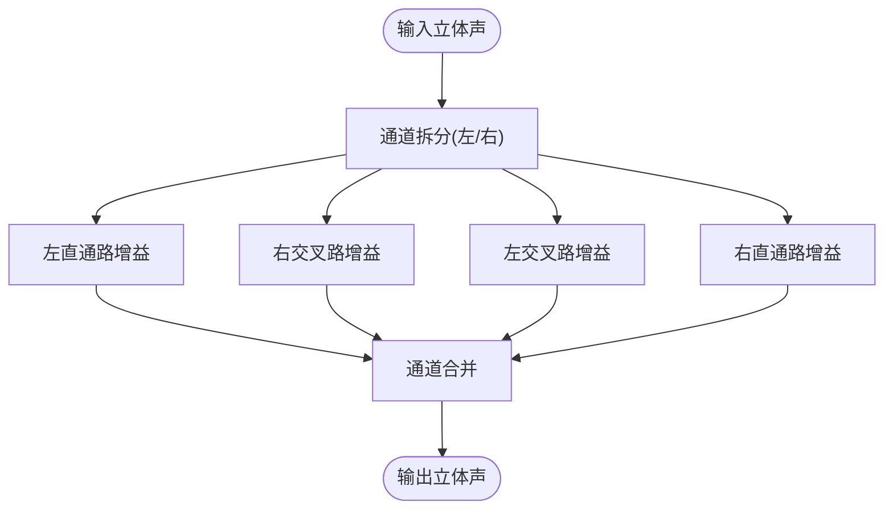
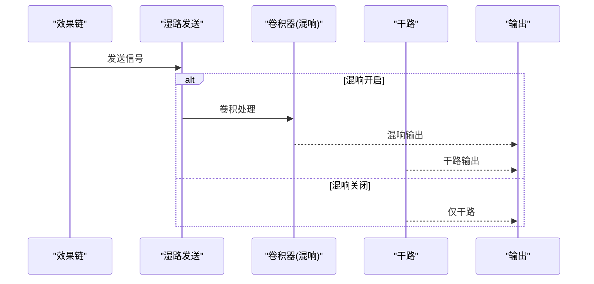
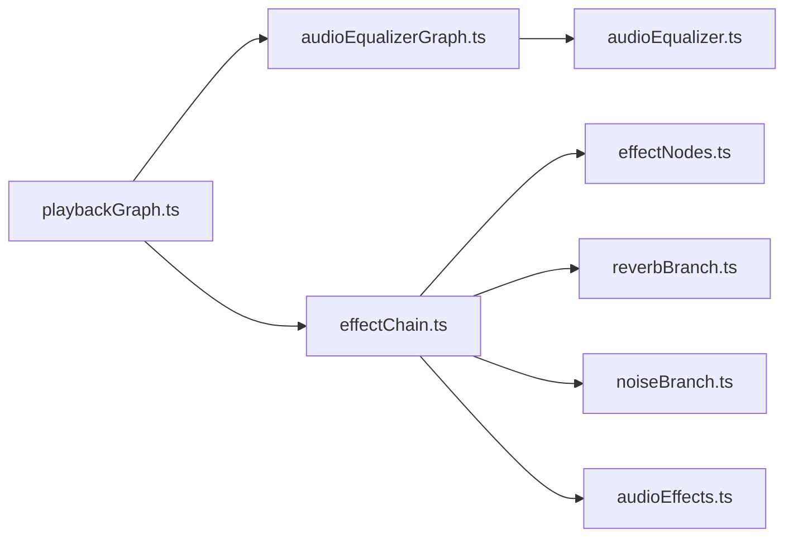

# 3D音频空间化处理

<cite>
**本文引用的文件**
- [playbackGraph.ts](file://src/services/playbackGraph.ts)
- [effectChain.ts](file://src/services/audioEffects/effectChain.ts)
- [effectNodes.ts](file://src/services/audioEffects/effectNodes.ts)
- [reverbBranch.ts](file://src/services/audioEffects/reverbBranch.ts)
- [noiseBranch.ts](file://src/services/audioEffects/noiseBranch.ts)
- [audioEqualizerGraph.ts](file://src/services/audioEqualizerGraph.ts)
- [audioEffects.ts](file://src/utils/audioEffects.ts)
- [audioEqualizer.ts](file://src/utils/audioEqualizer.ts)
</cite>

## 目录
1. [简介](#简介)
2. [项目结构](#项目结构)
3. [核心组件](#核心组件)
4. [架构总览](#架构总览)
5. [详细组件分析](#详细组件分析)
6. [依赖关系分析](#依赖关系分析)
7. [性能考量](#性能考量)
8. [故障排查指南](#故障排查指南)
9. [结论](#结论)
10. [附录](#附录)

## 简介
本技术文档围绕本项目中的“3D音频空间化处理”展开，重点解析以下能力：
- 立体声声场控制：左右声道分离、交叉混合、声宽调节等算法与实现。
- HRTF（头部相关传输函数）模拟：双耳效应、方位角定位、距离感知等空间音频特性的工程化思路与落地路径。
- 环绕声效果：多声道处理、声像定位、环境反射模拟的实现原理与扩展点。
- 性能优化：实时计算优化、内存管理、延迟控制等关键技术。
- 调试工具与方法：如何验证空间效果的正确性与音质表现。

说明：当前代码库已提供完整的立体声声场控制与空间混响链路；HRTF与多声道环绕声为可扩展方向，本文给出在现有架构上的集成建议与最佳实践。

## 项目结构
本项目将音频处理从UI中解耦，采用稳定的Web Audio节点图进行信号路由与参数调制。关键模块包括：
- 播放图构建：统一接入均衡器、效果链、音量、分析器与输出。
- 均衡器图：十段参量均衡，平滑参数更新，避免React重渲染进入音频线程。
- 效果链：高通/低通、饱和失真、比特粉碎、Wow/Flutter、噪声底噪、声宽、动态压缩与混响。
- 分支模块：可插拔的并行效果（如混响、噪声），按需创建与释放资源。

图表来源
- [playbackGraph.ts:31-99](file://src/services/playbackGraph.ts#L31-L99)

章节来源
- [playbackGraph.ts:31-99](file://src/services/playbackGraph.ts#L31-L99)

## 核心组件
- 播放图构建器：负责串联均衡器、效果链、音量与分析器，确保顺序正确且稳定。
- 均衡器图：十段滤波器链，支持平滑增益切换，避免音频抖动。
- 效果链：集中管理音色塑造、色彩染色、空间感与动态控制，并提供声宽调节。
- 分支模块：混响与噪声以并行分支形式存在，按参数启用/禁用并自动释放资源。

章节来源
- [playbackGraph.ts:31-99](file://src/services/playbackGraph.ts#L31-L99)
- [audioEqualizerGraph.ts:20-59](file://src/services/audioEqualizerGraph.ts#L20-L59)
- [effectChain.ts:31-94](file://src/services/audioEffects/effectChain.ts#L31-L94)
- [reverbBranch.ts:10-49](file://src/services/audioEffects/reverbBranch.ts#L10-L49)
- [noiseBranch.ts:10-37](file://src/services/audioEffects/noiseBranch.ts#L10-L37)

## 架构总览
下图展示了从输入到输出的完整信号流，以及各阶段的作用与交互关系。

图表来源
- [playbackGraph.ts:31-99](file://src/services/playbackGraph.ts#L31-L99)

章节来源
- [playbackGraph.ts:31-99](file://src/services/playbackGraph.ts#L31-L99)

## 详细组件分析

### 立体声声场控制：左右声道分离、交叉混合、声宽调节
- 左右声道分离：通过通道拆分节点将立体声拆分为左、右两路，分别进入直通路和交叉路。
- 交叉混合：将左路的一部分送入右路的交叉增益，同时将右路的一部分送入左路的交叉增益，形成互馈。
- 声宽调节：通过调整直通与交叉增益的比例，控制立体声宽度。当交叉增益增大时，声场更宽；反之更窄。

图表来源
- [effectNodes.ts:28-88](file://src/services/audioEffects/effectNodes.ts#L28-L88)
- [effectNodes.ts:90-116](file://src/services/audioEffects/effectNodes.ts#L90-L116)
- [effectChain.ts:67-73](file://src/services/audioEffects/effectChain.ts#L67-L73)

章节来源
- [effectNodes.ts:28-88](file://src/services/audioEffects/effectNodes.ts#L28-L88)
- [effectNodes.ts:90-116](file://src/services/audioEffects/effectNodes.ts#L90-L116)
- [effectChain.ts:67-73](file://src/services/audioEffects/effectChain.ts#L67-L73)

### 空间混响与环境反射模拟
- 并行卷积混响：使用卷积器生成房间反射模型，湿路与干路按比例混合，避免整体电平突变。
- 资源管理：仅在需要时创建卷积器，并在湿路关闭后延迟释放，减少频繁创建销毁带来的开销。
- 平滑过渡：通过参数斜坡与增益淡入淡出，保证听感自然。

图表来源
- [reverbBranch.ts:10-49](file://src/services/audioEffects/reverbBranch.ts#L10-L49)

章节来源
- [reverbBranch.ts:10-49](file://src/services/audioEffects/reverbBranch.ts#L10-L49)

### 噪声底噪与质感增强
- 黑胶噪声：带通滤波后的循环噪声与主信号混合，增加复古质感。
- 资源管理：仅在噪声强度大于0时创建并连接噪声源，关闭时平滑退出。

章节来源
- [noiseBranch.ts:10-37](file://src/services/audioEffects/noiseBranch.ts#L10-L37)

### 均衡器与参数平滑
- 十段均衡：低频shelf、高频shelf与中间peaking滤波器串联，覆盖全频段。
- 平滑更新：使用目标值设置与时间常数，避免参数跳变导致的爆音。
- 频率限制：根据采样率限制最高可用频率，防止不可听的高频伪影。

章节来源
- [audioEqualizerGraph.ts:20-59](file://src/services/audioEqualizerGraph.ts#L20-L59)

### 效果模型与控制映射
- 效果定义：包含高通/低通、驱动、比特粉碎、Wow/Flutter、噪声、声宽、空间、打击感等控制项。
- 归一化与校验：对持久化或导入的参数进行范围钳制与默认值填充，确保运行时安全。
- UI映射：对数刻度与线性刻度的滑块位置与音频参数双向转换，提升操控体验。

章节来源
- [audioEffects.ts:1-122](file://src/utils/audioEffects.ts#L1-122)
- [audioEqualizer.ts:1-227](file://src/utils/audioEqualizer.ts#L1-L227)

## 依赖关系分析
- playbackGraph.ts 依赖 audioEqualizerGraph.ts 与 effectChain.ts，构成播放图的骨架。
- effectChain.ts 依赖 effectNodes.ts 与各分支模块（reverbBranch、noiseBranch），实现模块化效果。
- effectNodes.ts 提供稳定的节点结构与连接逻辑，是效果链的基础。
- audioEffects.ts 与 audioEqualizer.ts 提供参数模型、默认值与归一化工具，贯穿UI与运行时。

图表来源
- [playbackGraph.ts:31-99](file://src/services/playbackGraph.ts#L31-L99)
- [effectChain.ts:31-94](file://src/services/audioEffects/effectChain.ts#L31-L94)
- [effectNodes.ts:28-116](file://src/services/audioEffects/effectNodes.ts#L28-L116)
- [reverbBranch.ts:10-49](file://src/services/audioEffects/reverbBranch.ts#L10-L49)
- [noiseBranch.ts:10-37](file://src/services/audioEffects/noiseBranch.ts#L10-L37)
- [audioEffects.ts:1-122](file://src/utils/audioEffects.ts#L1-L122)
- [audioEqualizer.ts:1-227](file://src/utils/audioEqualizer.ts#L1-L227)

章节来源
- [playbackGraph.ts:31-99](file://src/services/playbackGraph.ts#L31-L99)
- [effectChain.ts:31-94](file://src/services/audioEffects/effectChain.ts#L31-L94)
- [effectNodes.ts:28-116](file://src/services/audioEffects/effectNodes.ts#L28-L116)

## 性能考量
- 节点复用与稳定图：均衡器与效果链节点一次性创建并复用，避免每帧重建带来的CPU与内存压力。
- 参数平滑：使用setTargetAtTime与rampParam等技术，避免参数突变导致的爆音与额外计算。
- 资源按需创建：混响与噪声仅在需要时创建，并在关闭后延迟释放，降低峰值内存占用。
- 采样率限制：滤波器最高频率限制在采样率的约0.475倍，避免不可听高频带来的伪影与额外计算。
- 顺序优化：音量节点置于效果链之后，确保体积控制不影响效果的相对行为（如噪声底噪、比特粉碎、压缩阈值）。

章节来源
- [audioEqualizerGraph.ts:20-59](file://src/services/audioEqualizerGraph.ts#L20-L59)
- [effectChain.ts:31-94](file://src/services/audioEffects/effectChain.ts#L31-L94)
- [reverbBranch.ts:10-49](file://src/services/audioEffects/reverbBranch.ts#L10-L49)
- [playbackGraph.ts:54-99](file://src/services/playbackGraph.ts#L54-L99)

## 故障排查指南
- 声音异常或爆音：检查参数是否越界，确认使用了平滑更新；核对滤波器频率上限是否被采样率限制。
- 混响不生效：确认湿路发送与卷积器连接是否正确；检查是否在关闭时延迟释放导致状态不一致。
- 噪声底噪过大：确认噪声分支仅在强度大于0时启用；检查带通滤波参数是否符合预期。
- 声宽无变化：检查直通与交叉增益映射是否正确；确认参数范围与单位映射无误。
- 可视化与听感不一致：确认分析器位于音量节点之后，确保绘制的是最终输出。

章节来源
- [effectChain.ts:31-94](file://src/services/audioEffects/effectChain.ts#L31-L94)
- [reverbBranch.ts:10-49](file://src/services/audioEffects/reverbBranch.ts#L10-L49)
- [noiseBranch.ts:10-37](file://src/services/audioEffects/noiseBranch.ts#L10-L37)
- [playbackGraph.ts:83-99](file://src/services/playbackGraph.ts#L83-L99)

## 结论
本项目已具备完善的立体声声场控制与空间混响能力，并通过稳定的节点图与参数平滑机制保证了实时性与音质。HRTF与多声道环绕声可在现有架构上扩展：通过引入HRTF滤波器组与多声道路由，结合声像定位与环境反射模型，即可实现更丰富的3D音频体验。同时，性能与资源管理策略为后续扩展提供了坚实基础。

## 附录

### HRTF（头部相关传输函数）模拟实现建议
- 双耳效应：为左右耳分别加载对应的HRTF滤波器，依据方位角与仰角选择对应滤波器组，实现相位与幅度的差异化处理。
- 方位角定位：基于方位角索引选择HRTF滤波器，必要时进行插值以获得平滑的运动轨迹。
- 距离感知：通过近场衰减与早期反射强度调节，模拟距离变化带来的能量与混响密度变化。
- 集成方式：在效果链中插入HRTF模块，作为声宽与混响之间的可选环节；保持与现有参数系统的兼容。

[本节为概念性内容，不直接分析具体文件]

### 环绕声效果实现原理
- 多声道处理：将立体声扩展至5.1或7.1布局，通过矩阵混音与声像定位算法分配各声道能量。
- 声像定位：依据目标方位角与仰角，计算各声道增益权重，实现声源的三维定位。
- 环境反射模拟：结合早期反射与晚期混响，营造空间包围感；可通过卷积或算法混响组合实现。
- 集成方式：在效果链后级添加多声道路由与定位模块，保持与现有分析器与输出的兼容性。

[本节为概念性内容，不直接分析具体文件]

### 3D音频调试工具与方法
- 参数可视化：在UI中显示各效果参数与实时值，便于定位问题。
- 频谱与波形监测：利用分析器观察频谱与波形，验证HRTF与混响的效果。
- 对比测试：在不同设备与耳机上试听，评估空间效果的一致性与舒适度。
- 自动化测试：对关键参数边界与极端场景进行测试，确保稳定性与鲁棒性。

[本节为概念性内容，不直接分析具体文件]