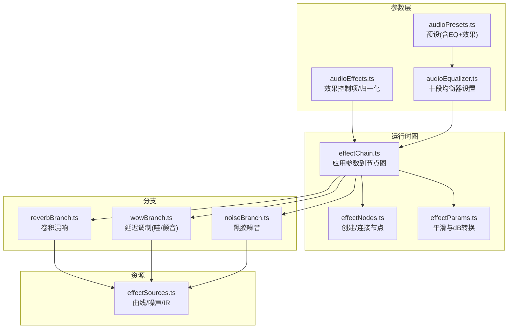
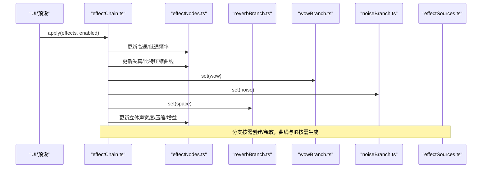
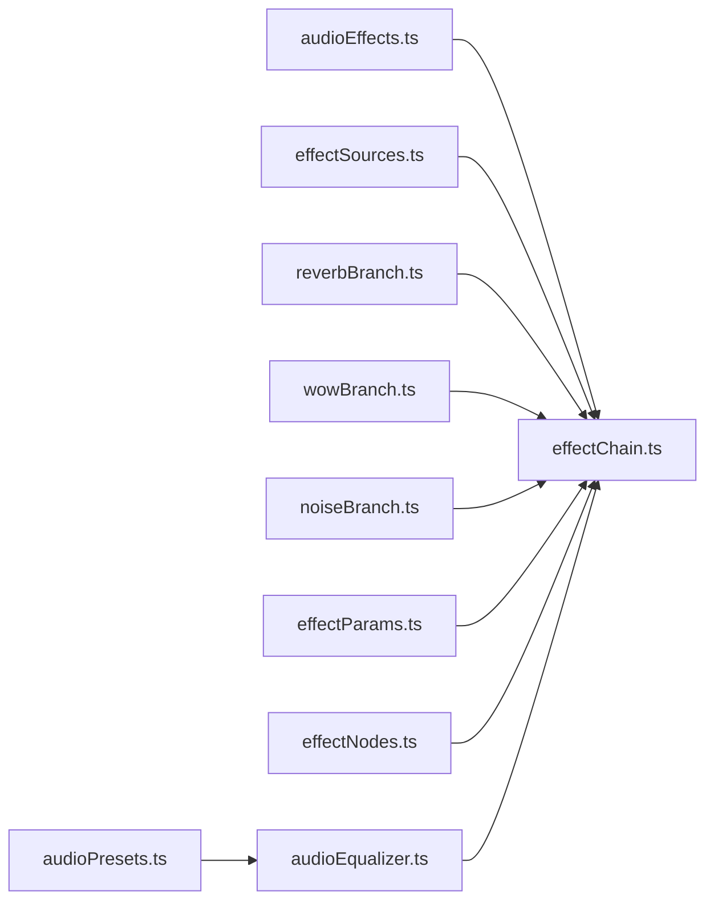
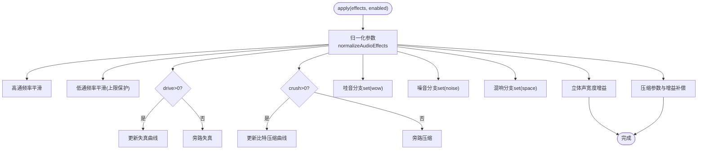

# 内置效果器详解

<cite>
**本文引用的文件**
- [effectChain.ts](file://src/services/audioEffects/effectChain.ts)
- [effectNodes.ts](file://src/services/audioEffects/effectNodes.ts)
- [effectParams.ts](file://src/services/audioEffects/effectParams.ts)
- [reverbBranch.ts](file://src/services/audioEffects/reverbBranch.ts)
- [wowBranch.ts](file://src/services/audioEffects/wowBranch.ts)
- [noiseBranch.ts](file://src/services/audioEffects/noiseBranch.ts)
- [effectSources.ts](file://src/services/audioEffects/effectSources.ts)
- [audioEffects.ts](file://src/utils/audioEffects.ts)
- [audioEqualizer.ts](file://src/utils/audioEqualizer.ts)
- [audioPresets.ts](file://src/utils/audioPresets.ts)
</cite>

## 目录
1. [简介](#简介)
2. [项目结构](#项目结构)
3. [核心组件](#核心组件)
4. [架构总览](#架构总览)
5. [详细组件分析](#详细组件分析)
6. [依赖关系分析](#依赖关系分析)
7. [性能考量](#性能考量)
8. [故障排查指南](#故障排查指南)
9. [结论](#结论)
10. [附录](#附录)

## 简介
本技术文档聚焦于项目中的“内置音频效果器”子系统，系统性解析其DSP算法与Web Audio API实现。内容覆盖均衡器（高通/低通滤波器）、失真饱和、比特压缩、哇音颤音、黑胶噪音、混响空间效果等，并详细说明各效果的数学原理、节点使用方式、参数映射与归一化策略、dB线性转换、范围限制等技术细节。同时给出音质特性、适用场景与最佳实践，帮助用户理解不同效果的听觉差异与应用方法。

## 项目结构
效果器子系统由“参数模型 + 节点图构建 + 分支模块 + 资源生成”四部分组成：
- 参数模型：定义效果类型、控制项、默认值、UI滑块映射与校验
- 节点图：创建并连接BiquadFilterNode、WaveShaperNode、DynamicsCompressorNode、GainNode、DelayNode、ChannelSplitter/Merger等
- 分支模块：可插拔的并行处理分支（混响、哇音、黑胶噪音），按需启用/释放
- 资源生成：波形整形曲线、噪声缓冲、卷积混响脉冲响应

图表来源
- [effectChain.ts:31-82](file://src/services/audioEffects/effectChain.ts#L31-L82)
- [effectNodes.ts:28-116](file://src/services/audioEffects/effectNodes.ts#L28-L116)
- [effectParams.ts:6-16](file://src/services/audioEffects/effectParams.ts#L6-L16)
- [reverbBranch.ts:10-47](file://src/services/audioEffects/reverbBranch.ts#L10-L47)
- [wowBranch.ts:9-74](file://src/services/audioEffects/wowBranch.ts#L9-L74)
- [noiseBranch.ts:10-58](file://src/services/audioEffects/noiseBranch.ts#L10-L58)
- [effectSources.ts:24-94](file://src/services/audioEffects/effectSources.ts#L24-L94)
- [audioEffects.ts:41-122](file://src/utils/audioEffects.ts#L41-L122)
- [audioPresets.ts:18-76](file://src/utils/audioPresets.ts#L18-L76)
- [audioEqualizer.ts:14-24](file://src/utils/audioEqualizer.ts#L14-L24)

章节来源
- [effectChain.ts:31-82](file://src/services/audioEffects/effectChain.ts#L31-L82)
- [effectNodes.ts:28-116](file://src/services/audioEffects/effectNodes.ts#L28-L116)
- [effectParams.ts:6-16](file://src/services/audioEffects/effectParams.ts#L6-L16)
- [audioEffects.ts:41-122](file://src/utils/audioEffects.ts#L41-L122)
- [audioPresets.ts:18-76](file://src/utils/audioPresets.ts#L18-L76)
- [audioEqualizer.ts:14-24](file://src/utils/audioEqualizer.ts#L14-L24)

## 核心组件
- 效果链控制器：负责将用户设置的归一化参数应用到节点图，包括高通/低通滤波、失真饱和、比特压缩、立体声宽度、动态压缩与增益补偿、以及并行分支（混响、哇音、黑胶噪音）的开关与强度控制
- 节点图：串联的高通/低通、两个WaveShaper（失真/比特压缩）、延迟（用于哇音）、立体声拆分/合并、压缩器与干湿路混合
- 参数工具：AudioParam平滑过渡、dB到线性增益转换
- 分支模块：懒加载与延迟释放，避免不必要的CPU占用
- 资源生成：软削峰曲线、阶梯量化曲线、黑胶噪声缓冲、指数衰减卷积混响脉冲响应

章节来源
- [effectChain.ts:31-82](file://src/services/audioEffects/effectChain.ts#L31-L82)
- [effectNodes.ts:28-116](file://src/services/audioEffects/effectNodes.ts#L28-L116)
- [effectParams.ts:6-16](file://src/services/audioEffects/effectParams.ts#L6-L16)
- [reverbBranch.ts:10-47](file://src/services/audioEffects/reverbBranch.ts#L10-L47)
- [wowBranch.ts:9-74](file://src/services/audioEffects/wowBranch.ts#L9-L74)
- [noiseBranch.ts:10-58](file://src/services/audioEffects/noiseBranch.ts#L10-L58)
- [effectSources.ts:24-94](file://src/services/audioEffects/effectSources.ts#L24-L94)

## 架构总览
下图展示了从输入到输出的信号流与各效果器的作用位置，以及参数如何驱动节点变化。

图表来源
- [effectChain.ts:47-80](file://src/services/audioEffects/effectChain.ts#L47-L80)
- [effectNodes.ts:91-116](file://src/services/audioEffects/effectNodes.ts#L91-L116)
- [reverbBranch.ts:21-42](file://src/services/audioEffects/reverbBranch.ts#L21-L42)
- [wowBranch.ts:45-69](file://src/services/audioEffects/wowBranch.ts#L45-L69)
- [noiseBranch.ts:29-53](file://src/services/audioEffects/noiseBranch.ts#L29-L53)
- [effectSources.ts:24-94](file://src/services/audioEffects/effectSources.ts#L24-L94)

## 详细组件分析

### 均衡器（高通/低通滤波器）
- 数学原理
  - 高通/低通采用二阶巴特沃斯型IIR滤波器（BiquadFilterNode），通过Q=0.7近似最大平坦幅度响应，提供稳定的滚降特性
  - 高频上限被限制在采样率的一半以下，避免混叠
- Web Audio API实现
  - 使用createBiquadFilter()创建高通/低通，设置type与frequency，Q固定为0.7
  - 频率通过rampParam平滑过渡，避免突变
- 参数映射
  - 高通：对数刻度，范围20Hz~2kHz，中性点20Hz
  - 低通：对数刻度，范围500Hz~20kHz，中性点20kHz；实际应用时上限不超过sampleRate*0.475
- 使用建议
  - 高通常用于去除低频隆隆声或为后续失真留出动态余量
  - 低通可用于模拟老式设备带宽限制或减少高频刺耳感

章节来源
- [effectNodes.ts:29-37](file://src/services/audioEffects/effectNodes.ts#L29-L37)
- [effectChain.ts:51-52](file://src/services/audioEffects/effectChain.ts#L51-L52)
- [audioEffects.ts:42-43](file://src/utils/audioEffects.ts#L42-L43)

### 失真饱和（Drive）
- 数学原理
  - 采用tanh软削峰传递函数，随amount增大形状更陡峭，产生偶次谐波为主的热感失真
  - 通过参考正弦能量测量进行响度匹配，使输出电平不随失真增加而显著变大
- Web Audio API实现
  - WaveShaperNode配合oversample='4x'抑制高频混叠
  - 曲线由createSaturationCurve生成，amount<=0时返回null以旁路
- 参数映射
  - amount∈[0,1]，线性映射到形状系数，峰值THD约20%（顶档），典型预设约5%
- 使用建议
  - 适合温暖音色增强、人声/吉他微饱和；过大易刺耳
  - 常与压缩器配合提升听感密度

章节来源
- [effectSources.ts:24-41](file://src/services/audioEffects/effectSources.ts#L24-L41)
- [effectNodes.ts:39-43](file://src/services/audioEffects/effectNodes.ts#L39-L43)
- [effectChain.ts:54-57](file://src/services/audioEffects/effectChain.ts#L54-L57)

### 比特压缩（Crush）
- 数学原理
  - 阶梯量化曲线模拟低比特深度ADC/DAC，bits=16-sqrt(amount)*12，使8-10bit区间位于滑块中部更易感知
  - 量化引入宽带噪声与谐波，带来Lo-Fi质感
- Web Audio API实现
  - WaveShaperNode承载量化曲线，amount<=0时旁路
- 参数映射
  - amount∈[0,1]，非线性映射到比特数，保证常用范围居中
- 使用建议
  - 适合Lo-Fi、复古电台风格；注意与噪声叠加后的底噪感知

章节来源
- [effectSources.ts:43-58](file://src/services/audioEffects/effectSources.ts#L43-L58)
- [effectNodes.ts:44-45](file://src/services/audioEffects/effectNodes.ts#L44-L45)
- [effectChain.ts:58-61](file://src/services/audioEffects/effectChain.ts#L58-L61)

### 哇音/颤音（Wow/Flutter）
- 数学原理
  - 基于延迟线的调制：慢速Wow（约0.7Hz）与快速Flutter（约6.8Hz）两路LFO叠加到delayTime，模拟磁带/黑胶的音高漂移
- Web Audio API实现
  - DelayNode作为延迟线，OscillatorNode+GainNode作为LFO深度控制
  - 基础延迟时间WOW_BASE_DELAY_SECONDS，amount>0时激活，否则归零并延迟释放
- 参数映射
  - amount∈[0,1]，分别映射到Wow与Flutter的深度
- 使用建议
  - 适合模拟老设备、Lo-Fi氛围；过大会导致明显走调

章节来源
- [wowBranch.ts:9-74](file://src/services/audioEffects/wowBranch.ts#L9-L74)
- [effectNodes.ts:25-47](file://src/services/audioEffects/effectNodes.ts#L25-L47)

### 黑胶噪音（Vinyl Noise）
- 数学原理
  - 生成带通滤波后的白噪声，叠加稀疏衰减的“噼啪”事件，模拟黑胶底噪与表面噪声
- Web Audio API实现
  - BufferSource循环播放噪声缓冲，BiquadFilterNode做带通（中心频约2.6kHz，Q=0.5）
  - 音量按amount^1.4缩放，避免线性增长带来的突兀
- 参数映射
  - amount∈[0,1]，非线性映射到增益，降低小值时的敏感度
- 使用建议
  - 适合营造复古氛围；注意与音乐弱段落对比产生的“底噪突出”现象

章节来源
- [noiseBranch.ts:10-58](file://src/services/audioEffects/noiseBranch.ts#L10-L58)
- [effectSources.ts:60-78](file://src/services/audioEffects/effectSources.ts#L60-L78)

### 混响空间（Space / Convolution Reverb）
- 数学原理
  - 使用ConvolverNode进行卷积混响，IR为指数衰减随机噪声，时长约2.2秒，衰减指数约2.8
- Web Audio API实现
  - 首次需要时创建ConvolverNode并设置normalize=true，连接wetSend→Convolver→wet
  - 干路增益略降以保持总电平稳定，湿路增益随space比例上升
- 参数映射
  - space∈[0,1]，线性映射到干湿比
- 使用建议
  - 适合营造空间感；大空间时注意与压缩器/限幅器配合防止过载

章节来源
- [reverbBranch.ts:10-47](file://src/services/audioEffects/reverbBranch.ts#L10-L47)
- [effectSources.ts:80-94](file://src/services/audioEffects/effectSources.ts#L80-L94)

### 立体声宽度（Width）
- 数学原理
  - 通过ChannelSplitter/Merger与左右直通/交叉增益组合，调节左右声道相关性，实现变宽/变窄
- Web Audio API实现
  - leftDirect/rightDirect直通增益direct=(1+width)/2
  - leftCross/rightCross交叉增益cross=(1-width)/2
- 参数映射
  - width∈[0,2]，中性点1（全直），0为单声道，>1可适度拓宽
- 使用建议
  - 过宽可能导致相位问题与单声道兼容性下降

章节来源
- [effectNodes.ts:49-86](file://src/services/audioEffects/effectNodes.ts#L49-L86)
- [effectChain.ts:67-72](file://src/services/audioEffects/effectChain.ts#L67-L72)

### 动态压缩与增益补偿（Punch）
- 数学原理
  - 使用DynamicsCompressorNode调整阈值、比率、膝部，配合makeup增益恢复整体响度
- Web Audio API实现
  - threshold=-6-punch*26，ratio=1+punch*7，knee=30-punch*18
  - makeup增益使用dbToLinear(punch*3)转换为线性
- 参数映射
  - punch∈[0,1]，线性映射到压缩参数与增益补偿
- 使用建议
  - 提升打击感与密度；过大可能引起泵吸效应

章节来源
- [effectChain.ts:74-79](file://src/services/audioEffects/effectChain.ts#L74-L79)
- [effectParams.ts:16-16](file://src/services/audioEffects/effectParams.ts#L16-L16)

## 依赖关系分析
- effectChain.ts依赖：
  - audioEffects.ts：参数归一化与默认值
  - effectSources.ts：失真/比特压缩曲线、噪声缓冲、混响IR
  - reverbBranch.ts、wowBranch.ts、noiseBranch.ts：并行分支
  - effectParams.ts：参数平滑与dB转换
  - effectNodes.ts：节点创建与连接
- audioEqualizer.ts与audioPresets.ts：
  - 提供十段均衡器与预设（包含EQ与效果链状态）
  - 读取/写入本地存储，兼容历史配置迁移

图表来源
- [effectChain.ts:1-11](file://src/services/audioEffects/effectChain.ts#L1-L11)
- [audioEffects.ts:1-16](file://src/utils/audioEffects.ts#L1-L16)
- [audioEqualizer.ts:1-24](file://src/utils/audioEqualizer.ts#L1-L24)
- [audioPresets.ts:1-16](file://src/utils/audioPresets.ts#L1-L16)

章节来源
- [effectChain.ts:1-11](file://src/services/audioEffects/effectChain.ts#L1-L11)
- [audioEffects.ts:1-16](file://src/utils/audioEffects.ts#L1-L16)
- [audioEqualizer.ts:1-24](file://src/utils/audioEqualizer.ts#L1-L24)
- [audioPresets.ts:1-16](file://src/utils/audioPresets.ts#L1-L16)

## 性能考量
- 过采样：失真阶段使用4x过采样以减少高频混叠
- 懒加载与延迟释放：混响、哇音、噪音分支仅在需要时创建，并在关闭后延迟释放，避免频繁创建销毁开销
- 参数平滑：所有AudioParam变更使用setTargetAtTime平滑过渡，避免点击声
- 资源复用：噪声缓冲与混响IR一次性生成并缓存，避免重复计算
- 上限保护：低通频率限制在采样率一半以下，防止无效或危险设置

章节来源
- [effectNodes.ts:39-43](file://src/services/audioEffects/effectNodes.ts#L39-L43)
- [effectNodes.ts:34-37](file://src/services/audioEffects/effectNodes.ts#L34-L37)
- [effectParams.ts:6-14](file://src/services/audioEffects/effectParams.ts#L6-L14)
- [reverbBranch.ts:21-42](file://src/services/audioEffects/reverbBranch.ts#L21-L42)
- [wowBranch.ts:45-69](file://src/services/audioEffects/wowBranch.ts#L45-L69)
- [noiseBranch.ts:29-53](file://src/services/audioEffects/noiseBranch.ts#L29-L53)

## 故障排查指南
- 出现底噪或噼啪声
  - 检查是否启用了crush或noise，二者会引入额外噪声
  - 确认UI标注“addsNoise”的效果处于开启状态
- 声音突然变小或变大
  - 检查punch导致的压缩与makeup增益变化
  - 确认space混响干湿比切换时干路增益补偿正常
- 高频刺耳或失真过大
  - 降低drive，或适当提高lowpass截止频率
  - 检查是否在高采样率下未正确限制lowpass上限
- 立体声异常或单声道兼容问题
  - 调整width至接近1，避免极端宽度
- 内存/CPU占用过高
  - 确认分支已正确释放（关闭后延迟释放）
  - 避免同时开启过多重型效果（如大空间混响+强失真）

章节来源
- [audioEffects.ts:25-37](file://src/utils/audioEffects.ts#L25-L37)
- [effectChain.ts:74-79](file://src/services/audioEffects/effectChain.ts#L74-L79)
- [reverbBranch.ts:21-42](file://src/services/audioEffects/reverbBranch.ts#L21-L42)
- [wowBranch.ts:45-69](file://src/services/audioEffects/wowBranch.ts#L45-L69)
- [noiseBranch.ts:29-53](file://src/services/audioEffects/noiseBranch.ts#L29-L53)

## 结论
该效果器子系统以清晰的参数模型与模块化节点图实现了丰富的音频效果：均衡、失真、比特压缩、哇音/颤音、黑胶噪音与卷积混响。通过合理的数学建模与Web Audio API节点组合，既保证了音质与可控性，又兼顾了性能与用户体验。结合预设与自定义插槽，用户可在不同风格间快速切换，并通过精细的参数调节获得理想的听感。

## 附录

### 参数与控件映射表
- highpass：单位Hz，对数刻度，范围20-2000Hz，中性20Hz
- lowpass：单位Hz，对数刻度，范围500-20000Hz，中性20000Hz
- drive：比值，线性，范围0-1，中性0
- crush：比值，线性，范围0-1，中性0，自带噪声
- wow：比值，线性，范围0-1，中性0
- noise：比值，线性，范围0-1，中性0，自带噪声
- width：比值，线性，范围0-2，中性1
- space：比值，线性，范围0-1，中性0
- punch：比值，线性，范围0-1，中性0

章节来源
- [audioEffects.ts:41-51](file://src/utils/audioEffects.ts#L41-L51)

### 预设示例（部分）
- lofi：强调中低频、适度带宽限制、加入失真/比特压缩/哇音/噪音与空间感
- radio：窄带传输风格，强压缩与有限带宽
- hall：宽阔空间感，适度宽度与混响
- vocal：人声友好频段与适度空间
- bass：低频增强与适度饱和度

章节来源
- [audioPresets.ts:18-76](file://src/utils/audioPresets.ts#L18-L76)

### 关键流程图（参数到节点）

图表来源
- [effectChain.ts:47-80](file://src/services/audioEffects/effectChain.ts#L47-L80)
- [audioEffects.ts:71-80](file://src/utils/audioEffects.ts#L71-L80)