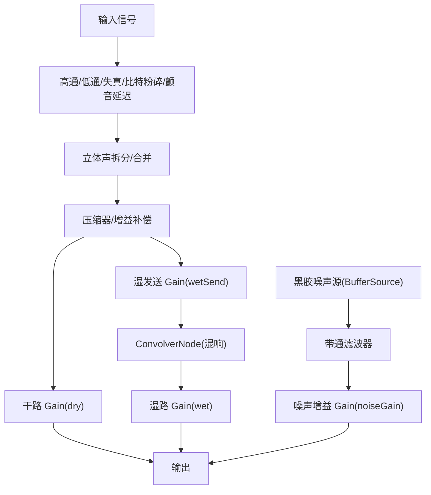
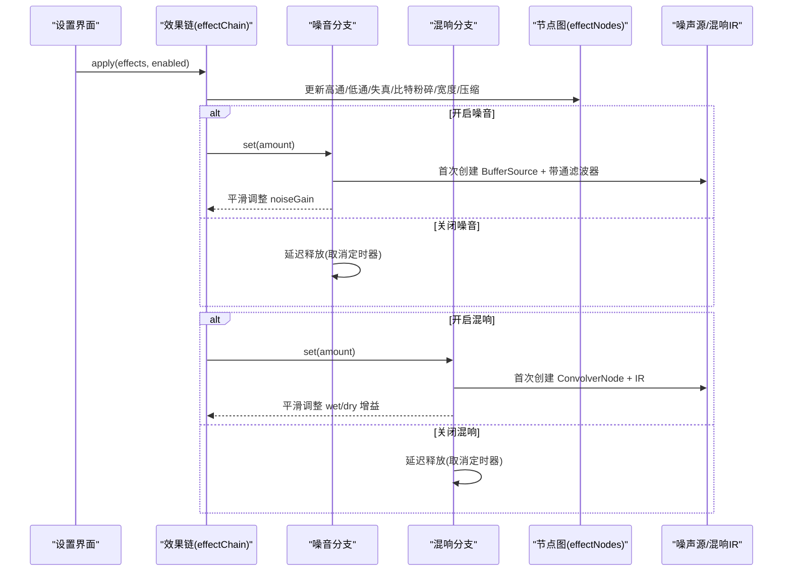
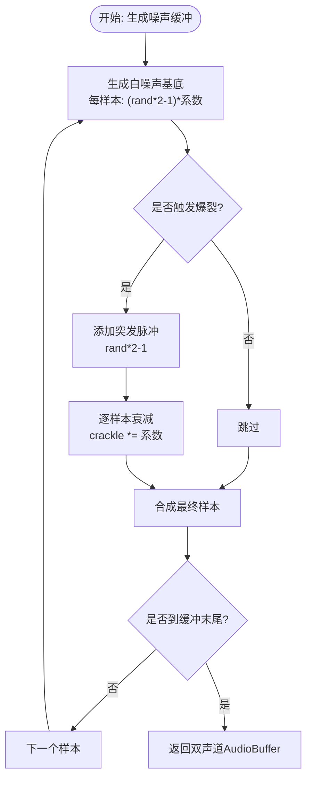
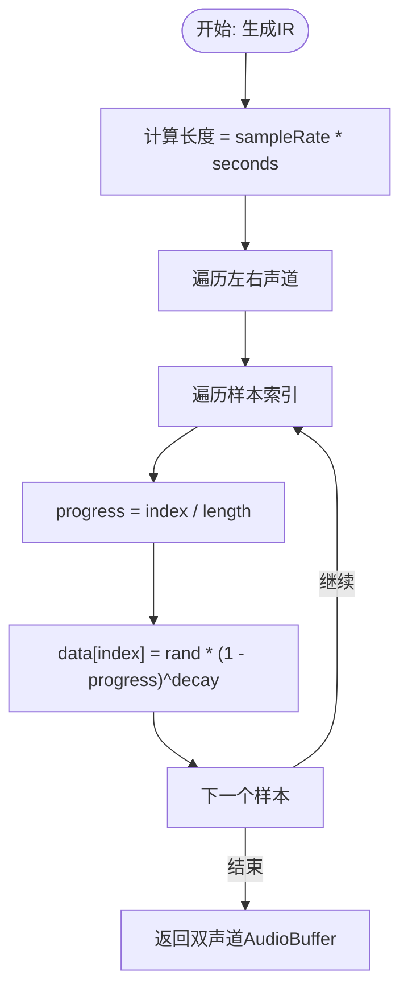
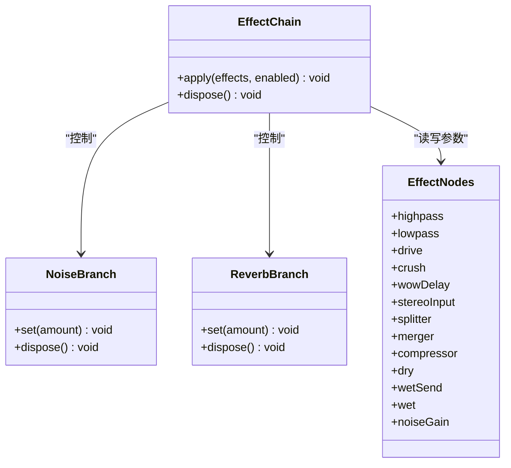
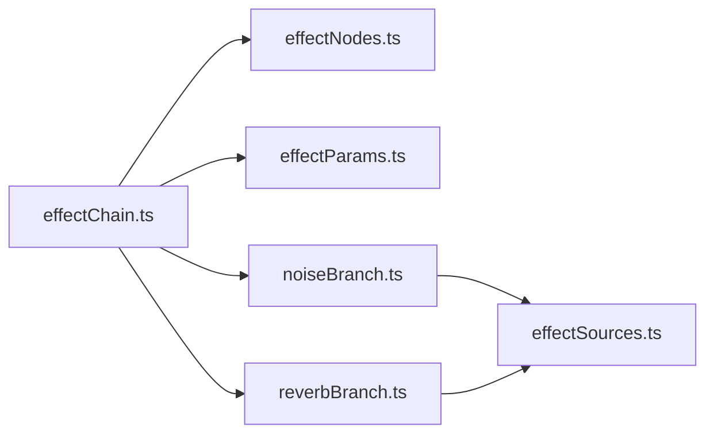

# 噪音与混响效果

<cite>
**本文引用的文件**
- [effectSources.ts](file://src/services/audioEffects/effectSources.ts)
- [noiseBranch.ts](file://src/services/audioEffects/noiseBranch.ts)
- [reverbBranch.ts](file://src/services/audioEffects/reverbBranch.ts)
- [effectNodes.ts](file://src/services/audioEffects/effectNodes.ts)
- [effectParams.ts](file://src/services/audioEffects/effectParams.ts)
- [effectChain.ts](file://src/services/audioEffects/effectChain.ts)
- [audioEffectChain.test.ts](file://test/unit/services/audioEffectChain.test.ts)
</cite>

## 目录
1. [简介](#简介)
2. [项目结构](#项目结构)
3. [核心组件](#核心组件)
4. [架构总览](#架构总览)
5. [详细组件分析](#详细组件分析)
6. [依赖关系分析](#依赖关系分析)
7. [性能与内存管理](#性能与内存管理)
8. [参数调节最佳实践](#参数调节最佳实践)
9. [故障排查指南](#故障排查指南)
10. [结论](#结论)

## 简介
本技术文档聚焦于音频后处理链中的“黑胶噪音模拟”和“卷积混响”两大效果，系统解析其算法实现、数据流与控制流，并给出在氛围营造中的应用建议、参数调优策略以及基于 Web Audio API 的 ConvolverNode 与 AudioBuffer 的使用要点。该实现采用“按需分配、延迟释放”的策略，在不使用时不占用额外资源，确保播放流畅与低内存占用。

## 项目结构
围绕噪音与混响的核心代码位于 services/audioEffects 目录下：
- effectSources.ts：生成噪声缓冲与混响脉冲响应（IR）
- noiseBranch.ts：黑胶噪音分支，包含带通滤波与循环播放
- reverbBranch.ts：并行卷积混响分支，使用 ConvolverNode 与 IR
- effectNodes.ts：常驻节点图与干/湿声路由
- effectParams.ts：平滑参数过渡工具
- effectChain.ts：将各分支接入统一的效果链，并负责应用设置与释放

图表来源
- [effectNodes.ts:28-116](file://src/services/audioEffects/effectNodes.ts#L28-L116)
- [reverbBranch.ts:21-42](file://src/services/audioEffects/reverbBranch.ts#L21-L42)
- [noiseBranch.ts:29-53](file://src/services/audioEffects/noiseBranch.ts#L29-L53)

章节来源
- [effectNodes.ts:28-116](file://src/services/audioEffects/effectNodes.ts#L28-L116)
- [effectChain.ts:31-94](file://src/services/audioEffects/effectChain.ts#L31-L94)

## 核心组件
- 黑胶噪音分支：通过 createVinylNoiseBuffer 生成约 3 秒的双声道噪声缓冲，叠加稀疏衰减的爆裂声；经带通滤波后以循环方式播放，音量随效果强度平滑变化。
- 卷积混响分支：通过 createReverbImpulse 生成指数衰减的噪声脉冲响应，交由 ConvolverNode 进行实时卷积；湿声与干声按比例混合，避免切换时的电平突变。
- 参数平滑：所有 AudioParam 更新均通过 rampParam 进行目标值平滑过渡，避免可闻的阶跃与爆音。
- 分支生命周期：仅在需要时创建 ConvolverNode 与 BufferSource，并在效果关闭后延迟释放，减少频繁创建销毁的开销。

章节来源
- [effectSources.ts:61-94](file://src/services/audioEffects/effectSources.ts#L61-L94)
- [noiseBranch.ts:10-58](file://src/services/audioEffects/noiseBranch.ts#L10-L58)
- [reverbBranch.ts:10-48](file://src/services/audioEffects/reverbBranch.ts#L10-L48)
- [effectParams.ts:6-14](file://src/services/audioEffects/effectParams.ts#L6-L14)

## 架构总览
效果链由“常驻节点图 + 可选分支”构成。常驻部分包括滤波器、失真、比特粉碎、颤音延迟、立体声矩阵、压缩器与干湿路由；可选分支为黑胶噪音与卷积混响，按设置动态启用。

图表来源
- [effectChain.ts:47-80](file://src/services/audioEffects/effectChain.ts#L47-L80)
- [noiseBranch.ts:29-53](file://src/services/audioEffects/noiseBranch.ts#L29-L53)
- [reverbBranch.ts:21-42](file://src/services/audioEffects/reverbBranch.ts#L21-L42)

章节来源
- [effectChain.ts:31-94](file://src/services/audioEffects/effectChain.ts#L31-L94)

## 详细组件分析

### 黑胶噪音模拟算法
- 随机噪声生成：createVinylNoiseBuffer 根据当前采样率生成约 3 秒的双声道缓冲，每样本加入均匀分布的白噪声基底。
- 爆裂声模拟：以极低概率触发突发脉冲，随后以固定系数逐样本衰减，形成类似黑胶表面杂音的稀疏爆裂声。
- 衰减机制：每个样本对爆裂声分量乘以衰减系数，使瞬态快速回落，避免持续驻留。
- 频域整形：通过 BiquadFilterNode 设置为带通模式，中心频率与 Q 值用于让噪声更贴合音乐频段，避免“浮在音乐之上”。
- 播放与混入：BufferSource 循环播放，音量通过 noiseGain 平滑控制，关闭时延迟释放以避免卡顿。

图表来源
- [effectSources.ts:61-78](file://src/services/audioEffects/effectSources.ts#L61-L78)
- [noiseBranch.ts:30-53](file://src/services/audioEffects/noiseBranch.ts#L30-L53)

章节来源
- [effectSources.ts:61-78](file://src/services/audioEffects/effectSources.ts#L61-L78)
- [noiseBranch.ts:10-58](file://src/services/audioEffects/noiseBranch.ts#L10-L58)

### 卷积混响的脉冲响应生成
- 指数衰减模型：createReverbImpulse 生成指定时长（默认约 2.2 秒）的噪声脉冲响应，幅度按 (1 - progress)^decay 衰减，其中 progress = index / length。
- 空间声学模拟：通过不同 decay 值模拟不同房间大小与吸声特性；更大的 decay 产生更长尾音与更“大”的空间感。
- 归一化与路由：ConvolverNode 启用 normalize，IR 一次性生成并复用；湿声与干声按比例混合，切换时保持总电平稳定。
- 延迟释放：混响分支在关闭时延迟断开连接并释放 ConvolverNode，避免频繁创建带来的抖动。

图表来源
- [effectSources.ts:81-94](file://src/services/audioEffects/effectSources.ts#L81-L94)
- [reverbBranch.ts:21-42](file://src/services/audioEffects/reverbBranch.ts#L21-L42)

章节来源
- [effectSources.ts:81-94](file://src/services/audioEffects/effectSources.ts#L81-L94)
- [reverbBranch.ts:10-48](file://src/services/audioEffects/reverbBranch.ts#L10-L48)

### 效果链集成与控制流
- 节点图：effectNodes 创建并连接高通/低通、失真、比特粉碎、颤音延迟、立体声矩阵、压缩器与干湿路由。
- 分支接入：effectChain 在 apply 中根据设置调用 noise.set 与 reverb.set，并更新宽度、压缩等参数。
- 平滑过渡：所有参数变更通过 rampParam 平滑，避免可闻跳变。
- 测试验证：单元测试确认中性状态下不分配可选分支，启用预设后才按需创建，并在 dispose 时正确释放。

图表来源
- [effectChain.ts:31-94](file://src/services/audioEffects/effectChain.ts#L31-L94)
- [effectNodes.ts:28-116](file://src/services/audioEffects/effectNodes.ts#L28-L116)
- [noiseBranch.ts:10-58](file://src/services/audioEffects/noiseBranch.ts#L10-L58)
- [reverbBranch.ts:10-48](file://src/services/audioEffects/reverbBranch.ts#L10-L48)

章节来源
- [effectChain.ts:31-94](file://src/services/audioEffects/effectChain.ts#L31-L94)
- [audioEffectChain.test.ts:84-130](file://test/unit/services/audioEffectChain.test.ts#L84-L130)

## 依赖关系分析
- 模块耦合：effectChain 依赖 effectNodes、effectParams 与各分支；分支依赖 effectSources 提供缓冲与 IR。
- 外部依赖：Web Audio API 的 AudioContext、BiquadFilterNode、ConvolverNode、AudioBuffer、GainNode 等。
- 潜在循环：无直接循环依赖；分支与节点图通过接口解耦。
- 关键契约：分支提供 set/dispose；effectChain 负责参数映射与生命周期管理。

图表来源
- [effectChain.ts:1-12](file://src/services/audioEffects/effectChain.ts#L1-L12)
- [noiseBranch.ts:1-4](file://src/services/audioEffects/noiseBranch.ts#L1-L4)
- [reverbBranch.ts:1-4](file://src/services/audioEffects/reverbBranch.ts#L1-L4)

章节来源
- [effectChain.ts:1-12](file://src/services/audioEffects/effectChain.ts#L1-L12)
- [noiseBranch.ts:1-4](file://src/services/audioEffects/noiseBranch.ts#L1-L4)
- [reverbBranch.ts:1-4](file://src/services/audioEffects/reverbBranch.ts#L1-L4)

## 性能与内存管理
- 按需分配：仅在设置非零时创建 ConvolverNode 与 BufferSource，避免空闲时占用资源。
- 延迟释放：关闭效果后通过定时器延迟释放，防止快速开关导致的抖动与重复创建。
- 缓冲长度控制：噪声缓冲约 3 秒，IR 默认约 2.2 秒，平衡音质与内存占用。
- 平滑参数：rampParam 避免 AudioParam 跳变，降低 CPU 峰值与可闻伪影。
- 测试保障：单元测试验证中性状态不分配可选分支，启用预设才创建，并在 dispose 时释放。

章节来源
- [effectSources.ts:61-94](file://src/services/audioEffects/effectSources.ts#L61-L94)
- [effectParams.ts:6-14](file://src/services/audioEffects/effectParams.ts#L6-L14)
- [audioEffectChain.test.ts:84-130](file://test/unit/services/audioEffectChain.test.ts#L84-L130)

## 参数调节最佳实践
- 黑胶噪音
  - amount（0–1）：控制噪声混入比例；非线性映射（幂律）使小值更细腻，大值更明显。
  - 带通滤波：中心频率与 Q 已设定为贴合人声与乐器频段，通常无需改动；若需更“闷”或更“亮”，可在分支内调整。
  - 听感影响：较小 amount 增加复古质感与细节；过大可能掩盖主信号。
- 卷积混响
  - seconds（默认约 2.2）：决定 IR 长度；越大尾音越长，空间感更强，但 CPU 与内存消耗上升。
  - decay（默认约 2.8）：指数衰减斜率；越大衰减越慢，混响尾音更长、更“空旷”；越小则更“近场”。
  - wet/dry 比例：湿声增强空间感，干声保持清晰度；切换时保持总电平稳定。
  - 听感建议：室内乐/人声常用中等 seconds 与 decay；环境音乐/氛围曲目可适当增大以获得沉浸感。
- 平滑与稳定性
  - 所有参数变更通过 rampParam 平滑，避免爆音与电平跳变。
  - 快速切换效果时，延迟释放避免抖动；建议在 UI 层做防抖以减少频繁调用。

章节来源
- [noiseBranch.ts:30-53](file://src/services/audioEffects/noiseBranch.ts#L30-L53)
- [reverbBranch.ts:21-42](file://src/services/audioEffects/reverbBranch.ts#L21-L42)
- [effectSources.ts:81-94](file://src/services/audioEffects/effectSources.ts#L81-L94)
- [effectParams.ts:6-14](file://src/services/audioEffects/effectParams.ts#L6-L14)

## 故障排查指南
- 无声或效果未生效
  - 检查 effectChain.apply 是否被调用且 enabled 为真。
  - 确认分支 set 方法被调用（noise.set、reverb.set）。
  - 查看节点图连接是否正确（dry/wet/noiseGain 是否连接到输出）。
- 爆音或电平跳变
  - 确认所有参数变更通过 rampParam 平滑。
  - 避免在极短时间内多次切换效果强度。
- 内存或 CPU 异常
  - 确认非必要分支未长期激活；检查 dispose 是否被调用。
  - 评估 IR 长度与 decay 是否过大导致资源紧张。
- 测试辅助
  - 使用单元测试验证中性状态不分配可选分支，启用预设后才创建，并在 dispose 时释放。

章节来源
- [effectChain.ts:47-94](file://src/services/audioEffects/effectChain.ts#L47-L94)
- [audioEffectChain.test.ts:84-130](file://test/unit/services/audioEffectChain.test.ts#L84-L130)

## 结论
该实现以简洁高效的算法提供了黑胶噪音与卷积混响两种氛围塑造手段：前者通过带通滤波与稀疏爆裂声增强复古质感，后者通过指数衰减 IR 构建空间感与沉浸感。整体设计遵循“按需分配、延迟释放、平滑过渡”的原则，在保证音质的同时兼顾性能与内存占用。通过合理调节 seconds 与 decay 等参数，可以在不同音乐风格与场景下获得理想的听感体验。