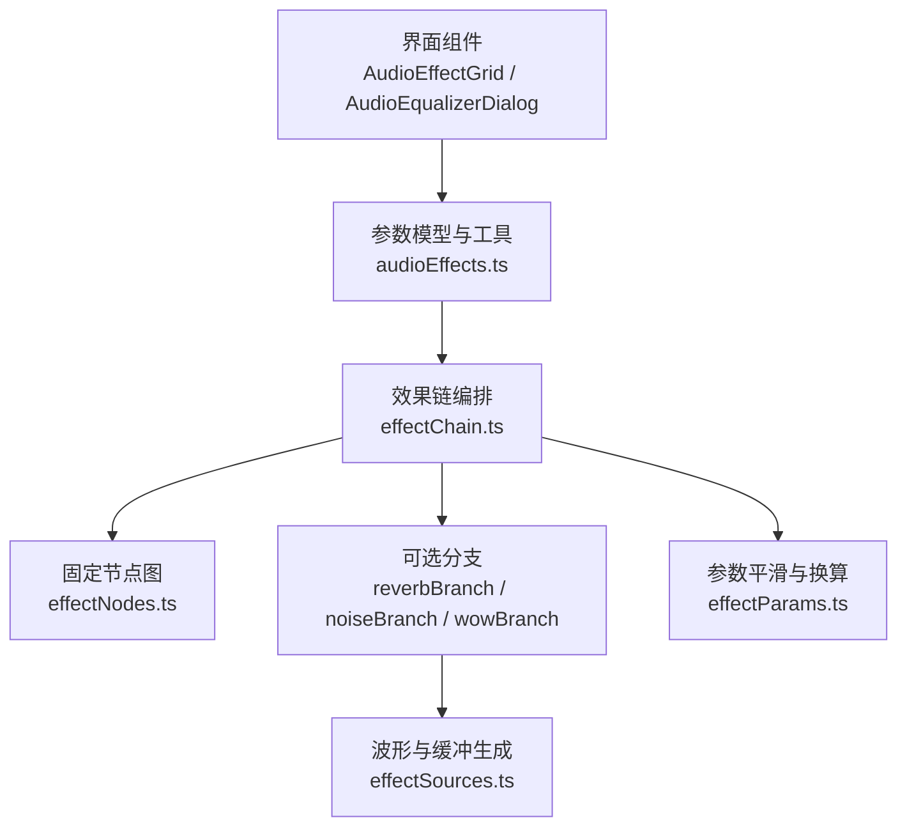
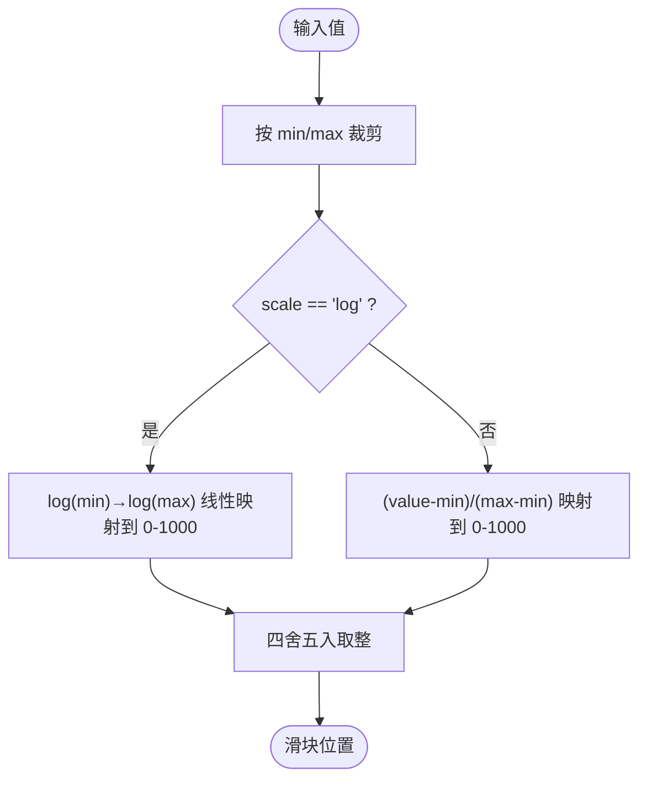
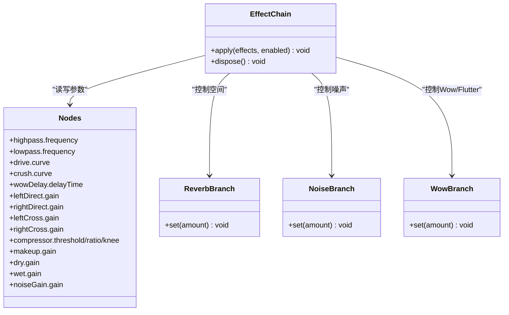
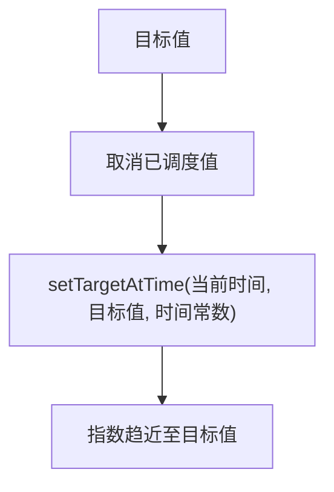
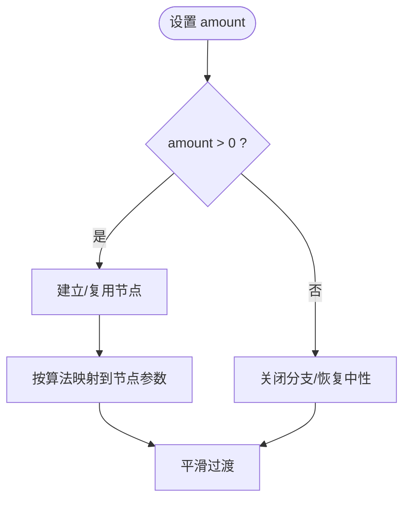
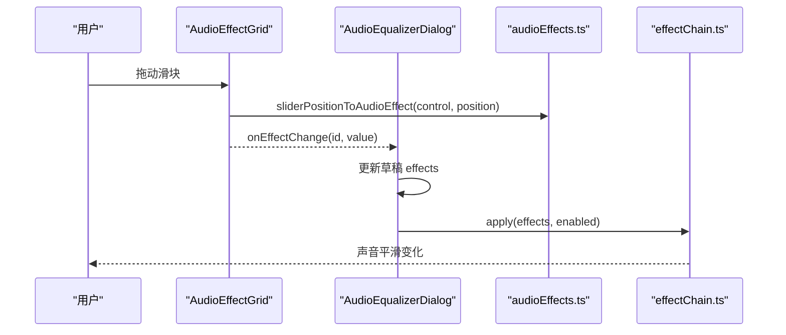
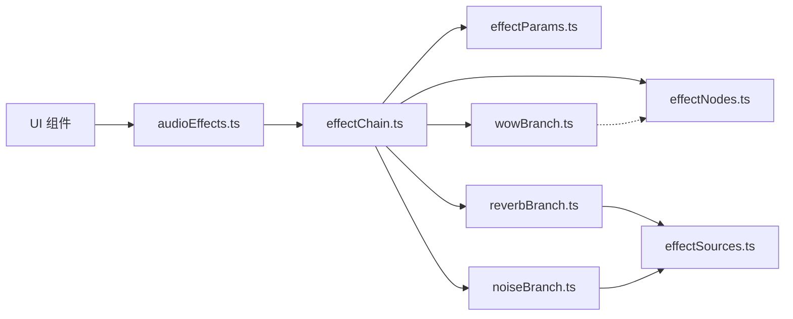

# 效果参数映射系统

<cite>
**本文引用的文件**
- [src/utils/audioEffects.ts](file://src/utils/audioEffects.ts)
- [src/services/audioEffects/effectParams.ts](file://src/services/audioEffects/effectParams.ts)
- [src/services/audioEffects/effectNodes.ts](file://src/services/audioEffects/effectNodes.ts)
- [src/services/audioEffects/effectChain.ts](file://src/services/audioEffects/effectChain.ts)
- [src/services/audioEffects/effectSources.ts](file://src/services/audioEffects/effectSources.ts)
- [src/services/audioEffects/reverbBranch.ts](file://src/services/audioEffects/reverbBranch.ts)
- [src/services/audioEffects/noiseBranch.ts](file://src/services/audioEffects/noiseBranch.ts)
- [src/services/audioEffects/wowBranch.ts](file://src/services/audioEffects/wowBranch.ts)
- [src/services/audioEffects/effectBranchRelease.ts](file://src/services/audioEffects/effectBranchRelease.ts)
- [src/components/panelTab/equalizer/AudioEffectGrid.tsx](file://src/components/panelTab/equalizer/AudioEffectGrid.tsx)
- [src/components/panelTab/AudioEqualizerDialog.tsx](file://src/components/panelTab/AudioEqualizerDialog.tsx)
</cite>

## 目录
1. [简介](#简介)
2. [项目结构](#项目结构)
3. [核心组件](#核心组件)
4. [架构总览](#架构总览)
5. [详细组件分析](#详细组件分析)
6. [依赖关系分析](#依赖关系分析)
7. [性能考量](#性能考量)
8. [故障排查指南](#故障排查指南)
9. [结论](#结论)
10. [附录](#附录)

## 简介
本技术文档围绕“效果参数映射系统”展开，聚焦于音频参数的归一化与转换、UI 到音频节点参数的映射、dB 线性转换公式、参数范围限制机制、各效果器的控制逻辑（强度、频率、Q 值等）、以及参数平滑过渡技术。同时提供自定义效果器参数设计的最佳实践，并给出具体代码路径示例，帮助实现正确的参数映射与实时更新。

## 项目结构
该子系统由 UI 层、参数定义与归一化工具、Web Audio 节点构建与连接、效果分支（混响、噪声、Wow/Flutter）以及统一的参数平滑更新工具组成。整体遵循“声明式参数模型 + 运行时映射 + 平滑更新”的分层设计。

图表来源
- [src/components/panelTab/equalizer/AudioEffectGrid.tsx:1-90](file://src/components/panelTab/equalizer/AudioEffectGrid.tsx#L1-L90)
- [src/components/panelTab/AudioEqualizerDialog.tsx:1-220](file://src/components/panelTab/AudioEqualizerDialog.tsx#L1-L220)
- [src/utils/audioEffects.ts:1-122](file://src/utils/audioEffects.ts#L1-L122)
- [src/services/audioEffects/effectChain.ts:1-94](file://src/services/audioEffects/effectChain.ts#L1-L94)
- [src/services/audioEffects/effectNodes.ts:1-126](file://src/services/audioEffects/effectNodes.ts#L1-L126)
- [src/services/audioEffects/effectParams.ts:1-17](file://src/services/audioEffects/effectParams.ts#L1-L17)
- [src/services/audioEffects/reverbBranch.ts:1-49](file://src/services/audioEffects/reverbBranch.ts#L1-L49)
- [src/services/audioEffects/noiseBranch.ts:1-60](file://src/services/audioEffects/noiseBranch.ts#L1-L60)
- [src/services/audioEffects/wowBranch.ts:1-76](file://src/services/audioEffects/wowBranch.ts#L1-L76)
- [src/services/audioEffects/effectSources.ts:1-95](file://src/services/audioEffects/effectSources.ts#L1-L95)

章节来源
- [src/utils/audioEffects.ts:1-122](file://src/utils/audioEffects.ts#L1-L122)
- [src/services/audioEffects/effectChain.ts:1-94](file://src/services/audioEffects/effectChain.ts#L1-L94)
- [src/services/audioEffects/effectNodes.ts:1-126](file://src/services/audioEffects/effectNodes.ts#L1-L126)
- [src/services/audioEffects/effectParams.ts:1-17](file://src/services/audioEffects/effectParams.ts#L1-L17)
- [src/components/panelTab/equalizer/AudioEffectGrid.tsx:1-90](file://src/components/panelTab/equalizer/AudioEffectGrid.tsx#L1-L90)
- [src/components/panelTab/AudioEqualizerDialog.tsx:1-220](file://src/components/panelTab/AudioEqualizerDialog.tsx#L1-L220)

## 核心组件
- 参数模型与工具：定义所有非 EQ 效果的统一参数域、默认值、范围、步进、对数/线性刻度、单位显示与归一化策略。
- 效果链编排：将 UI 参数映射到 Web Audio 节点，按需创建/释放分支，应用参数并保证平滑过渡。
- 固定节点图：预分配高通/低通滤波器、失真、比特压缩、Wow 延迟、立体声宽度、压缩器、干湿路增益等节点，并提供串联/并联连接。
- 可选分支：卷积混响、黑胶噪声、Wow/Flutter 延迟调制，均支持延迟释放以避免资源泄漏。
- 参数平滑与换算：统一的 AudioParam 平滑更新与 dB 线性转换工具。

章节来源
- [src/utils/audioEffects.ts:1-122](file://src/utils/audioEffects.ts#L1-L122)
- [src/services/audioEffects/effectChain.ts:1-94](file://src/services/audioEffects/effectChain.ts#L1-L94)
- [src/services/audioEffects/effectNodes.ts:1-126](file://src/services/audioEffects/effectNodes.ts#L1-L126)
- [src/services/audioEffects/effectParams.ts:1-17](file://src/services/audioEffects/effectParams.ts#L1-L17)

## 架构总览
下图展示了从用户交互到音频节点更新的完整数据流与控制流。

```mermaid
sequenceDiagram
participant U as "用户"
participant UI as "界面组件"
participant M as "参数模型/工具"
participant C as "效果链"
participant N as "固定节点图"
participant B as "可选分支"
participant P as "参数平滑工具"
U->>UI : 拖动滑块/选择预设
UI->>M : 读取控制元数据<br/>位置↔数值转换
UI-->>C : onEffectChange(id, value)
C->>M : normalizeAudioEffects()
C->>N : 设置高频/低频截止、宽度、压缩器等
C->>B : set(amount)
C->>P : rampParam(context, param, value, ramp)
B->>P : rampParam(...)
N-->>U : 声音变化无突变/咔哒声
```

图表来源
- [src/components/panelTab/equalizer/AudioEffectGrid.tsx:1-90](file://src/components/panelTab/equalizer/AudioEffectGrid.tsx#L1-L90)
- [src/utils/audioEffects.ts:1-122](file://src/utils/audioEffects.ts#L1-L122)
- [src/services/audioEffects/effectChain.ts:1-94](file://src/services/audioEffects/effectChain.ts#L1-L94)
- [src/services/audioEffects/effectParams.ts:1-17](file://src/services/audioEffects/effectParams.ts#L1-L17)
- [src/services/audioEffects/reverbBranch.ts:1-49](file://src/services/audioEffects/reverbBranch.ts#L1-L49)
- [src/services/audioEffects/noiseBranch.ts:1-60](file://src/services/audioEffects/noiseBranch.ts#L1-L60)
- [src/services/audioEffects/wowBranch.ts:1-76](file://src/services/audioEffects/wowBranch.ts#L1-L76)

## 详细组件分析

### 参数模型与归一化（UI ↔ 数值）
- 控制元数据：每个效果包含 id、min/max/step/neutral/scale/unit/addsNoise 等字段，用于统一约束与显示。
- 归一化策略：normalizeAudioEffects 将外部传入的值按控制元数据进行裁剪与填充缺失项，确保始终为有效集合。
- 滑块映射：
  - 对数刻度：使用 log(min) 到 log(max) 的线性比例映射到 0-1000 区间，保证低频段可精细调节。
  - 线性刻度：直接按比例映射到 0-1000 区间，并在反向转换时按 step 对齐。
- 显示格式化：Hz 与百分比两种单位，自动在 1kHz 以上切换 kHz 显示。

图表来源
- [src/utils/audioEffects.ts:41-122](file://src/utils/audioEffects.ts#L41-L122)

章节来源
- [src/utils/audioEffects.ts:1-122](file://src/utils/audioEffects.ts#L1-L122)

### 效果链编排与参数映射
- 初始化：createAudioEffectChain 创建固定节点图并连接；按需创建混响、噪声、Wow 分支。
- 参数映射：
  - 高通/低通：frequency 直接映射，低通上限受采样率限制。
  - 失真/比特压缩：仅在值变化时重建曲线，避免重复计算。
  - Wow/噪声/空间：通过分支 set(amount) 控制。
  - 立体声宽度：左右直通路和交叉路增益按 width 对称分配。
  - Punch（动态冲击）：映射到压缩器 threshold/ratio/knee，并通过 makeup 增益补偿峰值下降。
- 禁用处理：当效果链禁用时回退到中性设置，避免意外音色。

图表来源
- [src/services/audioEffects/effectChain.ts:17-94](file://src/services/audioEffects/effectChain.ts#L17-L94)
- [src/services/audioEffects/effectNodes.ts:4-23](file://src/services/audioEffects/effectNodes.ts#L4-L23)
- [src/services/audioEffects/reverbBranch.ts:1-49](file://src/services/audioEffects/reverbBranch.ts#L1-L49)
- [src/services/audioEffects/noiseBranch.ts:1-60](file://src/services/audioEffects/noiseBranch.ts#L1-L60)
- [src/services/audioEffects/wowBranch.ts:1-76](file://src/services/audioEffects/wowBranch.ts#L1-L76)

章节来源
- [src/services/audioEffects/effectChain.ts:1-94](file://src/services/audioEffects/effectChain.ts#L1-L94)
- [src/services/audioEffects/effectNodes.ts:1-126](file://src/services/audioEffects/effectNodes.ts#L1-L126)

### 参数平滑过渡与 dB 线性转换
- 平滑过渡：rampParam 使用 cancelScheduledValues + setTargetAtTime，以固定时间常数进行指数趋近，避免阶跃导致的咔哒声。
- dB 线性转换：dbToLinear 将分贝转换为线性增益，用于压缩器补偿等场景。
- 分支内平滑：各分支在启用/禁用时分别对 wet/dry/noiseGain/delayTime 等参数执行平滑过渡。

图表来源
- [src/services/audioEffects/effectParams.ts:1-17](file://src/services/audioEffects/effectParams.ts#L1-L17)
- [src/services/audioEffects/reverbBranch.ts:22-41](file://src/services/audioEffects/reverbBranch.ts#L22-L41)
- [src/services/audioEffects/noiseBranch.ts:30-52](file://src/services/audioEffects/noiseBranch.ts#L30-L52)
- [src/services/audioEffects/wowBranch.ts:46-69](file://src/services/audioEffects/wowBranch.ts#L46-L69)

章节来源
- [src/services/audioEffects/effectParams.ts:1-17](file://src/services/audioEffects/effectParams.ts#L1-L17)
- [src/services/audioEffects/reverbBranch.ts:1-49](file://src/services/audioEffects/reverbBranch.ts#L1-L49)
- [src/services/audioEffects/noiseBranch.ts:1-60](file://src/services/audioEffects/noiseBranch.ts#L1-L60)
- [src/services/audioEffects/wowBranch.ts:1-76](file://src/services/audioEffects/wowBranch.ts#L1-L76)

### 各效果器控制逻辑与数字化处理
- 高通/低通：频率范围与对数刻度，低通上限受采样率限制，防止超奈奎斯特频率。
- 失真（Drive）：tanh 软削波曲线，幅度匹配避免整体音量提升；仅当 amount > 0 时生效。
- 比特压缩（Crush）：阶梯量化曲线，bit 深度随 amount 平方根映射，使听觉敏感区居中。
- Wow/Flutter：双 LFO（慢速 wow + 快速 flutter）调制 delayTime，amount 控制深度。
- 噪声（Noise）：循环噪声缓冲经带通滤波后混入输出，amount 非线性映射增强听感。
- 宽度（Width）：左右直路与交叉路增益对称分配，保持总能量稳定。
- 空间（Space）：卷积混响 wet/dry 联动，启用时建立 ConvolverNode，关闭后延迟释放。
- 冲击（Punch）：映射到压缩器阈值、比率、膝点，并用 makeup 增益补偿峰值下降。

图表来源
- [src/services/audioEffects/effectSources.ts:24-58](file://src/services/audioEffects/effectSources.ts#L24-L58)
- [src/services/audioEffects/wowBranch.ts:9-76](file://src/services/audioEffects/wowBranch.ts#L9-L76)
- [src/services/audioEffects/noiseBranch.ts:10-60](file://src/services/audioEffects/noiseBranch.ts#L10-L60)
- [src/services/audioEffects/reverbBranch.ts:10-49](file://src/services/audioEffects/reverbBranch.ts#L10-L49)
- [src/services/audioEffects/effectChain.ts:48-80](file://src/services/audioEffects/effectChain.ts#L48-L80)

章节来源
- [src/services/audioEffects/effectSources.ts:1-95](file://src/services/audioEffects/effectSources.ts#L1-L95)
- [src/services/audioEffects/effectChain.ts:1-94](file://src/services/audioEffects/effectChain.ts#L1-L94)

### 界面交互与实时更新
- 滑块控件：使用 0-1000 整数步进的 range input，通过 audioEffectToSliderPosition/sliderPositionToAudioEffect 双向转换。
- 事件处理：onInput/onChange 实时回调 onEffectChange，onPointerUp/onKeyUp/onBlur 触发 onCommit 提交。
- 状态管理：对话框维护草稿状态，写入自定义槽位或覆盖内置预设；重置仅清空自定义槽位。

图表来源
- [src/components/panelTab/equalizer/AudioEffectGrid.tsx:1-90](file://src/components/panelTab/equalizer/AudioEffectGrid.tsx#L1-L90)
- [src/components/panelTab/AudioEqualizerDialog.tsx:73-114](file://src/components/panelTab/AudioEqualizerDialog.tsx#L73-L114)
- [src/utils/audioEffects.ts:92-113](file://src/utils/audioEffects.ts#L92-L113)
- [src/services/audioEffects/effectChain.ts:31-82](file://src/services/audioEffects/effectChain.ts#L31-L82)

章节来源
- [src/components/panelTab/equalizer/AudioEffectGrid.tsx:1-90](file://src/components/panelTab/equalizer/AudioEffectGrid.tsx#L1-L90)
- [src/components/panelTab/AudioEqualizerDialog.tsx:1-220](file://src/components/panelTab/AudioEqualizerDialog.tsx#L1-L220)
- [src/utils/audioEffects.ts:1-122](file://src/utils/audioEffects.ts#L1-L122)
- [src/services/audioEffects/effectChain.ts:1-94](file://src/services/audioEffects/effectChain.ts#L1-L94)

## 依赖关系分析
- 模块耦合：
  - UI 层仅依赖参数模型与工具，不直接操作音频节点，解耦良好。
  - effectChain 组合 effectNodes、effectParams 与各分支，形成单一编排入口。
  - 各分支独立封装资源生命周期，通过 effectBranchRelease 统一延迟释放。
- 外部依赖：Web Audio API（AudioContext、BiquadFilterNode、WaveShaperNode、DelayNode、DynamicsCompressorNode、ConvolverNode 等）。
- 循环依赖：未发现循环导入；模块职责清晰。

图表来源
- [src/components/panelTab/equalizer/AudioEffectGrid.tsx:1-90](file://src/components/panelTab/equalizer/AudioEffectGrid.tsx#L1-L90)
- [src/utils/audioEffects.ts:1-122](file://src/utils/audioEffects.ts#L1-L122)
- [src/services/audioEffects/effectChain.ts:1-94](file://src/services/audioEffects/effectChain.ts#L1-L94)
- [src/services/audioEffects/effectNodes.ts:1-126](file://src/services/audioEffects/effectNodes.ts#L1-L126)
- [src/services/audioEffects/effectParams.ts:1-17](file://src/services/audioEffects/effectParams.ts#L1-L17)
- [src/services/audioEffects/reverbBranch.ts:1-49](file://src/services/audioEffects/reverbBranch.ts#L1-L49)
- [src/services/audioEffects/noiseBranch.ts:1-60](file://src/services/audioEffects/noiseBranch.ts#L1-L60)
- [src/services/audioEffects/wowBranch.ts:1-76](file://src/services/audioEffects/wowBranch.ts#L1-L76)
- [src/services/audioEffects/effectSources.ts:1-95](file://src/services/audioEffects/effectSources.ts#L1-L95)

章节来源
- [src/services/audioEffects/effectChain.ts:1-94](file://src/services/audioEffects/effectChain.ts#L1-L94)
- [src/services/audioEffects/effectNodes.ts:1-126](file://src/services/audioEffects/effectNodes.ts#L1-L126)
- [src/services/audioEffects/effectParams.ts:1-17](file://src/services/audioEffects/effectParams.ts#L1-L17)
- [src/services/audioEffects/reverbBranch.ts:1-49](file://src/services/audioEffects/reverbBranch.ts#L1-L49)
- [src/services/audioEffects/noiseBranch.ts:1-60](file://src/services/audioEffects/noiseBranch.ts#L1-L60)
- [src/services/audioEffects/wowBranch.ts:1-76](file://src/services/audioEffects/wowBranch.ts#L1-L76)
- [src/services/audioEffects/effectSources.ts:1-95](file://src/services/audioEffects/effectSources.ts#L1-L95)

## 性能考量
- 曲线缓存：失真与比特压缩曲线仅在参数变化时重建，减少每帧开销。
- 分支懒加载：混响、噪声、Wow 分支在首次启用时创建节点，关闭后延迟释放，避免频繁创建销毁。
- 平滑过渡：统一使用指数趋近，避免参数阶跃带来的 CPU 尖峰与可闻伪影。
- 采样率保护：低通截止上限受采样率限制，防止无效计算与潜在失真。

[本节为通用指导，无需特定文件引用]

## 故障排查指南
- 出现咔哒声或爆音：
  - 检查是否使用了 rampParam 进行参数更新，避免直接赋值导致阶跃。
  - 确认低通截止未超过采样率限制。
- 资源泄漏：
  - 确认分支 dispose 被调用，或延迟释放定时器正常触发。
- 数值异常：
  - 使用 normalizeAudioEffects 确保所有参数在合法范围内，缺失项回填中性值。
- 显示不一致：
  - 确认滑块位置与数值转换使用同一套 scale（log/linear）与 step 对齐。

章节来源
- [src/services/audioEffects/effectParams.ts:1-17](file://src/services/audioEffects/effectParams.ts#L1-L17)
- [src/services/audioEffects/effectBranchRelease.ts:1-29](file://src/services/audioEffects/effectBranchRelease.ts#L1-L29)
- [src/utils/audioEffects.ts:71-80](file://src/utils/audioEffects.ts#L71-L80)
- [src/services/audioEffects/effectChain.ts:48-80](file://src/services/audioEffects/effectChain.ts#L48-L80)

## 结论
该效果参数映射系统通过清晰的参数模型、严格的归一化与范围限制、以及对数/线性刻度映射、统一的平滑过渡工具，实现了从 UI 到 Web Audio 节点的可靠、可预测且无伪影的参数控制。各效果器分支模块化封装，便于扩展与维护。遵循本文的最佳实践与代码路径示例，可高效实现自定义效果器的参数设计与实时更新。

## 附录
- 关键代码路径示例（用于参考实现）：
  - 参数归一化与范围限制：[src/utils/audioEffects.ts:71-80](file://src/utils/audioEffects.ts#L71-L80)
  - 滑块位置与数值双向映射：[src/utils/audioEffects.ts:92-113](file://src/utils/audioEffects.ts#L92-L113)
  - 参数平滑更新与 dB 线性转换：[src/services/audioEffects/effectParams.ts:1-17](file://src/services/audioEffects/effectParams.ts#L1-L17)
  - 效果链参数映射与分支控制：[src/services/audioEffects/effectChain.ts:48-80](file://src/services/audioEffects/effectChain.ts#L48-L80)
  - 固定节点图与连接：[src/services/audioEffects/effectNodes.ts:28-116](file://src/services/audioEffects/effectNodes.ts#L28-L116)
  - 混响分支启用/禁用与延迟释放：[src/services/audioEffects/reverbBranch.ts:22-41](file://src/services/audioEffects/reverbBranch.ts#L22-L41)
  - 噪声分支启用/禁用与延迟释放：[src/services/audioEffects/noiseBranch.ts:30-52](file://src/services/audioEffects/noiseBranch.ts#L30-L52)
  - Wow/Flutter 分支延迟调制与释放：[src/services/audioEffects/wowBranch.ts:46-69](file://src/services/audioEffects/wowBranch.ts#L46-L69)
  - 界面滑块事件与提交：[src/components/panelTab/equalizer/AudioEffectGrid.tsx:65-78](file://src/components/panelTab/equalizer/AudioEffectGrid.tsx#L65-L78)
  - 对话框草稿管理与预设应用：[src/components/panelTab/AudioEqualizerDialog.tsx:73-114](file://src/components/panelTab/AudioEqualizerDialog.tsx#L73-L114)