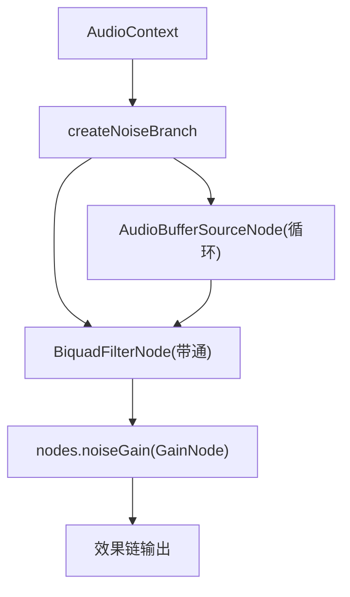
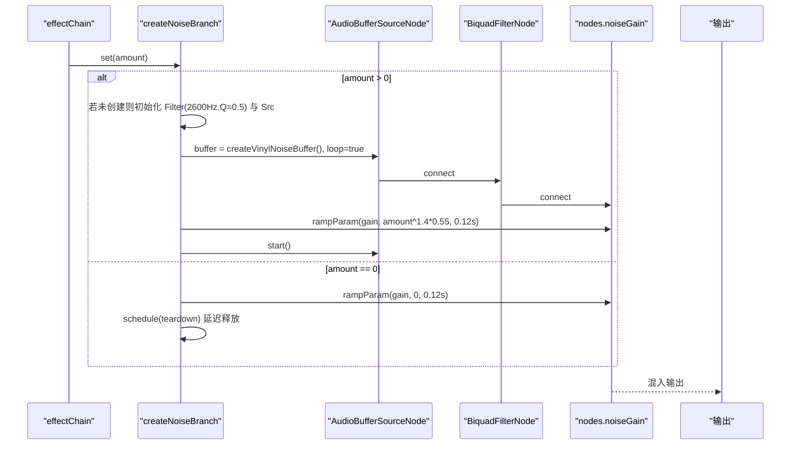
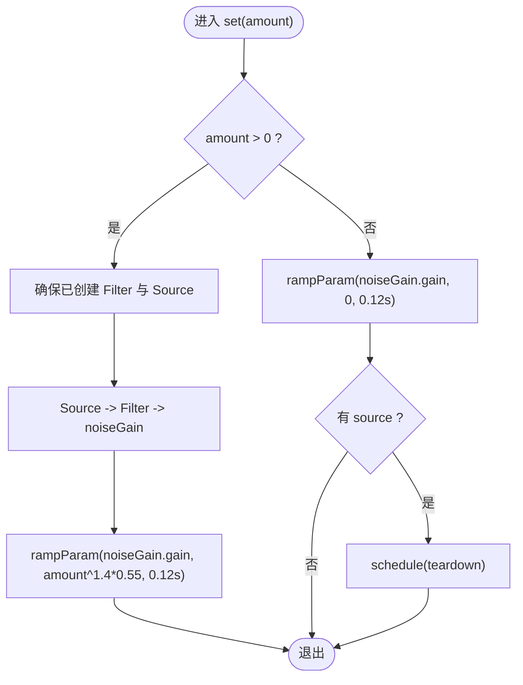
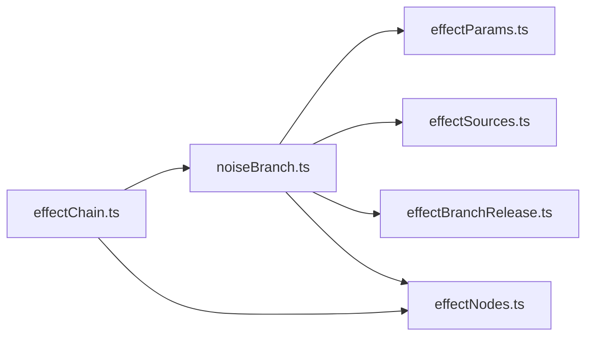

# 噪声效果分支

<cite>
**本文引用的文件**
- [noiseBranch.ts](file://src/services/audioEffects/noiseBranch.ts)
- [effectSources.ts](file://src/services/audioEffects/effectSources.ts)
- [effectParams.ts](file://src/services/audioEffects/effectParams.ts)
- [effectBranchRelease.ts](file://src/services/audioEffects/effectBranchRelease.ts)
- [effectNodes.ts](file://src/services/audioEffects/effectNodes.ts)
- [effectChain.ts](file://src/services/audioEffects/effectChain.ts)
</cite>

## 目录
1. [简介](#简介)
2. [项目结构](#项目结构)
3. [核心组件](#核心组件)
4. [架构总览](#架构总览)
5. [详细组件分析](#详细组件分析)
6. [依赖关系分析](#依赖关系分析)
7. [性能考量](#性能考量)
8. [故障排查指南](#故障排查指南)
9. [结论](#结论)
10. [附录：集成示例与参数调优](#附录集成示例与参数调优)

## 简介
本技术文档聚焦于“噪声效果分支”的实现，深入解析 createNoiseBranch 的工作原理，包括黑胶唱片噪声的生成、带通滤波塑造音色、缓冲区的创建与循环播放、噪声增益的动态控制算法，以及 AudioBufferSourceNode 与 BiquadFilterNode 的生命周期管理策略。同时说明该分支如何接入整体音频效果链，并给出在效果链中集成的完整流程与参数调节对音色的影响说明。

## 项目结构
噪声效果分支位于音频效果服务模块中，围绕以下文件协作完成：
- noiseBranch.ts：实现 createNoiseBranch，负责噪声源、滤波器与增益控制、释放逻辑。
- effectSources.ts：提供 createVinylNoiseBuffer，生成黑胶噪声缓冲区（包含底噪与稀疏噼啪声）。
- effectParams.ts：提供 rampParam，用于平滑过渡 AudioParam，避免突变。
- effectBranchRelease.ts：提供 createReleaseTimer，延迟释放资源以避免频繁启停。
- effectNodes.ts：定义并连接全局效果节点图，包含 noiseGain 输出节点。
- effectChain.ts：将噪声分支接入效果链，统一调度各分支 set 调用。

图表来源
- [noiseBranch.ts:10-59](file://src/services/audioEffects/noiseBranch.ts#L10-L59)
- [effectNodes.ts:90-116](file://src/services/audioEffects/effectNodes.ts#L90-L116)

章节来源
- [noiseBranch.ts:1-60](file://src/services/audioEffects/noiseBranch.ts#L1-L60)
- [effectSources.ts:60-78](file://src/services/audioEffects/effectSources.ts#L60-L78)
- [effectParams.ts:1-17](file://src/services/audioEffects/effectParams.ts#L1-L17)
- [effectBranchRelease.ts:1-29](file://src/services/audioEffects/effectBranchRelease.ts#L1-L29)
- [effectNodes.ts:1-126](file://src/services/audioEffects/effectNodes.ts#L1-L126)
- [effectChain.ts:31-94](file://src/services/audioEffects/effectChain.ts#L31-L94)

## 核心组件
- createNoiseBranch(context, nodes)：创建并返回一个可开关的噪声分支对象，具备 set(amount) 与 dispose() 接口。
- createVinylNoiseBuffer(context)：生成约3秒长的立体声噪声缓冲，混合持续底噪与稀疏衰减的噼啪声。
- rampParam(context, param, value, ramp)：以指数曲线平滑过渡参数，避免音量突变。
- createReleaseTimer()：提供延迟释放能力，避免在短时间重复启用/禁用时反复创建/销毁节点。
- effectNodes：维护全局效果节点图，其中 noiseGain 作为噪声分支的输出混入点。

章节来源
- [noiseBranch.ts:10-59](file://src/services/audioEffects/noiseBranch.ts#L10-L59)
- [effectSources.ts:60-78](file://src/services/audioEffects/effectSources.ts#L60-L78)
- [effectParams.ts:6-14](file://src/services/audioEffects/effectParams.ts#L6-L14)
- [effectBranchRelease.ts:9-28](file://src/services/audioEffects/effectBranchRelease.ts#L9-L28)
- [effectNodes.ts:4-23](file://src/services/audioEffects/effectNodes.ts#L4-L23)

## 架构总览
噪声分支通过以下数据流与处理逻辑参与整体音频效果链：
- 噪声源：AudioBufferSourceNode 循环播放由 createVinylNoiseBuffer 生成的黑胶噪声缓冲。
- 音色塑造：BiquadFilterNode 设置为 bandpass，中心频率 2600Hz，Q=0.5，使噪声更贴近音乐频段，避免“浮在顶部”。
- 动态增益：通过 nodes.noiseGain.gain 使用 amount ** 1.4 * 0.55 计算目标值，并以 rampParam 平滑过渡。
- 生命周期：首次启用时创建 source 与 filter；关闭时先淡出到 0，再延迟释放，避免抖动。
- 集成点：effectChain 在 apply 中统一调用 noise.set(active.noise)，并将 noiseGain 连接到最终输出。

图表来源
- [effectChain.ts:48-65](file://src/services/audioEffects/effectChain.ts#L48-L65)
- [noiseBranch.ts:30-53](file://src/services/audioEffects/noiseBranch.ts#L30-L53)
- [effectNodes.ts:90-116](file://src/services/audioEffects/effectNodes.ts#L90-L116)

## 详细组件分析

### createNoiseBranch 实现原理
- 状态变量：source、filter 引用当前实例的节点；release 为延迟释放计时器。
- teardown：安全停止并断开 source 与 filter，防止内存泄漏。
- set(amount)：
  - 当 amount > 0：取消释放计划；若尚未创建 source/filter，则创建带通滤波器（2600Hz，Q=0.5）与 BufferSource（循环播放黑胶噪声），连接至 nodes.noiseGain，启动 source；随后用 rampParam 将 noiseGain.gain 平滑过渡到 amount ** 1.4 * 0.55。
  - 当 amount == 0：将 noiseGain.gain 平滑过渡到 0；若存在 source，则安排延迟释放 teardown。
- dispose：取消释放计划并执行 teardown。

图表来源
- [noiseBranch.ts:30-53](file://src/services/audioEffects/noiseBranch.ts#L30-L53)

章节来源
- [noiseBranch.ts:10-59](file://src/services/audioEffects/noiseBranch.ts#L10-L59)

### 黑胶噪声缓冲区的创建与循环播放机制
- 长度：约 context.sampleRate * 3 秒，保证足够长的随机性且避免明显周期性。
- 内容：每帧叠加两部分——持续白噪声（幅度较小）与稀疏噼啪声（随机触发并以系数衰减），形成类似黑胶的底噪与偶发噼啪声。
- 循环：AudioBufferSourceNode.loop = true，使噪声连续播放，无需重复创建或调度。

章节来源
- [effectSources.ts:60-78](file://src/services/audioEffects/effectSources.ts#L60-L78)
- [noiseBranch.ts:38-43](file://src/services/audioEffects/noiseBranch.ts#L38-L43)

### 带通滤波器的音色塑造
- 类型：bandpass
- 中心频率：2600Hz
- Q 值：0.5
- 作用：限制噪声频谱集中在中高频段，使其与音乐内容自然融合，而不是像全频白噪声那样“浮在顶部”。较低的 Q 值保持较宽的带宽，避免过于尖锐的共振峰。

章节来源
- [noiseBranch.ts:34-37](file://src/services/audioEffects/noiseBranch.ts#L34-L37)

### 噪声增益的动态控制算法
- 目标值：amount ** 1.4 * 0.55
- 平滑过渡：rampParam 默认 0.12 秒，避免音量突变。
- 设计意图：幂律映射增强非线性响应，配合缩放因子获得自然的听感范围；短斜坡时间保证实时响应的顺滑度。

章节来源
- [noiseBranch.ts:45](file://src/services/audioEffects/noiseBranch.ts#L45)
- [effectParams.ts:6-14](file://src/services/audioEffects/effectParams.ts#L6-L14)

### 资源管理与生命周期
- 首次启用：创建 BiquadFilterNode 与 AudioBufferSourceNode，连接至 nodes.noiseGain，启动循环播放。
- 关闭时：先将 noiseGain.gain 平滑到 0，再通过 createReleaseTimer 延迟释放，避免短时间内再次启用时的重复创建开销。
- 释放操作：stop 并 disconnect source，disconnect filter，置空引用，防止内存泄漏。
- 错误防护：stop 可能因上下文已关闭而抛出异常，进行 try/catch 保护。

章节来源
- [noiseBranch.ts:15-27](file://src/services/audioEffects/noiseBranch.ts#L15-L27)
- [noiseBranch.ts:49-52](file://src/services/audioEffects/noiseBranch.ts#L49-L52)
- [effectBranchRelease.ts:9-28](file://src/services/audioEffects/effectBranchRelease.ts#L9-L28)

### 在效果链中的集成
- effectChain 在 apply 中根据设置调用 noise.set(active.noise)，统一管理所有可选分支。
- nodes.noiseGain 始终存在于效果节点图中，并连接到最终输出，使得噪声分支可随时混入。

章节来源
- [effectChain.ts:48-65](file://src/services/audioEffects/effectChain.ts#L48-L65)
- [effectNodes.ts:90-116](file://src/services/audioEffects/effectNodes.ts#L90-L116)

## 依赖关系分析
- noiseBranch 依赖：
  - effectParams.rampParam：平滑参数变化。
  - effectSources.createVinylNoiseBuffer：生成噪声缓冲。
  - effectBranchRelease.createReleaseTimer：延迟释放。
  - effectNodes.AudioEffectNodes：提供 noiseGain 等节点。
- effectChain 依赖：
  - 创建并连接 effectNodes。
  - 创建并调度 reverb、noise、wow 分支。
  - 将 active.noise 映射到 noise.set。

图表来源
- [noiseBranch.ts:1-4](file://src/services/audioEffects/noiseBranch.ts#L1-L4)
- [effectChain.ts:1-11](file://src/services/audioEffects/effectChain.ts#L1-L11)

章节来源
- [noiseBranch.ts:1-4](file://src/services/audioEffects/noiseBranch.ts#L1-L4)
- [effectChain.ts:1-11](file://src/services/audioEffects/effectChain.ts#L1-L11)

## 性能考量
- 噪声缓冲长度约为 3 秒，兼顾随机性与内存占用；循环播放避免重复生成。
- 带通滤波器为轻量级 IIR 滤波器，CPU 开销低。
- 使用 rampParam 的短时斜坡（0.12s）减少 CPU 峰值与听感突变。
- 延迟释放（800ms）降低频繁开关导致的节点创建/销毁开销。
- 建议：
  - 在高负载设备上，可适当增加 ramp 时间或延长释放延迟以减少抖动。
  - 若需更低 CPU，可减少噪声缓冲长度或降低采样率（但会影响音质）。

[本节为通用指导，不直接分析具体文件]

## 故障排查指南
- 噪声无声：
  - 检查 amount 是否大于 0；确认 nodes.noiseGain.gain 是否被正确 ramp。
  - 确认 source 是否成功 start，filter 是否正确连接至 noiseGain。
- 噪声突兀或爆音：
  - 检查 rampParam 的 ramp 时间是否过短；适当增大平滑时间。
  - 检查 amount 映射公式是否合理；必要时调整缩放系数。
- 内存泄漏：
  - 确认 dispose 与 teardown 被执行；检查 release 定时器是否被 cancel。
  - 确认 stop 与 disconnect 均被调用。
- 上下文关闭异常：
  - stop 可能抛出异常，已在 teardown 中 try/catch 保护；如仍出现，检查外部上下文生命周期。

章节来源
- [noiseBranch.ts:15-27](file://src/services/audioEffects/noiseBranch.ts#L15-L27)
- [noiseBranch.ts:49-52](file://src/services/audioEffects/noiseBranch.ts#L49-L52)
- [effectParams.ts:6-14](file://src/services/audioEffects/effectParams.ts#L6-L14)

## 结论
createNoiseBranch 通过生成黑胶噪声缓冲、带通滤波塑造音色、动态增益控制与延迟释放策略，实现了自然融入音乐的噪声效果。其设计简洁高效，与整体效果链紧密集成，能够在不同设备与场景下稳定工作。通过合理调节 amount 与相关参数，可获得从轻微底噪到明显黑胶质感的多层次音色。

[本节为总结性内容，不直接分析具体文件]

## 附录：集成示例与参数调优

### 在效果链中集成噪声效果的步骤
- 创建效果节点图：调用 createAudioEffectNodes 并 connectAudioEffectNodes，确保 nodes.noiseGain 已连接到输出。
- 创建噪声分支：调用 createNoiseBranch(context, nodes)。
- 应用设置：在 effectChain.apply 中调用 noise.set(active.noise)，active.noise 范围为 0~1。
- 释放资源：在 effectChain.dispose 中调用 noise.dispose。

章节来源
- [effectChain.ts:31-94](file://src/services/audioEffects/effectChain.ts#L31-L94)
- [effectNodes.ts:90-116](file://src/services/audioEffects/effectNodes.ts#L90-L116)
- [noiseBranch.ts:30-59](file://src/services/audioEffects/noiseBranch.ts#L30-L59)

### 参数调节对音色的影响
- amount（0~1）：
  - 0：无噪声。
  - 小值（如 0.1~0.3）：轻微底噪，适合温暖氛围。
  - 中值（如 0.4~0.6）：明显的黑胶质感，噼啪声更清晰。
  - 大值（如 0.7~1.0）：强噪声，突出复古风格。
- 带通滤波器：
  - 频率 2600Hz：集中在中高频，避免低频轰鸣与高频刺耳。
  - Q=0.5：较宽带宽，音色自然，不过分强调某一段频率。
- 增益平滑时间（0.12s）：
  - 较短时间带来快速响应，适合实时交互；如需更柔和可增大。
- 释放延迟（800ms）：
  - 避免频繁开关导致的资源抖动；可根据使用模式调整。

章节来源
- [noiseBranch.ts:34-45](file://src/services/audioEffects/noiseBranch.ts#L34-L45)
- [effectParams.ts:6-14](file://src/services/audioEffects/effectParams.ts#L6-L14)
- [effectBranchRelease.ts:9-28](file://src/services/audioEffects/effectBranchRelease.ts#L9-L28)