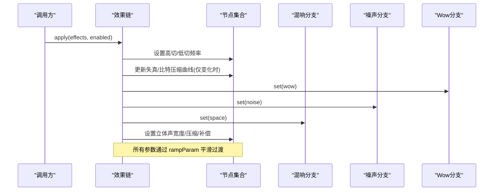
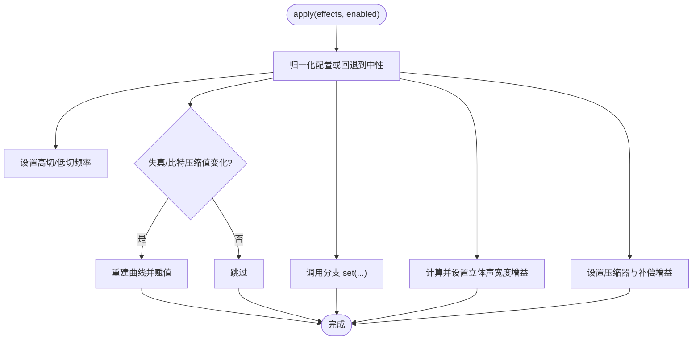
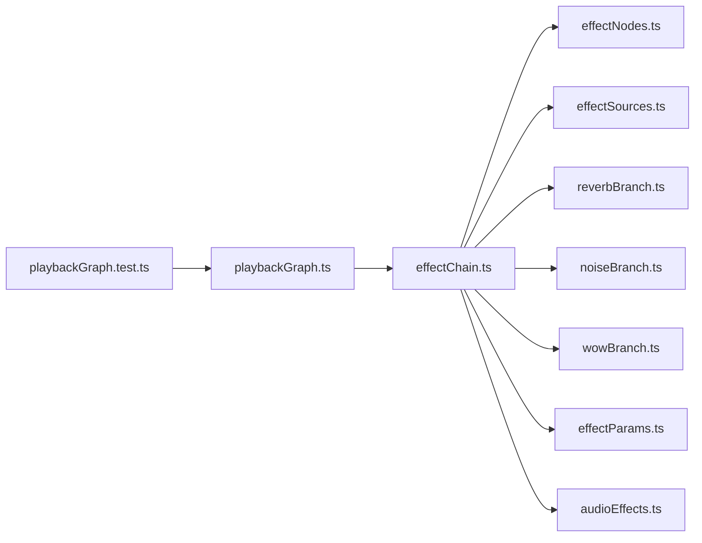

# 效果链管理

<cite>
**本文引用的文件**
- [effectChain.ts](file://src/services/audioEffects/effectChain.ts)
- [effectNodes.ts](file://src/services/audioEffects/effectNodes.ts)
- [effectParams.ts](file://src/services/audioEffects/effectParams.ts)
- [effectSources.ts](file://src/services/audioEffects/effectSources.ts)
- [noiseBranch.ts](file://src/services/audioEffects/noiseBranch.ts)
- [reverbBranch.ts](file://src/services/audioEffects/reverbBranch.ts)
- [wowBranch.ts](file://src/services/audioEffects/wowBranch.ts)
- [effectBranchRelease.ts](file://src/services/audioEffects/effectBranchRelease.ts)
- [audioEffects.ts](file://src/utils/audioEffects.ts)
- [playbackGraph.ts](file://src/services/playbackGraph.ts)
- [playbackGraph.test.ts](file://test/unit/services/playbackGraph.test.ts)
</cite>

## 目录
1. [简介](#简介)
2. [项目结构](#项目结构)
3. [核心组件](#核心组件)
4. [架构总览](#架构总览)
5. [详细组件分析](#详细组件分析)
6. [依赖关系分析](#依赖关系分析)
7. [性能考量](#性能考量)
8. [故障排查指南](#故障排查指南)
9. [结论](#结论)
10. [附录：使用示例与生命周期](#附录使用示例与生命周期)

## 简介
本技术文档围绕音频效果链的管理机制展开，覆盖节点注册、连接与管理、动态构建（运行时添加/移除/重排序）、状态管理（参数同步、保存与恢复）、性能优化（节点复用、批量处理、资源清理）、扩展接口（自定义效果节点集成），以及与音频上下文的关系和线程安全注意事项。该实现基于 Web Audio API，采用“串行主干 + 并行分支”的拓扑，确保在播放路径中低延迟、可预测地应用高切/低切、失真、比特压缩、Wow/Flutter、黑胶噪声、立体声宽度、动态压缩与混响等效果。

## 项目结构
效果链相关代码集中在 services/audioEffects 与 utils/audioEffects，并在 playbackGraph 中接入播放图。关键组织方式如下：
- effectChain.ts：创建并持有效果链实例，提供 apply/dispose 接口，负责将配置映射到各节点。
- effectNodes.ts：分配并串联“常开”节点（滤波器、Waveshaper、延迟、分/合路器、压缩器、干湿混合等）。
- effectParams.ts：统一的 AudioParam 平滑更新工具，避免突变。
- effectSources.ts：生成 Waveshaper 曲线与噪声/脉冲响应缓冲。
- noiseBranch.ts / reverbBranch.ts / wowBranch.ts：可选并行分支，按需启动与释放，遵循统一分支契约。
- effectBranchRelease.ts：分支延迟释放计时器，避免频繁启停。
- audioEffects.ts：效果模型、控件定义、默认值与归一化逻辑。
- playbackGraph.ts：将效果链嵌入播放图，确定音量节点位置与输出顺序。

图表来源
- [playbackGraph.ts:31-98](file://src/services/playbackGraph.ts#L31-L98)

章节来源
- [playbackGraph.ts:31-98](file://src/services/playbackGraph.ts#L31-L98)

## 核心组件
- 效果链实例（AudioEffectChain）
  - 职责：封装 createAudioEffectNodes/connectAudioEffectNodes，创建并管理可选分支（混响、噪声、Wow/Flutter），对外暴露 apply(effects, enabled) 与 dispose()。
  - 关键点：apply 内部对每个参数进行平滑过渡；对非线性阶段（失真/比特压缩）仅在值变化时重建曲线；通过增益矩阵控制立体声宽度；压缩与补偿联动。
- 节点集合（AudioEffectNodes）
  - 职责：集中声明所有“常开”节点及其中性默认值，并提供 connect/disconnect 方法。
  - 关键点：强制双声道输入；分离直通路径与交叉路径以支持立体声宽度；干湿发送用于并行效果返回。
- 参数工具（effectParams）
  - 职责：提供 rampParam/dbToLinear，保证参数无阶跃变化。
- 信号源（effectSources）
  - 职责：生成饱和曲线、比特压缩曲线、黑胶噪声缓冲、卷积混响脉冲响应。
- 可选分支（noise/reverb/wow）
  - 职责：按需创建/销毁资源，按 amount 驱动对应节点；支持延迟释放以避免抖动。
- 效果模型（utils/audioEffects）
  - 职责：统一定义效果 ID、控件范围/步长/单位、默认值、归一化、UI 映射与格式化。

章节来源
- [effectChain.ts:17-93](file://src/services/audioEffects/effectChain.ts#L17-L93)
- [effectNodes.ts:4-126](file://src/services/audioEffects/effectNodes.ts#L4-L126)
- [effectParams.ts:1-17](file://src/services/audioEffects/effectParams.ts#L1-L17)
- [effectSources.ts:1-95](file://src/services/audioEffects/effectSources.ts#L1-L95)
- [noiseBranch.ts:1-60](file://src/services/audioEffects/noiseBranch.ts#L1-L60)
- [reverbBranch.ts:1-49](file://src/services/audioEffects/reverbBranch.ts#L1-L49)
- [wowBranch.ts:1-76](file://src/services/audioEffects/wowBranch.ts#L1-L76)
- [audioEffects.ts:1-122](file://src/utils/audioEffects.ts#L1-L122)

## 架构总览
效果链采用“串行主干 + 并行分支”的拓扑：
- 串行主干：高切 → 低切 → 失真（WaveShaper）→ 比特压缩（WaveShaper）→ Wow/Flutter 延迟调制 → 立体声拆分/合并 → 压缩器 → 补偿增益 → 干/湿发送。
- 并行分支：
  - 混响：从 wetSend 取出信号经 Convolver 后送入 wet。
  - 噪声：独立 BufferSource 循环播放，经带通滤波后注入 noiseGain。
  - Wow/Flutter：两个 LFO 调制 delayTime，模拟磁带/黑胶抖晃。

图表来源
- [effectChain.ts:47-82](file://src/services/audioEffects/effectChain.ts#L47-L82)
- [effectNodes.ts:90-116](file://src/services/audioEffects/effectNodes.ts#L90-L116)
- [effectParams.ts:6-14](file://src/services/audioEffects/effectParams.ts#L6-L14)

章节来源
- [effectChain.ts:47-82](file://src/services/audioEffects/effectChain.ts#L47-L82)
- [effectNodes.ts:90-116](file://src/services/audioEffects/effectNodes.ts#L90-L116)

## 详细组件分析

### 效果链实例（effectChain.ts）
- 创建流程
  - 构造节点集合并连接输入/输出。
  - 初始化三个可选分支（混响、噪声、Wow）。
  - 首次 apply 将传入配置映射到节点。
- 运行时更新
  - 高切/低切：直接 rampParam。
  - 失真/比特压缩：仅在值变化时重建曲线，减少开销。
  - Wow/噪声/空间：调用分支 set(amount)。
  - 立体声宽度：通过左右直通/交叉增益矩阵计算。
  - 动态压缩与补偿：根据 punch 调整阈值/比率/膝点，并以线性增益补偿峰值下降。
- 资源释放
  - 依次 dispose 各分支，断开节点连接。

图表来源
- [effectChain.ts:47-82](file://src/services/audioEffects/effectChain.ts#L47-L82)

章节来源
- [effectChain.ts:17-93](file://src/services/audioEffects/effectChain.ts#L17-L93)

### 节点集合与连接（effectNodes.ts）
- 节点清单
  - 滤波器：highpass、lowpass
  - 音色塑造：drive、crush（WaveShaper）
  - 延迟调制：wowDelay
  - 立体声路由：stereoInput、splitter、merger、left/rightDirect/Cross
  - 动态处理：compressor、makeup
  - 干湿混合：dry、wetSend、wet
  - 噪声注入：noiseGain
- 连接顺序
  - 输入 → highpass → lowpass → drive → crush → wowDelay → stereoInput → splitter → 左右直通/交叉 → merger → compressor → makeup → dry/wetSend → 输出
- 断连策略
  - 先断开输入端，再遍历所有节点 disconnect，容错忽略已销毁上下文。

章节来源
- [effectNodes.ts:4-126](file://src/services/audioEffects/effectNodes.ts#L4-L126)

### 参数平滑与单位转换（effectParams.ts）
- rampParam：取消当前调度值，使用 setTargetAtTime 平滑过渡，避免爆音。
- dbToLinear：将 dB 转换为线性增益。

章节来源
- [effectParams.ts:1-17](file://src/services/audioEffects/effectParams.ts#L1-L17)

### 信号源与缓冲（effectSources.ts）
- 饱和曲线：tanh 形状 + 能量测量补偿，保持响度一致。
- 比特压缩曲线：阶梯量化，位深随滑块变化。
- 黑胶噪声缓冲：持续底噪 + 稀疏噼啪声。
- 混响脉冲响应：指数衰减噪声，供卷积混响使用。

章节来源
- [effectSources.ts:1-95](file://src/services/audioEffects/effectSources.ts#L1-L95)

### 可选分支（noise/reverb/wow）
- 通用契约（AudioEffectBranch）
  - set(amount)：启用/禁用并驱动参数。
  - dispose()：释放资源。
- 延迟释放（createReleaseTimer）
  - 当 amount 回到 0 时不立即销毁，而是延迟一段时间，若再次启用则取消释放，避免频繁启停。
- 噪声分支
  - 首次启用时创建 BufferSource + 带通滤波，注入 noiseGain；关闭时渐隐至 0 并延迟释放。
- 混响分支
  - 首次启用时创建 Convolver 并连接 wetSend → wet；关闭时渐隐干湿并延迟释放。
- Wow 分支
  - 首次启用时创建两个 LFO（低频 wow 与高频 flutter）调制 delayTime；关闭时渐隐深度并延迟释放。

章节来源
- [effectBranchRelease.ts:1-29](file://src/services/audioEffects/effectBranchRelease.ts#L1-L29)
- [noiseBranch.ts:1-60](file://src/services/audioEffects/noiseBranch.ts#L1-L60)
- [reverbBranch.ts:1-49](file://src/services/audioEffects/reverbBranch.ts#L1-L49)
- [wowBranch.ts:1-76](file://src/services/audioEffects/wowBranch.ts#L1-L76)

### 效果模型与归一化（utils/audioEffects.ts）
- 效果 ID 与控件定义：包含范围、步长、中性值、刻度类型（线性/对数）、单位（Hz/ratio）以及是否引入噪声底噪。
- 默认设置：由控件中性值聚合得到。
- 归一化：将任意对象中的值裁剪到合法范围，缺失字段回退到中性值。
- UI 映射：在 0-1000 滑块域与真实值之间双向转换，对数频段使用对数映射。
- 相等性判断：用于比较两套配置是否相同。

章节来源
- [audioEffects.ts:1-122](file://src/utils/audioEffects.ts#L1-L122)

### 与播放图的集成（playbackGraph.ts）
- 构建顺序： decks → mix → equaliser → effects → volume → analyser → destination。
- 音量节点位于效果链之后，确保：
  - 黑胶噪声被音量控制。
  - 比特压缩始终以满量程为基准。
  - 压缩器阈值不受上游音量影响。
- 返回值：暴露 gainNode 与 effectChain，便于外部控制。

章节来源
- [playbackGraph.ts:31-98](file://src/services/playbackGraph.ts#L31-L98)

## 依赖关系分析
- effectChain 依赖：
  - effectNodes：创建与连接常开节点。
  - effectSources：生成曲线与缓冲。
  - 三个分支模块：reverbBranch、noiseBranch、wowBranch。
  - effectParams：参数平滑。
  - utils/audioEffects：配置归一化与默认值。
- playbackGraph 依赖：
  - audioEqualizerGraph：插入均衡器。
  - effectChain：嵌入效果链。
- 测试验证了音量节点相对于噪声源、比特压缩的位置，以及分析器下游位置。

图表来源
- [effectChain.ts:1-12](file://src/services/audioEffects/effectChain.ts#L1-L12)
- [playbackGraph.ts:1-3](file://src/services/playbackGraph.ts#L1-L3)
- [playbackGraph.test.ts:1-5](file://test/unit/services/playbackGraph.test.ts#L1-L5)

章节来源
- [effectChain.ts:1-12](file://src/services/audioEffects/effectChain.ts#L1-L12)
- [playbackGraph.ts:1-3](file://src/services/playbackGraph.ts#L1-L3)
- [playbackGraph.test.ts:1-5](file://test/unit/services/playbackGraph.test.ts#L1-L5)

## 性能考量
- 节点复用
  - 常开节点一次性创建，后续仅更新参数，避免昂贵重建。
  - 可选分支在首次启用时创建，关闭后延迟释放，减少启停抖动。
- 曲线重建优化
  - 失真/比特压缩仅在值变化时重建曲线，降低 CPU 占用。
- 参数平滑
  - 所有 AudioParam 通过 rampParam 平滑过渡，避免瞬态爆音与额外重渲染。
- 批处理
  - 单次 apply 内集中更新多个参数，减少多次调度开销。
- 资源清理
  - dispose 时有序释放分支与断开连接，防止内存泄漏。
- 采样率适配
  - 低切上限限制为 sampleRate * 0.475，避免超奈奎斯特频率。

[本节为通用指导，无需特定文件引用]

## 故障排查指南
- 无声或声音异常
  - 检查 apply 是否被调用且 enabled 为 true。
  - 确认高切/低切未误设为极端值导致信号被滤除。
  - 确认音量节点在效果链之后，否则黑胶噪声可能无法被音量控制。
- 爆音/咔嗒声
  - 确认所有参数更新均通过 rampParam，避免直接赋瞬时值。
  - 检查是否在极短时间内反复启停分支，必要时增大延迟释放时间。
- 资源泄漏
  - 确保在不再使用时调用 effectChain.dispose()。
  - 分支 dispose 会取消定时器并释放振荡器/缓冲源。
- 可视化不一致
  - 分析器应位于音量节点之后，以反映最终输出电平。

章节来源
- [effectChain.ts:86-92](file://src/services/audioEffects/effectChain.ts#L86-L92)
- [effectNodes.ts:118-126](file://src/services/audioEffects/effectNodes.ts#L118-L126)
- [playbackGraph.ts:74-95](file://src/services/playbackGraph.ts#L74-L95)

## 结论
该效果链以“常开主干 + 可选分支”的设计实现了高性能、可扩展的音频效果管线。通过统一的参数平滑、严格的连接顺序与延迟释放策略，既保证了音质与稳定性，又提供了灵活的运行时管理能力。配合 utils/audioEffects 的配置模型，可在 UI、预设与持久化之间无缝切换，满足复杂场景下的效果链管理与生命周期需求。

[本节为总结性内容，无需特定文件引用]

## 附录：使用示例与生命周期
以下示例展示如何创建、配置、更新与销毁效果链，并说明与音频上下文的关系及多线程注意事项。

- 创建与接入播放图
  - 在构建播放图时，将效果链插入均衡器与音量节点之间，并将分析器置于音量节点之后。
  - 参考：[playbackGraph.ts:31-98](file://src/services/playbackGraph.ts#L31-L98)
- 配置与更新
  - 使用 normalizeAudioEffects 将外部配置归一化为完整设置。
  - 调用 effectChain.apply(settings, enabled) 进行运行时更新。
  - 参考：[audioEffects.ts:71-80](file://src/utils/audioEffects.ts#L71-L80)、[effectChain.ts:47-82](file://src/services/audioEffects/effectChain.ts#L47-L82)
- 状态保存与恢复
  - 保存：导出 settings 对象（包含各效果 ID 对应的数值）。
  - 恢复：读取后调用 normalizeAudioEffects 再 apply。
  - 参考：[audioEffects.ts:58-80](file://src/utils/audioEffects.ts#L58-L80)
- 资源清理
  - 在不再需要时调用 effectChain.dispose()，释放分支与节点。
  - 参考：[effectChain.ts:86-92](file://src/services/audioEffects/effectChain.ts#L86-L92)
- 与音频上下文的关系
  - 效果链绑定到创建时的 AudioContext，不可跨上下文复用。
  - 节点与分支的生命周期受上下文控制，dispose 后不应继续使用。
- 多线程环境下的安全考虑
  - Web Audio API 运行于专用音频线程，AudioParam 更新是安全的。
  - JavaScript 主线程仅负责调度参数与创建/销毁节点，应避免在音频回调中执行耗时操作。
  - 分支的延迟释放使用 setTimeout，属于主线程任务，不影响音频线程实时性。

章节来源
- [playbackGraph.ts:31-98](file://src/services/playbackGraph.ts#L31-L98)
- [audioEffects.ts:58-80](file://src/utils/audioEffects.ts#L58-L80)
- [effectChain.ts:47-92](file://src/services/audioEffects/effectChain.ts#L47-L92)