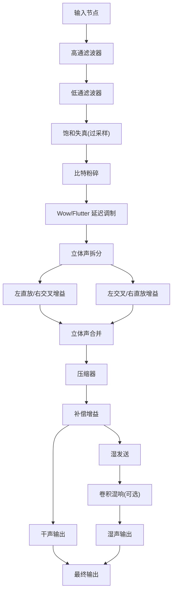
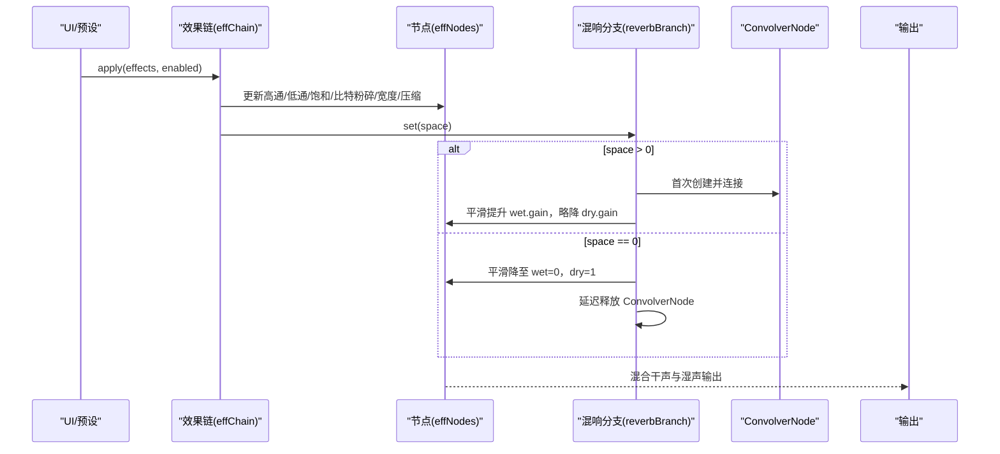
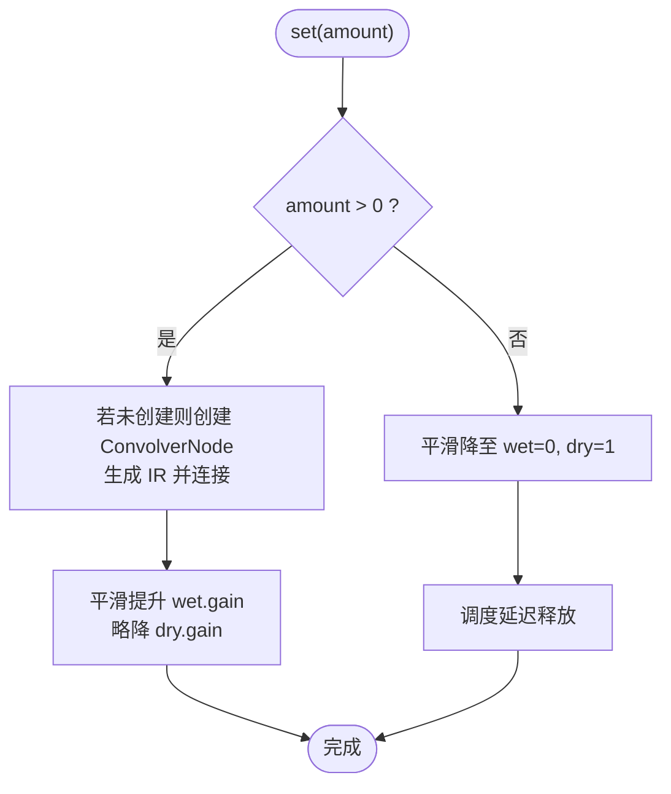
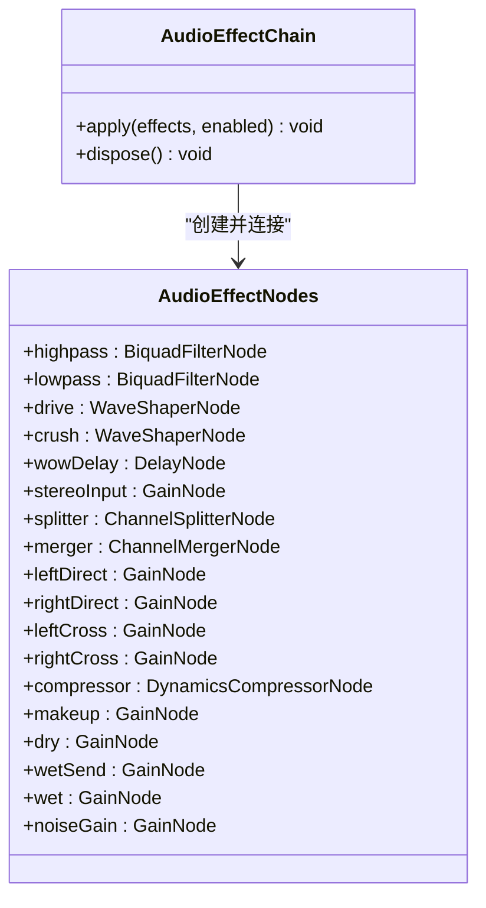
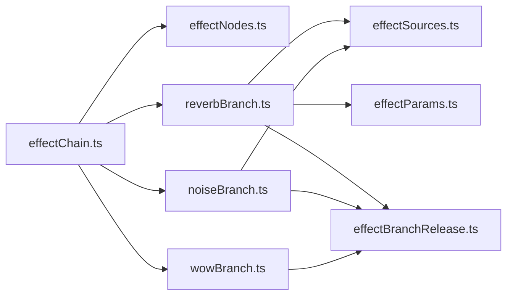

# 混响效果分支

<cite>
**本文引用的文件**
- [reverbBranch.ts](file://src/services/audioEffects/reverbBranch.ts)
- [effectChain.ts](file://src/services/audioEffects/effectChain.ts)
- [effectNodes.ts](file://src/services/audioEffects/effectNodes.ts)
- [effectParams.ts](file://src/services/audioEffects/effectParams.ts)
- [effectSources.ts](file://src/services/audioEffects/effectSources.ts)
- [effectBranchRelease.ts](file://src/services/audioEffects/effectBranchRelease.ts)
- [audioEffects.ts](file://src/utils/audioEffects.ts)
- [audioPresets.ts](file://src/utils/audioPresets.ts)
- [noiseBranch.ts](file://src/services/audioEffects/noiseBranch.ts)
- [wowBranch.ts](file://src/services/audioEffects/wowBranch.ts)
</cite>

## 目录
1. [简介](#简介)
2. [项目结构](#项目结构)
3. [核心组件](#核心组件)
4. [架构总览](#架构总览)
5. [详细组件分析](#详细组件分析)
6. [依赖关系分析](#依赖关系分析)
7. [性能考量](#性能考量)
8. [故障排查指南](#故障排查指南)
9. [结论](#结论)
10. [附录](#附录)

## 简介
本技术文档聚焦于“混响效果分支”的实现与使用，覆盖以下要点：
- 混响实现策略：当前采用并行卷积混响（ConvolverNode），通过一次性生成的脉冲响应（IR）模拟空间感。
- 参数动态调节：通过平滑的 AudioParam 斜坡控制湿/干声比例、立体声宽度、压缩等，确保实时切换无爆音。
- 信号处理链路：从输入到输出的串行与并行路径，包括滤波器、饱和失真、比特粉碎、Wow/Flutter、噪声、立体声扩展、压缩与混响返回。
- 预设与场景：内置多种声音预设（如大厅 Hall、Lo-Fi、人声 Vocal 等），提供不同混响强度与音色风格。
- 性能优化：按需分配与延迟释放 ConvolverNode、BufferSource 与振荡器，避免常驻开销；使用过采样降低高频失真。
- 协同工作：与其他效果（饱和度、比特粉碎、Wow/Flutter、噪声、压缩、立体声宽度）无缝协作。

## 项目结构
音频效果系统位于 src/services/audioEffects 与 src/utils 中，核心文件职责如下：
- effectChain.ts：编排并应用所有效果，维护节点连接与参数更新。
- effectNodes.ts：创建并连接始终在线的基础节点（高通/低通、饱和、比特粉碎、立体声拆分/合并、压缩、干湿声门限）。
- reverbBranch.ts：混响分支，按需创建并释放卷积混响节点。
- noiseBranch.ts：黑胶噪声分支，按需创建并释放噪声源与滤波。
- wowBranch.ts：Wow/Flutter 分支，按需创建并释放 LFO 与延迟调制。
- effectParams.ts：统一的 AudioParam 平滑更新工具。
- effectSources.ts：生成波形整形曲线与混响 IR、噪声缓冲。
- audioEffects.ts / audioPresets.ts：效果模型、控件定义与内置预设。

图示来源
- [effectChain.ts:31-80](file://src/services/audioEffects/effectChain.ts#L31-L80)
- [effectNodes.ts:28-116](file://src/services/audioEffects/effectNodes.ts#L28-L116)

章节来源
- [effectChain.ts:31-80](file://src/services/audioEffects/effectChain.ts#L31-L80)
- [effectNodes.ts:28-116](file://src/services/audioEffects/effectNodes.ts#L28-L116)

## 核心组件
- 效果链控制器（effectChain.ts）
  - 负责将归一化的效果设置映射到各阶段，调用各分支 set(amount) 进行动态调节。
  - 管理立体声宽度、压缩阈值/比率/膝点、补偿增益等关键参数。
- 节点工厂与连接（effectNodes.ts）
  - 创建高通/低通、WaveShaper（带过采样）、Delay、ChannelSplitter/Merger、DynamicsCompressor、Gain 等节点。
  - 建立串行主路径与并行干湿返回路径。
- 混响分支（reverbBranch.ts）
  - 懒加载 ConvolverNode，仅在 space > 0 时创建并连接。
  - 使用 createReverbImpulse 生成指数衰减噪声 IR，normalize 自动电平匹配。
  - 通过 wet/dry gain 的平滑过渡保持总电平稳定。
- 参数平滑（effectParams.ts）
  - rampParam 统一使用 setTargetAtTime 避免阶跃导致的爆音。
- 资源生成（effectSources.ts）
  - 饱和曲线、比特粉碎曲线、黑胶噪声缓冲、混响 IR。
- 分支释放（effectBranchRelease.ts）
  - 延迟释放机制，避免在短时关闭后立刻重新启用时的重复分配。

章节来源
- [effectChain.ts:31-80](file://src/services/audioEffects/effectChain.ts#L31-L80)
- [effectNodes.ts:28-116](file://src/services/audioEffects/effectNodes.ts#L28-L116)
- [reverbBranch.ts:10-48](file://src/services/audioEffects/reverbBranch.ts#L10-L48)
- [effectParams.ts:6-14](file://src/services/audioEffects/effectParams.ts#L6-L14)
- [effectSources.ts:24-94](file://src/services/audioEffects/effectSources.ts#L24-L94)
- [effectBranchRelease.ts:12-27](file://src/services/audioEffects/effectBranchRelease.ts#L12-L27)

## 架构总览
下图展示了从输入到输出的完整信号流，以及混响分支的接入位置与释放时机。

图示来源
- [effectChain.ts:47-80](file://src/services/audioEffects/effectChain.ts#L47-L80)
- [reverbBranch.ts:21-42](file://src/services/audioEffects/reverbBranch.ts#L21-L42)
- [effectNodes.ts:90-116](file://src/services/audioEffects/effectNodes.ts#L90-L116)

## 详细组件分析

### 混响分支（reverbBranch.ts）
- 设计要点
  - 并行卷积混响：通过 Wet Send 进入 ConvolverNode，再汇入 Wet 输出。
  - 惰性分配：仅在 amount > 0 时创建 ConvolverNode 与 IR，减少常驻内存。
  - 平滑过渡：wet.gain 与 dry.gain 同时调整，保持总电平稳定。
  - 延迟释放：当 amount 回到 0 时，延迟一段时间再断开并销毁 ConvolverNode，避免频繁开关带来的抖动。
- 关键流程
  - 首次启用：创建 ConvolverNode，设置 normalize=true，生成 IR 并连接。
  - 动态调节：rampParam 平滑更新 wet/dry 增益。
  - 关闭释放：先淡出 wet，再调度 teardown 释放资源。

图示来源
- [reverbBranch.ts:21-42](file://src/services/audioEffects/reverbBranch.ts#L21-L42)
- [effectBranchRelease.ts:12-27](file://src/services/audioEffects/effectBranchRelease.ts#L12-L27)

章节来源
- [reverbBranch.ts:10-48](file://src/services/audioEffects/reverbBranch.ts#L10-L48)
- [effectBranchRelease.ts:12-27](file://src/services/audioEffects/effectBranchRelease.ts#L12-L27)

### 效果链与节点（effectChain.ts, effectNodes.ts）
- 效果链职责
  - 将归一化后的效果设置应用到各阶段：高通/低通频率、饱和曲线、比特粉碎曲线、Wow/Flutter、噪声、立体声宽度、压缩与补偿增益。
  - 调用各分支 set() 以动态调节效果强度。
- 节点职责
  - 创建并配置基础节点，保证中性状态下的直通路径。
  - 建立串行主路径与并行干湿返回路径，确保可插拔分支（混响、噪声、Wow/Flutter）能安全接入。

图示来源
- [effectChain.ts:17-28](file://src/services/audioEffects/effectChain.ts#L17-L28)
- [effectNodes.ts:4-23](file://src/services/audioEffects/effectNodes.ts#L4-L23)

章节来源
- [effectChain.ts:31-80](file://src/services/audioEffects/effectChain.ts#L31-L80)
- [effectNodes.ts:28-116](file://src/services/audioEffects/effectNodes.ts#L28-L116)

### 参数平滑与资源生成（effectParams.ts, effectSources.ts）
- 参数平滑
  - rampParam 使用 setTargetAtTime 对 AudioParam 进行平滑过渡，避免突变引起的爆音。
- 资源生成
  - 饱和曲线：tanh 形状，配合能量测量进行电平补偿，确保增加谐波不显著增大音量。
  - 比特粉碎曲线：阶梯量化，模拟低比特深度。
  - 黑胶噪声缓冲：持续底噪+稀疏爆裂声，用于噪声分支。
  - 混响 IR：指数衰减噪声，作为卷积混响的脉冲响应。

章节来源
- [effectParams.ts:6-14](file://src/services/audioEffects/effectParams.ts#L6-L14)
- [effectSources.ts:24-94](file://src/services/audioEffects/effectSources.ts#L24-L94)

### 其他分支（noiseBranch.ts, wowBranch.ts）
- 噪声分支
  - 懒加载 BufferSource 与 Bandpass 滤波器，按 amount 调节 noiseGain。
  - 关闭时淡出并延迟释放，避免频繁启停。
- Wow/Flutter 分支
  - 两个 LFO（低频颤音与高频抖动）调制 DelayNode 的 delayTime，产生磁带/黑胶漂移感。
  - 关闭时淡出 LFO 深度并延迟释放。

章节来源
- [noiseBranch.ts:10-58](file://src/services/audioEffects/noiseBranch.ts#L10-L58)
- [wowBranch.ts:9-75](file://src/services/audioEffects/wowBranch.ts#L9-L75)

### 预设与场景（audioPresets.ts, audioEffects.ts）
- 内置预设
  - hall：宽立体声、较高空间感（space），适合大厅类混响场景。
  - lofi/radio/vocal/bass：不同频段与效果组合，适配不同音乐类型。
- 控件定义
  - 包含 highpass/lowpass/drive/crush/wow/noise/width/space/punch 等控件范围、步长与中性值。
- 使用建议
  - 人声：适度空间感（space≈0.08），提升 punch 增强清晰度。
  - 大厅：提高 width 与 space，适当降低 punch 保留自然混响尾音。
  - Lo-Fi：加入 drive/crush/wow/noise，营造复古质感。

章节来源
- [audioPresets.ts:18-76](file://src/utils/audioPresets.ts#L18-L76)
- [audioEffects.ts:41-51](file://src/utils/audioEffects.ts#L41-L51)

## 依赖关系分析
- 模块耦合
  - effectChain.ts 依赖 effectNodes.ts 提供的节点与连接方法，以及各分支接口（AudioEffectBranch）。
  - reverbBranch.ts 依赖 effectSources.ts 的 IR 生成与 effectParams.ts 的参数平滑。
  - effectBranchRelease.ts 为所有分支提供统一的延迟释放能力。
- 外部依赖
  - Web Audio API：ConvolverNode、BiquadFilterNode、WaveShaperNode、DelayNode、OscillatorNode、DynamicsCompressorNode、ChannelSplitter/Merger、GainNode。
- 循环依赖
  - 未发现循环依赖；分支之间通过共享节点与接口解耦。

图示来源
- [effectChain.ts:31-80](file://src/services/audioEffects/effectChain.ts#L31-L80)
- [reverbBranch.ts:10-48](file://src/services/audioEffects/reverbBranch.ts#L10-L48)
- [noiseBranch.ts:10-58](file://src/services/audioEffects/noiseBranch.ts#L10-L58)
- [wowBranch.ts:9-75](file://src/services/audioEffects/wowBranch.ts#L9-L75)

章节来源
- [effectChain.ts:31-80](file://src/services/audioEffects/effectChain.ts#L31-L80)
- [reverbBranch.ts:10-48](file://src/services/audioEffects/reverbBranch.ts#L10-L48)
- [noiseBranch.ts:10-58](file://src/services/audioEffects/noiseBranch.ts#L10-L58)
- [wowBranch.ts:9-75](file://src/services/audioEffects/wowBranch.ts#L9-L75)

## 性能考量
- CPU 使用率控制
  - 懒加载：仅在需要时创建 ConvolverNode、BufferSource、OscillatorNode，减少常驻开销。
  - 延迟释放：关闭效果后延迟一段时间再释放，避免频繁分配/回收造成的抖动。
  - 过采样：饱和失真使用 4x 过采样，降低高频失真与混叠。
- 内存管理
  - IR 与噪声缓冲在分支内创建并复用，直到分支释放。
  - 及时断开节点连接，防止悬挂引用导致内存泄漏。
- 实时性保障
  - 所有参数更新使用 rampParam，避免 AudioParam 阶跃导致的爆音。
  - 压缩与补偿增益联动，维持整体电平稳定。

[本节为通用指导，无需具体文件引用]

## 故障排查指南
- 问题：混响开启时有爆音或电平跳变
  - 检查是否使用了 rampParam 进行参数平滑更新。
  - 确认 wet/dry 增益同时调整，保持总电平稳定。
- 问题：频繁开关混响导致卡顿
  - 确认延迟释放机制生效，避免立即销毁与重建 ConvolverNode。
- 问题：噪声过大或过小
  - 检查噪声分支的 noiseGain 与 bandpass 滤波器参数。
  - 确认黑胶噪声缓冲已正确生成并循环播放。
- 问题：Wow/Flutter 无效
  - 检查 LFO 是否启动，delayTime 是否被调制。
  - 确认 WOW_BASE_DELAY_SECONDS 与 LFO 深度设置合理。

章节来源
- [reverbBranch.ts:21-42](file://src/services/audioEffects/reverbBranch.ts#L21-L42)
- [noiseBranch.ts:30-52](file://src/services/audioEffects/noiseBranch.ts#L30-L52)
- [wowBranch.ts:45-68](file://src/services/audioEffects/wowBranch.ts#L45-L68)
- [effectParams.ts:6-14](file://src/services/audioEffects/effectParams.ts#L6-L14)

## 结论
本混响效果分支采用并行卷积混响与惰性资源管理，结合平滑参数更新与延迟释放，实现了高质量且高性能的空间效果。通过与饱和、比特粉碎、Wow/Flutter、噪声、压缩与立体声扩展的协同，能够灵活适配多种音乐类型与场景。内置预设提供了快速调参起点，用户可根据需求自定义混响强度与其他效果组合。

[本节为总结性内容，无需具体文件引用]

## 附录
- 实际示例指引（代码片段路径）
  - 创建并应用混响预设：参考 [effectChain.ts:47-80](file://src/services/audioEffects/effectChain.ts#L47-L80) 中的 apply 流程。
  - 动态调整混响强度：参考 [reverbBranch.ts:21-42](file://src/services/audioEffects/reverbBranch.ts#L21-L42) 中的 set(amount) 逻辑。
  - 生成混响 IR：参考 [effectSources.ts:80-94](file://src/services/audioEffects/effectSources.ts#L80-L94)。
  - 平滑参数更新：参考 [effectParams.ts:6-14](file://src/services/audioEffects/effectParams.ts#L6-L14)。
  - 内置预设定义：参考 [audioPresets.ts:18-76](file://src/utils/audioPresets.ts#L18-L76)。

[本节为附加信息，无需具体文件引用]