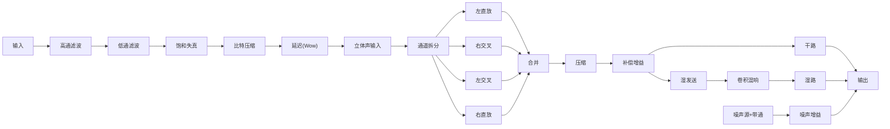
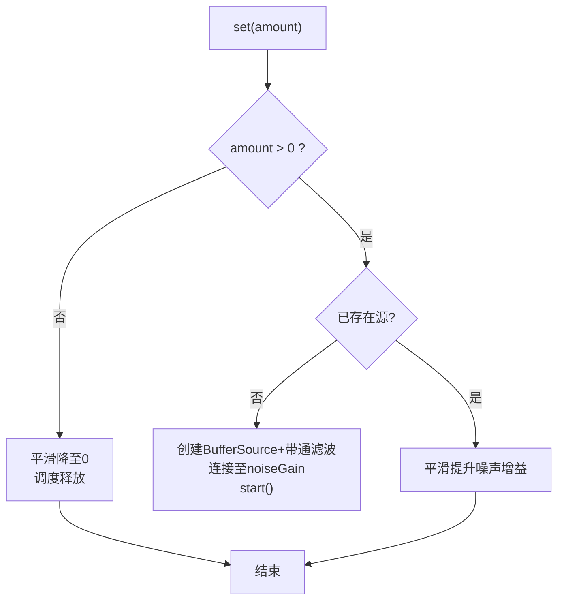
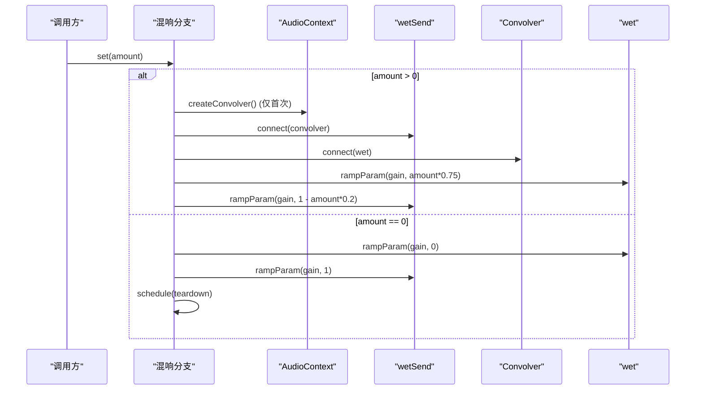
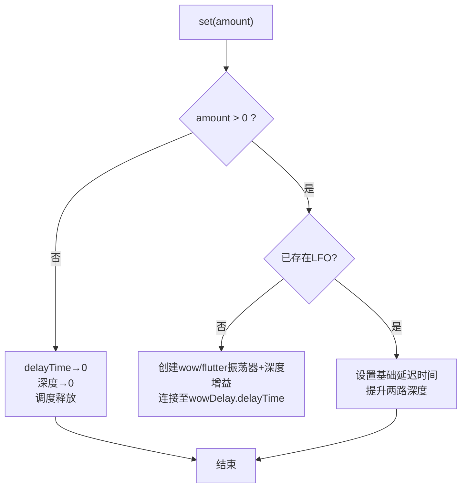
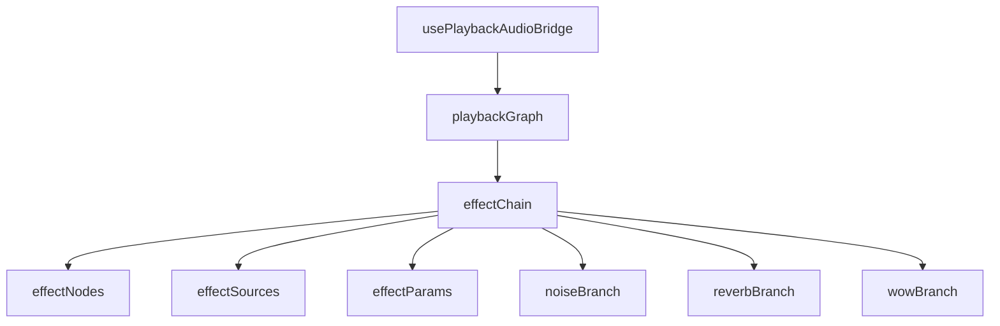

# 音频效果链架构

<cite>
**本文引用的文件**
- [effectChain.ts](file://src/services/audioEffects/effectChain.ts)
- [effectNodes.ts](file://src/services/audioEffects/effectNodes.ts)
- [noiseBranch.ts](file://src/services/audioEffects/noiseBranch.ts)
- [reverbBranch.ts](file://src/services/audioEffects/reverbBranch.ts)
- [wowBranch.ts](file://src/services/audioEffects/wowBranch.ts)
- [effectBranchRelease.ts](file://src/services/audioEffects/effectBranchRelease.ts)
- [effectParams.ts](file://src/services/audioEffects/effectParams.ts)
- [effectSources.ts](file://src/services/audioEffects/effectSources.ts)
- [audioEffects.ts](file://src/utils/audioEffects.ts)
- [playbackGraph.ts](file://src/services/playbackGraph.ts)
- [usePlaybackAudioBridge.ts](file://src/hooks/usePlaybackAudioBridge.ts)
</cite>

## 目录
1. [简介](#简介)
2. [项目结构](#项目结构)
3. [核心组件](#核心组件)
4. [架构总览](#架构总览)
5. [详细组件分析](#详细组件分析)
6. [依赖关系分析](#依赖关系分析)
7. [性能考量](#性能考量)
8. [故障排查指南](#故障排查指南)
9. [结论](#结论)
10. [附录：自定义效果分支集成示例](#附录自定义效果分支集成示例)

## 简介
本技术文档围绕“分支式音频效果链”的设计与实现，系统性解析噪声（noise）、混响（reverb）与颤音/抖晃（wow/flutter）三类效果分支的架构、节点拓扑、串行与并行处理组织方式，以及运行时动态配置机制。同时给出性能优化策略（节点复用、内存管理、CPU使用率控制）、状态管理与生命周期控制方法，并提供完整的自定义效果分支集成步骤与代码路径指引。

## 项目结构
效果链位于服务层 audioEffects 目录，采用“主干节点 + 可选分支”的分层设计：
- 主干节点：创建并连接始终存在的滤波器、失真、比特压缩、立体声宽度、压缩与增益等节点，形成稳定的信号通路。
- 可选分支：噪声底噪、卷积混响、延迟调制（wow/flutter）以独立模块形式提供 set/dispose 接口，按需启用与释放。
- 参数与资源：统一的 AudioParam 平滑过渡工具与曲线/缓冲生成器，避免突变与重复分配。
- 播放图集成：在播放图中将均衡器输出接入效果链，再经音量节点到分析器与输出。

图表来源
- [playbackGraph.ts:31-99](file://src/services/playbackGraph.ts#L31-L99)

章节来源
- [playbackGraph.ts:31-99](file://src/services/playbackGraph.ts#L31-L99)

## 核心组件
- 效果链入口：创建节点、连接拓扑、初始化分支、应用设置、释放资源。
- 节点工厂：创建并默认化所有持久节点，定义主串列路径与并行返回点。
- 分支抽象：统一 set(amount)/dispose() 接口，支持延迟释放与防抖。
- 参数工具：平滑过渡 rampParam、分贝转线性、默认设置与归一化。
- 资源生成：饱和曲线、比特压缩曲线、黑胶噪声缓冲、混响脉冲响应。

章节来源
- [effectChain.ts:17-94](file://src/services/audioEffects/effectChain.ts#L17-L94)
- [effectNodes.ts:4-126](file://src/services/audioEffects/effectNodes.ts#L4-L126)
- [effectBranchRelease.ts:1-29](file://src/services/audioEffects/effectBranchRelease.ts#L1-L29)
- [effectParams.ts:1-17](file://src/services/audioEffects/effectParams.ts#L1-L17)
- [effectSources.ts:1-95](file://src/services/audioEffects/effectSources.ts#L1-L95)
- [audioEffects.ts:1-122](file://src/utils/audioEffects.ts#L1-L122)

## 架构总览
效果链采用“串行主干 + 并行分支”的拓扑：
- 串行主干：高通滤波 → 低通滤波 → 饱和失真 → 比特压缩 → 延迟调制（wow）→ 立体声输入 → 左右声道拆分/交叉混合 → 合并 → 压缩 → 补偿增益 → 干路/湿路分流。
- 并行分支：
  - 噪声分支：通过带通滤波后的循环噪声源，注入到 noiseGain 返回点。
  - 混响分支：Convolver 并联于 wetSend/wet 路径，按 amount 调节干湿比。
  - wow 分支：两个 LFO 调制 DelayNode 的 delayTime，模拟磁带/黑胶音高漂移。

图表来源
- [effectNodes.ts:28-116](file://src/services/audioEffects/effectNodes.ts#L28-L116)
- [noiseBranch.ts:10-59](file://src/services/audioEffects/noiseBranch.ts#L10-L59)
- [reverbBranch.ts:10-48](file://src/services/audioEffects/reverbBranch.ts#L10-L48)
- [wowBranch.ts:9-75](file://src/services/audioEffects/wowBranch.ts#L9-L75)

## 详细组件分析

### 主干节点与拓扑
- 节点职责：
  - 高频/低频滤波塑造音色边界；饱和与比特压缩提供色彩与量化质感；延迟用于 wow 调制。
  - 立体声拆分/合并实现宽度控制（左右直放与交叉增益）。
  - 压缩与补偿增益控制动态范围并恢复电平。
  - 干路与湿路分离，便于混响与噪声的并行注入。
- 连接要点：
  - 所有节点在创建时赋予中性默认值，确保关闭效果时无可闻影响。
  - 输出端包含 dry、wet、noiseGain 三路汇聚，保证多分支并行合成。

章节来源
- [effectNodes.ts:28-116](file://src/services/audioEffects/effectNodes.ts#L28-L116)

### 噪声分支（noiseBranch）
- 功能：产生黑胶底噪（持续嘶声 + 稀疏噼啪），经带通滤波后与音乐融合，避免突兀叠加。
- 行为：
  - amount > 0：首次创建 BufferSource + BiquadFilter，循环播放并连接到 nodes.noiseGain，平滑提升噪声增益。
  - amount == 0：平滑降至 0，延迟释放 BufferSource 与滤波器，避免频繁创建销毁。
- 资源管理：使用延迟释放计时器，防止快速开关导致的抖动与泄漏。

图表来源
- [noiseBranch.ts:10-59](file://src/services/audioEffects/noiseBranch.ts#L10-L59)
- [effectBranchRelease.ts:12-28](file://src/services/audioEffects/effectBranchRelease.ts#L12-L28)

章节来源
- [noiseBranch.ts:10-59](file://src/services/audioEffects/noiseBranch.ts#L10-L59)
- [effectBranchRelease.ts:12-28](file://src/services/audioEffects/effectBranchRelease.ts#L12-L28)

### 混响分支（reverbBranch）
- 功能：并行卷积混响，基于一次性生成的脉冲响应，提供空间感。
- 行为：
  - amount > 0：首次创建 Convolver 并连接 wetSend→convolver→wet，平滑调整 wet/dry 比例。
  - amount == 0：恢复 dry=1、wet=0，延迟释放 convolver。
- 特点：干湿比变化时轻微降低干路电平以保持整体响度稳定。

图表来源
- [reverbBranch.ts:10-48](file://src/services/audioEffects/reverbBranch.ts#L10-L48)
- [effectBranchRelease.ts:12-28](file://src/services/audioEffects/effectBranchRelease.ts#L12-L28)

章节来源
- [reverbBranch.ts:10-48](file://src/services/audioEffects/reverbBranch.ts#L10-L48)
- [effectBranchRelease.ts:12-28](file://src/services/audioEffects/effectBranchRelease.ts#L12-L28)

### 颤音/抖晃分支（wowBranch）
- 功能：用慢速 wow LFO 与快速 flutter LFO 共同调制 DelayNode 的 delayTime，模拟磁带/黑胶音高漂移。
- 行为：
  - amount > 0：首次创建两个振荡器与对应深度增益，连接至 nodes.wowDelay.delayTime；设置基础延迟时间并提升两路深度。
  - amount == 0：将 delayTime 归零，深度增益平滑归零，延迟释放振荡器与增益节点。
- 注意：基础延迟时间固定为常量，避免静音时仍占用 CPU。

图表来源
- [wowBranch.ts:9-75](file://src/services/audioEffects/wowBranch.ts#L9-L75)
- [effectNodes.ts:25-47](file://src/services/audioEffects/effectNodes.ts#L25-L47)

章节来源
- [wowBranch.ts:9-75](file://src/services/audioEffects/wowBranch.ts#L9-L75)
- [effectNodes.ts:25-47](file://src/services/audioEffects/effectNodes.ts#L25-L47)

### 参数与资源
- 参数平滑：rampParam 使用 setTargetAtTime 避免跳变，统一斜坡时间。
- 曲线与缓冲：
  - 饱和曲线：tanh 形状 + 能量补偿，保持响度一致。
  - 比特压缩曲线：阶梯量化模拟低比特深度。
  - 黑胶噪声缓冲：持续嘶声 + 稀疏噼啪，双声道。
  - 混响脉冲响应：指数衰减噪声，长度与衰减可调。
- 默认与归一化：DEFAULT_AUDIO_EFFECT_SETTINGS 与 normalizeAudioEffects 确保无效或越界值回退到中性。

章节来源
- [effectParams.ts:1-17](file://src/services/audioEffects/effectParams.ts#L1-L17)
- [effectSources.ts:1-95](file://src/services/audioEffects/effectSources.ts#L1-L95)
- [audioEffects.ts:40-88](file://src/utils/audioEffects.ts#L40-L88)

### 效果链的动态配置
- apply(effects, enabled)：
  - 若禁用则回退到默认中性设置。
  - 更新高通/低通频率、饱和/比特压缩曲线（仅在值变化时重建）。
  - 更新 wow/noise/space 分支的强度。
  - 计算立体声宽度并更新左右直放/交叉增益。
  - 更新压缩阈值、比率、膝点与补偿增益。
- 生命周期：
  - dispose：依次释放各分支与断开节点，避免内存泄漏。

章节来源
- [effectChain.ts:31-94](file://src/services/audioEffects/effectChain.ts#L31-L94)

### 播放图集成与状态管理
- 构建顺序： decks → mix → equaliser → effects → volume → analyser → out。
- 回放钩子：
  - usePlaybackAudioBridge 中创建 AudioContext、Analyser，并调用 buildPlaybackGraph 获取 effectChain。
  - 将 effectChain 引用保存在 ref 中，供后续 apply 更新。
- 状态同步：
  - 外部设置变更时，调用 effectChain.apply(nextEffects, nextEnabled) 完成实时切换。
  - 音量节点置于效果链之后，确保体积控制不影响效果的绝对特性（如噪声底噪、比特压缩步长、压缩阈值）。

章节来源
- [playbackGraph.ts:31-99](file://src/services/playbackGraph.ts#L31-L99)
- [usePlaybackAudioBridge.ts:136-167](file://src/hooks/usePlaybackAudioBridge.ts#L136-L167)

## 依赖关系分析
- 模块耦合：
  - effectChain 依赖 effectNodes（拓扑）、effectSources（曲线/缓冲）、effectParams（平滑）、三个分支模块。
  - 分支模块共享 effectBranchRelease（延迟释放）与 effectNodes（返回点）。
  - playbackGraph 将效果链嵌入播放图，usePlaybackAudioBridge 负责实例化与持有引用。
- 外部依赖：Web Audio API（BiquadFilter、WaveShaper、Delay、ChannelSplitter/Merger、DynamicsCompressor、Convolver、Oscillator、Gain）。

图表来源
- [effectChain.ts:1-12](file://src/services/audioEffects/effectChain.ts#L1-L12)
- [playbackGraph.ts:1-3](file://src/services/playbackGraph.ts#L1-L3)
- [usePlaybackAudioBridge.ts:1-11](file://src/hooks/usePlaybackAudioBridge.ts#L1-L11)

章节来源
- [effectChain.ts:1-12](file://src/services/audioEffects/effectChain.ts#L1-L12)
- [playbackGraph.ts:1-3](file://src/services/playbackGraph.ts#L1-L3)
- [usePlaybackAudioBridge.ts:1-11](file://src/hooks/usePlaybackAudioBridge.ts#L1-L11)

## 性能考量
- 节点复用与懒创建：
  - 分支在首次启用时创建资源，关闭后延迟释放，避免频繁创建/销毁带来的抖动与开销。
- 曲线与缓冲缓存：
  - 饱和/比特压缩曲线仅在参数变化时重建；噪声与混响缓冲一次性生成并复用。
- 参数平滑：
  - 所有 AudioParam 更新使用 rampParam，避免突变引起的爆音与额外计算。
- CPU 使用率控制：
  - wow 分支在关闭时将 delayTime 归零，减少不必要的调制计算。
  - 噪声分支在关闭时停止 BufferSource，释放解码与播放开销。
  - 混响分支在关闭时断开并释放 Convolver。
- 内存管理：
  - 统一在 dispose 中释放所有分支与节点，防止上下文销毁前的残留引用。
- 音量位置优化：
  - 音量节点置于效果链之后，确保效果对绝对电平敏感的特性不受上游音量影响，避免重算与不一致。

[本节为通用指导，不直接分析具体文件]

## 故障排查指南
- 无声或效果无响应：
  - 检查 effectChain.apply 是否被调用且 enabled 为真。
  - 确认节点连接未被意外断开（disconnectAudioEffectNodes 仅在 dispose 调用）。
- 爆音或突变：
  - 确认所有参数更新通过 rampParam 进行平滑过渡。
- 内存泄漏：
  - 确保在组件卸载或上下文销毁前调用 effectChain.dispose。
- 噪声异常大：
  - 检查 noise 分支的 amount 与 noiseGain 是否被错误放大。
- 混响拖尾过长：
  - 确认 reverbBranch 的 amount 与 wet/dry 比例合理，必要时缩短脉冲响应长度。

章节来源
- [effectChain.ts:84-94](file://src/services/audioEffects/effectChain.ts#L84-L94)
- [noiseBranch.ts:15-27](file://src/services/audioEffects/noiseBranch.ts#L15-L27)
- [reverbBranch.ts:14-19](file://src/services/audioEffects/reverbBranch.ts#L14-L19)
- [wowBranch.ts:16-32](file://src/services/audioEffects/wowBranch.ts#L16-L32)

## 结论
该效果链以“串行主干 + 并行分支”的清晰拓扑实现了可扩展、高性能的音频后处理管线。通过统一的分支抽象、延迟释放与参数平滑，既保证了音质与稳定性，又提供了灵活的运行时配置能力。结合播放图的有序连接与音量后置策略，确保了效果行为的可预测性与一致性。

[本节为总结性内容，不直接分析具体文件]

## 附录：自定义效果分支集成示例
以下示例展示如何新增一个自定义效果分支并集成到现有链条中。请根据实际效果选择插入点（例如在压缩前后或干湿路之间），并遵循现有分支的 set/dispose 约定。

- 步骤概览
  1) 新建分支模块：实现 set(amount)/dispose()，内部使用 effectParams.rampParam 平滑更新参数，使用 effectBranchRelease.createReleaseTimer 管理延迟释放。
  2) 扩展节点类型：如需新节点，请在 effectNodes.ts 的 AudioEffectNodes 类型中添加字段，并在 createAudioEffectNodes 中创建与默认化。
  3) 连接拓扑：在 connectAudioEffectNodes 中将新节点接入合适位置（例如串联在干线或作为并行返回）。
  4) 暴露分支入口：在 effectChain.ts 中引入新分支，创建实例并挂载到 apply 流程中。
  5) 参数映射：在 audioEffects.ts 的 AUDIO_EFFECT_CONTROLS 中注册新的控制项，并在 apply 中将其映射到新节点的参数。
  6) 测试验证：通过 playbackGraph 与 usePlaybackAudioBridge 的 effectChainRef.apply 进行运行时切换与观察。

- 关键参考路径
  - 分支接口与延迟释放：[effectBranchRelease.ts:4-28](file://src/services/audioEffects/effectBranchRelease.ts#L4-L28)
  - 参数平滑工具：[effectParams.ts:6-14](file://src/services/audioEffects/effectParams.ts#L6-L14)
  - 节点类型与拓扑：[effectNodes.ts:4-23](file://src/services/audioEffects/effectNodes.ts#L4-L23), [effectNodes.ts:28-116](file://src/services/audioEffects/effectNodes.ts#L28-L116)
  - 效果链装配与 apply：[effectChain.ts:31-94](file://src/services/audioEffects/effectChain.ts#L31-L94)
  - 控制项定义与归一化：[audioEffects.ts:40-88](file://src/utils/audioEffects.ts#L40-L88)
  - 播放图集成点：[playbackGraph.ts:31-99](file://src/services/playbackGraph.ts#L31-L99)
  - 运行时持有与更新：[usePlaybackAudioBridge.ts:136-167](file://src/hooks/usePlaybackAudioBridge.ts#L136-L167)

- 示例伪流程（示意）
  - 在 effectNodes.ts 添加新节点与默认值。
  - 在 connectAudioEffectNodes 中将其接入干线或并行返回。
  - 新建 customBranch.ts，实现 set(amount)/dispose()，使用 rampParam 更新节点参数，使用 createReleaseTimer 管理释放。
  - 在 effectChain.ts 引入并创建 customBranch，在 apply 中根据 newEffectId 映射到 amount。
  - 在 audioEffects.ts 注册 control，使 UI 可驱动该效果。
  - 通过 effectChainRef.apply({ ...effects, newEffectId: value }, enabled) 进行运行时切换。

[本节为概念性指导，不直接分析具体文件]