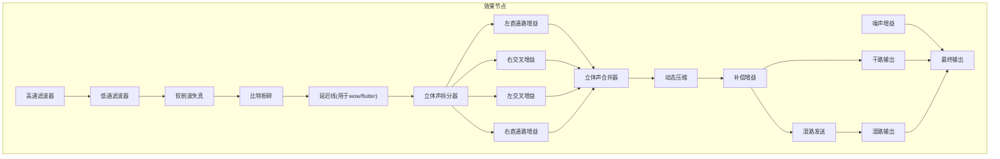
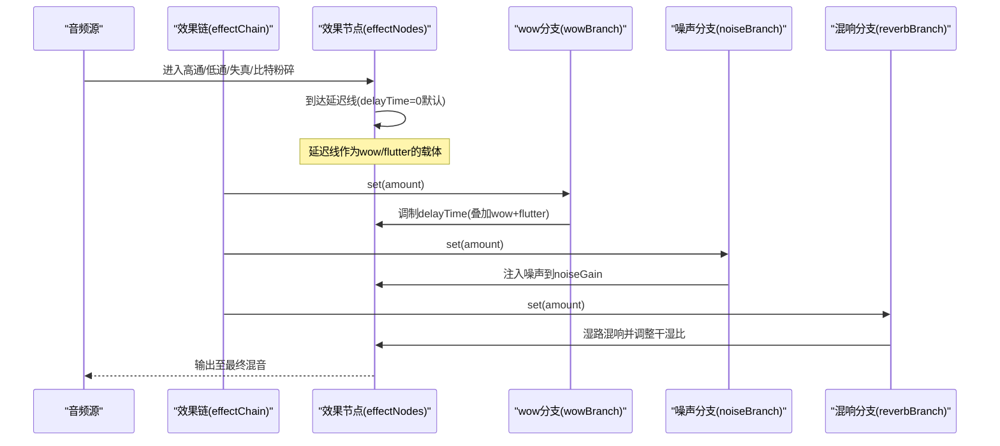
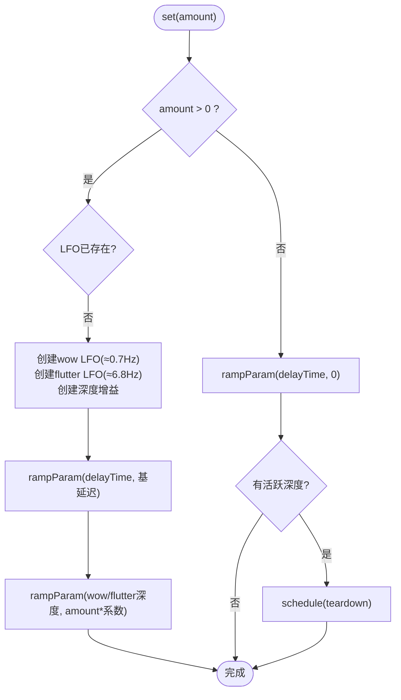
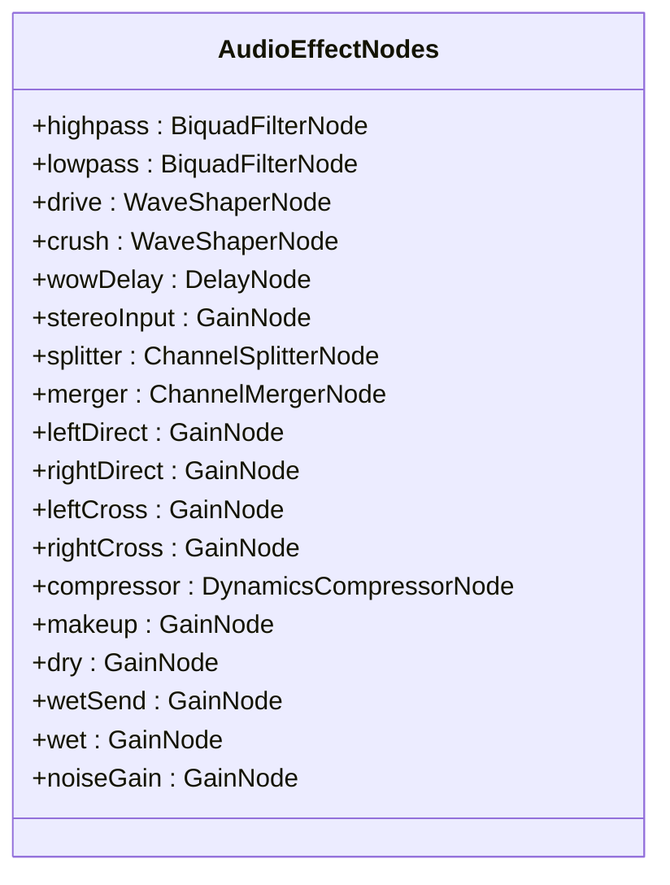
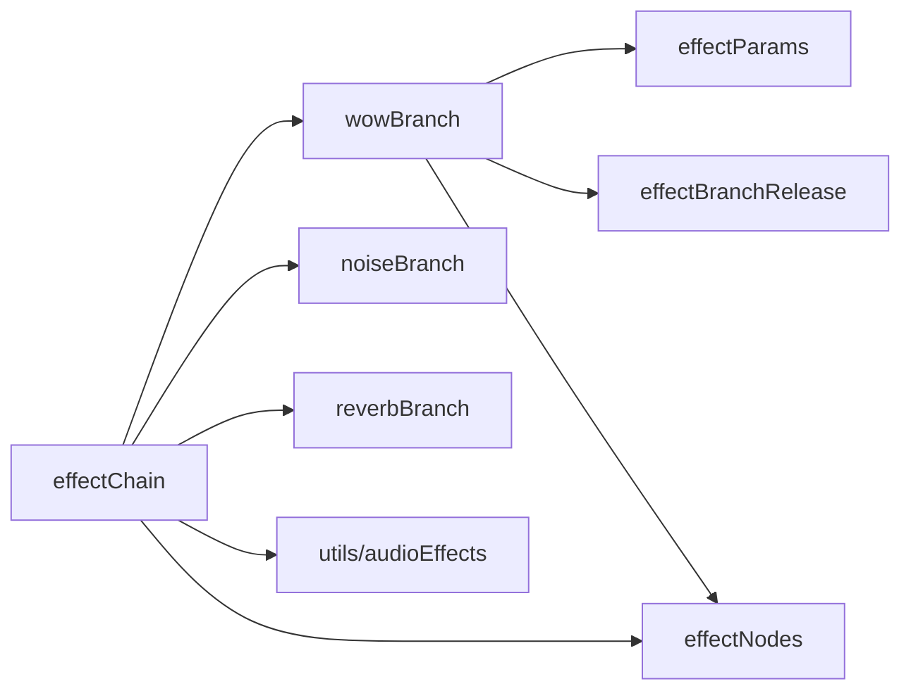

# 颤音效果分支

<cite>
**本文引用的文件**
- [wowBranch.ts](file://src/services/audioEffects/wowBranch.ts)
- [effectNodes.ts](file://src/services/audioEffects/effectNodes.ts)
- [effectParams.ts](file://src/services/audioEffects/effectParams.ts)
- [effectChain.ts](file://src/services/audioEffects/effectChain.ts)
- [noiseBranch.ts](file://src/services/audioEffects/noiseBranch.ts)
- [reverbBranch.ts](file://src/services/audioEffects/reverbBranch.ts)
- [audioEffects.ts](file://src/utils/audioEffects.ts)
</cite>

## 目录
1. [简介](#简介)
2. [项目结构](#项目结构)
3. [核心组件](#核心组件)
4. [架构总览](#架构总览)
5. [详细组件分析](#详细组件分析)
6. [依赖关系分析](#依赖关系分析)
7. [性能考量](#性能考量)
8. [故障排查指南](#故障排查指南)
9. [结论](#结论)
10. [附录](#附录)

## 简介
本技术文档聚焦于“颤音效果分支”（Wow/Flutter），解释其如何模拟磁带录音机与黑胶唱片的“速度波动”和“音高抖动”。实现基于延迟线的时延调制：使用两个低频振荡器（LFO）分别驱动慢速的“wow”和快速的“flutter”，叠加到延迟时间上，从而对音频信号进行频率/相位调制。同时说明该效果在整体音频效果链中的位置、与其他效果（噪声、混响、立体声宽度、压缩等）的组合方式，并提供参数调节建议、预设创建思路以及动态控制强度的方法。

## 项目结构
颤音效果由多个协作模块构成：
- 效果节点与连接：定义并串联始终在线的效果图节点，包括高通/低通、失真、比特粉碎、延迟线、立体声拆分/合并、压缩、干湿比等。
- 效果分支：以“可插拔”的方式提供 wow/flutter、vinyl noise、卷积混响等可选效果，按需启用/释放资源。
- 参数平滑：统一通过缓动函数避免 AudioParam 跳变。
- 效果链编排：将各分支与节点组合，响应外部设置变化。

图表来源
- [effectNodes.ts:28-88](file://src/services/audioEffects/effectNodes.ts#L28-L88)
- [effectNodes.ts:91-116](file://src/services/audioEffects/effectNodes.ts#L91-L116)

章节来源
- [effectNodes.ts:1-126](file://src/services/audioEffects/effectNodes.ts#L1-L126)

## 核心组件
- 延迟线与LFO（wow/flutter）：通过两个不同频率的振荡器调制延迟时间，产生速度波动与音高抖动。
- 参数平滑：所有 AudioParam 更新都经过平滑过渡，避免咔哒声。
- 分支生命周期：使用延迟释放计时器，避免频繁开关导致的资源抖动。
- 效果链集成：wow/flutter 与噪声、混响、立体声宽度、压缩等协同工作。

章节来源
- [wowBranch.ts:1-76](file://src/services/audioEffects/wowBranch.ts#L1-L76)
- [effectParams.ts:1-17](file://src/services/audioEffects/effectParams.ts#L1-L17)
- [effectBranchRelease.ts:1-29](file://src/services/audioEffects/effectBranchRelease.ts#L1-L29)
- [effectChain.ts:1-94](file://src/services/audioEffects/effectChain.ts#L1-L94)

## 架构总览
下图展示了从输入到输出的完整信号流，以及 wow/flutter 分支如何接入延迟线并进行时延调制。

图表来源
- [effectChain.ts:31-82](file://src/services/audioEffects/effectChain.ts#L31-L82)
- [wowBranch.ts:34-69](file://src/services/audioEffects/wowBranch.ts#L34-L69)
- [noiseBranch.ts:29-53](file://src/services/audioEffects/noiseBranch.ts#L29-L53)
- [reverbBranch.ts:21-42](file://src/services/audioEffects/reverbBranch.ts#L21-L42)

## 详细组件分析

### Wow/Flutter 分支（延迟线时延调制）
- 原理概述
  - 使用一个固定基值的延迟线（WOW_BASE_DELAY_SECONDS）。
  - 两个 LFO：慢速 wow（约 0.7 Hz）与快速 flutter（约 6.8 Hz），各自通过增益节点调制 delayTime。
  - 当 amount > 0 时，启动 LFO 并将 delayTime 从 0 平滑切换到基值；同时将 wow/flutter 深度按 amount 线性缩放。
  - 当 amount = 0 时，将 delayTime 平滑回 0，并在延时释放后销毁 LFO 与增益节点。
- 关键参数
  - 基延迟：WOW_BASE_DELAY_SECONDS（常量）。
  - LFO 频率：wow ≈ 0.7 Hz，flutter ≈ 6.8 Hz。
  - 深度系数：wow 与 flutter 的深度分别乘以不同的系数，形成更自然的复合抖动。
- 实现要点
  - 使用 rampParam 对所有 AudioParam 做平滑过渡，避免瞬态突变。
  - 使用 createReleaseTimer 延迟释放，防止短时间内反复开关导致资源抖动。

图表来源
- [wowBranch.ts:34-69](file://src/services/audioEffects/wowBranch.ts#L34-L69)
- [effectParams.ts:6-14](file://src/services/audioEffects/effectParams.ts#L6-L14)
- [effectBranchRelease.ts:12-27](file://src/services/audioEffects/effectBranchRelease.ts#L12-L27)

章节来源
- [wowBranch.ts:1-76](file://src/services/audioEffects/wowBranch.ts#L1-L76)
- [effectParams.ts:1-17](file://src/services/audioEffects/effectParams.ts#L1-L17)
- [effectBranchRelease.ts:1-29](file://src/services/audioEffects/effectBranchRelease.ts#L1-L29)

### 效果节点与连接（延迟线与时域调制）
- 延迟线位于失真与比特粉碎之后、立体声处理之前，确保 wow/flutter 作用于完整的音色塑造阶段。
- 立体声路径通过 ChannelSplitter/ChannelMerger 实现左右直路与交叉路的独立增益控制，配合 width 参数改变立体声宽度。
- 压缩与补偿增益保证动态范围与响度平衡。

图表来源
- [effectNodes.ts:4-23](file://src/services/audioEffects/effectNodes.ts#L4-L23)

章节来源
- [effectNodes.ts:28-116](file://src/services/audioEffects/effectNodes.ts#L28-L116)

### 参数平滑与统一更新
- 所有 AudioParam 更新均通过 rampParam，使用 setTargetAtTime 实现指数趋近，避免不连续跳变。
- 统一的 EFFECT_RAMP_SECONDS 控制过渡时间，保证切换顺滑。

章节来源
- [effectParams.ts:1-17](file://src/services/audioEffects/effectParams.ts#L1-L17)

### 效果链编排与 wow 集成
- effectChain 负责：
  - 创建并连接节点。
  - 初始化 reverb、noise、wow 分支。
  - 根据外部设置（AudioEffectSettings）映射到具体节点参数。
  - 调用 wow.set(active.wow) 来启用/禁用或调节强度。
- 其他效果：
  - 噪声分支：带通滤波后的循环噪声，注入 noiseGain。
  - 混响分支：并行卷积混响，调节 wet/dry 比例。

章节来源
- [effectChain.ts:31-94](file://src/services/audioEffects/effectChain.ts#L31-L94)
- [noiseBranch.ts:1-60](file://src/services/audioEffects/noiseBranch.ts#L1-L60)
- [reverbBranch.ts:1-49](file://src/services/audioEffects/reverbBranch.ts#L1-L49)

### 参数模型与UI映射
- 统一的 AudioEffectSettings 定义了 wow、noise、space、width、punch 等参数的范围、步长与中性值。
- UI 滑块与效果链共享同一套归一化与格式化逻辑，保证所见即所得。

章节来源
- [audioEffects.ts:1-122](file://src/utils/audioEffects.ts#L1-L122)

## 依赖关系分析
- wowBranch 依赖：
  - effectParams.rampParam：参数平滑。
  - effectBranchRelease.createReleaseTimer：延迟释放。
  - effectNodes.WOW_BASE_DELAY_SECONDS 与 nodes.wowDelay.delayTime：延迟基值与时延调制目标。
- effectChain 依赖：
  - 所有分支（wow、noise、reverb）与节点（effectNodes）。
  - 工具函数（dbToLinear、createSaturationCurve、createBitCrushCurve）。
- 耦合性：
  - 分支之间松耦合，通过共享节点接口交互。
  - 效果链集中管理生命周期与参数映射，便于扩展新分支。

图表来源
- [wowBranch.ts:1-76](file://src/services/audioEffects/wowBranch.ts#L1-L76)
- [effectChain.ts:1-94](file://src/services/audioEffects/effectChain.ts#L1-L94)
- [effectParams.ts:1-17](file://src/services/audioEffects/effectParams.ts#L1-L17)
- [effectBranchRelease.ts:1-29](file://src/services/audioEffects/effectBranchRelease.ts#L1-L29)
- [effectNodes.ts:1-126](file://src/services/audioEffects/effectNodes.ts#L1-L126)
- [audioEffects.ts:1-122](file://src/utils/audioEffects.ts#L1-L122)

章节来源
- [wowBranch.ts:1-76](file://src/services/audioEffects/wowBranch.ts#L1-L76)
- [effectChain.ts:1-94](file://src/services/audioEffects/effectChain.ts#L1-L94)

## 性能考量
- 延迟线开销：延迟线本身占用内存与CPU，但 wow/flutter 仅调制 delayTime，计算量较小。
- LFO 数量：每个 wow 分支包含两个振荡器，属于轻量级节点。
- 平滑过渡：rampParam 减少瞬态，避免额外峰值处理成本。
- 资源释放：通过延迟释放避免频繁启停带来的抖动，提高稳定性。
- 采样率限制：低通截止频率受限于 sampleRate * 0.475，避免高频混叠。

[本节为通用指导，无需特定文件引用]

## 故障排查指南
- 无声或无颤音
  - 检查 wow 参数是否大于 0；若为 0，delayTime 会被平滑回 0，不会生效。
  - 确认 effectChain.apply 被调用且 enabled 为 true。
- 咔哒声或爆音
  - 确认所有参数更新都通过 rampParam；避免直接赋值 AudioParam。
- 资源泄漏
  - 确保 dispose 被调用；或在关闭前等待 release timer 完成。
- 噪声来源误解
  - noise 分支会引入底噪；UI 中标注了 addsNoise 的控制项，注意区分 wow 与 noise 的声音特性。

章节来源
- [wowBranch.ts:46-69](file://src/services/audioEffects/wowBranch.ts#L46-L69)
- [effectParams.ts:6-14](file://src/services/audioEffects/effectParams.ts#L6-L14)
- [effectBranchRelease.ts:12-27](file://src/services/audioEffects/effectBranchRelease.ts#L12-L27)
- [audioEffects.ts:25-37](file://src/utils/audioEffects.ts#L25-L37)

## 结论
本实现通过延迟线时延调制的经典方法，精确模拟了磁带与黑胶的速度波动与音高抖动。wow/flutter 分支与噪声、混响、立体声宽度、压缩等效果协同工作，提供了丰富的复古与现代听感。通过统一的参数平滑与生命周期管理，保证了实时性与稳定性。用户可通过调节 wow 强度、结合 noise/space/width/punch 等参数，获得从经典复古到现代电子音乐所需的多样化颤音效果。

[本节为总结，无需特定文件引用]

## 附录

### 参数调节指南（针对 wow/flutter）
- 基础设置
  - wow 强度：0→1，越大延迟线调制越深，颤音越明显。
  - 建议起始值：0.2~0.5，再逐步增加以避免过度失真。
- 与其他效果的搭配
  - 噪声（noise）：增强黑胶质感，适合复古风格；注意底噪。
  - 混响（space）：营造空间感，适合人声或氛围段落。
  - 立体声宽度（width）：适度加宽可增强沉浸感，过大可能引起相位问题。
  - 压缩（punch）：提升打击感与响度，注意不要掩盖颤音细节。
- 场景建议
  - 经典复古：中等 wow + 适量 noise + 轻度 space。
  - 现代电子：较低 wow + 较强 punch + 适度 width，突出节奏与清晰度。

[本节为通用指导，无需特定文件引用]

### 自定义颤音预设与动态控制
- 预设创建
  - 使用 AudioEffectSettings 记录一组参数（如 wow、noise、space、width、punch）。
  - 通过 normalizeAudioEffects 确保数值在合法范围内。
- 动态控制
  - 在播放过程中调用 effectChain.apply(nextEffects, enabled) 实时更新。
  - 所有参数变更都会经 rampParam 平滑过渡，避免突变。

章节来源
- [audioEffects.ts:58-80](file://src/utils/audioEffects.ts#L58-L80)
- [effectChain.ts:47-82](file://src/services/audioEffects/effectChain.ts#L47-L82)

### 与其他效果的组合最佳实践
- 顺序与耦合
  - 先进行音色塑造（高通/低通、失真、比特粉碎），再进行时域调制（wow/flutter），最后进行空间与动态处理（混响、压缩）。
- 注意事项
  - 过强的 wow 可能与压缩相互作用导致动态不稳定，需微调 punch。
  - 噪声与比特粉碎都会引入额外能量，注意总体响度匹配。

章节来源
- [effectNodes.ts:91-116](file://src/services/audioEffects/effectNodes.ts#L91-L116)
- [effectChain.ts:51-80](file://src/services/audioEffects/effectChain.ts#L51-L80)