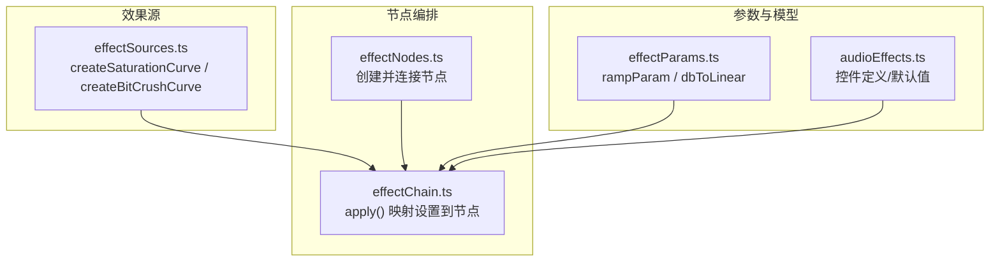
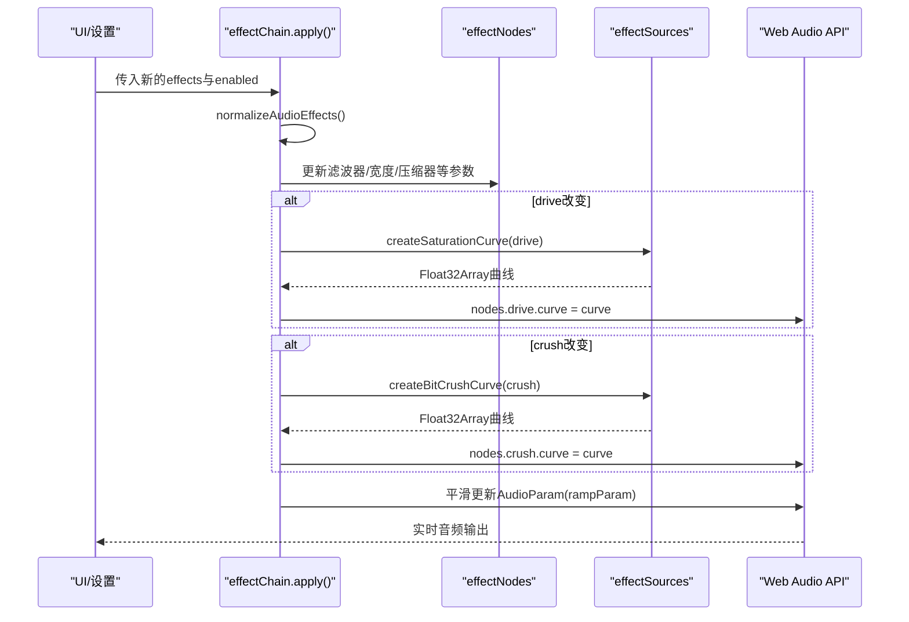
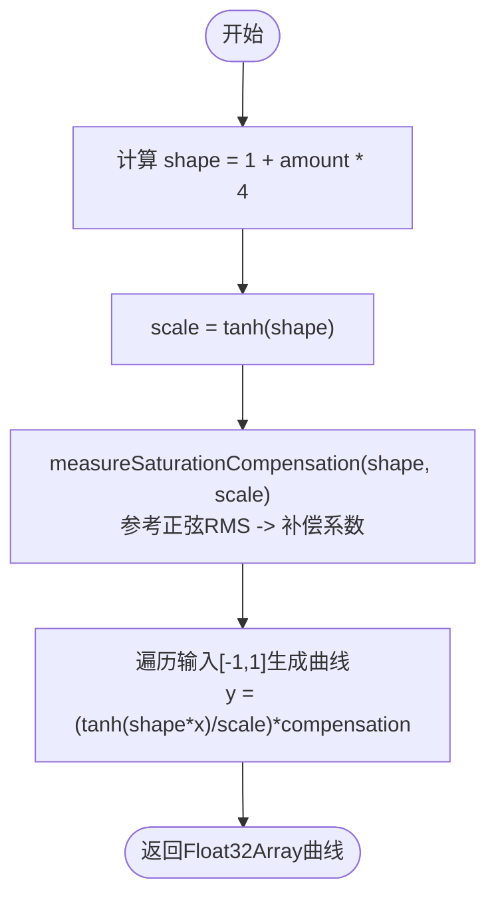
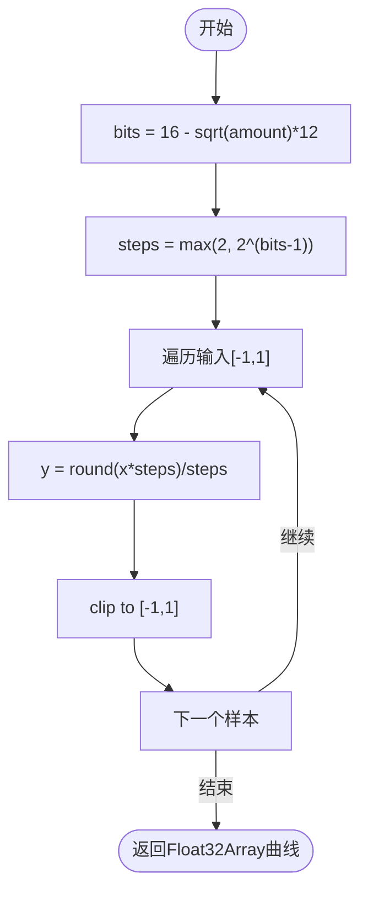
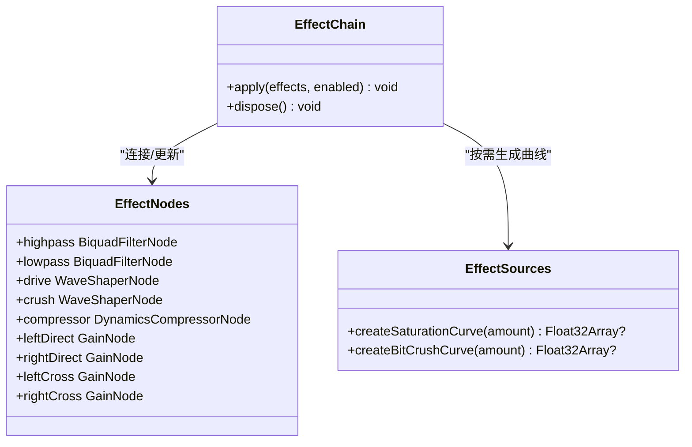
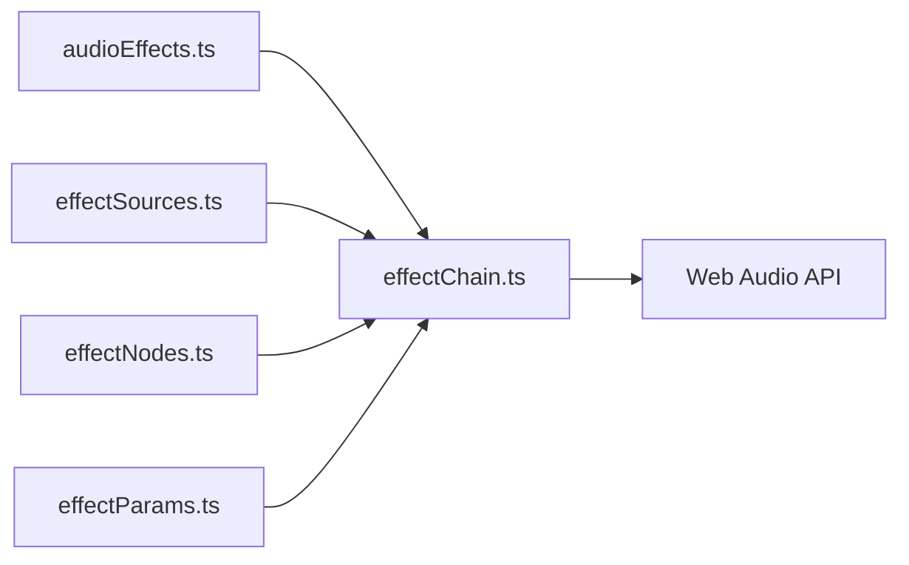

# 饱和与失真效果

<cite>
**本文引用的文件**
- [effectSources.ts](file://src/services/audioEffects/effectSources.ts)
- [effectChain.ts](file://src/services/audioEffects/effectChain.ts)
- [effectNodes.ts](file://src/services/audioEffects/effectNodes.ts)
- [effectParams.ts](file://src/services/audioEffects/effectParams.ts)
- [audioEffects.ts](file://src/utils/audioEffects.ts)
- [audioEffectSources.test.ts](file://test/unit/services/audioEffectSources.test.ts)
</cite>

## 目录
1. [简介](#简介)
2. [项目结构](#项目结构)
3. [核心组件](#核心组件)
4. [架构总览](#架构总览)
5. [详细组件分析](#详细组件分析)
6. [依赖关系分析](#依赖关系分析)
7. [性能考量](#性能考量)
8. [故障排查指南](#故障排查指南)
9. [结论](#结论)
10. [附录：参数调节指南](#附录参数调节指南)

## 简介
本技术文档聚焦于音频后级处理中的“饱和”与“失真（比特压缩/BitCrush）”两类非线性效果。内容涵盖：
- tanh软削波算法的数学建模、参考振幅测量机制与能量补偿计算；
- BitCrush阶梯传递函数的实现，位深度映射与平方根缩放；
- 这些效果在音频处理中的作用机制（谐波生成、动态范围压缩、音色温暖化）；
- 参数调节指南与不同amount值对应的听觉效果及适用场景；
- Web Audio API中WaveShaperNode的使用示例与性能优化建议。

## 项目结构
与饱和与失真相关的代码集中在音频效果服务层，采用“曲线生成 + 节点编排 + 参数平滑更新”的分层设计：
- effectSources.ts：负责生成Waveshaper曲线（饱和与比特压缩），以及噪声/混响IR等辅助资源；
- effectNodes.ts：创建并连接效果链中的固定节点（滤波器、Waveshaper、压缩器、立体声宽度控制等）；
- effectChain.ts：将设置映射到节点，按需重建曲线并应用参数；
- effectParams.ts：提供AudioParam平滑过渡工具；
- audioEffects.ts：定义统一的音效模型、控件范围与默认值；
- 单元测试：对饱和曲线的响度匹配、单调性、小信号增益等进行断言。

图表来源
- [effectSources.ts:25-58](file://src/services/audioEffects/effectSources.ts#L25-L58)
- [effectNodes.ts:28-116](file://src/services/audioEffects/effectNodes.ts#L28-L116)
- [effectChain.ts:31-82](file://src/services/audioEffects/effectChain.ts#L31-L82)
- [effectParams.ts:6-16](file://src/services/audioEffects/effectParams.ts#L6-L16)
- [audioEffects.ts:41-61](file://src/utils/audioEffects.ts#L41-L61)

章节来源
- [effectSources.ts:1-95](file://src/services/audioEffects/effectSources.ts#L1-L95)
- [effectChain.ts:1-94](file://src/services/audioEffects/effectChain.ts#L1-L94)
- [effectNodes.ts:1-126](file://src/services/audioEffects/effectNodes.ts#L1-L126)
- [effectParams.ts:1-17](file://src/services/audioEffects/effectParams.ts#L1-L17)
- [audioEffects.ts:1-122](file://src/utils/audioEffects.ts#L1-L122)

## 核心组件
- 饱和曲线生成器：基于tanh软削波，带参考振幅测量与能量补偿，确保不同drive下输出响度一致，避免“越推越响”。
- 比特压缩曲线生成器：通过阶梯量化模拟低比特深度，使用平方根缩放使常用听感区间落在滑块中部。
- 效果链控制器：根据当前设置决定是否重建曲线，并将参数以平滑方式应用到节点。
- 节点图：包含高通/低通滤波、Waveshaper（饱和/比特压缩）、立体声宽度、压缩器与增益补偿、干/湿混合等。

章节来源
- [effectSources.ts:25-58](file://src/services/audioEffects/effectSources.ts#L25-L58)
- [effectChain.ts:47-82](file://src/services/audioEffects/effectChain.ts#L47-L82)
- [effectNodes.ts:28-116](file://src/services/audioEffects/effectNodes.ts#L28-L116)

## 架构总览
以下序列图展示了从UI参数变化到音频流处理的完整调用链：

图表来源
- [effectChain.ts:47-82](file://src/services/audioEffects/effectChain.ts#L47-L82)
- [effectSources.ts:25-58](file://src/services/audioEffects/effectSources.ts#L25-L58)
- [effectParams.ts:6-16](file://src/services/audioEffects/effectParams.ts#L6-L16)

## 详细组件分析

### 饱和（Tanh软削波）
- 数学建模
  - 使用双曲正切函数作为软削波传递函数，形状由shape参数控制；
  - 为保持响度一致，引入参考正弦信号的RMS测量与补偿系数；
  - 曲线归一化：将峰值缩放到±1以内，保证不削顶。
- 参考振幅测量机制
  - 以固定参考振幅的正弦信号在一个周期内采样，计算经tanh后的RMS；
  - 用参考RMS与处理后RMS之比得到补偿系数，抵消因软削波带来的整体电平提升。
- 能量补偿计算
  - 补偿系数用于整条曲线缩放，使得不同drive下的输出响度基本一致；
  - 测试覆盖验证了在不同amount下，参考正弦的RMS与预期接近。
- 作用机制
  - 产生偶次/奇次谐波，带来“温暖”的音色；
  - 由于响度匹配，不会显著改变整体音量，适合做“加温”而非“失真踏板”。

图表来源
- [effectSources.ts:11-22](file://src/services/audioEffects/effectSources.ts#L11-L22)
- [effectSources.ts:25-40](file://src/services/audioEffects/effectSources.ts#L25-L40)

章节来源
- [effectSources.ts:11-40](file://src/services/audioEffects/effectSources.ts#L11-L40)
- [audioEffectSources.test.ts:34-66](file://test/unit/services/audioEffectSources.test.ts#L34-L66)

### 比特压缩（BitCrush）
- 阶梯传递函数
  - 将输入幅度量化到有限台阶数，模拟低比特深度ADC/DAC；
  - 使用Math.round(input*steps)/steps实现均匀量化。
- 位深度映射与平方根缩放
  - bits = 16 - sqrt(amount) * 12，使常用听感区间（约8-10bit）位于滑块中部；
  - steps = max(2, 2^(bits-1))，限制最小步数为2以避免退化。
- 作用机制
  - 引入量化噪声与谐波，营造复古/低保真质感；
  - 随amount增大，台阶减少，噪声与高频成分更明显。

图表来源
- [effectSources.ts:44-58](file://src/services/audioEffects/effectSources.ts#L44-L58)

章节来源
- [effectSources.ts:44-58](file://src/services/audioEffects/effectSources.ts#L44-L58)
- [audioEffectSources.test.ts:69-78](file://test/unit/services/audioEffectSources.test.ts#L69-L78)

### 效果链集成与参数更新
- 曲线重建策略
  - 仅在drive或crush变化时重建对应曲线，避免频繁分配内存；
  - 将生成的曲线赋给WaveShaperNode的curve属性。
- 参数平滑
  - 所有AudioParam更新使用rampParam进行指数平滑，避免爆音与瞬态突变；
  - 压缩器阈值、比率、膝点与补偿增益按punch参数线性映射。
- 立体声宽度
  - 通过左右直通与交叉增益组合实现mid/side风格的宽度控制。

图表来源
- [effectChain.ts:31-82](file://src/services/audioEffects/effectChain.ts#L31-L82)
- [effectNodes.ts:28-116](file://src/services/audioEffects/effectNodes.ts#L28-L116)
- [effectSources.ts:25-58](file://src/services/audioEffects/effectSources.ts#L25-L58)

章节来源
- [effectChain.ts:47-82](file://src/services/audioEffects/effectChain.ts#L47-L82)
- [effectNodes.ts:28-116](file://src/services/audioEffects/effectNodes.ts#L28-L116)
- [effectParams.ts:6-16](file://src/services/audioEffects/effectParams.ts#L6-L16)

## 依赖关系分析
- 模块耦合
  - effectChain依赖effectSources生成曲线，依赖effectNodes构建节点图，依赖effectParams平滑参数；
  - audioEffects提供统一控件定义，被effectChain用于归一化与默认值。
- 外部依赖
  - Web Audio API：BiquadFilterNode、WaveShaperNode、DynamicsCompressorNode、GainNode、DelayNode等；
  - 过采样：驱动饱和阶段启用4x过采样以减少高频混叠。
- 循环依赖
  - 无直接循环依赖，单向流向清晰。

图表来源
- [effectChain.ts:1-11](file://src/services/audioEffects/effectChain.ts#L1-L11)
- [effectNodes.ts:1-23](file://src/services/audioEffects/effectNodes.ts#L1-L23)
- [effectSources.ts:1-6](file://src/services/audioEffects/effectSources.ts#L1-L6)
- [effectParams.ts:1-4](file://src/services/audioEffects/effectParams.ts#L1-L4)
- [audioEffects.ts:1-15](file://src/utils/audioEffects.ts#L1-L15)

章节来源
- [effectChain.ts:1-11](file://src/services/audioEffects/effectChain.ts#L1-L11)
- [effectNodes.ts:1-23](file://src/services/audioEffects/effectNodes.ts#L1-L23)
- [effectSources.ts:1-6](file://src/services/audioEffects/effectSources.ts#L1-L6)
- [effectParams.ts:1-4](file://src/services/audioEffects/effectParams.ts#L1-L4)
- [audioEffects.ts:1-15](file://src/utils/audioEffects.ts#L1-L15)

## 性能考量
- 过采样抑制混叠
  - 饱和阶段的WaveShaper启用4x过采样，降低高频谐波产生的混叠失真，使声音更柔和；
  - 代价是CPU占用略增，但通常可接受。
- 曲线缓存与增量重建
  - 仅当drive/crush变化时重建曲线，避免每帧分配新数组；
  - 使用lastDrive/lastCrush记录上次值，减少不必要的对象创建。
- 平滑参数更新
  - rampParam使用setTargetAtTime，避免AudioParam跳变导致的爆音；
  - EFFECT_RAMP_SECONDS=0.03s，兼顾响应速度与听感平滑。
- 采样点数选择
  - 饱和曲线1024点，比特压缩8192点，平衡精度与内存占用；
  - 比特压缩点数更高，因为阶梯函数需要足够分辨率来表现量化台阶。

章节来源
- [effectNodes.ts:39-45](file://src/services/audioEffects/effectNodes.ts#L39-L45)
- [effectChain.ts:54-61](file://src/services/audioEffects/effectChain.ts#L54-L61)
- [effectParams.ts:4-16](file://src/services/audioEffects/effectParams.ts#L4-L16)
- [effectSources.ts:4-5](file://src/services/audioEffects/effectSources.ts#L4-L5)

## 故障排查指南
- 无声或无效果
  - 检查enabled是否为true；若禁用则回退到中性设置；
  - 确认drive/crush未设置为0（此时返回null，跳过曲线）。
- 声音过大或过小
  - 饱和已做响度匹配，但仍可能受前后级增益影响；
  - 调整punch与makeup增益恢复动态余量。
- 高频刺耳或金属味
  - 可能是过采样不足或输入电平过高；
  - 降低drive或增加低通滤波截止频率。
- 比特压缩噪声过大
  - amount过高会减少台阶数，量化噪声增强；
  - 适当调低amount或配合低通滤波。

章节来源
- [effectChain.ts:47-82](file://src/services/audioEffects/effectChain.ts#L47-L82)
- [effectSources.ts:25-58](file://src/services/audioEffects/effectSources.ts#L25-L58)
- [audioEffectSources.test.ts:34-78](file://test/unit/services/audioEffectSources.test.ts#L34-L78)

## 结论
该实现以严谨的数学建模与工程实践提供了高质量的饱和与比特压缩效果：
- 饱和通过tanh软削波与响度补偿，在不改变整体音量的前提下增添温暖与谐波；
- 比特压缩通过阶梯量化与平方根缩放，提供可控的低保真质感；
- 效果链以模块化、可插拔的方式组织，支持平滑参数更新与高效运行；
- 结合过采样与合理采样点数，兼顾音质与性能。

## 附录：参数调节指南
- drive（饱和）
  - 0：关闭饱和；
  - 0.1-0.3：轻微加温，适合人声、原声乐器；
  - 0.4-0.7：中等饱和度，适合电吉他、合成器铺底；
  - 0.8-1.0：高饱和度，注意监听THD与高频混叠，适合电子乐或特殊音色塑造。
- crush（比特压缩）
  - 0：关闭；
  - 0.1-0.3：轻微量化噪声，适合Lo-Fi氛围；
  - 0.4-0.7：明显台阶感，适合复古鼓组、贝斯；
  - 0.8-1.0：强量化，适合实验音乐或特效。
- width（立体声宽度）
  - <1：收窄，适合单声道兼容；
  - 1：标准；
  - >1：拓宽，适合环境声、合唱。
- space（混响干湿比）
  - 0：干声；
  - 0.1-0.4：轻度空间；
  - 0.5-1.0：明显房间/大厅感。
- punch（动态冲击）
  - 0：无压缩；
  - 0.1-0.5：适度压缩，提升打击感；
  - 0.6-1.0：强压缩，适合鼓组或需要穿透力的元素。

章节来源
- [audioEffects.ts:41-61](file://src/utils/audioEffects.ts#L41-L61)
- [effectChain.ts:67-80](file://src/services/audioEffects/effectChain.ts#L67-L80)