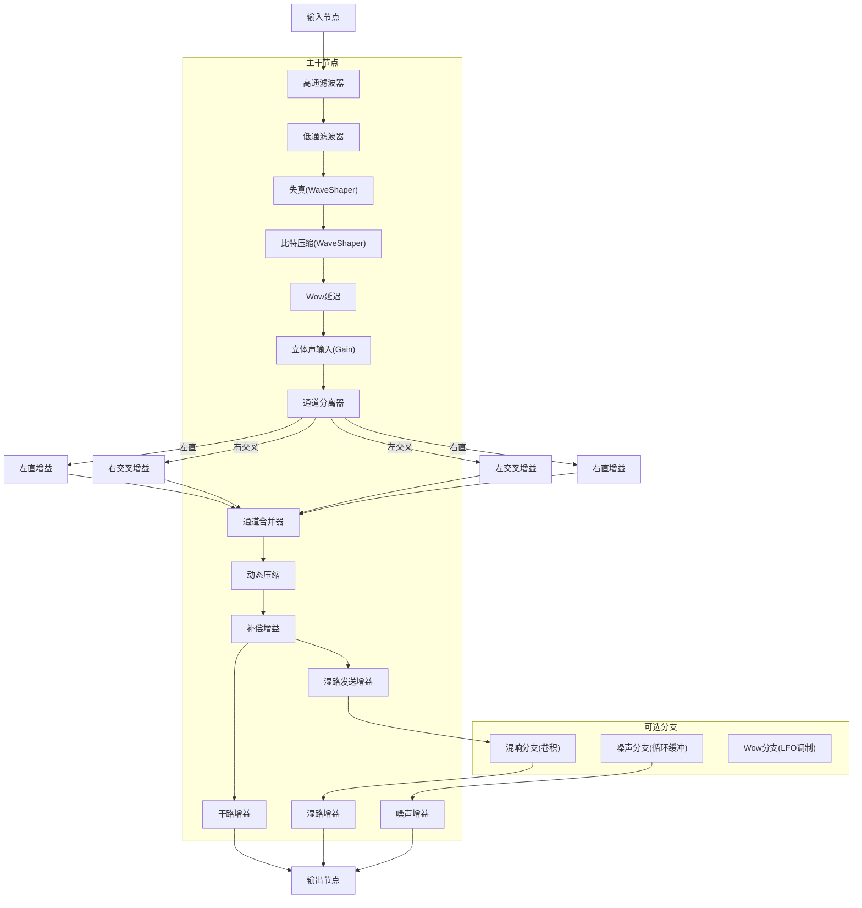
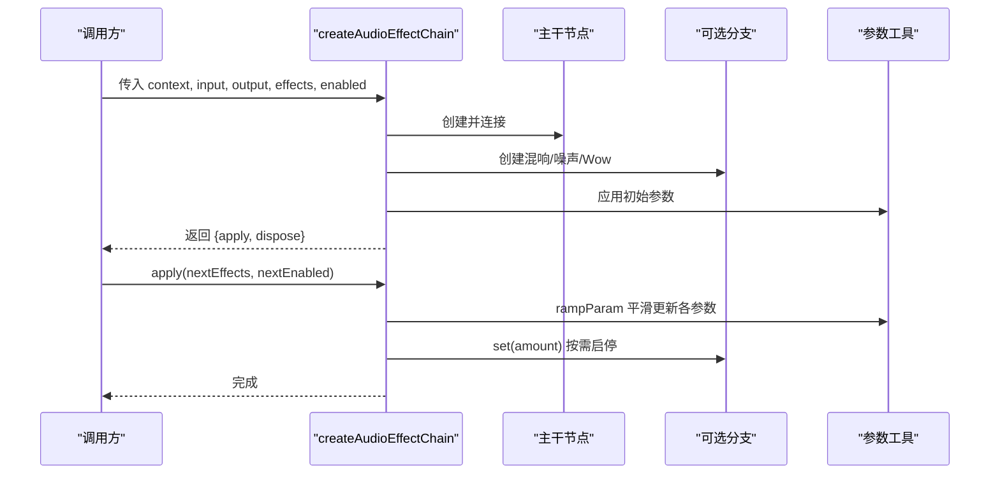
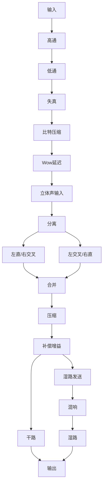
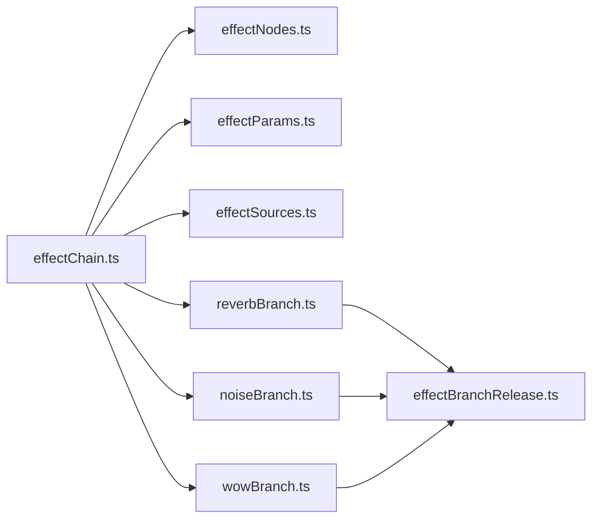

# 效果链架构设计

<cite>
**本文引用的文件**
- [effectChain.ts](file://src/services/audioEffects/effectChain.ts)
- [effectNodes.ts](file://src/services/audioEffects/effectNodes.ts)
- [effectParams.ts](file://src/services/audioEffects/effectParams.ts)
- [effectSources.ts](file://src/services/audioEffects/effectSources.ts)
- [noiseBranch.ts](file://src/services/audioEffects/noiseBranch.ts)
- [reverbBranch.ts](file://src/services/audioEffects/reverbBranch.ts)
- [wowBranch.ts](file://src/services/audioEffects/wowBranch.ts)
- [effectBranchRelease.ts](file://src/services/audioEffects/effectBranchRelease.ts)
- [audioEffects.ts](file://src/utils/audioEffects.ts)
</cite>

## 目录
1. [简介](#简介)
2. [项目结构](#项目结构)
3. [核心组件](#核心组件)
4. [架构总览](#架构总览)
5. [详细组件分析](#详细组件分析)
6. [依赖关系分析](#依赖关系分析)
7. [性能考量](#性能考量)
8. [故障排查指南](#故障排查指南)
9. [结论](#结论)
10. [附录：扩展指南](#附录：扩展指南)

## 简介
本技术文档围绕音频效果链的架构与实现展开，重点解析节点式效果器连接、信号流向控制、参数插值优化等核心机制。文档深入说明 createAudioEffectChain 的实现原理（AudioContext 初始化、AudioNode 创建与连接、效果器状态管理），解释 apply 方法的参数更新策略（rampParam 平滑过渡、条件更新优化、内存管理），并阐述效果链启用/禁用机制与默认设置切换。最后提供新效果器集成、节点连接规范与生命周期管理的扩展实践。

## 项目结构
效果链位于 src/services/audioEffects 目录下，采用“主干节点 + 可选分支”的分层组织方式：
- effectNodes.ts：定义并创建始终在线的主干节点（高通/低通、失真、比特压缩、立体声宽度、压缩、干湿路等）以及串联/并联拓扑。
- effectChain.ts：编排主干节点与可选分支（混响、噪声、颤音/抖晃），封装 createAudioEffectChain 工厂与 apply 更新接口。
- effectParams.ts：统一的 AudioParam 平滑过渡工具（rampParam）与分贝线性转换。
- effectSources.ts：生成 waveshaper 曲线与噪声/卷积脉冲响应等离线资源。
- noiseBranch.ts / reverbBranch.ts / wowBranch.ts：可选并行分支，按需创建与释放，避免常驻开销。
- effectBranchRelease.ts：统一延迟释放策略，保证分支在关闭后短暂保持以支持快速重开。
- utils/audioEffects.ts：效果模型、默认值、归一化与 UI 映射，供上层配置与持久化使用。

图表来源
- [effectNodes.ts:28-116](file://src/services/audioEffects/effectNodes.ts#L28-L116)
- [reverbBranch.ts:10-49](file://src/services/audioEffects/reverbBranch.ts#L10-L49)
- [noiseBranch.ts:10-60](file://src/services/audioEffects/noiseBranch.ts#L10-L60)
- [wowBranch.ts:9-76](file://src/services/audioEffects/wowBranch.ts#L9-L76)

章节来源
- [effectChain.ts:17-94](file://src/services/audioEffects/effectChain.ts#L17-L94)
- [effectNodes.ts:1-126](file://src/services/audioEffects/effectNodes.ts#L1-L126)
- [effectParams.ts:1-17](file://src/services/audioEffects/effectParams.ts#L1-L17)
- [effectSources.ts:1-95](file://src/services/audioEffects/effectSources.ts#L1-L95)
- [noiseBranch.ts:1-60](file://src/services/audioEffects/noiseBranch.ts#L1-L60)
- [reverbBranch.ts:1-49](file://src/services/audioEffects/reverbBranch.ts#L1-49)
- [wowBranch.ts:1-76](file://src/services/audioEffects/wowBranch.ts#L1-L76)
- [effectBranchRelease.ts:1-29](file://src/services/audioEffects/effectBranchRelease.ts#L1-L29)
- [audioEffects.ts:1-122](file://src/utils/audioEffects.ts#L1-L122)

## 核心组件
- 效果链工厂 createAudioEffectChain：接收上下文、输入/输出节点、初始效果与启用标志，构建并返回可更新的链句柄。
- 主干节点组 AudioEffectNodes：包含滤波、波形整形、立体声宽度、压缩、干湿路等节点，默认中性值，确保静音时不引入额外音色。
- 可选分支：
  - 混响分支：基于卷积的并行混响，带干湿路平衡与延迟释放。
  - 噪声分支：循环播放的模拟黑胶底噪，带带通滤波与延迟释放。
  - Wow/Flutter 分支：双 LFO 调制延迟时间，模拟磁带/黑胶音高漂移。
- 参数工具：rampParam 用于所有 AudioParam 的平滑过渡；dbToLinear 用于分贝到线性的转换。
- 效果模型与归一化：统一的效果 ID、范围、步长、中性值与 UI 映射，确保跨平台一致性与安全性。

章节来源
- [effectChain.ts:17-94](file://src/services/audioEffects/effectChain.ts#L17-L94)
- [effectNodes.ts:4-88](file://src/services/audioEffects/effectNodes.ts#L4-L88)
- [effectParams.ts:1-17](file://src/services/audioEffects/effectParams.ts#L1-L17)
- [audioEffects.ts:4-88](file://src/utils/audioEffects.ts#L4-L88)

## 架构总览
效果链采用“串行主干 + 并行分支”的拓扑：
- 串行路径：高通 → 低通 → 失真 → 比特压缩 → Wow延迟 → 立体声输入 → 分离/合并 → 压缩 → 补偿 → 干湿路。
- 并行路径：
  - 混响：从压缩后的节点取湿路发送，经卷积器回到湿路输出。
  - 噪声：独立源直接注入输出。
  - Wow：通过 LFO 对延迟时间进行调制，影响主信号相位与音高微变。

图表来源
- [effectChain.ts:31-94](file://src/services/audioEffects/effectChain.ts#L31-L94)
- [effectNodes.ts:91-116](file://src/services/audioEffects/effectNodes.ts#L91-L116)
- [effectParams.ts:6-14](file://src/services/audioEffects/effectParams.ts#L6-L14)

## 详细组件分析

### createAudioEffectChain 实现原理
- 节点创建与连接：
  - 调用 createAudioEffectNodes 分配所有主干节点并赋予中性默认值。
  - 调用 connectAudioEffectNodes 将输入连接到高通，依次串联至低通、失真、比特压缩、Wow延迟、立体声输入、分离/合并、压缩、补偿、干湿路与输出。
- 可选分支初始化：
  - 创建混响分支、噪声分支、Wow分支，分别持有自己的资源与释放逻辑。
- 状态管理与首次应用：
  - 维护 lastDrive、lastCrush 以减少不必要的曲线重建。
  - 立即执行一次 apply(effects, enabled)，确保链处于期望状态。
- 返回值：
  - 暴露 apply 与 dispose，便于外部驱动参数更新与资源清理。

章节来源
- [effectChain.ts:31-94](file://src/services/audioEffects/effectChain.ts#L31-L94)
- [effectNodes.ts:28-116](file://src/services/audioEffects/effectNodes.ts#L28-L116)

### 信号流向与节点拓扑
- 高频切除与低频限制：高通与低通构成基础频带塑造。
- 音色染色：失真与比特压缩提供谐波与量化质感。
- 空间感：Wow延迟调制带来音高微颤；混响提供空间反射。
- 立体声宽度：通过左右直路与交叉路的增益组合调节立体声像。
- 动态控制：压缩降低峰值，补偿增益恢复整体电平。
- 干湿混合：压缩后分流至干路与湿路，混响结果汇入湿路，最终叠加输出。

图表来源
- [effectNodes.ts:91-116](file://src/services/audioEffects/effectNodes.ts#L91-L116)

### 参数更新策略与优化
- 平滑过渡：
  - 所有 AudioParam 通过 rampParam 使用 setTargetAtTime 进行指数平滑，避免突变导致的爆音。
  - 默认斜坡时间为 0.03 秒，兼顾响应速度与听感自然。
- 条件更新：
  - 仅当 drive/crush 变化时才重建 WaveShaper 曲线，减少 Float32Array 分配与 GPU 上传成本。
  - 宽度和压缩参数按公式计算后批量 ramp，减少多次调度。
- 内存管理：
  - 可选分支在 amount 为 0 时进入延迟释放流程，避免频繁创建销毁带来的抖动。
  - 混响与噪声在激活时懒加载，关闭后延时断开连接并停止源。
- 电平匹配：
  - 失真曲线内置能量测量与补偿，使不同 drive 下总体响度稳定。
  - 压缩后通过补偿增益恢复电平，避免音量跳变。

章节来源
- [effectParams.ts:1-17](file://src/services/audioEffects/effectParams.ts#L1-L17)
- [effectChain.ts:47-80](file://src/services/audioEffects/effectChain.ts#L47-L80)
- [effectSources.ts:24-58](file://src/services/audioEffects/effectSources.ts#L24-L58)
- [reverbBranch.ts:22-42](file://src/services/audioEffects/reverbBranch.ts#L22-L42)
- [noiseBranch.ts:30-53](file://src/services/audioEffects/noiseBranch.ts#L30-L53)
- [wowBranch.ts:46-69](file://src/services/audioEffects/wowBranch.ts#L46-L69)

### 启用/禁用机制与默认设置切换
- 启用：
  - 传入 enabled=true 时，使用 normalizeAudioEffects 将用户配置归一化为完整且安全的参数集，再应用到各节点。
- 禁用：
  - 传入 enabled=false 时，fallback 到 DEFAULT_AUDIO_EFFECT_SETTINGS，即所有参数回归中性值，链等效直通。
- 性能考虑：
  - 禁用时不重建节点，仅回退参数；可选分支在 amount=0 时延迟释放，避免即时断开造成的音频中断。
- 默认设置：
  - 默认值来自 AUDIO_EFFECT_CONTROLS 的中性值，保证 UI 与运行时一致。

章节来源
- [effectChain.ts:47-82](file://src/services/audioEffects/effectChain.ts#L47-L82)
- [audioEffects.ts:58-88](file://src/utils/audioEffects.ts#L58-L88)

### 可选分支详解
- 混响分支：
  - 懒创建 Convolver，使用指数衰减的脉冲响应；wet/dry 同步 ramp，总量保持稳定。
  - 关闭时先淡出 wet，再将 dry 恢复到 1，随后延迟释放 convolver。
- 噪声分支：
  - 懒创建 BufferSource 与带通滤波，循环播放黑胶底噪；amount 控制噪声增益。
  - 关闭时先淡出噪声增益，再延迟释放 BufferSource 与滤波器。
- Wow 分支：
  - 懒创建两个 LFO（慢速 wow 与快速 flutter），分别调制 delayTime；amount 控制深度。
  - 关闭时先将 delayTime 归零，再淡出 LFO 深度，延迟释放振荡器与增益。

章节来源
- [reverbBranch.ts:10-49](file://src/services/audioEffects/reverbBranch.ts#L10-L49)
- [noiseBranch.ts:10-60](file://src/services/audioEffects/noiseBranch.ts#L10-L60)
- [wowBranch.ts:9-76](file://src/services/audioEffects/wowBranch.ts#L9-L76)
- [effectBranchRelease.ts:1-29](file://src/services/audioEffects/effectBranchRelease.ts#L1-L29)

## 依赖关系分析
- 模块耦合：
  - effectChain 依赖 effectNodes、effectParams、effectSources 与各分支模块，形成清晰的单向依赖。
  - 分支模块依赖 effectParams 与 effectBranchRelease，保持统一的参数与释放策略。
- 外部依赖：
  - Web Audio API 原生节点（BiquadFilter、WaveShaper、Delay、ChannelSplitter/Merger、DynamicsCompressor、Convolver、Oscillator、Gain）。
- 潜在风险：
  - 若上游 input/output 提前销毁，disconnect 可能抛出异常，已在 disconnectAudioEffectNodes 中捕获。
  - 大量同时启用分支会增加 CPU 与内存占用，需结合业务场景控制并发。

图表来源
- [effectChain.ts:1-12](file://src/services/audioEffects/effectChain.ts#L1-L12)
- [reverbBranch.ts:1-4](file://src/services/audioEffects/reverbBranch.ts#L1-L4)
- [noiseBranch.ts:1-4](file://src/services/audioEffects/noiseBranch.ts#L1-L4)
- [wowBranch.ts:1-3](file://src/services/audioEffects/wowBranch.ts#L1-L3)
- [effectBranchRelease.ts:1-29](file://src/services/audioEffects/effectBranchRelease.ts#L1-L29)

章节来源
- [effectChain.ts:1-12](file://src/services/audioEffects/effectChain.ts#L1-L12)
- [effectNodes.ts:1-23](file://src/services/audioEffects/effectNodes.ts#L1-L23)
- [effectParams.ts:1-17](file://src/services/audioEffects/effectParams.ts#L1-L17)
- [effectSources.ts:1-95](file://src/services/audioEffects/effectSources.ts#L1-L95)
- [reverbBranch.ts:1-49](file://src/services/audioEffects/reverbBranch.ts#L1-L49)
- [noiseBranch.ts:1-60](file://src/services/audioEffects/noiseBranch.ts#L1-L60)
- [wowBranch.ts:1-76](file://src/services/audioEffects/wowBranch.ts#L1-L76)
- [effectBranchRelease.ts:1-29](file://src/services/audioEffects/effectBranchRelease.ts#L1-L29)

## 性能考量
- 参数插值：
  - 使用 rampParam 统一平滑，避免瞬态爆音；合理设置目标时间与时间常数，平衡响应与稳定性。
- 资源复用：
  - 仅在参数变化时重建 WaveShaper 曲线；可选分支懒加载与延迟释放，减少常驻开销。
- 采样率适配：
  - 低通截止频率上限受 sampleRate * 0.475 限制，防止 Nyquist 以上混叠。
- 电平一致性：
  - 失真曲线内置能量测量与补偿；压缩后补偿增益恢复电平，避免音量跳变。
- 内存管理：
  - 分支关闭后延时释放，避免频繁 GC；BufferSource 与 Oscillator 在不再使用时及时 stop 与 disconnect。

[本节为通用性能指导，无需特定文件引用]

## 故障排查指南
- 无声或声音异常：
  - 检查 input/output 是否正确传入，connectAudioEffectNodes 是否成功连接。
  - 确认 highpass/lowpass 频率未超出有效范围，避免全频段被切除。
- 爆音或咔嗒声：
  - 检查是否使用了 rampParam；避免直接赋值导致 AudioParam 突变。
  - 确认 WaveShaper 曲线已正确设置，drive/crush 变化时重建逻辑正常。
- 资源泄漏：
  - 确保调用 dispose 释放分支与节点；检查 release 定时器是否被 cancel。
  - 注意上游节点销毁时的 disconnect 异常已被捕获，但需确保自身逻辑不会重复释放。
- 性能抖动：
  - 避免每帧重建曲线或频繁创建/销毁分支；合并参数更新批次。
  - 控制同时启用的分支数量，必要时根据场景动态降级。

章节来源
- [effectNodes.ts:118-126](file://src/services/audioEffects/effectNodes.ts#L118-L126)
- [reverbBranch.ts:14-19](file://src/services/audioEffects/reverbBranch.ts#L14-L19)
- [noiseBranch.ts:15-27](file://src/services/audioEffects/noiseBranch.ts#L15-L27)
- [wowBranch.ts:16-32](file://src/services/audioEffects/wowBranch.ts#L16-L32)
- [effectBranchRelease.ts:9-28](file://src/services/audioEffects/effectBranchRelease.ts#L9-L28)

## 结论
该效果链采用模块化与分层设计，主干节点负责稳定的信号处理路径，可选分支按需启用并提供丰富的音色与空间效果。通过统一的参数平滑、条件更新与延迟释放策略，在保证音质与听感的同时实现了良好的性能与内存管理。对外暴露的 apply/dispose 接口简洁清晰，便于上层集成与扩展。

[本节为总结性内容，无需特定文件引用]

## 附录：扩展指南
- 新效果器集成步骤：
  - 定义新的效果 ID 与控件元数据（范围、步长、中性值、单位、是否引入噪声底噪），在 audioEffects.ts 中注册。
  - 如需新增节点，扩展 AudioEffectNodes 类型并在 createAudioEffectNodes 中创建与默认连接。
  - 在 connectAudioEffectNodes 中将新节点接入串行或并行路径。
  - 在 effectChain.ts 的 apply 中添加参数映射与 rampParam 调用；如为新分支，创建对应分支并调用 set。
- 节点连接规范：
  - 串行路径应保持顺序明确，避免环路；并行路径应通过独立的 send/return 节点管理干湿路。
  - 所有 AudioParam 更新必须通过 rampParam，禁止直接赋值。
- 生命周期管理：
  - 分支模块需实现 set/dispose，并使用 createReleaseTimer 进行延迟释放。
  - 在 dispose 中取消定时器、停止源、断开连接，确保无残留对象。
- 测试建议：
  - 验证中性设置下的直通行为。
  - 验证启用/禁用切换时的平滑过渡与电平一致性。
  - 验证高频/低频极端设置下的稳定性与无爆音。
  - 验证长时间运行下的内存增长与资源释放。

章节来源
- [audioEffects.ts:4-88](file://src/utils/audioEffects.ts#L4-L88)
- [effectNodes.ts:28-88](file://src/services/audioEffects/effectNodes.ts#L28-L88)
- [effectChain.ts:47-94](file://src/services/audioEffects/effectChain.ts#L47-L94)
- [effectBranchRelease.ts:9-28](file://src/services/audioEffects/effectBranchRelease.ts#L9-L28)