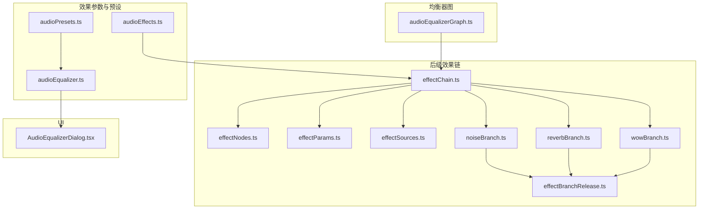
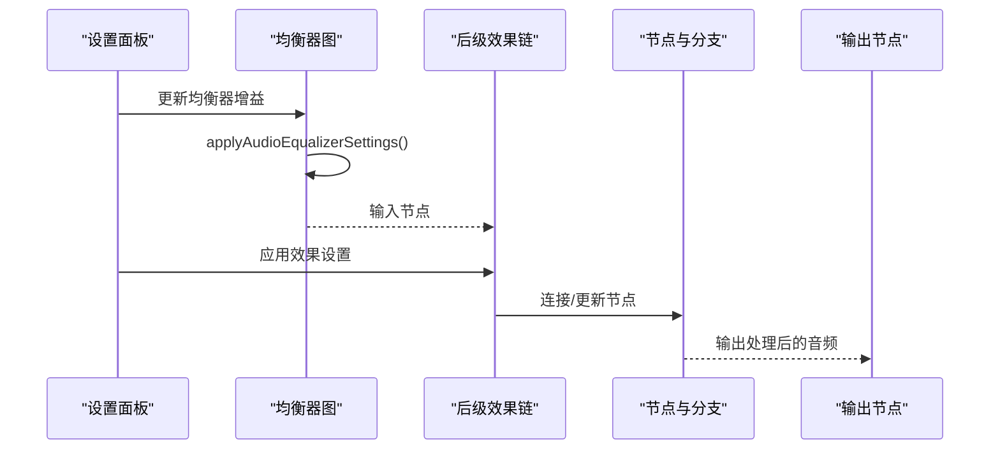
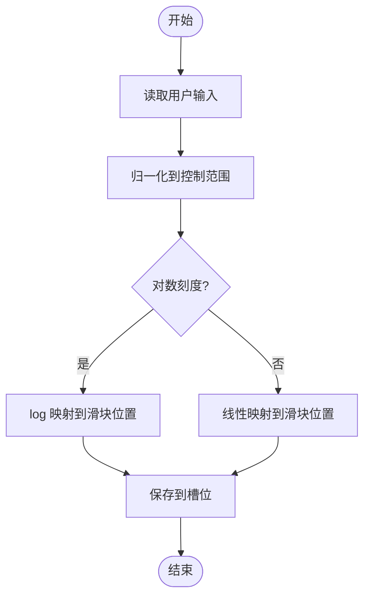
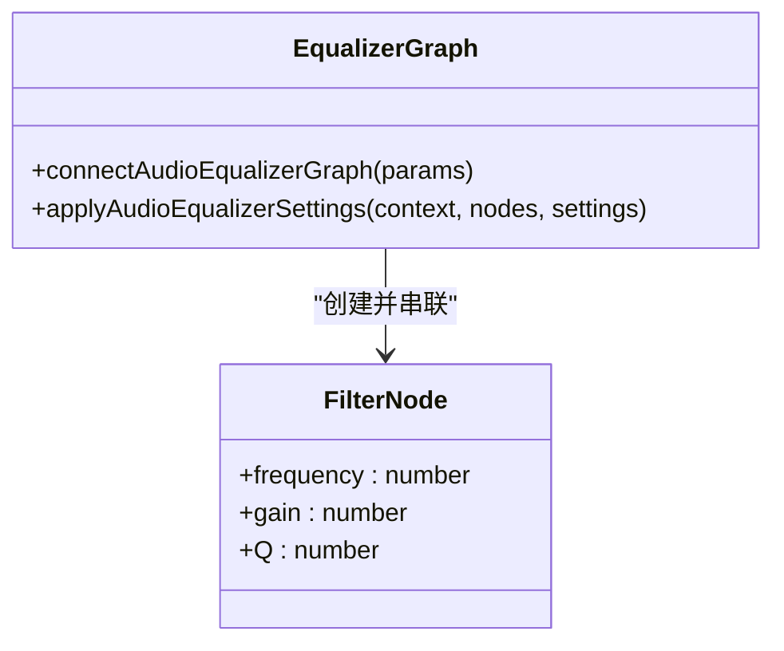
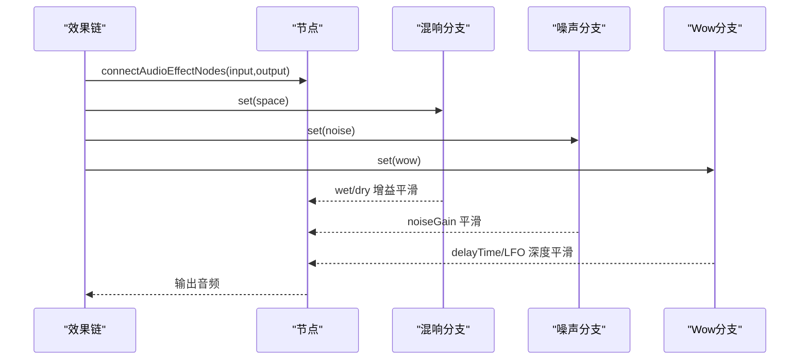
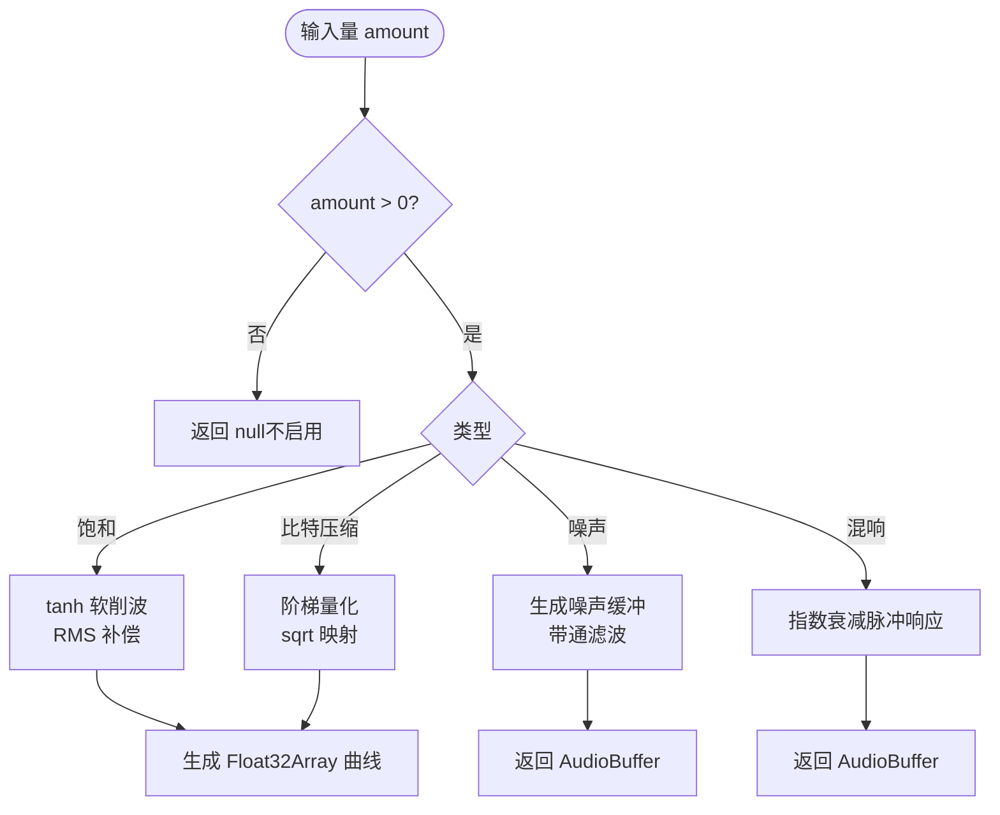
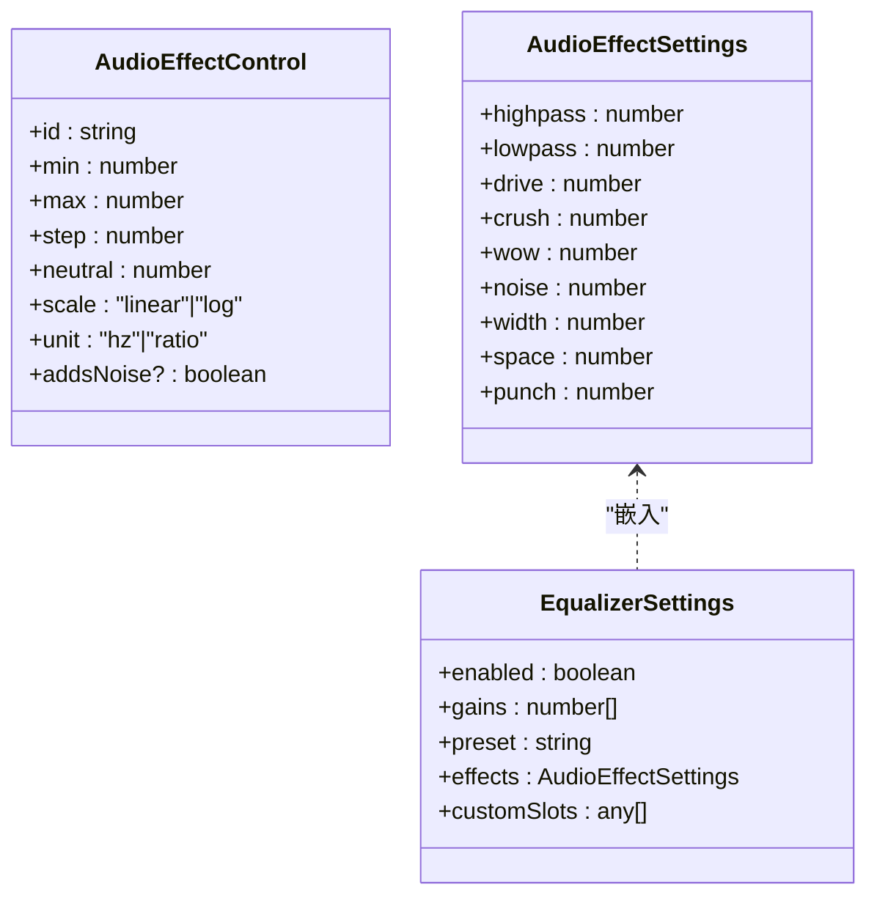
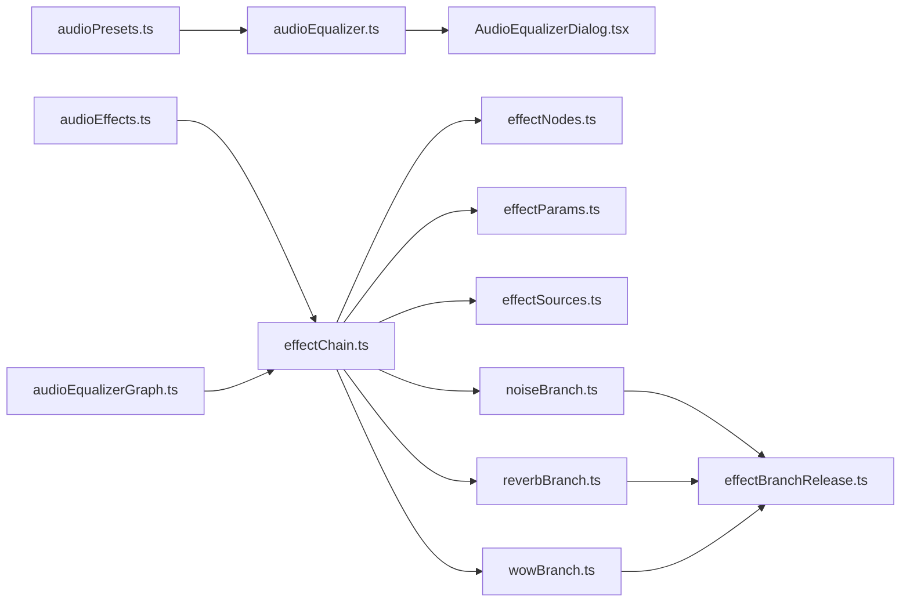

# 自定义效果器开发

<cite>
**本文引用的文件**
- [effectChain.ts](file://src/services/audioEffects/effectChain.ts)
- [effectNodes.ts](file://src/services/audioEffects/effectNodes.ts)
- [effectParams.ts](file://src/services/audioEffects/effectParams.ts)
- [effectSources.ts](file://src/services/audioEffects/effectSources.ts)
- [noiseBranch.ts](file://src/services/audioEffects/noiseBranch.ts)
- [reverbBranch.ts](file://src/services/audioEffects/reverbBranch.ts)
- [wowBranch.ts](file://src/services/audioEffects/wowBranch.ts)
- [effectBranchRelease.ts](file://src/services/audioEffects/effectBranchRelease.ts)
- [audioEffects.ts](file://src/utils/audioEffects.ts)
- [audioEqualizerGraph.ts](file://src/services/audioEqualizerGraph.ts)
- [audioEqualizer.ts](file://src/utils/audioEqualizer.ts)
- [audioPresets.ts](file://src/utils/audioPresets.ts)
- [AudioEqualizerDialog.tsx](file://src/components/panelTab/AudioEqualizerDialog.tsx)
- [audioEffectChain.test.ts](file://test/unit/services/audioEffectChain.test.ts)
- [audioEffectSources.test.ts](file://test/unit/services/audioEffectSources.test.ts)
</cite>

## 目录
1. [简介](#简介)
2. [项目结构](#项目结构)
3. [核心组件](#核心组件)
4. [架构总览](#架构总览)
5. [详细组件分析](#详细组件分析)
6. [依赖关系分析](#依赖关系分析)
7. [性能考量](#性能考量)
8. [故障排查指南](#故障排查指南)
9. [结论](#结论)
10. [附录](#附录)

## 简介
本指南面向希望在本项目中扩展或开发“自定义音频效果器”的工程师，围绕以下目标展开：
- 效果器接口定义与实现规范（参数、范围、动画过渡、持久化）
- AudioNode 封装与链式连接（EQ 与后级效果链）
- UI 控件集成与配置加载
- 效果器的注册机制与动态加载策略
- 测试与调试方法（单元、集成、性能、音质评估）
- 实际示例与最佳实践

本项目已提供一套成熟的 Web Audio 效果系统：以十段均衡器为前端音色塑造，以“后级效果链”完成饱和失真、比特压缩、Wow/Flutter、黑胶噪声、立体声宽度、动态压缩与混响等处理。所有参数通过统一的模型与工具函数进行归一化、映射与平滑过渡，UI 层与音频路径解耦，确保高帧率下的稳定表现。

## 项目结构
围绕音频效果的核心代码分布在 services 与 utils 两个层次：
- services/audioEffects：效果链构建、节点创建与连接、分支模块（噪声、混响、Wow/Flutter）、参数缓动与释放管理
- utils：效果参数模型、预设、滑块映射、格式化；均衡器图构建与设置应用
- components：设置面板与对话框，负责将用户操作写入持久化槽位并触发更新
- test：针对效果链与源生成的单元测试

**图表来源**
- [effectChain.ts:1-94](file://src/services/audioEffects/effectChain.ts#L1-L94)
- [effectNodes.ts:1-126](file://src/services/audioEffects/effectNodes.ts#L1-L126)
- [effectParams.ts:1-17](file://src/services/audioEffects/effectParams.ts#L1-L17)
- [effectSources.ts:1-95](file://src/services/audioEffects/effectSources.ts#L1-L95)
- [noiseBranch.ts:1-60](file://src/services/audioEffects/noiseBranch.ts#L1-L60)
- [reverbBranch.ts:1-49](file://src/services/audioEffects/reverbBranch.ts#L1-L49)
- [wowBranch.ts:1-76](file://src/services/audioEffects/wowBranch.ts#L1-L76)
- [effectBranchRelease.ts:1-29](file://src/services/audioEffects/effectBranchRelease.ts#L1-L29)
- [audioEffects.ts:1-122](file://src/utils/audioEffects.ts#L1-L122)
- [audioEqualizerGraph.ts:1-59](file://src/services/audioEqualizerGraph.ts#L1-L59)
- [audioEqualizer.ts:1-228](file://src/utils/audioEqualizer.ts#L1-L228)
- [audioPresets.ts:1-83](file://src/utils/audioPresets.ts#L1-L83)
- [AudioEqualizerDialog.tsx:55-91](file://src/components/panelTab/AudioEqualizerDialog.tsx#L55-L91)

**章节来源**
- [effectChain.ts:1-94](file://src/services/audioEffects/effectChain.ts#L1-L94)
- [effectNodes.ts:1-126](file://src/services/audioEffects/effectNodes.ts#L1-L126)
- [effectParams.ts:1-17](file://src/services/audioEffects/effectParams.ts#L1-L17)
- [effectSources.ts:1-95](file://src/services/audioEffects/effectSources.ts#L1-L95)
- [noiseBranch.ts:1-60](file://src/services/audioEffects/noiseBranch.ts#L1-L60)
- [reverbBranch.ts:1-49](file://src/services/audioEffects/reverbBranch.ts#L1-L49)
- [wowBranch.ts:1-76](file://src/services/audioEffects/wowBranch.ts#L1-L76)
- [effectBranchRelease.ts:1-29](file://src/services/audioEffects/effectBranchRelease.ts#L1-L29)
- [audioEffects.ts:1-122](file://src/utils/audioEffects.ts#L1-L122)
- [audioEqualizerGraph.ts:1-59](file://src/services/audioEqualizerGraph.ts#L1-L59)
- [audioEqualizer.ts:1-228](file://src/utils/audioEqualizer.ts#L1-L228)
- [audioPresets.ts:1-83](file://src/utils/audioPresets.ts#L1-L83)
- [AudioEqualizerDialog.tsx:55-91](file://src/components/panelTab/AudioEqualizerDialog.tsx#L55-L91)

## 核心组件
- 效果参数模型与工具
  - 统一的效果 ID、控制项定义、默认值、归一化、滑块映射与格式化
  - 支持线性/对数刻度、单位显示、额外噪声提示
- 均衡器图
  - 创建稳定的十段滤波器链，避免 React 重渲染进入音频路径
  - 平滑应用增益变化，保持低延迟与无爆音
- 后级效果链
  - 串联高通/低通、饱和失真、比特压缩、Wow/Flutter、立体声宽度、动态压缩、干湿混合与混响
  - 分支模块按需创建与释放，减少资源占用
- 参数缓动与释放
  - 使用 setTargetAtTime 实现平滑过渡
  - 延迟释放定时器避免频繁启停导致的抖动

**章节来源**
- [audioEffects.ts:1-122](file://src/utils/audioEffects.ts#L1-L122)
- [audioEqualizerGraph.ts:1-59](file://src/services/audioEqualizerGraph.ts#L1-L59)
- [effectChain.ts:1-94](file://src/services/audioEffects/effectChain.ts#L1-L94)
- [effectParams.ts:1-17](file://src/services/audioEffects/effectParams.ts#L1-L17)
- [effectBranchRelease.ts:1-29](file://src/services/audioEffects/effectBranchRelease.ts#L1-L29)

## 架构总览
下图展示了从输入到输出的完整信号流，以及 UI 与设置的交互方式。

**图表来源**
- [audioEqualizerGraph.ts:20-59](file://src/services/audioEqualizerGraph.ts#L20-L59)
- [effectChain.ts:31-94](file://src/services/audioEffects/effectChain.ts#L31-L94)
- [effectNodes.ts:90-126](file://src/services/audioEffects/effectNodes.ts#L90-L126)

## 详细组件分析

### 效果参数系统与 UI 集成
- 参数定义
  - 每个效果拥有 id、min/max/step、neutral、scale、unit，以及可选 addsNoise 标记
  - 提供默认设置、归一化、相等性比较、中性状态判断
- 滑块映射
  - 对数刻度在 UI 上采用 log 映射，保证低频截止频率的可操作性
  - 提供双向转换：数值↔滑块位置，并保留步进精度
- UI 写入
  - 编辑始终写入当前活动槽位或首个内置槽位，保存 gains 与 effects
  - 支持预设与自定义槽位的切换与迁移

**图表来源**
- [audioEffects.ts:41-122](file://src/utils/audioEffects.ts#L41-L122)
- [AudioEqualizerDialog.tsx:73-91](file://src/components/panelTab/AudioEqualizerDialog.tsx#L73-L91)

**章节来源**
- [audioEffects.ts:1-122](file://src/utils/audioEffects.ts#L1-L122)
- [AudioEqualizerDialog.tsx:55-91](file://src/components/panelTab/AudioEqualizerDialog.tsx#L55-L91)

### 均衡器图（十段滤波器）
- 创建稳定的 BiquadFilterNode 链，首尾分别为 lowshelf/highshelf，中间为 peaking
- 频率上限受采样率限制，避免 Nyquist 以上失真
- 应用增益时使用 setTargetAtTime 平滑过渡，避免点击声

**图表来源**
- [audioEqualizerGraph.ts:20-59](file://src/services/audioEqualizerGraph.ts#L20-L59)

**章节来源**
- [audioEqualizerGraph.ts:1-59](file://src/services/audioEqualizerGraph.ts#L1-L59)

### 后级效果链（饱和、比特压缩、Wow/Flutter、噪声、宽度、压缩、混响）
- 节点创建与连接
  - 高通/低通滤波、WaveShaper（饱和/比特压缩）、Delay（Wow/Flutter）、ChannelSplit/Merge（立体声宽度）、DynamicsCompressor、Gain（干湿混合）、噪声增益
- 分支模块
  - 噪声：带通滤波的循环噪声缓冲，音量渐变接入输出
  - 混响：卷积混响，湿路增益提升同时干路略降以保持总体电平
  - Wow/Flutter：双 LFO 调制 Delay 时间，模拟磁带/黑胶音高漂移
- 参数缓动
  - 使用 rampParam 对所有 AudioParam 进行平滑过渡，避免突变
- 资源释放
  - 分支模块在关闭时延迟释放，避免快速切换导致资源抖动

**图表来源**
- [effectChain.ts:31-94](file://src/services/audioEffects/effectChain.ts#L31-L94)
- [effectNodes.ts:28-126](file://src/services/audioEffects/effectNodes.ts#L28-L126)
- [reverbBranch.ts:10-49](file://src/services/audioEffects/reverbBranch.ts#L10-L49)
- [noiseBranch.ts:10-60](file://src/services/audioEffects/noiseBranch.ts#L10-L60)
- [wowBranch.ts:9-76](file://src/services/audioEffects/wowBranch.ts#L9-L76)

**章节来源**
- [effectChain.ts:1-94](file://src/services/audioEffects/effectChain.ts#L1-L94)
- [effectNodes.ts:1-126](file://src/services/audioEffects/effectNodes.ts#L1-L126)
- [reverbBranch.ts:1-49](file://src/services/audioEffects/reverbBranch.ts#L1-L49)
- [noiseBranch.ts:1-60](file://src/services/audioEffects/noiseBranch.ts#L1-L60)
- [wowBranch.ts:1-76](file://src/services/audioEffects/wowBranch.ts#L1-L76)

### 波形曲线与脉冲响应生成
- 饱和曲线
  - 使用 tanh 软削波，幅度补偿使 RMS 匹配参考正弦，避免整体响度提升
  - 过采样设置为 4x，减少高频谐波混叠
- 比特压缩曲线
  - 阶梯量化曲线，模拟低位深转换器，滑块平方根映射使可听区间居中
- 黑胶噪声缓冲
  - 混合持续嘶声与稀疏衰减爆裂，带通滤波使其融入音乐频谱
- 混响脉冲响应
  - 指数衰减噪声，用于卷积混响

**图表来源**
- [effectSources.ts:24-95](file://src/services/audioEffects/effectSources.ts#L24-L95)

**章节来源**
- [effectSources.ts:1-95](file://src/services/audioEffects/effectSources.ts#L1-L95)

### 参数系统的扩展方法
- 自定义参数类型
  - 在 AUDIO_EFFECT_CONTROLS 中新增条目，定义 id、范围、步进、中性值、刻度、单位
  - 若该参数会引入底噪，设置 addsNoise 以便 UI 提示
- 范围与动画过渡
  - 使用 clampEffectValue 与 sliderPositionToAudioEffect 保证范围与步进
  - 所有 AudioParam 通过 rampParam 平滑过渡，避免突变
- 持久化存储
  - 均衡器设置包含 gains、effects、preset、customSlots
  - 读取/写入 localStorage，兼容旧版单槽与退役预设迁移
  - 预设携带完整的 effects 状态，便于一键还原音色

**图表来源**
- [audioEffects.ts:4-56](file://src/utils/audioEffects.ts#L4-L56)
- [audioEqualizer.ts:9-20](file://src/utils/audioEqualizer.ts#L9-L20)

**章节来源**
- [audioEffects.ts:1-122](file://src/utils/audioEffects.ts#L1-L122)
- [audioEqualizer.ts:1-228](file://src/utils/audioEqualizer.ts#L1-L228)

### 效果器的注册机制与动态加载
- 发现与配置加载
  - 效果参数由常量数组定义，UI 根据控制项自动渲染控件
  - 预设与自定义槽位作为配置载体，读取本地存储并应用到运行时
- 动态加载
  - 分支模块（噪声、混响、Wow/Flutter）在首次启用时创建，关闭后延迟释放
  - 通过 createReleaseTimer 避免频繁启停带来的抖动与资源浪费
- 插件化建议（基于现有模式）
  - 新增效果可遵循“分支模块”模式：提供 set(amount)、dispose() 接口
  - 在 effectChain 中按信号流插入新分支，并通过 effectParams 进行参数缓动
  - 在 audioEffects.ts 中声明新的控制项，并在 normalizeAudioEffects 中纳入归一化流程

**章节来源**
- [effectBranchRelease.ts:1-29](file://src/services/audioEffects/effectBranchRelease.ts#L1-L29)
- [effectChain.ts:31-94](file://src/services/audioEffects/effectChain.ts#L31-L94)
- [audioEffects.ts:71-80](file://src/utils/audioEffects.ts#L71-L80)

### 测试与调试方法
- 单元测试
  - 针对效果链与源生成编写用例，验证曲线形状、缓冲长度、边界条件
  - 示例：效果链初始化、参数归一化、分支释放逻辑
- 集成测试
  - 结合播放上下文，验证整条链路从输入到输出的连通性与参数生效
- 性能分析
  - 关注 WaveShaper 过采样、Convolver 缓冲大小、LFO 数量与频率
  - 使用浏览器性能面板观察音频线程耗时与 GC 压力
- 音质评估
  - 主观听感：对比不同预设与参数组合，检查是否引入不必要的底噪或失真
  - 客观指标：THD、RMS、频响曲线、动态范围

**章节来源**
- [audioEffectChain.test.ts](file://test/unit/services/audioEffectChain.test.ts)
- [audioEffectSources.test.ts](file://test/unit/services/audioEffectSources.test.ts)

## 依赖关系分析
- 模块耦合
  - effectChain 依赖 effectNodes、effectParams、effectSources 与各分支模块
  - 均衡器图独立于后级效果链，但共同作用于同一输入/输出节点
- 外部依赖
  - Web Audio API：BiquadFilterNode、WaveShaperNode、DynamicsCompressorNode、ConvolverNode、OscillatorNode、DelayNode、ChannelSplitter/Merger
- 潜在循环依赖
  - 当前结构清晰，未见循环导入；新增模块应遵循单向依赖原则

**图表来源**
- [effectChain.ts:1-94](file://src/services/audioEffects/effectChain.ts#L1-L94)
- [effectNodes.ts:1-126](file://src/services/audioEffects/effectNodes.ts#L1-L126)
- [effectParams.ts:1-17](file://src/services/audioEffects/effectParams.ts#L1-L17)
- [effectSources.ts:1-95](file://src/services/audioEffects/effectSources.ts#L1-L95)
- [noiseBranch.ts:1-60](file://src/services/audioEffects/noiseBranch.ts#L1-L60)
- [reverbBranch.ts:1-49](file://src/services/audioEffects/reverbBranch.ts#L1-L49)
- [wowBranch.ts:1-76](file://src/services/audioEffects/wowBranch.ts#L1-L76)
- [effectBranchRelease.ts:1-29](file://src/services/audioEffects/effectBranchRelease.ts#L1-L29)
- [audioEffects.ts:1-122](file://src/utils/audioEffects.ts#L1-L122)
- [audioEqualizerGraph.ts:1-59](file://src/services/audioEqualizerGraph.ts#L1-L59)
- [audioEqualizer.ts:1-228](file://src/utils/audioEqualizer.ts#L1-L228)
- [audioPresets.ts:1-83](file://src/utils/audioPresets.ts#L1-L83)
- [AudioEqualizerDialog.tsx:55-91](file://src/components/panelTab/AudioEqualizerDialog.tsx#L55-L91)

**章节来源**
- [effectChain.ts:1-94](file://src/services/audioEffects/effectChain.ts#L1-L94)
- [audioEffects.ts:1-122](file://src/utils/audioEffects.ts#L1-L122)
- [audioEqualizerGraph.ts:1-59](file://src/services/audioEqualizerGraph.ts#L1-L59)

## 性能考量
- 过采样与混叠
  - WaveShaper 使用 4x 过采样以减少高频谐波混叠，注意 CPU 开销
- 卷积混响
  - 脉冲响应长度影响内存与计算量，合理设置秒数与衰减参数
- LFO 与 Delay
  - Wow/Flutter 的双 LFO 频率与深度需平衡听感与性能
- 参数更新频率
  - 使用 setTargetAtTime 平滑过渡，避免每帧更新造成抖动
- 资源释放
  - 分支模块延迟释放，减少频繁启停带来的抖动与 GC 压力

[本节为通用指导，无需特定文件引用]

## 故障排查指南
- 无声或断连
  - 检查 connectAudioEffectNodes 的连接顺序与断开逻辑
  - 确认输入/输出节点生命周期与上下文状态
- 爆音或点击声
  - 确认所有 AudioParam 更新使用 rampParam，避免跳变
  - 检查增益阶跃与压缩阈值设置
- 底噪异常
  - 检查 noise 分支与 addsNoise 标记，确认是否为预期噪声
  - 验证黑胶噪声缓冲与带通滤波参数
- 资源泄漏
  - 确认分支模块 dispose 调用与 release 定时器取消
  - 检查 Oscillator 与 BufferSource 的停止与断开

**章节来源**
- [effectNodes.ts:118-126](file://src/services/audioEffects/effectNodes.ts#L118-L126)
- [effectParams.ts:6-17](file://src/services/audioEffects/effectParams.ts#L6-L17)
- [noiseBranch.ts:15-58](file://src/services/audioEffects/noiseBranch.ts#L15-L58)
- [reverbBranch.ts:14-46](file://src/services/audioEffects/reverbBranch.ts#L14-L46)
- [wowBranch.ts:16-73](file://src/services/audioEffects/wowBranch.ts#L16-L73)

## 结论
本项目提供了完整且可扩展的自定义音频效果器体系：
- 参数系统统一、UI 与音频路径解耦
- 效果链模块化，支持动态加载与延迟释放
- 预设与槽位机制便于配置管理与迁移
- 测试覆盖关键路径，保障稳定性与音质

遵循本文档的规范与示例，开发者可以高效地添加新效果、扩展参数类型、优化性能与音质，并确保良好的用户体验。

[本节为总结，无需特定文件引用]

## 附录
- 常用工具函数路径
  - 参数归一化与映射：[audioEffects.ts](file://src/utils/audioEffects.ts)
  - 均衡器图构建与应用：[audioEqualizerGraph.ts](file://src/services/audioEqualizerGraph.ts)
  - 效果链入口：[effectChain.ts](file://src/services/audioEffects/effectChain.ts)
  - 分支模块：[noiseBranch.ts](file://src/services/audioEffects/noiseBranch.ts)、[reverbBranch.ts](file://src/services/audioEffects/reverbBranch.ts)、[wowBranch.ts](file://src/services/audioEffects/wowBranch.ts)
  - 源生成：[effectSources.ts](file://src/services/audioEffects/effectSources.ts)
  - 参数缓动与释放：[effectParams.ts](file://src/services/audioEffects/effectParams.ts)、[effectBranchRelease.ts](file://src/services/audioEffects/effectBranchRelease.ts)
  - 预设与槽位：[audioPresets.ts](file://src/utils/audioPresets.ts)、[audioEqualizer.ts](file://src/utils/audioEqualizer.ts)
  - UI 集成：[AudioEqualizerDialog.tsx](file://src/components/panelTab/AudioEqualizerDialog.tsx)
  - 测试用例：[audioEffectChain.test.ts](file://test/unit/services/audioEffectChain.test.ts)、[audioEffectSources.test.ts](file://test/unit/services/audioEffectSources.test.ts)

[本节为索引，无需特定文件引用]