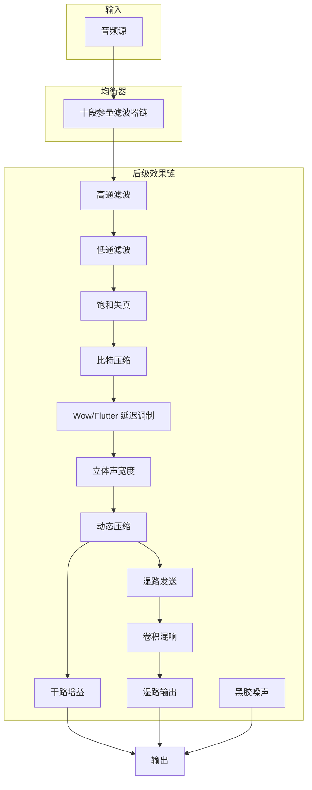
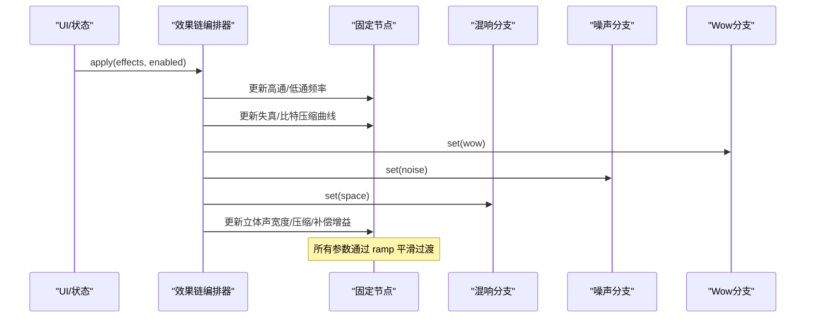
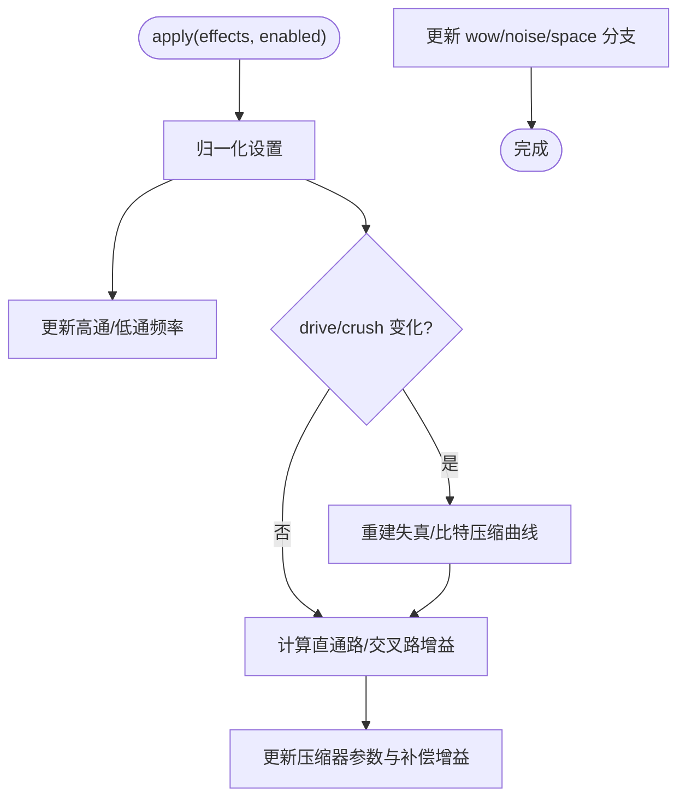
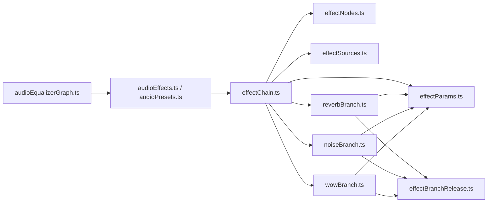

# 音频效果系统

<cite>
**本文引用的文件**
- [effectChain.ts](file://src/services/audioEffects/effectChain.ts)
- [effectNodes.ts](file://src/services/audioEffects/effectNodes.ts)
- [effectParams.ts](file://src/services/audioEffects/effectParams.ts)
- [effectSources.ts](file://src/services/audioEffects/effectSources.ts)
- [reverbBranch.ts](file://src/services/audioEffects/reverbBranch.ts)
- [wowBranch.ts](file://src/services/audioEffects/wowBranch.ts)
- [noiseBranch.ts](file://src/services/audioEffects/noiseBranch.ts)
- [effectBranchRelease.ts](file://src/services/audioEffects/effectBranchRelease.ts)
- [audioEffects.ts](file://src/utils/audioEffects.ts)
- [audioEqualizer.ts](file://src/utils/audioEqualizer.ts)
- [audioEqualizerGraph.ts](file://src/services/audioEqualizerGraph.ts)
- [audioPresets.ts](file://src/utils/audioPresets.ts)
</cite>

## 目录
1. [简介](#简介)
2. [项目结构](#项目结构)
3. [核心组件](#核心组件)
4. [架构总览](#架构总览)
5. [详细组件分析](#详细组件分析)
6. [依赖关系分析](#依赖关系分析)
7. [性能考量](#性能考量)
8. [故障排查指南](#故障排查指南)
9. [结论](#结论)
10. [附录](#附录)

## 简介
本技术文档围绕 Folia Player 的音频效果系统，系统性解析其节点式效果链、信号流向控制与实时参数调节机制；深入说明内置效果器的 DSP 原理与使用方法；评估当前实现中关于 3D 音频空间化处理的现状与扩展方向；总结异步处理、批处理更新、内存池管理等性能优化策略；并提供自定义效果器开发规范与质量评估、调试工具建议，帮助开发者高效构建高质量音频体验。

## 项目结构
音频效果系统由“均衡器（EQ）”和“后级效果链（Post-EQ Effects Chain）”两部分组成：
- 均衡器：十段参量滤波器，负责频响塑形。
- 后级效果链：在 EQ 之后串联高通/低通、失真饱和、比特压缩、Wow/Flutter 抖动、立体声宽度、动态压缩、混响与黑胶噪声等模块，形成可插拔、可实时调节的效果网络。

图表来源
- [effectChain.ts:31-93](file://src/services/audioEffects/effectChain.ts#L31-L93)
- [effectNodes.ts:28-116](file://src/services/audioEffects/effectNodes.ts#L28-L116)
- [reverbBranch.ts:10-48](file://src/services/audioEffects/reverbBranch.ts#L10-L48)
- [noiseBranch.ts:10-59](file://src/services/audioEffects/noiseBranch.ts#L10-L59)
- [wowBranch.ts:9-75](file://src/services/audioEffects/wowBranch.ts#L9-L75)

章节来源
- [effectChain.ts:31-93](file://src/services/audioEffects/effectChain.ts#L31-L93)
- [effectNodes.ts:28-116](file://src/services/audioEffects/effectNodes.ts#L28-L116)
- [audioEqualizerGraph.ts:20-59](file://src/services/audioEqualizerGraph.ts#L20-L59)

## 核心组件
- 效果链编排器：创建并连接所有固定节点，提供 apply/dispose 接口以批量更新参数与生命周期管理。
- 节点工厂：集中分配 BiquadFilter、WaveShaper、Delay、Splitter/Merger、Compressor、Gain 等节点，并设置中性默认值。
- 分支效果器：混响、Wow/Flutter、黑胶噪声作为可选并行分支，按需启用/释放，避免常驻开销。
- 参数平滑：统一使用 ramp 函数对 AudioParam 进行目标时间渐变，消除突变噪声。
- 曲线与缓冲生成：饱和失真曲线、比特压缩曲线、黑胶噪声缓冲、混响脉冲响应均由数学模型生成。
- 均衡器图：十段参量滤波器链，独立于 React 渲染路径，保证音频线程稳定。
- 预设与配置：统一的音效设置模型、滑块映射、归一化与持久化逻辑。

章节来源
- [effectChain.ts:31-93](file://src/services/audioEffects/effectChain.ts#L31-L93)
- [effectNodes.ts:28-116](file://src/services/audioEffects/effectNodes.ts#L28-L116)
- [effectParams.ts:6-16](file://src/services/audioEffects/effectParams.ts#L6-L16)
- [effectSources.ts:24-94](file://src/services/audioEffects/effectSources.ts#L24-L94)
- [audioEqualizerGraph.ts:20-59](file://src/services/audioEqualizerGraph.ts#L20-L59)
- [audioEffects.ts:4-122](file://src/utils/audioEffects.ts#L4-L122)

## 架构总览
效果链采用“串行主干 + 并行分支”的拓扑：
- 串行主干：高通 → 低通 → 饱和失真 → 比特压缩 → Wow/Flutter → 立体声宽度 → 动态压缩 → 干湿混合。
- 并行分支：
  - 混响：通过 ConvolverNode 将湿路发送接入，按 amount 控制干湿比。
  - 黑胶噪声：带通滤波后的循环噪声直接注入输出。
  - Wow/Flutter：两个 LFO 调制 DelayNode 的 delayTime，模拟磁带/黑胶音高漂移。

图表来源
- [effectChain.ts:47-80](file://src/services/audioEffects/effectChain.ts#L47-L80)
- [effectParams.ts:6-16](file://src/services/audioEffects/effectParams.ts#L6-L16)
- [reverbBranch.ts:21-42](file://src/services/audioEffects/reverbBranch.ts#L21-L42)
- [noiseBranch.ts:29-53](file://src/services/audioEffects/noiseBranch.ts#L29-L53)
- [wowBranch.ts:45-69](file://src/services/audioEffects/wowBranch.ts#L45-L69)

## 详细组件分析

### 效果链编排器（Effect Chain）
- 职责：封装 createAudioEffectNodes/connectAudioEffectNodes，维护 reverb/noise/wow 三个分支的生命周期，提供 apply 批量更新与 dispose 释放。
- 关键流程：
  - 根据 enabled 选择实际生效的设置或中性设置。
  - 高频/低频截止点限制到 Nyquist 以下，避免混叠。
  - 驱动与比特压缩仅在数值变化时重建曲线，减少 CPU。
  - 立体声宽度通过左右直通与交叉增益合成 Mid/Side 风格宽度。
  - 压缩阈值、比率、膝点与补偿增益联动，保持整体响度一致。

图表来源
- [effectChain.ts:47-80](file://src/services/audioEffects/effectChain.ts#L47-L80)
- [effectSources.ts:24-58](file://src/services/audioEffects/effectSources.ts#L24-L58)

章节来源
- [effectChain.ts:31-93](file://src/services/audioEffects/effectChain.ts#L31-L93)

### 节点工厂与连接（Effect Nodes）
- 节点清单：高通/低通、饱和失真、比特压缩、Wow 延迟、立体声拆分/合并、压缩器、干湿混合、噪声增益。
- 连接顺序：严格遵循信号流，确保每个阶段处于中性状态直到被参数激活。
- 安全断开：提供 disconnectAudioEffectNodes，捕获已销毁上下文异常，避免崩溃。

章节来源
- [effectNodes.ts:28-126](file://src/services/audioEffects/effectNodes.ts#L28-L126)

### 参数平滑（Effect Params）
- 统一使用 rampParam 对 AudioParam 进行 setTargetAtTime 平滑，避免瞬态爆音。
- 提供 dbToLinear 用于 dB 到线性增益转换，确保压缩补偿正确。

章节来源
- [effectParams.ts:6-16](file://src/services/audioEffects/effectParams.ts#L6-L16)

### 曲线与缓冲生成（Effect Sources）
- 饱和失真曲线：tanh 软削波，参考正弦能量匹配，避免响度跃升；小信号增益接近 1，保留动态。
- 比特压缩曲线：阶梯量化模拟低比特深度，平方根映射使常用位深范围居中。
- 黑胶噪声缓冲：持续底噪 + 稀疏衰减爆裂声，双声道独立生成。
- 混响脉冲响应：指数衰减噪声，长度与衰减系数可调。

章节来源
- [effectSources.ts:24-94](file://src/services/audioEffects/effectSources.ts#L24-L94)

### 混响分支（Reverb Branch）
- 懒加载：首次启用时创建 ConvolverNode 与脉冲响应，关闭后延迟释放，避免频繁创建销毁。
- 干湿混合：wet 上升时略降 dry，保持总体响度稳定。

章节来源
- [reverbBranch.ts:10-48](file://src/services/audioEffects/reverbBranch.ts#L10-L48)

### Wow/Flutter 分支（Wow Branch）
- 双 LFO 调制：慢速 Wow（~0.7Hz）与快速 Flutter（~6.8Hz）叠加至 DelayNode 的 delayTime。
- 延迟基准：基础延迟时间常量，幅度随 amount 线性缩放。

章节来源
- [wowBranch.ts:9-75](file://src/services/audioEffects/wowBranch.ts#L9-L75)

### 黑胶噪声分支（Noise Branch）
- 带通滤波：将噪声塑造为贴合音乐频谱的底噪，避免突兀。
- 循环播放：BufferSource 循环播放预生成噪声缓冲，音量按幂律映射。

章节来源
- [noiseBranch.ts:10-59](file://src/services/audioEffects/noiseBranch.ts#L10-L59)

### 分支释放计时器（Effect Branch Release）
- 延迟释放：当分支关闭时，延迟一段时间再执行 teardown，若期间重新开启则取消释放，减少抖动。

章节来源
- [effectBranchRelease.ts:1-29](file://src/services/audioEffects/effectBranchRelease.ts#L1-L29)

### 均衡器（Equalizer Graph）
- 十段参量滤波器：首尾为 shelving，中间为 peaking，Q 值固定，频率上限受采样率限制。
- 平滑更新：对每个滤波器增益使用 setTargetAtTime 平滑过渡，避免 React 渲染阻塞音频路径。

章节来源
- [audioEqualizerGraph.ts:20-59](file://src/services/audioEqualizerGraph.ts#L20-L59)

### 音效设置与预设（Audio Effects & Presets）
- 设置模型：统一记录 highpass/lowpass/drive/crush/wow/noise/width/space/punch 九个维度。
- 控件定义：包含最小/最大/步长/中性值/刻度类型/单位，支持对数刻度与格式化显示。
- 归一化：对不信任输入做边界钳制与缺失字段填充，确保运行时安全。
- 预设：内置 flat/lofi/radio/hall/vocal/bass，携带 EQ 增益与完整效果链状态。

章节来源
- [audioEffects.ts:4-122](file://src/utils/audioEffects.ts#L4-L122)
- [audioPresets.ts:1-83](file://src/utils/audioPresets.ts#L1-L83)
- [audioEqualizer.ts:14-228](file://src/utils/audioEqualizer.ts#L14-L228)

## 依赖关系分析
- effectChain 依赖 effectNodes、effectSources、effectParams 以及三个分支模块。
- 分支模块共享 effectParams 与 effectBranchRelease，降低耦合。
- 均衡器与效果链解耦：前者负责频响，后者负责音色与空间感，便于独立升级。
- 预设与设置层为 UI 与运行时提供统一数据契约。

图表来源
- [effectChain.ts:31-93](file://src/services/audioEffects/effectChain.ts#L31-L93)
- [effectNodes.ts:28-116](file://src/services/audioEffects/effectNodes.ts#L28-L116)
- [effectSources.ts:24-94](file://src/services/audioEffects/effectSources.ts#L24-L94)
- [effectParams.ts:6-16](file://src/services/audioEffects/effectParams.ts#L6-L16)
- [reverbBranch.ts:10-48](file://src/services/audioEffects/reverbBranch.ts#L10-L48)
- [noiseBranch.ts:10-59](file://src/services/audioEffects/noiseBranch.ts#L10-L59)
- [wowBranch.ts:9-75](file://src/services/audioEffects/wowBranch.ts#L9-L75)
- [effectBranchRelease.ts:1-29](file://src/services/audioEffects/effectBranchRelease.ts#L1-L29)
- [audioEffects.ts:4-122](file://src/utils/audioEffects.ts#L4-L122)
- [audioPresets.ts:1-83](file://src/utils/audioPresets.ts#L1-L83)
- [audioEqualizerGraph.ts:20-59](file://src/services/audioEqualizerGraph.ts#L20-L59)

## 性能考量
- 参数平滑与批处理：
  - 所有 AudioParam 更新通过 rampParam 使用 setTargetAtTime，避免瞬时跳变导致的爆音与 CPU 峰值。
  - 失真/比特压缩曲线仅在数值变化时重建，减少重复计算。
- 资源懒加载与延迟释放：
  - 混响、Wow/Flutter、噪声分支仅在启用时创建必要节点，关闭后延迟释放，避免频繁创建销毁带来的抖动。
- 采样率保护：
  - 低通截止频率限制在采样率的 0.475 倍以内，防止混叠。
- 响度一致性：
  - 饱和失真曲线进行响度匹配，压缩后通过补偿增益恢复头部空间，保持听感稳定。
- 内存管理：
  - 分支释放通过定时器调度，避免竞态；节点断开前尝试捕获异常，提升鲁棒性。

[本节为通用性能指导，无需特定文件引用]

## 故障排查指南
- 无声或声音异常：
  - 检查效果链是否被禁用或设置为中性；确认 apply 已被调用且 enabled 为真。
  - 验证高通/低通频率是否超出合理范围或被限制到 Nyquist。
- 爆音或瞬态噪声：
  - 确认所有参数更新均通过 rampParam；避免直接赋值导致跳变。
  - 检查失真/比特压缩曲线是否被错误地频繁重建。
- 资源泄漏：
  - 确认分支 dispose 被调用；检查 release 定时器是否被正确取消。
  - 断连时捕获异常，避免在上下文销毁后继续操作。
- 响度不一致：
  - 调整 punch 与补偿增益，确保压缩前后整体响度稳定。
  - 混响 wet/dry 比例切换时注意总体电平变化。

章节来源
- [effectChain.ts:47-93](file://src/services/audioEffects/effectChain.ts#L47-L93)
- [effectParams.ts:6-16](file://src/services/audioEffects/effectParams.ts#L6-L16)
- [effectNodes.ts:118-126](file://src/services/audioEffects/effectNodes.ts#L118-L126)
- [reverbBranch.ts:21-48](file://src/services/audioEffects/reverbBranch.ts#L21-L48)
- [wowBranch.ts:45-75](file://src/services/audioEffects/wowBranch.ts#L45-L75)
- [noiseBranch.ts:29-59](file://src/services/audioEffects/noiseBranch.ts#L29-L59)

## 结论
Folia Player 的音频效果系统以清晰的节点式拓扑与严格的参数平滑机制，实现了高性能、可维护的实时音频处理。通过懒加载与延迟释放的分支设计，系统在音质与资源占用之间取得良好平衡。均衡器与后级效果链解耦，便于独立演进与扩展。当前实现未包含 HRTF 与多声道环绕声的空间化处理，但提供了可扩展的框架与接口，便于未来集成沉浸式音频能力。

[本节为总结性内容，无需特定文件引用]

## 附录

### 内置效果器原理与使用方法
- 均衡器（十段参量滤波器）：
  - 原理：首尾 shelving 与中间 peaking 组合，Q 值固定，频率上限受采样率限制。
  - 使用：通过 applyAudioEqualizerSettings 平滑更新各频段增益。
- 饱和失真（Drive）：
  - 原理：tanh 软削波，响度匹配，小信号增益接近 1，保留动态。
  - 使用：amount 越大谐波越丰富，注意与 punch 配合避免过响。
- 比特压缩（Crush）：
  - 原理：阶梯量化模拟低比特深度，平方根映射使常用位深范围居中。
  - 使用：amount 增加会引入量化噪声，适合 Lo-Fi 风格。
- Wow/Flutter：
  - 原理：双 LFO 调制延迟时间，模拟磁带/黑胶音高漂移。
  - 使用：amount 控制调制深度，适合复古质感。
- 黑胶噪声（Noise）：
  - 原理：带通滤波后的循环噪声，贴合音乐频谱。
  - 使用：amount 控制底噪强度，适合营造氛围。
- 立体声宽度（Width）：
  - 原理：左右直通与交叉增益合成宽度，支持窄/宽/超宽。
  - 使用：width > 1 可产生超宽效果，注意相位问题。
- 动态压缩（Punch）：
  - 原理：阈值、比率、膝点与补偿增益联动，增强打击感。
  - 使用：punch 增大提升瞬态与响度，需配合补偿增益。
- 混响（Space）：
  - 原理：卷积混响，指数衰减脉冲响应，懒加载与延迟释放。
  - 使用：space 控制干湿比，wet 上升时 dry 略降以保持总电平。

章节来源
- [audioEqualizerGraph.ts:20-59](file://src/services/audioEqualizerGraph.ts#L20-L59)
- [effectSources.ts:24-94](file://src/services/audioEffects/effectSources.ts#L24-L94)
- [wowBranch.ts:9-75](file://src/services/audioEffects/wowBranch.ts#L9-L75)
- [noiseBranch.ts:10-59](file://src/services/audioEffects/noiseBranch.ts#L10-L59)
- [effectChain.ts:47-80](file://src/services/audioEffects/effectChain.ts#L47-L80)
- [reverbBranch.ts:10-48](file://src/services/audioEffects/reverbBranch.ts#L10-L48)

### 3D 音频空间化处理现状与建议
- 现状：
  - 当前实现未包含 HRTF 与多声道环绕声处理；立体声宽度仅通过增益矩阵实现二维宽度调节。
- 建议扩展：
  - 引入 HRTF 卷积或基于对象的定位算法，结合 Headphone 模式提供沉浸声场。
  - 支持多声道输出（如 5.1/7.1），通过 ChannelMerger/ChannelSplitter 路由至对应声道。
  - 在效果链中插入空间化模块，保持与现有分支一致的懒加载与延迟释放策略。

[本节为概念性扩展建议，无需特定文件引用]

### 自定义效果器开发指南
- 接口定义：
  - 新增分支需实现 { set(amount): void; dispose(): void } 接口，与现有分支保持一致。
- 参数绑定：
  - 在 effectChain.apply 中注册新参数的 ramp 更新，确保平滑过渡。
  - 在 audioEffects 中声明新的 AudioEffectId 与控件定义（min/max/step/neural/scale/unit）。
- UI 集成：
  - 复用 sliderPositionToAudioEffect/audioEffectToSliderPosition 进行 UI 与数值的双向映射。
  - 对于引入噪声的效果，标记 addsNoise 以便 UI 提示用户。
- 性能与资源：
  - 使用懒加载创建节点，关闭后通过 createReleaseTimer 延迟释放。
  - 避免在音频回调中创建对象，提前缓存曲线与缓冲。

章节来源
- [effectBranchRelease.ts:1-29](file://src/services/audioEffects/effectBranchRelease.ts#L1-L29)
- [effectChain.ts:47-93](file://src/services/audioEffects/effectChain.ts#L47-L93)
- [audioEffects.ts:4-122](file://src/utils/audioEffects.ts#L4-L122)

### 质量评估与调试工具
- 单元测试：
  - 针对饱和失真曲线的响度匹配与小信号增益进行断言，确保动态不被破坏。
- 可视化与监听：
  - 在效果链前后插入 AnalyserNode 观察频谱与波形，辅助调参。
  - 使用浏览器开发者工具的 Performance 面板监控音频线程耗时。
- 回归测试：
  - 对预设与效果链变更进行自动化回归，确保向后兼容。

章节来源
- [test/unit/services/audioEffectSources.test.ts:1-61](file://test/unit/services/audioEffectSources.test.ts#L1-L61)