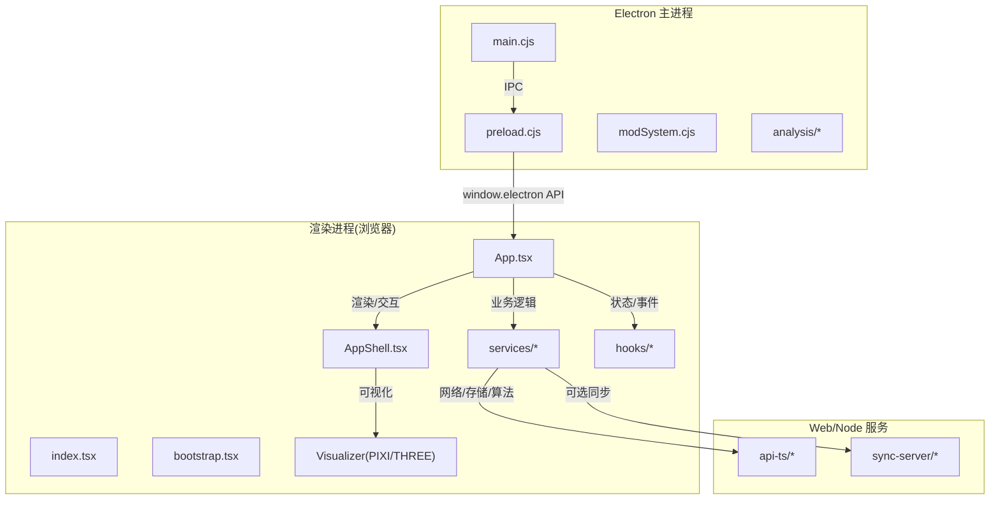
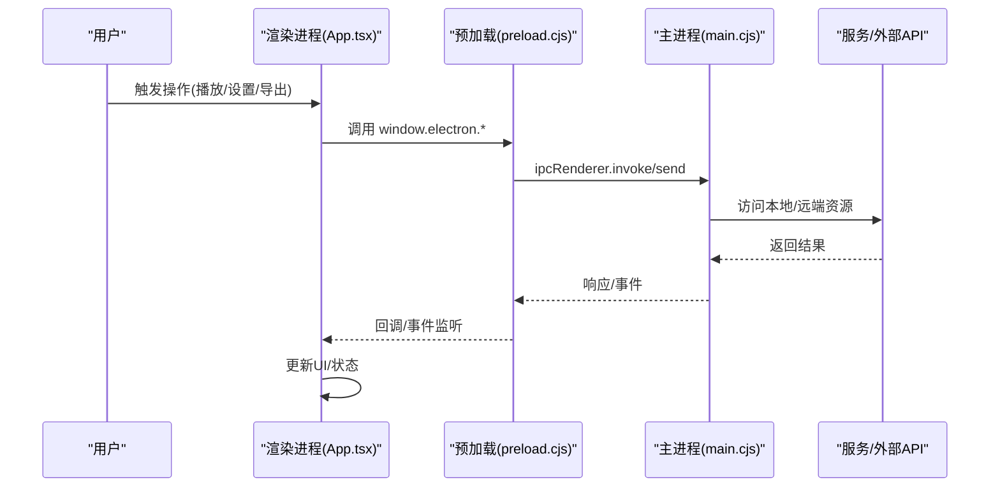
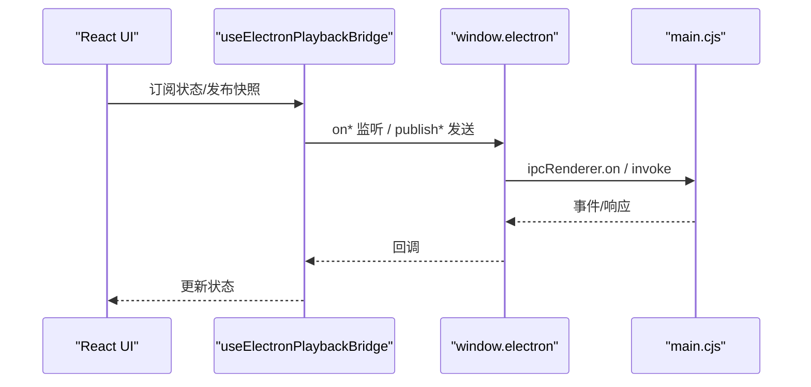
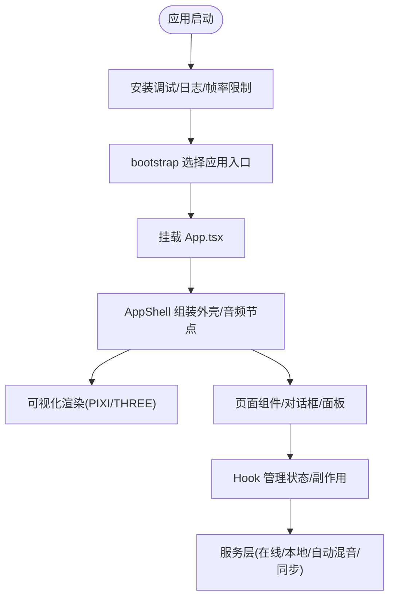
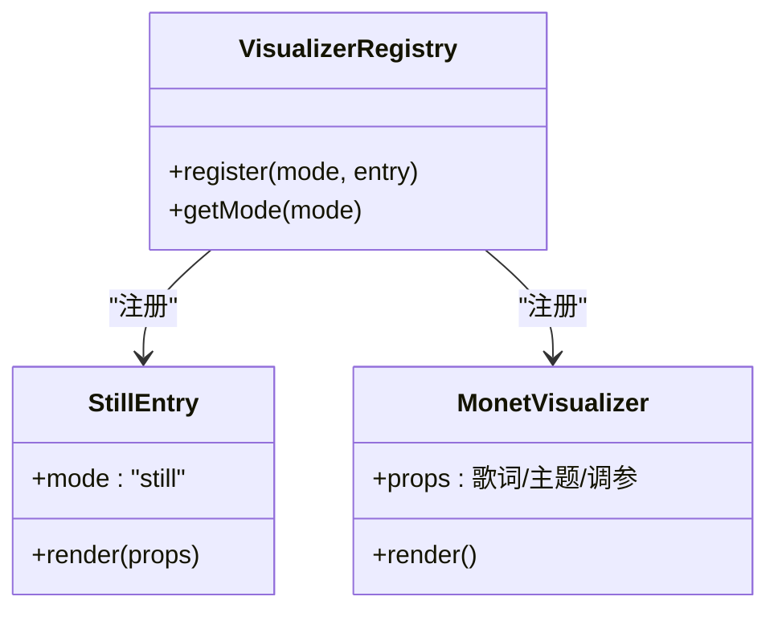
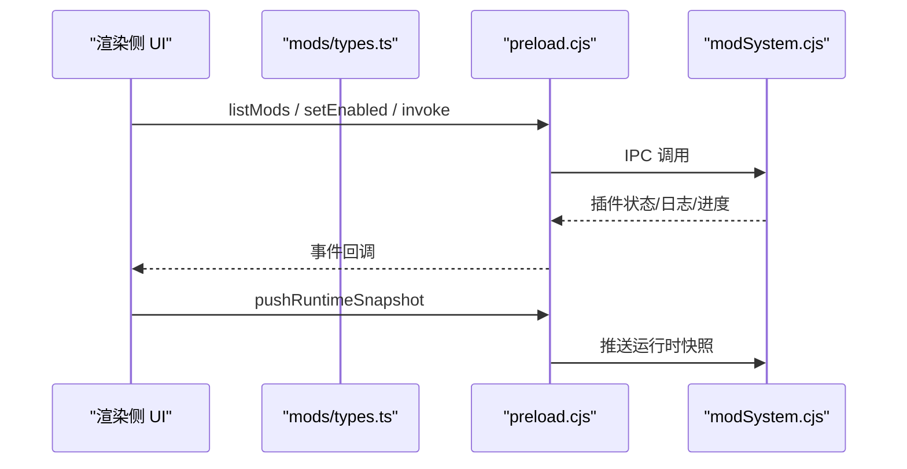
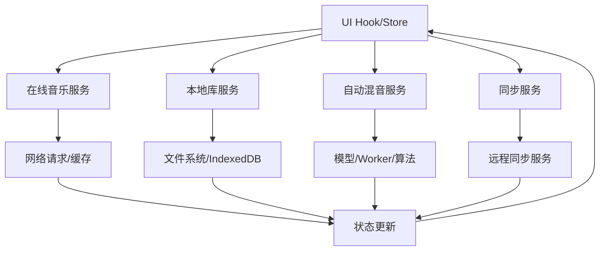
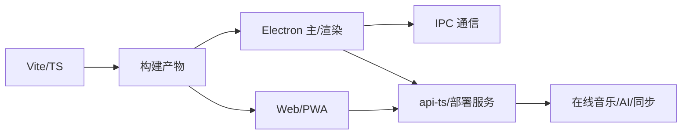

# 技术架构概览

<cite>
**本文引用的文件**
- [package.json](file://package.json)
- [README.md](file://README.md)
- [vite.config.ts](file://vite.config.ts)
- [electron/main.cjs](file://electron/main.cjs)
- [electron/preload.cjs](file://electron/preload.cjs)
- [src/index.tsx](file://src/index.tsx)
- [src/bootstrap.tsx](file://src/bootstrap.tsx)
- [src/App.tsx](file://src/App.tsx)
- [src/components/app/AppShell.tsx](file://src/components/app/AppShell.tsx)
- [src/components/visualizer/still/entry.tsx](file://src/components/visualizer/still/entry.tsx)
- [src/components/visualizer/monet/VisualizerMonet.tsx](file://src/components/visualizer/monet/VisualizerMonet.tsx)
- [src/services/automix/uiYield.ts](file://src/services/automix/uiYield.ts)
- [src/hooks/useElectronPlaybackBridge.ts](file://src/hooks/useElectronPlaybackBridge.ts)
- [src/mods/types.ts](file://src/mods/types.ts)
- [src/services/whisperModService.ts](file://src/services/whisperModService.ts)
- [electron/analysis/modelPaths.cjs](file://electron/analysis/modelPaths.cjs)
</cite>

## 目录
1. [简介](#简介)
2. [项目结构](#项目结构)
3. [核心组件](#核心组件)
4. [架构总览](#架构总览)
5. [详细组件分析](#详细组件分析)
6. [依赖关系分析](#依赖关系分析)
7. [性能考量](#性能考量)
8. [故障排查指南](#故障排查指南)
9. [结论](#结论)
10. [附录](#附录)

## 简介
Folia Player 是一款以全屏沉浸式歌词播放为核心的音乐播放器，提供基于 Electron 的桌面端与基于 Node.js/Vite 的 Web 端两种部署形态。应用采用“主进程 + 渲染进程”的混合架构：Electron 主进程负责系统能力、本地资源、插件系统与平台特性；渲染进程使用 React + TypeScript + Vite 构建前端界面与可视化渲染（Pixi.js / Three.js）。前后端通过 IPC 通信，服务层按领域划分（在线音乐、本地库、自动混音、同步等），并通过 Store/Hook 将状态解耦到 UI。

本概览聚焦以下目标：
- 解释主进程与渲染进程的通信机制
- 梳理前端 React 组件与服务层设计
- 说明模块化架构、插件系统与数据流
- 阐述核心技术选型原因（React 19、TypeScript、Vite、Pixi.js、Three.js）
- 给出架构图表与优化策略

## 项目结构
仓库采用分层与领域混合的组织方式：
- electron/: Electron 主进程、预加载脚本、平台能力封装、插件系统、模型管理
- src/: 前端应用（React + TS）、服务层、组件、Hook、类型定义、Worker
- api-ts/: 服务端 API 实现（用于 Web 部署或云端函数）
- deploy/docker/: Docker Compose 全栈部署（后端、网关、各音乐源 API、同步服务）
- mods/: 插件包（可动态加载的扩展模块）
- sync-server/: 可选的跨设备同步服务端

图表来源
- [electron/main.cjs:1-800](file://electron/main.cjs#L1-L800)
- [electron/preload.cjs:1-320](file://electron/preload.cjs#L1-L320)
- [src/index.tsx:1-18](file://src/index.tsx#L1-L18)
- [src/bootstrap.tsx:1-72](file://src/bootstrap.tsx#L1-L72)
- [src/App.tsx:1-800](file://src/App.tsx#L1-L800)
- [src/components/app/AppShell.tsx:1-42](file://src/components/app/AppShell.tsx#L1-L42)

章节来源
- [package.json:1-256](file://package.json#L1-L256)
- [README.md:66-191](file://README.md#L66-L191)
- [vite.config.ts:139-276](file://vite.config.ts#L139-L276)

## 核心组件
- 启动与入口
  - 渲染进程入口 index.tsx 安装全局调试、日志、帧率限制等运行时能力后异步加载 bootstrap.tsx
  - bootstrap.tsx 根据 URL 参数挂载不同应用（主应用、OBS 源、远程控制），并初始化本地封面运行环境与 Mod 可视化注册
- 主进程
  - main.cjs 负责窗口生命周期、平台特性（壁纸模式、点击穿透、Wayland/X11 兼容）、更新、缓存、OBS/Stage/Lyric API、Discord Rich Presence、Whisper 对齐、模型管理等
  - preload.cjs 通过 contextBridge 暴露安全 API 给渲染进程，屏蔽底层 IPC 细节
- 前端应用
  - App.tsx 聚合播放控制、队列、主题、歌词、可视化、命令面板、设置、OBS/Stage 发布、会话恢复等
  - AppShell.tsx 提供共享外壳（标题栏拖拽区、窗口控件、透明边框、点击穿透开关、音频节点挂载）
- 可视化
  - 多种可视化模式（如 still、monet 等）通过统一注册机制接入，支持 Pixi.js/Three.js 渲染
- 服务层
  - 按领域拆分：在线音乐、本地库、自动混音、同步、音频效果、主题、缓存、媒体会话桥接等
- 插件系统
  - mods 目录下的插件通过主进程加载器发现、启用、执行命令，并在渲染侧暴露 UI 与可视化贡献

章节来源
- [src/index.tsx:1-18](file://src/index.tsx#L1-L18)
- [src/bootstrap.tsx:1-72](file://src/bootstrap.tsx#L1-L72)
- [electron/main.cjs:1-800](file://electron/main.cjs#L1-L800)
- [electron/preload.cjs:1-320](file://electron/preload.cjs#L1-L320)
- [src/App.tsx:1-800](file://src/App.tsx#L1-L800)
- [src/components/app/AppShell.tsx:1-42](file://src/components/app/AppShell.tsx#L1-L42)
- [src/components/visualizer/still/entry.tsx:1-16](file://src/components/visualizer/still/entry.tsx#L1-L16)
- [src/components/visualizer/monet/VisualizerMonet.tsx:24-66](file://src/components/visualizer/monet/VisualizerMonet.tsx#L24-L66)

## 架构总览
整体采用“Electron 主进程 + 渲染进程（React/Vite）+ 可选 Node 服务”的混合部署：
- 桌面端：Electron 主进程承载系统能力，渲染进程通过 preload 暴露的安全 API 调用主进程功能
- Web 端：Vite 构建 SPA/PWA，API 路由由部署环境或自托管服务提供（api-ts）
- 可选同步：sync-server 提供跨设备外观与主题同步

图表来源
- [electron/preload.cjs:1-320](file://electron/preload.cjs#L1-L320)
- [electron/main.cjs:1-800](file://electron/main.cjs#L1-L800)
- [src/App.tsx:1-800](file://src/App.tsx#L1-L800)

## 详细组件分析

### 主进程与渲染进程通信
- 预加载层集中暴露能力：系统窗口控制、更新、缓存、OBS/Stage/Lyric API、Discord、Whisper 对齐、Mod 系统等
- 渲染进程通过 Hook（如 useElectronPlaybackBridge）订阅状态变化并发布快照（如 Now Playing、Stage、Remote Control）
- 主进程处理平台相关逻辑（壁纸模式、点击穿透、Wayland/X11 图形加速、证书信任、单实例锁）

图表来源
- [electron/preload.cjs:1-320](file://electron/preload.cjs#L1-L320)
- [src/hooks/useElectronPlaybackBridge.ts:518-543](file://src/hooks/useElectronPlaybackBridge.ts#L518-L543)
- [electron/main.cjs:1-800](file://electron/main.cjs#L1-L800)

章节来源
- [electron/preload.cjs:1-320](file://electron/preload.cjs#L1-L320)
- [src/hooks/useElectronPlaybackBridge.ts:518-543](file://src/hooks/useElectronPlaybackBridge.ts#L518-L543)
- [electron/main.cjs:1-800](file://electron/main.cjs#L1-L800)

### 前端 React 组件架构
- 入口与挂载：index.tsx -> bootstrap.tsx -> App.tsx
- 外壳与布局：AppShell.tsx 提供统一的窗口装饰、拖拽区、透明边框、点击穿透开关、音频节点挂载点
- 可视化集成：通过 VisualizerRenderer 与多模式注册（如 still、monet），支持 Pixi.js/Three.js 渲染
- 状态与副作用：大量 Hook 封装播放、队列、主题、OBS/Stage、媒体会话、自动混音等

图表来源
- [src/index.tsx:1-18](file://src/index.tsx#L1-L18)
- [src/bootstrap.tsx:1-72](file://src/bootstrap.tsx#L1-L72)
- [src/App.tsx:1-800](file://src/App.tsx#L1-L800)
- [src/components/app/AppShell.tsx:1-42](file://src/components/app/AppShell.tsx#L1-L42)

章节来源
- [src/bootstrap.tsx:1-72](file://src/bootstrap.tsx#L1-L72)
- [src/App.tsx:1-800](file://src/App.tsx#L1-L800)
- [src/components/app/AppShell.tsx:1-42](file://src/components/app/AppShell.tsx#L1-L42)

### 可视化子系统（Pixi.js / Three.js）
- 可视化模式通过统一接口注册（如 still 静态模式、monet 歌词排版模式），便于扩展与维护
- 渲染引擎选择：
  - Pixi.js：适合 2D 高性能渲染（歌词、粒子、纹理）
  - Three.js：用于 3D 场景（如 Diorama 几何体、相机运动、后处理）
- 性能优化：按需加载、分块打包（three 单独 chunk）、帧率限制、视口裁剪、懒加载动画

图表来源
- [src/components/visualizer/still/entry.tsx:1-16](file://src/components/visualizer/still/entry.tsx#L1-L16)
- [src/components/visualizer/monet/VisualizerMonet.tsx:24-66](file://src/components/visualizer/monet/VisualizerMonet.tsx#L24-L66)

章节来源
- [src/components/visualizer/still/entry.tsx:1-16](file://src/components/visualizer/still/entry.tsx#L1-L16)
- [src/components/visualizer/monet/VisualizerMonet.tsx:24-66](file://src/components/visualizer/monet/VisualizerMonet.tsx#L24-L66)

### 插件系统（Mods）
- 主进程加载器负责发现、启用、重载插件，并提供命令执行、导出、FFmpeg 状态等能力
- 渲染侧通过 window.electron.mods.* 与主进程交互，类型契约保持 JSON 序列化安全
- 插件可贡献可视化模式、UI 面板、命令等，形成可扩展生态

图表来源
- [src/mods/types.ts:1-84](file://src/mods/types.ts#L1-L84)
- [electron/preload.cjs:293-318](file://electron/preload.cjs#L293-L318)
- [electron/main.cjs:1-800](file://electron/main.cjs#L1-L800)

章节来源
- [src/mods/types.ts:1-84](file://src/mods/types.ts#L1-L84)
- [electron/preload.cjs:293-318](file://electron/preload.cjs#L293-L318)
- [electron/main.cjs:1-800](file://electron/main.cjs#L1-L800)

### 服务层设计与数据流
- 在线音乐：提供商抽象（网易云、QQ、酷狗、Navidrome），统一检索与播放
- 本地库：目录扫描、元数据解析、匹配与实体编辑、索引与缓存
- 自动混音：节拍分析、转场规划、声部分离（Beat This! / HTDemucs 模型）
- 同步：设置快照、指纹、Merkle 树、归档与协调器
- 音频效果：效果链、节点、噪声/混响分支等
- 数据流向：UI Hook -> 服务层 -> 存储/网络/算法 -> 状态回写 -> UI 更新

图表来源
- [src/App.tsx:1-800](file://src/App.tsx#L1-L800)
- [src/services/automix/uiYield.ts:1-34](file://src/services/automix/uiYield.ts#L1-L34)
- [electron/analysis/modelPaths.cjs:1-28](file://electron/analysis/modelPaths.cjs#L1-L28)

章节来源
- [src/services/automix/uiYield.ts:1-34](file://src/services/automix/uiYield.ts#L1-L34)
- [electron/analysis/modelPaths.cjs:1-28](file://electron/analysis/modelPaths.cjs#L1-L28)

## 依赖关系分析
- 构建与开发工具
  - Vite：快速构建、PWA、手动分包（three 独立 chunk）、代理与中间件
  - TypeScript：类型安全与工程化
  - Vitest/Playwright：单元与 UI 测试
- 运行时依赖
  - React 19 + ReactDOM：现代 UI 框架
  - Pixi.js / Three.js：2D/3D 可视化
  - Zustand：轻量状态管理
  - i18next：国际化
  - Electron/Electron Builder：桌面端打包与分发
- 外部服务
  - 在线音乐 API（网易云/QQ/酷狗）
  - 同步服务（Cloudflare Workers/D1 或 Docker）
  - AI 主题生成（Gemini 等）

图表来源
- [vite.config.ts:139-276](file://vite.config.ts#L139-L276)
- [package.json:181-247](file://package.json#L181-L247)

章节来源
- [package.json:181-247](file://package.json#L181-L247)
- [vite.config.ts:139-276](file://vite.config.ts#L139-L276)

## 性能考量
- 构建优化
  - three.js 单独分包，避免主包过大影响 PWA 预缓存
  - 忽略不必要的监听目录，避免打包冲突
- 运行时优化
  - 帧率限制与视觉渲染节流，减少主线程压力
  - 长任务切分与 UI 让步（yieldToUi），避免卡顿
  - 按需加载与懒渲染（如 automix 过渡动画）
  - 视口裁剪与增量渲染（网格视图、可视项计算）
- 平台优化
  - Linux Wayland/X11 图形模式切换（SwiftShader/软件渲染）
  - macOS GPU 加速开关与光栅化
  - 壁纸模式下的窗口层级与鼠标注入优化

章节来源
- [vite.config.ts:198-225](file://vite.config.ts#L198-L225)
- [src/services/automix/uiYield.ts:1-34](file://src/services/automix/uiYield.ts#L1-L34)
- [electron/main.cjs:78-137](file://electron/main.cjs#L78-L137)

## 故障排查指南
- 启动与挂载
  - 若根元素缺失，bootstrap 会抛出错误；检查 DOM 结构与挂载流程
- 主进程能力
  - 壁纸模式失败时回退为普通窗口；检查 windowtolayer/folia-wallpaper-helper 二进制是否存在与权限
  - 更新检查失败时降级为静默；查看更新状态事件
- 模型与算法
  - Beat This!/HTDemucs 模型路径解析在主进程侧统一，确保权重文件存在且路径一致
- 调试与日志
  - 预加载层暴露调试状态获取/写入、内存采样、运行时日志写入
  - 渲染侧可通过 Hook 上报内存与诊断标记

章节来源
- [src/bootstrap.tsx:41-72](file://src/bootstrap.tsx#L41-L72)
- [electron/main.cjs:145-311](file://electron/main.cjs#L145-L311)
- [electron/analysis/modelPaths.cjs:1-28](file://electron/analysis/modelPaths.cjs#L1-L28)
- [electron/preload.cjs:18-48](file://electron/preload.cjs#L18-L48)

## 结论
Folia Player 通过 Electron 主进程与 React 渲染进程的清晰分工，结合模块化服务层与插件系统，实现了强大的桌面端与 Web 端混合部署能力。技术选型上，React 19 提供现代 UI 能力，TypeScript 保障工程质量，Vite 提升构建效率与可维护性，Pixi.js/Three.js 满足多样化可视化需求。通过 IPC 通信、服务层解耦与性能优化策略，系统在复杂交互与高负载场景下仍保持流畅体验。未来可继续完善插件生态、扩展可视化模式与优化跨平台兼容性。

## 附录
- 部署与环境
  - Web 端：Vite 构建 PWA，支持 Vercel/Cloudflare 一键部署
  - 桌面端：Electron Builder 打包，支持 Windows/macOS/Linux
  - 同步服务：Cloudflare Workers/D1 或 Docker 自托管
- 常用命令
  - 开发：npm run dev / npm run dev:electron
  - 构建：npm run build / npm run build:electron
  - 测试：npm run test / npm run test:ui

章节来源
- [README.md:153-204](file://README.md#L153-L204)
- [package.json:17-50](file://package.json#L17-L50)