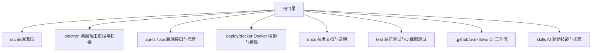
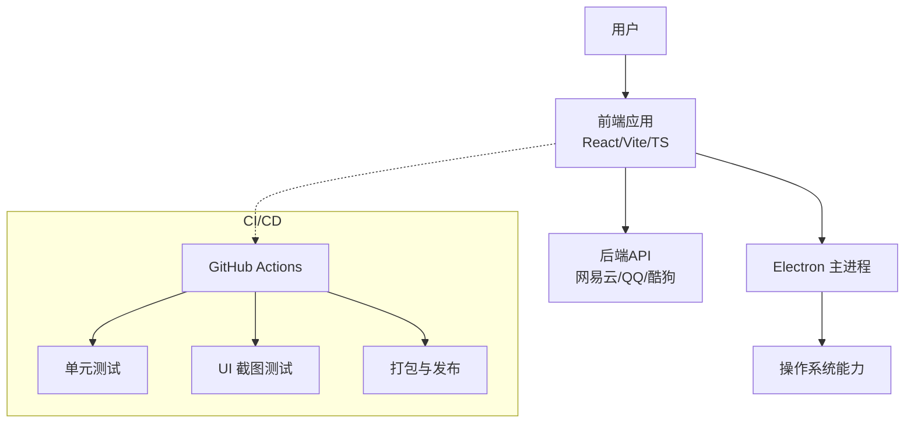
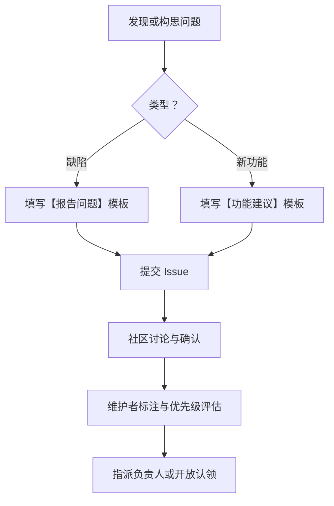
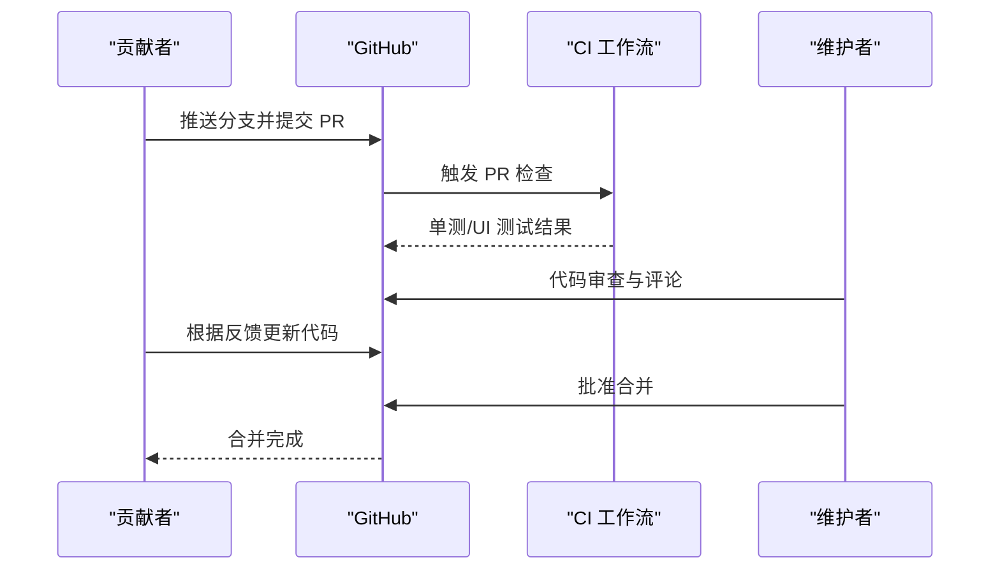
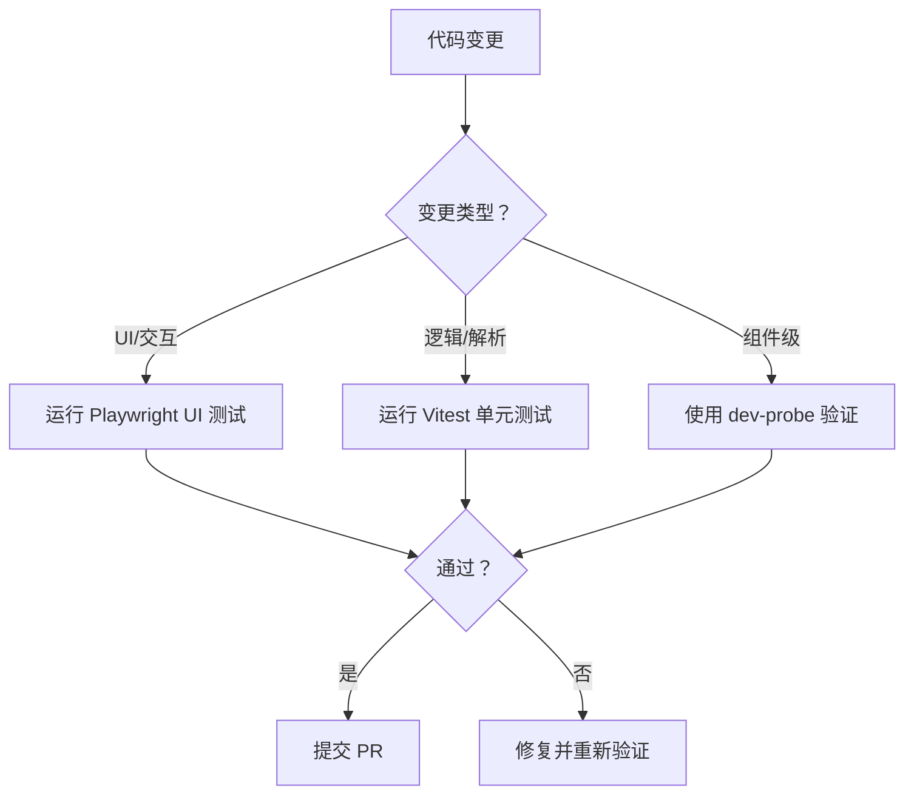
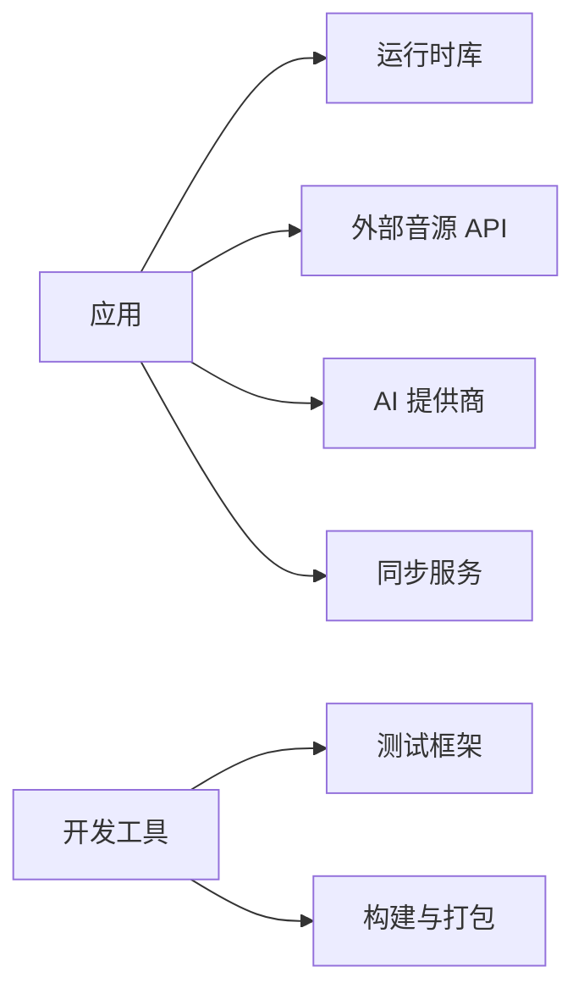

# 社区与贡献

<cite>
**本文引用的文件**
- [README.md](file://README.md)
- [CONTRIBUTORS.md](file://CONTRIBUTORS.md)
- [package.json](file://package.json)
- [报告问题.md](file://.github/ISSUE_TEMPLATE/报告问题.md)
- [功能建议.md](file://.github/ISSUE_TEMPLATE/功能建议.md)
- [technical.md](file://docs/technical.md)
- [testing-strategy/SKILL.md](file://skills/testing-strategy/SKILL.md)
- [.editorconfig](file://.editorconfig)
- [.gitignore](file://.gitignore)
- [electron-release.yml](file://.github/workflows/electron-release.yml)
- [pr-unit-tests.yml](file://.github/workflows/pr-unit-tests.yml)
</cite>

## 目录
1. [简介](#简介)
2. [项目结构](#项目结构)
3. [核心组件](#核心组件)
4. [架构总览](#架构总览)
5. [详细组件分析](#详细组件分析)
6. [依赖分析](#依赖分析)
7. [性能考虑](#性能考虑)
8. [故障排查指南](#故障排查指南)
9. [结论](#结论)
10. [附录](#附录)

## 简介
本指南面向希望参与 Folia Player 开发与维护的社区成员，涵盖开源协议、社区交流渠道、贡献者文化、开发环境搭建、代码规范、测试要求、Issue 与 Pull Request 流程，以及项目的治理与决策方式。Folia 是一个以全屏沉浸式歌词播放为核心的在线音乐播放器，提供桌面端与 Web 版本，支持多平台部署与扩展。

- 开源协议：AGPL-3.0（请遵守许可证义务）
- 社区交流：Discord 社群（欢迎加入讨论、获取帮助）
- 贡献者文化：鼓励 Issue 反馈、想法建议、文档改进、测试与代码贡献；贡献记录通过 all-contributors 统计

章节来源
- [README.md:14-21](file://README.md#L14-L21)
- [README.md:212-222](file://README.md#L212-L222)
- [CONTRIBUTORS.md:1-4](file://CONTRIBUTORS.md#L1-L4)

## 项目结构
仓库采用前后端一体化工程组织，前端基于 Vite + React + TypeScript，桌面端基于 Electron，并提供可选同步服务端与多种部署形态。根目录包含构建脚本、工作流、文档、测试与示例探针等。

图表来源
- [package.json:17-50](file://package.json#L17-L50)
- [technical.md:74-97](file://docs/technical.md#L74-L97)

章节来源
- [package.json:17-50](file://package.json#L17-L50)
- [technical.md:74-97](file://docs/technical.md#L74-L97)

## 核心组件
- 前端应用：React + Vite + TypeScript，负责 UI、状态管理、可视化渲染与交互
- 桌面端：Electron 主进程与预加载脚本，集成系统能力与本地资源
- 后端 API：网易云、QQ、酷狗等音源接入与代理
- 同步服务：可选 sync-server，用于跨设备同步外观与主题库
- 测试体系：Vitest 单元测试、Playwright UI 截图测试、手动探针与基准测试
- 发布与 CI：GitHub Actions 工作流负责 PR 检查、打包与发布

章节来源
- [technical.md:74-97](file://docs/technical.md#L74-L97)
- [testing-strategy/SKILL.md:20-138](file://skills/testing-strategy/SKILL.md#L20-L138)

## 架构总览
下图展示了从用户到前端、后端与桌面端的整体交互路径，以及 CI 在 PR 阶段的自动化检查。

图表来源
- [package.json:17-50](file://package.json#L17-L50)
- [technical.md:74-97](file://docs/technical.md#L74-L97)

## 详细组件分析

### 贡献流程与协作规范
- 开源协议：AGPL-3.0。请在提交前了解并遵守许可证要求，尤其是衍生作品的分发与源代码公开义务。
- 社区交流：通过 Discord 社群进行问题求助、功能讨论与协作沟通。
- 贡献者文化：所有类型的贡献（Issue、Bug 报告、想法、文档、设计、测试、代码）均被认可，并通过 all-contributors 机制记录。

章节来源
- [README.md:247-249](file://README.md#L247-L249)
- [README.md:212-222](file://README.md#L212-L222)
- [CONTRIBUTORS.md:1-4](file://CONTRIBUTORS.md#L1-L4)

### Issue 提交规范
- 报告问题：使用“报告问题”模板，标题以 [BUG] 开头，标签为 bug。需包含问题描述、重现步骤、报错信息、预期行为、截图与环境信息。
- 功能建议：使用“功能建议”模板，标题以 [FEATURE] 开头，标签为 enhancement。需包含需求描述、建议方案与可替代方案。

图表来源
- [报告问题.md:1-42](file://.github/ISSUE_TEMPLATE/报告问题.md#L1-L42)
- [功能建议.md:1-18](file://.github/ISSUE_TEMPLATE/功能建议.md#L1-L18)

章节来源
- [报告问题.md:1-42](file://.github/ISSUE_TEMPLATE/报告问题.md#L1-L42)
- [功能建议.md:1-18](file://.github/ISSUE_TEMPLATE/功能建议.md#L1-L18)

### Pull Request 审核流程
- 分支策略：建议在个人 Fork 上创建功能分支，提交 PR 至 main 或指定分支。
- 自动化检查：PR 会触发单元测试与 UI 截图测试，确保改动质量。
- 代码审查：由维护者进行 Review，关注变更范围、影响面、测试覆盖与兼容性。
- 合并标准：通过 CI、至少一次审查、无阻塞评论后合并。

图表来源
- [pr-unit-tests.yml](file://.github/workflows/pr-unit-tests.yml)
- [electron-release.yml](file://.github/workflows/electron-release.yml)

章节来源
- [pr-unit-tests.yml](file://.github/workflows/pr-unit-tests.yml)
- [electron-release.yml](file://.github/workflows/electron-release.yml)

### 开发环境搭建
- 环境要求：Node.js >= 24（见 engines），推荐使用 vercel dev 以获得接近线上行为的环境。
- 安装依赖：npm install
- 环境变量：复制 .env.example 为 .env.local，按需配置后端 API、AI 提供商与密钥等。
- 启动开发：npm run dev 或 vercel dev；Electron 开发模式使用 npm run dev:electron。
- 常用脚本：构建、预览、类型检查、测试、Stage 联调台等。

章节来源
- [technical.md:117-223](file://docs/technical.md#L117-L223)
- [package.json:17-50](file://package.json#L17-L50)

### 代码规范与风格
- 行尾与换行：统一 LF 行尾，并在文件末尾插入换行符（EditorConfig）。
- 忽略规则：遵循 .gitignore 排除日志、构建产物、本地配置等。
- 命名与模块：参考技术文档中的“代码速查地图”，优先在对应目录新增或修改代码，保持模块边界清晰。

章节来源
- [.editorconfig:1-5](file://.editorconfig#L1-L5)
- [.gitignore:1-88](file://.gitignore#L1-L88)
- [technical.md:245-261](file://docs/technical.md#L245-L261)

### 测试要求与策略
- 单元测试：Vitest，适用于纯逻辑、解析、状态管理与工具函数。
- UI 截图测试：Playwright，适用于页面样式、交互与回归验证。
- 组件探针：dev-probe.html + dev/probes/*.probe.tsx，快速验证单个组件行为。
- 避免全量构建：已有热加载服务时，优先读取现有报错与最小验证。

图表来源
- [testing-strategy/SKILL.md:20-138](file://skills/testing-strategy/SKILL.md#L20-L138)

章节来源
- [testing-strategy/SKILL.md:20-138](file://skills/testing-strategy/SKILL.md#L20-L138)

### 治理模式与决策流程
- 社区驱动：通过 Issue 与 PR 推进功能与修复，Discord 作为日常沟通渠道。
- 维护者评审：关键变更需经维护者审查与批准，确保一致性与稳定性。
- 发布通道：Realeco（正式版）、Limo（Nightly）、Cielo（Canary），不同通道面向不同受众与风险偏好。
- 决策原则：以用户体验、稳定性与可维护性为核心，结合社区反馈与技术评估。

章节来源
- [technical.md:12-23](file://docs/technical.md#L12-L23)
- [README.md:212-222](file://README.md#L212-L222)

## 依赖分析
- 运行时依赖：React、Vite、TypeScript、Tailwind、Electron、i18next、PixiJS、Three.js 等
- 开发依赖：Vitest、Playwright、electron-builder、concurrently 等
- 外部服务：网易云、QQ、酷狗 API；可选 Google Gemini/OpenAI 兼容接口；可选 sync-server

图表来源
- [package.json:181-247](file://package.json#L181-L247)
- [technical.md:74-97](file://docs/technical.md#L74-L97)

章节来源
- [package.json:181-247](file://package.json#L181-L247)
- [technical.md:74-97](file://docs/technical.md#L74-L97)

## 性能考虑
- 避免不必要的构建：在已有热加载服务时，优先读取终端错误与浏览器反馈，减少重复构建。
- 聚焦最小验证：小改动使用最小必要测试，避免全量跑测。
- 合理选择测试：UI 改动用 Playwright，纯逻辑用 Vitest，组件级行为用探针。
- 注意资源与缓存：歌词解析、主题缓存、同步与 IndexedDB 边界需在测试中 mock，避免连接真实服务。

章节来源
- [testing-strategy/SKILL.md:10-19](file://skills/testing-strategy/SKILL.md#L10-L19)
- [testing-strategy/SKILL.md:20-138](file://skills/testing-strategy/SKILL.md#L20-L138)

## 故障排查指南
- 收集信息：使用“报告问题”模板，提供重现步骤、控制台报错、环境与版本信息。
- 定位问题：优先阅读现有开发服务器报错与日志，必要时启用调试叠加层或 Stage 联调台。
- 复现与验证：在最小环境中复现问题，补充必要的单测或 UI 截图用例。
- 常见环境：确保 Node 版本满足要求，正确配置环境变量，区分 Web 与 Electron 的运行差异。

章节来源
- [报告问题.md:10-42](file://.github/ISSUE_TEMPLATE/报告问题.md#L10-L42)
- [technical.md:117-223](file://docs/technical.md#L117-L223)

## 结论
Folia Player 鼓励开放协作与持续改进。通过清晰的 Issue 与 PR 流程、完善的测试体系与透明的发布通道，社区成员可以高效地参与讨论、报告问题、提交改进建议与代码贡献。请遵守 AGPL-3.0 协议，加入 Discord 社群，共同推动项目发展。

## 附录
- 快速开始
  - 安装依赖：npm install
  - 配置环境变量：复制 .env.example 为 .env.local 并填写必要变量
  - 启动开发：npm run dev 或 vercel dev；Electron 模式：npm run dev:electron
- 常用命令
  - 类型检查：npm run typecheck
  - 单元测试：npm run test:unit
  - UI 测试：npm run test:ui
  - 构建与预览：npm run build / npm run preview
  - Stage 联调台：npm run stage:client
- 资源链接
  - 使用指南：https://folia-site.cielaniska.top/guide/
  - 技术与开发说明：docs/technical.md
  - Discord 社群：README 中提供的链接

章节来源
- [technical.md:225-240](file://docs/technical.md#L225-L240)
- [README.md:187-191](file://README.md#L187-L191)
- [README.md:212-216](file://README.md#L212-L216)