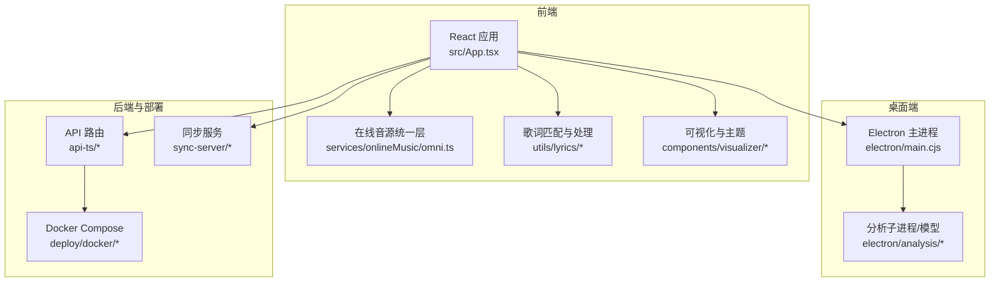
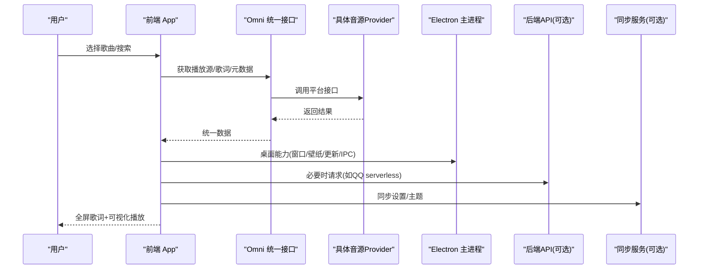
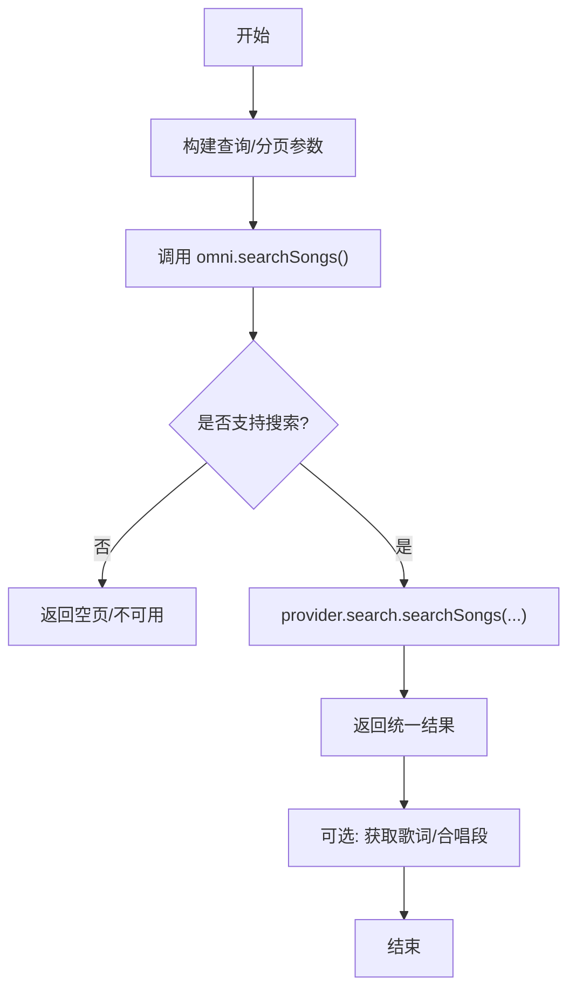
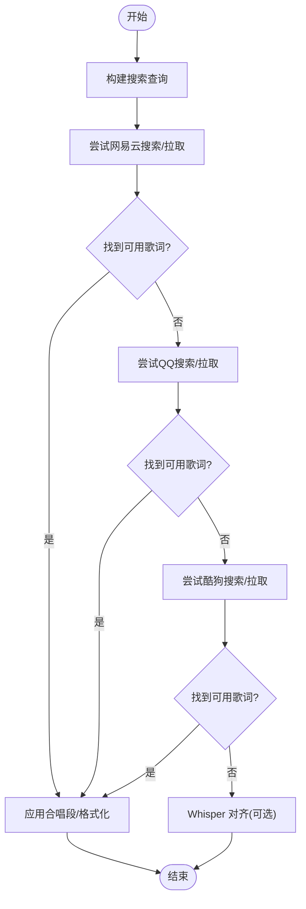
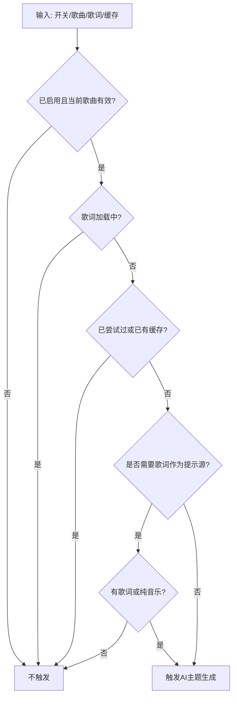
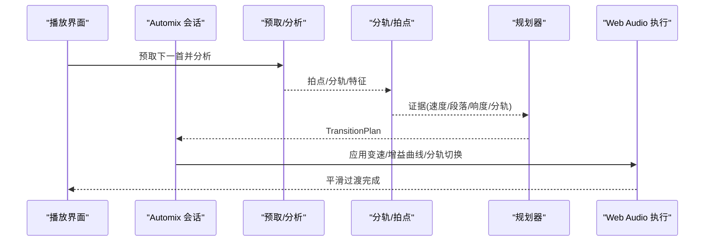
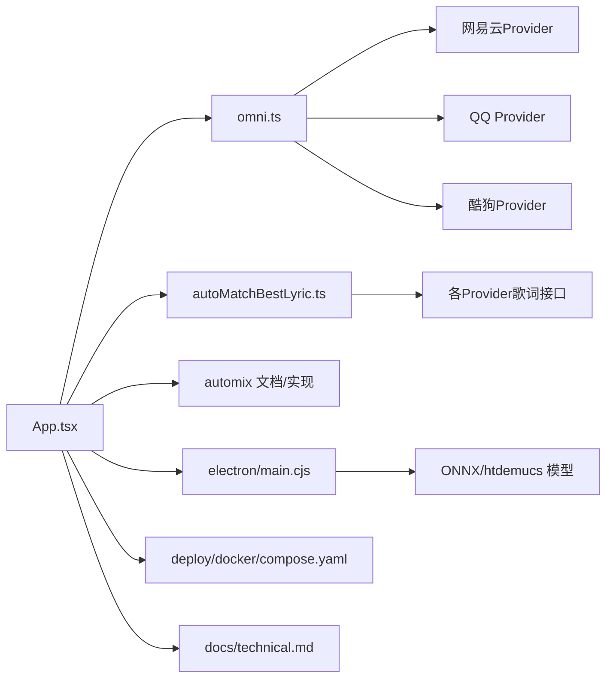

# 项目概述

<cite>
**本文引用的文件**
- [README.md](file://README.md)
- [package.json](file://package.json)
- [src/App.tsx](file://src/App.tsx)
- [electron/main.cjs](file://electron/main.cjs)
- [src/services/onlineMusic/omni.ts](file://src/services/onlineMusic/omni.ts)
- [src/utils/lyrics/autoMatchBestLyric.ts](file://src/utils/lyrics/autoMatchBestLyric.ts)
- [src/utils/songThemeAutoGeneration.ts](file://src/utils/songThemeAutoGeneration.ts)
- [src/services/automix/README.md](file://src/services/automix/README.md)
- [src/hooks/useElectronPlaybackBridge.ts](file://src/hooks/useElectronPlaybackBridge.ts)
- [deploy/docker/compose.yaml](file://deploy/docker/compose.yaml)
- [docs/technical.md](file://docs/technical.md)
</cite>

## 目录
1. [简介](#简介)
2. [项目结构](#项目结构)
3. [核心组件](#核心组件)
4. [架构总览](#架构总览)
5. [详细组件分析](#详细组件分析)
6. [依赖关系分析](#依赖关系分析)
7. [性能考量](#性能考量)
8. [故障排查指南](#故障排查指南)
9. [结论](#结论)
10. [附录](#附录)

## 简介
Folia 是一款以“全屏沉浸式歌词播放”为核心的在线音乐播放器，支持网易云音乐、QQ 音乐、酷狗音乐以及本地音乐库与 Navidrome。它提供 Electron 桌面端（Windows/macOS/Linux）与基于 Node.js 的 Web 版本，可一键部署到 Vercel/Cloudflare，也支持 Docker Compose 全栈自托管。项目通过统一接口抽象多平台音源，内置智能歌词匹配、AI 主题生成、自动化混音等能力，兼顾易用性与可扩展性。

- 定位：面向“沉浸式歌词体验”的全屏播放器，强调视觉与音频的深度融合。
- 双形态：Electron 桌面应用 + Web 应用，共享同一前端代码与核心服务层。
- 多提供商：网易云、QQ、酷狗等在线音源统一接入，本地与自建 NAS（Navidrome）亦受支持。
- 核心特性：智能歌词匹配、AI 主题生成、自动化混音、多种可视化主题、OBS/Stage API 集成、PWA 支持。
- 开源协议：AGPL-3.0；社区生态包含 Discord、贡献者名单与技能文档。

章节来源
- [README.md:66-73](file://README.md#L66-L73)
- [README.md:141-151](file://README.md#L141-L151)
- [README.md:153-185](file://README.md#L153-L185)
- [README.md:193-204](file://README.md#L193-L204)
- [README.md:247-249](file://README.md#L247-L249)

## 项目结构
仓库采用“功能域 + 平台适配”的分层组织方式：
- 前端 React 应用：src 下按组件、服务、工具、类型、工作线程划分，承载 UI、播放控制、可视化、设置与状态管理。
- 桌面端主进程：electron 目录实现窗口、系统能力、更新、壁纸模式、IPC、分析子进程等。
- 在线音源统一层：services/onlineMusic 提供 Omni 统一接口，屏蔽各平台差异。
- 歌词与匹配：utils/lyrics 提供解析、搜索、匹配、对齐、渲染提示等。
- 自动化混音：services/automix 提供离线分析、神经网络推理、乐理决策与执行。
- 部署与后端：api/api-ts 提供服务端路由；deploy/docker 提供 Docker Compose 编排；sync-server 提供跨设备同步服务。
- 测试与文档：test 覆盖单元、UI、手动脚本；docs 收录技术说明与部署指南。

图表来源
- [src/App.tsx:1-120](file://src/App.tsx#L1-L120)
- [src/services/onlineMusic/omni.ts:1-120](file://src/services/onlineMusic/omni.ts#L1-L120)
- [electron/main.cjs:1-120](file://electron/main.cjs#L1-L120)
- [deploy/docker/compose.yaml:1-120](file://deploy/docker/compose.yaml#L1-L120)

章节来源
- [package.json:17-50](file://package.json#L17-L50)
- [docs/technical.md:74-121](file://docs/technical.md#L74-L121)

## 核心组件
- 应用外壳与播放中枢：App.tsx 负责全局状态、播放桥、歌词时间轴、主题与可视化联动、自动对齐、会话恢复等。
- 在线音源统一接口：omni.ts 将网易云/QQ/酷狗等平台封装为统一的搜索、播放、收藏、歌单、推荐、歌词等能力。
- 智能歌词匹配：autoMatchBestLyric.ts 在多平台间搜索并择优匹配，支持纯音乐识别、AMLL TTML 高质量词库、Whisper 逐字对齐。
- AI 主题生成：songThemeAutoGeneration.ts 决定何时触发主题生成，结合歌词/封面/纯音乐标记生成沉浸式背景与配色。
- 自动化混音：services/automix 提供离线分析、Beat This! 拍点检测、htdemucs 分轨、乐理决策与采样级调度，实现“无缝衔接”。
- 桌面端能力：main.cjs 提供窗口、壁纸模式、Wayland/X11 兼容、更新通道、Discord Rich Presence、歌词接口、分析子进程等。
- 部署与同步：Docker Compose 编排前后端与 QQ API；sync-server 提供跨设备外观与主题同步。

章节来源
- [src/App.tsx:123-224](file://src/App.tsx#L123-L224)
- [src/services/onlineMusic/omni.ts:74-155](file://src/services/onlineMusic/omni.ts#L74-L155)
- [src/utils/lyrics/autoMatchBestLyric.ts:164-179](file://src/utils/lyrics/autoMatchBestLyric.ts#L164-L179)
- [src/utils/songThemeAutoGeneration.ts:1-51](file://src/utils/songThemeAutoGeneration.ts#L1-L51)
- [src/services/automix/README.md:8-24](file://src/services/automix/README.md#L8-L24)
- [electron/main.cjs:1-120](file://electron/main.cjs#L1-L120)
- [deploy/docker/compose.yaml:1-120](file://deploy/docker/compose.yaml#L1-L120)

## 架构总览
Folia 采用“前端 React + 可选 Electron 主进程 + 可选后端 API + 可选同步服务”的组合：
- 前端：React + Vite，统一状态与播放控制，驱动可视化与全屏歌词。
- 桌面端：Electron 主进程扩展系统能力（窗口、壁纸、更新、IPC），并通过 utilityProcess 运行重型分析任务。
- 在线音源：Omni 统一接口屏蔽平台差异，按需调用各 Provider。
- 后端：Vercel/Cloudflare/Node 部署，提供 QQ 音乐 serverless 入口与代理；网易云/酷狗可通过自有实例或 Electron 内嵌模块。
- 同步：可选 sync-server（Cloudflare Workers/D1 或 Docker/Node）。

图表来源
- [src/App.tsx:123-224](file://src/App.tsx#L123-L224)
- [src/services/onlineMusic/omni.ts:74-155](file://src/services/onlineMusic/omni.ts#L74-L155)
- [electron/main.cjs:1-120](file://electron/main.cjs#L1-L120)
- [docs/technical.md:74-121](file://docs/technical.md#L74-L121)

## 详细组件分析

### 在线音源统一接口（Omni）
- 职责：聚合网易云/QQ/酷狗等平台能力，暴露统一的搜索、登录、收藏、歌单、推荐、歌词、可用性判断等方法。
- 设计要点：
  - 通过 providerRegistry 动态获取当前活跃 Provider，避免硬编码。
  - 对不支持的能力返回空结果或抛出明确错误，便于 UI 降级。
  - 维护账号缓存与集合刷新，保证界面一致性。
- 典型流程：搜索歌曲 → 选择 Provider → 获取音频源 → 获取歌词 → 合并合唱段信息。

图表来源
- [src/services/onlineMusic/omni.ts:151-162](file://src/services/onlineMusic/omni.ts#L151-L162)
- [src/services/onlineMusic/omni.ts:419-428](file://src/services/onlineMusic/omni.ts#L419-L428)

章节来源
- [src/services/onlineMusic/omni.ts:74-155](file://src/services/onlineMusic/omni.ts#L74-L155)
- [src/services/onlineMusic/omni.ts:405-428](file://src/services/onlineMusic/omni.ts#L405-L428)

### 智能歌词匹配
- 目标：在网易云/QQ/酷狗之间自动匹配最佳逐字歌词，必要时使用 AMLL TTML 数据库或 Whisper 对齐。
- 关键策略：
  - 优先级：网易云 > QQ > 酷狗；支持精确候选回退。
  - 超时保护：搜索与拉取均设超时，避免阻塞。
  - 纯音乐识别：若某平台返回纯音乐标记则直接短路。
  - 合唱段增强：从提供方获取合唱区间并应用到最终歌词。
  - Whisper 对齐：当仅有线级歌词时，尝试生成逐字时间戳。
- 输出：标准化 LyricData，附带来源与平台标识。

图表来源
- [src/utils/lyrics/autoMatchBestLyric.ts:164-179](file://src/utils/lyrics/autoMatchBestLyric.ts#L164-L179)
- [src/utils/lyrics/autoMatchBestLyric.ts:209-291](file://src/utils/lyrics/autoMatchBestLyric.ts#L209-L291)
- [src/utils/lyrics/autoMatchBestLyric.ts:349-364](file://src/utils/lyrics/autoMatchBestLyric.ts#L349-L364)
- [src/utils/lyrics/autoMatchBestLyric.ts:544-576](file://src/utils/lyrics/autoMatchBestLyric.ts#L544-L576)

章节来源
- [src/utils/lyrics/autoMatchBestLyric.ts:164-179](file://src/utils/lyrics/autoMatchBestLyric.ts#L164-L179)
- [src/utils/lyrics/autoMatchBestLyric.ts:209-291](file://src/utils/lyrics/autoMatchBestLyric.ts#L209-L291)
- [src/utils/lyrics/autoMatchBestLyric.ts:349-364](file://src/utils/lyrics/autoMatchBestLyric.ts#L349-L364)
- [src/utils/lyrics/autoMatchBestLyric.ts:544-576](file://src/utils/lyrics/autoMatchBestLyric.ts#L544-L576)

### AI 主题生成
- 触发条件：启用开关、当前歌曲存在、未正在加载歌词、尚未尝试过、无缓存主题；对于封面派生主题无需歌词作为提示源。
- 输入：歌曲键、歌词状态、是否纯音乐、是否已尝试/缓存。
- 输出：决定是否向 AI 发起主题生成请求。

图表来源
- [src/utils/songThemeAutoGeneration.ts:18-51](file://src/utils/songThemeAutoGeneration.ts#L18-L51)

章节来源
- [src/utils/songThemeAutoGeneration.ts:1-51](file://src/utils/songThemeAutoGeneration.ts#L1-L51)

### 自动化混音（Automix）
- 目标：上一首尾段与下一首前奏自然衔接，支持四种接法（节拍切、低频交换、尾骑、普通淡入淡出）与表现模式（build-up）。
- 分层：证据层（离线分析/拍点/分轨）、决策层（乐理规则/规划器）、执行层（Web Audio 节点链/变速/限幅）、绑定层（React 双 Deck）。
- 关键实现：
  - Beat This! 拍点检测与 htdemucs 分轨在 utilityProcess 中运行，避免阻塞主线程。
  - 时钟拟合与变速对齐确保相位一致。
  - 软限幅总线防止叠加削波。
  - 表现模式在交接点前插入 build-up，强度由测量决定。

图表来源
- [src/services/automix/README.md:70-109](file://src/services/automix/README.md#L70-L109)
- [src/services/automix/README.md:178-223](file://src/services/automix/README.md#L178-L223)
- [src/services/automix/README.md:224-253](file://src/services/automix/README.md#L224-L253)
- [src/services/automix/README.md:254-278](file://src/services/automix/README.md#L254-L278)

章节来源
- [src/services/automix/README.md:8-24](file://src/services/automix/README.md#L8-L24)
- [src/services/automix/README.md:70-109](file://src/services/automix/README.md#L70-L109)
- [src/services/automix/README.md:178-223](file://src/services/automix/README.md#L178-L223)
- [src/services/automix/README.md:224-253](file://src/services/automix/README.md#L224-L253)
- [src/services/automix/README.md:254-278](file://src/services/automix/README.md#L254-L278)

### 桌面端与系统集成
- 窗口与系统：Wayland/X11 兼容、壁纸模式（X11/Wayland/Windows）、点击穿透、隐藏任务栏、显示休眠阻止。
- 更新与安全：更新通道、证书白名单、密码存储后端选择。
- 分析与模型：utilityProcess 隔离 ONNX 推理，避免主进程卡顿。
- 外部集成：Discord Rich Presence、OBS Browser Source、歌词接口（本地环回）。

章节来源
- [electron/main.cjs:1-120](file://electron/main.cjs#L1-L120)
- [electron/main.cjs:145-226](file://electron/main.cjs#L145-L226)
- [electron/main.cjs:242-311](file://electron/main.cjs#L242-L311)
- [electron/main.cjs:325-416](file://electron/main.cjs#L325-L416)
- [docs/technical.md:8-23](file://docs/technical.md#L8-L23)

### 部署与同步
- Web 部署：Vercel/Cloudflare 一键部署，环境变量配置简单。
- Docker Compose：前后端与 QQ API 容器化编排，支持反向代理与 HTTPS。
- 同步服务：Cloudflare Workers/D1 或 Docker/Node，跨设备同步外观与主题。

章节来源
- [README.md:153-185](file://README.md#L153-L185)
- [README.md:193-204](file://README.md#L193-L204)
- [docs/technical.md:74-121](file://docs/technical.md#L74-L121)
- [deploy/docker/compose.yaml:1-120](file://deploy/docker/compose.yaml#L1-L120)

## 依赖关系分析
- 前端与桌面端：App.tsx 通过 hooks 与 electron/main.cjs 提供的 IPC/能力进行交互（如播放桥、窗口行为、壁纸模式）。
- 在线音源：omni.ts 依赖 providerRegistry 与具体 Provider（网易云/QQ/酷狗），对外暴露统一方法。
- 歌词匹配：autoMatchBestLyric.ts 依赖各 Provider 的搜索/歌词能力，并可回退至 AMLL 数据库与 Whisper。
- 自动化混音：automix README 描述的分析/决策/执行链路，依赖 onnxruntime-node 与 htdemucs 模型（utilityProcess）。
- 部署：compose.yaml 编排后端与网关，technical.md 说明环境变量与部署差异。

图表来源
- [src/App.tsx:123-224](file://src/App.tsx#L123-L224)
- [src/services/onlineMusic/omni.ts:74-155](file://src/services/onlineMusic/omni.ts#L74-L155)
- [src/utils/lyrics/autoMatchBestLyric.ts:164-179](file://src/utils/lyrics/autoMatchBestLyric.ts#L164-L179)
- [src/services/automix/README.md:178-223](file://src/services/automix/README.md#L178-L223)
- [electron/main.cjs:1-120](file://electron/main.cjs#L1-L120)
- [deploy/docker/compose.yaml:1-120](file://deploy/docker/compose.yaml#L1-L120)
- [docs/technical.md:74-121](file://docs/technical.md#L74-L121)

章节来源
- [src/services/onlineMusic/omni.ts:74-155](file://src/services/onlineMusic/omni.ts#L74-L155)
- [src/utils/lyrics/autoMatchBestLyric.ts:164-179](file://src/utils/lyrics/autoMatchBestLyric.ts#L164-L179)
- [src/services/automix/README.md:178-223](file://src/services/automix/README.md#L178-L223)
- [electron/main.cjs:1-120](file://electron/main.cjs#L1-L120)
- [deploy/docker/compose.yaml:1-120](file://deploy/docker/compose.yaml#L1-L120)
- [docs/technical.md:74-121](file://docs/technical.md#L74-L121)

## 性能考量
- 分析任务隔离：Beat This! 与 htdemucs 在 utilityProcess 中运行，避免主进程长时间阻塞。
- 线程让出：离线分析按毫秒预算让出主线程（约 8ms），避免可见卡顿。
- 时钟拟合：deckClock 拟合 currentTime 阶梯读数，降低相位误差。
- 软限幅：stem 总线软限幅避免叠加削波，提升听感稳定性。
- 浏览器 vs 桌面：浏览器构建缺失分轨与部分能力，自动降级到交叉淡化与内置估算器。

章节来源
- [src/services/automix/README.md:178-223](file://src/services/automix/README.md#L178-L223)
- [src/services/automix/README.md:254-278](file://src/services/automix/README.md#L254-L278)
- [src/services/automix/README.md:287-329](file://src/services/automix/README.md#L287-L329)
- [src/services/automix/README.md:405-426](file://src/services/automix/README.md#L405-L426)

## 故障排查指南
- 在线音源不可用：检查 Provider 可用性、网络与 CORS；确认环境变量（如 VITE_NETEASE_API_BASE、VITE_QQ_API_BASE）。
- 歌词匹配失败：查看日志中的超时与错误；确认是否有线级歌词用于 Whisper 对齐；必要时手动修正匹配。
- 自动化混音异常：确认桌面端权重是否就绪；检查 utilityProcess 是否正常拉起；验证分轨与拍点是否成功。
- 桌面端问题：Wayland/X11 兼容性、壁纸模式崩溃回退、更新通道失败、证书白名单限制。
- 部署问题：Vercel/Cloudflare 环境变量缺失；QQ serverless 需配置 QQ_SESSION_SECRET；Docker 反向代理与 HTTPS 要求。

章节来源
- [docs/technical.md:74-121](file://docs/technical.md#L74-L121)
- [src/utils/lyrics/autoMatchBestLyric.ts:144-162](file://src/utils/lyrics/autoMatchBestLyric.ts#L144-L162)
- [src/services/automix/README.md:405-426](file://src/services/automix/README.md#L405-L426)
- [electron/main.cjs:56-76](file://electron/main.cjs#L56-L76)

## 结论
Folia 以“全屏沉浸式歌词”为核心，构建了统一的多平台音源接入、强大的歌词匹配与 AI 主题生成、以及专业的自动化混音体系。其 Electron 与 Web 双形态、丰富的可视化与集成能力，使其既适合个人深度使用，也便于团队二次开发与部署。遵循 AGPL-3.0 开源协议，配合完善的文档与社区生态，为初学者提供了清晰的学习路径，也为资深开发者提供了深入的技术空间。

## 附录
- 获取与部署：参考 README 与 technical.md 的一键部署、环境变量与 Docker Compose 说明。
- 社区与贡献：加入 Discord，查看贡献者名单与技能文档，遵循贡献规范参与改进。
- 许可证：AGPL-3.0，请遵守开源协议与版权要求。

章节来源
- [README.md:153-185](file://README.md#L153-L185)
- [README.md:212-232](file://README.md#L212-L232)
- [README.md:247-249](file://README.md#L247-L249)
- [docs/technical.md:74-121](file://docs/technical.md#L74-L121)