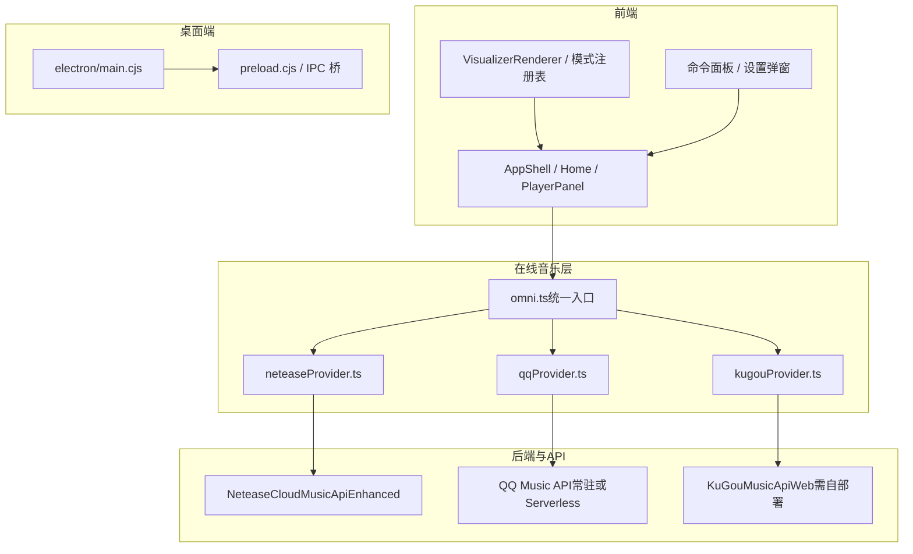
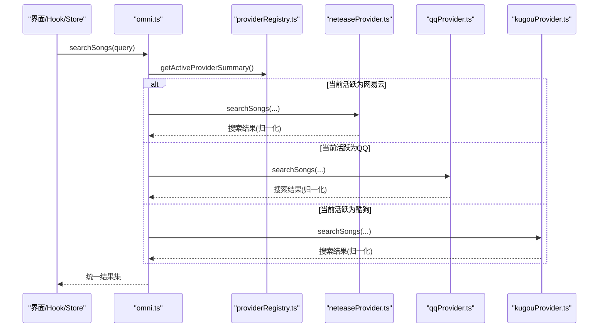
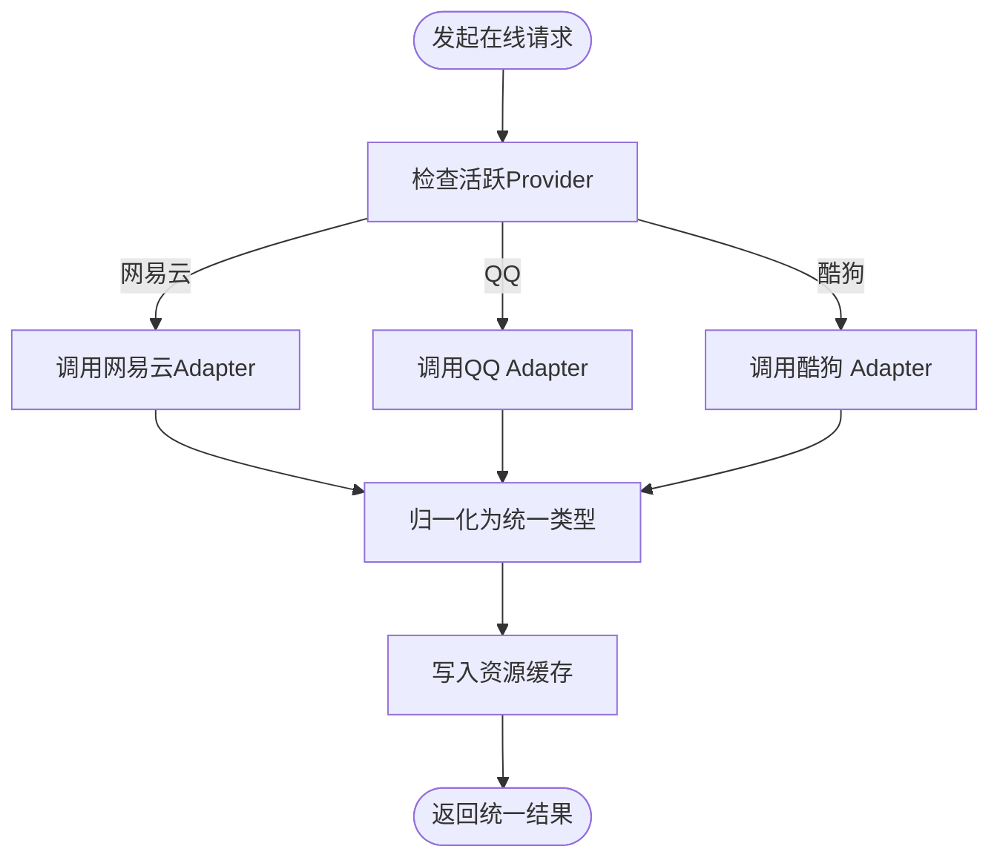
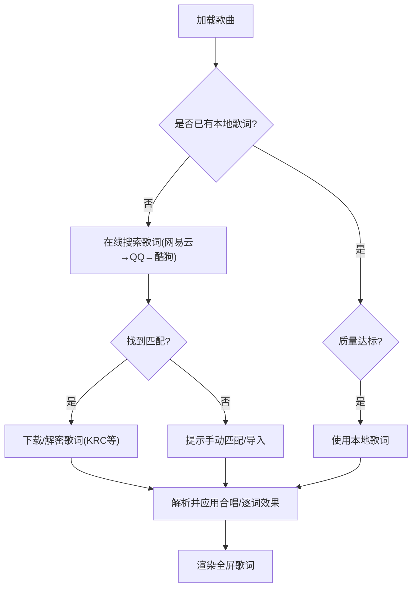
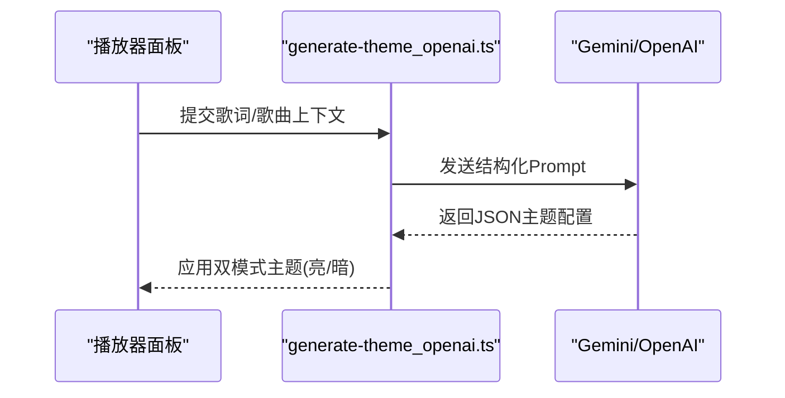
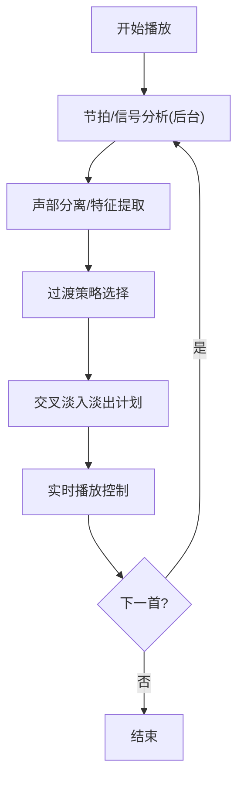
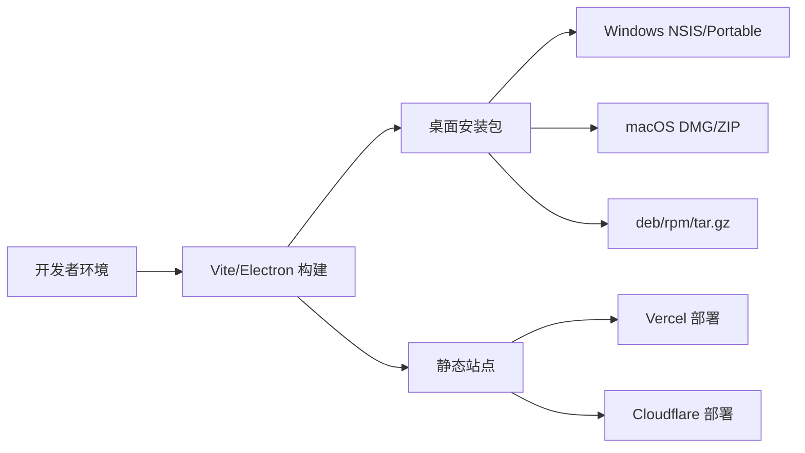
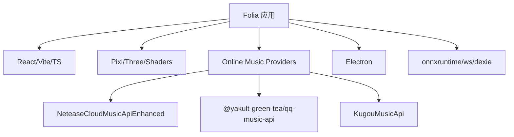

# 项目简介与特性

<cite>
**本文引用的文件**
- [README.md](file://README.md)
- [package.json](file://package.json)
- [src/README.md](file://src/README.md)
- [docs/technical.md](file://docs/technical.md)
- [src/services/onlineMusic/README.md](file://src/services/onlineMusic/README.md)
- [src/utils/aiThemePrompts.ts](file://src/utils/aiThemePrompts.ts)
- [worker/generate-theme_openai.ts](file://worker/generate-theme_openai.ts)
- [src/types.ts](file://src/types.ts)
- [CONTRIBUTORS.md](file://CONTRIBUTORS.md)
</cite>

## 目录
1. [引言](#引言)
2. [项目结构](#项目结构)
3. [核心组件](#核心组件)
4. [架构总览](#架构总览)
5. [详细组件分析](#详细组件分析)
6. [依赖分析](#依赖分析)
7. [性能考虑](#性能考虑)
8. [故障排查指南](#故障排查指南)
9. [结论](#结论)
10. [附录](#附录)

## 引言
Folia 是一款以“全屏沉浸式歌词播放”为核心的在线音乐播放器，强调辞曲合一的视听体验。它支持网易云音乐、QQ 音乐、酷狗音乐等在线音源，提供智能歌词匹配、AI 主题生成、自动化混音等创新能力；同时提供 Electron 桌面应用与 Web 应用两种部署形态，满足多平台使用需求。

本仓库为 Fork 版本，包含若干独有增强（如 Sonnet 可视化镜头过渡优化、Windows Portable 构建目标、开发快捷键调整等），并保留上游项目的完整功能与生态。

**章节来源**
- [README.md:66-73](file://README.md#L66-L73)
- [README.md:35-59](file://README.md#L35-L59)

## 项目结构
Folia 采用前后端分离与模块化组织：前端基于 React + Vite + TypeScript，UI 与可视化渲染解耦；在线音乐通过统一的 Omni 层对接多个 Provider；Electron 主进程负责桌面能力与本地 API 桥接；可选同步服务用于跨设备设置与主题同步。

**图表来源**
- [src/README.md:5-37](file://src/README.md#L5-L37)
- [src/services/onlineMusic/README.md:5-18](file://src/services/onlineMusic/README.md#L5-L18)
- [docs/technical.md:76-83](file://docs/technical.md#L76-L83)

**章节来源**
- [src/README.md:5-37](file://src/README.md#L5-L37)
- [src/services/onlineMusic/README.md:5-18](file://src/services/onlineMusic/README.md#L5-L18)
- [docs/technical.md:76-83](file://docs/technical.md#L76-L83)

## 核心组件
- 在线音乐统一接入层（Omni）：屏蔽各音源差异，提供搜索、播放、歌词、收藏、推荐等统一接口。
- 多 Provider 适配：网易云、QQ 音乐、酷狗音乐，分别封装认证、传输与归一化逻辑。
- 歌词系统：解析多种格式（LRC/VTT/TTML/QRC/YRC/KRC），支持逐词时间轴、合唱段识别、歌词偏移记忆与手动修正。
- 可视化与主题：内置多种视觉模式（如 sonnet、tempera、diorama 等），支持 AI 根据歌曲情绪与歌词生成双模式主题。
- 自动化混音（Automix）：节拍检测、声部分离、过渡规划与交叉淡入淡出，实现平滑曲目衔接。
- 桌面与 Web：Electron 打包桌面应用；Vite 构建 Web 应用，支持 Vercel/Cloudflare 一键部署与 PWA。

**章节来源**
- [src/services/onlineMusic/README.md:22-53](file://src/services/onlineMusic/README.md#L22-L53)
- [src/types.ts:1094-1141](file://src/types.ts#L1094-L1141)
- [src/components/visualizer/README.md](file://src/components/visualizer/README.md)
- [src/services/automix/README.md](file://src/services/automix/README.md)
- [docs/technical.md:109-121](file://docs/technical.md#L109-L121)

## 架构总览
Folia 的在线音乐访问遵循“组件/Hook/Store → Omni → Provider 注册表 → 具体 Provider → Transport/API”的分层设计，确保调用方不直接耦合具体音源实现。

**图表来源**
- [src/services/onlineMusic/README.md:5-18](file://src/services/onlineMusic/README.md#L5-L18)
- [src/services/onlineMusic/README.md:55-88](file://src/services/onlineMusic/README.md#L55-L88)

**章节来源**
- [src/services/onlineMusic/README.md:5-18](file://src/services/onlineMusic/README.md#L5-L18)
- [src/services/onlineMusic/README.md:55-88](file://src/services/onlineMusic/README.md#L55-L88)

## 详细组件分析

### 在线音乐提供商与统一接入
- 统一入口：所有在线歌曲数据通过 `omni.ts` 暴露，避免组件直接调用 provider。
- Provider 注册：当前注册网易云、QQ 音乐、酷狗音乐；Navidrome 作为独立 Subsonic 服务不在 Omni 内。
- 账号与缓存：按 provider 保存用户、集合、点赞 ID 等快照；资源缓存覆盖音频、歌词、封面、主题、ReplayGain。
- 路由规则：普通单 provider 流程与显式跨 provider 流程分离，保证身份与去重语义清晰。

**图表来源**
- [src/services/onlineMusic/README.md:22-53](file://src/services/onlineMusic/README.md#L22-L53)
- [src/services/onlineMusic/README.md:55-88](file://src/services/onlineMusic/README.md#L55-L88)

**章节来源**
- [src/services/onlineMusic/README.md:22-53](file://src/services/onlineMusic/README.md#L22-L53)
- [src/services/onlineMusic/README.md:55-88](file://src/services/onlineMusic/README.md#L55-L88)

### 智能歌词匹配与多格式支持
- 支持格式：自动识别 `.lrc/.vtt/.ttml/.qrc/.yrc/.krc`，以及内嵌 LRC；适配增强型逐字歌词。
- 匹配策略：优先在线匹配（网易云、QQ、酷狗依次回退），失败可手动选择候选或恢复首次导入信息。
- 时间轴与合唱：支持合唱段识别、逐词对齐、歌词偏移记忆与全局时间尺规。

**图表来源**
- [README.md:147-149](file://README.md#L147-L149)
- [src/types.ts:1094-1141](file://src/types.ts#L1094-L1141)

**章节来源**
- [README.md:147-149](file://README.md#L147-L149)
- [src/types.ts:1094-1141](file://src/types.ts#L1094-L1141)

### AI 主题生成（双模式）
- 输入：歌词文本、是否纯音乐、歌名等上下文。
- 输出：为浅色/深色模式分别生成主题名称、配色、关键词着色等配置，描述文案采用第一人称文学风格。
- 后端：支持 Google Gemini 与 OpenAI 兼容接口（DeepSeek、ChatGPT 等），可通过环境变量切换。

**图表来源**
- [src/utils/aiThemePrompts.ts:87-95](file://src/utils/aiThemePrompts.ts#L87-L95)
- [worker/generate-theme_openai.ts:325-344](file://worker/generate-theme_openai.ts#L325-L344)

**章节来源**
- [src/utils/aiThemePrompts.ts:87-95](file://src/utils/aiThemePrompts.ts#L87-L95)
- [worker/generate-theme_openai.ts:325-344](file://worker/generate-theme_openai.ts#L325-L344)
- [docs/technical.md:84-91](file://docs/technical.md#L84-L91)

### 自动化混音（Automix）
- 能力：节拍检测、声部分离、过渡规划、交叉淡入淡出、节奏弯曲与手势扩展，实现无缝衔接。
- 线程：分析在后台线程执行，避免阻塞 UI。
- 模型：支持外部模型可用性检测与降级策略。

**图表来源**
- [src/services/automix/README.md](file://src/services/automix/README.md)
- [src/services/automix/analysisOffThread.ts](file://src/services/automix/analysisOffThread.ts)

**章节来源**
- [src/services/automix/README.md](file://src/services/automix/README.md)
- [src/services/automix/analysisOffThread.ts](file://src/services/automix/analysisOffThread.ts)

### 多平台部署能力
- 桌面端：Electron 打包 Windows/macOS/Linux，支持自动更新通道（Realeco/Limo/Cielo）。
- Web 端：Vite 构建，支持 Vercel/Cloudflare 一键部署，支持 PWA 安装到移动端。
- 后端：网易云 API 需自行部署；QQ 音乐支持常驻 Node 或 Serverless；酷狗 Web 需自部署 KuGouMusicApi。

**图表来源**
- [docs/technical.md:12-23](file://docs/technical.md#L12-L23)
- [docs/technical.md:109-121](file://docs/technical.md#L109-L121)
- [package.json:52-179](file://package.json#L52-L179)

**章节来源**
- [docs/technical.md:12-23](file://docs/technical.md#L12-L23)
- [docs/technical.md:109-121](file://docs/technical.md#L109-L121)
- [package.json:52-179](file://package.json#L52-L179)

## 依赖分析
- 运行时依赖：React 19、Vite 6、TypeScript、Tailwind CSS 4、Framer Motion、Electron、i18next。
- 在线音乐：NeteaseCloudMusicApiEnhanced、@yakult-green-tea/qq-music-api、KugouMusicApi（Web 需自部署）。
- 可视化：pixi.js、three.js、@paper-design/shaders-react、@react-three/*。
- 工具链：onnxruntime-node（AI 推理）、ws（WebSocket）、dexie（IndexedDB）。

**图表来源**
- [package.json:181-220](file://package.json#L181-L220)
- [docs/technical.md:263-273](file://docs/technical.md#L263-L273)

**章节来源**
- [package.json:181-220](file://package.json#L181-L220)
- [docs/technical.md:263-273](file://docs/technical.md#L263-L273)

## 性能考虑
- 歌词解析与元数据解析在 Worker 中异步执行，降低主线程压力。
- 在线资源缓存（音频、歌词、封面、主题、ReplayGain）减少重复请求。
- Automix 分析在后台线程进行，避免卡顿。
- 可视化渲染采用 Pixi/Three 高性能图形栈，并提供帧率限制与资源管理。

[本节为通用性能建议，无需特定文件引用]

## 故障排查指南
- 在线音源不可用：检查对应 Provider 的环境变量与后端地址；确认登录态与权限。
- 歌词无法匹配：尝试手动匹配或导入本地歌词；检查网络与代理设置。
- AI 主题生成失败：核对 AI 提供商密钥与模型参数；查看服务端日志。
- 桌面端问题：查看更新通道与日志路径；Linux 下注意 Wayland/Hyprland 窗口规则。

**章节来源**
- [docs/technical.md:143-173](file://docs/technical.md#L143-L173)
- [README.md:224-233](file://README.md#L224-L233)

## 结论
Folia 将“全屏沉浸式歌词播放”作为核心体验，结合多音源接入、智能歌词匹配、AI 主题生成与自动化混音，构建了兼具美学与工程能力的音乐播放器。其 Electron 与 Web 双形态部署，配合可选同步服务，能满足个人与团队在不同场景下的使用需求。开源协议为 AGPL-3.0，社区活跃，欢迎贡献与反馈。

[本节为总结性内容，无需特定文件引用]

## 附录

### 使用场景示例
- 夜间沉浸听歌：开启全屏歌词与 AI 生成的深色主题，搭配柔和背景与逐词高亮。
- 直播/OBS 集成：通过 OBS Browser Source 或 Now Playing 接入，实时展示歌词与封面。
- 移动便携：部署 Web 版后添加至桌面（PWA），随时随地享受沉浸式体验。

[本节为概念性说明，无需特定文件引用]

### 版本与许可证
- 版本：参见 package.json 中的 version。
- 许可证：AGPL-3.0。
- 社区：Discord 社群与贡献者名单见 README 与 CONTRIBUTORS。

**章节来源**
- [package.json:1-15](file://package.json#L1-L15)
- [README.md:247-249](file://README.md#L247-L249)
- [CONTRIBUTORS.md:1-97](file://CONTRIBUTORS.md#L1-L97)